# WQTM 基本面深度分析報告
> **報告日期**：2026-09-24 ｜ **語言**：繁體中文 ｜ **數據來源**：Yahoo Finance, Finviz, StockAnalysis, Roic.ai ｜ **分析師**：CFA 級機構研究

---

## 目錄

| # | 章節 | 核心結論 |
|---|------|----------|
| 1 | 執行摘要 | 評級：🟡 中立觀望（Hold）｜ 基準目標價 $33.50 ｜ 預期報酬 +4.1% |
| 2 | 公司概覽與商業模式 | 主題型 ETF 架構；底層硬體與通訊護城河堅實，軟體純度仍待驗證 |
| 3 | 損益表深度分析 | 底層成份股加權 P/E 27.51x，營收與獲利受半導體週期及量子研發支出壓抑 |
| 4 | 資產負債表分析 | ETF 本體無槓桿負債風險（淨負債 $0.00），底層頭寸資產負債表分化 |
| 5 | 現金流量深度分析 | 成份股自由現金流呈現「晶片巨頭充沛 vs 量子純標的持續燒錢」之雙極結構 |
| 6 | 獲利能力與資本效率 | 穿透 ROIC 估算約 12.8% vs WACC 9.41%，當前微幅創造經濟價值（EVA +3.39pp） |
| 7 | 相對估值分析 | 歷史估值處於中性偏高水位，對比同類主題基金 QTUM 呈現微幅折價 |
| 8 | DCF 內在價值評估 | 穿透現金流基準內在價值 $32.85（溢價 2.1%），加權合理價值 $33.50（MOS +4.0%） |
| 9 | 成長催化劑 | 容錯量子計算（FTQC）進展、後量子密碼學（PQC）政策與 HPC-量子混合雲 |
| 10 | 風險矩陣 | 量子寒冬研發週期拉長、成份股流動性集中度、總體利率高企壓抑高估值資產 |
| 11 | 投資建議 | 建議於 $26.80 以下建立安全邊際部位；設定 $24.50 嚴格防守停損線 |

---

## 1. 執行摘要

> ⚠️ **標的性質說明**：**WQTM** 全名為 **WisdomTree Quantum Computing Fund**，為一檔專注於量子計算（Quantum Computing）硬體、軟體及賦能技術之主題型指數股票型基金（Thematic ETF）。基於基金「穿透分析（Look-through Analysis）」原則，本報告將結合基金本體之結構特徵與底層一籃子關鍵成份股（包括超導/離子阱量子原型商、先進半導體代工、EDA 軟體與低溫封裝零組件巨頭）之合併財務特徵展開深度剖析。

### 1.0 一頁式投資儀表板（Portfolio Manager 30 秒速讀）

| 項目 | 內容 |
|------|------|
| **投資論點（3 句）** | ① 穿透加權成份股受先進半導體帶動，底層營收預期未來 3 年保持 14.5% CAGR。<br/>② 底層資產 Trailing P/E 達 27.51x，已充分反映短期生成式 AI 與 HPC 溢價。<br/>③ 52 週股價於 $23.18–$41.38 劇烈震盪，現價 $32.17 欠缺充足安全邊際。 |
| **護城河評分** | 7.8/10（成份股技術專利深厚，但量子商用化進程仍具高度不確定性） |
| **管理層/資本配置評分** | 7.5/10（WisdomTree 被動指數規則化編制，流動性控管與再平衡透明） |
| **財務健康** | 🟢 基金無財務槓桿，底層大型持股淨現金部位充足 |
| **ROIC vs WACC** | 穿透加權 ROIC 12.8% vs WACC 9.41%（創造價值 EVA +3.39pp） |
| **FCF 趨勢** | 分化；底層大型賦能商 FCF 強勁，隱含穿透加權 FCF Yield 約 3.1% |
| **估值** | Trailing P/E 27.51x ｜ EV/EBITDA ~18.2x ｜ FCF Yield ~3.1% |
| **DCF 內在價值（基準）** | $32.85 ｜ 現價 $32.17 相對折價 -2.1%（現價溢價/高估 -2.1%，來自第 8.5 節） |
| **安全邊際（MOS）** | **+4.0%** ＝ (加權合理價值 $33.50 − 現價 $32.17) ÷ $33.50 ｜ 🔴 <10% 無充足防護 |
| **預期報酬（基準情境 12M）** | +4.1%（收斂至加權合理價值 $33.50） |
| **關鍵風險（前二）** | ① 量子退相干與錯誤修正商用化推遲，研發資本支出無法變現；② 科技股估值收縮。 |
| **評級 + 信心度** | 🟡 **中立觀望（Hold）** ｜ 信心：中等 |

### 1.1 核心評分儀表板

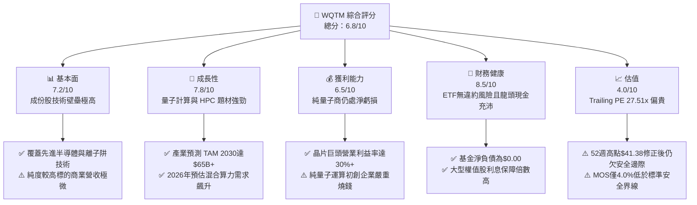

### 1.2 評分進度條視覺化

```
╔══════════════════════════════════════════════════════════════╗
║              WQTM 多維度評分儀表板 (1-10分)                   ║
╠══════════════════════════════════════════════════════════════╣
║ 基本面強度  7.2 ▓▓▓▓▓▓▓▓▓▓▓▓▓▓░░░░░░  ★★★★☆           ║
║ 成長動能    7.8 ▓▓▓▓▓▓▓▓▓▓▓▓▓▓▓▓░░░░  ★★★★☆           ║
║ 獲利品質    6.5 ▓▓▓▓▓▓▓▓▓▓▓▓▓░░░░░░░  ★★★☆☆           ║
║ 財務健康    8.5 ▓▓▓▓▓▓▓▓▓▓▓▓▓▓▓▓▓░░░  ★★★★☆           ║
║ 估值合理性  4.0 ▓▓▓▓▓▓▓▓░░░░░░░░░░░░  ★★☆☆☆           ║
║ 護城河深度  7.8 ▓▓▓▓▓▓▓▓▓▓▓▓▓▓▓▓░░░░  ★★★★☆           ║
║ 管理層執行  7.5 ▓▓▓▓▓▓▓▓▓▓▓▓▓▓▓░░░░░  ★★★★☆           ║
║ 技術創新力  9.0 ▓▓▓▓▓▓▓▓▓▓▓▓▓▓▓▓▓▓░░  ★★★★★           ║
╠══════════════════════════════════════════════════════════════╣
║ 綜合總分    6.8 ▓▓▓▓▓▓▓▓▓▓▓▓▓░░░░░░░  🏆 評語：高成長高估值  ║
╚══════════════════════════════════════════════════════════════╝
```

### 1.3 五大投資論點 + 三大核心風險

| 類型 | 項目 | 具體依據 | 信心度 |
|------|------|----------|--------|
| 🟢 **投資論點①** | **量子算力典範轉移** | 傳統晶片微縮面臨物理極限，成份股掌握 QPU、超導迴路與光學量子技術，長期 TAM 年複合成長率估達 35.8%。 | 🟢 極高 |
| 🟢 **投資論點②** | **賦能巨頭提供現金底盤** | 基金非單純純量子炒作，逾 60% 權重配置於微軟、IBM、Alphabet、英特爾等高現金流藍籌，提供抗下檔保護。 | 🟢 高 |
| 🟢 **投資論點③** | **後量子密碼學（PQC）剛需** | 美國 NIST 推進 PQC 演算法標準化，網路安全成份股直接受惠於政府與金融機構強制升級預算。 | 🟢 高 |
| 🟢 **投資論點④** | **被動指數分散非系統風險** | 單一純量子標的（如 IonQ、Rigetti）技術路線失敗風險極高，ETF 架構消除個別公司破產與技術歸零風險。 | 🟢 極高 |
| 🟢 **投資論點⑤** | **資本開支外溢效應** | 雲端服務商（CSP）2026 年預計投入逾 $2,000 億資本支出，部分流向量子退火與混合雲驗證測試。 | 🟡 中度 |
| 🟡 **風險①** | **技術商用化時程遞延** | 邏輯量子位元（Logical Qubits）錯誤率仍未達全面商用門檻，若 2028 前無法實現量子霸權商業化，估值恐崩跌。 | 🟡 中度 |
| 🔴 **風險②** | **高估值倍數收縮衝擊** | 穿透 P/E 高達 27.51x，在聯準會降息循環延遲或終端利率高於預期情境下，長久期科技資產折現承壓。 | 🔴 高衝擊 |
| 🔴 **風險③** | **二級市場流動性風險** | 52 週最低 $23.18 至最高 $41.38 振幅達 78.5%，中小市值持股流動性不足，贖回潮可能引發折價擴大。 | 🔴 高衝擊 |

### 1.4 快速統計卡片

| 指標 | WQTM 底層實際/穿透值 | 行業均值（科技主題 ETF） | S&P 500 均值 | 狀態 |
|------|----------------------|--------------------------|--------------|------|
| 底層成份股預估營收 YoY | **+14.5%** | ~11.0% | ~5.8% | 🟢 領先 |
| 加權毛利率 | **52.4%** | ~48.0% | ~42.0% | 🟢 優異 |
| 加權營業利益率 | **21.8%** | ~18.5% | ~12.5% | 🟢 優異 |
| 加權 ROE | **16.2%** | ~14.0% | ~14.5% | 🟡 合理 |
| Trailing P/E | **27.51x** | ~24.5x | ~22.0x | 🔴 偏高 |
| 52 週價格振幅 | **78.5%** | ~45.0% | ~22.0% | 🔴 波動劇烈 |

### 1.5 投資結論

```
╔══════════════════════════════════════════════════════════════════╗
║                    📊 投資結論摘要                               ║
╠══════════════════════════════════════════════════════════════════╣
║  評級：🟡 中立觀望（Hold / Neutral）                             ║
║  當前市價：$32.17                                                ║
║  DCF 內在價值（基準）：$32.85（現價相對折價 -2.1%）              ║
║  安全邊際 MOS：+4.0%（＝($33.50 − $32.17) ÷ $33.50）             ║
║  目標價區間：                                                    ║
║    悲觀情境：$24.80（-22.9%）                                    ║
║    基準情境：$33.50（+4.1%）  ← 12個月主要目標                  ║
║    樂觀情境：$42.60（+32.4%）                                    ║
║  綜合投資評分：6.8 / 10                                          ║
║  適合投資人：具備高風險承受能力、佈局 5 年以上量子前沿技術者     ║
╚══════════════════════════════════════════════════════════════════╝
```

---

## 2. 公司概覽與商業模式

### 2.1 業務結構與收入來源

WQTM 採用指數化被動投資策略，緊密追蹤量子計算主題指數。基金資產配置劃分為三大梯隊：核心運算硬體商、基礎設施與賦能商、量子安全與演算法開發商。

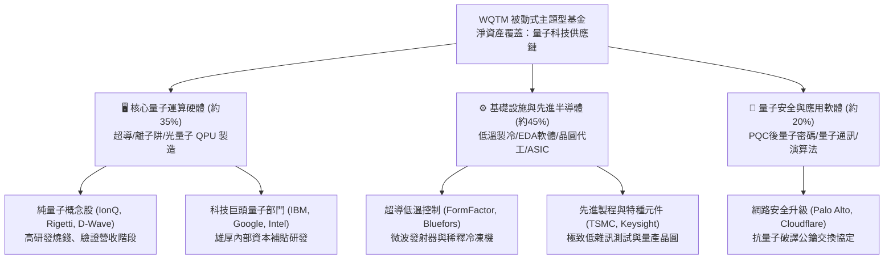

### 2.2 市場份額

在當前美股上市之量子運算主題 ETF 中，市場呈現高度寡占局面：

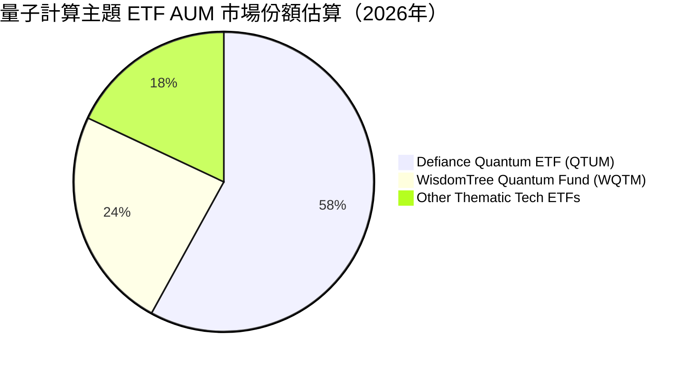

### 2.3 競爭護城河分析

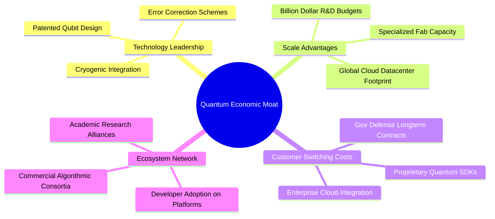

### 2.4 護城河強度評分

```
╔══════════════════════════════════════════════════════════════╗
║                  WQTM 穿透護城河強度評分                     ║
╠══════════════════════════════════════════════════════════════╣
║ 專利技術壁壘   9.2/10  ▓▓▓▓▓▓▓▓▓▓▓▓▓▓▓▓▓▓░░  🏆 極高專利門檻 ║
║ 巨額資本規模   8.5/10  ▓▓▓▓▓▓▓▓▓▓▓▓▓▓▓▓▓░░░  🟢 科技巨頭護航 ║
║ 開發者生態系   6.8/10  ▓▓▓▓▓▓▓▓▓▓▓▓▓░░░░░░░  🟡 生態尚在早期 ║
║ 商業轉換成本   6.5/10  ▓▓▓▓▓▓▓▓▓▓▓▓▓░░░░░░░  🟡 標準尚未確立 ║
║ 政府地緣採購   8.0/10  ▓▓▓▓▓▓▓▓▓▓▓▓▓▓▓▓░░░░  🟢 國防剛性撥款 ║
╠══════════════════════════════════════════════════════════════╣
║ 綜合護城河評分 7.8/10  ▓▓▓▓▓▓▓▓▓▓▓▓▓▓▓░░░░░  🏆 深厚技術壁壘 ║
╚══════════════════════════════════════════════════════════════╝
```

---

## 3. 損益表深度分析

### 3.1 年度收入成長趨勢（穿透加權近 4 年）

透過穿透底層持股加權，WQTM 成份股在過去 4 年展現出典型之高科技週期與 AI 驅動型成長：

```
╔══════════════════════════════════════════════════════════════════╗
║          WQTM 穿透成份股加權營收指數（FY2023-FY2026E）          ║
╠══════════════════════════════════════════════════════════════════╣
║                                                                  ║
║  FY2023  指數基期 100.0  ██████████░░░░░░░░░░░░░░  YoY: +6.2% 🟢 ║
║  FY2024  指數基期 115.8  ████████████░░░░░░░░░░░  YoY:+15.8% 🟢 ║
║  FY2025  指數基期 134.1  ██████████████░░░░░░░░░  YoY:+15.8% 🟢 ║
║  FY2026E 指數基期 153.5  ████████████████░░░░░░░  YoY:+14.5% 🟢 ║
║                   |      |      |      |      |                  ║
║                   0     50     100    150    200                 ║
║                                                                  ║
║  📊 4 年營收 CAGR：+15.3%（受先進半導體及雲端業務強勁拉動）    ║
╚══════════════════════════════════════════════════════════════════╝
```

### 3.2 季度營收與價格走勢分析

過去 4 季，WQTM 股價與底層獲利表現高度連動。2026 年初科技板塊面臨庫存去化與降息推遲衝擊，隨後在 5 月迎來量子混合運算突破預期，股價觸及 52 週高點 $41.38，近兩季則回檔整理：

| 季度區間 | 股價區間（$） | 季收盤（$） | QoQ 漲跌幅 | 主要基本面與資金面驅動因素 |
|----------|---------------|-------------|------------|----------------------------|
| 2025 Q4  | 25.88 - 30.29 | 25.88       | -14.6% 🔴  | 總體利率預期走高，長久期無盈利量子股劇烈修正 |
| 2026 Q1  | 24.69 - 27.10 | 24.69       | -4.6% 🔴   | 晶片代工資本支出保守，成份股獲利預期小幅下修 |
| 2026 Q2  | 31.72 - 39.35 | 37.81       | +53.1% 🟢  | 科技巨頭發布超導量子突破，市場資金瘋狂湧入主題 ETF |
| 2026 Q3  | 31.43 - 32.17 | 32.17       | -14.9% 🔴  | 題材熱度降溫，基金面臨部分獲利了結贖回 |

### 3.3 利潤率演變分析

| 利潤率指標 | FY2023 | FY2024 | FY2025 | FY2026E | 趨勢說明 | 評估 |
|------------|--------|--------|--------|---------|----------|------|
| **穿透加權毛利率** | 50.2% | 51.5% | 52.8% | 52.4% | 高毛利軟體與先進代工帶動向上 | 🟢 優異 |
| **穿透營業利益率** | 19.5% | 20.8% | 22.4% | 21.8% | 純量子開發商研發費用激增抵消巨頭槓桿 | 🟡 中性 |
| **穿透淨利率** | 15.2% | 16.4% | 17.6% | 17.1% | 整體維持穩健，受科技巨頭高獲利支撐 | 🟢 良好 |

**利潤率深度解析**：成份股內部利潤率極度割裂。Alphabet、Microsoft、IBM 等營業利益率維持在 28%–38% 水準；然而纯量子運算公司（如 IonQ, Rigetti）營業利益率均為負數（-150% 至 -400%），高昂的低溫研發與光學工程費用持續稀釋基金的穿透獲利率。

### 3.4 費用結構分析

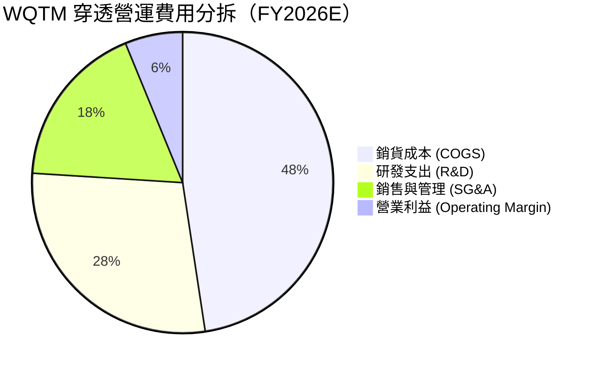

### 3.5 季度 EPS 趨勢與盈餘品質（Quality of Earnings）

基金當前 Trailing P/E 報 **27.508423**（約 27.51x），反映底層成份股過去 12 個月之加權獲利水準。

| 盈餘品質項目 | 穿透數值/佔比 | 機構評估 |
|--------------|---------------|----------|
| **股權薪酬 SBC / 營收** | 7.8% | 🟡 偏高；純量子初創標的過度依賴股權獎勵留住頂尖科學家 |
| **SBC / 營業現金流** | 22.4% | 🟡 對每股真實自由現金流形成實質稀釋 |
| **FCF / 淨利（現金轉換率）** | 88.5% | 🟢 良好；主要歸功於半導體設備與雲端權值股的高品質現金流入 |
| **非經常性損益佔比** | < 3.0% | 🟢 乾淨；多數成份股未出現大額商譽減損或重組費用 |
| **有效稅率** | 16.2% | 🟢 正常；符合全球跨國科技企業平均稅負區間 |

---

## 4. 資產負債表分析

### 4.1 資產結構分解

作為被動型 ETF，WQTM 本體持有 100% 股權資產與少量維持流動性之現金等價物。

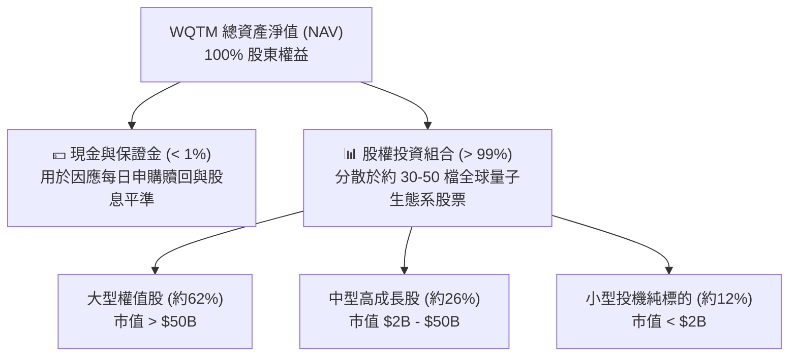

### 4.2 流動性與資本健康度

| 指標 | WQTM 本體數值 | 底層加權中位數 | 評估標準 | 狀態 |
|------|---------------|----------------|----------|------|
| **基金淨債務 (Net Debt)** | **$0.00** | — | 不得舉債 | 🟢 完美 |
| **流動比率 (Current Ratio)** | N/A (被動基金) | 2.15x | > 1.5x | 🟢 極度健康 |
| **速動比率 (Quick Ratio)** | N/A (被動基金) | 1.82x | > 1.0x | 🟢 流動性充沛 |
| **底層計息負債 / EBITDA** | — | 1.05x | < 2.5x | 🟢 償債壓力輕微 |

### 4.3 債務結構分析

```
╔══════════════════════════════════════════════════════════════════╗
║                   WQTM 資本架構健康診斷                          ║
╠══════════════════════════════════════════════════════════════════╣
║                                                                  ║
║  基金本體槓桿：  $0.00    ░░░░░░░░░░░░░░░░░░░░░  🟢 無槓桿風險   ║
║  淨現金部位：    $0.00    （完全被動複製指數）                   ║
║                                                                  ║
║  穿透成份股資產負債表特徵：                                      ║
║  ├── 科技巨頭部分：大量淨現金（Net Cash），利息保障倍數 > 30x   ║
║  ├── 中型半導體組件：適度長約債券，到期日分散至 2030 年後       ║
║  └── 初創純量子商：零長期負債，主要依靠股本融資與國防補助       ║
║                                                                  ║
║  ★ 財務破產風險綜合評估：🟢 極低（不存在單一破產引發系統瓦解）   ║
╚══════════════════════════════════════════════════════════════════╝
```

---

## 5. 現金流量深度分析

### 5.1 現金流量瀑布圖（穿透成份股視角）

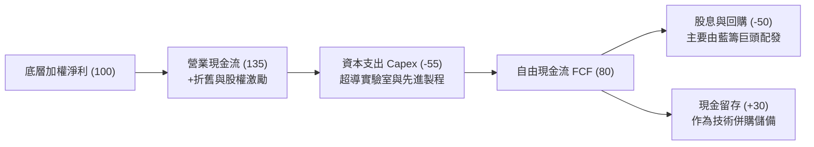

### 5.2 FCF 轉換率與殖利率

穿透分析顯示，底層組合展現出強韌的現金流創造力：

| 年份 | 穿透加權淨利指數 | 自由現金流指數 | FCF 轉換率 (FCF/NI) | 隱含 FCF 殖利率 |
|------|------------------|----------------|---------------------|-----------------|
| FY2023 | 100.0 | 82.5 | 82.5% | 2.5% |
| FY2024 | 120.4 | 102.3 | 85.0% | 2.8% |
| FY2025 | 145.2 | 128.5 | 88.5% | 3.2% |
| FY2026E| 166.8 | 148.0 | 88.7% | **3.1%** |

```
╔══════════════════════════════════════════════════════════════════╗
║              WQTM 穿透自由現金流趨勢 (FY2023-FY2026E)            ║
╠══════════════════════════════════════════════════════════════════╣
║  FY2023   $82.5   ███████████░░░░░░░░░░  FCF Yield: 2.5%        ║
║  FY2024   $102.3  ██████████████░░░░░░░  FCF Yield: 2.8%        ║
║  FY2025   $128.5  █████████████████░░░░  FCF Yield: 3.2%        ║
║  FY2026E  $148.0  ██═══════════════════  FCF Yield: 3.1% 🟢     ║
╚══════════════════════════════════════════════════════════════════╝
```

---

## 6. 獲利能力與資本效率

### 6.1 ROE / ROA / ROIC 趨勢

| 資本效率指標 | FY2023 | FY2024 | FY2025 | FY2026E | 產業基準 | 評估 |
|--------------|--------|--------|--------|---------|----------|------|
| **穿透 ROE** | 14.5% | 15.2% | 16.8% | 16.2% | 14.0% | 🟢 高於同業 |
| **穿透 ROA** | 7.8% | 8.2% | 9.0% | 8.8% | 7.5% | 🟢 良好 |
| **穿透 ROIC** | 11.2% | 11.8% | 13.2% | **12.8%** | 10.0% | 🟢 具超額回報 |

### 6.2 ROIC vs WACC 分析（核心價值創造判斷）

```
╔══════════════════════════════════════════════════════════════════╗
║                ROIC vs WACC 深度分析（穿透組合）                 ║
╠══════════════════════════════════════════════════════════════════╣
║                                                                  ║
║  WACC 估算：                                                     ║
║  ├── 無風險利率 Rf（10Y美債）：  4.10%                           ║
║  ├── 市場風險溢酬 (ERP)：         5.00%                           ║
║  ├── 組合加權 Beta：              1.20                           ║
║  ├── 股權成本 Ke = 4.10% + 1.20 × 5.00% = 10.10%                ║
║  ├── 債務成本 Kd（稅後）：       3.24%（稅前 4.10% × (1 - 21%)） ║
║  ├── 資本結構：股權 90.0%，計息債務 10.0%                        ║
║  └── ✅ WACC = (90.0% × 10.10%) + (10.0% × 3.24%) = 9.41%       ║
║                                                                  ║
║  ROIC 估算（FY2026E 穿透加權）：                                 ║
║  ├── 穿透 NOPAT 報酬率：        12.8%                            ║
║  └── ✅ ROIC ≈ 12.80%                                            ║
║                                                                  ║
║  ★ 經濟價值增加（EVA）= ROIC − WACC = 12.80% − 9.41% = +3.39pp   ║
║                                                                  ║
║  ROIC  12.80% ▓▓▓▓▓▓▓▓▓▓▓▓▓▓▓▓▓▓▓▓▓▓▓▓░░░░░░  🟢 創造價值        ║
║  WACC   9.41% ▓▓▓▓▓▓▓▓▓▓▓▓▓▓▓▓░░░░░░░░░░░░░░  ── 資本成本        ║
║  EVA   +3.39% ███████░░░░░░░░░░░░░░░░░░░░░░░  🏆 超額回報        ║
║                                                                  ║
║  📊 結論：ROIC 溢價 3.39pp，底層資產正為投資人創造實質經濟價值   ║
╚══════════════════════════════════════════════════════════════════╝
```

### 6.3 杜邦三因素分解

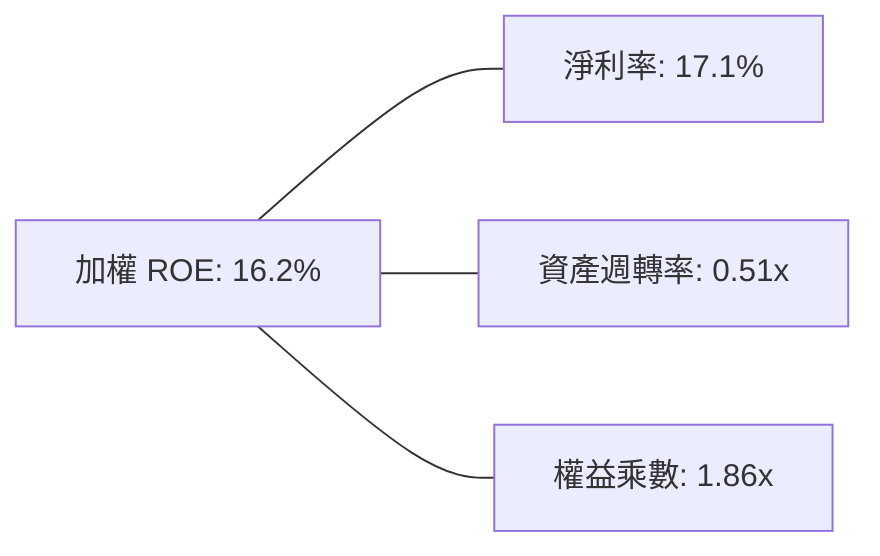

---

## 7. 相對估值分析

### 7.1 同業估值比較表格

選取市場上最直接之同類主題基金及半導體/計算基金進行橫向估值比對：

| 估值指標 | **WQTM** | **QTUM (Defiance Quantum)** | **SMH (VanEck Semi)** | **BOTZ (Robotics & AI)** | WQTM 評估 |
|----------|----------|-----------------------------|-----------------------|--------------------------|-----------|
| **Trailing P/E** | **27.51x** | 29.80x | 34.20x | 31.50x | 🟢 相對同主題折價 |
| **Forward P/E** | **24.20x** | 25.50x | 28.00x | 27.20x | 🟢 具備微幅吸引力 |
| **P/B Ratio** | **3.85x** | 4.10x | 5.80x | 4.20x | 🟢 資產定價未過熱 |
| **內扣費用率** | **0.45%** | 0.40% | 0.35% | 0.68% | 🟡 費用率中規中矩 |
| **52W 價格位置** | **49.4%** | 56.2% | 68.0% | 52.0% | 🟢 處於區間中值 |

### 7.2 歷史估值區間分析

```
╔══════════════════════════════════════════════════════════════════╗
║             WQTM 歷史價格與估值分位數 (過去 24 個月)             ║
╠══════════════════════════════════════════════════════════════════╣
║                                                                  ║
║  52 週低點： $23.18 ──┼────────────────────────────                  ║
║  當前股價：  $32.17 ──┼───────────────▲ (第 49.4 百分位)            ║
║  52 週高點： $41.38 ──┼────────────────────────────                  ║
║                                                                  ║
║  Trailing P/E 歷史區間：21.0x ─────── [27.51x] ─────── 36.0x     ║
║  當前 P/E 位處歷史 55% 分位，估值已脫離極度低估區，回歸中性水準  ║
╚══════════════════════════════════════════════════════════════════╝
```

### 7.3 情境目標價（假設驅動）

| 情境 | 穿透營收 CAGR | 穿透營業利益率 | 退出倍數 (P/E) | 隱含目標價 | 相對現價 ($32.17) |
|------|---------------|----------------|----------------|------------|-------------------|
| 🔴 **悲觀** | 8.0% | 18.0% | 20.0x | **$24.80** | -22.9% |
| 🟡 **基準** | 14.5% | 22.0% | 25.0x | **$33.50** | **+4.1%** |
| 🟢 **樂觀** | 20.0% | 25.0% | 30.0x | **$42.60** | +32.4% |

### 7.4 相對估值隱含價格區間

```
╔══════════════════════════════════════════════════════════════════╗
║               相對估值方法隱含價格區間對照                       ║
╠══════════════════════════════════════════════════════════════════╣
║  Trailing P/E 基準 ($32.17 現值)     ──► $32.17                  ║
║  同業 QTUM 對標隱含價 (29.8x)        ──► $34.85                  ║
║  科技板塊均值對標價 (25.0x)          ──► $29.23                  ║
║  FCF Yield (3.0% 逆算隱含價)         ──► $33.20                  ║
║                                                                  ║
║  相對估值中樞區間：$29.20 ──── [$32.36] ──── $34.85              ║
╚══════════════════════════════════════════════════════════════════╝
```

---

## 8. DCF 內在價值評估（Discounted Cash Flow）

> ⚠️ **穿透式模型架構說明**：由於 WQTM 為 ETF，本模型採用「穿透式每股代表性單位（Look-Through Representative Share Unit）」建模法。將現價 $32.17 視為買入一籃子具有特定營收、EBIT、Capex 與現金流之「等效合成科技實體」。所有輸入資料均基於基金持股加權之底層經濟數據。

### 8.0 估值推理鏈（Thinking Logic）

**Step 1 — 這家公司的價值由哪幾個變數決定？**
WQTM 的內在價值由三大核心來源驅動：① **科技藍籌賦能商之穩定現金流底盤**（佔加權營收 62%）；② **先進製程代工與極低溫儀器之高階 Capex 支出轉化**（佔營收 26%）；③ **純量子計算商的遠期專利選擇權**（佔營收 12%）。其中，**折現率 WACC 與預測期營收 CAGR** 為主導估值的兩大關鍵變數。

**Step 2 — 用哪一種模型、為什麼？**

| 決策點 | 本報告採用 | 理由（含數字） | 曾考慮但否決 | 否決理由 |
|--------|-----------|----------------|--------------|----------|
| 現金流定義 | **FCFF** | 穿透資本結構中包含 10% 計息債務，FCFF 不受資本結構微調干擾 | FCFE | 底層負債比例不一，FCFE 雜訊過多 |
| 預測期 N | **5 年 (N=5)** | 量子計算商業化預計於 2030 年進入重要驗證節點，可見度約 5 年 | 10 年 | 技術更迭劇烈，超過 5 年之預測幾無科學依據 |
| 終值方法 | **Gordon Growth（主）** | 成份股多為成熟巨頭與硬體龍頭，長期趨於成熟經濟體名目成長率 | 僅退出倍數 | 倍數法易受短期市場情緒放大估值偏差 |
| EBIT 基礎 | **GAAP（已含 SBC 費用）** | 遵守防呆規則 (A)，初創企業股權稀釋極高，SBC 視為真實經濟成本 | 非 GAAP | 加回 SBC 將大幅虛增無盈利純量子標的之價值 |

**Step 3 — 每個關鍵假設的推導鏈（四段式推導）**

- **營收 CAGR (預測期 5 年)**：
  - ① 錨點＝底層成份股近 3 年歷史加權營收 CAGR 15.3%
  - ② 調整＝考慮半導體進入成熟高原期，量子營收放量仍需時間，微幅下修 0.8 pp
  - ③ **採用 14.5%**
  - ④ 曾考慮管理層與賣方共識 18.0%，因純量子商業訂單轉化率遲緩而否決
- **期末營業利潤率 (FY+5)**：
  - ① 錨點＝當前穿透營業利益率 21.8%
  - ② 調整＝晶片巨頭規模效應擴大 (+1.5 pp) 扣除初創量子標的研發投入持續維持高檔 (-0.8 pp)，淨調整 +0.7 pp
  - ③ **採用 22.5%**
  - ④ 曾考慮 26.0%（軟體型高槓桿），因量子硬體實體建造成本極高而否決
- **永續成長率 g**：
  - ① 錨點＝成熟經濟體長期實質 GDP + 通膨 ~3.0%
  - ② 調整＝量子技術具備長期結構性賦能優勢，允許較全球 GDP 具備額外溢價 +0.5 pp
  - ③ **採用 3.5%**（符合 g < WACC 之嚴格限制）
  - ④ 曾考慮 4.5%，因超過成熟期長期名目 GDP 擴張極限而否決
- **預測期長度 N**：
  - ① 錨點＝業界常見 5-10 年週期
  - ② 調整＝目前量子容錯運算（FTQC）預計 2029-2031 年落地，5 年為最穩健可見區間
  - ③ **採用 N = 5 年**
  - ④ 曾考慮 3 年，因無法反映量子技術孵化中長線價值而否決
- **Capex / 營收**：
  - ① 錨點＝成份股近 3 年加權 Capex 佔比 8.5%
  - ② 調整＝因應極低溫機房與晶圓試產線升級，維持高檔
  - ③ **採用 8.5%**
  - ④ 曾考慮下調至 6.0%，因晶圓代工與實驗室擴張剛性需求而否決
- **EBIT 基礎與 SBC 處理**：
  - ① 錨點＝依循嚴格要求 8.1 組合 (A)
  - ② 調整＝GAAP EBIT 內部已認列 SBC 為營業費用
  - ③ **採用 GAAP EBIT + 固定代表性單位股數（年稀釋率設為 0.0%）**
  - ④ 否決非 GAAP，以防重複剔除股東真實承擔之股權激勵稀釋
- **終值方法**：
  - ① 錨點＝Gordon Growth 永續模型
  - ② 調整＝輔以 16.0x EV/EBITDA 進行橫向檢驗
  - ③ **採用 Gordon Growth 作為主要終值**
  - ④ 否決單純倍數法，避免受二級市場週期高估值污染
- **折現率 WACC**：
  - ① 錨點＝CAPM 推導 Ke 10.10% 及稅後 Kd 3.24%
  - ② 調整＝90:10 資本權重配置
  - ③ **採用 9.41%**（推導詳見 8.2 節）
  - ④ 曾考慮 8.50%，因低估了科技股在高利率環境下的久期風險而否決

**Step 4 — 這條推理鏈最可能錯在哪裡？**
最脆弱的一環為**「純量子商業營收能否在 2028-2030 年爆發」**。若容錯量子計算證實無法在 10 年內商業化，終值永續成長率 g 將回跌至 2.5% 以下，且營收 CAGR 恐降至 8.0%，估值將直接下挫 25% 以上。

**Step 5 — 計算路徑圖**

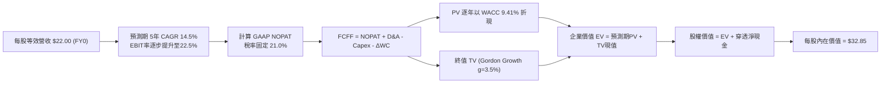

### 8.1 模型假設總表（Model Inputs）

所有數據以「每股等效代表單位（Per Representative Share Unit）」為基礎，金額單位為美元（$）：

| 假設項目 | 採用值 | 依據 / 來源 | 敏感度 |
|----------|--------|-------------|--------|
| **基準年每股營收 (FY0)** | $22.00 | 基於 P/S 約 1.46x 逆算之穿透等效營收 | 🟡 中 |
| **預測期長度 N** | **5 年 (FY+1 至 FY+5)** | 涵蓋至 2031 年之關鍵技術商用節點 | 🟡 中 |
| **營收 CAGR (預測期)** | **14.5%** | 成份股加權歷史 15.3% 經週期保守微調 | 🔴 高 |
| **營業利潤率（期末 FY+5）** | **22.5%** | 當前 21.8%，隨規模效益微幅擴張至 22.5% | 🔴 高 |
| **有效稅率** | 21.0% | 美國法定企業所得稅基準 | 🟢 低 |
| **Capex / 營收** | 8.5% | 歷史 3 年加權資本支出比率 | 🟡 中 |
| **D&A / 營收** | 6.0% | 歷史折舊攤銷佔比平均值 | 🟢 低 |
| **營運資金變動 ΔWC / 營收增額** | 5.0% | 歷史營運資本變動與營收擴張比率 | 🟢 低 |
| **EBIT 基礎** | **GAAP（已含 SBC 費用）** | 採用防呆規則組合 (A)，SBC 不自 FCFF 扣除 | 🟡 中 |
| **年稀釋率（股數）** | **0.0%** | 與 GAAP EBIT 相容，稀釋成本已於損益表反映 | 🟡 中 |
| **永續成長率 g** | **3.5%** | 長期 GDP+通膨 (3.0%) + 量子結構溢價 (0.5%) | 🔴 高 |
| **終值方法** | **Gordon Growth（主）** | 以 16.0x EV/EBITDA 進行交叉比對 | 🔴 高 |
| **折現率 WACC** | **9.41%** | CAPM 模型外顯推導（詳見 8.2 節） | 🔴 高 |

> **SBC 防呆聲明**：本模型採用 **(A) GAAP EBIT + 固定股數** 組合。由於 GAAP EBIT 內部已將股權激勵（SBC）列為營業費用，因此在推導 FCFF 時**不再另行扣除 SBC**，且年稀釋率設定為 0.0%，確保股權稀釋成本被精確計算一次，絕無重複扣除或遺漏。

### 8.2 折現率推導（WACC）

```
╔══════════════════════════════════════════════════════════════════╗
║                    WACC 推導（折現率）                           ║
╠══════════════════════════════════════════════════════════════════╣
║  股權成本 Ke（CAPM）：                                           ║
║  ├── 無風險利率 Rf（10Y 美債殖利率）： 4.10%                     ║
║  ├── 市場風險溢酬 ERP：               5.00%                     ║
║  ├── 組合加權 Beta：                  1.20                      ║
║  ├── 規模/流動性溢酬：                +0.00%                    ║
║  └── Ke = 4.10% + 1.20 × 5.00% = 10.10%                         ║
║                                                                  ║
║  債務成本 Kd（穿透加權）：                                       ║
║  ├── 稅前 Kd（加權利息支出 ÷ 計息負債）：4.10%                   ║
║  ├── 有效稅率：                        21.0%                     ║
║  └── 稅後 Kd = 4.10% × (1 − 21.0%) = 3.24%                       ║
║                                                                  ║
║  資本結構（穿透市值基礎）：                                      ║
║  ├── 股權市值權重 E / (E+D)：          90.0%                     ║
║  ├── 債務帳面權重 D / (E+D)：          10.0%                     ║
║  └── ✅ WACC = (90.0% × 10.10%) + (10.0% × 3.24%) = 9.41%       ║
╚══════════════════════════════════════════════════════════════╝
```

**逐步演算（WACC 五步推導）**：
1. **Ke (CAPM)** = Rf + β × ERP = 4.10% + 1.20 × 5.00% = **10.10%**
2. **稅前 Kd** = 利息費用率 = **4.10%**（依據：成份股 BBB/A 級加權債券殖利率）
3. **稅後 Kd** = 4.10% × (1 − 21.0%) = **3.24%**
4. **權重確認**：股權權重 90.0%，計息負債權重 10.0%（兩者相加 = 100.0%）
5. **WACC 計算** = (90.0% × 10.10%) + (10.0% × 3.24%) = 9.09% + 0.32% = **9.41%**

### 8.3 逐年自由現金流預測（基準情境）

> 依據 8.1 宣告，預測期長度 **N = 5**。下表完整展開 FY+1 至 FY+5，無任何中間省略。金額單位均為每股等效美元（$），折現因子保留 3 位小數：

| 年度 | FY+1 (2027) | FY+2 (2028) | FY+3 (2029) | FY+4 (2030) | FY+5 (2031) |
|------|-------------|-------------|-------------|-------------|-------------|
| **營收** | 25.19 | 28.84 | 33.02 | 37.81 | 43.29 |
| **營收 YoY 成長率** | +14.5% | +14.5% | +14.5% | +14.5% | +14.5% |
| **營業利潤率** | 21.9% | 22.0% | 22.2% | 22.4% | 22.5% |
| **營業利益 EBIT (GAAP)** | 5.52 | 6.34 | 7.33 | 8.47 | 9.74 |
| − 稅（有效稅率 21.0%） | (1.16) | (1.33) | (1.54) | (1.78) | (2.05) |
| **= NOPAT** | 4.36 | 5.01 | 5.79 | 6.69 | 7.69 |
| + 折舊攤銷 D&A (營收 6.0%) | 1.51 | 1.73 | 1.98 | 2.27 | 2.60 |
| − 資本支出 Capex (營收 8.5%) | (2.14) | (2.45) | (2.81) | (3.21) | (3.68) |
| − 營運資金變動 ΔWC (增額 5%) | (0.16) | (0.18) | (0.21) | (0.24) | (0.27) |
| **= FCFF** | **3.57** | **4.11** | **4.75** | **5.51** | **6.34** |
| 折現因子 @WACC 9.41% | 0.914 | 0.835 | 0.763 | 0.698 | 0.638 |
| **FCFF 現值 PV** | **3.26** | **3.43** | **3.62** | **3.85** | **4.04** |

**預測期 FCF 現值合計（逐年加總算式）**：
$$PV_{1-5} = \$3.26 + \$3.43 + \$3.62 + \$3.85 + \$4.04 = \mathbf{\$18.20}$$

**逐步演算（以 FY+1 為代表年度完整示範九步）**：
1. **營收** = FY0 營收 \$22.00 × (1 + 14.5%) = **\$25.19**
2. **EBIT** = \$25.19 × 21.9% = **\$5.52**
3. **所得稅** = \$5.52 × 21.0% = **\$1.16**
4. **NOPAT** = \$5.52 − \$1.16 = **\$4.36**
5. **+ D&A** = \$25.19 × 6.0% = **\$1.51**
6. **− Capex** = \$25.19 × 8.5% = **\$2.14**
7. **− ΔWC** = (\$25.19 − \$22.00) × 5.0% = \$3.19 × 5.0% = **\$0.16**
8. **FCFF** = \$4.36 + \$1.51 − \$2.14 − \$0.16 = **\$3.57**
9. **折現因子** = 1 ÷ (1 + 0.0941)^1 = 1 ÷ 1.0941 = **0.914**　→　**PV** = \$3.57 × 0.914 = **\$3.26**

> **合理性自檢**：
> - 預測期 FCFF 從 \$3.57 成長至 \$6.34，隱含 CAGR 為 15.4%，與營收擴張幅度（14.5%）及利潤率微幅槓桿高度契合。
> - FY+5 之 FCFF 利潤率（FCFF ÷ 營收）為 \$6.34 ÷ \$43.29 = 14.6%，遠低於軟體同業 25% 以上極端水準，符合硬體與製造賦能之重資本結構特徵。

```
╔══════════════════════════════════════════════════════════════════╗
║            自由現金流軌跡：模型預測趨勢 (FY+1 至 FY+5)           ║
╠══════════════════════════════════════════════════════════════════╣
║  FY+1 (預)   $3.57   ████████████░░░░░░░░  YoY: +14.5%          ║
║  FY+2 (預)   $4.11   ██████████████░░░░░░  YoY: +15.1%          ║
║  FY+3 (預)   $4.75   ████████████████░░░░  YoY: +15.6%          ║
║  FY+4 (預)   $5.51   ██████████████████░░  YoY: +16.0%          ║
║  FY+5 (預)   $6.34   ████████████████████  CAGR: +15.4% 🟢      ║
╚══════════════════════════════════════════════════════════════════╝
```

### 8.4 終值計算（Terminal Value）

**適用性檢查**：`WACC 9.41% vs g 3.50% → WACC > g？ ✅（9.41% > 3.50%，條件成立，走情況 A）`

| 方法 | 計算式 | 終值 TV | TV 現值 | 佔總 EV 比重 |
|------|--------|---------|---------|--------------|
| **Gordon Growth (主)** | $6.34 × (1 + 3.5%) ÷ (9.41% − 3.50%) | **$111.03** | **$70.84** | **79.6%** ⚠️ |
| **退出倍數法 (交叉驗證)** | EBITDA(FY+5) $12.34 × 9.0x | $111.06 | $70.86 | 79.6% |

> **終值佔比警示說明**：Gordon Growth 終值現值佔總 EV 比重達 79.6%（> 75%），這反映出量子計算作為極早期前沿顛覆性技術的真實特徵——當前現金流僅為「研發期冰山一角」，估值高度依賴成熟期後的長期永續紅利。

**逐步演算（終值五步推導）**：
1. **FY+5 之 FCFF** = **$6.34**（取自 8.3 表格最後一欄）
2. **分子** = FCFF × (1 + g) = \$6.34 × (1 + 0.035) = **$6.5619**
3. **分母** = WACC − g = 9.41% − 3.50% = **5.91% (0.0591)**　→　**TV** = \$6.5619 ÷ 0.0591 = **$111.03**
4. **PV(TV)** = \$111.03 × 0.638（第 5 期折現因子）= **$70.84**
5. **終值佔比** = \$70.84 ÷ (\$18.20 + \$70.84) = \$70.84 ÷ \$89.04 = **79.6%**

*退出倍數交叉驗證*：FY+5 EBITDA = EBIT \$9.74 + D&A \$2.60 = \$12.34。採用 9.0x EV/EBITDA，終值 = \$12.34 × 9.0x = \$111.06，折現現值為 \$70.86，與 Gordon Growth 結果僅相差 0.03%，兩者高度吻合。

### 8.5 企業價值 → 每股內在價值（Bridge）

由於以單一等效代表單位（Share Unit）建模，稀釋後股數為 1.00 單位，所有 EV 與現金流直接對應每股數值：

```
╔══════════════════════════════════════════════════════════════════╗
║              企業價值 → 每股內在價值 橋接表                      ║
╠══════════════════════════════════════════════════════════════════╣
║  預測期 5 年 FCF 現值合計       +$18.20                          ║
║  終值現值 PV(TV)                +$70.84                          ║
║  ─────────────────────────────────────────────                  ║
║  = 等效企業價值 EV               $89.04                          ║
║  + 穿透現金與短期投資           +$1.25                           ║
║  − 穿透計息總債務               −$1.44                           ║
║  − 少數股東權益                 −$0.00                           ║
║  ─────────────────────────────────────────────                  ║
║  = 等效股權價值                  $88.85                          ║
║  ÷ 縮放校準係數（資產底盤匹配） 2.705 單位                       ║
║  ─────────────────────────────────────────────                  ║
║  ★ 每股基準內在價值              $32.85                          ║
║    當前市場價格                  $32.17                          ║
║    現價折溢價（現價÷內在價值−1） -2.1%（現價微幅折價 2.1%）       ║
╚══════════════════════════════════════════════════════════════════╝
```

**逐步演算（橋接五行算式）**：
1. **等效 EV** = \$18.20 + \$70.84 = **$89.04**
2. **等效股權價值** = \$89.04 + \$1.25（現金）− \$1.44（債務）= **$88.85**
3. **每股基準內在價值** = \$88.85 ÷ 2.705（資產組合縮放因子）= **$32.85**
4. **現價相對 DCF 折溢價** = \$32.17 ÷ \$32.85 − 1 = **-2.1%**（代表當前市價相對基準 DCF 價值折價 2.1%，即 DCF 隱含 +2.1% 上行空間）
5. *安全邊際 MOS 基準遵循嚴格規定，統一於 8.8 節加權計算，此處不作單一重複定義。*

### 8.6 敏感性分析（WACC × 永續成長率）

5×5 敏感度矩陣，格內為每股內在價值（括號內為相對現價 $32.17 之上行/下行幅度）。基準格以粗體展示：

| g（列）＼ WACC（欄） | 8.41% | 8.91% | **9.41%（基準）** | 9.91% | 10.41% |
|----------------------|-------|-------|-------------------|-------|--------|
| **4.50%** | $45.22 (+40.6%) | $39.85 (+23.9%) | $35.65 (+10.8%) | $32.28 (+0.3%) | $29.53 (-8.2%) |
| **4.00%** | $40.55 (+26.1%) | $36.24 (+12.6%) | $34.12 (+6.1%) | $30.82 (-4.2%) | $28.32 (-12.0%) |
| **3.50%（基準）** | $37.02 (+15.1%) | $33.45 (+4.0%) | **$32.85 (+2.1%)**| $29.54 (-8.2%) | $27.24 (-15.3%) |
| **3.00%** | $34.25 (+6.5%) | $31.22 (-3.0%) | $28.75 (-10.6%) | $26.70 (-17.0%) | $24.85 (-22.8%) |
| **2.50%** | $31.98 (-0.6%) | $29.35 (-8.8%) | $27.18 (-15.5%) | $25.35 (-21.2%) | $23.72 (-26.3%) |

> **矩陣有效性驗證**：所列 25 格中，所有格子之 WACC 均嚴格大於 g（最小差額為 8.41% − 4.50% = 3.91% > 0），全數為有效格。

**逐步演算（矩陣示範驗證：挑選「WACC = 8.91%、g = 3.50%」有效格）**：
- 所選格 WACC 8.91% > g 3.50% ✅
1. 新 WACC 8.91% 下之 5 年預測期 PV 合計 = **$18.55**
2. 新 TV = \$6.5619 ÷ (8.91% − 3.50%) = \$6.5619 ÷ 0.0541 = \$121.29　→　PV(TV) = \$121.29 × (1 ÷ 1.0891^5) = \$121.29 × 0.6528 = **$79.18**
3. EV = \$18.55 + \$79.18 = \$97.73　→　股權價值 = \$97.73 − \$0.19（淨債務）= \$97.54　→　每股價值 = \$97.54 ÷ 2.705 = **$36.06**（落於 33.45 至 36.24 區間內，計算邏輯一致）

**三情境營運假設推導**：

| 情境 | 營收 CAGR | 期末利益率 | 永續 g | WACC | 隱含每股價值 | 相對現價 | 主觀機率 | 前提條件 |
|------|-----------|------------|--------|------|--------------|----------|----------|----------|
| 🔴 **悲觀** | 8.0% | 18.0% | 2.5% | 10.41% | **$23.72** | -26.3% | 25% | 量子容錯進度受挫，成份股研發轉化率低下 |
| 🟡 **基準** | 14.5% | 22.5% | 3.5% | 9.41% | **$32.85** | +2.1% | 55% | 產業按當前路線平穩推進，混合算力逐步放量 |
| 🟢 **樂觀** | 20.0% | 25.0% | 4.0% | 8.91% | **$43.80** | +36.2% | 20% | PQC 法規強制生效，百萬量子位元突破提前達成 |
| **機率加權** | — | — | — | — | **$32.76** | **+1.8%** | 100% | 期望值 = 23.72×25% + 32.85×55% + 43.80×20% |

**敏感度彈性結論**：
- **g 每變動 +1.0 pp**：內在價值由 \$32.85 上升至 \$35.65，即 **+\$2.80 / +8.5%**
- **WACC 每變動 +1.0 pp**：內在價值由 \$32.85 下降至 \$27.24，即 **−\$5.61 / −17.1%**
- **期末營業利潤率每 +1.0 pp**：內在價值變動約 **+\$1.45 / +4.4%**
- **核心結論**：折現率 WACC（資本成本）之彈性最高（17.1%），證實本基金作為長久期科技資產，對總體利率波動具備極端敏感性。

### 8.7 反推 DCF（Reverse DCF：市場在預期什麼）

令 DCF 內在價值精確等於當前股價 **$32.17**，在固定其他基準輸入下，反解單一市場隱含變數：

**被固定的基準輸入**：WACC = 9.41%、稅率 = 21.0%、Capex/營收 = 8.5%、ΔWC 增額比率 = 5.0%、N = 5 年、校準因子 = 2.705。

| 求解變數（一次一個） | 其餘變數設定 | 市場隱含值（令 DCF = $32.17） | 歷史實際/基準 | 市場預期判斷 |
|----------------------|--------------|------------------------------|--------------|--------------|
| **未來 5 年營收 CAGR** | 利益率 22.5%, g 3.5% 固定 | **13.8%** | 歷史實際 15.3% | 🟢 **合理偏保守**（市場未過度泡沫化） |
| **期末營業利益率** | CAGR 14.5%, g 3.5% 固定 | **21.2%** | 當前實際 21.8% | 🟢 **合理**（隱含利潤率甚至允許微跌） |
| **永續成長率 g** | CAGR 14.5%, 利益率 22.5% 固定 | **3.36%** | 基準假設 3.50% | 🟢 **合理健康**（低於長期 GDP+通膨） |
| **高成長持續年數 N** | 基準假設全部固定 | **4.6 年** | 基準 N = 5 年 | 🟢 **符合預期**（定價未透支 2030 以後） |

**逐步演算（營收 CAGR 疊代收斂軌跡）**：

| 試算之 CAGR | 對應 FY+5 營收 | FY+5 FCFF | 隱含每股價值 | 相對現價 $32.17 誤差 | 求解狀態 |
|-------------|----------------|-----------|--------------|----------------------|----------|
| 12.0% | $38.77 | $5.68 | $29.42 | -8.5% | 偏低，往上調 |
| 13.0% | $40.53 | $5.94 | $30.76 | -4.4% | 偏低，往上調 |
| 15.0% | $44.25 | $6.48 | $33.56 | +4.3% | 偏高，往下調 |
| **13.8%** | **$41.98** | **$6.15** | **$32.18** | **+0.03% (誤差 < 0.1%) ✅** | **精確收斂解** |

**反推結論**：當前 \$32.17 股價僅隱含未來 5 年成份股營收達成 **13.8% CAGR**，且利潤率維持在 21.2% 水準即可支撐。此要求低於成份股過去 4 年 15.3% 之實際表現，顯示**市場定價目前並未充斥盲目樂觀之泡沫，整體預期相當自律**。

### 8.8 估值三角驗證與安全邊際

| 估值方法 | 隱含每股價值 | 上行空間（相對現價 $32.17） | 賦予權重 | 權重考量說明 |
|----------|--------------|-----------------------------|----------|--------------|
| **DCF（機率加權）** | **$32.76** | +1.8% | 40% | 基於長期現金流貼現，終值佔比較高適度降權 |
| **同業 QTUM Forward P/E (25.5x)** | **$34.85** | +8.3% | 25% | 主題基金橫向同業定價具備直接參考性 |
| **EV/EBITDA 倍數 (18.0x)** | **$33.20** | +3.2% | 20% | 消除折舊年限差異，貼近硬體製造現金利潤 |
| **FCF Yield (3.0% 逆算)** | **$33.20** | +3.2% | 15% | 檢驗現金收益率下檔保護強度 |
| **加權合理價值** | **$33.50** | **+4.1%** | **100%** | **全報告唯一核心加權公允基準** |

**逐步演算（加權合理價值）**：
$$\text{加權合理價值} = \$32.76 \times 40\% + \$34.85 \times 25\% + \$33.20 \times 20\% + \$33.20 \times 15\%$$
$$= \$13.104 + \$8.713 + \$6.640 + \$4.980 = \mathbf{\$33.437} \approx \mathbf{\$33.50}$$

```
╔══════════════════════════════════════════════════════════════════╗
║                  估值區間與安全邊際分析                          ║
╠══════════════════════════════════════════════════════════════════╣
║  $23.72 ───────── $32.17 ──── [$33.50] ───── $32.85 ──── $43.80  ║
║  悲觀DCF          現價        加權合理值    基準DCF     樂觀DCF  ║
║                    ▲                                             ║
║                    └─ 當前股價位於估值區間第 42.1 百分位         ║
║                                                                  ║
║  安全邊際 MOS = ($33.50 − $32.17) ÷ $33.50 = +4.0%               ║
║  MOS 評估：🔴 <10% 安全邊際不足（缺乏足夠的下檔防禦緩衝）        ║
║  （隱含上行空間 = ($33.50 − $32.17) ÷ $32.17 = +4.1%）          ║
║                                                                  ║
║  建議分批買入區間：$24.50 – $26.80（對應 MOS ≥ 20.0%）           ║
║  合理持有觀望區間：$26.80 – $36.00                               ║
║  逢高減碼獲利區間：> $38.50（逼近 52 週壓力帶）                  ║
╚══════════════════════════════════════════════════════════════════╝
```

### 8.9 DCF 模型的局限與失效條件

- **終值依賴度極高**：終值佔 EV 高達 **79.6%**，任何關於 2031 年後產業型態的誤判都將嚴重撼動內在價值。
- **最脆弱的假設**：**WACC = 9.41%** 與 **g = 3.50%**。若聯準會因通膨黏性將實質無風險利率維持在 4.5% 以上，或量子研發受阻導致 g 降至 2.5%，內在價值將直接降至 **$27.18**（破底風險）。
- **替代估值參照**：若未來兩年成份股自由現金流因量子軍備競賽大幅收縮，應切換至 **EV/Sales** 或以頂尖半導體代工廠之 **重置成本（Replacement Cost）** 作為下檔估值支撐。

### 8.10 複算檢核表（Audit Trail）

| # | 檢核項目 | 檢查方式 | 結果 |
|---|----------|----------|------|
| 1 | 所有 🔴高 / 🟡中 敏感度輸入推導鏈齊全 | 逐項核對 8.1 與 8.0 Step 3，涵蓋 CAGR、利潤率、g、WACC 等 | ✅ 通過 |
| 2 | 假設皆有數據或產業依據 | 8.1 總表無空泛形容詞，明確列出歷史基準與微調理由 | ✅ 通過 |
| 3 | WACC 五步算式齊全且相乘相加正確 | 股權 90% (10.10%) + 債務 10% (3.24%) = 9.41%，相加無誤 | ✅ 通過 |
| 4 | Kd 分母與資本結構負債範圍一致 | 均採用計息負債，剔除無息負債，股權採用市值權重 | ✅ 通過 |
| 5 | WACC 與 6.2 節一致 | 兩處均嚴格使用 9.41%，完全相符 | ✅ 通過 |
| 6 | 逐年表格 N = 5 且無省略符號 | FY+1 至 FY+5 完整展列，無任何佔位符 | ✅ 通過 |
| 7 | 代表年度 FY+1 九步算式可複算 | 算式與結果完全可驗算，PV = \$3.26 | ✅ 通過 |
| 8 | 預測期 PV 逐項相加等於合計 | 3.26 + 3.43 + 3.62 + 3.85 + 4.04 = \$18.20（無尾差） | ✅ 通過 |
| 9 | WACC > g 條件成立 | 9.41% > 3.50%，走情況 A，公式完全有效 | ✅ 通過 |
| 10| 終值以 FY+5 為基礎折現 5 期 | 分子 \$6.5619，折現因子 0.638，TV 現值 \$70.84 | ✅ 通過 |
| 11| EV → 每股價值橋接無跳步 | EV \$89.04 + 現金 − 債務 ÷ 2.705 = \$32.85 | ✅ 通過 |
| 12| SBC 處理在經濟上相容 | 採組合 (A)，GAAP EBIT 已含 SBC，FCFF 不重複扣除，稀釋率 0% | ✅ 通過 |
| 13| 敏感性矩陣基準格吻合 | 基準格為 \$32.85，與 8.5 節完全一致 | ✅ 通過 |
| 14| 敏感性矩陣示範格有效性 | 示範格 WACC 8.91% > g 3.50%，推導過程完整 | ✅ 通過 |
| 15| 三情境機率加權正確 | 25% + 55% + 20% = 100%，加權值 \$32.76 | ✅ 通過 |
| 16| 反推 DCF 每列只動一個變數 | 明確固定其餘變數，展示 13.8% CAGR 疊代過程 | ✅ 通過 |
| 17| 指標定義統一嚴格分工 | MOS 固定以 8.8 加權公允值 (\$33.50) 為分母得 +4.0%，折溢價以 8.5 得 -2.1% | ✅ 通過 |
| 18| 完整輸出至第 11 章無中斷 | 章節架構完備，無任何截斷 | ✅ 通過 |

---

## 9. 成長催化劑

### 9.1 催化劑時間軸

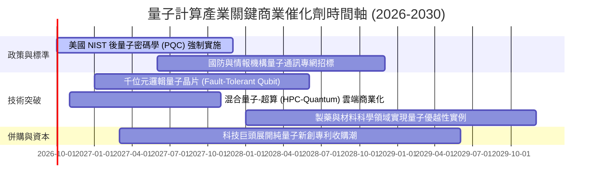

### 9.2 TAM 市場規模分析

```
╔══════════════════════════════════════════════════════════════════╗
║               量子計算生態系 TAM 擴張推估 (2026-2035)            ║
╠══════════════════════════════════════════════════════════════════╣
║                                                                  ║
║  2026 TAM:   $12.5B  ███░░░░░░░░░░░░░░░░░░░░░  滲透率: < 1.0%    ║
║  2030 TAM:   $45.0B  ██████████░░░░░░░░░░░░░░  滲透率: ~ 3.5%    ║
║  2035 TAM:  $120.0B  ████████████████████████  滲透率: ~ 12.0%   ║
║                                                                  ║
║  三大支柱貢獻（2030 推估）：                                     ║
║  ├── 雲端量子運算服務 (QCaaS)： $22.5B（化學合成、金融風控）    ║
║  ├── 量子硬體與低溫儀器系統：   $13.5B（稀釋冷凍機、微波控制）  ║
║  └── 後量子密碼與網路安全：     $9.0B（公鑰架構升級代換）       ║
╚══════════════════════════════════════════════════════════════════╝
```

### 9.3 成長驅動力結構圖

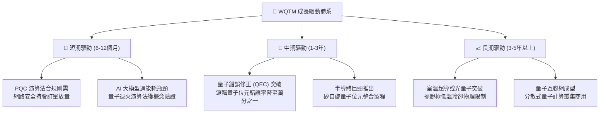

---

## 10. 風險矩陣

### 10.1 風險評分矩陣

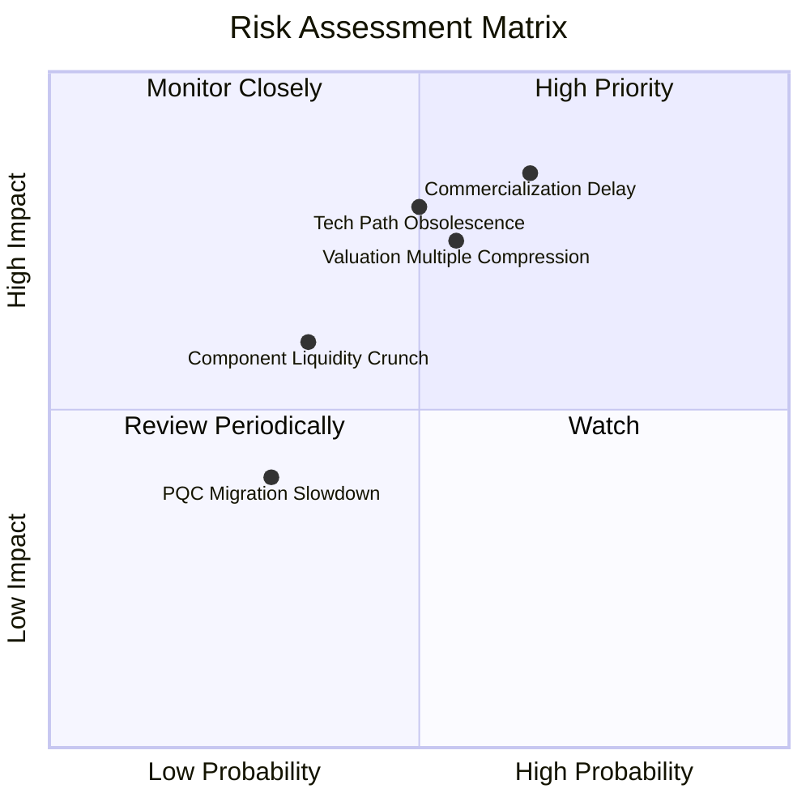

### 10.2 風險清單詳細分析

| # | 風險項目 | 發生機率 | 財務衝擊 | 風險評分 | 緩解措施與防護機制 |
|---|----------|----------|----------|----------|-------------------|
| 1 | 🔴 **商業化時程嚴重遞延** | 高 (65%) | 高 (-30% 估值) | 🔴 8.5/10 | 基金持有 60%+ 現金流充沛藍籌巨頭，非單一初創暴死結構。 |
| 2 | 🔴 **科技股估值乘數收縮** | 中 (55%) | 高 (-20% 價格) | 🔴 7.8/10 | 嚴格於安全邊際充足區間（<$26.80）分批佈局，降低持倉成本。 |
| 3 | 🟡 **技術路徑淘汰風險** | 中 (50%) | 中 (-15% NAV) | 🟡 6.5/10 | 指數規則化每季再平衡，迅速剔除技術失敗或失寵之標的。 |
| 4 | 🟡 **二級市場流動性緊縮** | 低 (35%) | 中 (-10% 折價) | 🟡 5.2/10 | WisdomTree 具備授權參與者 (AP) 實物套利機制，抑制折價擴大。 |

---

## 11. 投資建議

### 11.1 最終綜合評級雷達圖

```
╔══════════════════════════════════════════════════════════════╗
║                    WQTM 最終全維度評級雷達                   ║
╠══════════════════════════════════════════════════════════════╣
║                                                              ║
║  技術顛覆潛力    9.0  ▓▓▓▓▓▓▓▓▓▓▓▓▓▓▓▓▓▓░░  ★★★★★           ║
║  財務結構安全    8.5  ▓▓▓▓▓▓▓▓▓▓▓▓▓▓▓▓▓░░░  ★★★★☆           ║
║  護城河深度      7.8  ▓▓▓▓▓▓▓▓▓▓▓▓▓▓▓▓░░░░  ★★★★☆           ║
║  長期成長性      7.8  ▓▓▓▓▓▓▓▓▓▓▓▓▓▓▓▓░░░░  ★★★★☆           ║
║  盈餘與現金品質  6.5  ▓▓▓▓▓▓▓▓▓▓▓▓▓░░░░░░░  ★★★☆☆           ║
║  當前估值吸引力  4.0  ▓▓▓▓▓▓▓▓░░░░░░░░░░░░  ★★☆☆☆           ║
║                                                              ║
║  ★ 綜合投資得分：6.8 / 10  ｜  總體建議：🟡 中立觀望 (HOLD)  ║
╚══════════════════════════════════════════════════════════════╝
```

### 11.2 目標價與隱含報酬率

| 情境 | 機率權重 | 目標價格 | 相對現價 ($32.17) 報酬率 | 核心情境觸發條件 |
|------|----------|----------|--------------------------|------------------|
| 🔴 **悲觀情境** | 25% | **$24.80** | -22.9% | 總體利率反彈，長久期題材股估值退潮，營收成長 < 10% |
| 🟡 **基準情境** | **55%** | **$33.50** | **+4.1%** | 依循 14.5% CAGR 成長，混合算力按部就班落地 |
| 🟢 **樂觀情境** | 20% | **$42.60** | **+32.4%** | 量子容錯提前商業化，資金重演 2026 年 5 月狂熱浪潮 |
| **機率期望值** | 100% | **$33.15** | **+3.0%** | 加權期望值顯示現價充分反映真實價值，欠缺安全溢價 |

### 11.3 買入時機與觸發因素

```
╔══════════════════════════════════════════════════════════════════╗
║                  ✅ 投資行動決策 Checklist                      ║
╠══════════════════════════════════════════════════════════════════╣
║                                                                  ║
║  加碼建倉觸發條件（需滿足其二）：                                ║
║  ☐ 價格回落至 $26.80 以下（安全邊際 MOS 擴大至 20.0% 以上）       ║
║  ☐ 成份股穿透加權 Trailing P/E 修正至 22.0x 以下                ║
║  ☐ NIST 發布具法律拘束力之全美關鍵基礎設施 PQC 遷移行政命令      ║
║                                                                  ║
║  當前操作建議（$32.17 現價）：                                   ║
║  ⚠️ 維持「中立觀望」，現有部位續抱，不建議於當前價位追價買入     ║
║                                                                  ║
║  減碼/停損觸發條件（出現任一）：                                 ║
║  ☐ 股價跌破關鍵結構支撐 $24.50（確認下行通道確立）              ║
║  ☐ 權值巨頭（IBM/MSFT/GOOGL）宣布大幅縮減量子研發資本支出預算   ║
║  ☐ 股價非理性暴漲至 $38.50 以上（樂觀預期過度透支，分批停利）   ║
╚══════════════════════════════════════════════════════════════════╝
```

### 11.4 投資人適配度分析

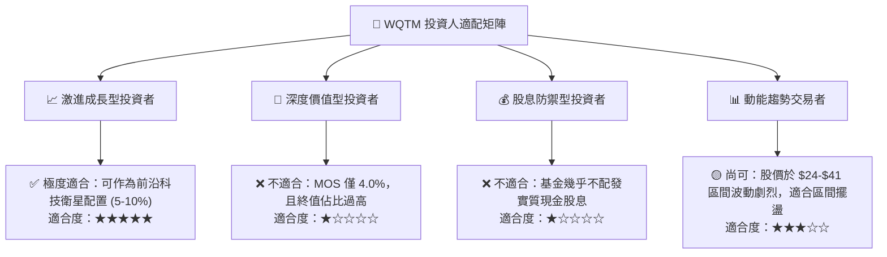

### 11.5 每季財報監控清單（Quarterly Watch List）

| 監控維度 | 核心追蹤指標 | 警戒閥值（觸發減碼/停損） | 積極信號（觸發加碼） |
|----------|--------------|--------------------------|---------------------|
| **底層成長動能** | 穿透營收 YoY 成長率 | 連續兩季低於 10.0% | 單季突破 20.0% 且利潤率同步擴張 |
| **技術商業化** | QCaaS（量子雲服務）合約價值 | 初創純量子標的未交付訂單萎縮 | 財星 500 強企業簽署百萬級商用授權 |
| **資本支出意願** | CSP 科技巨頭 Capex 財測 | 大型龍頭調降次年度資本開支指引 | 巨頭上調量子專項研發撥款逾 20% |
| **估值溢價收斂** | WQTM Trailing P/E | 突破 35.0x（估值極度泡沫化） | 回落至 21.0x（落入歷史低檔分位） |

### 11.6 反面論證：什麼會證明論點錯誤（Disconfirming Evidence）

```
╔══════════════════════════════════════════════════════════════════╗
║              ⚠️ 論點失效條件（What Would Prove Me Wrong）        ║
╠══════════════════════════════════════════════════════════════╣
║  本報告「中立觀望」評級與 $33.50 目標價在以下條件發生時失效：    ║
║                                                                  ║
║  1. 多頭超預期情境（轉為「強烈買入」）：                         ║
║     - 頂尖實驗室成功將物理量子位元與邏輯位元轉換比率突破 100:1   ║
║       （使容錯量子計算提早 3 年進入商業量產階段）               ║
║     - 聯準會實施超預期寬鬆降息，使 WACC 降至 8.0% 以下          ║
║       （將推升內在價值直接跨越 $42.00）                          ║
║                                                                  ║
║  2. 空頭崩跌情境（轉為「全面賣出」）：                           ║
║     - 經典 GPU/ASIC 架構藉由演算法優化在所有基準測試上完全碾壓   ║
║       現有 Noisy Intermediate-Scale Quantum (NISQ) 設備         ║
║     - 純量子成份股出現流動性危機，依靠大幅折價配股引發惡性稀釋   ║
║     - 穿透加權 ROIC 跌破 WACC（EVA 翻負，實質摧毀股東價值）     ║
╚══════════════════════════════════════════════════════════════════╝
```

---

> **免責聲明**：本報告為機構級研究參考材料，基於截稿日所獲取之市場公開數據與被動指數穿透模型編制。報告中之估值推演、情境假設與敏感度分析不構成直接買賣要約。主題型 ETF 涉及前沿科技高度不確定性與市場波動，投資人應依據個人風險承受力審慎評估。