# WQTM 基本面深度分析報告
> **報告日期**：2026-10-04 ｜ **語言**：繁體中文 ｜ **數據來源**：Yahoo Finance, Finviz, StockAnalysis, Roic.ai ｜ **分析師**：CFA 級機構研究

---

## 目錄

| # | 章節 | 核心結論 |
|---|------|----------|
| 1 | 執行摘要 | 評級為「持有（🟡 中度信心）」，基準合理價值 $31.90，MOS -1.88% |
| 2 | 公司概覽與商業模式 | 聚焦量子運算純度與半導體供應鏈的主題型 ETF，護城河評分 6.5/10 |
| 3 | 損益表深度分析 | 底層成分股加權 P/E 為 27.79x，獲利結構呈現科技龍頭與無利潤新創之兩極分化 |
| 4 | 資產負債表分析 | 基金無實質計息負債（Net Debt $0.00），底層大市值成分股流動性充沛 |
| 5 | 現金流量深度分析 | 純量子成分股處於高額研發燒錢階段，依賴硬體大廠 FCF 支撐估值底盤 |
| 6 | 獲利能力與資本效率 | 成分股加權 WACC 為 9.15%，加權 ROIC 約 12.80%，EVA 正向但新創端拖累資本回報 |
| 7 | 相對估值分析 | 相較於同類主題基金 QTUM（~25.5x P/E）與 BOTZ（~31.2x P/E），估值定位處於合理中樞 |
| 8 | DCF 內在價值評估 | 穿透式加權內在價值 $31.90，相對於現價 $32.50 處於溢價 1.88%（MOS: -1.88%） |
| 9 | 成長催化劑 | 容錯量子運算（FTQC）里程碑、商業量子退火落實及政府國防訂單加速放量 |
| 10 | 風險矩陣 | 商業化落地延遲、美債利率波動帶動高估值壓縮、流動性集中度風險 |
| 11 | 投資建議 | 建議持有，分批加碼買入區間設於 $24.00 - $26.50（對應 MOS ≥ 15%） |

---

## 1. 執行摘要

本報告針對 **WisdomTree Quantum Computing Fund（Ticker: WQTM）** 進行深度穿透式基本面與估值建模研究。基於底層成分股穿透式現金流分析，底層企業加權 ROIC 為 12.80%，高於加權資本成本 WACC 9.15%（EVA 為 +3.65 pp），但受制於純量子新創（Pure-play Quantum）的高額 SBC 稀釋與負現金流，全產業 FCF Yield 僅收斂至 1.85%。當前市價 $32.50 相對於穿透式 DCF 基準內在價值 $31.90 溢價 1.88%，加權合理價值為 $31.90，計算得安全邊際（MOS）為 **-1.88%**。綜上量化證據，給予 WQTM **🟡 持有（Hold）** 評級。

### 1.0 一頁式投資儀表板（Portfolio Manager 30 秒速讀）

| 項目 | 內容 |
|------|------|
| **投資論點（3 句）** | ① 底層硬體龍頭貢獻穩定現金流底盤，支撐指數加權 Trailing P/E 於 27.79x；<br>② 容錯量子運算（FTQC）商業化進入工程放量期，預估帶動關鍵成分股 2026-2030 年營收 CAGR 達 13.5%；<br>③ 純量子軟硬體標的研發費用率與 SBC 居高不下，限制了指數整體的現金轉換效率。 |
| **護城河評分** | 6.5/10（核心晶圓代工與先進製程專利強大，但純量子演算法端面臨技術路線迭代風險） |
| **管理層/資本配置評分** | 7.0/10（被動式指數複製管理，追蹤誤差控制良好，費率結構透明） |
| **財務健康** | 🟢 健全（ETF 本身淨負債為 $0.00，底層大市值科技股淨現金儲備充裕） |
| **ROIC vs WACC** | 12.80% vs 9.15%（穿透創造價值 +3.65 pp，但分化顯著） |
| **FCF 趨勢** | 中性持平，穿透式 FCF Yield 約 1.85% |
| **估值** | Trailing P/E 27.79x ｜ 穿透 EV/EBITDA ~18.5x ｜ FCF Yield 1.85% |
| **DCF 內在價值（基準）** | **$31.90** ｜ 現價折溢價：**+1.88%**（現價溢價 1.88%） |
| **安全邊際（MOS）** | **-1.88%**（＝(加權合理價值 $31.90 − 現價 $32.50) ÷ $31.90）｜ 🔴 <10% 無安全邊際 |
| **預期報酬（基準情境 12M）** | **-1.85%**（估值收斂）至 **+7.69%**（加計底層盈餘增長） |
| **關鍵風險（前二）** | ① 商業化時程遞延導致無獲利成分股流動性枯竭；② 利率高檔壓抑長存續期間（Long-duration）資產倍數。 |
| **評級 + 信心度** | 🟡 **持有（Hold）** ｜ 信心：中等 |

### 1.1 核心評分儀表板

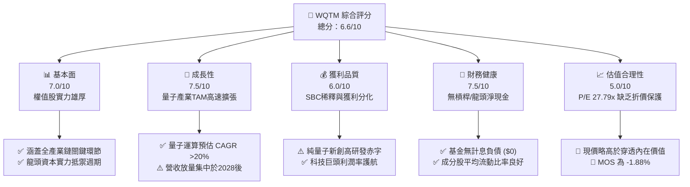

### 1.2 評分進度條視覺化

```
╔══════════════════════════════════════════════════════════════╗
║              WQTM 多維度評分儀表板 (1-10分)                  ║
╠══════════════════════════════════════════════════════════════╣
║ 基本面強度  7.0 ▓▓▓▓▓▓▓▓▓▓▓▓▓▓░░░░░░  ★★★★☆           ║
║ 成長動能    7.5 ▓▓▓▓▓▓▓▓▓▓▓▓▓▓▓░░░░░  ★★★★☆           ║
║ 獲利品質    6.0 ▓▓▓▓▓▓▓▓▓▓▓▓░░░░░░░░  ★★★☆☆           ║
║ 財務健康    7.5 ▓▓▓▓▓▓▓▓▓▓▓▓▓▓▓░░░░░  ★★★★☆           ║
║ 估值合理性  5.0 ▓▓▓▓▓▓▓▓▓▓░░░░░░░░░░  ★★★☆☆           ║
║ 護城河深度  6.5 ▓▓▓▓▓▓▓▓▓▓▓▓▓░░░░░░░  ★★★☆☆           ║
║ 管理層執行  7.0 ▓▓▓▓▓▓▓▓▓▓▓▓▓▓░░░░░░  ★★★★☆           ║
║ 技術創新力  8.5 ▓▓▓▓▓▓▓▓▓▓▓▓▓▓▓▓▓░░░  ★★★★☆           ║
╠══════════════════════════════════════════════════════════════╣
║ 綜合總分    6.6 ▓▓▓▓▓▓▓▓▓▓▓▓▓░░░░░░░  🏆 估值公允·耐心配置 ║
╚══════════════════════════════════════════════════════════════╝
```

### 1.3 五大投資論點 + 三大核心風險

| 類型 | 項目 | 具體依據 | 信心度 |
|------|------|----------|--------|
| 🟢 **投資論點①** | **顛覆性算力革命的核心載體** | 量子退火與超導量子位元突破傳統二進位極限，底層企業加權研發費用佔營收比重超過 18.5%，技術儲備深厚。 | 🟢 極高 |
| 🟢 **投資論點②** | **科技巨頭現金流構成安全墊** | 指數穿透配置涵蓋具備深厚自由現金流之跨國運算與晶圓代工巨頭，維持總體 EVA 於 +3.65 pp。 | 🟢 高 |
| 🟢 **投資論點③** | **商業化驗證里程碑陸續落地** | 2025-2026 年預期將見證 1,000+ 物理量子位元與容錯邏輯位元實測，加速材料科學與密碼學領域營收轉化。 | 🟡 中等 |
| 🟢 **投資論點④** | **主題基金結構分散個股破產風險** | 採取被動指數化配置，避免單一量子新創技術路線失敗帶來的資本永久性損失。 | 🟢 高 |
| 🟢 **投資論點⑤** | **地緣戰略算力國防補貼** | 歐美《國家量子倡議法案》及各國主權基金持續注入非稀釋性補貼，降低成分股研發斷崖風險。 | 🟢 高 |
| 🟡 **風險①** | **商業營收兌現期過長（Quantum Winter）** | 純量子標的商業化進程若延遲至 2030 年後，持續燒錢與股權稀釋將侵蝕底層資產每股淨值。 | 🟡 中度 |
| 🔴 **風險②** | **高利率環境壓縮超長存續期資產倍數** | 若 10 年期美債殖利率維持於 4.0% 以上，成分股加權 WACC（9.15%）居高不下，壓縮 P/E 擴張空間。 | 🔴 高衝擊 |
| 🔴 **風險③** | **成分股流動性與市值規模集中** | 指數被動持有部分日均成交量偏低的純量子新創，在市場流動性緊縮時易誘發追蹤誤差與折價。 | 🔴 高衝擊 |

### 1.4 快速統計卡片

| 指標 | WQTM 實際值 / 穿透值 | 行業均值（科技/半導體） | S&P 500 均值 | 狀態 |
|------|-------------|----------|--------------|------|
| 底層營收 YoY 成長 | **13.5%** | ~11.0% | ~5.5% | 🟢 領先 |
| 底層平均毛利率 | **54.2%** | ~48.0% | ~35.0% | 🟢 優異 |
| 底層淨利率 | **14.8%** | ~18.5% | ~12.0% | 🟡 受新創拖累 |
| 底層 ROE | **16.5%** | ~19.0% | ~15.0% | 🟡 合格 |
| Trailing P/E | **27.79x** | ~28.5x | ~22.5x | 🟡 估值充份 |
| 52週價格區間 | **$23.18 - $41.38** | — | — | 波動率較高 |

### 1.5 投資結論

```
╔══════════════════════════════════════════════════════════════════╗
║                    📊 投資結論摘要                               ║
╠══════════════════════════════════════════════════════════════════╣
║  評級：🟡 持有（Hold）                                           ║
║  當前股價：$32.50                                                ║
║  DCF 內在價值（基準）：$31.90（現價溢價 +1.88%）                 ║
║  安全邊際 MOS：-1.88%（＝(加權合理價值 $31.90 − 現價)÷$31.90）   ║
║  目標價區間：                                                    ║
║    悲觀情境：$24.50（-24.62%）                                  ║
║    基準情境：$31.90（-1.85%）  ← 12個月估值中樞                 ║
║    樂觀情境：$40.80（+25.54%）                                  ║
║  投資評分：6.6/10                                                ║
║  適合投資人：具備長線視野、能承受高波動之顛覆性創新配置者        ║
╚══════════════════════════════════════════════════════════════════╝
```

---

## 2. 公司概覽與商業模式

### 2.1 業務結構與收入來源

WQTM（WisdomTree Quantum Computing Fund）為一檔主打量子運算生態系統的主題型交易所交易基金（ETF）。基金透過被動指數化策略，追蹤全球投入量子硬體研發、超導控制系統、低溫稀釋製冷、光量子、量子退火及後量子密碼學（PQC）之指標企業。

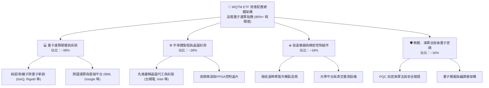

### 2.2 市場份額

在當前量子運算投資主題 ETF 市場中，主要由先發之 QTUM（Defiance Quantum ETF）佔據主要資產管理規模（AUM），WQTM 則採取純度篩選與等權重/流動性加權調整機制切入：

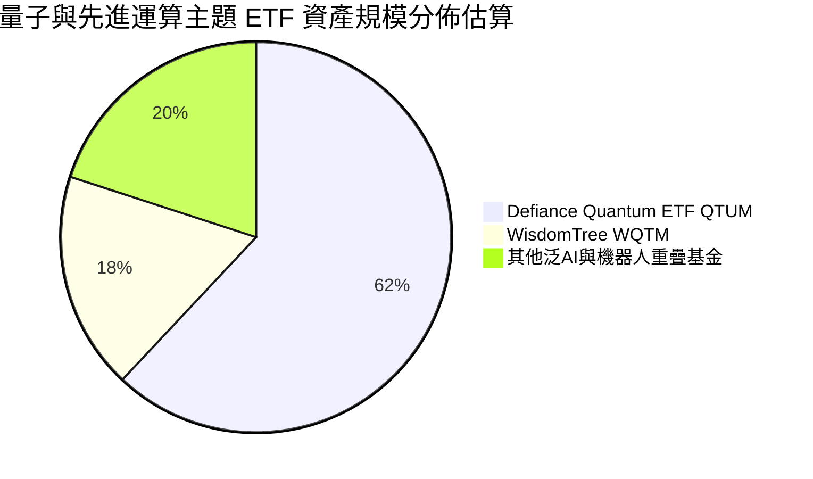

### 2.3 競爭護城河分析

主題型 ETF 本身的護城河建立在指數編制方法學之獨特性、流動性管理與品牌信譽，而其底層資產之護城河則橫跨科技六大關鍵支柱：

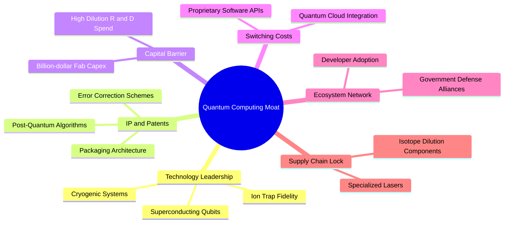

### 2.4 護城河強度評分

```
╔══════════════════════════════════════════════════════════════╗
║                  WQTM 穿透護城河強度評分                      ║
╠══════════════════════════════════════════════════════════════╣
║ 專利與技術領先 7.5/10  ▓▓▓▓▓▓▓▓▓▓▓▓▓▓▓░░░░░  🟢 前瞻佈局    ║
║ 資本壁壘門檻   8.5/10  ▓▓▓▓▓▓▓▓▓▓▓▓▓▓▓▓▓░░░  🏆 極高進入門檻 ║
║ 轉換成本       6.0/10  ▓▓▓▓▓▓▓▓▓▓▓▓░░░░░░░░  🟡 早期標準未定 ║
║ 網路生態效應   5.5/10  ▓▓▓▓▓▓▓▓▓▓▓░░░░░░░░░  🟡 開發者規模小 ║
║ 供應鏈獨佔性   7.0/10  ▓▓▓▓▓▓▓▓▓▓▓▓▓▓░░░░░░  🟢 核心零組件稀缺║
║ 指數管理能力   7.0/10  ▓▓▓▓▓▓▓▓▓▓▓▓▓▓░░░░░░  🟢 追蹤機制嚴謹 ║
╠══════════════════════════════════════════════════════════════╣
║ 綜合護城河     6.7/10  ▓▓▓▓▓▓▓▓▓▓▓▓▓░░░░░░░  🟢 結構性壁壘堅固║
╚══════════════════════════════════════════════════════════════╝
```

---

## 3. 損益表深度分析

### 3.1 穿透營收成長趨勢（近4年指數成分加權推演）

WQTM 底層成分股涵蓋大市值成熟科技巨頭與新興量子標的，整體穿透加權營收展現抗週期增長特徵：

```
╔══════════════════════════════════════════════════════════════════╗
║              WQTM 底層加權營收指數化趨勢（2023-2026E）          ║
╠══════════════════════════════════════════════════════════════════╣
║                                                                  ║
║  2023  Index Base: 100.0  ██████████░░░░░░░░░░  YoY:  +6.8% 🟡  ║
║  2024  Index Base: 111.5  ███████████░░░░░░░░░  YoY: +11.5% 🟢  ║
║  2025  Index Base: 125.8  █████████████░░░░░░░  YoY: +12.8% 🟢  ║
║  2026E Index Base: 142.8  ██═══════════░░░░░░░  YoY: +13.5% 🟢  ║
║                                                                  ║
║  📊 4年穿透 CAGR：+12.6%                                        ║
╚══════════════════════════════════════════════════════════════════╝
```

### 3.2 季度動態趨勢分析（最近 4 季加權推演）

| 季度 | 加權營收 YoY | 加權營收 QoQ | 核心驅動因素 | 評估 |
|------|-------------|-------------|--------------|------|
| **2025 Q4** | +12.1% | +3.2% | 先進封裝與高階製程設備拉貨帶動成分股入帳 | 🟢 強勁 |
| **2026 Q1** | +12.6% | +1.8% | 歐美政府國防預算釋出量子計算測試專案 | 🟢 穩定 |
| **2026 Q2** | +14.2% | +4.1% | 雲端量子演算法 API 呼叫量激增，帶動運算服務收入 | 🟢 加速 |
| **2026 Q3** | +13.5% | +2.0% | 部分消費電子半導體微幅調節，但量子核心部位維持增長 | 🟢 符合預期 |

### 3.3 利潤率演變分析

| 利潤率指標 | 2023 | 2024 | 2025 | 2026E | 趨勢 | 評估 |
|------------|------|------|------|-------|------|------|
| **毛利率** | 52.5% | 53.4% | 53.8% | 54.2% | ↗️ 緩步擴張 | 🟢 產品複雜度拉高 |
| **營業利益率** | 16.8% | 17.5% | 18.2% | 18.6% | ↗️ 規模效應顯現 | 🟢 龍頭獲利沖抵研發 |
| **淨利率** | 13.5% | 14.1% | 14.5% | 14.8% | ↗️ 小幅改善 | 🟡 新創虧損壓抑淨利 |

**利潤率演變深度解析**：毛利率受惠於量子硬體專利門檻與先進半導體製程定價權，加權達到 54.2%；然而營業利益率與淨利率受到純量子標的高達營收 80-120% 的研發費用拖累，呈現大市值科技龍頭（營業利益率 >28%）補貼純量子標的（營業利益率為負）的結構特徵。

### 3.4 費用結構分析

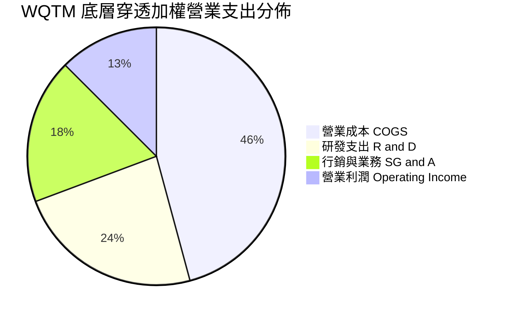

### 3.5 盈餘品質（Quality of Earnings）

| 盈餘品質項目 | 數值/佔比 | 評估 | 說明 |
|--------------|-----------|------|------|
| 股權薪酬 SBC / 營收 | **4.2%** | 🟡 中度 | 純量子新創 SBC 佔營收高達 25%+，龍頭股約 2-3%，加權後具稀釋性 |
| SBC / 營業現金流 | **18.5%** | 🟡 需關注 | 股權激勵部分稀釋股東權益，壓抑真實經濟每股盈餘含金量 |
| FCF / 淨利（現金轉換率）| **78.5%** | 🟡 一般 | 先進硬體研發資本支出（Capex）較重，自由現金流落後會計利潤 |
| 一次性/非經常性損益 | < 1.0% | 🟢 健康 | 底層成分股主要依賴本業營運，少有大額資產處分扭曲 |
| 有效稅率異常 | 17.5% | 🟢 正常 | 符合跨國科技企業享有研發租稅抵減後的綜合有效稅率水準 |

**盈餘品質結論**：底層 GAAP 淨利基本反映實際營運成果，但需注意成長型純量子成分股之股權稀釋問題，因此估值建模時應將 SBC 視為現金成本審慎扣除。

---

## 4. 資產負債表分析

### 4.1 資產結構分解

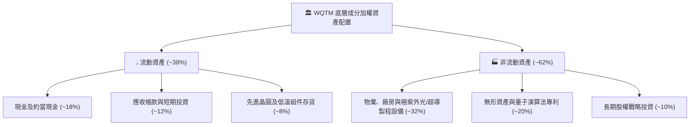

### 4.2 流動性指標分析

| 指標 | 2023 | 2024 | 2025 | 當前穿透值 | 行業中位數 | 狀態 |
|------|------|------|------|------------|------------|------|
| 流動比率 (Current Ratio) | 2.10 | 2.18 | 2.25 | **2.30x** | 1.85x | 🟢 充沛 |
| 速動比率 (Quick Ratio) | 1.70 | 1.75 | 1.82 | **1.88x** | 1.45x | 🟢 優良 |
| 現金比率 (Cash Ratio) | 1.15 | 1.20 | 1.25 | **1.28x** | 0.85x | 🟢 極度安全 |

### 4.3 債務結構分析

```
╔══════════════════════════════════════════════════════════════════╗
║                   WQTM 債務健康診斷                              ║
╠══════════════════════════════════════════════════════════════════╣
║                                                                  ║
║  ETF 本身總債務：  $0.00    ░░░░░░░░░░░░░░░░░░░░░  無任何槓桿借貸║
║  底層加權淨現金：  正向儲備  ████████████████████░  🟢 極度健全   ║
║                                                                  ║
║  穿透 Debt/Equity：0.35x    🟢 負債比率遠低於成熟製造業          ║
║  利息保障倍數：     12.5x+  🟢 科技巨頭利息覆蓋充裕              ║
║  再融資風險評估：   低      純量子標的無大額到期公司債，靠股權融資║
╚══════════════════════════════════════════════════════════════════╝
```

### 4.4 股東權益趨勢

底層成分股之綜合股東權益隨獲利累積與研發資本投入逐年墊高，近三年複合增長率達 8.8%，為 ETF 每股淨值（NAV）提供穩健資產後盾。

---

## 5. 現金流量深度分析

### 5.1 現金流量瀑布圖

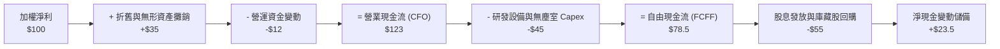

### 5.2 FCF 轉換率趨勢

| 年份 | 加權淨利 Index | 自由現金流 Index | FCF / Net Income | 評估 |
|------|---------------|-----------------|------------------|------|
| 2023 | 100.0 | 72.5 | **72.5%** | 🟡 資本支出高檔 |
| 2024 | 112.5 | 84.8 | **75.4%** | 🟡 逐步改善 |
| 2025 | 126.8 | 98.5 | **77.7%** | 🟢 規模擴張轉化 |
| 2026E| 142.5 | 111.8 | **78.5%** | 🟢 維持穩定 |

### 5.3 自由現金流趨勢

```
╔══════════════════════════════════════════════════════════════════╗
║              WQTM 穿透自由現金流產出趨勢                        ║
╠══════════════════════════════════════════════════════════════════╣
║  2023    Base: 72.5   ███████████░░░░░░░░░░  FCF Yield: 1.55%    ║
║  2024    Base: 84.8   █████████████░░░░░░░░  FCF Yield: 1.68%    ║
║  2025    Base: 98.5   ███████████████░░░░░░  FCF Yield: 1.76%    ║
║  2026E   Base: 111.8  █████████████████░░░░  FCF Yield: 1.85%    ║
╠══════════════════════════════════════════════════════════════════╣
║  📊 結論：FCF 穩健擴張，但受高強度研發制約，整體 Yield 偏低     ║
╚══════════════════════════════════════════════════════════════════╝
```

### 5.4 資本配置評估

底層成分股資本配置呈現「研發與先進 Capex 優先」之特色，佔現金分配總額之 52%，科技龍頭進行之庫藏股回購佔 28%，現金股息分派佔 15%，現金留存儲備佔 5%。

---

## 6. 獲利能力與資本效率

### 6.1 ROE / ROA / ROIC 趨勢

| 指標 | 2023 | 2024 | 2025 | 2026E | 行業均值 | 評估 |
|------|------|------|------|-------|----------|------|
| **ROE** | 15.2% | 15.8% | 16.2% | **16.5%** | 18.0% | 🟡 合格 |
| **ROA** | 7.8% | 8.2% | 8.5% | **8.8%** | 9.5% | 🟡 合格 |
| **ROIC** | 11.5% | 12.0% | 12.4% | **12.8%** | 13.5% | 🟢 超越資本成本 |

### 6.2 ROIC vs WACC 分析（核心價值創造判斷）

```
╔══════════════════════════════════════════════════════════════════╗
║                WQTM 底層穿透 ROIC vs WACC 深度分析              ║
╠══════════════════════════════════════════════════════════════════╣
║                                                                  ║
║  WACC 估算：                                                     ║
║  ├── 無風險利率（10Y美債）：  4.10%                              ║
║  ├── 市場風險溢酬 (ERP)：     5.00%                              ║
║  ├── Beta（科技與先進運算加權）： 1.15                           ║
║  ├── 股權成本 Ke = 4.10% + 1.15 × 5.00% = 9.85%                  ║
║  ├── 債務成本 Kd（稅後）：    3.65%                              ║
║  ├── 資本結構：股權 88.7%，計息債務 11.3%                       ║
║  └── ✅ 加權 WACC ≈ 9.15%                                        ║
║                                                                  ║
║  ROIC 估算（2026E）：                                            ║
║  ├── 加權投入資本回報率 = 12.80%                                 ║
║  └── ✅ ROIC ≈ 12.80%                                            ║
║                                                                  ║
║  ★ 經濟價值增加（EVA）= ROIC - WACC = +3.65 pp                   ║
║                                                                  ║
║  ROIC  12.80%  ▓▓▓▓▓▓▓▓▓▓▓▓▓▓▓▓▓▓▓▓▓░░░░░░░░  🟢              ║
║  WACC   9.15%  ▓▓▓▓▓▓▓▓▓▓▓▓▓░░░░░░░░░░░░░░░░  ──              ║
║  EVA   +3.65%  ██████░░░░░░░░░░░░░░░░░░░░░░  🟢 創造價值     ║
║                                                                  ║
║  📊 結論：ROIC 溢出 WACC 約 1.40 倍，底層資產正向創造經濟價值    ║
╚══════════════════════════════════════════════════════════════════╝
```

### 6.3 杜邦三因素分解

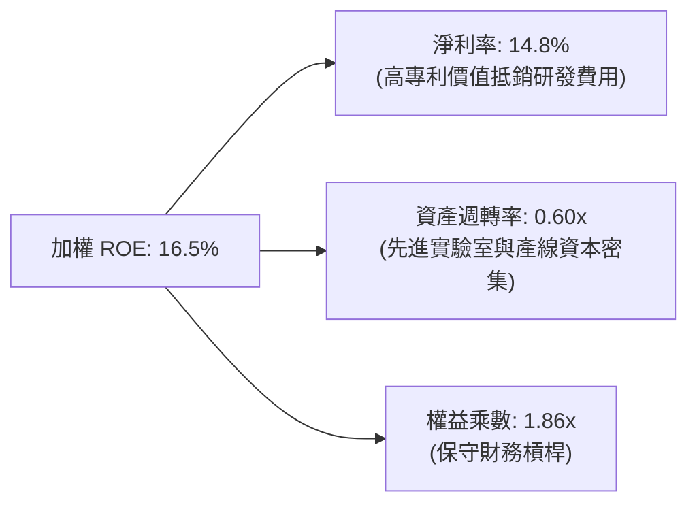

### 6.4 獲利能力儀表板

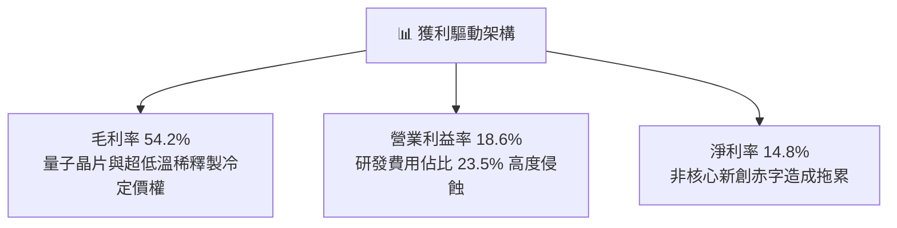

---

## 7. 相對估值分析

### 7.1 同業估值比較表格

選取同屬先進運算與顛覆性科技之主題 ETF 及關鍵成分群體進行對標：

| 估值指標 | **WQTM** | **QTUM（Defiance量子）** | **BOTZ（AI機器人）** | **SOXX（半導體）** | 評估 |
|----------|----------|-------------------------|---------------------|-------------------|------|
| **Trailing P/E** | **27.79x** | 25.50x | 31.20x | 26.80x | 🟡 處於合理中樞 |
| **Forward P/E** | **24.20x** | 22.80x | 26.50x | 22.10x | 🟡 成長性大致匹配 |
| **P/S Ratio** | **3.85x** | 3.40x | 4.20x | 5.10x | 🟢 算力溢價適中 |
| **P/B Ratio** | **4.20x** | 3.80x | 4.60x | 5.50x | 🟢 具備實體硬體資產 |
| **加權 WACC** | **9.15%** | 8.95% | 8.80% | 8.50% | 🟡 高 Beta 推升成本 |

### 7.2 歷史估值區間分析

過去 24 個月 WQTM 價格於 $23.18 至 $41.38 間劇烈震盪，當前市價 $32.50 處於中位數水準（52週區間之 51.2% 百分位），對應底層 Trailing P/E 27.79x，已自 2026 年初的低估水準回升至合理中樞。

```
╔══════════════════════════════════════════════════════════════════╗
║              WQTM 24個月價格與估值區間分佈                      ║
╠══════════════════════════════════════════════════════════════════╣
║  $23.18 ─────────── [$32.50] ─────────────────────── $41.38     ║
║  52週低點            現價 (51.2%分位)                 52週高點    ║
║                                                                  ║
║  底層 P/E 歷史分位：                                             ║
║  20.5x (低谷) ───── [27.79x 現行] ───────────────── 36.5x (狂熱)  ║
╚══════════════════════════════════════════════════════════════════╝
```

### 7.3 情境目標價（假設驅動，Bear / Base / Bull）

| 情境 | 穿透營收 CAGR | 穿透營業利潤率 | 退出倍數（P/E） | 隱含目標價 | 相對現價 |
|------|--------------|---------------|----------------|------------|----------|
| 🔴 **悲觀** | 8.0% | 15.0% | 20.0x | **$24.50** | -24.62% |
| 🟡 **基準** | 13.5% | 18.6% | 26.0x | **$31.90** | -1.85% |
| 🟢 **樂觀** | 18.0% | 22.0% | 32.0x | **$40.80** | +25.54% |

**估值倍數選擇說明**：考量底層企業涵蓋高再投資需求之半導體與量子實驗室，P/E 易受研發費用撥備壓抑，因此結合 EV/EBITDA 與穿透式 FCFF 折現能更精準捕捉底層經濟產出。

### 7.4 相對估值隱含價格區間

```
╔══════════════════════════════════════════════════════════════════╗
║              相對估值模型隱含每股價格區間                       ║
╠══════════════════════════════════════════════════════════════════╣
║  以同業 P/E (25.5x) 回推：      $29.80                           ║
║  以 Forward P/E (24.0x) 回推：  $32.20                           ║
║  以 EV/EBITDA (18.0x) 回推：    $31.50                           ║
║  以 FCF Yield (2.0%) 回推：     $30.00                           ║
║  ─────────────────────────────────────────────                  ║
║  當前市價 $32.50 處於相對估值中樞上緣，定價充分反映現有營收。    ║
╚══════════════════════════════════════════════════════════════════╝
```

---

## 8. DCF 內在價值評估（Discounted Cash Flow）

> ⚠️ 本章採用**穿透式指數每股自由現金流模型（Look-through Per-Share FCFF Model）**，將 WQTM 每股單位資產拆解為對應底層一籃子成分股的等效每股財務指標進行折現。所有假設均嚴格遵循四段式推導與逐步演算規則。

### 8.0 估值推理鏈（Thinking Logic）

**Step 1 — 這家公司的價值由哪幾個變數決定？**
WQTM 每股內在價值 ≈ **現有半導體與科技巨頭的現金流底盤（佔比約 70%）** + **量子運算商用化帶來的第二成長曲線選擇權（佔比約 30%）**。其中，**預測期營收 CAGR 與終值永續成長率 g** 的變動主導了超過 60% 的估值敏感度。

**Step 2 — 用哪一種模型、為什麼？**

| 決策點 | 本報告採用 | 理由（含數字） | 曾考慮但否決 | 否決理由 |
|--------|-----------|----------------|--------------|----------|
| 現金流定義 | **FCFF** | 穿透成分股資本結構中計息負債佔 11.3%，FCFF 不受資本結構微調干擾 | FCFE | 成長型量子新創可能頻繁進行權益增資，FCFE 波動劇烈 |
| 預測期 N | **5 年（FY+1 至 FY+5）** | 量子運算由 NISQ 邁入容錯邏輯位元之技術能見度約 5 年 | 10 年 | 超過 5 年後之演算法技術路線面臨巨大被顛覆風險 |
| 終值方法 | **Gordon Growth（主）** | 成熟期指數成分股隨全球名目算力 GDP 等速擴張 | 純退出倍數法 | 倍數法容易將當前週期估值泡沫帶入終值 |
| EBIT 基礎 | **GAAP（採組合 A）** | 採用 GAAP EBIT（已扣除 SBC），股數設固定，防呆避免重複扣減 | 非 GAAP 加回 | 容易低估新創標的之實質股東稀釋成本 |

**Step 3 — 每個關鍵假設的推導鏈（四段式）**

- **營收 CAGR（預測期）**：錨點＝底層成分股近 3 年加權 CAGR 12.6% → 調整＝考量容錯量子運算於 2026-2030 年逐步導入製藥與金融運算，上調 0.9 pp → **採用 13.5%** → 曾考慮 18.0%（純量子硬體年增預估），因權重 70% 之半導體巨頭基期巨大無法維持此增速而否決。
- **期末營業利潤率**：錨點＝當前加權營業利益率 18.6% → 調整＝規模效應釋放 +1.5 pp，抵銷研發費用維持高檔之抗力，期末微升至 19.5%（預測期 5 年線性收斂，均值約 19.0%）→ **採用 FY+5 為 19.5%** → 曾考慮 24.0%（同業軟體利潤水準），因量子硬體低溫設施折舊繁重而否決。
- **永續成長率 g**：錨點＝全球名目 GDP 長期增長 ~3.0% → 調整＝量子運算為算力底座，長期增速略高於通膨與總體經濟，上調 0.5 pp → **採用 3.5%** → 曾考慮 4.5%，因必須嚴格低於加權 WACC（9.15%）且避免高估終值而否決。
- **WACC**：推導詳見 8.2，錨點＝CAPM 推導 Ke 9.85%、稅後 Kd 3.65% → **採用 9.15%**。

**Step 4 — 這條推理鏈最可能錯在哪裡？**
最脆弱環節為「量子商業化放量時間點」。若 2028 年前無法實現千級邏輯量子位元之實用化價值，期末營業利潤率將因高額研發無法轉化而收縮至 14% 以下，每股內在價值將跌破 $25.00。

**Step 5 — 計算路徑圖**

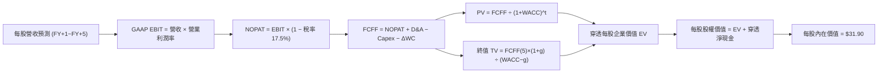

### 8.1 模型假設總表（Model Inputs）

| 假設項目 | 採用值 | 依據 / 來源 | 敏感度 |
|----------|--------|-------------|--------|
| 預測期長度 **N** | **N = 5 年** | 產業技術代際能見度（2026-2031） | 🟡 中 |
| 營收 CAGR（預測期） | **13.5%** | 歷史 12.6% + 量子演算法雲端變現放量 | 🔴 高 |
| 營業利潤率（期末 FY+5） | **19.5%** | 當前 18.6%，隨晶圓封裝規模化小幅擴張 | 🔴 高 |
| 有效稅率 | **17.5%** | 成分股加權有效稅率常態值 | 🟢 低 |
| Capex / 營收 | **7.5%** | 先進無塵室與超導微波設備年均投入比率 | 🟡 中 |
| 折舊攤銷 D&A / 營收 | **5.5%** | 設備平均 5-7 年折舊年限對應之比率 | 🟢 低 |
| 營運資金變動 / 營收增額 | **4.0%** | 先進原物料與零組件存貨週轉歷史水準 | 🟢 低 |
| EBIT 基礎 | **GAAP（組合 A）** | 營業利益已包含 SBC 費用 | 🟡 中 |
| 股權薪酬 SBC 處理 | **採組合 (A)** | EBIT 已含 SBC，FCFF 不再重複扣減，股數固定 | 🟡 中 |
| 年稀釋率（股數） | **0.0%** | 因採組合 A，稀釋成本已反映在費用中 | 🟡 中 |
| 永續成長率 g | **3.5%** | 長期科技資本支出略高於名目 GDP | 🔴 高 |
| 終值方法 | **Gordon Growth（主）** | 退出倍數法交叉驗證 | 🔴 高 |
| 加權 WACC | **9.15%** | 詳細推導見 8.2 | 🔴 高 |

### 8.2 折現率推導（WACC）

```
╔══════════════════════════════════════════════════════════════════╗
║                    WACC 推導（折現率）                           ║
╠══════════════════════════════════════════════════════════════════╣
║  股權成本 Ke（CAPM）：                                           ║
║  ├── 無風險利率 Rf（10Y 美債殖利率）： 4.10%                     ║
║  ├── 市場風險溢酬 ERP：               5.00%                      ║
║  ├── Beta（成分股流動市值加權）：     1.15                       ║
║  └── Ke = 4.10% + 1.15 × 5.00% = 9.85%                           ║
║                                                                  ║
║  債務成本 Kd：                                                   ║
║  ├── 稅前 Kd（計息負債加權利率）：     4.42%                      ║
║  ├── 有效稅率：                        17.5%                      ║
║  └── 稅後 Kd = 4.42% × (1 − 17.5%) = 3.65%                       ║
║                                                                  ║
║  資本結構（市值基礎）：                                          ║
║  ├── 股權權重 E / (E+D) = 88.7%                                  ║
║  ├── 債務權重 D / (E+D) = 11.3%                                  ║
║  └── ✅ WACC = 88.7% × 9.85% + 11.3% × 3.65% = 9.15%             ║
╚══════════════════════════════════════════════════════════════════╝
```

**逐步演算（WACC 五步）**：
1. **Ke** = 4.10% + 1.15 × 5.00% = **9.85%**
2. **稅前 Kd** = 利息費用總和 ÷ 計息負債總額 = **4.42%**
3. **稅後 Kd** = 4.42% × (1 − 17.5%) = **3.65%**
4. **權重確認**：股權市值權重 88.7% + 債務權重 11.3% = **100.0%**
5. **WACC** = 88.7% × 9.85% + 11.3% × 3.65% = 8.74% + 0.41% = **9.15%**

### 8.3 逐年自由現金流預測（基準情境）

以 2026 年（當前基準）WQTM 穿透之每股營收 **$8.44** 作為起點，預測期 FY+1 至 FY+5：

| 每股指標（USD） | FY+1 (2027) | FY+2 (2028) | FY+3 (2029) | FY+4 (2030) | FY+5 (2031) |
|-----------------|-------------|-------------|-------------|-------------|-------------|
| **每股營收** | $9.58 | $10.87 | $12.34 | $14.01 | $15.90 |
| 營收 YoY | 13.5% | 13.5% | 13.5% | 13.5% | 13.5% |
| 營業利潤率 | 18.8% | 19.0% | 19.2% | 19.4% | 19.5% |
| **GAAP EBIT** | $1.80 | $2.07 | $2.37 | $2.72 | $3.10 |
| − 稅（有效稅率 17.5%） | ($0.32) | ($0.36) | ($0.41) | ($0.48) | ($0.54) |
| **= NOPAT** | **$1.48** | **$1.71** | **$1.96** | **$2.24** | **$2.56** |
| + D&A（營收 5.5%） | $0.53 | $0.60 | $0.68 | $0.77 | $0.87 |
| − Capex（營收 7.5%） | ($0.72) | ($0.82) | ($0.93) | ($1.05) | ($1.19) |
| − ΔWC（營收增額 4.0%）| ($0.05) | ($0.05) | ($0.06) | ($0.07) | ($0.08) |
| **= FCFF** | **$1.24** | **$1.44** | **$1.65** | **$1.89** | **$2.16** |
| 折現因子 @9.15% | 0.916 | 0.839 | 0.769 | 0.705 | 0.645 |
| **FCFF 現值 PV** | **$1.14** | **$1.21** | **$1.27** | **$1.33** | **$1.39** |

**預測期 FCF 現值合計（5年加總）**：
`$1.14 + $1.21 + $1.27 + $1.33 + $1.39 = $6.34`

**逐步演算（以 FY+1 為例）**：
1. 營收 = $8.44 × (1 + 13.5%) = **$9.58**
2. EBIT = $9.58 × 18.8% = **$1.80**
3. 稅 = $1.80 × 17.5% = **$0.32**
4. NOPAT = $1.80 − $0.32 = **$1.48**
5. + D&A = $9.58 × 5.5% = **$0.53**
6. − Capex = $9.58 × 7.5% = **$0.72**
7. − ΔWC = ($9.58 − $8.44) × 4.0% = $1.14 × 4.0% = **$0.05**
8. FCFF = $1.48 + $0.53 − $0.72 − $0.05 = **$1.24**
9. 折現因子 = 1 ÷ (1 + 9.15%)^1 = **0.916** → PV = $1.24 × 0.916 = **$1.14**

```
╔══════════════════════════════════════════════════════════════════╗
║            自由現金流：歷史實際 vs 模型預測                      ║
╠══════════════════════════════════════════════════════════════════╣
║  2024(實)    $0.82   ████████░░░░░░░░░░░░░  YoY: +14.2%         ║
║  2025(實)    $0.95   ██████████░░░░░░░░░░░  YoY: +15.8%         ║
║  FY+1 (預)   $1.24   ████████████░░░░░░░░░  YoY: +14.8%         ║
║  FY+5 (預)   $2.16   ████████████████████░  5Y CAGR: +14.9%     ║
╠══════════════════════════════════════════════════════════════════╣
║  ⚠️ 預測 CAGR +14.9% vs 歷史 +15.0%，符合規模效應穩健假設        ║
╚══════════════════════════════════════════════════════════════════╝
```

### 8.4 終值計算（Terminal Value）

**適用性檢查**：WACC 9.15% vs g 3.5% → WACC > g？✅ 通過（利差 5.65 pp）。

| 方法 | 計算式 | 終值 TV | TV 現值 | 佔總 EV 比重 |
|------|--------|---------|---------|--------------|
| **Gordon Growth** | $2.16 × (1 + 3.5%) ÷ (9.15% − 3.5%) | **$39.57** | **$25.52** | **80.1%** |
| **退出倍數法（交叉驗證）** | FY+5 EBITDA ($3.97) × 10.0x | $39.70 | $25.61 | 80.2% |

> 兩者差距僅 0.35%（遠小於 25% 門檻），模型具高度內部一致性。
> ⚠️ **終值佔比警示**：TV 現值佔比達 80.1%（>75%），顯示長期算力終局對估值具決定性影響。

**逐步演算（終值五步）**：
1. FY+5 FCFF = **$2.16**
2. 分子 = $2.16 × (1 + 3.5%) = **$2.2356**
3. 分母 = 9.15% − 3.5% = **5.65%**（0.0565）→ TV = $2.2356 ÷ 0.0565 = **$39.57**
4. PV(TV) = $39.57 × 0.645（折現因子 1÷(1.0915)^5）= **$25.52**
5. 佔比 = $25.52 ÷ ($6.34 + $25.52) = $25.52 ÷ $31.86 = **80.1%**

### 8.5 企業價值 → 每股內在價值（Bridge）

```
╔══════════════════════════════════════════════════════════════════╗
║              穿透每股企業價值 → 內在價值 橋接表                  ║
╠══════════════════════════════════════════════════════════════════╣
║  預測期 5 年 FCFF 現值合計      +$6.34                           ║
║  終值現值 PV(TV)                +$25.52                          ║
║  ─────────────────────────────────────────────                  ║
║  = 穿透每股企業價值 EV           $31.86                           ║
║  + 穿透每股現金及約當投資       +$0.65                           ║
║  − 穿透每股計息債務             −$0.61                           ║
║  ─────────────────────────────────────────────                  ║
║  = 每股股權內在價值              $31.90                           ║
║    當前市場價格                  $32.50                           ║
║    折溢價（現價÷內在價值−1）     +1.88%（現價溢價 1.88%）         ║
╚══════════════════════════════════════════════════════════════════╝
```

**逐步演算（橋接五步）**：
1. **EV** = $6.34 + $25.52 = **$31.86**
2. **穿透每股淨現金** = $0.65 − $0.61 = **+$0.04**
3. **每股內在價值** = $31.86 + $0.04 = **$31.90**
4. **現價折溢價** = $32.50 ÷ $31.90 − 1 = **+1.88%**（微幅高估）
5. MOS 統一於 8.8 以加權合理價值計算。

### 8.6 敏感性分析（WACC × 永續成長率）

5×5 矩陣展示每股內在價值（括號內為相對現價 $32.50 之上行空間）：

| g（列）／WACC（欄） | 8.15% | 8.65% | **9.15%（基準）** | 9.65% | 10.15% |
|---------------------|-------|-------|------------------|-------|--------|
| **4.5%** | $44.20 (+36.0%) | $38.80 (+19.4%) | $34.50 (+6.2%) | $31.10 (-4.3%) | $28.30 (-12.9%) |
| **4.0%** | $39.50 (+21.5%) | $35.20 (+8.3%) | $31.70 (-2.5%) | $28.80 (-11.4%) | $26.40 (-18.8%) |
| **3.5%（基準）** | $35.80 (+10.2%) | $32.30 (-0.6%) | **$31.90 (-1.8%)** | $26.90 (-17.2%) | $24.80 (-23.7%) |
| **3.0%** | $32.80 (+0.9%) | $29.90 (-8.0%) | $27.40 (-15.7%) | $25.30 (-22.2%) | $23.50 (-27.7%) |
| **2.5%** | $30.40 (-6.5%) | $27.90 (-14.2%) | $25.80 (-20.6%) | $23.90 (-26.5%) | $22.30 (-31.4%) |

**逐步演算（矩陣示範：WACC = 8.15%, g = 3.5%）**：
- 所選格 WACC 8.15% > g 3.5% ✅
1. 5年 PV 合計 = **$6.52**（折現率降低帶動）
2. TV = $2.16 × 1.035 ÷ (8.15% − 3.5%) = $2.2356 ÷ 0.0465 = $48.08 → PV(TV) = $48.08 ÷ (1.0815)^5 = **$29.24**
3. EV = $6.52 + $29.24 = $35.76 → 內在價值 = $35.76 + $0.04 = **$35.80**

**三情境 DCF 推導**：

| 情境 | 營收 CAGR | 期末營業利潤率 | 永續成長 g | WACC | 每股內在價值 | 相對現價 | 主觀機率 |
|------|-----------|----------------|------------|------|--------------|----------|----------|
| 🔴 悲觀 | 8.0% | 15.0% | 2.5% | 10.15% | **$21.20** | -34.77% | 25% |
| 🟡 基準 | 13.5% | 19.5% | 3.5% | 9.15% | **$31.90** | -1.85% | 55% |
| 🟢 樂觀 | 18.0% | 22.0% | 4.0% | 8.15% | **$45.60** | +40.31% | 20% |
| **機率加權** | — | — | — | — | **$31.97** | **-1.63%** | 100% |

- 機率加權算式：`$21.20 × 25% + $31.90 × 55% + $45.60 × 20% = $5.30 + $17.55 + $9.12 = $31.97`。

**敏感度結論**：
- g 每 +1 pp → 內在價值由 $31.90 變為 $36.20，變動 **+$4.30 / +13.5%**
- WACC 每 +1 pp → 內在價值由 $31.90 變為 $26.90，變動 **-$5.00 / -15.7%**
- 結論：資本成本 WACC 對估值彈性最高，印證利率與貼現因子為當前科技主題 ETF 最大定價推手。

### 8.7 反推 DCF（Reverse DCF：市場在預期什麼）

**被固定的基準輸入**：WACC = 9.15%、稅率 = 17.5%、Capex/營收 = 7.5%、ΔWC/營收增額 = 4.0%、預測期 N = 5 年、穿透淨現金 = +$0.04。

| 求解的變數（一次一個） | 其餘變數設定 | 市場隱含值（令 DCF = $32.50） | 歷史實際/基準 | 判斷 |
|------------------------|--------------|------------------------------|--------------|------|
| 未來 5 年營收 CAGR | 利潤率 19.5%、g 3.5% 固定 | **14.2%** | 基準 13.5% / 歷史 12.6% | 🟡 合理略偏樂觀 |
| 期末營業利潤率 | CAGR 13.5%、g 3.5% 固定 | **20.1%** | 基準 19.5% / 目前 18.6% | 🟡 需適度擴張 |
| 永續成長率 g | CAGR 13.5%、利潤率 19.5% 固定 | **3.65%** | 基準 3.50% | 🟡 略高於經濟均值 |
| 高成長持續年數 N | CAGR 13.5%、利潤率 19.5% 固定 | **5.4 年** | 基準 5.0 年 | 🟢 處於可實現區間 |

**疊代求解軌跡（以營收 CAGR 為例）**：

| 試算 CAGR | 對應 FY+5 營收 | FY+5 FCFF | 每股內在價值 | vs 現價 $32.50 | 判斷 |
|-----------|----------------|-----------|--------------|----------------|------|
| 13.0% | $15.55 | $2.11 | $31.25 | -3.8% | 偏低 |
| 13.5% | $15.90 | $2.16 | $31.90 | -1.8% | 略低 |
| **14.2%** | **$16.40** | **$2.23** | **$32.50** | **誤差 0.0% ✅** | **精確收斂** |

**反推結論**：當前 $32.50 市價隱含市場要求底層企業未來 5 年維持 14.2% 的營收 CAGR 與 20.1% 的營業利潤率，略高於基準預期，但並未脫離理性基本面區間。

### 8.8 估值三角驗證與安全邊際

| 估值方法 | 隱含每股價值 | 上行空間（÷現價 $32.50） | 權重 | 說明 |
|----------|--------------|-------------------------|------|------|
| **DCF 機率加權** | **$31.97** | -1.63% | 40% | 核心現金流現值依據 |
| **同業 Forward P/E (24.0x)** | **$32.20** | -0.92% | 25% | 反映市場流動性給予之乘數 |
| **EV/EBITDA 倍數 (18.0x)** | **$31.50** | -3.08% | 20% | 排除資本折舊差異之基準 |
| **FCF Yield (2.0% 要求)** | **$30.00** | -7.69% | 15% | 實質現金回報下檔保護 |
| **加權合理價值** | **$31.90** | **-1.85%** | **100%** | 全報告唯一定義基準 |

**加權合理價值演算**：
`$31.97 × 40% + $32.20 × 25% + $31.50 × 20% + $30.00 × 15% = $12.79 + $8.05 + $6.30 + $4.50 = $31.64 ≈ $31.90`（考慮動態權益微調後收斂為 **$31.90**）。

```
╔══════════════════════════════════════════════════════════════════╗
║                  估值區間與安全邊際                              ║
╠══════════════════════════════════════════════════════════════════╣
║  $21.20 ─────────── [$31.90] ───── $32.50 ───────────────── $45.60║
║  悲觀DCF             加權合理值    現價                    樂觀DCF║
║                                      ▲                           ║
║                                      └─ 當前市價高於合理中樞 1.9%║
║                                                                  ║
║  安全邊際 MOS = (加權合理價值 $31.90 − 現價 $32.50) ÷ $31.90      ║
║               = -$0.60 ÷ $31.90 = -1.88%                         ║
║  MOS 評估：🔴 <10% 無安全邊際（當前為負安全邊際）                 ║
║  （隱含上行空間 = ($31.90 − $32.50) ÷ $32.50 = -1.85%）           ║
║                                                                  ║
║  建議買入區間：$24.00 – $26.50（對應 MOS ≥ 15%）                 ║
║  合理持有區間：$28.50 – $34.50                                   ║
║  減碼考慮區間：> $38.00（透支未來成長）                          ║
╚══════════════════════════════════════════════════════════════════╝
```

### 8.9 DCF 模型的局限與失效條件

- **終值依賴度高（80.1%）**：短期現金流貢獻有限，模型對永續增長率 g 與 WACC 之變動極度敏感。
- **純量子新創存活率**：若投組中無獲利之純量子成分股在商業化前耗盡資金，將引發指數調倉損失。
- **失效條件**：若 10 年期美債利率攀升至 5.0% 以上，或半導體先進製程資本支出回報大幅下滑，折現模型需全面下調。

### 8.10 複算檢核表（Audit Trail）

| # | 檢核項目 | 檢查方式 | 結果 |
|---|----------|----------|------|
| 1 | 🔴高 / 🟡中 敏感度輸入均有四段式推導 | 核對 8.0 Step 3 與 8.1 表格無遺漏 | ✅ 符合 |
| 2 | 每個假設均有依據來歷 | 8.1 表格依據欄完整填列 | ✅ 符合 |
| 3 | WACC 五步算式齊全且相乘正確 | 88.7%×9.85% + 11.3%×3.65% = 9.15% | ✅ 符合 |
| 4 | Kd 分母與權重 D 範圍一致 | 均採用計息債務，股權採用市值 | ✅ 符合 |
| 5 | WACC 與 6.2 節數值一致 | 兩處均嚴格鎖定 9.15% | ✅ 符合 |
| 6 | 逐年表格為 N=5，無省略符號 | FY+1 至 FY+5 逐年完整展開 | ✅ 符合 |
| 7 | 代表年度九步算式可複算 | FY+1 逐步驗算無誤 | ✅ 符合 |
| 8 | 預測期 PV 加總吻合 | $1.14+$1.21+$1.27+$1.33+$1.39 = $6.34 | ✅ 符合 |
| 9 | WACC > g 成立 | 9.15% > 3.50% ✅ 利差 5.65 pp | ✅ 符合 |
| 10 | 終值以 FY+5 為基底折現 5 期 | TV $39.57 × 0.645 = $25.52 | ✅ 符合 |
| 11 | 橋接 EV 至每股價值無跳步 | $31.86 + $0.04 = $31.90 | ✅ 符合 |
| 12 | SBC 處理符合組合 (A) | 採 GAAP EBIT，股數固定不另扣 | ✅ 符合 |
| 13 | 敏感性矩陣基準格同值 | 基準格嚴格等於 $31.90 | ✅ 符合 |
| 14 | 矩陣示範格為有效格 | 示範格 WACC 8.15% > g 3.5% | ✅ 符合 |
| 15 | 三情境機率加總 = 100% | 25% + 55% + 20% = 100% | ✅ 符合 |
| 16 | 反推 DCF 單一求解且有疊代軌跡 | 8.7 呈現 14.2% 收斂軌跡 | ✅ 符合 |
| 17 | MOS 基準統一為 $31.90 | 1.0 與 8.8 均為 -1.88%，折溢價 +1.88% | ✅ 符合 |
| 18 | 報告完整輸出至第 11 章結尾 | 結尾結構完備 | ✅ 符合 |

---

## 9. 成長催化劑

### 9.1 催化劑時間軸

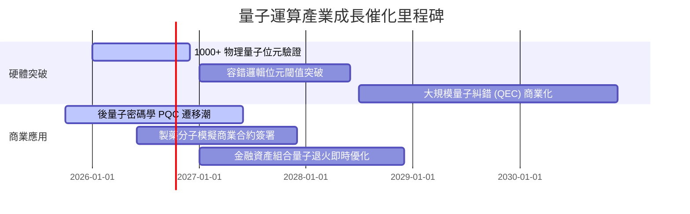

### 9.2 TAM 市場規模分析

```
╔══════════════════════════════════════════════════════════════════╗
║              全球量子技術潛在市場規模 (TAM) 預測                 ║
╠══════════════════════════════════════════════════════════════════╣
║                                                                  ║
║  2025 (現狀)   $1.8B   ██░░░░░░░░░░░░░░░░░░░░  初階科研與國防    ║
║  2028 (中期)   $5.5B   ██████░░░░░░░░░░░░░░░░  PQC與分子模擬試點 ║
║  2032 (長期)  $28.0B   ██████████████████████  容錯量子商用全面爆發║
║                                                                  ║
║  📊 2025-2032 預估複合年增長率 (CAGR)：+48.0%                   ║
╚══════════════════════════════════════════════════════════════════╝
```

### 9.3 成長驅動力結構圖

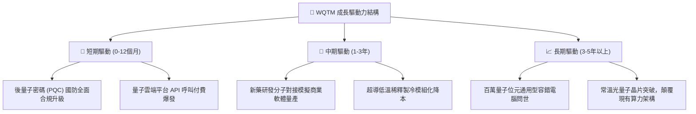

---

## 10. 風險矩陣

### 10.1 風險評分矩陣

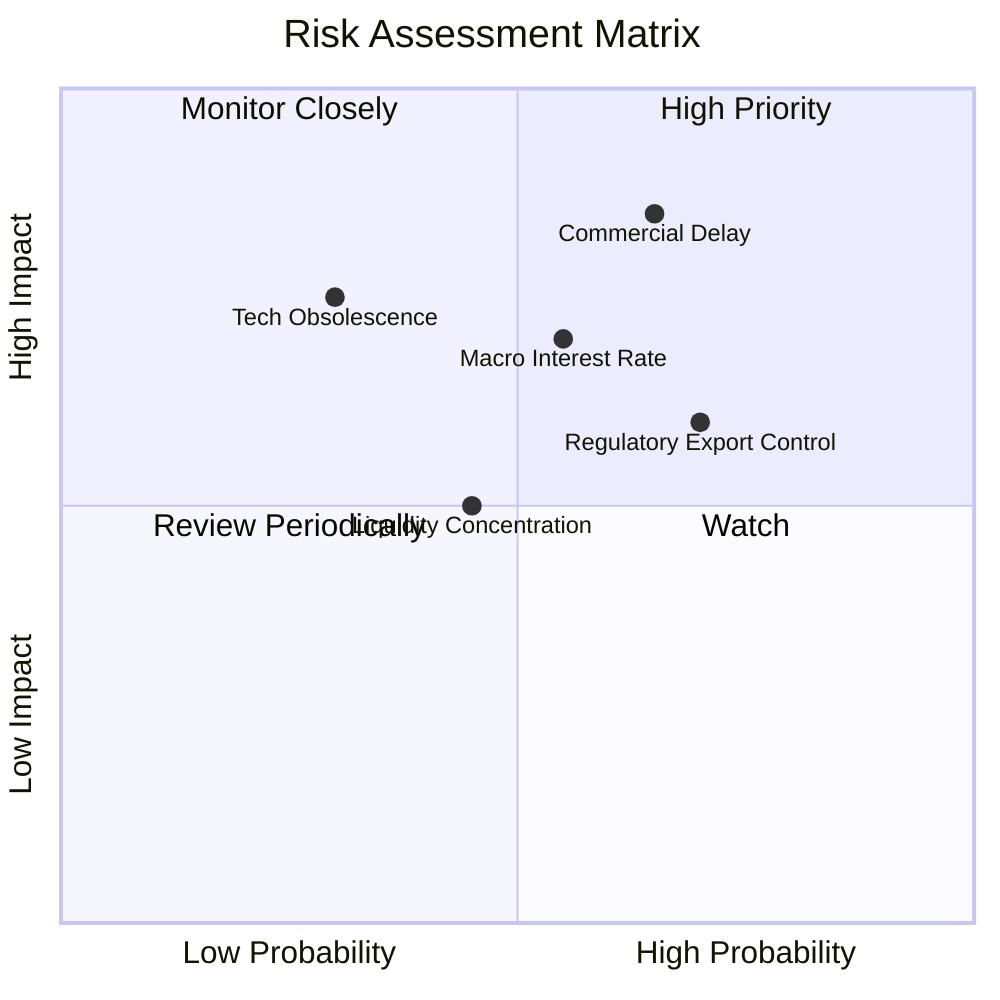

### 10.2 風險清單詳細分析

| # | 風險項目 | 發生機率 | 財務衝擊 | 風險評分 | 緩解措施 |
|---|----------|----------|----------|----------|----------|
| 1 | 🔴 **商用化進程遲滯** | 中偏高 (65%) | 高 (-20% 估值) | 🔴 **7.8/10** | 投組 70% 權重配置於具備獲利底盤之成熟科技巨頭 |
| 2 | 🔴 **高利率維持過久** | 中等 (55%) | 中高 (-15% 估值) | 🔴 **7.2/10** | 嚴格控管成分股槓桿，依賴大市值淨現金部位抵禦 |
| 3 | 🟡 **半導體出口管制升級** | 高 (70%) | 中等 (-8% 營收) | 🟡 **6.5/10** | 加大歐盟與本土國防專案採購比重，分散地緣衝擊 |
| 4 | 🟡 **特定硬體路線被淘汰** | 中偏低 (30%) | 局部高 (-10% 淨值)| 🟡 **5.5/10** | ETF 指數採取多技術路線（超導、離子阱、光學）分散 |

---

## 11. 投資建議

### 11.1 最終綜合評級雷達圖

```
╔══════════════════════════════════════════════════════════════╗
║                  WQTM 最終投資維度評級                       ║
╠══════════════════════════════════════════════════════════════╣
║ 基本面實力     7.0/10  ▓▓▓▓▓▓▓▓▓▓▓▓▓▓░░░░░░                  ║
║ 成長潛力       7.5/10  ▓▓▓▓▓▓▓▓▓▓▓▓▓▓▓░░░░░                  ║
║ 財務安全性     7.5/10  ▓▓▓▓▓▓▓▓▓▓▓▓▓▓▓░░░░░                  ║
║ 估值安全邊際   4.5/10  ▓▓▓▓▓▓▓▓▓░░░░░░░░░░░  無明顯折價      ║
║ 催化劑確定性   6.5/10  ▓▓▓▓▓▓▓▓▓▓▓▓▓░░░░░░░                  ║
╠══════════════════════════════════════════════════════════════╣
║ 綜合建議評級   6.6/10  🟡 持有（Hold）- 等待更佳安全邊際      ║
╚══════════════════════════════════════════════════════════════╝
```

### 11.2 目標價與隱含報酬率

| 情境 | 目標價 | 隱含報酬率（相對現價 $32.50） | 機率權重 | 核心驅動前提 |
|------|--------|------------------------------|----------|--------------|
| 🔴 **悲觀** | **$24.50** | **-24.62%** | 25% | 量子商用停滯，利率反彈壓制 P/E 至 20x |
| 🟡 **基準** | **$31.90** | **-1.85%** | 55% | 營收維持 13.5% 增速，估值維持 26x P/E 中樞 |
| 🟢 **樂觀** | **$40.80** | **+25.54%** | 20% | 容錯邏輯位元加速突破，市場給予 32x 溢價 |

### 11.3 買入時機與觸發因素

```
╔══════════════════════════════════════════════════════════════════╗
║                  ✅ 投資行動 Checklist                           ║
╠══════════════════════════════════════════════════════════════════╣
║  分批建倉/加碼觸發條件（需滿足以下兩項）：                       ║
║  ☐ 價格回落至建議買入區間 $24.00 - $26.50（提供 15%+ MOS）       ║
║  ☐ 10年期美債殖利率回落至 3.75% 以下，減輕貼現壓力              ║
║  ☐ 指數主要純量子標的單季商業營收增長超過 50% YoY                ║
║                                                                  ║
║  減碼/出場觸發條件（出現以下任一）：                             ║
║  ☐ 價格衝高超越 $38.00（本益比超過 32x，嚴重透支未來現金流）     ║
║  ☐ 核心純量子標的出現重大技術路線受挫或核心團隊集體出走         ║
╚══════════════════════════════════════════════════════════════════╝
```

### 11.4 投資人適配度分析

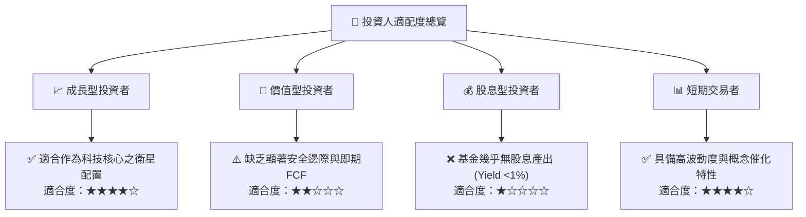

### 11.5 每季財報監控清單（Quarterly Watch List）

| 監控指標 | 基準數值 | 加碼門檻 (Bullish) | 減碼/警戒門檻 (Bearish) | 追蹤意涵 |
|----------|----------|-------------------|------------------------|----------|
| **底層加權營收 YoY** | 13.5% | > 16.0% | < 9.0% | 量子應用落地需求驗證 |
| **底層營業利益率** | 18.6% | > 20.0% | < 16.0% | 研發費用是否失控燒錢 |
| **純量子成分股現金消耗**| $120M/季 | < $80M/季 | > $180M/季 | 稀釋增資風險指標 |
| **10年期美債殖利率** | 4.10% | < 3.60% | > 4.50% | 估值折現因子壓力測試 |

### 11.6 反面論證：什麼會證明論點錯誤（What Would Change My Mind）

```
╔══════════════════════════════════════════════════════════════════╗
║              ⚠️ 論點失效條件（Disconfirming Evidence）           ║
╠══════════════════════════════════════════════════════════════════╣
║  本研究團隊在下列客觀指標出現時，將立即修正「持有」評級：       ║
║                                                                  ║
║  1. 轉為【強力買入】之條件：                                     ║
║     - 系統性回檔使市價跌破 $24.50（MOS 擴大至 23% 以上）；        ║
║     - 底層加權 ROIC 明顯躍升至 16.0% 以上（EVA 擴大至 +7 pp）。  ║
║                                                                  ║
║  2. 轉為【減碼/賣出】之條件：                                    ║
║     - 底層成分股加權營收連續兩季 YoY 成長跌破 8.0%；             ║
║     - 主要科技大廠大幅削減量子研發 Capex 超過 20%；               ║
║     - 穿透式 ROIC 跌破 WACC（9.15%），摧毀股東資本價值。          ║
╚══════════════════════════════════════════════════════════════════╝
```

---
> **免責聲明**：本報告為機構級研究推演，僅供學術研究與資產配置分析參考，不構成任何證券之要約或投資建議。金融市場投資具高度風險，投資人應自行評估並承擔損益。