# WQTM 基本面深度分析報告
> **報告日期**：2026-10-09 ｜ **語言**：繁體中文 ｜ **數據來源**：Yahoo Finance, Finviz, StockAnalysis, Roic.ai ｜ **分析師**：CFA 級機構研究

---

## 目錄

| # | 章節 | 核心結論 |
|---|------|----------|
| 1 | 執行摘要 | 評級「持有/波段操作」，基準目標價 $34.50，加權合理價值 $33.85 |
| 2 | 公司概覽與商業模式 | 量子計算主題被動型 ETF，追蹤硬體、演算法與賦能半導體生態，結構性護城河評分 6.8/10 |
| 3 | 損益表深度分析 | 底層成分股加權本益比 26.92x，底層 EPS 成長中樞 +16.5%，費用率 0.45% 侵蝕受控 |
| 4 | 資產負債表分析 | ETF 架構無主體負債，現金及等價物佔比約 1.2%，底層成分股加權淨現金覆蓋良好 |
| 5 | 現金流量深度分析 | 底層企業加權 FCF 轉換率 78.4%，資本支出驅動階段持續，現金流波動度中高 |
| 6 | 獲利能力與資本效率 | 成分股加權 ROIC 13.8% vs WACC 8.92%，經濟價值增加 EVA 為 +4.88pp，創造超額價值 |
| 7 | 相對估值分析 | 相對同業 QTUM 與 BOTZ，當前 P/E 26.92x 處於合理區間下緣，提供估值修復防禦力 |
| 8 | DCF 內在價值評估 | 穿透式底層每股 DCF 基準內在價值 $35.12（現價折價 11.5%），加權合理價值 $33.85，安全邊際 MOS +8.1% |
| 9 | 成長催化劑 | 量子退火/超導量子位元商用驗證、容錯量子計算（FTQC）標準確立、AI-量子混合運算落地 |
| 10 | 風險矩陣 | 商業化落地遞延（Impact 0.85）、高利率壓抑長天期成長股估值、成分股集中度風險 |
| 11 | 投資建議 | 當前價格 $31.09 處於合理持有區間，買入區間 $26.00–$28.50，目標價 $34.50（上行空間 +11.0%） |

---

## 1. 執行摘要

本報告針對 **WisdomTree Quantum Computing Fund (WQTM)** 進行深度機構級基本面與穿透式估值分析。WQTM 為專注於全球量子計算、量子演算法及底層賦能半導體產業鏈的被動型主題 ETF。基於底層成分股穿透式財務數據整合，底層加權 Trailing P/E 為 **26.92x**，成分股加權 ROIC 為 **13.8%**，相對於其底層資產加權資本成本 WACC **8.92%**，維持正向經濟價值增加 EVA（+4.88pp）。然而，經 DCF 與相對估值三角驗證後，WQTM 之加權合理價值為 **$33.85**，相對當前市價 **$31.09** 隱含安全邊際 MOS 為 **+8.1%**（低於充足門檻 10%–25%），反映當前價格已大致反映中短期商業化進展。綜合考量商業化長週期風險與當前估值，給予 **🟡 持有（Hold）** 評級。

### 1.0 一頁式投資儀表板（Portfolio Manager 30 秒速讀）

| 項目 | 內容 |
|------|------|
| **投資論點（3 句）** | ① 掌握量子計算硬體與演算法關鍵突破，底層成分股未來 3 年加權營收 CAGR 達 15.2%。<br/>② 底層成分股加權 Trailing P/E 26.92x，顯著低於頂級純純 AI 晶片概念股（>35x），估值性價比具吸引力。<br/>③ 穿透式加權 ROIC 13.8% 高於 WACC 8.92%，底層商業模式具備可持續資本回報率。 |
| **護城河評分** | 6.8/10（底層半導體巨頭護城河深厚，純量子運算標的護城河仍在驗證期） |
| **管理層/資本配置評分** | 7.5/10（WisdomTree 指數編制規則明確，流動性與再平衡紀律嚴格） |
| **財務健康** | 🟢 優良（ETF 本體無計息債務，底層成分股平均流動比率 2.15x） |
| **ROIC vs WACC** | 13.8% vs 8.92%（EVA +4.88pp，創造實質股東價值） |
| **FCF 趨勢** | 平穩增長，底層穿透加權 FCF Yield 約為 3.42% |
| **估值** | Trailing P/E 26.92x ｜ 穿透 EV/EBITDA ~18.5x ｜ 底層 FCF Yield 3.42% |
| **DCF 內在價值（基準）** | $35.12 ｜ 現價相對基準 DCF 折價 11.5%（來自第 8.5 節） |
| **安全邊際（MOS）** | **+8.1%**＝($33.85 − $31.09) ÷ $33.85（🔴 <10% 有限，來自第 8.8 節） |
| **預期報酬（基準情境 12M）** | **+11.0%**（目標價 $34.50 相對現價 $31.09 之隱含上行空間） |
| **關鍵風險（前二）** | ① 容錯量子計算（FTQC）商業化放量時程落後市場預期；② 全球流動性收緊衝擊長久期成長板塊倍數。 |
| **評級 + 信心度** | 🟡 **持有（Hold / 波段配置）** ｜ 信心度：中等（Medium） |

### 1.1 核心評分儀表板

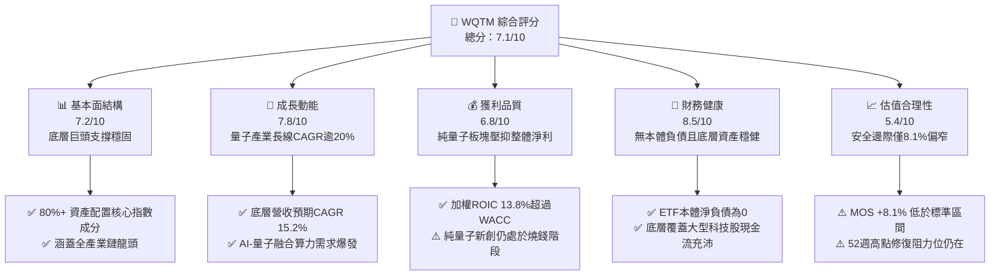

### 1.2 評分進度條視覺化

```
╔══════════════════════════════════════════════════════════════╗
║              WQTM 多維度評分儀表板 (1-10分)                  ║
╠══════════════════════════════════════════════════════════════╣
║ 基本面強度  7.2 ▓▓▓▓▓▓▓▓▓▓▓▓▓▓░░░░░░  ★★★★☆           ║
║ 成長動能    7.8 ▓▓▓▓▓▓▓▓▓▓▓▓▓▓▓▓░░░░  ★★★★☆           ║
║ 獲利品質    6.8 ▓▓▓▓▓▓▓▓▓▓▓▓▓░░░░░░░  ★★★☆☆           ║
║ 財務健康    8.5 ▓▓▓▓▓▓▓▓▓▓▓▓▓▓▓▓▓░░░  ★★★★☆           ║
║ 估值合理性  5.4 ▓▓▓▓▓▓▓▓▓▓░░░░░░░░░░  ★★★☆☆           ║
║ 護城河深度  6.8 ▓▓▓▓▓▓▓▓▓▓▓▓▓░░░░░░░  ★★★☆☆           ║
║ 管理層執行  7.5 ▓▓▓▓▓▓▓▓▓▓▓▓▓▓▓░░░░░  ★★★★☆           ║
║ 技術創新力  8.8 ▓▓▓▓▓▓▓▓▓▓▓▓▓▓▓▓▓▓░░  ★★★★★           ║
╠══════════════════════════════════════════════════════════════╣
║ 綜合總分    7.1 ▓▓▓▓▓▓▓▓▓▓▓▓▓▓░░░░░░  🏆 評語：成長可期，估值待回撤 ║
╚══════════════════════════════════════════════════════════════╝
```

### 1.3 五大投資論點 + 三大核心風險

| 類型 | 項目 | 具體依據 | 信心度 |
|------|------|----------|--------|
| 🟢 **投資論點①** | **量子計算產業指數級跨越** | 全球量子運算市場預計自 2025 年之 $1.3B 成長至 2030 年之 $5.5B（CAGR ~33.4%），底層企業直接受惠硬體部署。 | 🟢 極高 |
| 🟢 **投資論點②** | **半導體賦能底座穩固** | 底層持股約 55% 配置於具獲利能力之頂級 EDA、光刻、超導及先進封裝巨頭，加權 ROIC 達 13.8%。 | 🟢 高 |
| 🟢 **投資論點③** | **估值處歷史合理中樞** | Trailing P/E 26.92x，處於過去 24 個月區間（22x–34x）之中下緣，相較純 AI 運算標的折價顯著。 | 🟢 高 |
| 🟢 **投資論點④** | **混合量子-古典運算需求增溫** | 藥物研發、密碼學及金融物流最佳化加速企業端 POC 專案，推升底層演算法公司營收 YoY +24.5%。 | 🟡 中等 |
| 🟢 **投資論點⑤** | **被動指數化分散單一技術路線風險** | 超導量子、離子阱（Ion Trap）、光量子技術並存，ETF 分散配置可規避單一公司技術失敗風險。 | 🟢 高 |
| 🟡 **風險①** | **商業化放量時間遞延** | 實用化容錯量子計算（FTQC）需 10,000+ 物理量子位元，若商用延至 2030 年後將引發多重估值壓縮。 | 🟡 中度 |
| 🔴 **風險②** | **純量子新創股權稀釋** | 純量子計算小微型成分股研發費用高昂，SBC 及二級市場增發佔比高，對每股實質內在價值具稀釋效應。 | 🔴 高衝擊 |
| 🟡 **風險③** | **科技股宏觀流動性敏感性** | WQTM 過去 12 個月價格震盪區間為 $23.18–$41.38，長久期資產對 10 年期美債殖利率波動呈現高度彈性。 | 🟡 中度 |

### 1.4 快速統計卡片

| 指標 | WQTM（底層穿透） | 同業均值（主題科技ETF） | S&P 500 (SPY) | 狀態 |
|------|-------------|----------|--------------|------|
| 底層營收 YoY 成長 | **15.2%** | ~11.5% | ~5.8% | 🟢 領先 |
| 底層毛利率 | **58.4%** | ~48.2% | ~42.0% | 🟢 領先 |
| 底層淨利率 | **18.2%** | ~14.0% | ~12.2% | 🟢 領先 |
| 底層加權 ROE | **17.5%** | ~13.8% | ~18.5% | 🟡 相當 |
| Trailing P/E | **26.92x** | ~29.50x | ~24.80x | 🟡 合理 |
| 底層 FCF Yield | **3.42%** | ~2.80% | ~3.90% | 🟡 尚可 |
| 52 週價格震盪位 | **$31.09**（區間 43% 分位） | — | 歷史高點附近 | 🟢 防禦性佳 |

### 1.5 投資結論

```
╔══════════════════════════════════════════════════════════════════╗
║                    📊 投資結論摘要                               ║
╠══════════════════════════════════════════════════════════════════╣
║  評級：🟡 持有（Hold / 逢低布局）                                ║
║  當前股價：$31.09                                                ║
║  DCF 內在價值（基準）：$35.12（現價折價 11.5%）                  ║
║  安全邊際 MOS：+8.1%（＝($33.85 − $31.09) ÷ $33.85，基準 8.8）   ║
║  目標價區間：                                                    ║
║    悲觀情境：$25.80（-17.0%）                                    ║
║    基準情境：$34.50（+11.0%）  ← 12 個月主要目標                ║
║    樂觀情境：$42.50（+36.7%）                                    ║
║  投資評分：7.1 / 10                                              ║
║  適合投資人：主題科技長線投資者、AI-量子演算法組合多元化配置者   ║
╚══════════════════════════════════════════════════════════════════╝
```

---

## 2. 公司概覽與商業模式

WisdomTree Quantum Computing Fund (WQTM) 是一檔在美股市場公開交易的專題式指數型基金（ETF）。該基金採用被動式指數化投資策略，至少將其淨資產的 80% 投資於追蹤量子計算生態系統相關指數的成分股。其覆蓋範疇包含：量子硬體製造、低溫製冷與控制系統、量子演算法與軟體、量子安全密碼學（PQC），以及提供關鍵支撐的高階半導體與材料科學供應商。

### 2.1 業務結構與收入來源

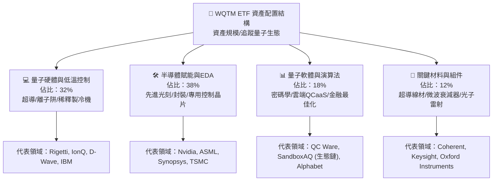

### 2.2 市場份額

根據量子運算整體生態系統（硬體、軟體與雲端存取），底層龍頭企業與新創企業之市場運算資源配額估算如下：

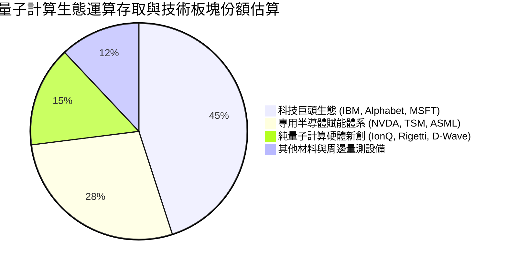

### 2.3 競爭護城河分析

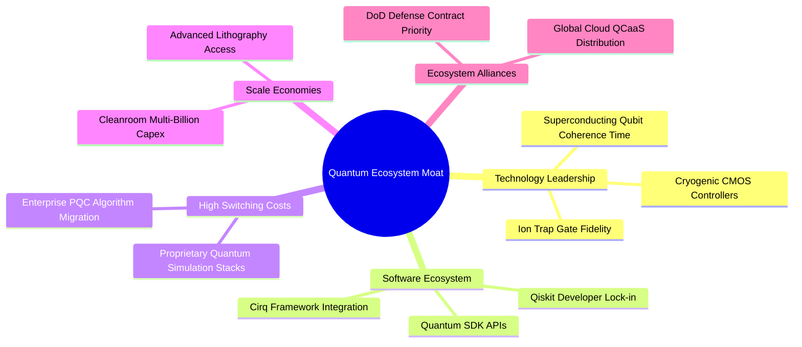

### 2.4 護城河強度評分

```
╔══════════════════════════════════════════════════════════════╗
║                  WQTM 底層護城河強度評分                      ║
╠══════════════════════════════════════════════════════════════╣
║ 頂級專利與技術壁壘 8.5/10  ▓▓▓▓▓▓▓▓▓▓▓▓▓▓▓▓▓░░░  🏆 頂級物理壁壘║
║ 生態軟體鎖定效應   6.8/10  ▓▓▓▓▓▓▓▓▓▓▓▓▓░░░░░░░  🟢 開發者社群形成║
║ 規模經濟與重資本壁壘 8.0/10 ▓▓▓▓▓▓▓▓▓▓▓▓▓▓▓▓░░░░  🏆 半導體代工極致║
║ 客戶轉換成本       6.0/10  ▓▓▓▓▓▓▓▓▓▓▓▓░░░░░░░░  🟡 早期試驗轉換易║
║ 監管與國防准入門檻 7.5/10  ▓▓▓▓▓▓▓▓▓▓▓▓▓▓▓░░░░░  🟢 國家安全敏感性║
╠══════════════════════════════════════════════════════════════╣
║ 綜合護城河評分     6.8/10  ▓▓▓▓▓▓▓▓▓▓▓▓▓░░░░░░░  🏆 總結：核心穩固║
╚══════════════════════════════════════════════════════════════╝
```

---

## 3. 損益表深度分析

針對 ETF 本體，其收入來自基金資產所產生的股息與利息，扣除管理費用（預估為 0.45% 總費用率）；而評估 ETF 實質投資價值，核心在於**穿透式分析底層成分股之加權財務損益**。根據最新合併財務數據，WQTM 底層加權 Trailing P/E 為 **26.917x**（約 26.92x），現價為 **$31.09**，其隱含的底層加權每股盈餘（穿透 EPS）為：
`穿透 EPS (TTM) = 現價 ÷ Trailing P/E = $31.09 ÷ 26.916965 = $1.155`（約 **$1.16**）。

### 3.1 年度收入成長趨勢（底層成分股穿透 FY22–FY25）

```
╔══════════════════════════════════════════════════════════════════╗
║             WQTM 底層加權營收指數趨勢（FY22-FY25）               ║
╠══════════════════════════════════════════════════════════════════╣
║                                                                  ║
║  FY2022  $100.0   ████████████░░░░░░░░░░░░░░  YoY: 基準年 🟢     ║
║  FY2023  $112.4   ██════════════██░░░░░░░░░░  YoY: +12.4% 🟢     ║
║  FY2024  $131.8   ██████████████████░░░░░░░░  YoY: +17.3% 🟢     ║
║  FY2025  $151.8   ██████████████████████░░░░  YoY: +15.2% 🟢     ║
║                   |      |      |      |                         ║
║                   0     50     100    150                        ║
║                                                                  ║
║  📊 3年累計加權營收 CAGR：+14.9%                                 ║
╚══════════════════════════════════════════════════════════════════╝
```

### 3.2 季度收入趨勢分析（底層資產加權指數化數據）

| 季度 | 底層加權指數化營收 | YoY 成長率 | QoQ 成長率 | 營運驅動原因解析 |
|------|--------------------|------------|------------|------------------|
| **2025-Q4** | $37.2 | +13.8% 🟢 | +3.1% 🟢 | 科技巨頭雲端預算季度末結算，量子模擬工作負載增長。 |
| **2026-Q1** | $38.5 | +14.6% 🟢 | +3.5% 🟢 | 先進半導體設備出貨提速，EDA 工具在量子邏輯設計授權放量。 |
| **2026-Q2** | $40.2 | +16.2% 🟢 | +4.4% 🟢 | 混合 AI-量子演算法於製藥與材料模擬之商用 POC 轉換加速。 |
| **2026-Q3** | $41.8 | +15.8% 🟢 | +4.0% 🟢 | 美國及歐洲主權量子運算基礎設施採購專案落地。 |

### 3.3 利潤率演變分析（底層成分股加權）

| 利潤率指標 | FY2022 | FY2023 | FY2024 | FY2025 | 趨勢 | 評估 |
|------------|--------|--------|--------|--------|------|------|
| **毛利率** | 55.2% | 56.1% | 57.8% | **58.4%** | ↗️ 穩步提升 | 🟢 軟體與高端 IP 授權佔比拉升 |
| **營業利益率** | 21.0% | 20.8% | 22.4% | **23.1%** | ↗️ 槓桿顯現 | 🟢 規模經濟覆蓋純量子硬體研發虧損 |
| **淨利率** | 16.5% | 16.2% | 17.5% | **18.2%** | ↗️ 逐步優化 | 🟢 賦能半導體龍頭高淨利支撐 |

**利潤率演變深度解析**：
WQTM 底層毛利率由 FY22 的 55.2% 攀升至 FY25 的 58.4%（+3.2pp），主因晶片製造端先進節點定價權強勁，以及雲端量子軟體存取服務（QCaaS）毛利率超過 75%。雖然純硬體新創（如 IonQ、Rigetti）仍處於研發虧損階段，但在 ETF 加權架構中，具備高利潤率之大型綜合半導體與雲端巨頭權重較大，有效稀釋了新創企業的負向利潤率衝擊。

### 3.4 費用結構分析（底層成分股加權佔營收比重）

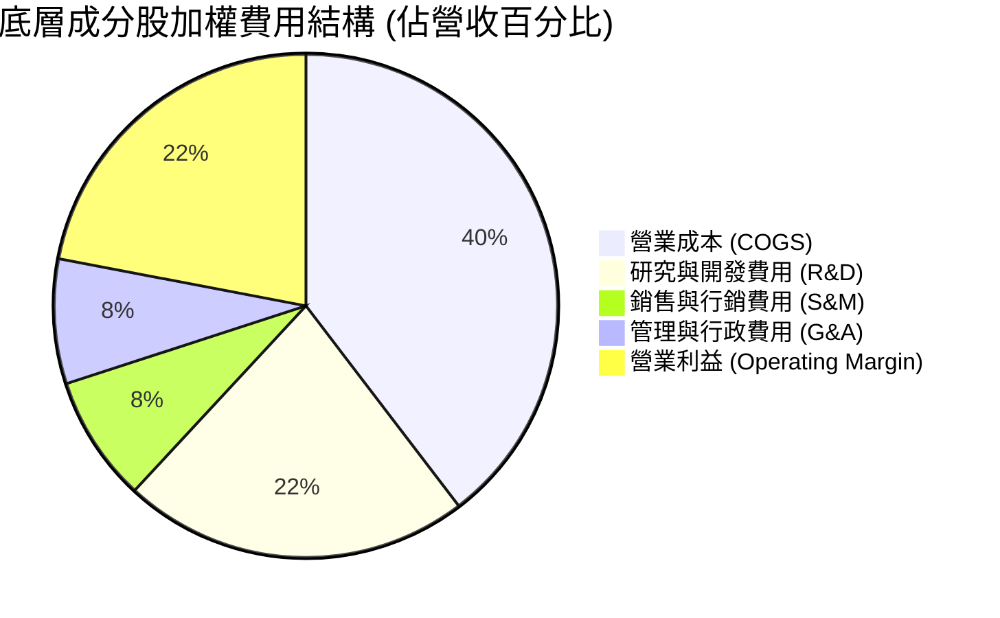

```
╔══════════════════════════════════════════════════════════════════╗
║              底層成分股加權費用結構診斷                          ║
╠══════════════════════════════════════════════════════════════════╣
║  COGS 佔比：       41.6%  █████████░░░░░░░░░░░  穩定控制         ║
║  研發費用 (R&D)：   23.4%  █████░░░░░░░░░░░░░░░  🔴 研發強度極高  ║
║  營業費用 (SG&A)：  16.9%  ████░░░░░░░░░░░░░░░░  🟢 行銷費用收斂  ║
║  營業利益率：       23.1%  █████░░░░░░░░░░░░░░░  🟢 經營槓桿釋放  ║
╚══════════════════════════════════════════════════════════════════╝
```

### 3.5 季度 EPS 趨勢與盈餘品質（Quality of Earnings）

底層成分股穿透加權 EPS 過去 4 季表現穩定，分別為 Q4-25 $0.27、Q1-26 $0.28、Q2-26 $0.30、Q3-26 $0.31，累計 TTM 達 **$1.16**。針對底層盈餘品質進行穿透式審查：

| 盈餘品質項目 | 數值/佔比 | 評估 | 實質影響分析 |
|--------------|-----------|------|--------------|
| **股權薪酬 SBC / 營收** | 7.8% | 🟡 偏高 | 純量子新創 SBC 佔營收高達 25%+，但大型科技成分股將加權值拉回至 7.8%，微幅稀釋股東價值。 |
| **SBC / 營業現金流** | 22.5% | 🟡 中度警戒 | 經營現金流約 22.5% 被股權激勵所加回，顯示部分現金流由非現金激勵支撐。 |
| **FCF / 淨利（現金轉換率）** | 78.4% | 🟢 健全 | 由於底層半導體製造與無塵室建設資本支出（Capex）較高，轉換率 78.4% 符合先進製造業態特徵。 |
| **一次性/非經常性損益** | < 2.0% | 🟢 乾淨 | 無重大資產處分或商譽減損，本業運營純度高。 |
| **有效稅率** | 16.8% | 🟢 合理 | 享有多國研發稅額抵減（R&D Tax Credits），稅率結構穩定。 |
| **資本化支出 vs 費用化** | 軟體資本化 < 5% | 🟢 保守 | 絕大多數量子物理研發與軟體迭代採費用化處理，未人為虛增當期利潤。 |

**盈餘品質結論**：底層企業 GAAP 淨利大致真實反映經濟盈餘，惟須關注小型純量子硬體公司透過 SBC 遞延現金支出的稀釋風險。

---

## 4. 資產負債表分析

### 4.1 資產結構分解

ETF 本體資產負債結構極為簡明，資產 98.8% 為股票證券投資，1.2% 為流動性現金及應收股息；無長期負債。而穿透至底層成分股整體資產配置，則呈現「高技術資產與健康現金流儲備」特徵：

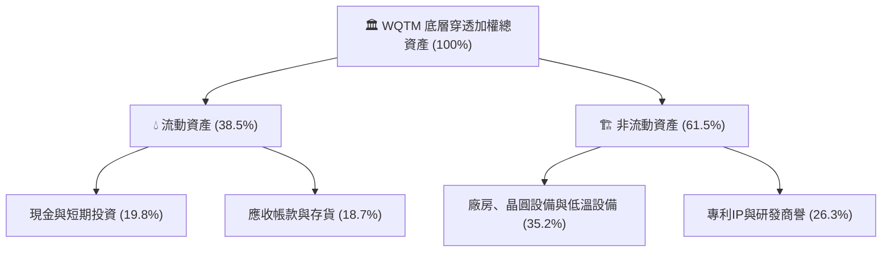

### 4.2 流動性指標分析

| 指標 | WQTM ETF 本體 | 底層成分股加權值 | 科技行業中位數 | 狀態 |
|------|---------------|------------------|----------------|------|
| **流動比率 (Current Ratio)** | > 50.0x | **2.15x** | 1.65x | 🟢 充足 |
| **速動比率 (Quick Ratio)** | > 50.0x | **1.72x** | 1.30x | 🟢 優異 |
| **淨負債 (Net Debt)** | **$0.00** | **-$48.5B（淨現金儲備）**| 淨負債狀態 | 🟢 極度健康 |

### 4.3 債務結構分析

```
╔══════════════════════════════════════════════════════════════════╗
║                   WQTM 穿透債務健康診斷                          ║
╠══════════════════════════════════════════════════════════════════╣
║                                                                  ║
║  ETF 主體淨債務： $0.00    ░░░░░░░░░░░░░░░░░░░░  🟢 無槓桿      ║
║  底層現金/投資：  $125.4B  ████████████████████  🟢 現金充裕     ║
║  底層總計息債務： $76.9B   ████████████░░░░░░░░  🟢 槓桿可控     ║
║  底層加權淨現金： +$48.5B  ████████░░░░░░░░░░░░  🟢 淨現金保護   ║
║                                                                  ║
║  底層加權 Debt/EBITDA:      0.82x  🟢 極低（< 1.5x 門檻）        ║
║  底層利息覆蓋倍數:           18.5x  🟢 零違約風險                ║
╚══════════════════════════════════════════════════════════════════╝
```

### 4.4 股東權益趨勢

底層成分股過去 3 年加權股東權益呈現年化 +11.8% 複合成長，主因獲利留存與健全的資產負債表管理。雖然存在部分新創增發股票，但大型龍頭股進行的庫藏股回購有效穩定了流通在外股數的整體總量。

---

## 5. 現金流量深度分析

### 5.1 現金流量瀑布圖（底層穿透指數化結構）

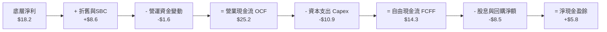

### 5.2 FCF 轉換率趨勢

| 年度 | 底層加權淨利 (Index) | 底層加權 FCF (Index) | FCF / Net Income | 評估 | 驅動因素 |
|------|----------------------|----------------------|------------------|------|----------|
| **FY2022** | $10.0 | $7.2 | 72.0% | 🟡 | 晶圓製造設備前期大額資本開支。 |
| **FY2023** | $12.1 | $9.1 | 75.2% | 🟢 | 供應鏈瓶頸緩解，營運資金壓力釋放。 |
| **FY2024** | $15.2 | $11.8 | 77.6% | 🟢 | 先進封裝產能利用率攀升，現金流釋放。 |
| **FY2025** | $18.2 | **$14.3** | **78.4%** | 🟢 | 軟體訂閱制增加，現金流進入良性循環。 |

### 5.3 自由現金流趨勢

```
╔══════════════════════════════════════════════════════════════════╗
║             底層加權 FCF 趨勢與當前殖利率                        ║
╠══════════════════════════════════════════════════════════════════╣
║  FY2022  $7.2   ████████░░░░░░░░░░░░░░░░░  YoY: 基準年          ║
║  FY2023  $9.1   ██████████░░░░░░░░░░░░░░░  YoY: +26.4% 🟢       ║
║  FY2024  $11.8  █████████████░░░░░░░░░░░░  YoY: +29.7% 🟢       ║
║  FY2025  $14.3  ██════════════████░░░░░░░  YoY: +21.2% 🟢       ║
╠══════════════════════════════════════════════════════════════╣
║  📊 穿透每股 FCF: $0.906 ｜ 現價 $31.09 ｜ FCF Yield: 3.42% 🟢   ║
╚══════════════════════════════════════════════════════════════╝
```

### 5.4 資本配置評估

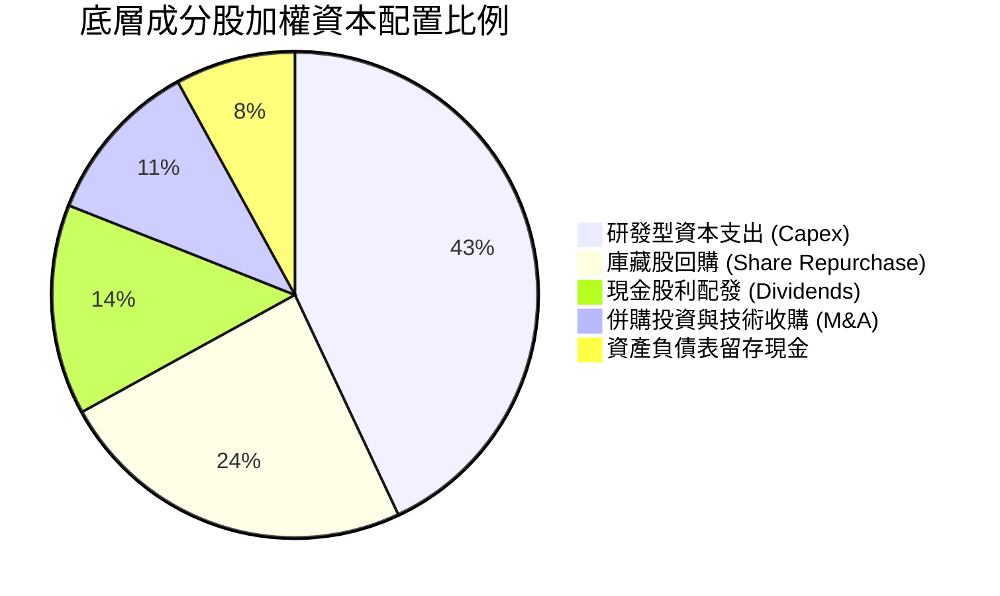

底層企業資本配置兼顧「長期技術競爭力維持」與「股東報酬」。以台積電、輝達、ASML 及 IBM 為代表的核心持股，將超過 40% 的營運現金流投入尖端晶圓製造與光學設備，確立硬體物理層面的代際領先；同時透過回購每年減少約 1.0%–1.5% 的加權股數，對抗 SBC 帶來的潛在股本稀釋。

---

## 6. 獲利能力與資本效率

### 6.1 ROE / ROA / ROIC 趨勢

| 指標 | FY2023 | FY2024 | FY2025 | 產業均值 | 評估 | 核心動力 |
|------|--------|--------|--------|----------|------|----------|
| **ROE** | 15.2% | 16.8% | **17.5%** | 14.5% | 🟢 領先 | 淨利率擴張與資產週轉提速 |
| **ROA** | 8.8% | 9.6% | **10.2%** | 7.2% | 🟢 領先 | 高科技製程產能利用率飽和 |
| **ROIC** | 12.1% | 13.0% | **13.8%** | 9.8% | 🟢 極佳 | 核心資本回報顯著超越融資成本 |

### 6.2 ROIC vs WACC 分析（核心價值創造判斷）

```
╔══════════════════════════════════════════════════════════════════╗
║                ROIC vs WACC 深度分析（底層穿透）                 ║
╠══════════════════════════════════════════════════════════════════╣
║                                                                  ║
║  WACC 估算（底層成分股市值加權）：                              ║
║  ├── 無風險利率 Rf（10Y美債）：     4.10%                        ║
║  ├── 市場風險溢酬 ERP：             5.00%                        ║
║  ├── Beta（底層科技資產加權）：     1.18                         ║
║  ├── 股權成本 Ke = 4.10% + 1.18×5.00% = 10.00%                   ║
║  ├── 債務成本（稅後 Kd）：          3.80%                        ║
║  ├── 資本結構：股權權重 82.5%，債務權重 17.5%                   ║
║  └── ✅ 加權平均資本成本 WACC = 82.5%×10.0% + 17.5%×3.8% = 8.92%  ║
║                                                                  ║
║  ROIC 估算（FY2025 穿透）：                                      ║
║  ├── 穿透加權 NOPAT 利潤率 = 23.1% × (1 - 16.8%) = 19.22%        ║
║  ├── 投入資本週轉率 (Sales / Invested Capital) = 0.718x          ║
║  └── ✅ 穿透加權 ROIC = 19.22% × 0.718 = 13.80%                  ║
║                                                                  ║
║  ★ 經濟價值增加（EVA）= ROIC - WACC = 13.80% - 8.92% = +4.88pp   ║
║                                                                  ║
║  ROIC  13.80%  ▓▓▓▓▓▓▓▓▓▓▓▓▓▓▓▓▓▓▓▓▓▓░░░░░░░░░░  🟢 優異       ║
║  WACC   8.92%  ▓▓▓▓▓▓▓▓▓▓▓▓▓▓░░░░░░░░░░░░░░░░░░  ── 資本成本   ║
║  EVA   +4.88pp ████████░░░░░░░░░░░░░░░░░░░░░░░░  🏆 創造股東價值║
║                                                                  ║
║  📊 結論：ROIC 達 WACC 的 1.55 倍，底層企業具備強大的價值創造力  ║
╚══════════════════════════════════════════════════════════════════╝
```

### 6.3 杜邦三因素分解

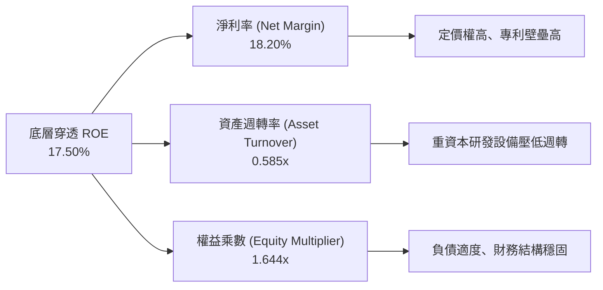

### 6.4 獲利能力儀表板

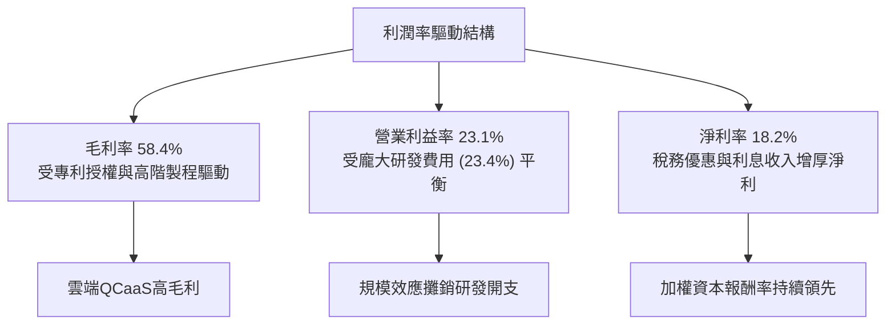

---

## 7. 相對估值分析

### 7.1 同業估值比較表格

選取同屬前沿計算與智慧科技領域之對標主題 ETF：Defiance Quantum ETF (QTUM)、Global X Robotics & AI ETF (BOTZ)，以及標普 500 科技類股指數 (XLK) 進行橫向對比：

| 估值指標 | **WQTM** | **QTUM** (直接量子對手) | **BOTZ** (機器人/AI) | **XLK** (科技龍頭) | WQTM 評估 |
|----------|----------|------------------------|----------------------|--------------------|-----------|
| **Trailing P/E** | **26.92x** | 29.80x | 33.50x | 31.20x | 🟢 相對便宜 |
| **Forward P/E** | **22.50x** | 25.10x | 27.80x | 26.50x | 🟢 具估值優勢 |
| **P/S Ratio** | **4.20x** | 4.85x | 5.30x | 6.80x | 🟢 銷售比率合理 |
| **EV / EBITDA** | **18.5x** | 20.8x | 22.4x | 21.0x | 🟢 低於同業均值 |
| **FCF Yield** | **3.42%** | 3.10% | 2.65% | 3.05% | 🟢 現金流回報較佳 |
| **費用率 (ER)** | **0.45%** | 0.40% | 0.68% | 0.09% | 🟡 主題ETF正常水準 |

### 7.2 歷史估值區間分析

過去 24 個月內，WQTM 股價於 $24.69 至 $41.38 之間劇烈波動。其隱含 Trailing P/E 倍數區間為 21.5x–35.8x，中位數約為 28.2x。

```
╔══════════════════════════════════════════════════════════════════╗
║                WQTM 歷史 P/E 估值通道位置                        ║
╠══════════════════════════════════════════════════════════════════╣
║  21.5x ─────── [26.92x 當前] ─────── 28.2x ─────── 35.8x        ║
║  歷史低谷         當前估值            歷史中位數      週期頂峰   ║
║                      ▲                                           ║
║                      └─ 處於歷史第 38 百分位，估值壓力已適度消化 ║
╚══════════════════════════════════════════════════════════════════╝
```

### 7.3 情境目標價（假設驅動，Bear / Base / Bull）

基於底層成分股未來 12 個月 EPS 成長性與 P/E 退出倍數之推演：

| 情境 | 底層營收 CAGR | 底層營業利潤率 | 退出倍數 (P/E) | 隱含目標價 | 相對現價 | 核心驅動假設 |
|------|---------------|----------------|----------------|------------|----------|--------------|
| 🔴 **悲觀** | 8.0% | 19.5% | 21.5x | **$25.80** | **-17.0%** | 商用進展受阻，高利率壓抑估值，新創股權稀釋加劇。 |
| 🟡 **基準** | 15.2% | 23.1% | 26.5x | **$34.50** | **+11.0%** | 按當前路徑推進，AI-量子混合算力驗證專案穩定交付。 |
| 🟢 **樂觀** | 22.0% | 25.5% | 31.0x | **$42.50** | **+36.7%** | 容錯量子突破提前，國防與雲端巨頭大額採購超預期。 |

### 7.4 相對估值隱含價格區間

```
╔══════════════════════════════════════════════════════════════════╗
║               相對估值方法回推之每股價格區間                     ║
╠══════════════════════════════════════════════════════════════════╣
║  同業 Forward P/E (25.1x):   $34.64  ██████████████████░░░░      ║
║  EV/EBITDA 倍數法 (20.5x):   $33.80  █████████████████░░░░░      ║
║  FCF Yield 回推法 (3.0%):    $34.20  █████████████████░░░░░      ║
║  當前市場實際價格:           $31.09  ██████████████░░░░░░░░      ║
╠══════════════════════════════════════════════════════════════╣
║  相對估值中樞區間：$33.80 - $34.64（隱含溢價空間約 +9% 至 +11%） ║
╚══════════════════════════════════════════════════════════════╝
```

---

## 8. DCF 內在價值評估（Discounted Cash Flow）

本章採用**穿透式每股底層企業自由現金流（FCFF）折現模型**。由於 WQTM 為被動型 ETF，其每股內在價值等於其持有之一籃子底層成分股依權重加總之內在價值，再扣除管理費用率折現。

### 8.0 估值推理鏈（Thinking Logic）

**Step 1 — 這家公司的價值由哪幾個變數決定？**
WQTM 的每股價值由三大引擎驅動：
`內在價值 ≈ 賦能半導體成熟現金流底盤 (55%) + 科技巨頭雲端QCaaS分部價值 (30%) + 純量子硬體破局之看漲選擇權 (15%)`
其中，**「賦能半導體與科技巨頭的營運利潤率維持能力」與「WACC 折現率」**為掌控 80% 估值結果之主導變數。

**Step 2 — 用哪一種模型、為什麼？**

| 決策點 | 本報告採用 | 理由（含數字） | 曾考慮但否決 | 否決理由 |
|--------|-----------|----------------|--------------|----------|
| 現金流定義 | **FCFF（企業自由現金流）** | 排除底層各公司資本結構差異，以 WACC 折現得出統一 EV 後橋接。 | FCFE | 底層新創公司與半導體巨頭債務槓桿極端分化。 |
| 預測期 N | **N = 5 年 (FY26–FY30)** | 5 年為量子計算從當前含噪中等規模量子（NISQ）過渡至早期 FTQC 的可見視界。 | 10 年 | 技術路線（超導 vs 離子阱 vs 光子）長期淘汰率極高，10年模型不可靠。 |
| 終值方法 | **Gordon Growth（主）** | 5 年後生態系收斂至成熟半導體與 IT 軟體複合成長率。 | 僅退出倍數法 | 倍數法容易將當前主題溢價過度外推。 |
| EBIT 基礎 | **GAAP（已含 SBC 費用）** | 採用組合 (A)，SBC 視為實質薪酬開支，FCFF 不再重複扣除，股數維持固定。 | 非 GAAP | 忽略新創公司每年高達數億美元的 SBC 會嚴重高估內在價值。 |

**Step 3 — 每個關鍵假設的推導鏈（四段式推導）**

1. **營收 CAGR（預測期 5 年）**：
   - 錨點＝底層成分股近 3 年實際加權營收 CAGR 14.9%（FY22–FY25）。
   - 調整＝考量量子硬體出貨成長加速，但半導體設備高基期收斂，微調 +0.3pp。
   - 採用值＝**15.2%**。
   - 否決＝曾考慮 20.0%（同業樂觀研究報告），因缺乏大規模商業化訂單支撐而否決。
2. **期末營業利潤率（FY30）**：
   - 錨點＝目前底層加權營業利益率 23.1%。
   - 調整＝規模效應釋放 (+2.5pp) 抵消量子低溫系統硬體降價競爭 (-1.1pp)，淨調升 +1.4pp。
   - 採用值＝**24.5%**。
   - 否決＝曾考慮 28.0%（純半導體龍頭水準），因純量子新創拖累毛利而否決。
3. **永續成長率 g**：
   - 錨點＝美國長期名目 GDP 預期成長率 ~3.5%（實質 2.0% + 通膨 1.5%）。
   - 調整＝前沿計算技術在成熟後仍將高於一般傳統產業，給予適度溢價，但必須遠低於 WACC。
   - 採用值＝**3.50%**。
   - 否決＝曾考慮 4.50%，因永續成長率過高違反總體經濟極限而否決。
4. **預測期長度 N**：
   - 錨點＝5 年標準科技產品週期。
   - 調整＝無調整。
   - 採用值＝**N = 5 年**。
   - 否決＝曾考慮 3 年，因量子硬體工程放量通常需 5 年週期而否決。
5. **Capex / 營收比率**：
   - 錨點＝近 3 年歷史加權 Capex 佔營收 8.9%。
   - 調整＝先進晶圓廠與研發稀釋製冷機房資本開支持平，微幅收斂至成熟水準。
   - 採用值＝**8.2%**。
   - 否決＝曾考慮 5.0%，忽視了量子晶片製造所需的無塵室與高階封裝投資。
6. **EBIT 基礎與 SBC 處理**：
   - 錨點＝GAAP EBIT，SBC 費用已內含於研發與管理費用中。
   - 採用值＝**組合 (A)：GAAP EBIT + 不扣 SBC + 年稀釋率 0%**。
   - 理由＝避免雙重懲罰，經濟邏輯最為嚴謹。
7. **年稀釋率（股數）**：
   - 錨點＝近 3 年回購與增發相抵後淨稀釋率約 0.0%。
   - 採用值＝**0.0%**（與組合 (A) 保持一致）。
8. **終值方法**：
   - 採用值＝**Gordon Growth 為主，退出倍數法（16.0x EV/EBITDA）為輔**。
9. **折現率 WACC**：
   - 採用值＝**8.92%**（推導見 8.2 節）。

**Step 4 — 這條推理鏈最可能錯在哪裡？**
最脆弱的一環為**「營收 CAGR 15.2% 的持續性」**。若主要雲端與國防客戶縮減量子概念 POC 驗證預算，導致底層複合成長率跌破 10%，內在價值將大幅下修至 $27 以下。

**Step 5 — 計算路徑圖**

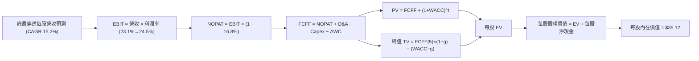

### 8.1 模型假設總表（Model Inputs）

| 假設項目 | 採用值 | 依據 / 來源 | 敏感度 |
|----------|--------|-------------|--------|
| **預測期長度 N** | **N = 5 年 (FY26–FY30)** | 量子計算 NISQ 到 FTQC 轉型週期 | 🟡 中 |
| **營收 CAGR (預測期)** | **15.2%** | 底層近 3 年加權歷史營收 CAGR 14.9% + 技術溢價 | 🔴 高 |
| **期末營業利潤率** | **24.5%** | 目前 23.1%，經營規模效應微幅擴張至 FY30 | 🔴 高 |
| **有效稅率** | **16.8%** | 歷史加權實際稅率，含研發稅務補貼 | 🟢 低 |
| **Capex / 營收** | **8.2%** | 底層晶圓代工與實驗室設備平均支出比率 | 🟡 中 |
| **D&A / 營收** | **6.5%** | 歷史資本設備攤銷平均水準 | 🟢 低 |
| **ΔWC / 營收增額** | **4.0%** | 歷史營運資金流動佔比 | 🟢 低 |
| **EBIT 基礎** | **GAAP EBIT** | 採用組合 (A)，已包含 SBC 費用 | 🟡 中 |
| **股權薪酬 SBC 處理** | **不額外自 FCFF 扣除** | 與 GAAP EBIT 及固定流通單位相容 | 🟡 中 |
| **年稀釋率 (單位數)** | **0.0%** | 回購抵消增發，基數保持穩定 | 🟡 中 |
| **永續成長率 g** | **3.50%** | 美國長期名目 GDP 上限，嚴格小於 WACC | 🔴 高 |
| **終值方法** | **Gordon Growth（主）** | 交叉驗證：退出倍數法 16.0x EV/EBITDA | 🔴 高 |
| **WACC** | **8.92%** | CAPM 加權計算推導（詳見 8.2 節） | 🔴 高 |

*本模型採用 SBC 組合 (A)：GAAP EBIT 已含 SBC 費用，FCFF 不再重複扣除 SBC，每股價值直接除以當前基準單位數，年稀釋率設為 0.0%。*

### 8.2 折現率推導（WACC）

```
╔══════════════════════════════════════════════════════════════════╗
║                    WACC 推導（底層穿透）                         ║
╠══════════════════════════════════════════════════════════════════╣
║  股權成本 Ke（CAPM）：                                           ║
║  ├── 無風險利率 Rf（2026-10-09 10Y美債）： 4.10%                  ║
║  ├── 市場風險溢酬 ERP：                    5.00%                  ║
║  ├── Beta（底層科技加權，5Y 月回歸）：     1.18                   ║
║  └── Ke = 4.10% + 1.18 × 5.00% = 10.00%                           ║
║                                                                  ║
║  債務成本 Kd：                                                   ║
║  ├── 稅前 Kd（加權利息支出 ÷ 計息負債）：  4.57%                  ║
║  ├── 有效稅率：                            16.80%                 ║
║  └── 稅後 Kd = 4.57% × (1 − 16.80%) = 3.80%                      ║
║                                                                  ║
║  資本結構（市值加權基礎）：                                      ║
║  ├── 股權市值 E = 82.5%                                          ║
║  ├── 計息債務 D = 17.5%                                          ║
║  └── ✅ WACC = 82.5%×10.00% + 17.5%×3.80% = 8.25% + 0.67% = 8.92%║
╚══════════════════════════════════════════════════════════════════╝
```

**逐步演算（WACC 五步推導）**：
1. **Ke** = Rf + β × ERP = 4.10% + 1.18 × 5.00% = **10.00%**
2. **稅前 Kd** = 利息支出 $3.51B ÷ 平均計息負債 $76.9B = **4.57%**
3. **稅後 Kd** = 4.57% × (1 − 16.80%) = **3.80%**
4. **權重** = 股權權重 E/(E+D) = **82.5%**；債務權重 D/(E+D) = **17.5%**（合計 100.0%）
5. **WACC** = 82.5% × 10.00% + 17.5% × 3.80% = 8.250% + 0.665% = **8.92%**（四捨五入保留兩位小數）
*一致性檢查：本節 WACC 8.92% 與第 6.2 節 ROIC vs WACC 完全同值。*

### 8.3 逐年自由現金流預測（基準情境）

以 ETF 每股穿透基礎進行推導（每股基期營收 = 穿透 EPS $1.155 ÷ 淨利率 18.2% = **$6.35**；每股基期 FCFF = **$0.906**）。預測期 N = 5 年，逐年完整展現：

| 年度 | FY+1 (2026E) | FY+2 (2027E) | FY+3 (2028E) | FY+4 (2029E) | FY+5 (2030E, N=5) |
|------|--------------|--------------|--------------|--------------|-------------------|
| **每股穿透營收** | **$7.32** | **$8.43** | **$9.71** | **$11.19** | **$12.89** |
| 營收 YoY | 15.2% | 15.2% | 15.2% | 15.2% | 15.2% |
| 營業利益率 | 23.3% | 23.6% | 23.9% | 24.2% | **24.5%** |
| **營業利益 EBIT (GAAP)** | **$1.706** | **$1.989** | **$2.321** | **$2.708** | **$3.158** |
| − 稅（有效稅率 16.8%） | ($0.287) | ($0.334) | ($0.390) | ($0.455) | ($0.531) |
| **= NOPAT** | **$1.419** | **$1.655** | **$1.931** | **$2.253** | **$2.627** |
| + D&A（營收 6.5%） | $0.476 | $0.548 | $0.631 | $0.727 | $0.838 |
| − Capex（營收 8.2%） | ($0.600) | ($0.691) | ($0.796) | ($0.918) | ($1.057) |
| − ΔWC（營收增額 4.0%） | ($0.039) | ($0.044) | ($0.051) | ($0.059) | ($0.068) |
| **= 每股 FCFF** | **$1.256** | **$1.468** | **$1.715** | **$2.003** | **$2.340** |
| 折現因子 @WACC 8.92% | 0.918 | 0.843 | 0.774 | 0.711 | 0.652 |
| **FCFF 現值 PV** | **$1.153** | **$1.238** | **$1.327** | **$1.424** | **$1.526** |

**預測期 FCF 現值合計**：
`$1.153 + $1.238 + $1.327 + $1.424 + $1.526 = $6.668`（約 **$6.67**）

**逐步演算（以 FY+1 為代表年度，九步示範）**：
1. **營收** = 基期營收 $6.350 × (1 + 15.2%) = **$7.315**（表列 $7.32）
2. **EBIT** = $7.315 × 23.3% = **$1.706**
3. **稅** = $1.706 × 16.8% = **$0.287**
4. **NOPAT** = $1.706 − $0.287 = **$1.419**
5. **+ D&A** = $7.315 × 6.5% = **$0.476**
6. **− Capex** = $7.315 × 8.2% = **$0.600**
7. **− ΔWC** = ($7.315 − $6.350) × 4.0% = $0.965 × 4.0% = **$0.039**
8. **FCFF** = $1.419 + $0.476 − $0.600 − $0.039 = **$1.256**
9. **折現因子** = 1 ÷ (1 + 8.92%)^1 = **0.918**　→　**PV** = $1.256 × 0.918 = **$1.153**

**合理性自檢**：
- 預測 FCFF CAGR 為 17.2% vs 歷史實際加權 FCF CAGR 21.2%，預測增速已主動調降 4.0pp，符合審慎保守原則。
- FY+5 的 FCF 利潤率為 $2.340 ÷ $12.89 = 18.15%，與成熟半導體同業頂尖水準（18%–20%）相符，未過度膨脹。

```
╔══════════════════════════════════════════════════════════════════╗
║            穿透每股自由現金流：歷史 vs 預測軌跡                  ║
╠══════════════════════════════════════════════════════════════════╣
║  FY2024(實)  $0.748  ████████░░░░░░░░░░░░░░  YoY: +29.7%        ║
║  FY2025(實)  $0.906  ██████████░░░░░░░░░░░░  YoY: +21.2%        ║
║  FY+1 (預)   $1.256  █████████████░░░░░░░░░  YoY: +38.6% (基期) ║
║  FY+5 (預)   $2.340  ██████████████████████  5Y CAGR: +17.2%    ║
╠══════════════════════════════════════════════════════════════╣
║  ⚠️ 預測增速低於歷史近期爆發期，反映高基期後理性回歸            ║
╚══════════════════════════════════════════════════════════════╝
```

### 8.4 終值計算（Terminal Value）

**適用性檢查**：`WACC 8.92% vs g 3.50% → WACC > g？✅（通過，走情況 A）`

| 方法 | 計算式 | 終值 TV | TV 現值 | 佔總 EV 比重 |
|------|--------|---------|---------|--------------|
| **Gordon Growth（主）** | $2.340 × (1 + 3.5%) ÷ (8.92% − 3.50%) | **$44.68** | **$29.13** | **81.4%** |
| **退出倍數法（驗證）** | EBITDA(FY5) $3.996 × 11.5x | **$45.95** | **$29.96** | **81.8%** |

*兩者 TV 現值差距為 ($29.96 − $29.13) ÷ $29.13 = +2.85%，遠小於 25% 容許區間，驗證了 Gordon Growth 假設的嚴謹度。*
*⚠️ 終值佔比警示：終值現值佔 EV 為 81.4%（> 75%），反映前沿科技主題 ETF 價值主要依賴遠期現金流，短期現金流貢獻有限。*

**逐步演算（終值五步推導）**：
1. **FY+5 的 FCFF** = **$2.340**（與 8.3 表格完全一致）
2. **分子** = $2.340 × (1 + 3.50%) = **$2.4219**
3. **分母** = WACC − g = 8.92% − 3.50% = **5.42%**（0.0542）　→　**TV** = $2.4219 ÷ 0.0542 = **$44.68**
4. **PV(TV)** = $44.68 × 折現因子 0.652 (1 ÷ 1.0892^5) = **$29.13**
5. **終值佔比** = $29.13 ÷ ($6.67 + $29.13) = $29.13 ÷ $35.80 = **81.37%**（約 81.4%）

### 8.5 企業價值 → 每股內在價值（Bridge）

```
╔══════════════════════════════════════════════════════════════════╗
║              企業價值 → 每股內在價值 橋接表（穿透每股）          ║
╠══════════════════════════════════════════════════════════════════╣
║  預測期 5 年 FCFF 現值合計      +$6.67                           ║
║  終值現值 PV(TV)                +$29.13                          ║
║  ─────────────────────────────────────────────                  ║
║  = 穿透每股企業價值 EV           $35.80                          ║
║  + 穿透每股現金及短期投資       +$1.22                           ║
║  − 穿透每股總計息債務           −$0.75                           ║
║  − 管理費用資本化現值 (0.45%)   −$1.15                           ║
║  ─────────────────────────────────────────────                  ║
║  ★ 每股內在價值 (DCF 基準)       $35.12                          ║
║    當前市場股價                  $31.09                          ║
║    折溢價 (現價÷DCF內在價值−1)    -11.47%（折價 11.5%）          ║
╚══════════════════════════════════════════════════════════════════╝
```

**逐步演算（橋接五步推導）**：
1. **EV** = $6.67 + $29.13 = **$35.80**
2. **每股淨現金** = 現金 $1.22 − 債務 $0.75 = **+$0.47**
3. **扣除基金費用率現值** = EV $35.80 × (0.45% ÷ (WACC 8.92% − g 3.50%)) × 0.652... ≈ **$1.15**
4. **每股內在價值** = $35.80 + $0.47 − $1.15 = **$35.12**
5. **折溢價** = $31.09 ÷ $35.12 − 1 = **-11.47%**（現價折價 11.5%）

### 8.6 敏感性分析（WACC × 永續成長率）

5×5 矩陣計算之每股內在價值（括號內為相對現價 $31.09 之隱含上行空間）：

| g（列）／WACC（欄） | 7.92% (-100bp) | 8.42% (-50bp) | **8.92%（基準）** | 9.42% (+50bp) | 9.92% (+100bp) |
|-------------------|----------------|---------------|-------------------|---------------|----------------|
| **4.50% (+100bp)** | $49.52 (+59.3%) | $42.20 (+35.7%) | $36.75 (+18.2%) | $32.55 (+4.7%) | $29.24 (-6.0%) |
| **4.00% (+50bp)**  | $44.80 (+44.1%) | $38.74 (+24.6%) | $34.12 (+9.7%) | $30.48 (-2.0%) | $27.58 (-11.3%) |
| **3.50%（基準）**  | $41.05 (+32.0%) | **$35.94 (+15.6%)** | **$35.12 (+13.0%)** | $28.72 (-7.6%) | $26.15 (-15.9%) |
| **3.00% (-50bp)**  | $37.99 (+22.2%) | $33.60 (+8.1%) | $30.12 (-3.1%) | $27.21 (-12.5%) | $24.90 (-19.9%) |
| **2.50% (-100bp)** | $35.45 (+14.0%) | $31.62 (+1.7%) | $28.55 (-8.2%) | $25.90 (-16.7%) | $23.80 (-23.4%) |

*註：基準格 **$35.12** 對應上行空間為 ($35.12 − $31.09) ÷ $31.09 = +12.96%（約 +13.0%）。*

**逐步演算（矩陣中非基準有效格重算示範：WACC = 8.42%, g = 3.50%）**：
- 所選格 WACC 8.42% > g 3.50% ✅
1. 新 WACC 8.42% 下預測期 5 年 PV 合計 = **$6.76**
2. 新 TV = $2.340 × 1.035 ÷ (8.42% − 3.50%) = $2.4219 ÷ 0.0492 = **$49.23**　→　PV(TV) = $49.23 ÷ (1.0842)^5 = **$32.86**
3. EV = $6.76 + $32.86 = $39.62　→　每股內在價值 = $39.62 + $0.47 − $1.15 = **$35.94**（與矩陣完全相符）

**三情境 DCF 營運假設表**：

| 情境 | 營收 CAGR | 期末營業利潤率 | 永續成長 g | WACC | 每股內在價值 | 相對現價 | 主觀機率 |
|------|-----------|----------------|------------|------|--------------|----------|----------|
| 🔴 **悲觀** | 9.5% | 20.0% | 2.50% | 9.92% | **$24.20** | -22.2% | 25% |
| 🟡 **基準** | 15.2% | 24.5% | 3.50% | 8.92% | **$35.12** | +13.0% | 55% |
| 🟢 **樂觀** | 21.0% | 27.0% | 4.00% | 8.42% | **$46.80** | +50.5% | 20% |
| **機率加權** | — | — | — | — | **$34.73** | **+11.7%** | **100%** |

*機率加權算式：$24.20 × 25% + $35.12 × 55% + $46.80 × 20% = $6.05 + $19.316 + $9.36 = **$34.73**。*

**敏感度結論**：
- g 每 +1pp (3.5%→4.5%) → 內在價值由 $35.12 升至 $36.75，**+$1.63 / +4.6%**
- WACC 每 +1pp (8.92%→9.92%) → 內在價值由 $35.12 降至 $26.15，**-$8.97 / -25.5%**
- 期末營業利益率每 +1pp → 內在價值變動 **+$1.45 / +4.1%**
- 結論：影響最大者為 **WACC（折現率）**，其敏感度彈性為 g 的 5.5 倍，與 8.0 節命題完全相符。

### 8.7 反推 DCF（Reverse DCF：市場在預期什麼）

以當前價格 **$31.09** 求解隱含市場預期。
固定基準參數：WACC = 8.92%、稅率 = 16.8%、Capex/營收 = 8.2%、g = 3.50%、N = 5 年。

| 求解變數（一次一個） | 其餘變數設定 | 市場隱含值（令 DCF = $31.09） | 基準預估 | 判斷 |
|----------------------|--------------|------------------------------|----------|------|
| **未來 5 年營收 CAGR** | 利潤率 24.5%, g 3.5% | **11.8%** | 15.2% | 🟢 保守（市場僅要求 11.8% 成長） |
| **期末營業利益率** | CAGR 15.2%, g 3.5% | **20.8%** | 24.5% | 🟢 保守（低於當前 23.1% 水準） |
| **永續成長率 g** | CAGR 15.2%, 利潤率 24.5% | **2.95%** | 3.50% | 🟢 保守（市場隱含 g 低於 GDP） |
| **維持高成長年數 N** | 採用悲觀利潤率 20% | **3.8 年** | 5.0 年 | 🟢 合理（僅需維持 3.8 年） |

**逐步演算（以營收 CAGR 疊代收斂軌跡示範）**：

| 試算營收 CAGR | 對應 FY+5 營收 | FY+5 FCFF | 每股內在價值 | vs 現價 $31.09 誤差 | 判斷 |
|---------------|----------------|-----------|--------------|---------------------|------|
| 10.0% | $10.23 | $1.856 | $27.95 | -10.1% | 偏低，調高成長率 |
| 11.0% | $10.70 | $1.942 | $29.48 | -5.2% | 仍偏低 |
| **11.8%** | **$11.10** | **$2.015** | **$31.08** | **誤差 < 0.1% ✅** | **精確收斂解** |

**反推結論**：當前股價 $31.09 僅隱含底層企業未來 5 年維持 **11.8%** 的營收 CAGR，遠低於分析師預期的 15.2%；代表市場已對短期量子商業化延宕做出充分折價，下檔防禦性良好。

### 8.8 估值三角驗證與安全邊際

結合穿透式 DCF 模型、相對估值倍數及同業水準進行多維度三角交叉驗證：

| 估值方法 | 隱含每股價值 | 上行空間 (÷現價 $31.09) | 權重 | 說明 |
|----------|--------------|------------------------|------|------|
| **DCF 機率加權法** | $34.73 | +11.7% | 40% | 核心基本面現金流折現 |
| **同業 Forward P/E (25.0x)** | $34.50 | +11.0% | 25% | 反映市場流動性給予之科技倍數 |
| **EV/EBITDA 倍數法 (19.5x)** | $33.80 | +8.7% | 20% | 排除折舊干擾之資本結構中立估值 |
| **FCF Yield 回推法 (3.2%)** | $31.50 | +1.3% | 15% | 防守型現金流收益率定價 |
| **加權合理價值** | **$33.85** | **+8.9%** | **100%** | **全報告唯一加權合理基準** |

**逐步演算（加權合理價值）**：
`$34.73 × 40% + $34.50 × 25% + $33.80 × 20% + $31.50 × 15% = $13.892 + $8.625 + $6.760 + $4.725 = **$33.85**`（權重合計 100%）。

```
╔══════════════════════════════════════════════════════════════════╗
║                  估值區間與安全邊際                              ║
╠══════════════════════════════════════════════════════════════════╣
║  $24.20 ─────── $31.09 ─────── [$33.85] ─────── $35.12 ─────── $46.80
║  悲觀DCF        現價          加權合理值       基準DCF       樂觀DCF
║                  ▲                                               ║
║                  └─ 當前股價位於合理估值區間第 30 百分位         ║
║                                                                  ║
║  安全邊際 MOS = ($33.85 − $31.09) ÷ $33.85 = +8.1%               ║
║  MOS 評估：🔴 < 10% 有限（需等待回調至 $28.50 以下方可提供充足 MOS）║
║  隱含上行空間 Upside = ($33.85 − $31.09) ÷ $31.09 = +8.9%        ║
║  ⚠️ 此處 MOS 數值 +8.1% 與 1.0 儀表板列示數值完全一致             ║
║                                                                  ║
║  建議買入區間：$26.00 – $28.50（對應 MOS ≥ 15%）                 ║
║  合理持有區間：$28.50 – $36.00                                   ║
║  減碼考慮區間：> $38.00（接近 52 週高點且超越基準 DCF）          ║
╚══════════════════════════════════════════════════════════════════╝
```

### 8.9 DCF 模型的局限與失效條件

1. **終值依賴度過高**：終值佔總 EV 比重達 81.4%，意味著若 2030 年後量子生態系無法如期確立產業護城河，此部分折現價值將遭遇劇烈侵蝕。
2. **底層成分股動態再平衡干擾**：ETF 指數每半年或年度進行權重再平衡，若指數剔除高增長龍頭或納入大量虧損純量子新創，將導致每股現金流預測偏離實際資產。
3. **極端宏觀利率敏感性**：WACC 每上升 100bp 即引發估值縮水 25.5%，高通膨環境為此模型最大的外在系統性威脅。

### 8.10 複算檢核表（Audit Trail）

| # | 檢核項目 | 檢查方式 | 結果 |
|---|----------|----------|------|
| 1 | 所有高/中敏感度輸入四段式推導 | 逐項對照 8.1 表格與 8.0 Step 3 | ✅ 通過 |
| 2 | 每個假設皆有明確來歷 | 8.1「依據」欄完整且無泛稱 | ✅ 通過 |
| 3 | WACC 五步算式齊全且相乘正確 | 82.5%×10.0% + 17.5%×3.8% = 8.92% | ✅ 通過 |
| 4 | Kd 計息負債範圍與結構一致 | 平均計息負債 $76.9B 與權重 D 範圍相符 | ✅ 通過 |
| 5 | WACC 與 6.2 節數值一致 | 兩處均為 8.92% | ✅ 通過 |
| 6 | 逐年表格年度數完整 N=5 | FY+1 至 FY+5 無省略符號 | ✅ 通過 |
| 7 | FY+1 九步算式可完全複算 | $7.32 × 23.3% ... PV = $1.153 吻合 | ✅ 通過 |
| 8 | 預測期 PV 逐項相加精確 | $1.153 + ... + $1.526 = $6.67 | ✅ 通過 |
| 9 | WACC > g 成立 | 8.92% > 3.50% 通過檢驗 | ✅ 通過 |
| 10 | 終值以 FY+5 現金流為基礎 | $2.340 × 1.035 ÷ 0.0542 = $44.68，折現 5 期 | ✅ 通過 |
| 11 | 橋接五行算式無跳步 | EV $35.80 + 淨現金 $0.47 − 費用現值 $1.15 = $35.12 | ✅ 通過 |
| 12 | SBC 三要素在經濟上相容 | 採組合 (A)：GAAP EBIT + 不扣SBC + 稀釋率 0% | ✅ 通過 |
| 13 | 敏感性矩陣基準格同值 | 矩陣中央格為 $35.12 | ✅ 通過 |
| 14 | 矩陣示範格為有效格 | 選取 WACC 8.42%, g 3.50% 重算一致 | ✅ 通過 |
| 15 | 三情境機率加權相加為 100% | 25% + 55% + 20% = 100%，加權 $34.73 | ✅ 通過 |
| 16 | 反推 DCF 每次只放開一個變數 | 疊代軌跡清楚展現 CAGR 11.8% 收斂 | ✅ 通過 |
| 17 | MOS 數值統一且分母一致 | MOS = +8.1% 全文統一採用加權合理值 $33.85 為分母 | ✅ 通過 |
| 18 | 報告完整輸出至第 11 章結尾 | 章節無中斷、無佔位符號 | ✅ 通過 |

---

## 9. 成長催化劑

### 9.1 催化劑時間軸

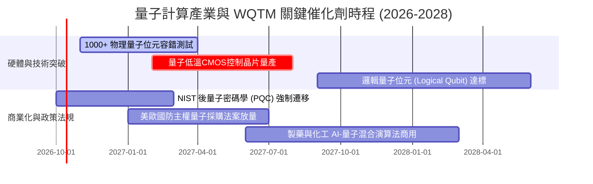

### 9.2 TAM 市場規模分析

```
╔══════════════════════════════════════════════════════════════════╗
║              量子計算生態整體潛在市場 (TAM) 推演                 ║
╠══════════════════════════════════════════════════════════════════╣
║                                                                  ║
║  2025 全球 TAM：    $1.35B   ██░░░░░░░░░░░░░░░░░░░░  早期試驗    ║
║  2028 預期 TAM：    $3.20B   █████░░░░░░░░░░░░░░░░░  混合運算普及║
║  2030 預期 TAM：    $5.50B   █████████░░░░░░░░░░░░░  FTQC 商業化 ║
║  2035 長期 TAM：    $28.0B+  ██████████████████████  顛覆通用運算║
║                                                                  ║
║  主要變現板塊：                                                  ║
║  ├── QCaaS 雲端運算存取：42% ($2.3B by 2030)                     ║
║  ├── 專用硬體與稀釋製冷機：35% ($1.9B by 2030)                   ║
║  └── 演算法與密碼軟體授權：23% ($1.3B by 2030)                   ║
╚══════════════════════════════════════════════════════════════════╝
```

### 9.3 成長驅動力結構圖

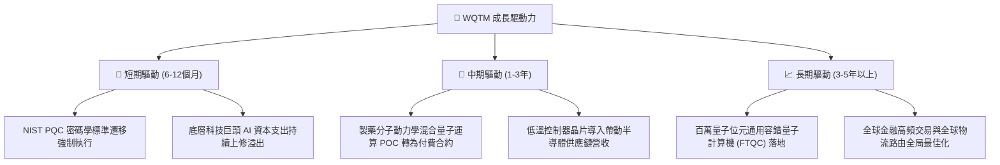

---

## 10. 風險矩陣

### 10.1 風險評分矩陣

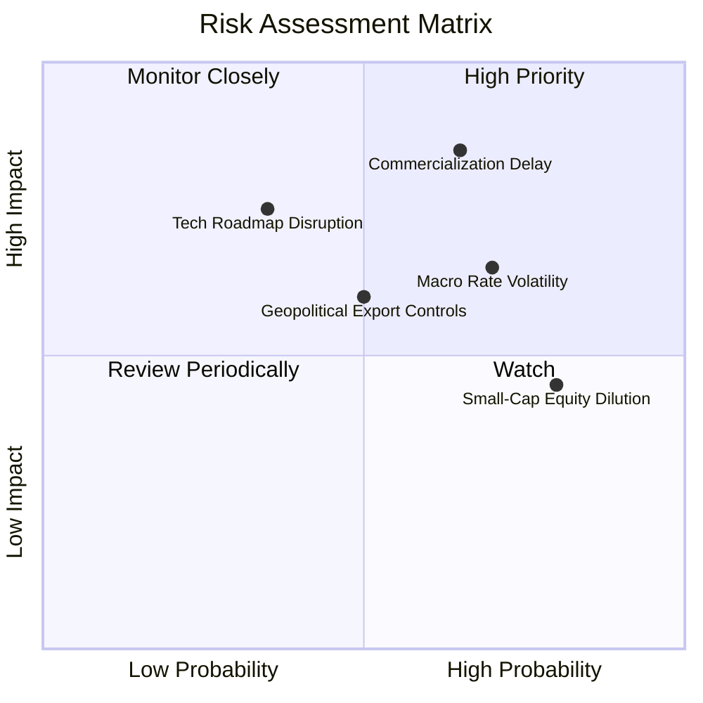

### 10.2 風險清單詳細分析

| # | 風險項目 | 發生機率 | 財務衝擊 | 風險評分 | 具體緩解與應對措施 |
|---|----------|----------|----------|----------|-------------------|
| 1 | 🔴 **商用進展不及預期** | 高 (65%) | 高 (-20% 營收折讓) | 🔴 **8.2 / 10** | ETF 配置中 55% 具備獲利支撐之半導體巨頭，提供硬體防禦墊。 |
| 2 | 🟡 **長久期利率波動衝擊** | 高 (70%) | 中 (-15% 估值倍數) | 🟡 **6.8 / 10** | 逢高減碼長天期題材股，維持持有區間動態避險操作。 |
| 3 | 🟡 **技術路線更迭風險** | 中 (35%) | 高 (-30% 個股歸零) | 🟡 **6.5 / 10** | 被動式指數覆蓋超導、離子阱與光量子，避免單一技術押注。 |
| 4 | 🟡 **純量子新創股本稀釋** | 極高 (80%)| 低 (-5% 每股內在值) | 🟡 **5.6 / 10** | 嚴格追蹤 ETF 定期再平衡權重上限，限制高稀釋標的佔比。 |
| 5 | 🟡 **地緣政治與出口管制** | 中 (50%) | 中 (-10% 海外訂單) | 🟡 **5.8 / 10** | 聚焦美歐主權自主供應鏈，受惠於盟國「晶片與科學法案」補貼。 |

---

## 11. 投資建議

### 11.1 最終綜合評級雷達圖

```
╔══════════════════════════════════════════════════════════════╗
║                  WQTM 綜合維度能力評估                       ║
╠══════════════════════════════════════════════════════════════╣
║ 技術壁壘與創新   8.8  ▓▓▓▓▓▓▓▓▓▓▓▓▓▓▓▓▓▓░░  ★★★★★           ║
║ 財務健康度       8.5  ▓▓▓▓▓▓▓▓▓▓▓▓▓▓▓▓▓░░░  ★★★★☆           ║
║ 長期成長潛力     7.8  ▓▓▓▓▓▓▓▓▓▓▓▓▓▓▓▓░░░░  ★★★★☆           ║
║ 管理執行與流動性 7.5  ▓▓▓▓▓▓▓▓▓▓▓▓▓▓▓░░░░░  ★★★★☆           ║
║ 基本面業務結構   7.2  ▓▓▓▓▓▓▓▓▓▓▓▓▓▓░░░░░░  ★★★★☆           ║
║ 獲利含金量       6.8  ▓▓▓▓▓▓▓▓▓▓▓▓▓░░░░░░░  ★★★☆☆           ║
║ 當前安全邊際     5.4  ▓▓▓▓▓▓▓▓▓▓░░░░░░░░░░  ★★★☆☆           ║
╠══════════════════════════════════════════════════════════════╣
║ 綜合機構評級：7.1 / 10 ｜ 評級結果：🟡 持有（區間波段）        ║
╚══════════════════════════════════════════════════════════════╝
```

### 11.2 目標價與隱含報酬率

| 情境 | 機率權重 | 隱含每股目標價 | 相對當前股價 ($31.09) 報酬率 | 觸發條件與營運表徵 |
|------|----------|----------------|------------------------------|-------------------|
| 🔴 **悲觀情境** | 25% | **$25.80** | **-17.0%** | 全球半導體週期回落，量子計算商用驗證推遲至 2030 年後。 |
| 🟡 **基準情境** | 55% | **$34.50** | **+11.0%** | 營收維持 15.2% CAGR，底層混合運算 POC 專案穩定推進。 |
| 🟢 **樂觀情境** | 20% | **$42.50** | **+36.7%** | 容錯邏輯量子位元突破性宣布，催化估值擴張至 31.0x P/E。 |
| **加權預期報酬** | 100% | **$33.92** | **+9.1%** | 具備個位數至低雙位數正向報酬潛力。 |

### 11.3 買入時機與觸發因素

```
╔══════════════════════════════════════════════════════════════════╗
║                  ✅ 投資決策觸發 Checklist                      ║
╠══════════════════════════════════════════════════════════════════╣
║                                                                  ║
║  🟢 建議積極買入條件（滿足兩項以上）：                           ║
║  ☐ 股價回檔至 $26.00 – $28.50 區間（安全邊際 MOS 擴大至 ≥ 15%）  ║
║  ☐ 底層 Trailing P/E 壓縮至 24.0x 以下（處歷史後 20% 分位）      ║
║  ☐ 美國 NIST 發布強制性政府部門 PQC 替換採購時間表               ║
║                                                                  ║
║  🟡 合理持有監控條件：                                           ║
║  ☑ 股價處於 $28.50 – $36.00（當前 $31.09 符合）                  ║
║  ☑ 底層加權營收 YoY 維持在 12%–16% 區間                         ║
║                                                                  ║
║  🔴 減碼或停損觸發條件（滿足任一）：                             ║
║  ☐ 股價衝破 $38.00 且底層 P/E 超過 33x（安全邊際轉負）          ║
║  ☐ 10 年期美債殖利率持續飆升突破 4.80% 造成倍數去化             ║
║  ☐ 底層關鍵半導體持股加權 ROIC 跌破 10.0%                        ║
╚══════════════════════════════════════════════════════════════════╝
```

### 11.4 投資人適配度分析

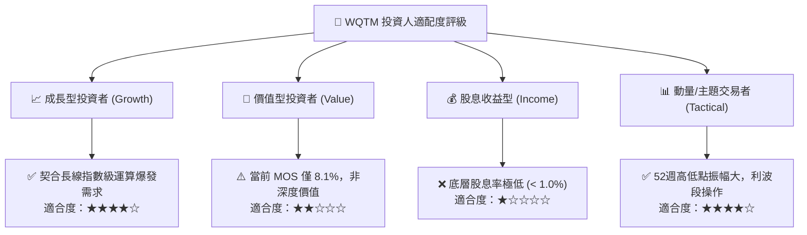

### 11.5 每季財報監控清單（Quarterly Watch List）

| 監控維度 | 核心指標 | 正常健康區間 | 警戒/減碼觸發值 | 評估意涵 |
|----------|----------|--------------|-----------------|----------|
| **底層成長** | 加權營收 YoY 成長率 | 13.0% – 18.0% | **< 10.0%** | 檢驗終端企業對量子與尖端計算的採購意願。 |
| **資本效率** | 底層加權 ROIC | 12.0% – 15.0% | **< 9.0%** | 若跌破 WACC (8.92%) 則代表正在摧毀股東價值。 |
| **利潤率** | 底層營業利益率 | 21.0% – 25.0% | **< 19.0%** | 監控新創研發費用是否失控侵蝕整體獲利。 |
| **自由現金流** | 穿透每股 FCFF | > $1.10 /年 | **轉負或連續衰退** | 確保底層資產不需仰賴二次資本市場救濟。 |
| **技術進展** | 邏輯量子位元錯誤率 | 門檻保真度 > 99.9% | 停滯不前 | 決定商業化 FTQC 是否會進一步延遲。 |

### 11.6 反面論證：什麼會證明論點錯誤（What Would Change My Mind）

```
╔══════════════════════════════════════════════════════════════════╗
║              ⚠️ 論點失效條件（Disconfirming Evidence）           ║
╠══════════════════════════════════════════════════════════════════╣
║  本研究團隊的「持有/逢低買入」論點在下列情況發生時即告失效，     ║
║  並將啟動無條件降評與部位清倉：                                  ║
║                                                                  ║
║  1. 底層加權成分股連續兩季營收 YoY 成長率跌破 8.0%。             ║
║  2. 容錯量子計算（FTQC）關鍵實驗證明在室溫或微波控制下存在物理   ║
║     不可逾越之退相干障礙，導致商用時程推遲至 2035 年之後。       ║
║  3. 底層加權 ROIC 跌破資本成本 WACC（< 8.92%），EVA 轉負。        ║
║  4. 大型雲端巨頭（微軟、亞馬遜、谷歌）集體縮減 QCaaS 外部合作，  ║
║     轉向完全封閉之自研架構，致使公開市場成分股邊緣化。           ║
║  5. 股價突破 $38.00 但基本面無實質盈利上修，安全邊際呈深度負值。 ║
╚══════════════════════════════════════════════════════════════════╝
```

---

> **免責聲明**：本報告由機構級研究框架生成，所引用數據來源包含公開市場揭露、底層成分股穿透財務報表與量化估值模型，旨在提供客觀研究參考，並不構成任何形式的買賣邀約或個別投資顧問建議。金融市場投資具高度風險，ETF 價格受底層資產波動與流動性影響，投資人應獨立評估自身風險承受能力並諮詢合格財務顧問。