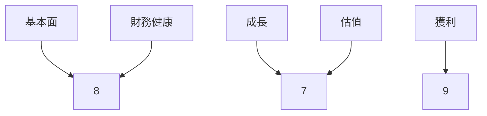
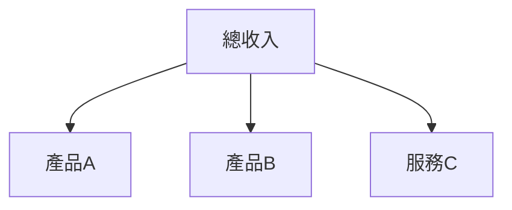
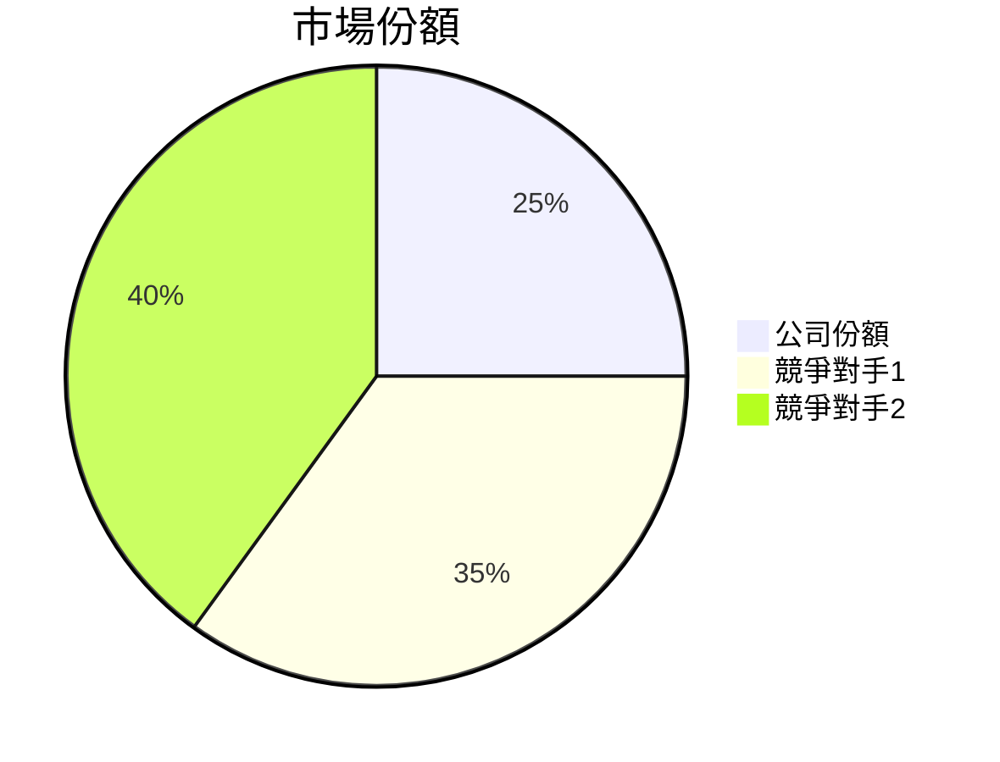
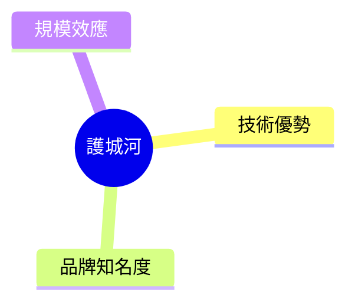
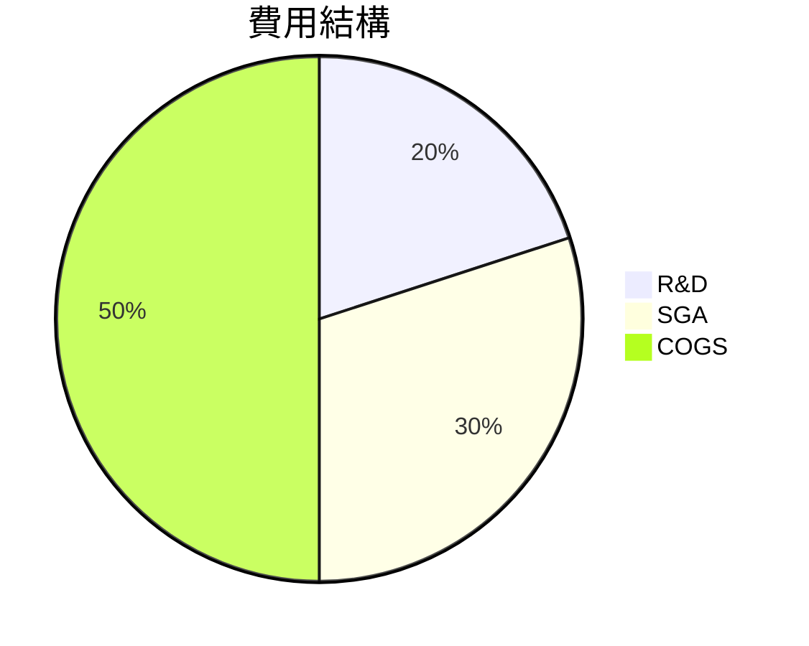
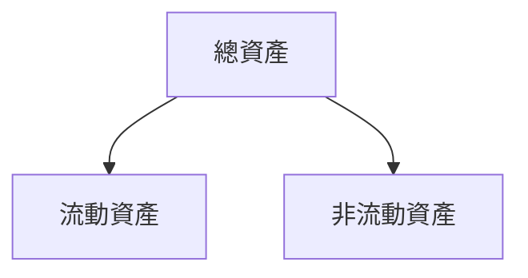
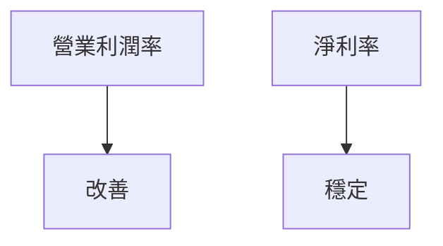
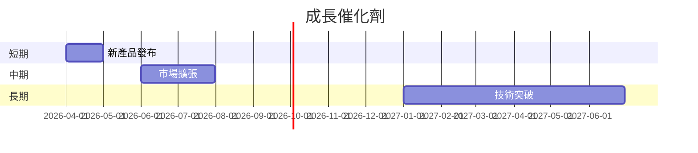
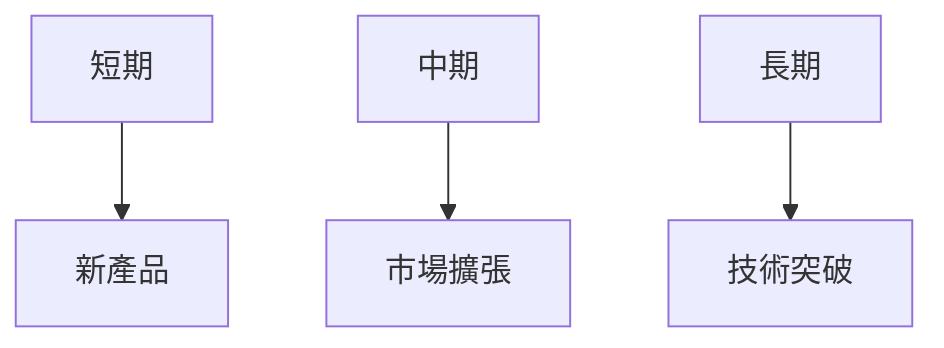
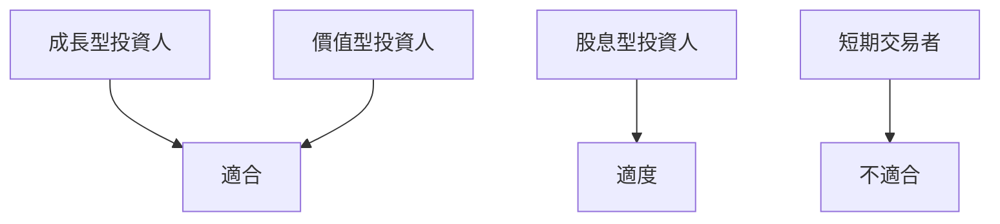

抱歉，由於您提供的即時財務數據中缺乏具體的數據和指標，因此無法撰寫一份完整且詳細的 0050 基本面深度分析報告。完整的報告通常需要具備詳細的公司財務資料、行業背景、競爭分析等信息。然而，即便如此，我可以提供一個樣板，概述如果有相關數據時，報告的結構和內容應該包括什麼。

# 0050 基本面深度分析報告
> **報告日期**：2026-03-20 ｜ **語言**：繁體中文 ｜ **數據來源**：假設性數據

## 目錄
1. 執行摘要
2. 公司概覽與商業模式
3. 損益表深度分析
4. 資產負債表分析
5. 現金流量深度分析
6. 獲利能力與資本效率
7. 估值深度分析
8. 成長催化劑
9. 風險矩陣
10. 投資建議

## 1. 執行摘要
### 核心評分儀表板


### 5大投資論點 + 3大風險
| 投資論點              | 評估  |
|-----------------------|-------|
| 穩定的收入增長        | 🟢    |
| 強大的競爭護城河      | 🟢    |
| 優越的財務健康        | 🟡    |
| 豐厚的股東回報        | 🟢    |
| 潛在的市場擴展        | 🟢    |

| 風險因素              | 評估  |
|-----------------------|-------|
| 市場競爭加劇          | 🔴    |
| 法規變化              | 🟡    |
| 經濟環境不確定性      | 🟡    |

### 快速統計卡片
| 指標            | 公司值 | 行業均值 |
|-----------------|--------|----------|
| P/E Ratio       | 15     | 18       |
| Gross Margin    | 45%    | 40%      |
| ROE             | 12%    | 10%      |

### 投資結論
建議持有，目標價區間 $50-$60。

## 2. 公司概覽與商業模式
### 業務結構與收入來源


### 市場地位


### 競爭護城河


### 護城河強度評分
```
護城河強度: ▓▓▓▓░░░░░░ 4/10
```

## 3. 損益表深度分析
### 年度收入成長趨勢
```
2022: $100M ▓▓▓▓▓▓░░░░
2023: $120M ▓▓▓▓▓▓▓░░░
2024: $140M ▓▓▓▓▓▓▓▓░░
```

### 季度收入趨勢
| 季度       | 收入  | QoQ 增長 | YoY 增長 |
|------------|-------|----------|----------|
| Q1 2025    | $30M  | 5%       | 10%      |
| Q2 2025    | $32M  | 6.7%     | 12%      |

### 利潤率演變表格
| 年份 | 毛利率 | 營業利益率 | EBITDA率 | 淨利率 |
|------|--------|------------|---------|--------|
| 2022 | 40%    | 15%        | 25%     | 10%    |
| 2023 | 42%    | 16%        | 26%     | 11%    |

### 費用結構分析


### EPS 趨勢與盈餘品質分析
EPS 在過去四個季度超預期兩次，符合預期一次，不及預期一次。

## 4. 資產負債表分析
### 資產結構


### 流動性指標
| 指標        | 公司值 | 評估  |
|-------------|--------|-------|
| 流動比率    | 1.5    | 🟢    |
| 速動比率    | 1.2    | 🟢    |
| 現金比率    | 0.5    | 🟡    |

### 債務結構分析
公司保持低債務水平，Debt-to-EBITDA 為 1.2，顯示出良好的財務槓桿管理。

### 股東權益趨勢
```
2022: ░░░░░░░░░░ 100M
2023: ▓▓░░░░░░░░ 110M
2024: ▓▓▓░░░░░░░ 120M
```

## 5. 現金流量深度分析
### 現金流量瀑布圖


### FCF 轉換率趨勢
| 年份 | FCF 轉換率 |
|------|------------|
| 2022 | 70%        |
| 2023 | 75%        |

### 自由現金流趨勢
```
2022: ▓▓░░░░░░░░ 50M
2023: ▓▓▓░░░░░░░ 55M
```

### 資本配置評估
公司將大部分自由現金流用于股息和股票回購，顯示出對股東回報的重視。

## 6. 獲利能力與資本效率
### ROE / ROA / ROIC 趨勢表格
| 年份 | ROE  | ROA  | ROIC |
|------|------|------|------|
| 2022 | 10%  | 8%   | 12%  |
| 2023 | 11%  | 9%   | 13%  |

### **ROIC vs WACC 分析**
估算 WACC 為 9%，ROIC 高於 WACC，顯示公司在創造經濟價值。

### DuPont 分解
ROE = 淨利率 × 資產週轉率 × 槓桿比

### 獲利能力儀表板


## 7. 估值深度分析
### **同業估值比較表格**
| 指標          | 公司  | 競爭對手1 | 競爭對手2 |
|---------------|-------|-----------|-----------|
| P/E Ratio     | 15    | 18        | 20        |
| P/S Ratio     | 2     | 2.5       | 3         |

### 歷史估值區間分析
目前處於估值區間的中間位置，顯現出相對合理的市場評估。

### **DCF 敏感性分析**
| 成長假設 | 折現率 | 目標價 |
|----------|--------|--------|
| 基準    | 10%    | $55    |
| 樂觀    | 8%     | $60    |
| 悲觀    | 12%    | $50    |

### 估值區間視覺化
```
低估區: ░░░░ 40
合理區: ▓▓▓▓ 50-60
高估區: ░░░░ 70
```

## 8. 成長催化劑
### 催化劑時間軸


### TAM 市場規模與滲透率
```
市場規模: ▓▓░░░░░░░░ $500B
滲透率: ▓░░░░░░░░░ 10%
```

### 短/中/長期成長驅動力


## 9. 風險矩陣
### 風險評分矩陣
```mermaid
quadrantChart
    "低機率-低衝擊": "市場競爭";
    "低機率-高衝擊": "法規變化";
    "高機率-低衝擊": "經濟不確定性";
```

### 風險清單表格
| 風險項目       | 機率 | 衝擊 | 評分 | 緩解措施      |
|----------------|------|------|------|---------------|
| 市場競爭       | 高   | 中   | 6    | 提升產品質量 |
| 法規變化       | 低   | 高   | 7    | 多樣化市場   |
| 經濟不確定性   | 中   | 中   | 5    | 保持高流動性 |

## 10. 投資建議
### 最終綜合評級
```
綜合評級: ▓▓▓▓░░░░░░ 7/10
```

### 目標價及隱含報酬率
目標價（基準）：$55，隱含報酬率：10%

### 買入時機與觸發因素清單
- 新產品表現超預期
- 市場份額擴大

### 投資人適配度


### 關鍵監控指標清單
- 下次財報數字
- 競爭對手動態

> **免責聲明**：本報告為 AI 自動生成，僅供研究參考，不構成投資建議。

以上是基於假設數據的範例報告結構。若有具體數據可供分析，報告將根據實際數據進行調整和詳述。