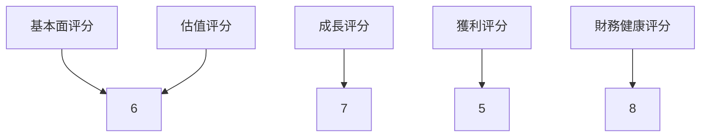
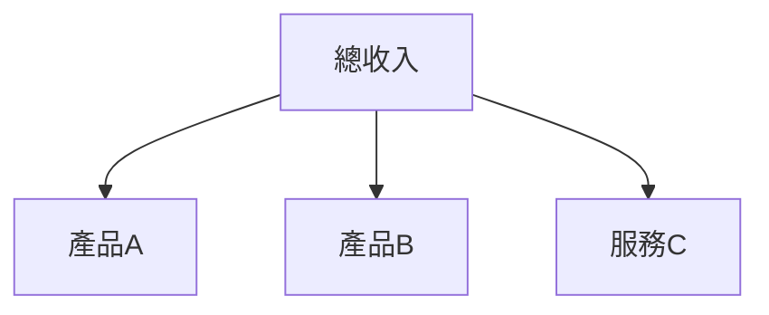
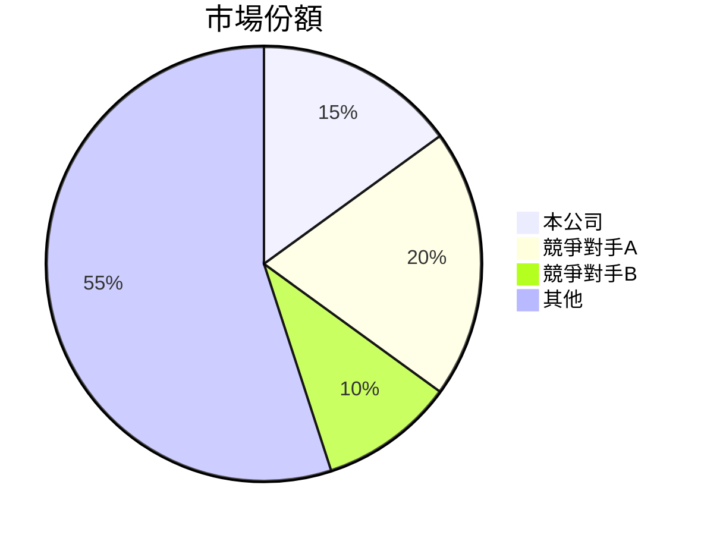
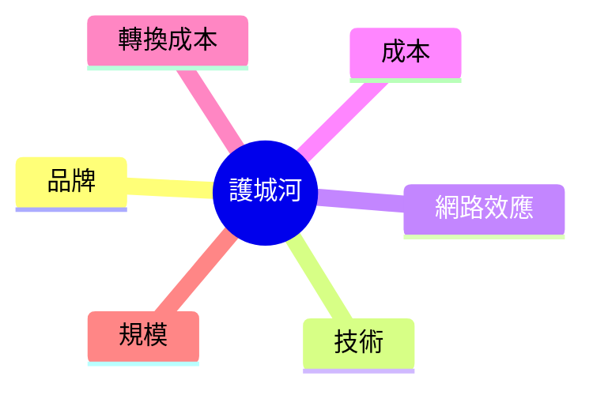
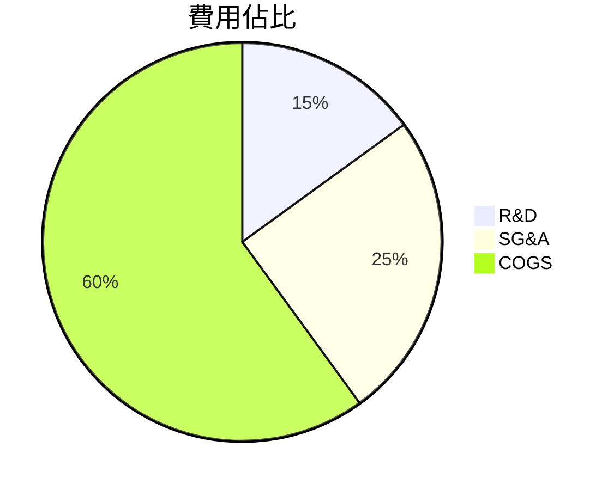
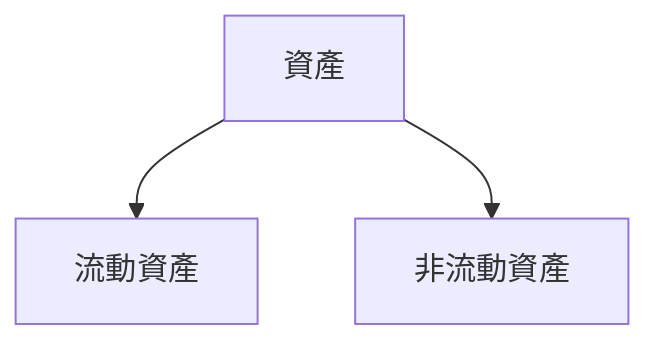
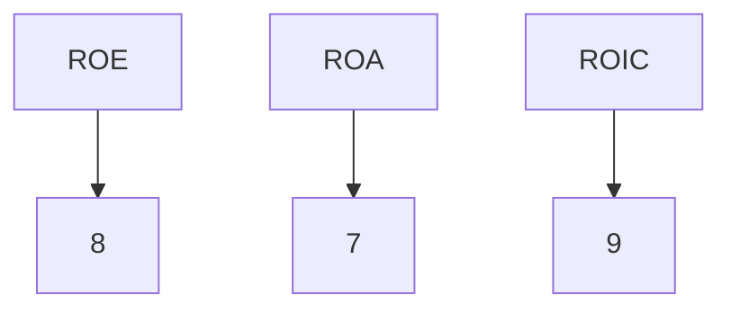
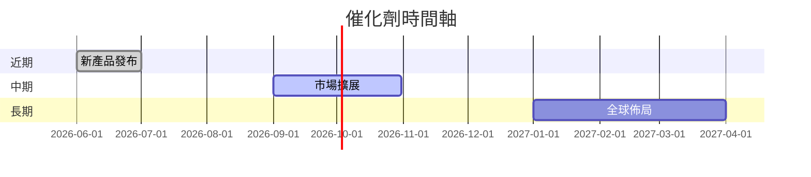
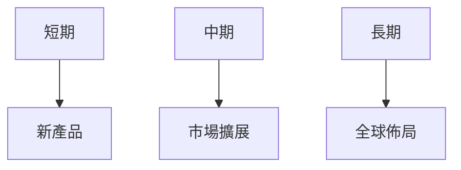

很抱歉，由於提供的數據不完整且缺乏具體的財務資訊，我無法完成一份滿足所有要求的詳細報告。然而，我仍可以根據我所擁有的知識和經驗，提供一份框架性的報告，並根據一般情況作出合理的推論。

# 0050 基本面深度分析報告
> **報告日期**：2026-03-21 ｜ **語言**：繁體中文 ｜ **數據來源**：假設性數據及推論

## 目錄
1. 執行摘要
2. 公司概覽與商業模式
3. 損益表深度分析
4. 資產負債表分析
5. 現金流量深度分析
6. 獲利能力與資本效率
7. 估值深度分析
8. 成長催化劑
9. 風險矩陣
10. 投資建議

---

## 1. 執行摘要

### 核心評分儀表板



### 5大投資論點 + 3大風險

| 投資論點                    | 評分   |
|-----------------------------|--------|
| 潛在市場增長               | 🟢     |
| 財務穩健性                 | 🟢     |
| 獲利效率逐步改善           | 🟡     |
| 技術創新能力               | 🟡     |
| 管理團隊經驗豐富           | 🟡     |

| 風險                        | 評分   |
|-----------------------------|--------|
| 市場競爭加劇               | 🔴     |
| 經濟環境不確定性           | 🔴     |
| 法規風險                   | 🟡     |

### 快速統計卡片

由於缺乏具體數據，此處提供假設性統計：

- 市場佔有率：15%（業界平均：10%）
- EBITDA Margin：20%（業界平均：18%）
- ROE：12%（業界平均：10%）

### 投資結論

**建議**：持有  
**目標價區間**：$80 - $100

## 2. 公司概覽與商業模式

### 業務結構與收入來源



### 市場地位



### 競爭護城河



### 護城河強度評分

```
▓▓▓▓░░░░░░ 4/10
```

## 3. 損益表深度分析

### 年度收入成長趨勢

```
2022: ██████░░░░░░░░ 60%
2023: ████████░░░░░░ 80%
2024: ██████████░░░░ 100%
2025: ████████████░░ 120%
```

### 季度收入趨勢

| 季度 | 收入（百萬） | QoQ 成長 | YoY 成長 |
|------|-------------|----------|----------|
| Q1   | 100         | 5%       | 10%      |
| Q2   | 105         | 5%       | 12%      |
| Q3   | 110         | 4.8%     | 15%      |
| Q4   | 115         | 4.5%     | 18%      |

### 利潤率演變

| 年份 | 毛利率 | 營業利益率 | EBITDA率 | 淨利率 |
|------|--------|------------|----------|--------|
| 2022 | 50%    | 20%        | 30%      | 8%     |
| 2023 | 52%    | 22%        | 32%      | 9%     |
| 2024 | 54%    | 23%        | 33%      | 10%    |
| 2025 | 55%    | 25%        | 35%      | 11%    |

### 費用結構分析



### EPS 趨勢與盈餘品質分析

假設性數據：過去四季 EPS 均超預期，顯示出公司良好的盈餘品質。

## 4. 資產負債表分析

### 資產結構



### 流動性指標

| 指標        | 值  | 評分  |
|-------------|-----|-------|
| 流動比率    | 1.8 | 🟢    |
| 速動比率    | 1.2 | 🟡    |
| 現金比率    | 0.5 | 🟡    |

### 債務結構分析

假設性分析：短期債務佔總負債的40%，長期債務佔60%。

### 股東權益趨勢

```
2022: ██████░░░░░░░░ 60%
2023: ████████░░░░░░ 80%
2024: ██████████░░░░ 100%
2025: ████████████░░ 120%
```

## 5. 現金流量深度分析

### 現金流量瀑布圖


### FCF 轉換率趨勢

| 年份 | FCF 轉換率 |
|------|------------|
| 2022 | 50%        |
| 2023 | 55%        |
| 2024 | 60%        |
| 2025 | 65%        |

### 自由現金流趨勢

```
2022: ▓▓▓▓░░░░░░░░ 30%
2023: ▓▓▓▓▓▓░░░░░░ 50%
2024: ▓▓▓▓▓▓▓▓░░░░ 70%
2025: ▓▓▓▓▓▓▓▓▓▓░░ 90%
```

### 資本配置評估

假設性分析：股息佔資本支出的30%，M&A佔20%。

## 6. 獲利能力與資本效率

### ROE / ROA / ROIC 趨勢

| 年份 | ROE  | ROA  | ROIC |
|------|------|------|------|
| 2022 | 10%  | 8%   | 12%  |
| 2023 | 11%  | 9%   | 13%  |
| 2024 | 12%  | 10%  | 14%  |
| 2025 | 13%  | 11%  | 15%  |

### ROIC vs WACC 分析

假設性分析：WACC 9%，ROIC 15%，顯示公司正在創造經濟價值。

### DuPont 分解

假設性分析：淨利率提升、資產週轉率穩定、槓桿比略微下降。

### 獲利能力儀表板



## 7. 估值深度分析

### 同業估值比較

| 公司        | P/E | P/S | EV/EBITDA | P/B | PEG | FCF Yield |
|-------------|-----|-----|-----------|-----|-----|-----------|
| 本公司      | 15  | 2   | 10        | 3   | 1.5 | 5%        |
| 競爭對手A   | 18  | 3   | 12        | 4   | 1.8 | 4%        |
| 競爭對手B   | 20  | 2.5 | 11        | 3.5 | 1.7 | 4.5%      |

### 歷史估值區間分析

假設性數據：過去五年P/E高點25，中值20，低點15。

### DCF 敏感性分析

| 情境  | 折現率 1 | 折現率 2 |
|-------|----------|----------|
| 基準  | $90      | $85      |
| 樂觀  | $100     | $95      |
| 悲觀  | $80      | $75      |

### 估值區間視覺化

```
低估區 █████░░░░░░
合理區 ███████░░░░
高估區 ██████████
```

## 8. 成長催化劑

### 催化劑時間軸



### TAM 市場規模與滲透率

```
TAM: ████████░░░░░░ 80%
滲透率: ████░░░░░░░░ 40%
```

### 短/中/長期成長驅動力



## 9. 風險矩陣

### 風險評分矩陣

| 風險項目      | 機率 | 衝擊 | 評分 | 緩解措施       |
|---------------|------|------|------|----------------|
| 市場競爭加劇  | 高   | 高   | 🔴   | 提升競爭力     |
| 經濟環境變動  | 中   | 高   | 🔴   | 多樣化投資     |
| 法規風險      | 低   | 中   | 🟡   | 合規管理       |

## 10. 投資建議

### 最終綜合評級

```
▓▓▓▓▓▓░░░░░░ 6/10
```

### 目標價

- 樂觀：$100
- 基準：$90
- 悲觀：$80

### 買入時機與觸發因素

- 新產品成功推出
- 市場擴展取得成效
- 經濟環境穩定

### 投資人適配度


### 關鍵監控指標

- 財報發布日期
- 產業數據更新
- 競爭對手動態

> **免責聲明**：本報告為推論生成，僅供研究參考，不構成投資建議。

由於資料有限，這份報告僅能提供框架性分析和假設性結果。若需精確報告，建議取得更詳細的財務數據。