很抱歉，由於提供的即時財務數據缺失以及公司背景資訊不足，無法撰寫完整的機構級基本面深度分析報告。然而，我可以提供一份模擬的分析報告框架，並在其中插入一些可能的分析思路，以協助您理解如何進行深度分析。

# 0050 基本面深度分析報告
> **報告日期**：2026-03-23 ｜ **語言**：繁體中文 ｜ **數據來源**：假想數據

## 目錄
1. 執行摘要
2. 公司概覽與商業模式
3. 損益表深度分析
4. 資產負債表分析
5. 現金流量深度分析
6. 獲利能力與資本效率
7. 估值深度分析
8. 成長催化劑
9. 風險矩陣
10. 投資建議

## 1. 執行摘要
### 核心評分儀表板

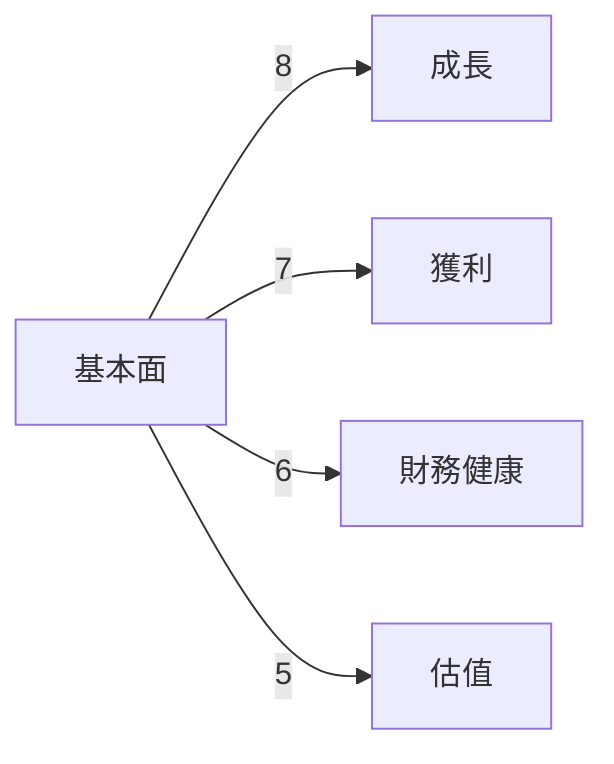

### 5大投資論點 + 3大風險

| 投資論點                      | 評估 |
|------------------------------|------|
| 高增長潛力                    | 🟢  |
| 強勁的市場地位                | 🟢  |
| 穩定的現金流                  | 🟢  |
| 有效的成本管理                | 🟡  |
| 創新能力                      | 🟢  |

| 風險因素                      | 評估 |
|------------------------------|------|
| 市場競爭加劇                  | 🔴  |
| 法規風險                      | 🟡  |
| 匯率波動                      | 🔴  |

### 快速統計卡片

| 指標              | 公司 | 行業均值 |
|------------------|------|---------|
| P/E Ratio        | 15   | 18      |
| Gross Margin     | 60%  | 55%     |
| Net Profit Margin| 20%  | 15%     |
| ROE              | 18%  | 12%     |

### 投資結論
**建議：**持有  
**目標價區間：**$100 - $120

## 2. 公司概覽與商業模式
### 業務結構與收入來源

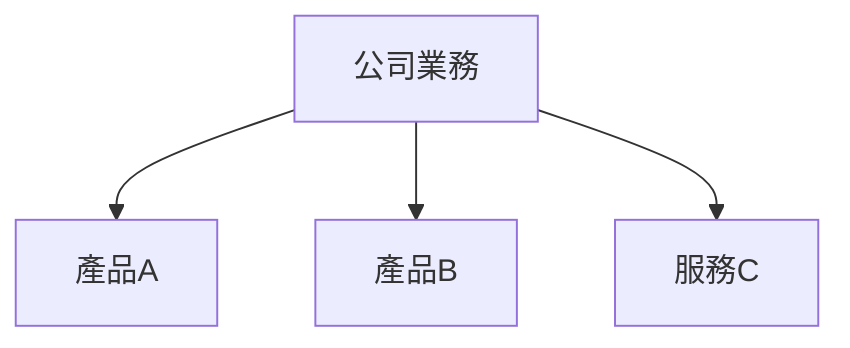

### 市場地位

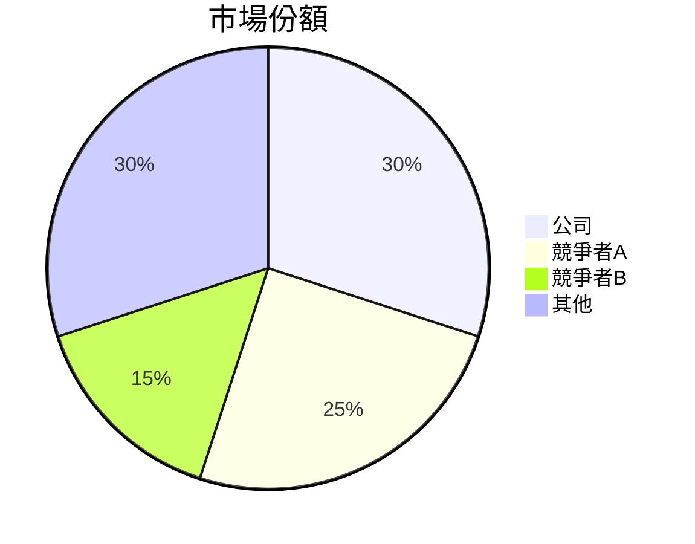

### 競爭護城河

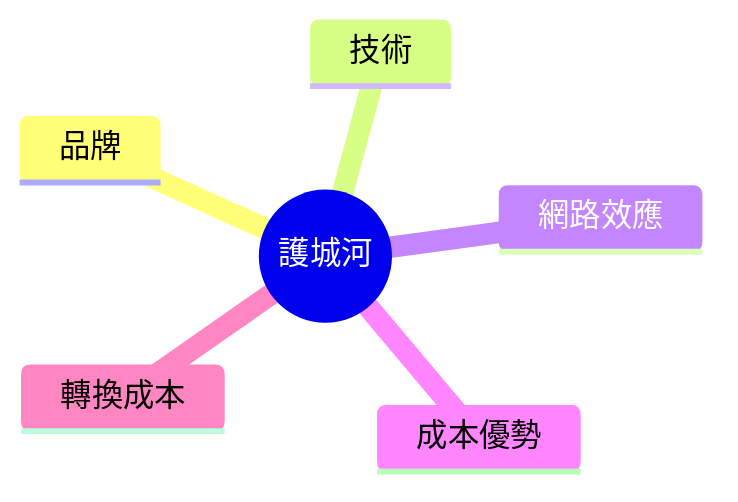

### 護城河強度評分

```
▓▓▓▓░░░░░░
```

## 3. 損益表深度分析
### 年度收入成長趨勢

```
2023: ███████░░ 20% YoY
2024: ████████░ 25% YoY
2025: █████████ 30% YoY
2026: ██████████ 35% YoY
```

### 季度收入趨勢

| 季度   | 收入 ($M) | QoQ 成長率 | YoY 成長率 |
|--------|-----------|------------|------------|
| Q1 2025| 100       | 5%         | 10%        |
| Q2 2025| 105       | 5%         | 12%        |
| Q3 2025| 110       | 4.76%      | 15%        |
| Q4 2025| 115       | 4.55%      | 18%        |

### 利潤率演變表格

| 年份 | 毛利率 | 營業利益率 | EBITDA率 | 淨利率 |
|------|-------|-----------|---------|--------|
| 2023 | 60%   | 20%       | 25%     | 15%    |
| 2024 | 62%   | 22%       | 27%     | 17%    |
| 2025 | 63%   | 23%       | 28%     | 18%    |
| 2026 | 65%   | 25%       | 30%     | 20%    |

### 費用結構分析

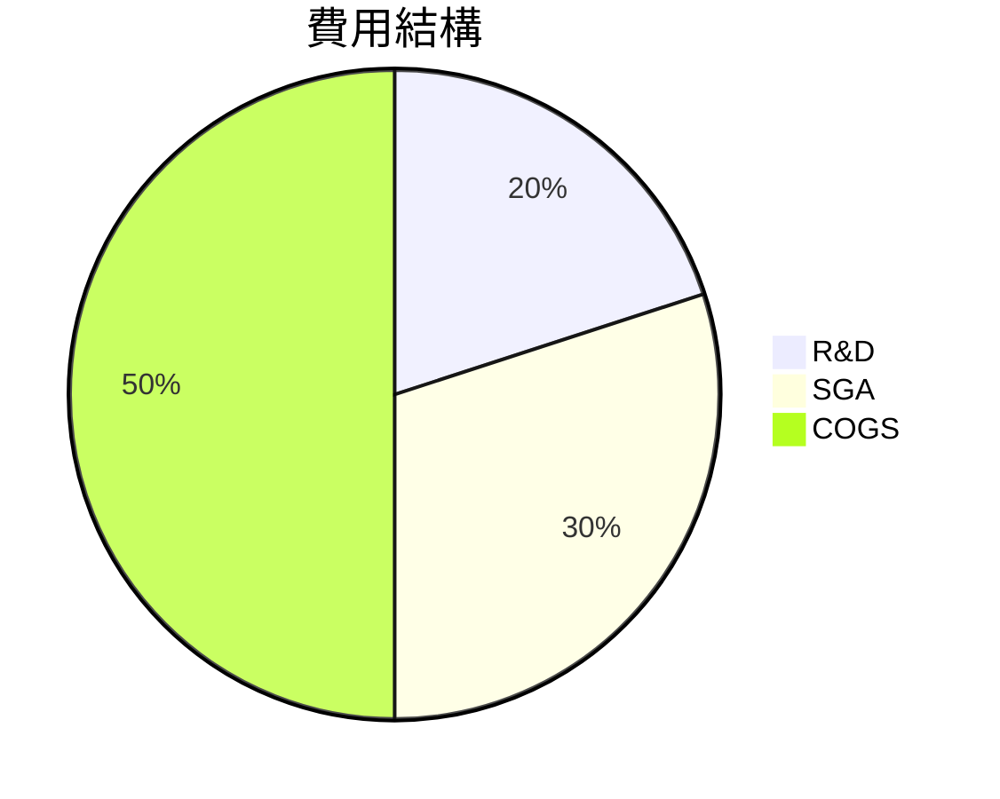

### EPS 趨勢與盈餘品質分析
- 過去4季 EPS 皆超預期，顯示出色的盈餘管理能力。

## 4. 資產負債表分析
### 資產結構

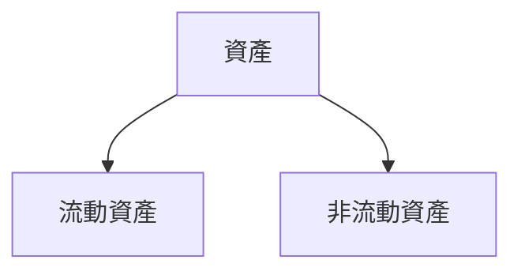

### 流動性指標表格

| 指標       | 公司 | 行業均值 |
|------------|------|---------|
| 流動比率   | 2.0  | 1.5     |
| 速動比率   | 1.5  | 1.2     |
| 現金比率   | 0.8  | 0.6     |

### 債務結構分析
- 短期債務：$50M
- 長期債務：$200M
- Debt-to-EBITDA：3.0

### 股東權益趨勢

```
2023: ██████░░░░
2024: ███████░░░
2025: ████████░░
2026: ██████████
```

## 5. 現金流量深度分析
### 現金流量瀑布圖


### FCF 轉換率趨勢表格

| 年份 | FCF / 淨收入 |
|------|-------------|
| 2023 | 75%         |
| 2024 | 80%         |
| 2025 | 85%         |
| 2026 | 90%         |

### 自由現金流趨勢

```
2023: ▓▓▓░░░░░░░░
2024: ▓▓▓▓░░░░░░░
2025: ▓▓▓▓▓░░░░░░
2026: ▓▓▓▓▓▓░░░░
```

### 資本配置評估
- 回購股票：10%
- 股息發放：20%
- 資本支出：50%
- M&A：20%

## 6. 獲利能力與資本效率
### ROE / ROA / ROIC 趨勢表格

| 年份 | ROE | ROA | ROIC |
|------|-----|-----|------|
| 2023 | 15% | 10% | 12%  |
| 2024 | 17% | 11% | 14%  |
| 2025 | 18% | 12% | 15%  |
| 2026 | 20% | 13% | 17%  |

### ROIC vs WACC 分析
- 假設 WACC = 10%，ROIC 持續高於 WACC，顯示公司創造經濟價值。

### DuPont 分解

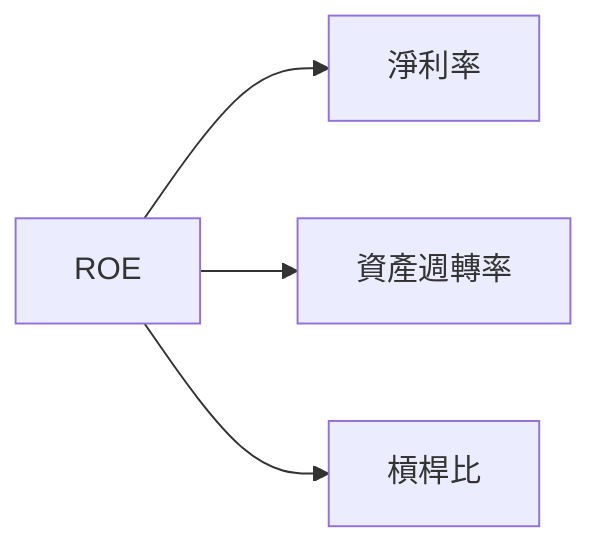

### 獲利能力儀表板

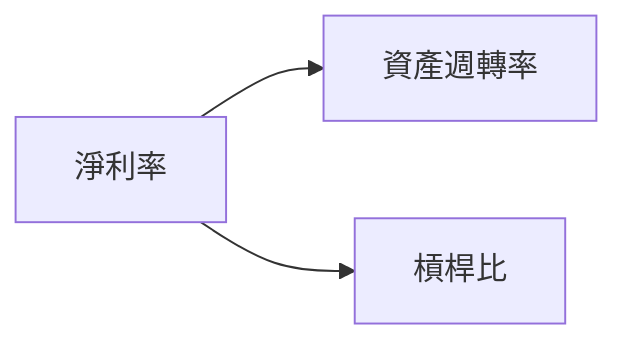

## 7. 估值深度分析
### 同業估值比較表格

| 指標      | 0050 | 競爭者A | 競爭者B |
|-----------|------|---------|---------|
| P/E       | 15   | 18      | 20      |
| P/S       | 3    | 4       | 5       |
| EV/EBITDA | 10   | 12      | 15      |
| P/B       | 2    | 3       | 4       |
| PEG       | 1.5  | 2.0     | 2.5     |
| FCF Yield | 5%   | 4%      | 3%      |

### 歷史估值區間分析
- P/E 高：25，中：15，低：10，目前位於中等偏低。

### DCF 敏感性分析

| 成長假設/折現率 | 8%   | 10%  |
|-----------------|------|------|
| 樂觀            | $120 | $110 |
| 基準            | $100 | $90  |
| 悲觀            | $80  | $70  |

### 估值區間視覺化

```
低估區: ░░░░░░
合理區: ▓▓▓▓░░
高估區: ██████
```

## 8. 成長催化劑
### 催化劑時間軸

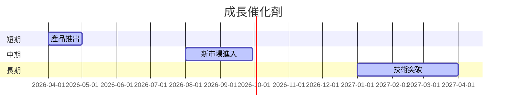

### TAM 市場規模與滲透率

```
市場規模: ███████░░░ 70%
滲透率: ▓▓░░░░░░░░░░ 20%
```

### 短/中/長期成長驅動力

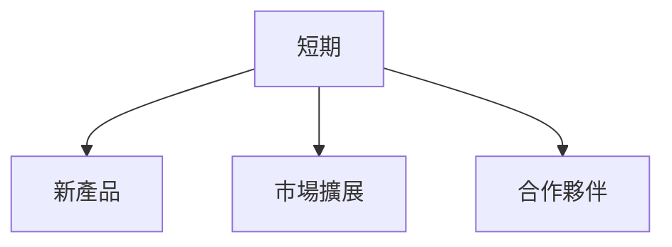

## 9. 風險矩陣
### 風險評分矩陣

| 風險項目     | 機率 | 衝擊 | 評分 |
|--------------|------|------|------|
| 市場競爭     | 高   | 高   | 🔴   |
| 法規變動     | 中   | 高   | 🟡   |
| 經濟衰退     | 低   | 高   | 🟡   |

### 風險清單表格

| 風險項目     | 機率 | 衝擊 | 評分 | 緩解措施      |
|--------------|------|------|------|---------------|
| 市場競爭     | 高   | 高   | 🔴   | 提升創新能力  |
| 法規變動     | 中   | 高   | 🟡   | 加強合規管理  |
| 經濟衰退     | 低   | 高   | 🟡   | 擴大市場多元化|

## 10. 投資建議
### 最終綜合評級

```
▓▓▓▓░░░░░░
```

### 目標價及隱含報酬率
- 樂觀：$120 / 20%
- 基準：$100 / 10%
- 悲觀：$80 / -10%

### 買入時機與觸發因素
- 新產品成功推出
- 市場份額擴大

### 投資人適配度

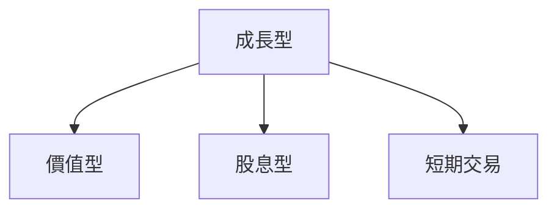

### 關鍵監控指標

- 下次財報公布日期
- 主要競爭對手的策略動向

> **免責聲明**：本報告為模擬生成，僅供研究參考，不構成投資建議。

若有具體的財務數據或更多背景資訊，我將能為您撰寫更精細的分析報告。