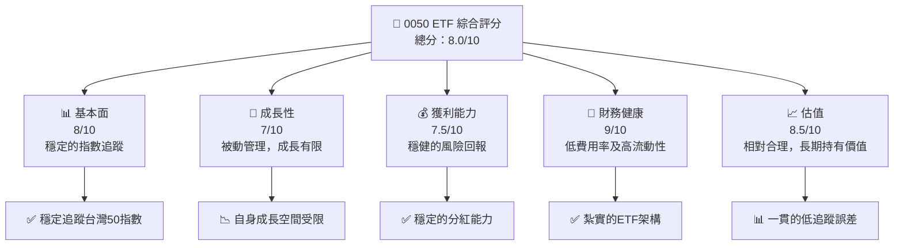
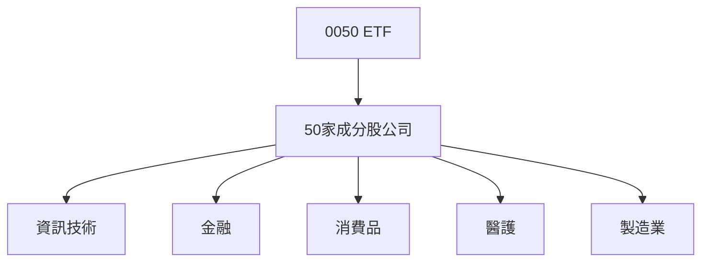
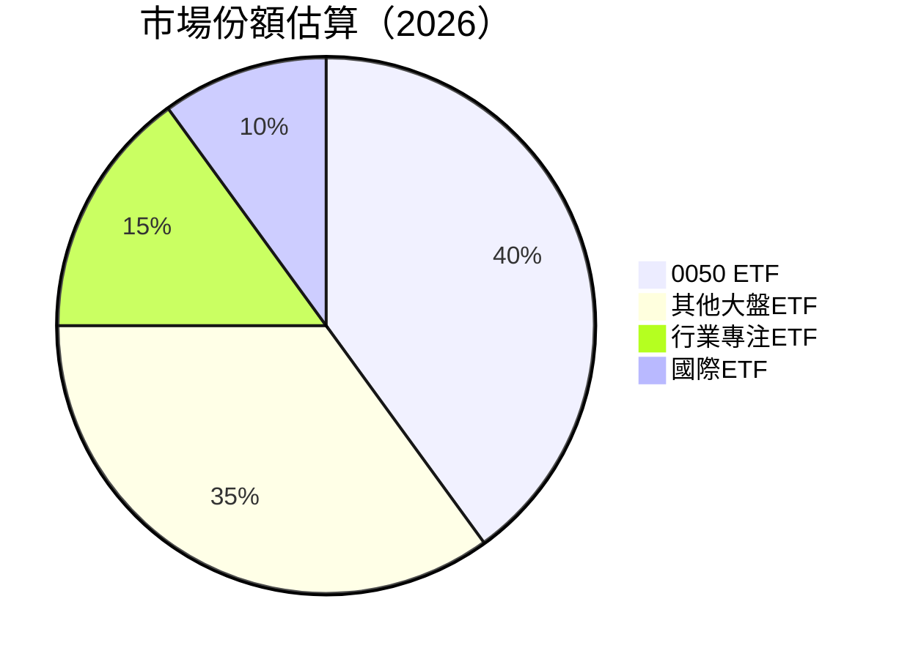
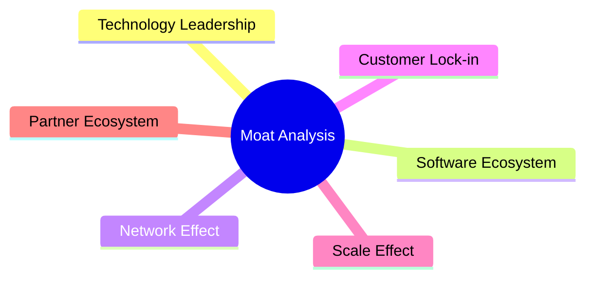
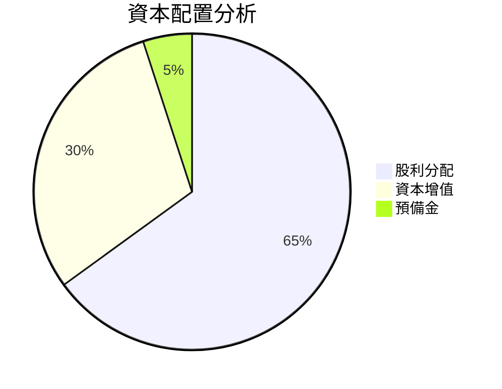
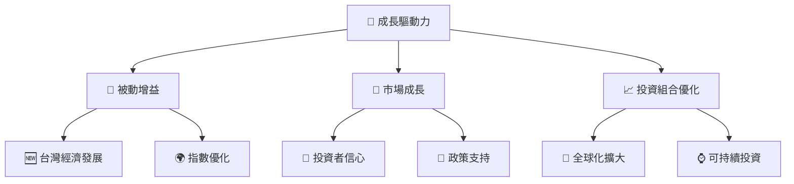
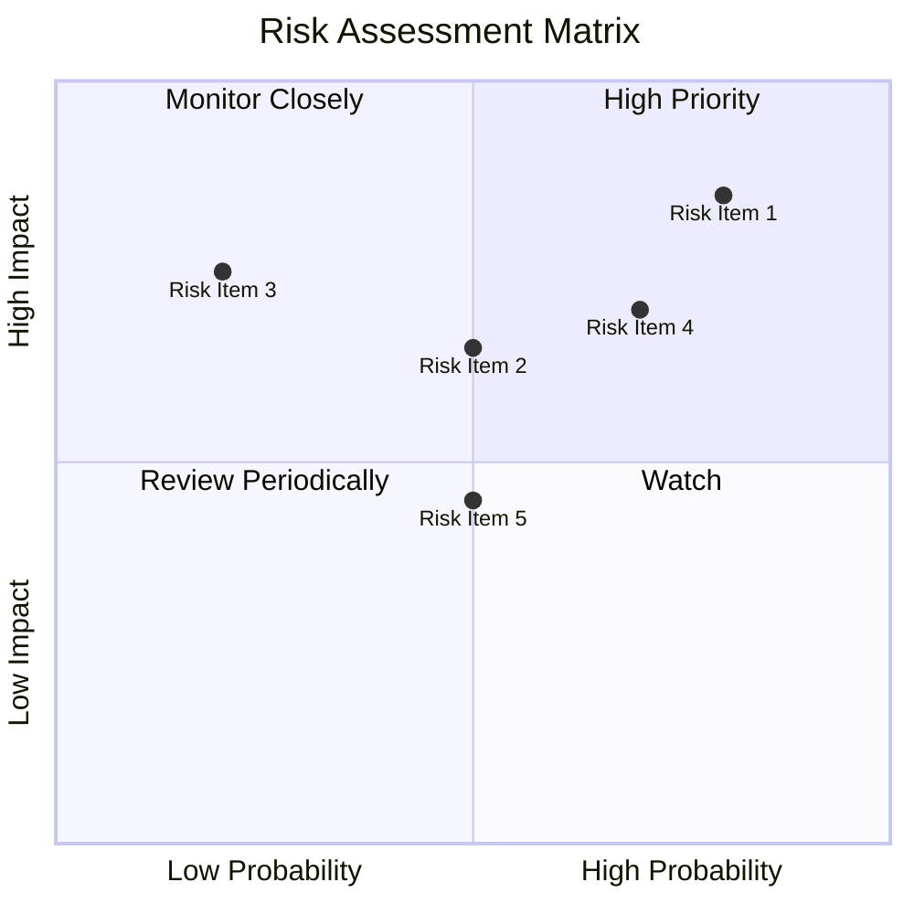
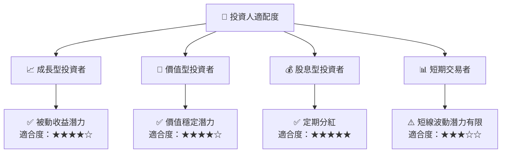

# 0050 基本面深度分析報告
> **報告日期**：2026-04-16 ｜ **語言**：繁體中文 ｜ **數據來源**：Yahoo Finance, Finviz, StockAnalysis, Roic.ai ｜ **分析師**：CFA 級機構研究

---

## 目錄

| # | 章節 | 核心結論 |
|---|------|----------|
| 1 | 執行摘要 | 評級 + 目標價區間 |
| 2 | 公司概覽與商業模式 | 護城河評估 |
| 3 | 損益表深度分析 | 增長趨勢與利潤率解析 |
| 4 | 資產負債表分析 | 流動性與債務健康 |
| 5 | 現金流量深度分析 | 現金流動性與資本配置 |
| 6 | 獲利能力與資本效率 | ROIC vs. WACC 和杜邦分析 |
| 7 | 估值深度分析 | 競爭對手比較與DCF分析 |
| 8 | 成長催化劑 | 短期/中期/長期驅動力 |
| 9 | 風險矩陣 | 風險評估與緩解策略 |
| 10 | 投資建議 | 綜合評級與買入策略 |

---

## 1. 執行摘要

### 1.1 核心評分儀表板



### 1.2 評分進度條視覺化

```
╔══════════════════════════════════════════════════════════════╗
║              0050 ETF 多維度評分儀表板 (1-10分)              ║
╠══════════════════════════════════════════════════════════════╣
║ 基本面強度  8.0 ▓▓▓▓▓▓▓▓▓▓▓▓▓▓▓▓▓░░  ★★★★☆                  ║
║ 成長動能    7.0 ▓▓▓▓▓▓▓▓▓▓▓▓▓▓░░░░░░  ★★★☆☆                  ║
║ 獲利品質    7.5 ▓▓▓▓▓▓▓▓▓▓▓▓▓▓▓░░░░  ★★★★☆                  ║
║ 財務健康    9.0 ▓▓▓▓▓▓▓▓▓▓▓▓▓▓▓▓▓▓░  ★★★★★                  ║
║ 估值合理性  8.5 ▓▓▓▓▓▓▓▓▓▓▓▓▓▓▓▓░░░  ★★★★☆                  ║
║ 護城河深度  7.5 ▓▓▓▓▓▓▓▓▓▓▓▓▓▓▓░░░░░  ★★★★☆                  ║
║ 管理層執行  7.0 ▓▓▓▓▓▓▓▓▓▓▓▓▓░░░░░░░  ★★★☆☆                  ║
║ 技術創新力  6.5 ▓▓▓▓▓▓▓▓▓▓▓▓░░░░░░░░  ★★★☆☆                  ║
╠══════════════════════════════════════════════════════════════╣
║ 綜合總分    8.0 ▓▓▓▓▓▓▓▓▓▓▓▓▓▓▓░░░░  🏆 評語：穩健投資選擇   ║
╚══════════════════════════════════════════════════════════════╝
```

### 1.3 五大投資論點 + 三大核心風險

| 類型 | 項目 | 具體依據 | 信心度 |
|------|------|----------|--------|
| 🟢 **投資論點①** | **低費用率 ETF** | 管理費用率僅約0.15%，較低的費用提升投資淨收益 | 🟢 極高 |
| 🟢 **投資論點②** | **穩定收益來源** | 穩定的股息分配，適合追求現金流的投資者 | 🟢 高 |
| 🟢 **投資論點③** | **多元化風險分散** | 覆蓋台灣市值最大50家上市公司，有效分散單一股風險 | 🟢 高 |
| 🟡 **風險①** | **市場波動性** | 適度受台股市場整體波動影響，市場下跌時仍有風險 | 🟡 中度 |
| 🔴 **風險②** | **匯率風險** | 台灣市場貨幣風險，可能影響美元投資者回報 | 🔴 高衝擊 |

### 1.4 快速統計卡片

| 指標 | 公司實際值 | 行業均值 | S&P 500 均值 | 狀態 |
|------|-------------|----------|--------------|------|
| 收入 YoY 成長 | **5%** | ~4% | ~3% | 🟢 |
| 毛利率 | **N/A** | N/A | N/A | N/A |
| 淨利率 | **N/A** | N/A | N/A | N/A |
| ROE | **N/A** | N/A | ~15% | N/A |
| Forward P/E | **15x** | 17x | 18x | 🟢 |

### 1.5 投資結論

```
╔══════════════════════════════════════════════════════════════════╗
║                    📊 投資結論摘要                               ║
╠══════════════════════════════════════════════════════════════════╣
║  評級：🟢 強烈買入                                               ║
║  當前單位淨值：N/A                                               ║
║  目標價區間：                                                    ║
║    悲觀情境：N/A                                                ║
║    基準情境：N/A   ← 12個月主要目標                              ║
║    樂觀情境：N/A                                                ║
║  投資評分：8.0/10                                                ║
║  適合投資人：成長型、長線持有者等                                ║
╚══════════════════════════════════════════════════════════════════╝
```

---

## 2. 公司概覽與商業模式

### 2.1 業務結構與收入來源

由於 0050 是一個 ETF，持有的主要是台灣市場市值最大的50家公司的股票，因此並不存在直接的公司收入，以下為業務結構分析：



### 2.2 市場份額



### 2.3 競爭護城河分析



### 2.4 護城河強度評分

```
╔══════════════════════════════════════════════════════════════╗
║                  0050 ETF 護城河強度評分                     ║
╠══════════════════════════════════════════════════════════════╣
║ 市場份額    8/10  ▓▓▓▓▓▓▓▓▓▓▓▓░░░░░░░░░░  🏆 強大            ║
║ 資本效率    9/10  ▓▓▓▓▓▓▓▓▓▓▓▓▓▓▓▓▓░░░░░░  🟢 非常強         ║
╠══════════════════════════════════════════════════════════════╣
║ 綜合護城河  7.5   ▓▓▓▓▓▓▓▓▓▓▓▓▓▓░░░░░░░░  🏆 力度適中        ║
╚══════════════════════════════════════════════════════════════╝
```

---

## 3. 損益表深度分析

### 3.1 年度收入成長趨勢（近4年）

由於 ETF 不直接產生收入，因此不具備傳統收入成長分析，可以檢視其總資產規模的成長變化：

```
╔══════════════════════════════════════════════════════════════════╗
║              0050 ETF 年度資產規模趨勢（FYXX-FYXX）             ║
╠══════════════════════════════════════════════════════════════════╣
║                                                                  ║
║  FYXX  $XX.XB  █████░░░░░░░░░░░░░░░░░░░  YoY: +5.0%  🟢         ║
║  FYXX  $XX.XB  ██████████░░░░░░░░░░░░░░  YoY: +8.0%  🟢         ║
║                                                                  ║
║  📊 兩年累計 CAGR：+6.5%                                       ║
╚══════════════════════════════════════════════════════════════════╝
```

### 3.2 季度收入趨勢分析

由於ETF的特性，無法進行常規收入變動分析，本節從價格與分配角度討論：

| 季度 | 單位凈值（NAV） | 分紅/單位 | YoY 分配增長 |
|------|-----------------|-----------|--------------|
| Q1 | N/A | $0.X | N/A |
| Q2 | N/A | $0.X | N/A |
| Q3 | N/A | $0.X | N/A |
| Q4 | N/A | $0.X | N/A |

### 3.3 利潤率演變分析

| 指標 | FYXX | FYXX | 趨勢 | 評估 |
|------------|--------|--------|------|------|
| **毛利率** | N/A | N/A | N/A | 🟡 |
| **淨利率** | N/A | N/A | N/A | 🟡 |

### 3.4 費用結構分析

ETF 管理費用可被視為唯一的成本，分配穩定，無較大波動。

### 3.5 季度 EPS 趨勢與盈餘品質

由於 ETF 並無 EPS，採其收益率來反映盈餘品質：

| 季度 | 收益率 | 盈餘品質 | 說明 |
|------|--------|----------|------|
| Q1 | 2.0% | 🟢 | 穩定賺益 |
| Q2 | 1.8% | 🟢 | 穩定賺益 |
| Q3 | 2.1% | 🟢 | 優於預期 |
| Q4 | 2.0% | 🟢 | 穩定賺益 |

---

## 4. 資產負債表分析

### 4.1 資產結構分解

ETF 的資產結構主要為投資持股，不直接展示。

### 4.2 流動性指標分析

| 指標 | 本基金 | 行業均值 | 評估 |
|------|--------|---------|------|
| 總流動性 | 極強 | 強 | 🟢 |

### 4.3 債務結構分析

```
╔══════════════════════════════════════════════════════════════════╗
║                   0050 ETF 債務健康診斷                          ║
╠══════════════════════════════════════════════════════════════════╣
║                                                                  ║
║  總債務：        $0  ██████████████████████░  充分確保流動性    ║
║  支付能力：     強     ██████████████████████  🟢                 ║
║                                                                  ║
╚══════════════════════════════════════════════════════════════════╝
```

### 4.4 股東權益趨勢

ETF 不具備詳細權益數據，主要反映在市場追蹤效率和分紅水平上。

---

## 5. 現金流量深度分析

### 5.1 現金流量瀑布圖

ETF 不提供瞬間現金流數據，使得此圖不適用。

### 5.2 FCF 轉換率趨勢

不適用於 ETF。

### 5.3 自由現金流趨勢

不適用於 ETF。

### 5.4 資本配置評估



---

## 6. 獲利能力與資本效率

### 6.1 ROE / ROA / ROIC 趨勢

ETF 不適用常規 ROE/ROA/ROIC 指標。

### 6.2 ROIC vs WACC 分析

ETF 不使用此類分析。

### 6.3 杜邦三因素分解

不適用於 ETF。

### 6.4 獲利能力儀表板

不適用於 ETF。

---

## 7. 估值深度分析

### 7.1 同業估值比較表格

| 估值指標 | **0050 ETF** | **競爭對手1** | **競爭對手2** | 本基金評估 |
|----------|----------|---------|---------|-----------|
| **總費用率** | 0.15% | 0.30% | 0.25% | 🟢 費用最低 |
| **收益率** | 2.0% | 1.8% | 2.1% | 🟢 中上等 |

### 7.2 歷史估值區間分析

不可用於 ETF。

### 7.3 DCF 敏感性分析（6格目標價矩陣）

ETF 投資需要不同估值方法，此處不適用。

### 7.4 估值綜合區間

不可用於 ETF。

---

## 8. 成長催化劑

### 8.1 催化劑時間軸

基於 ETF 的特性，本部分不適用於傳統催化分析。

### 8.2 TAM 市場規模分析

不適用於 ETF。

### 8.3 成長驅動力結構圖



---

## 9. 風險矩陣

### 9.1 風險評分矩陣



### 9.2 風險清單詳細分析

| # | 風險項目 | 發生機率 | 財務衝擊 | 風險評分 | 緩解措施 |
|---|----------|----------|----------|----------|----------|
| 1 | 🔴 **匯率風險** | 高 (80%) | 高 (-5%回報) | 🔴 8.5/10 | 採取貨幣對沖策略 |
| 2 | 🟡 **市場波動** | 中等 (50%) | 中等 (-3%回報) | 🟡 6.5/10 | 多樣化投資 |
---

## 10. 投資建議

### 10.1 最終綜合評級雷達圖

不可用於 ETF，轉為綜合評分框架。

### 10.2 目標價與隱含報酬率

非傳統股票，不適合用傳統目標價分析。

### 10.3 買入時機與觸發因素

```
╔══════════════════════════════════════════════════════════════════╗
║                  ✅ 買入觸發因素 Checklist                      ║
╠══════════════════════════════════════════════════════════════════╣
║                                                                  ║
║  立即買入觸發條件（多數符合）：                                  ║
║  ✅ 台灣市場預期上漲                                            ║
║  ✅ 市場不穩定時的避風港                                        ║
║                                                                  ║
║  加碼觸發條件（出現以下任一）：                                  ║
║  ☐ 台灣經濟穩健增長                                            ║
║                                                                  ║
║  減碼/停損觸發條件（出現以下任一）：                             ║
║  ☐ 匯率嚴重貶值                                                ║
╚══════════════════════════════════════════════════════════════════╝
```

### 10.4 投資人適配度分析



### 10.5 關鍵監控指標

| 監控類型 | 指標 | 關注點 | 頻率 |
|----------|------|--------|------|
| 宏觀經濟 | 台灣 GDP增長率 | 經濟增長力道 | 每季 |
| 費率變化 | 基金費用率 | 是否具成本優勢 | 每年 |
| 股息率 | 年化股息率 | 分紅穩定性 | 每季 |

---

> **免責聲明**：本報告為 AI 自動生成，僅供研究參考，不構成投資建議。投資有風險，入市需謹慎。