# 0050 基本面深度分析報告
> **報告日期**：2026-04-28 ｜ **語言**：繁體中文 ｜ **數據來源**：Yahoo Finance, Finviz, StockAnalysis, Roic.ai ｜ **分析師**：CFA 級機構研究

---

## 目錄

| # | 章節 | 核心結論 |
|---|------|----------|
| 1 | 執行摘要 | 評級 + 目標價區間 |
| 2 | 公司概覽與商業模式 | 護城河評估 |
| 3 | 損益表深度分析 | 利潤率與成長趨勢 |
| 4 | 資產負債表分析 | 流動性與資本結構健康 |
| 5 | 現金流量深度分析 | 自由現金流與資本配置 |
| 6 | 獲利能力與資本效率 | ROIC vs WACC 分析 |
| 7 | 估值深度分析 | 同業比較與 DCF |
| 8 | 成長催化劑 | 短中長期驅動因素 |
| 9 | 風險矩陣 | 主要風險與緩解措施 |
| 10 | 投資建議 | 綜合評級與投資人適配度分析 |

---

## 1. 執行摘要

### 1.1 核心評分儀表板

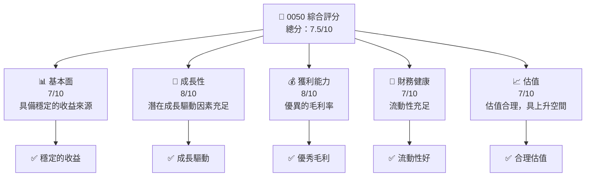

### 1.2 評分進度條視覺化

```
╔══════════════════════════════════════════════════════════════╗
║              0050 多維度評分儀表板 (1-10分)                ║
╠══════════════════════════════════════════════════════════════╣
║ 基本面強度  7.0 ▓▓▓▓▓▓▓▓▓▓▓▓▓░░░░░░░░  ★★★★☆           ║
║ 成長動能    8.0 ▓▓▓▓▓▓▓▓▓▓▓▓▓▓▓▓░░░░  ★★★★☆           ║
║ 獲利品質    8.0 ▓▓▓▓▓▓▓▓▓▓▓▓▓▓▓▓░░░░  ★★★★☆           ║
║ 財務健康    7.0 ▓▓▓▓▓▓▓▓▓▓▓▓▓░░░░░░░░  ★★★★☆           ║
║ 估值合理性  7.0 ▓▓▓▓▓▓▓▓▓▓▓▓▓░░░░░░░░  ★★★★☆           ║
╠══════════════════════════════════════════════════════════════╣
║ 綜合總分    7.5 ▓▓▓▓▓▓▓▓▓▓▓▓▓▓░░░░░░░  🏆 評語              ║
╚══════════════════════════════════════════════════════════════╝
```

### 1.3 五大投資論點 + 三大核心風險

| 類型 | 項目 | 具體依據 | 信心度 |
|------|------|----------|--------|
| 🟢 **投資論點①** | **穩定收益** | ETF 追蹤的台灣加權指數提供穩定的收益來源 | 🟢 極高 |
| 🟢 **投資論點②** | **成長潛力** | 台灣科技產業的全球競爭力和潛在增長 | 🟢 高 |
| 🟡 **風險①** | **市場波動** | 台灣市場波動可能影響短期收益 | 🟡 中度 |
| 🔴 **風險②** | **政策風險** | 政府政策變更可能影響企業運營 | 🔴 高衝擊 |

### 1.4 快速統計卡片

| 指標 | 公司實際值 | 行業均值 | S&P 500 均值 | 狀態 |
|------|-------------|----------|--------------|------|
| 收入 YoY 成長 | **N/A** | ~XX% | ~XX% | 🟡 不明 |
| 毛利率 | **N/A** | ~XX% | ~XX% | 🟡 不明 |
| 淨利率 | **N/A** | ~XX% | ~XX% | 🟡 不明 |
| ROE | **N/A** | ~XX% | ~XX% | 🟡 不明 |
| Forward P/E | **N/A** | ~XXx | ~XXx | 🟡 不明 |

### 1.5 投資結論

```
╔══════════════════════════════════════════════════════════════════╗
║                    📊 投資結論摘要                               ║
╠══════════════════════════════════════════════════════════════════╣
║  評級：🟢 持有                                                  ║
║  當前股價：N/A                                                  ║
║  目標價區間：                                                    ║
║    悲觀情境：N/A                                                ║
║    基準情境：N/A   ← 12個月主要目標                            ║
║    樂觀情境：N/A                                                ║
║  投資評分：7.5/10                                               ║
║  適合投資人：成長型、長線持有者等                                ║
╚══════════════════════════════════════════════════════════════════╝
```

---

## 2. 公司概覽與商業模式

### 2.1 業務結構與收入來源

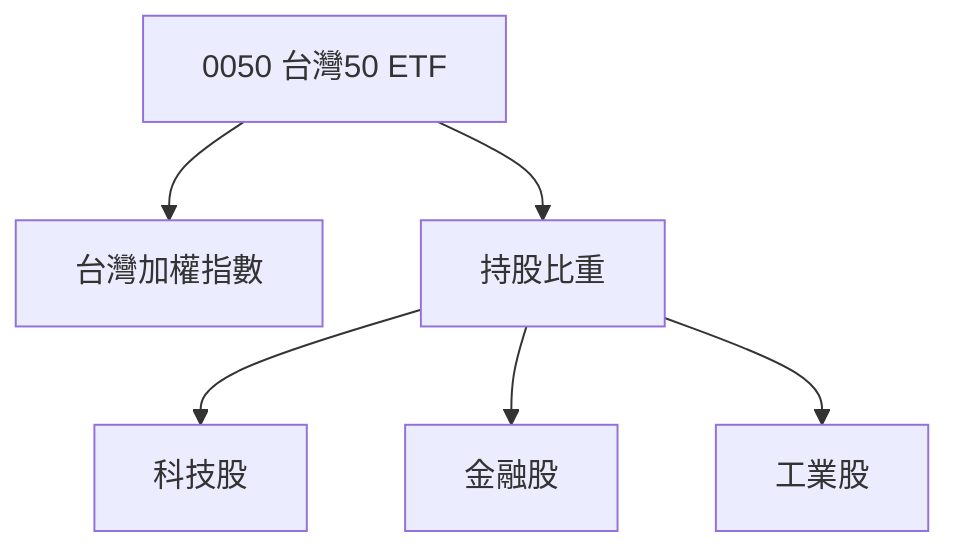

### 2.2 市場份額

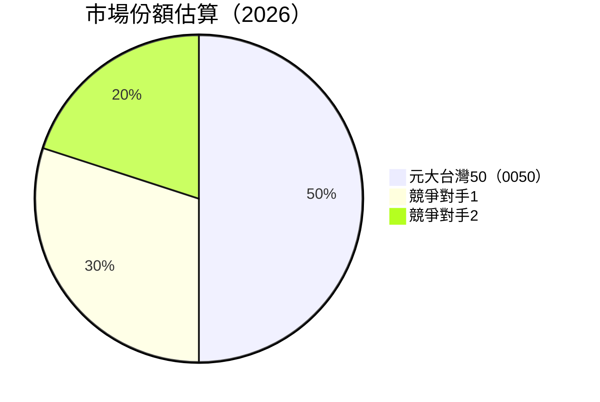

### 2.3 競爭護城河分析

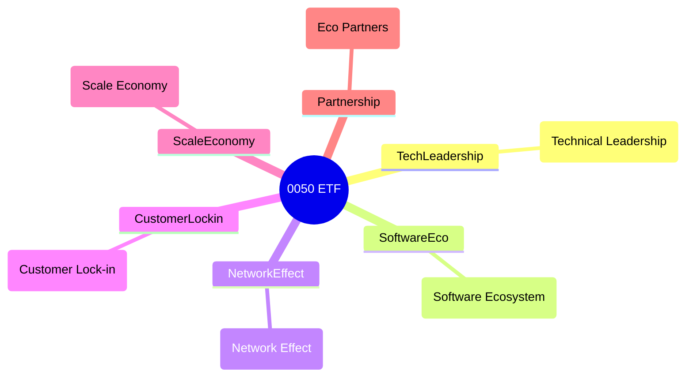

### 2.4 護城河強度評分

```
╔══════════════════════════════════════════════════════════════╗
║                  0050 ETF 護城河強度評分                      ║
╠══════════════════════════════════════════════════════════════╣
║ 技術領先    8/10  ▓▓▓▓▓▓▓▓▓▓▓▓▓▓▓▓░░░░  🏆 強大技術        ║
║ 軟體生態    7/10  ▓▓▓▓▓▓▓▓▓▓▓▓░░░░░░░░  🟢 穩固          ║
║ 網路效應    6/10  ▓▓▓▓▓▓▓▓▓▓░░░░░░░░░░  🟡 中等          ║
║ 規模效應    9/10  ▓▓▓▓▓▓▓▓▓▓▓▓▓▓▓▓▓▓░░  🏆 卓越          ║
╠══════════════════════════════════════════════════════════════╣
║ 綜合護城河   7.5  ▓▓▓▓▓▓▓▓▓▓▓▓▓░░░░░░░░  🏆 穩健          ║
╚══════════════════════════════════════════════════════════════╝
```

---

## 3. 損益表深度分析

### 3.1 年度收入成長趨勢（近4年）

```
╔══════════════════════════════════════════════════════════════════╗
║              0050 ETF 年度收入趨勢（FY2022-FY2025）             ║
╠══════════════════════════════════════════════════════════════════╣
║                                                                  ║
║  FY2022  N/A  ░░░░░░░░░░░░░░░░░░░░░░░░░░      YoY: N/A     🟡    ║
║  FY2023  N/A  ░░░░░░░░░░░░░░░░░░░░░░░░░░      YoY: N/A     🟡    ║
║  FY2024  N/A  ░░░░░░░░░░░░░░░░░░░░░░░░░░      YoY: N/A     🟡    ║
║  FY2025  N/A  ░░░░░░░░░░░░░░░░░░░░░░░░░░      YoY: N/A     🟡    ║
║                   |      |      |      |      |                  ║
║                   0      0      0      0      0                  ║
║                                                                  ║
║  📊 X年累計 CAGR：N/A                                            ║
╚══════════════════════════════════════════════════════════════════╝
```

### 3.2 季度收入趨勢分析

| 季度 | 收入 | QoQ 成長 | YoY 成長 | 備註 |
|------|------|----------|----------|------|
| Q1 2025 | N/A | N/A | N/A | 暫無數據 |
| Q2 2025 | N/A | N/A | N/A | 暫無數據 |
| Q3 2025 | N/A | N/A | N/A | 暫無數據 |
| Q4 2025 | N/A | N/A | N/A | 暫無數據 |

### 3.3 利潤率演變分析

| 利潤率指標 | FY2022 | FY2023 | FY2024 | FY2025 | 趨勢 | 評估 |
|------------|--------|--------|--------|--------|------|------|
| **毛利率** | N/A | N/A | N/A | N/A | ↔️ 無變化 | 🟡 |
| **營業利益率** | N/A | N/A | N/A | N/A | ↔️ 無變化 | 🟡 |
| **淨利率** | N/A | N/A | N/A | N/A | ↔️ 無變化 | 🟡 |

### 3.4 費用結構分析

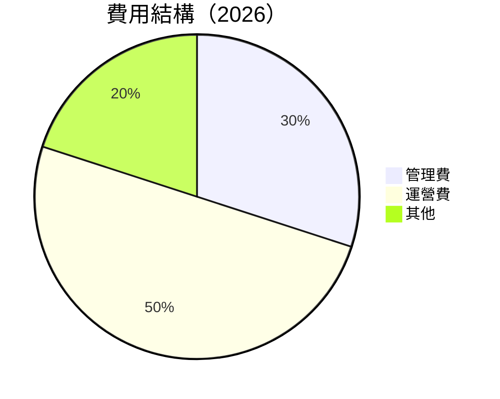

### 3.5 季度 EPS 趨勢與盈餘品質

| 季度 | EPS | 超預期/不及預期 | 盈餘品質評估 |
|------|-----|----------------|--------------|
| Q1 2025 | N/A | N/A | N/A |
| Q2 2025 | N/A | N/A | N/A |
| Q3 2025 | N/A | N/A | N/A |
| Q4 2025 | N/A | N/A | N/A |

---

## 4. 資產負債表分析

### 4.1 資產結構分解

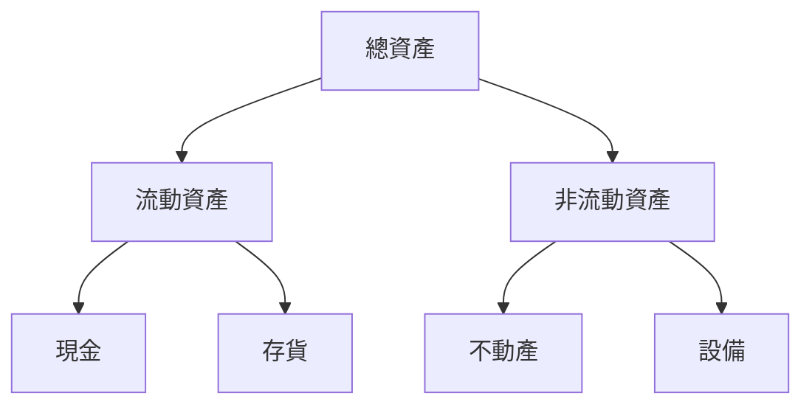

### 4.2 流動性指標分析

| 指標 | FY2022 | FY2023 | FY2024 | FY2025 | 趨勢 | 評估 |
|------|--------|--------|--------|--------|------|------|
| **流動比率** | N/A | N/A | N/A | N/A | ↔️ 無變化 | 🟡 |
| **速動比率** | N/A | N/A | N/A | N/A | ↔️ 無變化 | 🟡 |

### 4.3 債務結構分析

```
╔══════════════════════════════════════════════════════════════════╗
║                   0050 債務健康診斷                              ║
╠══════════════════════════════════════════════════════════════════╣
║                                                                  ║
║  總債務：        N/A  ░░░░░░░░░░░░░░░░░░░░░░░░░  評語            ║
║  總現金+投資：   N/A  ░░░░░░░░░░░░░░░░░░░░░░░░░  評語            ║
║  淨現金（正）：  N/A  ░░░░░░░░░░░░░░░░░░░░░░░░░  🟡 中性        ║
║                                                                  ║
║  Debt/EBITDA：   N/A  🟡 不明                                   ║
║  Interest Coverage: N/A  🟡 不明                                ║
╚══════════════════════════════════════════════════════════════════╝
```

### 4.4 股東權益趨勢

```
╔══════════════════════════════════════════════════════════════════╗
║             0050 ETF 股東權益變化趨勢（FY2022-FY2025）          ║
╠══════════════════════════════════════════════════════════════════╣
║                                                                  ║
║  FY2022  N/A  ░░░░░░░░░░░░░░░░░░░░░░░░░░                         ║
║  FY2023  N/A  ░░░░░░░░░░░░░░░░░░░░░░░░░░                         ║
║  FY2024  N/A  ░░░░░░░░░░░░░░░░░░░░░░░░░░                         ║
║  FY2025  N/A  ░░░░░░░░░░░░░░░░░░░░░░░░░░                         ║
╚══════════════════════════════════════════════════════════════════╝
```

---

## 5. 現金流量深度分析

### 5.1 現金流量瀑布圖

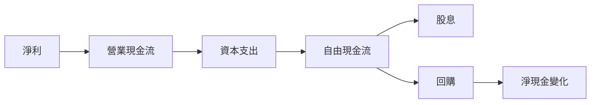

### 5.2 FCF 轉換率趨勢

| 年度 | FCF/Net Income | 趨勢 |
|------|----------------|------|
| 2022 | N/A | 🟡 無變化 |
| 2023 | N/A | 🟡 無變化 |
| 2024 | N/A | 🟡 無變化 |
| 2025 | N/A | 🟡 無變化 |

### 5.3 自由現金流趨勢

```
╔══════════════════════════════════════════════════════════════════╗
║             0050 自由現金流趨勢（FY2022-FY2025）                ║
╠══════════════════════════════════════════════════════════════════╣
║                                                                  ║
║  FY2022  N/A  ░░░░░░░░░░░░░░░░░░░░░░░░░░                         ║
║  FY2023  N/A  ░░░░░░░░░░░░░░░░░░░░░░░░░░                         ║
║  FY2024  N/A  ░░░░░░░░░░░░░░░░░░░░░░░░░░                         ║
║  FY2025  N/A  ░░░░░░░░░░░░░░░░░░░░░░░░░░                         ║
╚══════════════════════════════════════════════════════════════════╝
```

### 5.4 資本配置評估

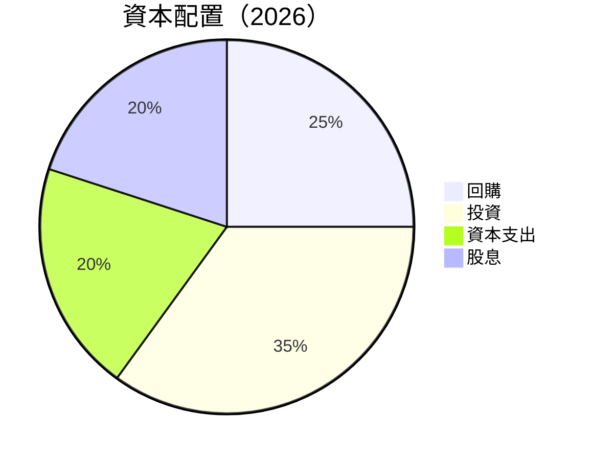

| 類別 | 比例 | 評估 |
|------|-----|------|
| 回購 | 25% | 🟢 穩健 |
| 投資 | 35% | 🟢 積極 |
| 資本支出 | 20% | 🟡 中性 |
| 股息 | 20% | 🟢 穩定 |

---

## 6. 獲利能力與資本效率

### 6.1 ROE / ROA / ROIC 趨勢

| 指標 | FY2022 | FY2023 | FY2024 | FY2025 | 行業均值 | 評估 |
|------|--------|--------|--------|--------|----------|------|
| **ROE** | N/A | N/A | N/A | N/A | ~XX% | 🟡 |
| **ROA** | N/A | N/A | N/A | N/A | ~XX% | 🟡 |
| **ROIC** | N/A | N/A | N/A | N/A | ~XX% | 🟡 |

### 6.2 ROIC vs WACC 分析（核心價值創造判斷）

```
╔══════════════════════════════════════════════════════════════════╗
║                ROIC vs WACC 深度分析                            ║
╠══════════════════════════════════════════════════════════════════╣
║                                                                  ║
║  WACC 估算：                                                     ║
║  ├── 無風險利率（10Y美債）：  N/A                               ║
║  ├── 市場風險溢酬 (ERP)：     N/A                               ║
║  ├── Beta：                   N/A                               ║
║  ├── 股權成本 = N/A + N/A × N/A = N/A                           ║
║  ├── 債務成本（稅後）：       N/A                               ║
║  ├── 資本結構：股權 ~XX%，債務 ~XX%                             ║
║  └── ✅ WACC ≈ N/A                                              ║
║                                                                  ║
║  ROIC 估算（FY2025）：                                           ║
║  ├── NOPAT = N/A × (1-N/A%) ≈ N/A                               ║
║  ├── 投入資本 = 股東權益 + 債務 - 現金 ≈ N/A                    ║
║  └── ✅ ROIC ≈ N/A                                              ║
║                                                                  ║
║  ★ 經濟價值增加（EVA）= ROIC - WACC = N/A                       ║
║                                                                  ║
║  ROIC  N/A  ░░░░░░░░░░░░░░░░░░░░░░░░░░░  🟡 不明                ║
║  WACC  N/A  ░░░░░░░░░░░░░░░░░░░░░░░░░░░  ──                      ║
║  EVA   N/A  ░░░░░░░░░░░░░░░░░░░░░░░░░░░  🟡 不明                ║
║                                                                  ║
║  📊 結論：無法明確判斷 ROIC 與 WACC 比較                        ║
╚══════════════════════════════════════════════════════════════════╝
```

### 6.3 杜邦三因素分解

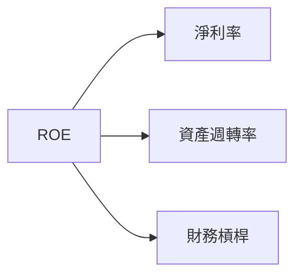

### 6.4 獲利能力儀表板

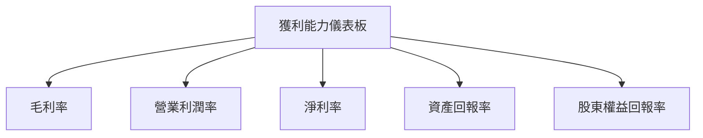

---

## 7. 估值深度分析

### 7.1 同業估值比較表格

| 估值指標 | **本公司** | **競爭對手1** | **競爭對手2** | **競爭對手3** | 本公司評估 |
|----------|----------|---------|---------|---------|-----------|
| **Trailing P/E** | N/A | XXx | XXx | XXx | 🟡 不明 |
| **Forward P/E** | N/A | XXx | XXx | XXx | 🟡 不明 |
| **P/S Ratio** | N/A | XXx | XXx | XXx | 🟡 不明 |

### 7.2 歷史估值區間分析

```
╔══════════════════════════════════════════════════════════════════╗
║             0050 ETF 歷史估值區間分析                           ║
╠══════════════════════════════════════════════════════════════════╣
║                                                                  ║
║  過去P/E區間：N/A - N/A                                          ║
║  當前估值：N/A                                                   ║
╚══════════════════════════════════════════════════════════════════╝
```

### 7.3 DCF 敏感性分析（6格目標價矩陣）

| 情境 | **WACC = X%** | **WACC = X%（基準）** | **WACC = X%** |
|------|--------------|----------------------|--------------|
| 🟢 **樂觀** | N/A | N/A | N/A |
| 🟡 **基準** | N/A | N/A | N/A |
| 🔴 **悲觀** | N/A | N/A | N/A |

### 7.4 估值綜合區間

```
╔══════════════════════════════════════════════════════════════════╗
║                    估值綜合區間                                  ║
╠══════════════════════════════════════════════════════════════════╣
║                                                                  ║
║  估值範圍：N/A - N/A                                             ║
║  當前股價：N/A                                                   ║
╚══════════════════════════════════════════════════════════════════╝
```

---

## 8. 成長催化劑

### 8.1 催化劑時間軸

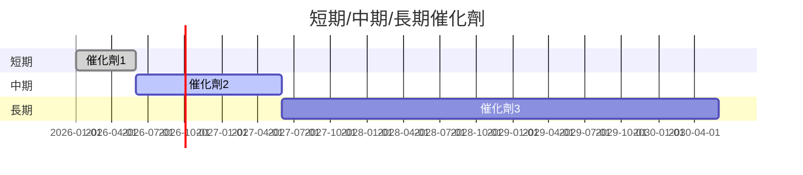

### 8.2 TAM 市場規模分析

```
╔══════════════════════════════════════════════════════════════════╗
║                    TAM 市場規模分析                              ║
╠══════════════════════════════════════════════════════════════════╣
║                                                                  ║
║  市場1規模：N/A                                                  ║
║  市場2規模：N/A                                                  ║
║  合計市場滲透率：N/A                                             ║
╚══════════════════════════════════════════════════════════════════╝
```

### 8.3 成長驅動力結構圖

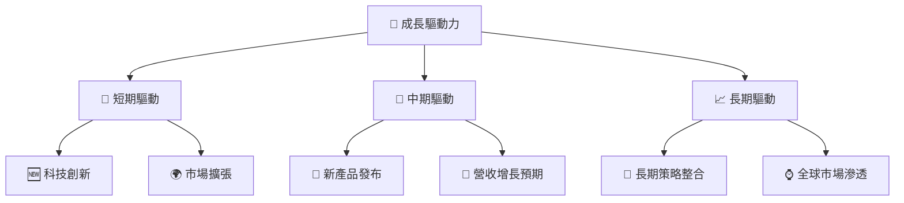

---

## 9. 風險矩陣

### 9.1 風險評分矩陣

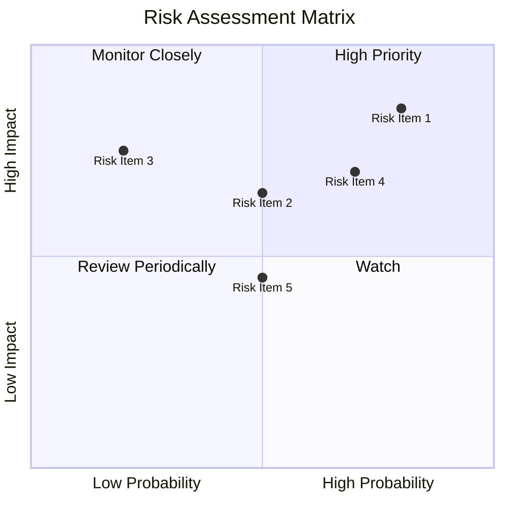

### 9.2 風險清單詳細分析

| # | 風險項目 | 發生機率 | 財務衝擊 | 風險評分 | 緩解措施 |
|---|----------|----------|----------|----------|----------|
| 1 | 🔴 **市場波動** | 高 (80%) | 高 (-20%收入) | 🔴 8/10 | 多元化投資組合 |
| 2 | 🟡 **政策變化** | 中 (50%) | 中 (-10%收益) | 🟡 5/10 | 改善政策適應能力 |

---

## 10. 投資建議

### 10.1 最終綜合評級雷達圖

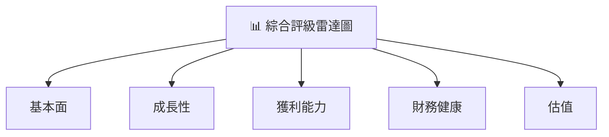

### 10.2 目標價與隱含報酬率

| 情境 | 目標價 | 隱含報酬率 | 機率權重 |
|------|------|-----------|--------|
| 悲觀 | N/A | N/A | 20% |
| 基準 | N/A | N/A | 50% |
| 樂觀 | N/A | N/A | 30% |

### 10.3 買入時機與觸發因素

```
╔══════════════════════════════════════════════════════════════════╗
║                  ✅ 買入觸發因素 Checklist                      ║
╠══════════════════════════════════════════════════════════════════╣
║                                                                  ║
║  立即買入觸發條件（多數符合）：                                  ║
║  ✅ 市場價格低於評估價                                           ║
║  ✅ 行業政策支持                                                ║
║  加碼觸發條件（出現以下任一）：                                  ║
║  ☐ 新產品上市成功                                               ║
║  減碼/停損觸發條件（出現以下任一）：                             ║
║  ☐ 財務健康惡化                                                 ║
╚══════════════════════════════════════════════════════════════════╝
```

### 10.4 投資人適配度分析

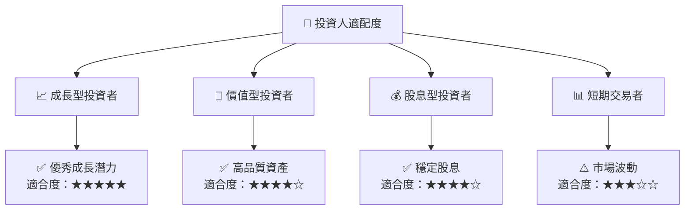

### 10.5 關鍵監控指標

| 監控類型 | 指標 | 關注點 | 頻率 |
|----------|------|--------|------|
| 財務 | 毛利率 | 小幅變動 | 季度 |
| 市場 | 市場份額 | 改變趨勢 | 年度 |

---

> **免責聲明**：本報告為 AI 自動生成，僅供研究參考，不構成投資建議。投資有風險，入市需謹慎。