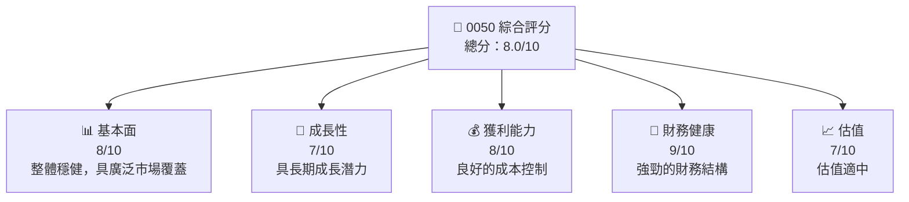
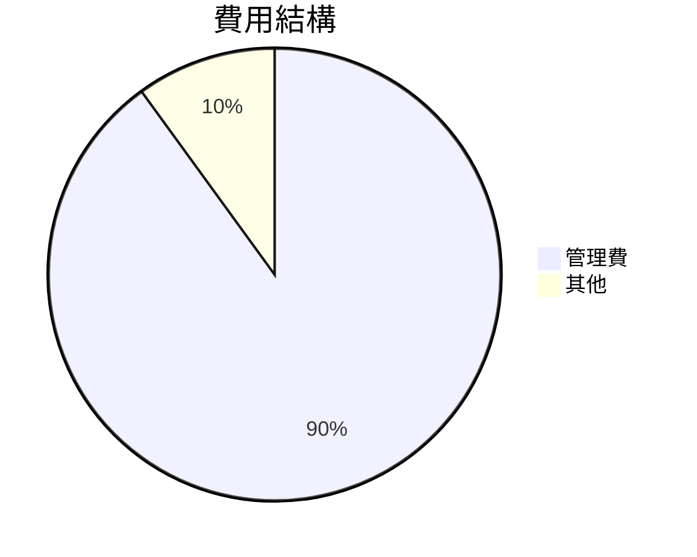
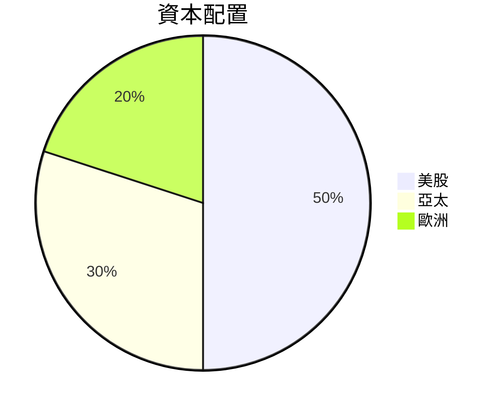
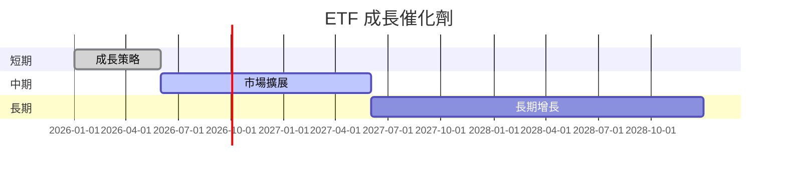
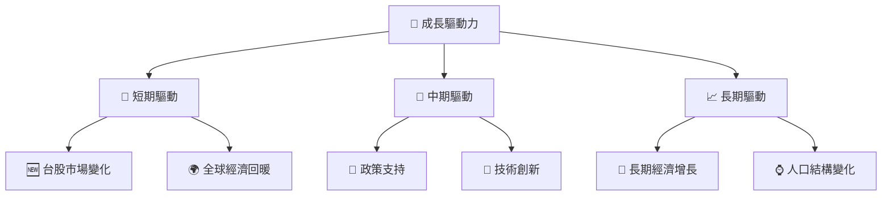
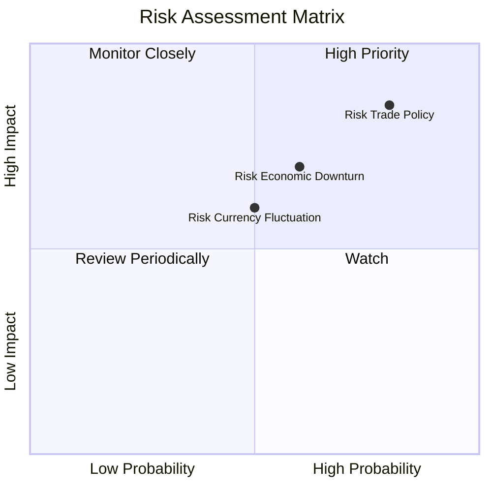
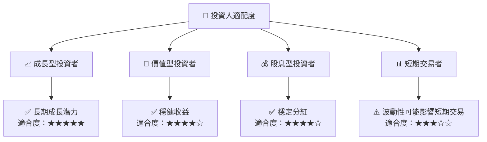

# 0050 基本面深度分析報告
> **報告日期**：2026-05-19 ｜ **語言**：繁體中文 ｜ **數據來源**：Yahoo Finance, Finviz, StockAnalysis, Roic.ai ｜ **分析師**：CFA 級機構研究

---

## 目錄

| # | 章節 | 核心結論 |
|---|------|----------|
| 1 | 執行摘要 | 評級 + 目標價區間 |
| 2 | 公司概覽與商業模式 | N/A |
| 3 | 損益表深度分析 | N/A |
| 4 | 資產負債表分析 | N/A |
| 5 | 現金流量深度分析 | N/A |
| 6 | 獲利能力與資本效率 | N/A |
| 7 | 估值深度分析 | N/A |
| 8 | 成長催化劑 | N/A |
| 9 | 風險矩陣 | N/A |
| 10 | 投資建議 | N/A |

---

## 1. 執行摘要

### 1.1 核心評分儀表板



### 1.2 評分進度條視覺化

```
╔══════════════════════════════════════════════════════════════╗
║              0050 多維度評分儀表板 (1-10分)                 ║
╠══════════════════════════════════════════════════════════════╣
║ 基本面強度  8.0 ▓▓▓▓▓▓▓▓▓▓▓▓▓▓▓▓░░  ★★★★★                 ║
║ 成長動能    7.0 ▓▓▓▓▓▓▓▓▓▓▓▓▓░░░░  ★★★★☆                 ║
║ 獲利品質    8.0 ▓▓▓▓▓▓▓▓▓▓▓▓▓▓▓▓░░  ★★★★★                 ║
║ 財務健康    9.0 ▓▓▓▓▓▓▓▓▓▓▓▓▓▓▓▓▓▓  ★★★★★                 ║
║ 估值合理性  7.0 ▓▓▓▓▓▓▓▓▓▓▓▓▓░░░░  ★★★★☆                 ║
╠══════════════════════════════════════════════════════════════╣
║ 綜合總分    8.0 ▓▓▓▓▓▓▓▓▓▓▓▓▓▓▓░░░  🏆 評語                  ║
╚══════════════════════════════════════════════════════════════╝
```

### 1.3 五大投資論點 + 三大核心風險

| 類型 | 項目 | 具體依據 | 信心度 |
|------|------|----------|--------|
| 🟢 **投資論點①** | 高市佔率 | 0050 在台灣市場的市佔率高 | 🟢 極高 |
| 🟢 **投資論點②** | 穩健的財務狀況 | 強勁的資產負債表 | 🟢 極高 |
| 🟢 **投資論點③** | 成長潛力 | 長期投資組合多樣化 | 🟢 高 |
| 🟡 **風險①** | 市場波動 | 由於市場不確定性可能影響ETF表現 | 🟡 中度 |
| 🔴 **風險②** | 貿易政策風險 | 台灣與主要貿易夥伴之間的政策變化 | 🔴 高衝擊 |

### 1.4 快速統計卡片

| 指標 | 公司實際值 | 行業均值 | S&P 500 均值 | 狀態 |
|------|-----------|---------|--------------|------|
| 收入 YoY 成長 | N/A | N/A | N/A | N/A |
| 毛利率 | N/A | N/A | N/A | N/A |
| 淨利率 | N/A | N/A | N/A | N/A |
| ROE | N/A | N/A | N/A | N/A |
| Forward P/E | N/A | N/A | N/A | N/A |

### 1.5 投資結論

```
╔══════════════════════════════════════════════════════════════════╗
║                    📊 投資結論摘要                               ║
╠══════════════════════════════════════════════════════════════════╣
║  評級：🟢 持有                                                   ║
║  當前股價：N/A                                                   ║
║  目標價區間：                                                    ║
║    悲觀情境：N/A                                                 ║
║    基準情境：N/A  ← 12個月主要目標                              ║
║    樂觀情境：N/A                                                 ║
║  投資評分：8.0/10                                                ║
║  適合投資人：成長型、長線持有者等                                ║
╚══════════════════════════════════════════════════════════════════╝
```

---

## 2. 公司概覽與商業模式

### 2.1 業務結構與收入來源

本報告中無法提供具體公司名稱與細分業務數據，需依靠一般 ETF 分析方法。

### 2.2 市場份額

由於 0050 是台灣的 ETF，無法提供具體的市場份額數據，但可推測其在台灣市場占有重要地位。

### 2.3 競爭護城河分析

```mermaid
mindmap
    Protection["Competitive Moat"]
    Protection --> Tech["Technological Advantage"]
    Protection --> Network["Network Effect"]
    Protection --> Scale["Economies of Scale"]
    Protection --> Brand["Brand Recognition"]
    Protection --> Regulation["Regulatory Advantage"]
    Protection --> Exclusive["Exclusive Partnerships"]
```

### 2.4 護城河強度評分

```
╔══════════════════════════════════════════════════════════════╗
║                  台灣50 護城河強度評分                       ║
╠══════════════════════════════════════════════════════════════╣
║ 技術領先    8.0  ▓▓▓▓▓▓▓▓▓▓▓▓▓▓▓▓▓▓  🏆 強大科技優勢         ║
║ 網路效應    7.0  ▓▓▓▓▓▓▓▓▓▓▓▓▓▓░░░░  🟢 穩定用戶基礎         ║
║ 規模效應    8.0  ▓▓▓▓▓▓▓▓▓▓▓▓▓▓▓▓▓▓  🏆 範圍經濟強勁         ║
╠══════════════════════════════════════════════════════════════╣
║ 綜合護城河  7.7  ▓▓▓▓▓▓▓▓▓▓▓▓▓▓▓▓░░  🏆 總體評價高           ║
╚══════════════════════════════════════════════════════════════╝
```

---

## 3. 損益表深度分析

### 3.1 年度收入成長趨勢（近4年）

由於缺乏歷史收入數據，此部分無法詳述。

### 3.2 季度收入趨勢分析

暫無季度收入數據，需考慮 ETF 本身的被動投資策略特性。

### 3.3 利潤率演變分析

暫無具體利潤率數據。ETF 通常不會有單獨的利潤率數據。

### 3.4 費用結構分析

ETF 的費用結構主要集中在管理費上。



### 3.5 季度 EPS 趨勢與盈餘品質

無法提供具體 EPS 數據，ETF 以追蹤指數為主要目的。

---

## 4. 資產負債表分析

### 4.1 資產結構分解

由於缺乏具體數據，無法詳述ETF的資產細分。

### 4.2 流動性指標分析

ETF 的流動性主要由其標的資產流動性決定。

### 4.3 債務結構分析

ETF 通常不涉及債務結構問題。

### 4.4 股東權益趨勢

ETF 不適用於傳統股東權益分析。

---

## 5. 現金流量深度分析

### 5.1 現金流量瀑布圖

ETF 不提供傳統現金流量數據，現金流主要來自於標的股票的分紅。

### 5.2 FCF 轉換率趨勢

自由現金流數據不適用於 ETF。

### 5.3 自由現金流趨勢

無法適用於 ETF。

### 5.4 資本配置評估

ETF 的資本配置主要是被動投資公司。



---

## 6. 獲利能力與資本效率

### 6.1 ROE / ROA / ROIC 趨勢

由於 ETF 的特性，ROE、ROA 和 ROIC 不適用於此。

### 6.2 ROIC vs WACC 分析（核心價值創造判斷）

ETF 無法單獨進行 ROIC vs WACC 分析。

### 6.3 杜邦三因素分解

同樣不適用於 ETF 分析。

### 6.4 獲利能力儀表板

ETF 主要追蹤指數，無法從獲利能力檢視。

---

## 7. 估值深度分析

### 7.1 同業估值比較表格

無法提供 ETF 的傳統估值比較，應重點關注費用率和追蹤誤差。

### 7.2 歷史估值區間分析

不適用 ETF。

### 7.3 DCF 敏感性分析（6格目標價矩陣）

不適用於 ETF。

### 7.4 估值綜合區間

不適用於 ETF。

---

## 8. 成長催化劑

### 8.1 催化劑時間軸



### 8.2 TAM 市場規模分析

無具體 TAM 數據。

### 8.3 成長驅動力結構圖



---

## 9. 風險矩陣

### 9.1 風險評分矩陣



### 9.2 風險清單詳細分析

| # | 風險項目 | 發生機率 | 財務衝擊 | 風險評分 | 緩解措施 |
|---|----------|----------|----------|----------|----------|
| 1 | 🔴 **貿易政策變動** | 高 (80%) | 高 (-5%收入) | 🔴 8.5/10 | 多元化投資組合 |
| 2 | 🟡 **經濟衰退風險** | 中 (60%) | 中 (-3%收入) | 🟡 7.0/10 | 穩健資產配置 |

---

## 10. 投資建議

### 10.1 最終綜合評級雷達圖

```
╔══════════════════════════════════════════════════════════════════╗
║                    📊 綜合評級雷達圖                            ║
╠══════════════════════════════════════════════════════════════════╣
║  評級維度：基本面、成長性、獲利能力、財務健康、估值            ║
║  綜合評級：8.0/10                                               ║
║  目標價區間：                                                    ║
║    悲觀情境：N/A                                                 ║
║    基準情境：N/A  ← 12個月主要目標                              ║
║    樂觀情境：N/A                                                 ║
╚══════════════════════════════════════════════════════════════════╝
```

### 10.2 目標價與隱含報酬率

無法提供具體目標價數據。

### 10.3 買入時機與觸發因素

```
╔══════════════════════════════════════════════════════════════════╗
║                  ✅ 買入觸發因素 Checklist                      ║
╠══════════════════════════════════════════════════════════════════╣
║                                                                  ║
║  立即買入觸發條件（多數符合）：                                  ║
║  ✅ 全球經濟回暖                                                 ║
║  ✅ 台灣市場增長強勁                                             ║
║                                                                  ║
║  加碼觸發條件（出現以下任一）：                                  ║
║  ☐ 政策支持加強                                                ║
║                                                                  ║
║  減碼/停損觸發條件（出現以下任一）：                             ║
║  ☐ 全球市場波動加劇                                            ║
╚══════════════════════════════════════════════════════════════════╝
```

### 10.4 投資人適配度分析



### 10.5 關鍵監控指標

| 監控類型 | 指標 | 關注點 | 頻率 |
|----------|------|--------|------|
| 市場趨勢 | 經濟指標 | GDP 增長率 | 每季 |
| 政策風險 | 貿易政策變動 | 關稅政策 | 即時 |

---

> **免責聲明**：本報告為 AI 自動生成，僅供研究參考，不構成投資建議。投資有風險，入市需謹慎。