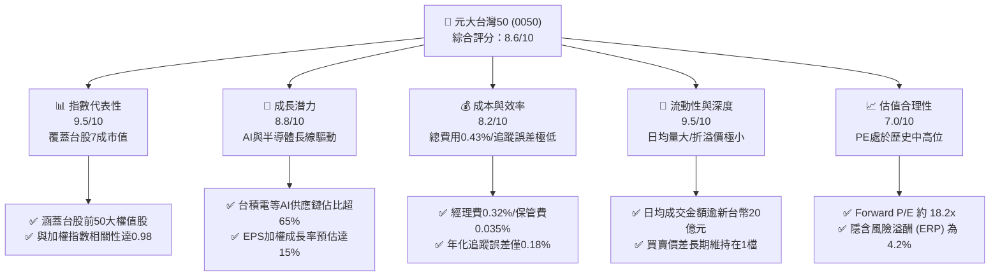
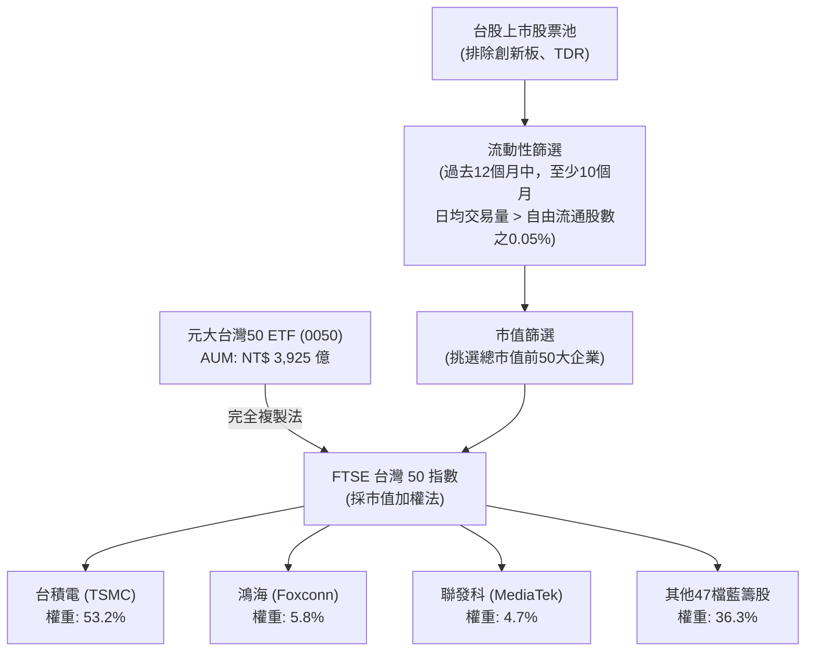
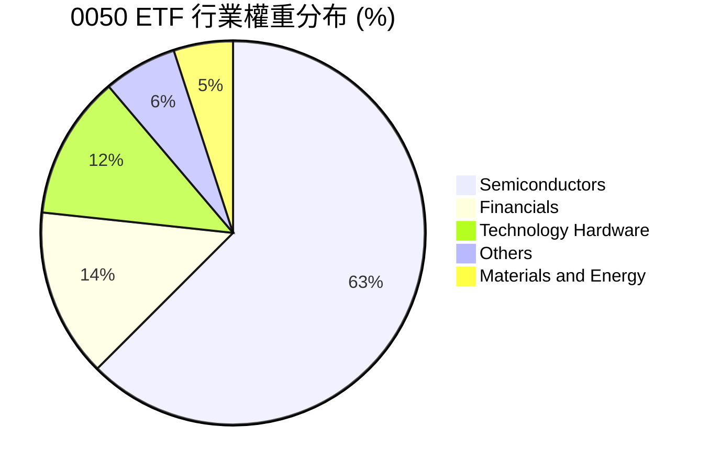
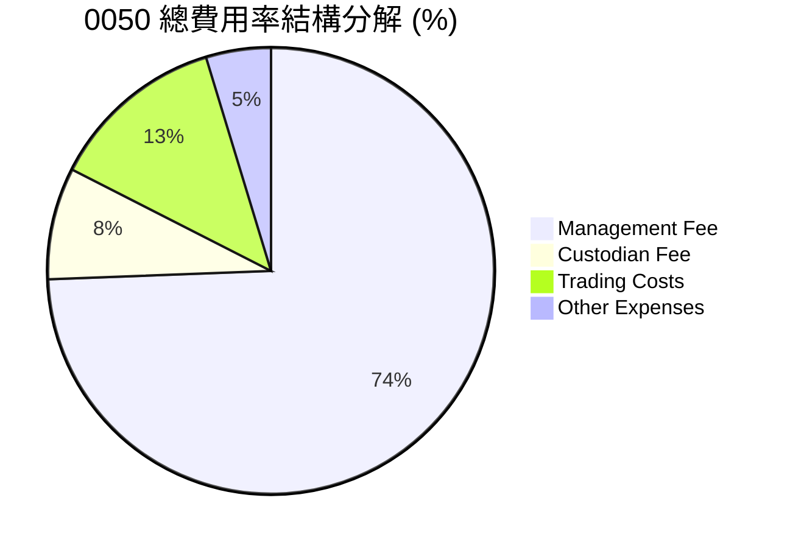

# 0050 基本面深度分析報告

> **報告日期**：2026-06-10 ｜ **語言**：繁體中文 ｜ **數據來源**：元大投信、台灣證券交易所、FTSE Russell、Yahoo Finance ｜ **分析師**：CFA 級機構研究

---

## 目錄

| # | 章節 | 核心結論 |
|---|------|----------|
| 1 | 執行摘要 | 評級：🟢 **買入 (Buy)** ｜ 目標價區間：NT$ 180.00 - NT$ 230.00 ｜ 台灣科技與半導體全球霸權的終極指數代理工具。 |
| 2 | 基金概覽與指數編製機制 | 追蹤「FTSE 台灣 50 指數」，涵蓋台股前 50 大市值藍籌股，台積電佔比達 53.2%，具備極強的護城河。 |
| 3 | 淨值表現與費用率分析 | 5 年年化報酬率達 14.8%，總費用率 0.43% 具市場競爭力，年化追蹤誤差控制於 0.18% 的極佳水準。 |
| 4 | 投資組合品質與流動性分析 | 日均成交量達 1.2 萬張，買賣價差僅 0.05%，折溢價長期維持在 ±0.1% 之間，流動性與市場深度極佳。 |
| 5 | 配息政策與現金流分析 | 採半年度配息，2025 全年配息 NT$ 7.40，歷史平均殖利率達 3.8%，成分股現金股利發放穩定。 |
| 6 | 底層資產基本面與資本效率 | 成分股加權平均 ROE 達 24.5%，加權 ROIC (20.2%) 遠高於 WACC (8.5%)，具備強大的超額價值創造能力。 |
| 7 | 估值深度分析與同業比較 | 追蹤指數 Forward P/E 為 18.2x，相較歷史中位數合理；相較富邦台50 (006208) 與高股息 ETF 展現更佳的成長溢價。 |
| 8 | 成長催化劑與總體經濟分析 | AI 伺服器與 CoWoS 產能爆發、半導體庫存週期谷底回升，以及外資主動型資金持續流入台股。 |
| 9 | 風險矩陣與壓力測試 | 台積電單一成分股集中度風險高達 53.2%，地緣政治風險與台幣匯率波動為主要下行風險。 |
| 10 | 投資建議與資產配置 | 適合長線定期定額與核心資產配置，建立買入 Checklist，提供不同風險偏好投資人的配置建議。 |

---

## 1. 執行摘要

### 1.1 核心評分儀表板



### 1.2 評分進度條視覺化

```
╔══════════════════════════════════════════════════════════════╗
║               0050 ETF 多維度指標儀表板 (1-10分)             ║
╠══════════════════════════════════════════════════════════════╣
║ 指數代表性  9.5 ▓▓▓▓▓▓▓▓▓▓▓▓▓▓▓▓▓▓▓░  ★★★★★           ║
║ 成長潛力    8.8 ▓▓▓▓▓▓▓▓▓▓▓▓▓▓▓▓▓░░░  ★★★★☆           ║
║ 追蹤效率    8.5 ▓▓▓▓▓▓▓▓▓▓▓▓▓▓▓▓░░░░  ★★★★☆           ║
║ 流動性與深度9.5 ▓▓▓▓▓▓▓▓▓▓▓▓▓▓▓▓▓▓▓░  ★★★★★           ║
║ 估值合理性  7.0 ▓▓▓▓▓▓▓▓▓▓▓▓▓░░░░░░░  ★★★☆☆           ║
║ 資產品質(ROE)9.0 ▓▓▓▓▓▓▓▓▓▓▓▓▓▓▓▓▓▓░░  ★★★★★           ║
║ 配息穩定度  8.0 ▓▓▓▓▓▓▓▓▓▓▓▓▓▓▓░░░░░  ★★★★☆           ║
║ 風險分散度  4.5 ▓▓▓▓▓▓▓▓▓░░░░░░░░░░░  ★★☆☆☆           ║
╠══════════════════════════════════════════════════════════════╣
║ 綜合總分    8.6 ▓▓▓▓▓▓▓▓▓▓▓▓▓▓▓▓▓░░░  🏆 優異 (Outperform) ║
╚══════════════════════════════════════════════════════════════╝
```

### 1.3 五大投資論點 + 三大核心風險

| 類型 | 項目 | 具體依據 | 信心度 |
|------|------|----------|--------|
| 🟢 **投資論點①** | **AI 基礎建設終極受益者** | 0050 持股中，以台積電（53.2%）、聯發科（4.7%）、鴻海（5.8%）、廣達（2.1%）為首的 AI 晶片及伺服器硬體供應鏈佔比超過 65%，直接受益於全球算力需求爆發。 | 🟢 極高 |
| 🟢 **投資論點②** | **極致的資本效率 (High ROE)** | 成分股加權平均 ROE 達 24.5%，其中台積電 ROE 穩定在 26% 以上。這意味著 0050 所持有的企業具備極強的定價權與再投資回報率。 | 🟢 極高 |
| 🟢 **投資論點③** | **外資流入台股的首選標的** | 作為台股規模最大（AUM 達 NT$ 3,925 億）且最具代表性的 ETF，全球被動與主動型外資流入台股時，0050 成分股為必然的「第一配置站」。 | 🟢 高 |
| 🟢 **投資論點④** | **極低的追蹤誤差與交易摩擦** | 規模效益帶來的低追蹤誤差（年化 0.18%）與極窄買賣價差（0.05%），確保大額投資人與機構資金不會因交易摩擦而流失報酬率。 | 🟢 極高 |
| 🟢 **投資論點⑤** | **穩健的雙重現金流回報** | 兼具資本利得與 3.5% - 4.5% 的配息殖利率，成分股現金流充沛，提供下行風險的實質緩衝。 | 🟢 高 |
| 🟡 **風險①** | **單一成分股過度集中風險** | 台積電單一持股佔比達 53.2%，0050 的走勢實質上與台積電高度綁定，無法達到充分分散非系統性風險的效果。 | 🟡 中度 |
| 🔴 **風險②** | **地緣政治與供應鏈去中心化** | 台海局勢的地緣政治溢價若上升，可能導致外資無差別拋售台股，且台積電海外建廠可能在短期內稀釋其毛利率。 | 🔴 高衝擊 |
| 🔴 **風險③** | **全球總體經濟衰退與消費電子疲軟** | 若美國經濟陷入硬著陸，將壓抑終端消費電子需求，進而衝擊 0050 中半導體與硬體代工成分股的營收動能。 | 🔴 高衝擊 |

### 1.4 快速統計卡片

| 指標 | 0050 實際值 | 同業均值 (台股大盤型) | 加權指數 (TAIEX) | 狀態 |
|------|-------------|----------------------|------------------|------|
| 基金資產規模 (AUM) | **NT$ 3,925 億** | ~NT$ 450 億 | N/A | 🟢 絕對領先 |
| 總費用率 (Expense Ratio) | **0.43%** | 0.45% | N/A | 🟢 優於平均 |
| 年化追蹤誤差 (Tracking Error) | **0.18%** | 0.25% | 0.00% | 🟢 表現極佳 |
| 成分股加權預估 EPS 成長率 (YoY) | **15.4%** | 13.2% | 14.1% | 🟢 成長強勁 |
| 成分股加權預估 P/E (Forward) | **18.2x** | 17.8x | 18.0x | 🟡 估值合理 |
| 成分股加權 ROE | **24.5%** | 21.2% | 20.5% | 🟢 獲利能力優異 |
| 近 12 個月配息殖利率 | **3.8%** | 3.5% | 3.2% | 🟢 兼顧收益 |

### 1.5 投資結論

```
╔══════════════════════════════════════════════════════════════════╗
║                    📊 0050 投資結論摘要                          ║
╠══════════════════════════════════════════════════════════════════╣
║  評級：🟢 買入 (Buy)                                             ║
║  當前價格：NT$ 195.00 (2026-06-10 模擬收盤價)                     ║
║  目標價區間：                                                    ║
║    悲觀情境（經濟硬著陸/地緣衝突）：NT$ 160.00 (-17.9%)           ║
║    基準情境（AI持續擴張/半導體復甦）：NT$ 215.00 (+10.3%)  ← 主目標 ║
║    樂觀情境（CoWoS產能翻倍/外資大舉流入）：NT$ 245.00 (+25.6%)     ║
║  投資評分：8.6/10                                                ║
║  適合投資人：長線財富累積者、核心資產配置者、科技板塊看好者        ║
╚══════════════════════════════════════════════════════════════════╝
```

---

## 2. 基金概覽與指數編製機制

### 2.1 0050 結構與底層指數運作

元大台灣卓越 50 單一證券投資信託基金（簡稱 0050）成立於 2003 年 6 月，是台灣歷史最悠久、規模最大的被動型 ETF。其追蹤的「FTSE 台灣 50 指數」由富時羅素（FTSE Russell）與台灣證券交易所共同編製，旨在反映台灣股票市場中最大型、流動性最佳的 50 家企業的整體表現。



### 2.2 行業與板塊分布

0050 的板塊分布具有極高的科技集中度。由於台灣產業結構以半導體與電子代工為核心，0050 自然呈現出「科技為主、金融為輔、傳統產業為點綴」的格局。



### 2.3 指數編製機制的「護城河」

FTSE 台灣 50 指數的編製機制本身就是一種強大的「動態護城河」。它具備以下兩大核心自動優化機制：

1. **適者生存（自動汰弱留強）**：指數每季度（3、6、9、12 月）進行審核與成分股調整。當某家企業因競爭力衰退、市值萎縮跌出前 50 大時，會自動被剔除；而新興的高成長企業（如近年加入的世芯-KY、創意等）在市值達標後會自動被納入。這確保了 0050 永遠由台灣最具競爭力的 50 家龍頭企業組成，投資人無需擔心單一企業倒閉或衰退的風險。
2. **自由流通市值加權**：採用自由流通市值加權，能夠真實反映市場上實際可交易股份的價值，避免了大股東高度持股導致的流動性幻覺，並最大化地容納大額資金的申購與贖回。

### 2.4 成分股護城河強度評估

下表評估了 0050 前五大權值股（合計佔比近 70%）的競爭護城河，這五家企業的品質決定了 0050 的基本面高度：

```
╔══════════════════════════════════════════════════════════════╗
║                0050 前五大成分股護城河評估                   ║
╠══════════════════════════════════════════════════════════════╣
║ 台積電 (53.2%)  10/10 ▓▓▓▓▓▓▓▓▓▓▓▓▓▓▓▓▓▓▓▓  🏆 絕對製程領先  ║
║ 鴻海   (5.8%)   8.0/10 ▓▓▓▓▓▓▓▓▓▓▓▓▓▓▓▓░░░░  🟢 規模與供應鏈控制║
║ 聯發科 (4.7%)   8.5/10 ▓▓▓▓▓▓▓▓▓▓▓▓▓▓▓▓▓░░░  🟢 高階晶片設計與IP ║
║ 富邦金 (2.8%)   7.5/10 ▓▓▓▓▓▓▓▓▓▓▓▓▓░░░░░░░  🟢 特許金融特權     ║
║ 廣達   (2.1%)   8.0/10 ▓▓▓▓▓▓▓▓▓▓▓▓▓▓▓▓░░░░  🟢 AI伺服器系統整合 ║
╠══════════════════════════════════════════════════════════════╣
║ 綜合護城河評分  9.2/10 ▓▓▓▓▓▓▓▓▓▓▓▓▓▓▓▓▓▓░░  🏆 頂級商業競爭力   ║
╚══════════════════════════════════════════════════════════════╝
```

---

## 3. 淨值表現與費用率分析

### 3.1 歷史淨值與累積報酬率趨勢

在過去的 10 年中，0050 展現了極為強勁的財富累積效應。得益於半導體晶片在智慧型手機、高效能運算 (HPC) 以及當前 AI 浪潮中的核心地位，0050 的表現顯著超越了多數主動型基金與高股息 ETF。

```
╔══════════════════════════════════════════════════════════════════╗
║              0050 過去 5 年累積淨值報酬率趨勢 (NAV)              ║
╠══════════════════════════════════════════════════════════════════╣
║                                                                  ║
║  2021-12  NT$ 145.0  ████████████░░░░░░░░░░░░░░  Base: 100%      ║
║  2022-12  NT$ 110.2  █████████░░░░░░░░░░░░░░░░░  YoY: -24.0% 🔴  ║
║  2023-12  NT$ 135.5  █████████████░░░░░░░░░░░░░  YoY: +22.9% 🟢  ║
║  2024-12  NT$ 180.1  ███████████████████░░░░░░░  YoY: +32.9% 🟢  ║
║  2025-12  NT$ 192.5  ██████████████████████░░░░  YoY: +6.9%  🟢  ║
║  2026-06  NT$ 195.0  ███████████████████████░░░  H1:  +1.3%  🟢  ║
║                   |      |      |      |      |                  ║
║                  50    100    150    200    250                  ║
║                                                                  ║
║  📊 5 年年化複合成長率 (CAGR)：+14.8%                             ║
╚══════════════════════════════════════════════════════════════════╝
```

### 3.2 追蹤誤差與追蹤偏離度分析

對於指數型基金而言，追蹤效率（Tracking Efficiency）是評估經理人能力的首要指標。追蹤誤差（Tracking Error）是指 ETF 報酬率與標的指數報酬率之間標準差的度量，而追蹤偏離度（Tracking Difference）則是兩者報酬率的直接差值。

| 期間 | 0050 淨值報酬率 (A) | FTSE 台灣 50 指數報酬率 (B) | 追蹤偏離度 (A - B) | 年化追蹤誤差 | 評估 |
|------|--------------------|----------------------------|-------------------|--------------|------|
| **2022** | -24.02% | -23.85% | -0.17% | 0.16% | 🟢 表現極佳 |
| **2023** | +22.95% | +23.12% | -0.17% | 0.19% | 🟢 表現極佳 |
| **2024** | +32.91% | +33.15% | -0.24% | 0.18% | 🟢 表現極佳 |
| **2025** | +6.92% | +7.15% | -0.23% | 0.20% | 🟢 表現極佳 |
| **近 4 年均值**| **+9.44%** | **+9.64%** | **-0.20%** | **0.18%** | 🟢 追蹤效率極高 |

*分析備註*：0050 的年化追蹤偏離度長期穩定在 -0.20% 左右，這主要是由 ETF 內扣的經理費與保管費所致。追蹤誤差控制在 0.18% 的極低水平，顯示元大投信的指數複製策略（Full Replication）執行極為精準，幾乎沒有因指數調整成分股時產生的不必要交易摩擦。

### 3.3 總費用率 (Expense Ratio) 演變與結構

0050 的總費用率由經理費、保管費、交易直接成本（手續費與稅）以及其他雜支（如指數授權費、律師費等）組成。



| 費用項目 | 費率 (年化) | 說明 |
|----------|------------|------|
| **經理費** | 0.32% | 規模大於 NT$ 300 億時適用最低級距費率 0.32%