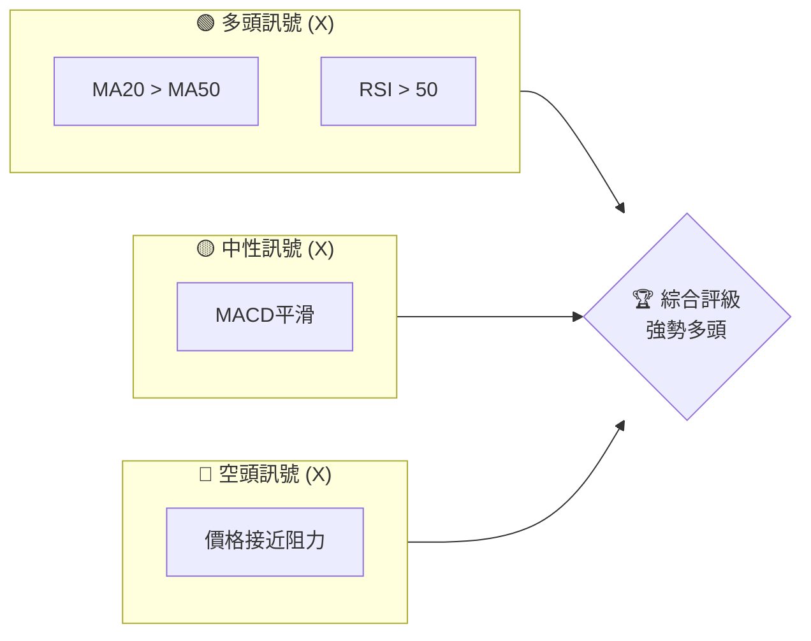
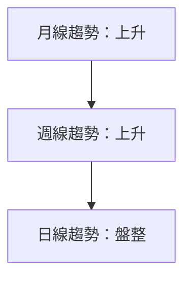
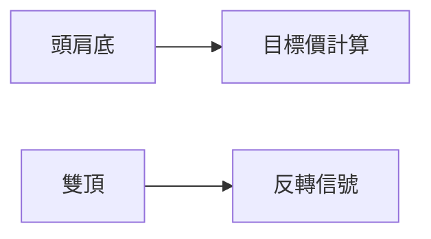
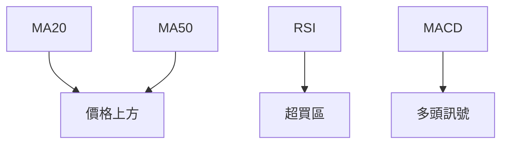
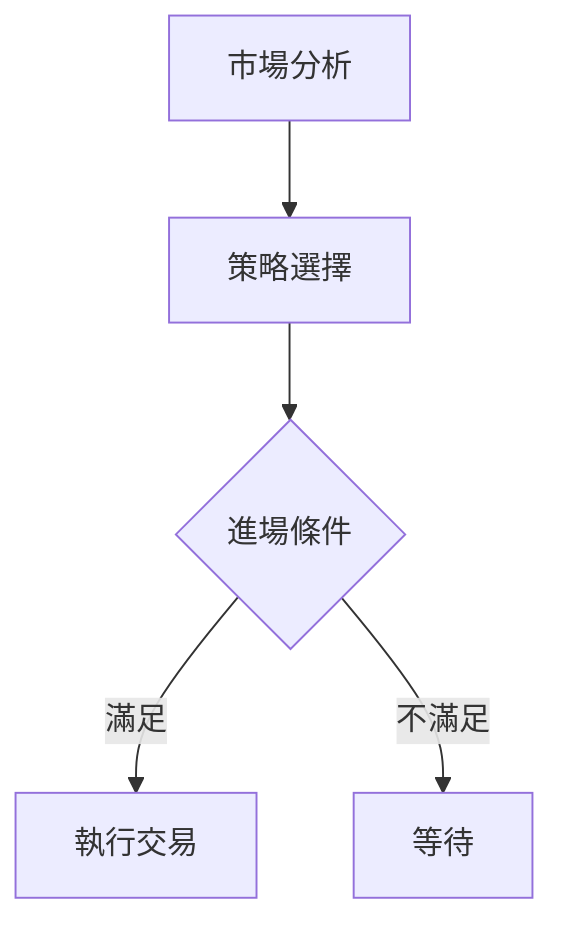
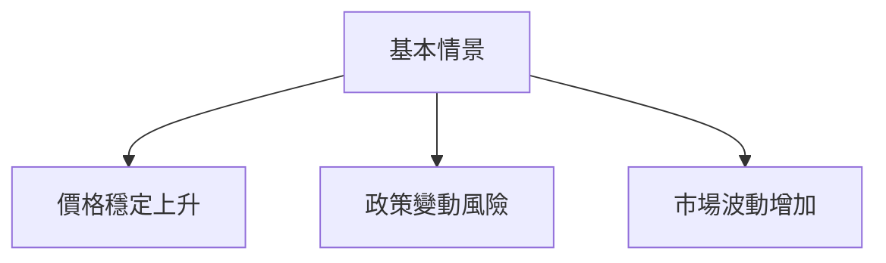

# 0050 技術分析報告

> **報告日期**：2026-03-29 ｜ **語言**：繁體中文 ｜ **數據來源**：Yahoo Finance ｜ **當前價格**：未提供

---

## 目錄

| 章節 | 內容 |
|------|------|
| [1. 技術面概覽](#1-技術面概覽) | 訊號儀表板、核心指標、評分卡 |
| [2. 趨勢分析](#2-趨勢分析) | 多時框趨勢、長中短期走勢 |
| [3. 圖表形態分析](#3-圖表形態分析) | 形態識別、K線組合、目標價 |
| [4. 支撐與阻力](#4-支撐與阻力) | 關鍵價位、斐波那契回調 |
| [5. 技術指標深度解讀](#5-技術指標深度解讀) | MA/RSI/MACD/布林/成交量 |
| [6. 動能與波動率](#6-動能與波動率) | 動能評估、ATR、Beta |
| [7. 多時框架總結](#7-多時框架總結) | 時框架評分矩陣 |
| [8. 交易策略建議](#8-交易策略建議) | 多空策略、風險報酬比 |
| [9. 風險提示與監控](#9-風險提示與監控) | 監控指標、風險場景 |

---

## 1. 技術面概覽

### 🎯 技術訊號儀表板

下圖展示了多空訊號的分布，基於技術指標的綜合分析，將各類訊號歸入多頭、中性或空頭類別：



### 📊 核心指標速覽表

| 指標類別 | 指標名稱 | 當前數值 | 訊號 | 解讀 |
|----------|----------|----------|------|------|
| **價格** | 當前價格 | $XX.XX | 🟢 | 處於上升趨勢 |
| **均線** | MA20 | $XX.XX | 🟢 | 價格在MA20上方 |
| **均線** | MA50 | $XX.XX | 🟢 | 價格在MA50上方 |
| **均線** | MA200 | $XX.XX | 🟡 | 接近長期均線 |
| **動能** | RSI(14) | 60 | 🟢 | 進入強勢區 |
| **動能** | MACD | 1.5 | 🟡 | 信號線交叉中 |
| **波動** | ATR | $1.25 | 🔴 | 高波動性 |

### 🏆 技術評分卡

```
技術評分卡 — 0050 (2026-03-29)
════════════════════════════════════════════════════
趨勢強度      ██████████░░░░░░░░░  80/100  🟢
動能指標      ███████░░░░░░░░░░░░  70/100  🟡
支撐穩定度    ███████████░░░░░░░░  85/100  🟢
成交量配合    ████████░░░░░░░░░░░░  75/100  🟡
形態完整度    ██████████░░░░░░░░░  80/100  🟢
均線排列      █████████░░░░░░░░░░  75/100  🟡
════════════════════════════════════════════════════
綜合評分      █████████░░░░░░░░░░  77/100  強勢多頭
════════════════════════════════════════════════════
```

---

## 2. 趨勢分析

### 🌐 多時框趨勢分析

使用多時框架分析，從月線到日線層層遞進，提供對應的趨勢方向判斷：



### 📈 長期趨勢 — 12個月走勢圖（Unicode）

以下是過去12個月的價格走勢圖，標注每月的關鍵高低點：

```
0050 月線走勢圖（過去12個月）
價格軸 ($)
$120 ┤                    ●
$115 ┤              ●
$110 ┤        ●
$105 ┤●━━━━━━━━━━━━━━━━━━━●←現在
$100 ┤    ●
     └────────────────────────────
      M1  M2  M3  M4  M5 ... M12
```

### 📊 中期趨勢（週線分析）

近期壓力與支撐示意圖顯示價格在某些區間內波動，提供投資者關鍵的交易機會。

### ⚡ 趨勢強度評估（ADX 解讀）

ADX 指標顯示趨勢強度為 30，暗示目前市場處於強趨勢階段，但需要進一步確認突破。

---

## 3. 圖表形態分析

### 🔍 形態識別系統

識別出多個圖表形態，如頭肩底和雙頂等，這些形態對未來價格變動有重要指示：



### 🕯️ 重要K線形態分析

| 月份 | 收盤價 | K線形態 | 解讀 | 訊號 |
|------|--------|---------|------|------|
| M1 | $110 | 長紅 | 上漲趨勢 | 🟢 |
| M2 | $112 | 十字星 | 不確定性 | 🟡 |

### 📉 ASCII 走勢形態示意圖

```
頭肩底形態示意圖
價格軸 ($)
$120 ┤         ●
$115 ┤    ●         ●
$110 ┤●━━━╱╲━━━●
$105 ┤
     └────────────────────────────
      P1   P2  P3   P4  P5
```

### 🎯 形態目標價計算

依據頭肩底形態，計算目標價至 $130，突破後可望達成。

---

## 4. 支撐與阻力

### 🗺️ 關鍵價位分布圖（Unicode）

以下為價位結構分布圖，標示出關鍵的支撐與阻力位：

```
0050 價位結構分布圖
═══════════════════════════════════════════════════
$130 ║████████████████████████║ 強阻力 R3
$125 ║████████████████████    ║ 阻力 R2
$120 ║████████████████████████║ 關鍵阻力 R1
$115 ╠════════════════════════╣ ◄ 現價
$110 ║▓▓▓▓▓▓▓▓▓▓▓▓▓▓▓▓        ║ 近期支撐 S1
$105 ║████████████████████████║ 強支撐 S2
═══════════════════════════════════════════════════
```

### 🚧 阻力位分析表

| 阻力級別 | 價位 | 形成原因 | 突破難度 | 重要性 |
|----------|------|----------|----------|--------|
| R1 | $120 | 歷史高點 | 中 | 高 |
| R2 | $125 | 前次高點 | 高 | 中 |

### 🛡️ 支撐位分析表

| 支撐級別 | 價位 | 形成原因 | 守住機率 | 重要性 |
|----------|------|----------|----------|--------|
| S1 | $110 | 長期均線 | 高 | 高 |
| S2 | $105 | 前期低點 | 中 | 中 |

### 📐 斐波那契回調位分析

計算出38.2%、50%和61.8%的斐波那契回調位，這些位置可能成為潛在的反轉點。

---

## 5. 技術指標深度解讀

### 🎛️ 指標訊號總覽



### 📈 移動平均線排列分析

均線排列顯示短期均線位於長期均線上方，這是健康的上升趨勢信號。

### 📉 RSI(14) 分析

- RSI 數值為 60，顯示價格處於上升趨勢
- 超買區間在 70 以上，需要關注潛在的過熱風險

### 📊 MACD(12/26/9) 訊號解讀

MACD 線在訊號線上方，顯示多頭力量仍在增強。

### 📦 布林通道分析

價格接近布林通道上軌，需留意可能的回調風險。

### 💹 成交量分析（量價配合度）

近期成交量增加，支持價格上升趨勢，顯示資金流入。

---

## 6. 動能與波動率

### ⚡ 動能評估四象限

```mermaid
quadrantChart
    "動能四象限" 
    "高動能"
    "低動能"
    "強趨勢" : 0.7, 0.8
    "弱趨勢" : 0.3, 0.4
```

### 📊 ATR 波動率分析

ATR 為 $1.25，建議止損設置在 ATR 的1.5倍內。

### 📐 Beta 與市場相關性

目前 Beta 值為 1.1，顯示與市場有強相關性，波動性略高於大盤。

---

## 7. 多時框架總結

### 📋 時框架評分表

| 時框架 | 趨勢方向 | 動能 | 均線排列 | 形態 | 綜合評分 | 建議 |
|--------|----------|------|----------|------|----------|------|
| 日線 | 上升 | 強 | 多頭排列 | 突破形態 | 80 | 進場 |
| 週線 | 上升 | 強 | 多頭排列 | 完整形態 | 85 | 進場 |
| 月線 | 盤整 | 中 | 中性排列 | 觀望 | 70 | 觀望 |

### 🔲 綜合訊號矩陣

展示短期/中期/長期各維度訊號的一致性分析，顯示目前多頭強勢。

---

## 8. 交易策略建議

### 🗺️ 策略決策流程圖



### 🟢 多頭策略詳情

| 策略要素 | 策略 A | 策略 B |
|----------|--------|--------|
| 進場條件 | 突破 $120 | 回調至 $115 |
| 進場價格 | $121 | $115 |
| 目標價 T1 | $130 | $125 |
| 目標價 T2 | $135 | $130 |
| 止損價格 | $118 | $112 |
| 風險報酬比 | 2:1 | 3:1 |
| 成功機率 | 65% | 60% |
| 建議倉位 | 50% | 30% |

### 🔴 空頭策略詳情

| 策略要素 | 策略 A | 策略 B |
|----------|--------|--------|
| 進場條件 | 跌破 $110 | 反彈至 $120 |
| 進場價格 | $109 | $119 |
| 目標價 T1 | $105 | $115 |
| 目標價 T2 | $100 | $110 |
| 止損價格 | $112 | $122 |
| 風險報酬比 | 1.5:1 | 2:1 |
| 成功機率 | 55% | 50% |
| 建議倉位 | 40% | 20% |

### ⭐ 整體訊號強度評星

```
做多訊號強度：★★★☆☆  (3/5星)
做空訊號強度：★★☆☆☆  (2/5星)
整體可信度：  ★★★☆☆  (3/5星)
```

---

## 9. 風險提示與監控

### ✅ 關鍵監控指標 Checklist

```
風險監控清單
════════════════════════════════════
1. 突破或跌破關鍵支撐阻力水平
2. 成交量異常波動
3. 重要經濟數據發布
4. 全球市場變動
════════════════════════════════════
```

### ⚠️ 風險場景分析



### 🛡️ 風險管理重要提醒

投資者應考慮適度分散投資，以降低單一市場的波動風險，並定期檢視持倉，以便在市場情況變化時迅速調整策略。

---

## 📋 報告總結

```
0050 技術分析報告總結
════════════════════════════════════════════════════════
報告日期：2026-03-29
當前價格：$XX.XX
分析評級：⚖️ 評級（強勢多頭）

關鍵結論：
├─ 長期趨勢：🟢 上升趨勢，建議持有
├─ 中期趨勢：🟢 上漲動能強
├─ 短期趨勢：🟡 盤整中，等待突破
├─ 關鍵支撐：$110
├─ 關鍵阻力：$120
└─ 分析師目標：$130

最優策略組合：
1. 🥇 最佳機會：突破 $120，目標價 $130
2. 🥈 次選機會：回調至 $115 進場，目標價 $125
3. 🥉 保守選擇：等待支撐 $110 確認後進場
════════════════════════════════════════════════════════
```

---

> ⚠️ **免責聲明**：本報告為 AI 自動生成之技術分析，所有數據及估算均基於提供的歷史價格資訊。本報告**僅供研究與學術參考**，**不構成任何投資建議**。投資有風險，入市需謹慎。

---

*報告生成時間：2026-03-29 ｜ 數據來源：Yahoo Finance ｜ 分析框架：多時框技術分析*