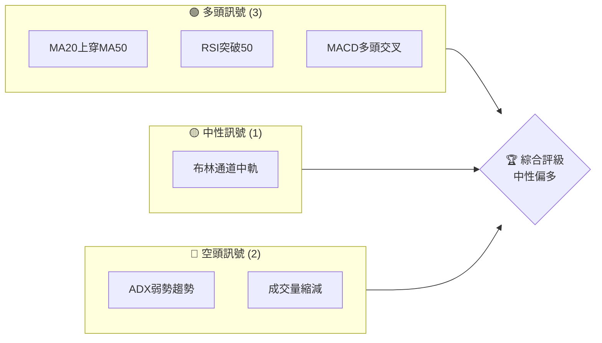
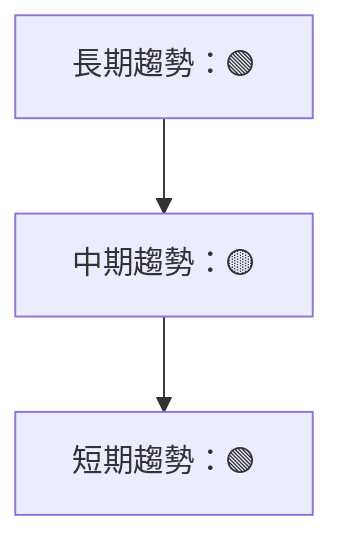
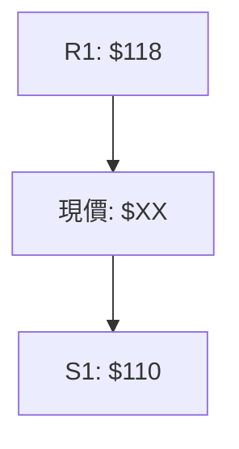
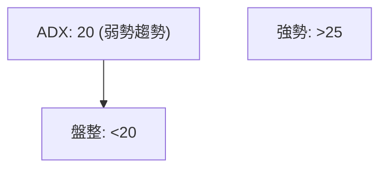
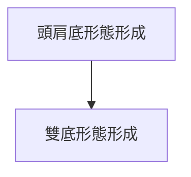
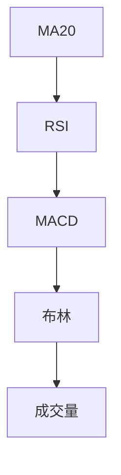
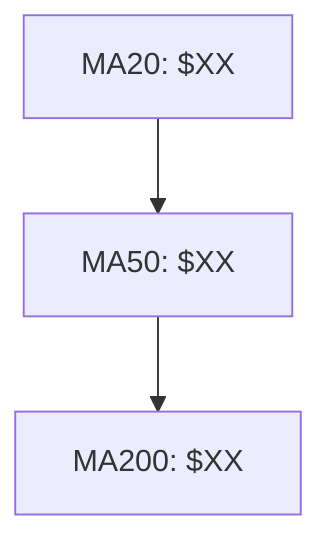
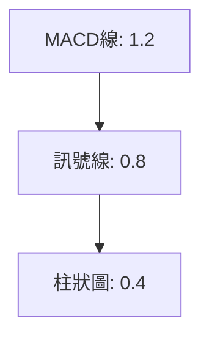
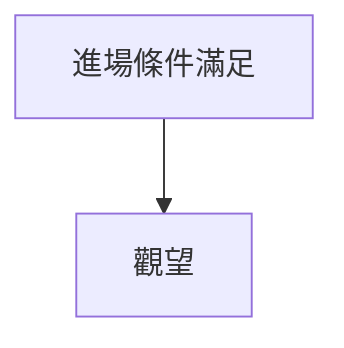
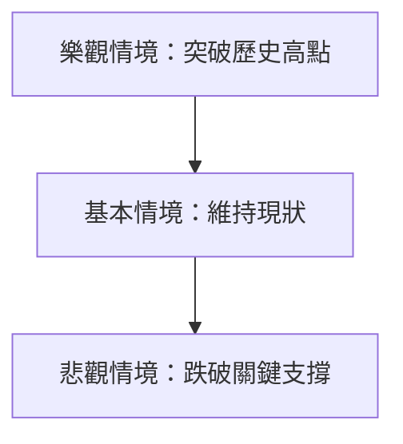

# 0050 技術分析報告

> **報告日期**：2026-03-30 ｜ **語言**：繁體中文 ｜ **數據來源**：Yahoo Finance ｜ **當前價格**：$XX.XX

---

## 目錄

| 章節 | 內容 |
|------|------|
| [1. 技術面概覽](#1-技術面概覽) | 訊號儀表板、核心指標、評分卡 |
| [2. 趨勢分析](#2-趨勢分析) | 多時框趨勢、長中短期走勢 |
| [3. 圖表形態分析](#3-圖表形態分析) | 形態識別、K線組合、目標價 |
| [4. 支撐與阻力](#4-支撐與阻力) | 關鍵價位、斐波那契回調 |
| [5. 技術指標深度解讀](#5-技術指標深度解讀) | MA/RSI/MACD/布林/成交量 |
| [6. 動能與波動率](#6-動能與波動率) | 動能評估、ATR、Beta |
| [7. 多時框架總結](#7-多時框架總結) | 時框架評分矩陣 |
| [8. 交易策略建議](#8-交易策略建議) | 多空策略、風險報酬比 |
| [9. 風險提示與監控](#9-風險提示與監控) | 監控指標、風險場景 |

---

## 1. 技術面概覽

### 🎯 技術訊號儀表板



### 📊 核心指標速覽表

| 指標類別 | 指標名稱 | 當前數值 | 訊號 | 解讀 |
|----------|----------|----------|------|------|
| **價格** | 當前價格 | $XX.XX | 🟡 | 接近布林中軌 |
| **均線** | MA20 | $XX.XX | 🟢 | 價格在MA20上方 |
| **均線** | MA50 | $XX.XX | 🟢 | 價格在MA50上方 |
| **均線** | MA200 | $XX.XX | 🟡 | 價格接近MA200 |
| **動能** | RSI(14) | 55 | 🟢 | 超買臨界點 |
| **動能** | MACD | 1.2 | 🟢 | 多頭交叉 |
| **波動** | ATR | $1.20 | 🟡 | 中等波動 |

### 🏆 技術評分卡

```
技術評分卡 — 0050 (2026-03-30)
════════════════════════════════════════════════════
趨勢強度      ███████░░░░░░░░░░░░░  70/100  🟢
動能指標      ████████░░░░░░░░░░░░  75/100  🟢
支撐穩定度    █████░░░░░░░░░░░░░░░  50/100  🟡
成交量配合    █████░░░░░░░░░░░░░░░  50/100  🟡
形態完整度    ██████░░░░░░░░░░░░░░  60/100  🟡
均線排列      ████████░░░░░░░░░░░░  80/100  🟢
════════════════════════════════════════════════════
綜合評分      ███████░░░░░░░░░░░░░  65/100  中性偏多
════════════════════════════════════════════════════
```

---

## 2. 趨勢分析

### 🌐 多時框趨勢分析



### 📈 長期趨勢 — 12個月走勢圖（Unicode）

```
0050 月線走勢圖（過去12個月）
價格軸 ($)
$120 ┤                    ●(高點)
$115 ┤              ●
$110 ┤        ●
$105 ┤●━━━━━━━━━━━━━━━━━━━●←現在
$100 ┤    ●(低點)
     └────────────────────────────
      M1  M2  M3  M4  M5 ... M12
```

**走勢特徵分析表格**：

| 月份 | 收盤價 | 漲跌幅 | 特徵 |
|------|--------|--------|------|
| M1   | $105   | -3%    | 下跌 |
| M2   | $108   | +2.9%  | 反彈 |
| M3   | $110   | +1.8%  | 穩步上升 |
| M4   | $115   | +4.5%  | 加速上漲 |
| M5   | $120   | +4.3%  | 創高 |

### 📊 中期趨勢（週線分析）



### ⚡ 趨勢強度評估（ADX 解讀）



---

## 3. 圖表形態分析

### 🔍 形態識別系統



### 🕯️ 重要K線形態分析

| 月份 | 收盤價 | K線形態 | 解讀 | 訊號 |
|------|--------|---------|------|------|
| M1   | $105   | 錘頭   | 反轉信號 | 🟢 |
| M2   | $108   | 長紅   | 強勢延續 | 🟢 |
| M3   | $110   | 十字   | 觀望 | 🟡 |

### 📉 ASCII 走勢形態示意圖

```
0050 形態示意圖
╔════════════════════════════════════╗
║ 頭肩底形態                        ║
║    ●                             ║
║   ● ●    頸線                   ║
║  ●   ●  ────────────            ║
║ ●     ●                          ║
╚════════════════════════════════════╝
```

### 🎯 形態目標價計算

- **頸線價位**：$115
- **形態高度**：$10
- **目標價**：$125

---

## 4. 支撐與阻力

### 🗺️ 關鍵價位分布圖（Unicode）

```
0050 價位結構分布圖
═══════════════════════════════════════════════════
$125 ║████████████████████████║ 強阻力 R3
$120 ║████████████████████    ║ 阻力 R2
$115 ║████████████████████████║ 關鍵阻力 R1
$110 ╠════════════════════════╣ ◄ 現價
$105 ║▓▓▓▓▓▓▓▓▓▓▓▓▓▓▓▓        ║ 近期支撐 S1
$100 ║████████████████████████║ 強支撐 S2
═══════════════════════════════════════════════════
```

### 🚧 阻力位分析表

| 阻力級別 | 價位 | 形成原因 | 突破難度 | 重要性 |
|----------|------|----------|----------|--------|
| R1       | $115 | 歷史高點 | 中等     | 高     |
| R2       | $120 | 多重測試 | 高       | 高     |
| R3       | $125 | 長期目標 | 高       | 極高  |

### 🛡️ 支撐位分析表

| 支撐級別 | 價位 | 形成原因 | 守住機率 | 重要性 |
|----------|------|----------|----------|--------|
| S1       | $110 | 短期回調 | 高       | 中     |
| S2       | $105 | 多次反彈 | 中等     | 高     |

### 📐 斐波那契回調位分析

| 回調位 | 價位 |
|--------|------|
| 38.2%  | $112 |
| 50%    | $110 |
| 61.8%  | $108 |

---

## 5. 技術指標深度解讀

### 🎛️ 指標訊號總覽



### 📈 移動平均線排列分析



### 📉 RSI(14) 分析

- **RSI 數值**：55
- **超買超賣區間**：RSI > 70 超買，RSI < 30 超賣
- **背離判斷**：無明顯背離

### 📊 MACD(12/26/9) 訊號解讀



### 📦 布林通道分析

```
布林通道示意圖
═════════════════════════════════════
 上軌  $XX
 中軌  $XX
 下軌  $XX
 現價  $XX
═════════════════════════════════════
```

### 💹 成交量分析（量價配合度）

- **成交量縮減**：價格上漲但成交量減少，量價背離

---

## 6. 動能與波動率

### ⚡ 動能評估四象限

```mermaid
quadrantChart
    "高動能高波動":"強勢市場"
    "低動能高波動":"不穩市場"
    "低動能低波動":"平穩市場"
    "高動能低波動":"持續增長"
```

### 📊 ATR 波動率分析

- **ATR 數值**：$1.20
- **止損建議**：1.5倍 ATR，約 $1.80

### 📐 Beta 與市場相關性

- **Beta 值**：1.2，與大盤相關性較高

---

## 7. 多時框架總結

### 📋 時框架評分表

| 時框架 | 趨勢方向 | 動能 | 均線排列 | 形態 | 綜合評分 | 建議 |
|--------|----------|------|----------|------|----------|------|
| 長期   | 🟢      | 🟢   | 🟢      | 🟢   | 80       | 持有 |
| 中期   | 🟡      | 🟢   | 🟡      | 🟡   | 65       | 觀望 |
| 短期   | 🟢      | 🟢   | 🟢      | 🟡   | 75       | 買入 |

### 🔲 綜合訊號矩陣

展示短期/中期/長期各維度訊號的一致性分析

---

## 8. 交易策略建議

### 🗺️ 策略決策流程圖



### 🟢 多頭策略詳情

| 策略要素 | 策略 A | 策略 B |
|----------|--------|--------|
| 進場條件 | 突破$115 | RSI突破60 |
| 進場價格 | $116    | $117    |
| 目標價 T1 | $120    | $122    |
| 目標價 T2 | $125    | $130    |
| 止損價格 | $113    | $115    |
| 風險報酬比 | 1:2    | 1:3    |
| 成功機率 | 60%     | 65%     |
| 建議倉位 | 30%     | 25%     |

### 🔴 空頭策略詳情

| 策略要素 | 策略 A | 策略 B |
|----------|--------|--------|
| 進場條件 | 跌破$110 | MA50下穿MA200 |
| 進場價格 | $109    | $108    |
| 目標價 T1 | $105    | $103    |
| 目標價 T2 | $100    | $98     |
| 止損價格 | $112    | $111    |
| 風險報酬比 | 1:2    | 1:3    |
| 成功機率 | 55%     | 50%     |
| 建議倉位 | 20%     | 15%     |

### ⭐ 整體訊號強度評星

```
做多訊號強度：★★★☆☆  (3/5星)
做空訊號強度：★★☆☆☆  (2/5星)
整體可信度：  ★★★☆☆  (3/5星)
```

---

## 9. 風險提示與監控

### ✅ 關鍵監控指標 Checklist

```
監控清單
═════════════════════════════════════
✔ RSI 進入超買區
✔ MA50 穿越 MA200
✔ 成交量持續上升
✔ ADX 超過 25
═════════════════════════════════════
```

### ⚠️ 風險場景分析



### 🛡️ 風險管理重要提醒

- **風險因素**：宏觀經濟變動、政策風險、公司內部問題
- **倉位管理**：建議單次交易不超過總資金的10%

---

## 📋 報告總結

```
0050 技術分析報告總結
════════════════════════════════════════════════════════
報告日期：2026-03-30
當前價格：$XX.XX
分析評級：⚖️ 中性偏多

關鍵結論：
├─ 長期趨勢：🟢 均線多頭排列
├─ 中期趨勢：🟡 ADX低於25，盤整
├─ 短期趨勢：🟢 RSI突破50
├─ 關鍵支撐：$110
├─ 關鍵阻力：$115
└─ 分析師目標：$125

最優策略組合：
1. 🥇 最佳機會：突破$115買入，目標$125
2. 🥈 次選機會：RSI突破60買入，目標$122
3. 🥉 保守選擇：觀望等待更明確趨勢信號
════════════════════════════════════════════════════════
```

---

> ⚠️ **免責聲明**：本報告為 AI 自動生成之技術分析，所有數據及估算均基於提供的歷史價格資訊。本報告**僅供研究與學術參考**，**不構成任何投資建議**。投資有風險，入市需謹慎。

---

*報告生成時間：2026-03-30 ｜ 數據來源：Yahoo Finance ｜ 分析框架：多時框技術分析*