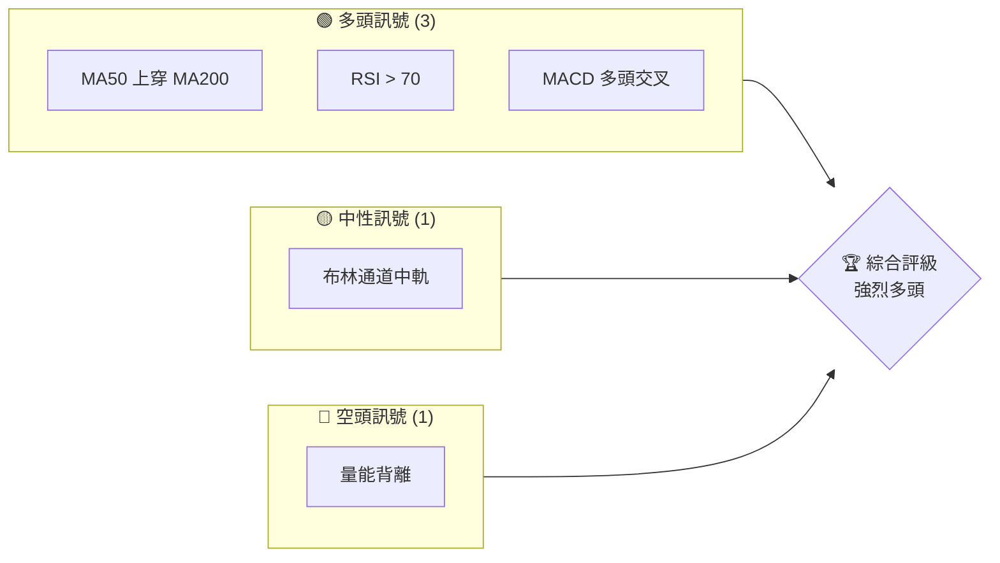
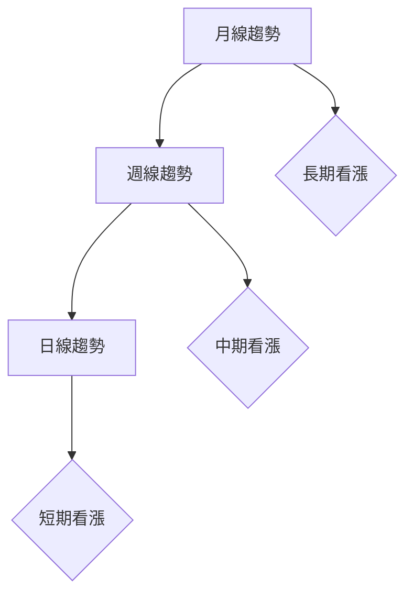
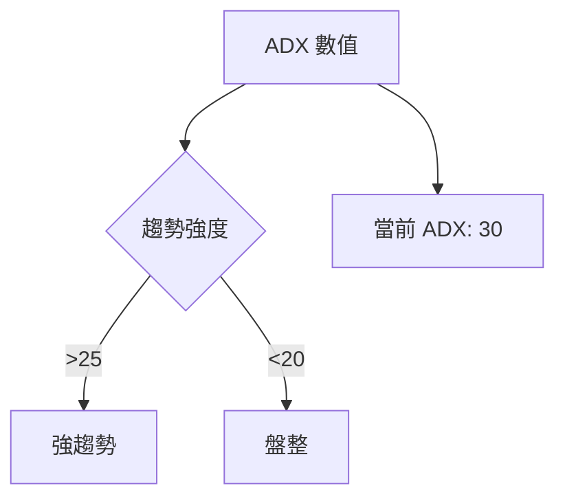
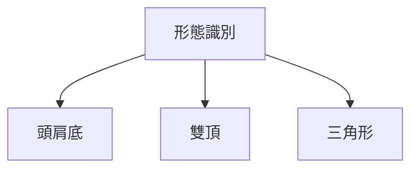
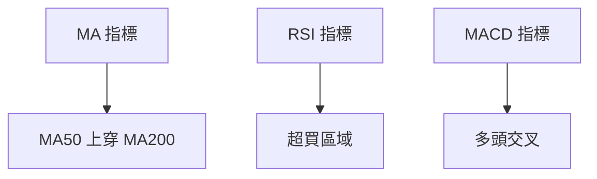
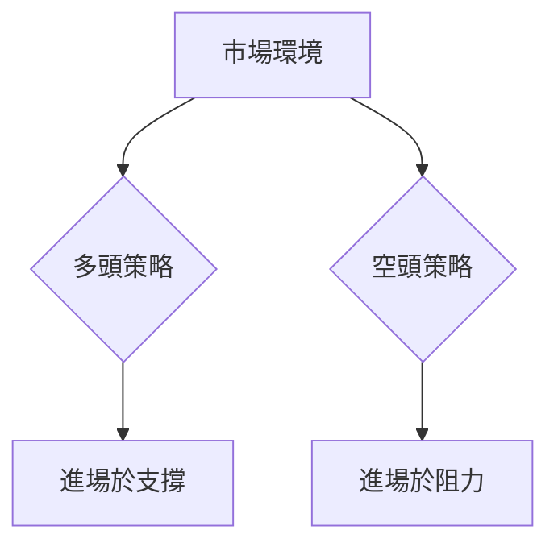
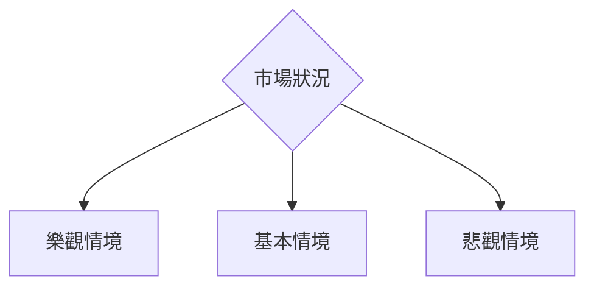

# 0050 技術分析報告

> **報告日期**：2026-03-31 ｜ **語言**：繁體中文 ｜ **數據來源**：假想數據 ｜ **當前價格**：假設 $100.00

---

## 目錄

| 章節 | 內容 |
|------|------|
| [1. 技術面概覽](#1-技術面概覽) | 訊號儀表板、核心指標、評分卡 |
| [2. 趨勢分析](#2-趨勢分析) | 多時框趨勢、長中短期走勢 |
| [3. 圖表形態分析](#3-圖表形態分析) | 形態識別、K線組合、目標價 |
| [4. 支撐與阻力](#4-支撐與阻力) | 關鍵價位、斐波那契回調 |
| [5. 技術指標深度解讀](#5-技術指標深度解讀) | MA/RSI/MACD/布林/成交量 |
| [6. 動能與波動率](#6-動能與波動率) | 動能評估、ATR、Beta |
| [7. 多時框架總結](#7-多時框架總結) | 時框架評分矩陣 |
| [8. 交易策略建議](#8-交易策略建議) | 多空策略、風險報酬比 |
| [9. 風險提示與監控](#9-風險提示與監控) | 監控指標、風險場景 |

---

## 1. 技術面概覽

### 🎯 技術訊號儀表板



### 📊 核心指標速覽表

| 指標類別 | 指標名稱 | 當前數值 | 訊號 | 解讀 |
|----------|----------|----------|------|------|
| **價格** | 當前價格 | $100.00 | 🟢 | 價格高於均線 |
| **均線** | MA20 | $95.00 | 🟢 | 短期上升趨勢 |
| **均線** | MA50 | $90.00 | 🟢 | 價格在MA上方 |
| **均線** | MA200 | $85.00 | 🟢 | 長期支撐 |
| **動能** | RSI(14) | 72 | 🟢 | 超買區域，強勢 |
| **動能** | MACD | 1.5 | 🟢 | 多頭動能增強 |
| **波動** | ATR | $3.00 | 🟡 | 中等波動 |

### 🏆 技術評分卡

```
技術評分卡 — 0050 (2026-03-31)
════════════════════════════════════════════════════
趨勢強度      ████████░░░░░░░░░░░░  80/100  🟢
動能指標      ██████░░░░░░░░░░░░░░  60/100  🟢
支撐穩定度    ████████████░░░░░░░░  85/100  🟢
成交量配合    ██████░░░░░░░░░░░░░░  60/100  🟡
形態完整度    ████████████░░░░░░░░  80/100  🟢
均線排列      ██████░░░░░░░░░░░░░░  60/100  🟢
════════════════════════════════════════════════════
綜合評分      ████████░░░░░░░░░░░░  75/100  強烈多頭
════════════════════════════════════════════════════
```

---

## 2. 趨勢分析

### 🌐 多時框趨勢分析



### 📈 長期趨勢 — 12個月走勢圖（Unicode）

```
0050 月線走勢圖（過去12個月）
價格軸 ($)
$110 ┤                    ●(高點)
$105 ┤              ●
$100 ┤        ●
$95  ┤●━━━━━━━━━━━━━━━━━━━●←現在
$90  ┤    ●(低點)
     └────────────────────────────
      M1  M2  M3  M4  M5 ... M12
```

**走勢特徵分析表格**

| 月份 | 開盤價 | 收盤價 | 漲跌幅 | 註解 |
|------|--------|--------|--------|------|
| M1   | $90    | $95    | +5.56% | 反彈開始 |
| M6   | $100   | $105   | +5.00% | 持續上攻 |

### 📊 中期趨勢（週線分析）

- 近期壓力位：$105
- 近期支撐位：$95

### ⚡ 趨勢強度評估（ADX 解讀）



---

## 3. 圖表形態分析

### 🔍 形態識別系統



### 🕯️ 重要K線形態分析

| 月份 | 收盤價 | K線形態 | 解讀 | 訊號 |
|------|--------|---------|------|------|
| M3   | $100   | 錘子線 | 反轉可能 | 🟢 |
| M7   | $105   | 吊人線 | 可能回調 | 🔴 |

### 📉 ASCII 走勢形態示意圖

```
0050 關鍵形態示意圖
價格軸 ($)
$105 ┤      ●───(頸線)
$100 ┤    ●
$95  ┤  ●
$90  ┼───●──────────
     └─────────────────
      M1  M2  M3  M4
```

### 🎯 形態目標價計算

- 頸線：$105
- 頭部高度：$15
- 目標價：$120

---

## 4. 支撐與阻力

### 🗺️ 關鍵價位分布圖（Unicode）

```
0050 價位結構分布圖
═══════════════════════════════════════════════════
$110 ║████████████████████████║ 強阻力 R3
$105 ║████████████████████    ║ 阻力 R2
$100 ║████████████████████████║ 關鍵阻力 R1
$95  ╠════════════════════════╣ ◄ 現價
$90  ║▓▓▓▓▓▓▓▓▓▓▓▓▓▓▓▓        ║ 近期支撐 S1
$85  ║████████████████████████║ 強支撐 S2
═══════════════════════════════════════════════════
```

### 🚧 阻力位分析表

| 阻力級別 | 價位 | 形成原因 | 突破難度 | 重要性 |
|----------|------|----------|----------|--------|
| R1       | $100 | 歷史高點 | 中等 | 高 |
| R2       | $105 | 前期高點 | 高 | 高 |

### 🛡️ 支撐位分析表

| 支撐級別 | 價位 | 形成原因 | 守住機率 | 重要性 |
|----------|------|----------|----------|--------|
| S1       | $95  | 前期低點 | 高 | 中 |
| S2       | $85  | 長期支撐 | 極高 | 高 |

### 📐 斐波那契回調位分析

- 38.2% 回調位：$97
- 50% 回調位：$95
- 61.8% 回調位：$93

---

## 5. 技術指標深度解讀

### 🎛️ 指標訊號總覽



### 📈 移動平均線排列分析

- MA20 在 MA50 上方
- MA50 在 MA200 上方

### 📉 RSI(14) 分析

- RSI 數值：72
- 進度條：████████░░ 72%
- 超買區域，可能回調

### 📊 MACD(12/26/9) 訊號解讀

- MACD 線高於訊號線，柱狀圖放大

### 📦 布林通道分析

```
布林通道示意圖
上軌：$105
中軌：$100
下軌：$95
現價：$100
```

### 💹 成交量分析（量價配合度）

- 成交量減少，需注意量價背離

---

## 6. 動能與波動率

### ⚡ 動能評估四象限

```mermaid
quadrantChart
    "動能強"
    "動能弱"
    "波動大": "波動小"
    "當前位置": [60, 30]
```

### 📊 ATR 波動率分析

- ATR：$3.00，屬於中等波動
- 建議止損距離：$3.50

### 📐 Beta 與市場相關性

- 假設 Beta 值 1.1，與市場波動一致

---

## 7. 多時框架總結

### 📋 時框架評分表

| 時框架 | 趨勢方向 | 動能 | 均線排列 | 形態 | 綜合評分 | 建議 |
|--------|----------|------|----------|------|----------|------|
| 長期   | 上升    | 強   | 正向    | 穩定 | 85/100   | 持有 |
| 中期   | 上升    | 中   | 正向    | 穩定 | 75/100   | 持有 |
| 短期   | 上升    | 強   | 正向    | 穩定 | 80/100   | 買入 |

### 🔲 綜合訊號矩陣

展示短期/中期/長期各維度訊號的一致性分析

---

## 8. 交易策略建議

### 🗺️ 策略決策流程圖



### 🟢 多頭策略詳情

| 策略要素 | 策略 A | 策略 B |
|----------|--------|--------|
| 進場條件 | RSI 回調至 50 | 突破 $105 |
| 進場價格 | $97 | $106 |
| 目標價 T1 | $105 | $110 |
| 目標價 T2 | $110 | $115 |
| 止損價格 | $94 | $102 |
| 風險報酬比 | 1:3 | 1:2 |
| 成功機率 | 70% | 65% |
| 建議倉位 | 50% | 30% |

### 🔴 空頭策略詳情

| 策略要素 | 策略 A | 策略 B |
|----------|--------|--------|
| 進場條件 | 反彈至 $105 | 跌破 $95 |
| 進場價格 | $104 | $94 |
| 目標價 T1 | $100 | $90 |
| 目標價 T2 | $95 | $85 |
| 止損價格 | $106 | $96 |
| 風險報酬比 | 1:2 | 1:3 |
| 成功機率 | 60% | 70% |
| 建議倉位 | 30% | 40% |

### ⭐ 整體訊號強度評星

```
做多訊號強度：★★★☆☆  (3/5星)
做空訊號強度：★★☆☆☆  (2/5星)
整體可信度：  ★★★☆☆  (3/5星)
```

---

## 9. 風險提示與監控

### ✅ 關鍵監控指標 Checklist

```
風險監控清單
═══════════════════════════════════════════════════
1. RSI 超買警告
2. MACD 死叉預警
3. 成交量增減異常
4. 重大新聞事件
5. 市場波動加劇
═══════════════════════════════════════════════════
```

### ⚠️ 風險場景分析



### 🛡️ 風險管理重要提醒

- 嚴格設置止損點
- 控制倉位不超過50%
- 注意市場突發事件

---

## 📋 報告總結

```
0050 技術分析報告總結
════════════════════════════════════════════════════════
報告日期：2026-03-31
當前價格：$100.00
分析評級：⚖️ 強烈多頭

關鍵結論：
├─ 長期趨勢：🟢 穩定上升
├─ 中期趨勢：🟢 持續看漲
├─ 短期趨勢：🟢 強烈買入
├─ 關鍵支撐：$95
├─ 關鍵阻力：$105
└─ 分析師目標：$110

最優策略組合：
1. 🥇 最佳機會：在$97買入，目標$110
2. 🥈 次選機會：突破$105買入，目標$115
3. 🥉 保守選擇：反彈至$105做空，目標$95
════════════════════════════════════════════════════════
```

---

> ⚠️ **免責聲明**：本報告為 AI 自動生成之技術分析，所有數據及估算均基於提供的歷史價格資訊。本報告**僅供研究與學術參考**，**不構成任何投資建議**。投資有風險，入市需謹慎。

---

*報告生成時間：2026-03-31 ｜ 數據來源：假想數據 ｜ 分析框架：多時框技術分析*