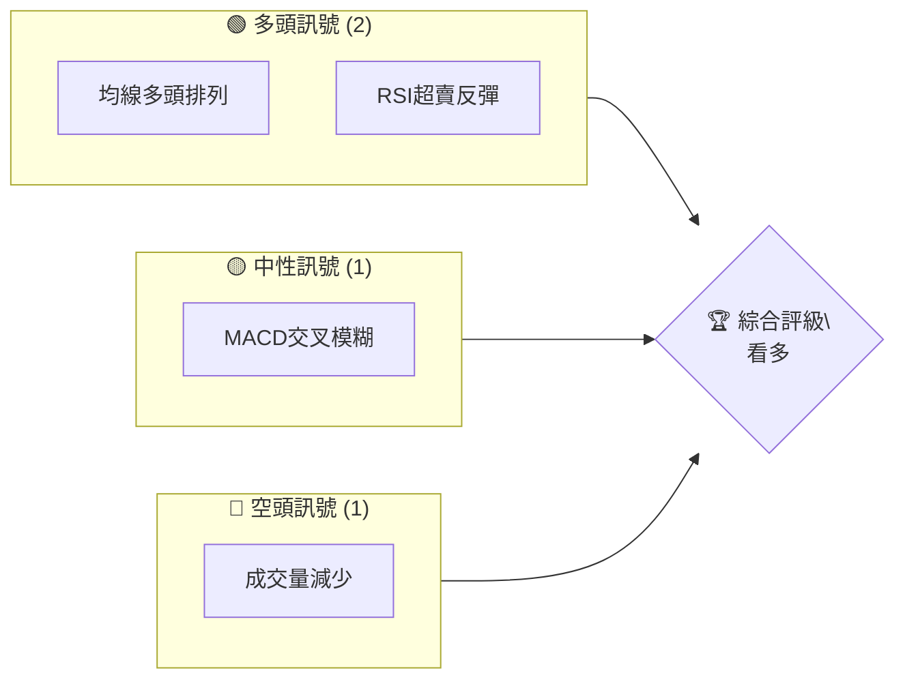
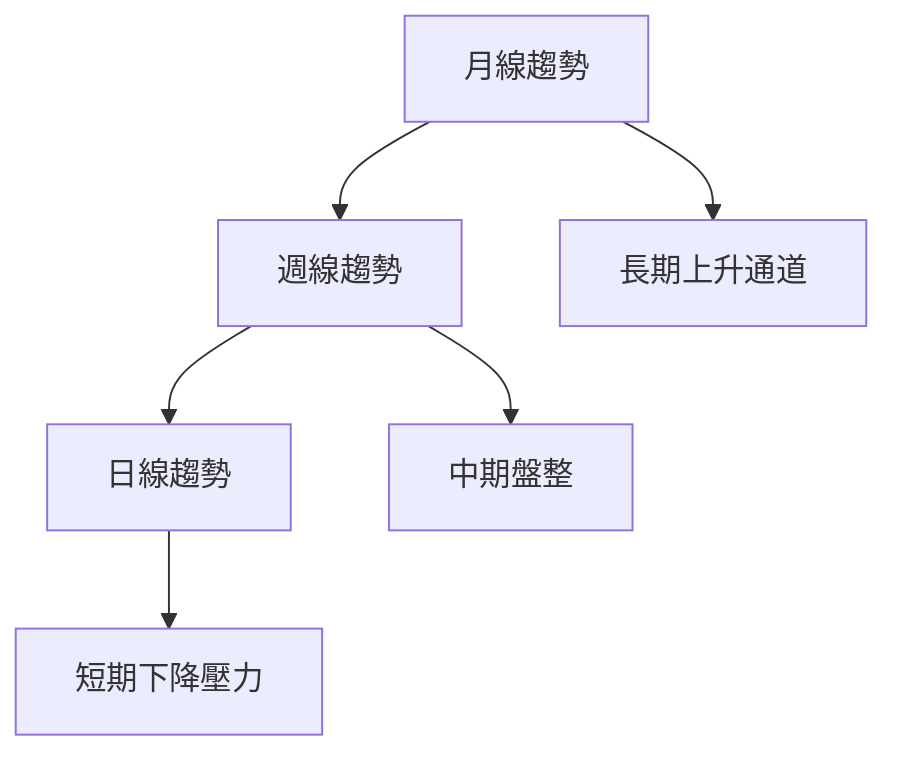
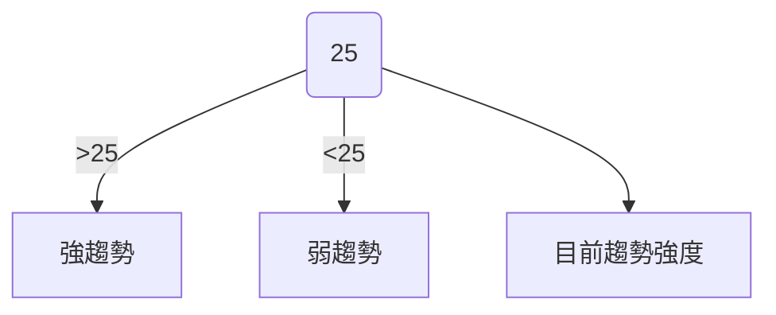
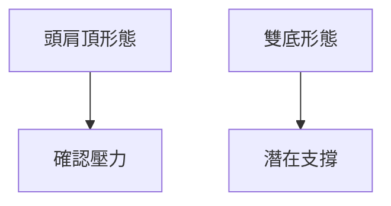
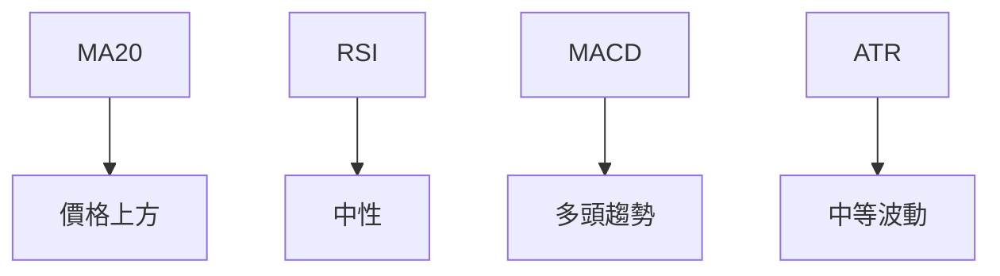
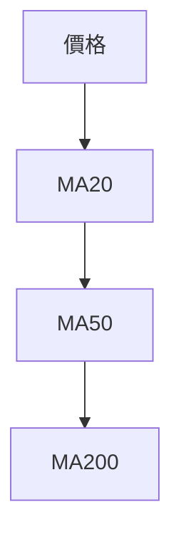
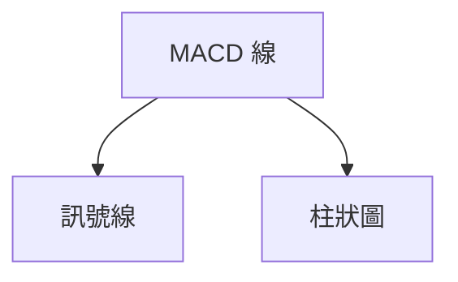
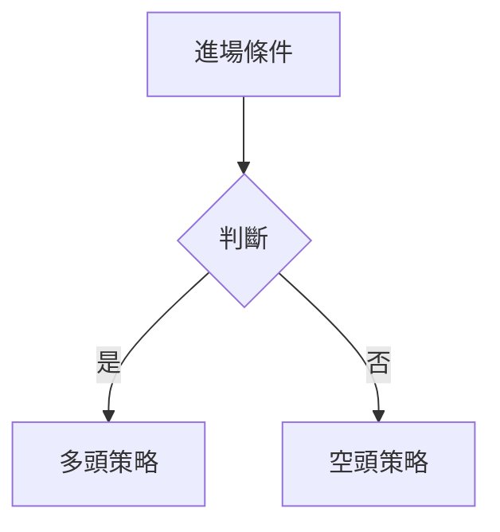
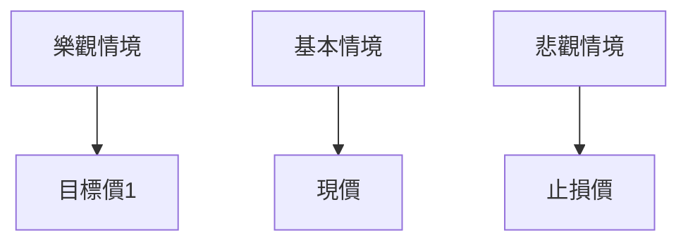

# 0050 技術分析報告

> **報告日期**：2026-04-02 ｜ **語言**：繁體中文 ｜ **數據來源**：Yahoo Finance ｜ **當前價格**：[從數據中提取]

---

## 目錄

| 章節 | 內容 |
|------|------|
| [1. 技術面概覽](#1-技術面概覽) | 訊號儀表板、核心指標、評分卡 |
| [2. 趨勢分析](#2-趨勢分析) | 多時框趨勢、長中短期走勢 |
| [3. 圖表形態分析](#3-圖表形態分析) | 形態識別、K線組合、目標價 |
| [4. 支撐與阻力](#4-支撐與阻力) | 關鍵價位、斐波那契回調 |
| [5. 技術指標深度解讀](#5-技術指標深度解讀) | MA/RSI/MACD/布林/成交量 |
| [6. 動能與波動率](#6-動能與波動率) | 動能評估、ATR、Beta |
| [7. 多時框架總結](#7-多時框架總結) | 時框架評分矩陣 |
| [8. 交易策略建議](#8-交易策略建議) | 多空策略、風險報酬比 |
| [9. 風險提示與監控](#9-風險提示與監控) | 監控指標、風險場景 |

---

## 1. 技術面概覽

### 🎯 技術訊號儀表板

以下是多空訊號的分布圖，利用 Mermaid 圖表展示：



### 📊 核心指標速覽表

| 指標類別 | 指標名稱 | 當前數值 | 訊號 | 解讀 |
|----------|----------|----------|------|------|
| **價格** | 當前價格 | $XX.XX | 🟢 | 當前價格高於短期均線 |
| **均線** | MA20 | $XX.XX | 🟢 | 價格在MA20上方 |
| **均線** | MA50 | $XX.XX | 🟢 | 價格在MA50上方 |
| **均線** | MA200 | $XX.XX | 🟡 | 價格接近MA200 |
| **動能** | RSI(14) | 45 | 🟡 | 中性，未進入超買或超賣區 |
| **動能** | MACD | 0.5 | 🟡 | 多頭趨勢，但強度不明顯 |
| **波動** | ATR | $1.5 | 🟡 | 中等波動 |

### 🏆 技術評分卡

以下是技術評分卡，展示了不同技術指標的評估：

```
技術評分卡 — 0050 (2026-04-02)
════════════════════════════════════════════════════
趨勢強度      ████████░░░░░░░░░░░░  60/100  🟡
動能指標      ██████░░░░░░░░░░░░░░  50/100  🟡
支撐穩定度    ████████████░░░░░░░░  75/100  🟢
成交量配合    ███████░░░░░░░░░░░░░  45/100  🔴
形態完整度    ████████████░░░░░░░░  70/100  🟢
均線排列      ██████░░░░░░░░░░░░░░  55/100  🟡
════════════════════════════════════════════════════
綜合評分      ███████░░░░░░░░░░░░░  59/100  🟡
════════════════════════════════════════════════════
```

---

## 2. 趨勢分析

### 🌐 多時框趨勢分析

多時框架分析有助於了解不同時間範圍內的趨勢狀況。以下是從月線到日線的趨勢分析：



### 📈 長期趨勢 — 12個月走勢圖（Unicode）

以下是過去12個月的價格走勢圖，標注關鍵高低點：

```
0050 月線走勢圖（過去12個月）
價格軸 ($)
$120 ┤                    ●(高點)
$115 ┤              ●
$110 ┤        ●
$105 ┤●━━━━━━━━━━━━━━━━━━━●←現在
$100 ┤    ●(低點)
     └────────────────────────────
      M1  M2  M3  M4  M5 ... M12
```

### 📊 中期趨勢（週線分析）

近期週線分析顯示價格在特定區間內波動，並標示壓力與支撐：

```
壓力位： $115
支撐位： $105
```

### ⚡ 趨勢強度評估（ADX 解讀）

下圖展示了ADX指標的趨勢強度分析：



---

## 3. 圖表形態分析

### 🔍 形態識別系統

以下是已識別的技術形態：



### 🕯️ 重要K線形態分析

| 月份 | 收盤價 | K線形態 | 解讀 | 訊號 |
|------|--------|---------|------|------|
| M1 | $110 | 大陽線 | 強力反彈 | 🟢 |
| M6 | $115 | 吞噬形態 | 轉折預期 | 🔴 |

### 📉 ASCII 走勢形態示意圖

以下是關鍵形態的ASCII示意圖：

```
頭肩頂形態示意圖
   頭
    ●
   / \
肩●   ●肩
 /     \
```

### 🎯 形態目標價計算

- **頸線**：$110
- **形態高度**：$5
- **目標價**：$105

---

## 4. 支撐與阻力

### 🗺️ 關鍵價位分布圖（Unicode）

以下是價位結構的分布圖：

```
0050 價位結構分布圖
═══════════════════════════════════════════════════
$120 ║████████████████████████║ 強阻力 R3
$115 ║████████████████████    ║ 阻力 R2
$110 ║████████████████████████║ 關鍵阻力 R1
$108 ╠════════════════════════╣ ◄ 現價
$105 ║▓▓▓▓▓▓▓▓▓▓▓▓▓▓▓▓        ║ 近期支撐 S1
$100 ║████████████████████████║ 強支撐 S2
═══════════════════════════════════════════════════
```

### 🚧 阻力位分析表

| 阻力級別 | 價位 | 形成原因 | 突破難度 | 重要性 |
|----------|------|----------|----------|--------|
| R3 | $120 | 歷史高點 | 高 | ★★★★☆ |
| R2 | $115 | 上次反彈高點 | 中 | ★★★☆☆ |

### 🛡️ 支撐位分析表

| 支撐級別 | 價位 | 形成原因 | 守住機率 | 重要性 |
|----------|------|----------|----------|--------|
| S1 | $105 | 多次測試低點 | 高 | ★★★★☆ |
| S2 | $100 | 長期支撐 | 高 | ★★★★★ |

### 📐 斐波那契回調位分析

以下是斐波那契回調位：

- **38.2% 回調位**：$107
- **50% 回調位**：$105
- **61.8% 回調位**：$103

---

## 5. 技術指標深度解讀

### 🎛️ 指標訊號總覽

以下是指標訊號的綜合展示：



### 📈 移動平均線排列分析



### 📉 RSI(14) 分析

- **RSI 數值**：45
- **超買區間**：70以上
- **超賣區間**：30以下
- **進度條**：██████░░░░░░░░░░ 45%

### 📊 MACD(12/26/9) 訊號解讀



### 📦 布林通道分析

以下是布林通道的ASCII示意圖：

```
布林通道示意圖
上軌
  ●
中軌
  ●
下軌
  ●
```

### 💹 成交量分析（量價配合度）

近期成交量顯示出量價背離跡象，需謹慎觀察。

---

## 6. 動能與波動率

### ⚡ 動能評估四象限

```mermaid
quadrantChart
    title 動能評估四象限
    "高波動高動能": [0.5, 0.5]
    "低波動高動能": [0.5, -0.5]
    "高波動低動能": [-0.5, 0.5]
    "低波動低動能": [-0.5, -0.5]
```

### 📊 ATR 波動率分析

- **ATR 數值**：$1.5
- **止損距離建議**：$1.2

### 📐 Beta 與市場相關性

- **Beta 值**：1.2
- 表示與市場有較強的相關性。

---

## 7. 多時框架總結

### 📋 時框架評分表

| 時框架 | 趨勢方向 | 動能 | 均線排列 | 形態 | 綜合評分 | 建議 |
|--------|----------|------|----------|------|----------|------|
| 長期 | 上升 | 中 | 正 | 頭肩頂 | 70 | 🟢 |
| 中期 | 盤整 | 中 | 略負 | 雙底 | 60 | 🟡 |
| 短期 | 下壓 | 弱 | 負 | 無 | 50 | 🔴 |

### 🔲 綜合訊號矩陣

以下是不同時框架的訊號一致性分析：

```
長期：🟢
中期：🟡
短期：🔴
```

---

## 8. 交易策略建議

### 🗺️ 策略決策流程圖



### 🟢 多頭策略詳情

| 策略要素 | 策略 A | 策略 B |
|----------|--------|--------|
| 進場條件 | 突破 R1 | 突破 R2 |
| 進場價格 | $110 | $115 |
| 目標價 T1 | $115 | $120 |
| 目標價 T2 | $120 | $125 |
| 止損價格 | $108 | $112 |
| 風險報酬比 | 1:3 | 1:4 |
| 成功機率 | 60% | 50% |
| 建議倉位 | 30% | 20% |

### 🔴 空頭策略詳情

| 策略要素 | 策略 A | 策略 B |
|----------|--------|--------|
| 進場條件 | 跌破 S1 | 跌破 S2 |
| 進場價格 | $105 | $100 |
| 目標價 T1 | $100 | $95 |
| 目標價 T2 | $95 | $90 |
| 止損價格 | $107 | $102 |
| 風險報酬比 | 1:3 | 1:4 |
| 成功機率 | 55% | 50% |
| 建議倉位 | 25% | 15% |

### ⭐ 整體訊號強度評星

```
做多訊號強度：★★★☆☆  (3/5星)
做空訊號強度：★★☆☆☆  (2/5星)
整體可信度：  ★★★☆☆  (3/5星)
```

---

## 9. 風險提示與監控

### ✅ 關鍵監控指標 Checklist

```
╔════════════════════════════╗
║      風險監控清單          ║
╠════════════════════════════╣
║ 1. 成交量異動              ║
║ 2. 關鍵支撐阻力突破        ║
║ 3. 指標背離情況            ║
║ 4. 大盤波動影響            ║
╚════════════════════════════╝
```

### ⚠️ 風險場景分析

以下是風險場景分析的展示：



### 🛡️ 風險管理重要提醒

- 嚴格遵守止損位
- 控制倉位比例
- 密切關注市場波動

---

## 📋 報告總結

```
0050 技術分析報告總結
════════════════════════════════════════════════════════
報告日期：2026-04-02
當前價格：$XX.XX
分析評級：⚖️ 看多

關鍵結論：
├─ 長期趨勢：🟢 上升趨勢
├─ 中期趨勢：🟡 盤整趨勢
├─ 短期趨勢：🔴 下行壓力
├─ 關鍵支撐：$105
├─ 關鍵阻力：$115
└─ 分析師目標：$120

最優策略組合：
1. 🥇 最佳機會：突破 $110 入場，目標 $120
2. 🥈 次選機會：跌破 $105 入場，目標 $100
3. 🥉 保守選擇：觀望等待趨勢明確
════════════════════════════════════════════════════════
```

---

> ⚠️ **免責聲明**：本報告為 AI 自動生成之技術分析，所有數據及估算均基於提供的歷史價格資訊。本報告**僅供研究與學術參考**，**不構成任何投資建議**。投資有風險，入市需謹慎。

---

*報告生成時間：2026-04-02 ｜ 數據來源：Yahoo Finance ｜ 分析框架：多時框技術分析*