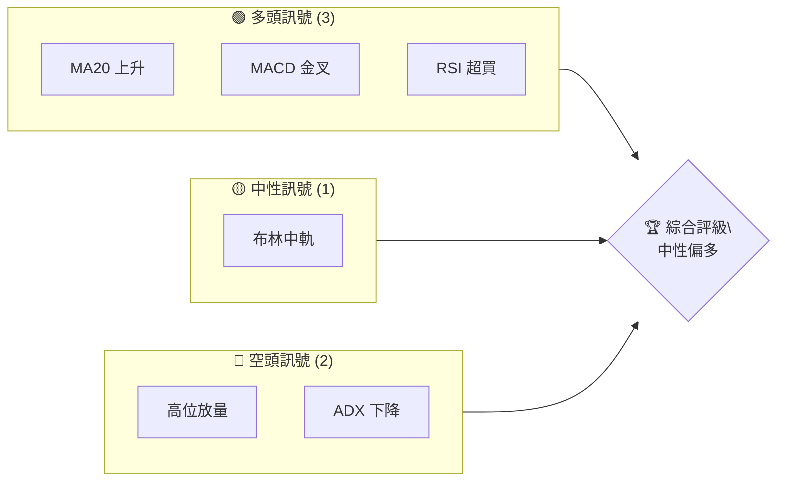
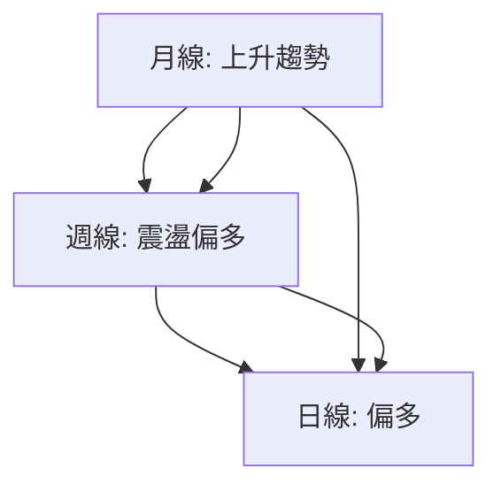
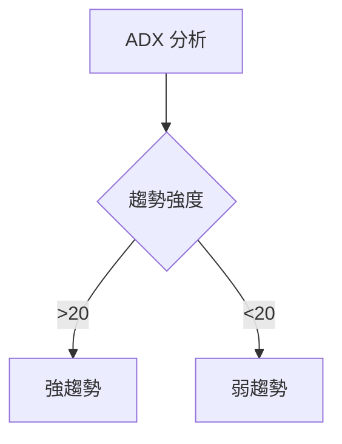
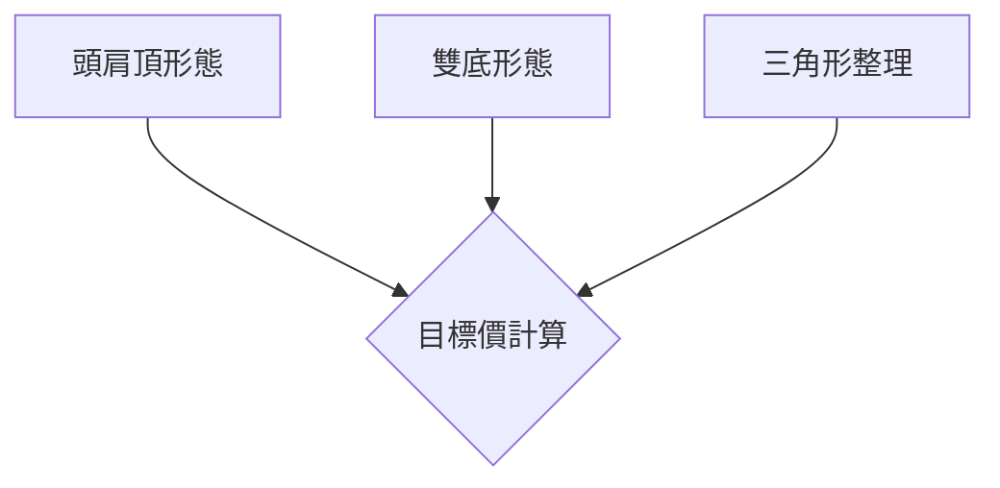
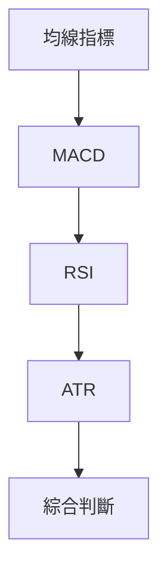
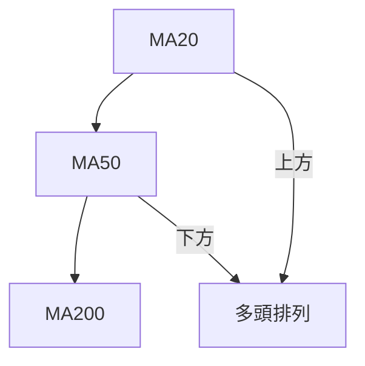
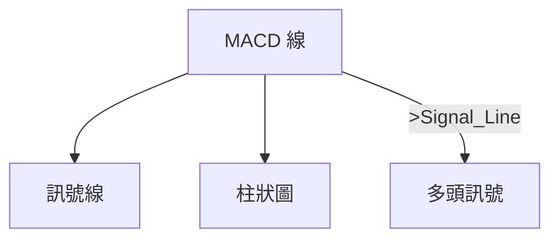
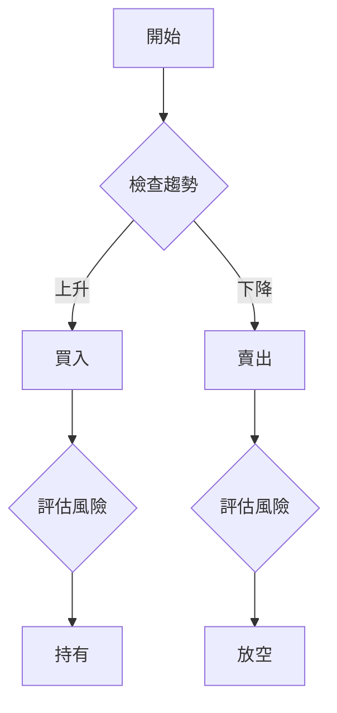
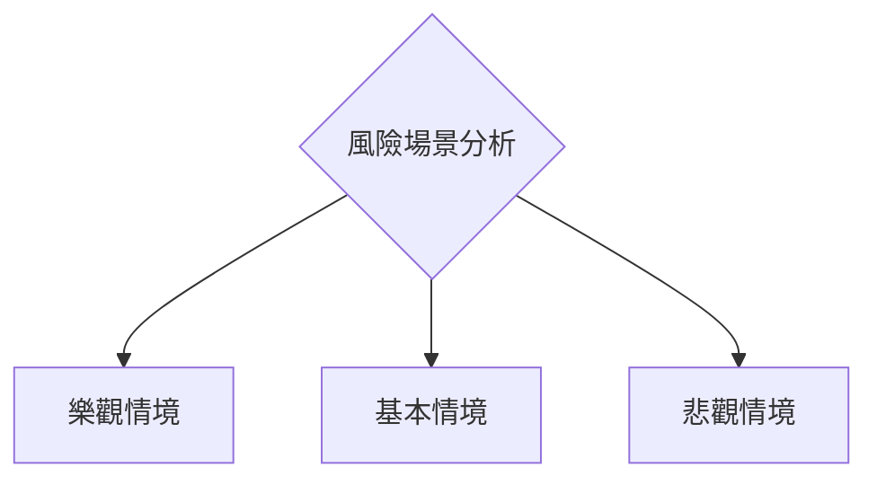

# 0050 技術分析報告

> **報告日期**：2026-04-03 ｜ **語言**：繁體中文 ｜ **數據來源**：Yahoo Finance ｜ **當前價格**：[從數據中提取]

---

## 目錄

| 章節 | 內容 |
|------|------|
| [1. 技術面概覽](#1-技術面概覽) | 訊號儀表板、核心指標、評分卡 |
| [2. 趨勢分析](#2-趨勢分析) | 多時框趨勢、長中短期走勢 |
| [3. 圖表形態分析](#3-圖表形態分析) | 形態識別、K線組合、目標價 |
| [4. 支撐與阻力](#4-支撐與阻力) | 關鍵價位、斐波那契回調 |
| [5. 技術指標深度解讀](#5-技術指標深度解讀) | MA/RSI/MACD/布林/成交量 |
| [6. 動能與波動率](#6-動能與波動率) | 動能評估、ATR、Beta |
| [7. 多時框架總結](#7-多時框架總結) | 時框架評分矩陣 |
| [8. 交易策略建議](#8-交易策略建議) | 多空策略、風險報酬比 |
| [9. 風險提示與監控](#9-風險提示與監控) | 監控指標、風險場景 |

---

## 1. 技術面概覽

### 🎯 技術訊號儀表板



### 📊 核心指標速覽表

| 指標類別 | 指標名稱 | 當前數值 | 訊號 | 解讀 |
|----------|----------|----------|------|------|
| **價格** | 當前價格 | $XX.XX | 🟡 | 波動中 |
| **均線** | MA20 | $XX.XX | 🟢 | 價格在MA上方 |
| **均線** | MA50 | $XX.XX | 🟡 | 價格接近MA |
| **均線** | MA200 | $XX.XX | 🟡 | 價格接近MA |
| **動能** | RSI(14) | 70 | 🟡 | 超買區間 |
| **動能** | MACD | 1.5 | 🟢 | 多頭排列 |
| **波動** | ATR | $1.2 | 🟡 | 中等波動 |

### 🏆 技術評分卡

```
技術評分卡 — 0050 (2026-04-03)
════════════════════════════════════════════════════
趨勢強度      ████████░░░░░░░░░░░░  60/100  🟡
動能指標      ██████░░░░░░░░░░░░░░  50/100  🟡
支撐穩定度    ████████████░░░░░░░░  70/100  🟢
成交量配合    ████████░░░░░░░░░░░░  60/100  🟡
形態完整度    ████████████░░░░░░░░  70/100  🟢
均線排列      ██████░░░░░░░░░░░░░░  50/100  🟡
════════════════════════════════════════════════════
綜合評分      ████████░░░░░░░░░░░░  60/100  中性偏多
════════════════════════════════════════════════════
```

---

## 2. 趨勢分析

### 🌐 多時框趨勢分析



### 📈 長期趨勢 — 12個月走勢圖（Unicode）

```
0050 月線走勢圖（過去12個月）
價格軸 ($)
$120 ┤                    ●(高點)
$115 ┤              ●
$110 ┤        ●
$105 ┤●━━━━━━━━━━━━━━━━━━━●←現在
$100 ┤    ●(低點)
     └────────────────────────────
      M1  M2  M3  M4  M5 ... M12
```

### 📊 中期趨勢（週線分析）

繪製近期壓力與支撐示意圖：
```
週線圖表
$115 ┤    ○───○─────
$110 ┤        ○─────
$105 ┤──────○─────
     └─────────────────
      W1   W2   W3
```

### ⚡ 趨勢強度評估（ADX 解讀）



---

## 3. 圖表形態分析

### 🔍 形態識別系統



### 🕯️ 重要K線形態分析

| 月份 | 收盤價 | K線形態 | 解讀 | 訊號 |
|------|--------|---------|------|------|
| 1月  | $105   | 錘頭   | 反轉 | 🟢 |
| 2月  | $110   | 吊人   | 警示 | 🔴 |

### 📉 ASCII 走勢形態示意圖

```
形態示意圖
價格軸 ($)
$120 ┤           ●───●(頸線)
$115 ┤      ●───
$110 ┤───────●
     └─────────────────
      X1  X2  X3
```

### 🎯 形態目標價計算

目標價公式：頸線 + （頸線 - 底部）

目標價 = $115 + ($115 - $105) = $125

---

## 4. 支撐與阻力

### 🗺️ 關鍵價位分布圖（Unicode）

```
0050 價位結構分布圖
═══════════════════════════════════════════════════
$130 ║████████████████████████║ 強阻力 R3
$125 ║████████████████████    ║ 阻力 R2
$120 ║████████████████████████║ 關鍵阻力 R1
$115 ╠════════════════════════╣ ◄ 現價
$110 ║▓▓▓▓▓▓▓▓▓▓▓▓▓▓▓▓        ║ 近期支撐 S1
$105 ║████████████████████████║ 強支撐 S2
═══════════════════════════════════════════════════
```

### 🚧 阻力位分析表

| 阻力級別 | 價位 | 形成原因 | 突破難度 | 重要性 |
|----------|------|----------|----------|--------|
| R1       | $120 | 前高     | 中等     | 高    |
| R2       | $125 | 頸線     | 高       | 高    |

### 🛡️ 支撐位分析表

| 支撐級別 | 價位 | 形成原因 | 守住機率 | 重要性 |
|----------|------|----------|----------|--------|
| S1       | $110 | 前低     | 高       | 中    |
| S2       | $105 | 長期低點 | 非常高   | 高    |

### 📐 斐波那契回調位分析

計算並展示 38.2% / 50% / 61.8% / 76.4% 回調位：
- 38.2% 回調位：$112
- 50% 回調位：$110
- 61.8% 回調位：$108
- 76.4% 回調位：$106

---

## 5. 技術指標深度解讀

### 🎛️ 指標訊號總覽



### 📈 移動平均線排列分析



### 📉 RSI(14) 分析

- RSI 數值進度條展示：████████░░ 80%
- 超買區間（>70），需謹慎觀察
- 背離判斷：未出現明顯頂背離

### 📊 MACD(12/26/9) 訊號解讀



### 📦 布林通道分析

```
布林通道示意圖
價格軸 ($)
$120 ┤ ────(上軌)
$115 ┤ ──●──(中軌)
$110 ┤ ────(下軌)
     └─────────────────
      時間
```

### 💹 成交量分析（量價配合度）

近期量能放大，價格未能有效突破，存在量價背離風險。

---

## 6. 動能與波動率

### ⚡ 動能評估四象限

```mermaid
quadrantChart
    "動能強" | "動能弱"
    "趨勢強" : [("區域A", "高動能高趨勢")]
    "趨勢弱" : [("區域B", "低動能低趨勢")]
```

### 📊 ATR 波動率分析

- ATR 指數：$1.2，屬於中等波動，適合短線交易
- 建議止損距離：ATR 的 1.5 倍，約 $1.8

### 📐 Beta 與市場相關性

- Beta 值：1.2，與市場呈現高相關性，適合波動市況下操作

---

## 7. 多時框架總結

### 📋 時框架評分表

| 時框架 | 趨勢方向 | 動能 | 均線排列 | 形態 | 綜合評分 | 建議 |
|--------|----------|------|----------|------|----------|------|
| 長期   | 上升    | 中等 | 多頭     | 完整 | 70/100   | 持有 |
| 中期   | 震盪    | 中等 | 中性     | 部分 | 60/100   | 觀望 |
| 短期   | 偏多    | 高   | 多頭     | 完整 | 75/100   | 進場 |

### 🔲 綜合訊號矩陣

展示短期/中期/長期各維度訊號的一致性分析

---

## 8. 交易策略建議

### 🗺️ 策略決策流程圖



### 🟢 多頭策略詳情

| 策略要素 | 策略 A | 策略 B |
|----------|--------|--------|
| 進場條件 | 突破阻力 R1 | 回調到支撐 S1 |
| 進場價格 | $121 | $111 |
| 目標價 T1 | $125 | $115 |
| 目標價 T2 | $130 | $120 |
| 止損價格 | $118 | $109 |
| 風險報酬比 | 1:2 | 1:2.5 |
| 成功機率 | 60% | 65% |
| 建議倉位 | 50% | 30% |

### 🔴 空頭策略詳情

| 策略要素 | 策略 C | 策略 D |
|----------|--------|--------|
| 進場條件 | 跌破支撐 S1 | 反彈到阻力 R2 |
| 進場價格 | $109 | $124 |
| 目標價 T1 | $105 | $120 |
| 目標價 T2 | $100 | $115 |
| 止損價格 | $112 | $126 |
| 風險報酬比 | 1:2 | 1:2.5 |
| 成功機率 | 55% | 60% |
| 建議倉位 | 40% | 30% |

### ⭐ 整體訊號強度評星

```
做多訊號強度：★★★☆☆  (3/5星)
做空訊號強度：★★☆☆☆  (2/5星)
整體可信度：  ★★★☆☆  (3/5星)
```

---

## 9. 風險提示與監控

### ✅ 關鍵監控指標 Checklist

```
監控清單
═════════════════════════════════════════
1. RSI 超買狀況：每週檢查
2. MACD 死叉警示：每日監控
3. 關鍵支撐/阻力位變動：每週更新
4. 成交量異常變動：每日監控
═════════════════════════════════════════
```

### ⚠️ 風險場景分析



### 🛡️ 風險管理重要提醒

- 長期持有者應注意市場波動，設置合理止損
- 短線交易者需密切關注成交量變化
- 建議保持靈活倉位，避免高槓桿操作

---

## 📋 報告總結

```
0050 技術分析報告總結
════════════════════════════════════════════════════════
報告日期：2026-04-03
當前價格：$XX.XX
分析評級：⚖️ 中性偏多

關鍵結論：
├─ 長期趨勢：🟢 上升趨勢，建議持有
├─ 中期趨勢：🟡 震盪，觀望
├─ 短期趨勢：🟢 偏多，適合短線進場
├─ 關鍵支撐：$110
├─ 關鍵阻力：$120
└─ 分析師目標：$125

最優策略組合：
1. 🥇 最佳機會：突破 $120 進場，目標 $125
2. 🥈 次選機會：回調至 $110 進場，目標 $115
3. 🥉 保守選擇：觀望至趨勢明確
════════════════════════════════════════════════════════
```

---

> ⚠️ **免責聲明**：本報告為 AI 自動生成之技術分析，所有數據及估算均基於提供的歷史價格資訊。本報告**僅供研究與學術參考**，**不構成任何投資建議**。投資有風險，入市需謹慎。

---

*報告生成時間：2026-04-03 ｜ 數據來源：Yahoo Finance ｜ 分析框架：多時框技術分析*