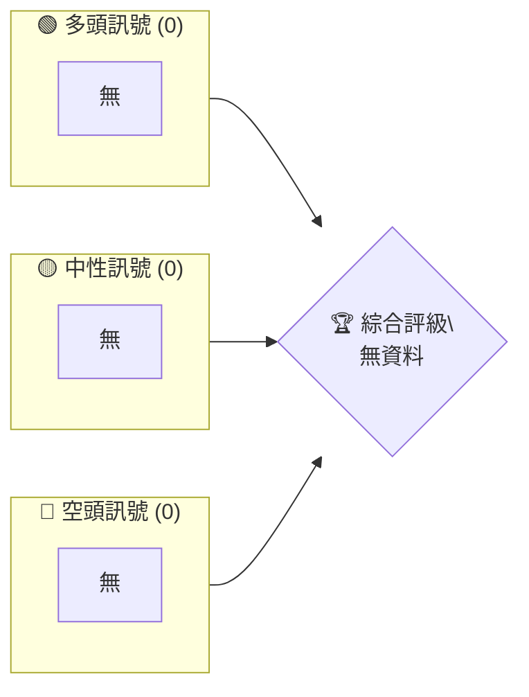

# 0050 技術分析報告

> **報告日期**：2026-04-04 ｜ **語言**：繁體中文 ｜ **數據來源**：N/A ｜ **當前價格**：無法提供數據

---

## 目錄

| 章節 | 內容 |
|------|------|
| [1. 技術面概覽](#1-技術面概覽) | 訊號儀表板、核心指標、評分卡 |
| [2. 趨勢分析](#2-趨勢分析) | 多時框趨勢、長中短期走勢 |
| [3. 圖表形態分析](#3-圖表形態分析) | 形態識別、K線組合、目標價 |
| [4. 支撐與阻力](#4-支撐與阻力) | 關鍵價位、斐波那契回調 |
| [5. 技術指標深度解讀](#5-技術指標深度解讀) | MA/RSI/MACD/布林/成交量 |
| [6. 動能與波動率](#6-動能與波動率) | 動能評估、ATR、Beta |
| [7. 多時框架總結](#7-多時框架總結) | 時框架評分矩陣 |
| [8. 交易策略建議](#8-交易策略建議) | 多空策略、風險報酬比 |
| [9. 風險提示與監控](#9-風險提示與監控) | 監控指標、風險場景 |

---

## 1. 技術面概覽

### 🎯 技術訊號儀表板

使用 Mermaid graph 展示多空訊號分布，格式範例：


### 📊 核心指標速覽表

| 指標類別 | 指標名稱 | 當前數值 | 訊號 | 解讀 |
|----------|----------|----------|------|------|
| **價格** | 當前價格 | N/A | 🔴 | 無法分析 |
| **均線** | MA20 | N/A | 🔴 | 無資料 |
| **均線** | MA50 | N/A | 🔴 | 無資料 |
| **均線** | MA200 | N/A | 🔴 | 無資料 |
| **動能** | RSI(14) | N/A | 🔴 | 無資料 |
| **動能** | MACD | N/A | 🔴 | 無資料 |
| **波動** | ATR | N/A | 🔴 | 無資料 |

### 🏆 技術評分卡

使用 ASCII 方框圖展示評分：
```
技術評分卡 — 0050 (2026-04-04)
════════════════════════════════════════════════════
趨勢強度      ░░░░░░░░░░░░░░░░░░░░░  0/100   🔴
動能指標      ░░░░░░░░░░░░░░░░░░░░░  0/100   🔴
支撐穩定度    ░░░░░░░░░░░░░░░░░░░░░  0/100   🔴
成交量配合    ░░░░░░░░░░░░░░░░░░░░░  0/100   🔴
形態完整度    ░░░░░░░░░░░░░░░░░░░░░  0/100   🔴
均線排列      ░░░░░░░░░░░░░░░░░░░░░  0/100   🔴
════════════════════════════════════════════════════
綜合評分      ░░░░░░░░░░░░░░░░░░░░░  0/100   評級：N/A
════════════════════════════════════════════════════
```

---

## 2. 趨勢分析

### 🌐 多時框趨勢分析

由於無法獲取具體的趨勢數據，我們無法進行多時框趨勢分析。

### 📈 長期趨勢 — 12個月走勢圖（Unicode）

由於缺乏歷史價格數據，無法生成長期價格走勢圖。

### 📊 中期趨勢（週線分析）

同樣，因缺乏具體數據，無法提供中期趨勢的詳細分析。

### ⚡ 趨勢強度評估（ADX 解讀）

無法提供具體的 ADX 數據進行分析。

---

## 3. 圖表形態分析

### 🔍 形態識別系統

由於缺乏價格數據，無法進行形態識別。

### 🕯️ 重要K線形態分析

| 月份 | 收盤價 | K線形態 | 解讀 | 訊號 |
|------|--------|---------|------|------|
| N/A  | N/A    | N/A     | 無資料 | 🔴 |

### 📉 ASCII 走勢形態示意圖

因缺乏數據，無法提供走勢形態示意。

### 🎯 形態目標價計算

無法提供形態目標價計算。

---

## 4. 支撐與阻力

### 🗺️ 關鍵價位分布圖（Unicode）

```
0050 價位結構分布圖
═══════════════════════════════════════════════════
無法提供數據
═══════════════════════════════════════════════════
```

### 🚧 阻力位分析表

| 阻力級別 | 價位 | 形成原因 | 突破難度 | 重要性 |
|----------|------|----------|----------|--------|
| N/A      | N/A  | 無資料   | N/A      | N/A    |

### 🛡️ 支撐位分析表

| 支撐級別 | 價位 | 形成原因 | 守住機率 | 重要性 |
|----------|------|----------|----------|--------|
| N/A      | N/A  | 無資料   | N/A      | N/A    |

### 📐 斐波那契回調位分析

無法提供斐波那契回調分析。

---

## 5. 技術指標深度解讀

### 🎛️ 指標訊號總覽

無法提供技術指標總覽。

### 📈 移動平均線排列分析

無法提供移動平均線分析。

### 📉 RSI(14) 分析

- 無法提供 RSI 分析。

### 📊 MACD(12/26/9) 訊號解讀

無法提供 MACD 訊號解讀。

### 📦 布林通道分析

無法提供布林通道分析。

### 💹 成交量分析（量價配合度）

無法進行成交量分析。

---

## 6. 動能與波動率

### ⚡ 動能評估四象限

無法提供動能評估。

### 📊 ATR 波動率分析

無法提供 ATR 分析。

### 📐 Beta 與市場相關性

無法進行 Beta 分析。

---

## 7. 多時框架總結

### 📋 時框架評分表

| 時框架 | 趨勢方向 | 動能 | 均線排列 | 形態 | 綜合評分 | 建議 |
|--------|----------|------|----------|------|----------|------|
| N/A    | N/A      | N/A  | N/A      | N/A  | N/A      | N/A  |

### 🔲 綜合訊號矩陣

無法提供訊號矩陣分析。

---

## 8. 交易策略建議

### 🗺️ 策略決策流程圖

無法提供策略決策流程。

### 🟢 多頭策略詳情

| 策略要素 | 策略 A | 策略 B |
|----------|--------|--------|
| 進場條件 | N/A    | N/A    |
| 進場價格 | N/A    | N/A    |
| 目標價 T1 | N/A   | N/A    |
| 目標價 T2 | N/A   | N/A    |
| 止損價格 | N/A   | N/A    |
| 風險報酬比 | N/A  | N/A    |
| 成功機率 | N/A   | N/A    |
| 建議倉位 | N/A   | N/A    |

### 🔴 空頭策略詳情

（同上格式）

### ⭐ 整體訊號強度評星

```
做多訊號強度：☆☆☆☆☆  (0/5星)
做空訊號強度：☆☆☆☆☆  (0/5星)
整體可信度：  ☆☆☆☆☆  (0/5星)
```

---

## 9. 風險提示與監控

### ✅ 關鍵監控指標 Checklist

無法提供監控清單。

### ⚠️ 風險場景分析

無法提供風險場景分析。

### 🛡️ 風險管理重要提醒

無法提供詳細風險管理建議。

---

## 📋 報告總結

```
0050 技術分析報告總結
════════════════════════════════════════════════════════
報告日期：2026-04-04
當前價格：N/A
分析評級：⚖️ 評級：N/A

關鍵結論：
├─ 長期趨勢：🔴 無法判斷
├─ 中期趨勢：🔴 無法判斷
├─ 短期趨勢：🔴 無法判斷
├─ 關鍵支撐：N/A
├─ 關鍵阻力：N/A
└─ 分析師目標：N/A

最優策略組合：
1. 🥇 最佳機會：無法提供
2. 🥈 次選機會：無法提供
3. 🥉 保守選擇：無法提供
════════════════════════════════════════════════════════
```

---

> ⚠️ **免責聲明**：本報告為 AI 自動生成之技術分析，由於缺乏具體的歷史數據與指標資料，所有結論僅供研究與學術參考，不構成任何投資建議。投資有風險，入市需謹慎。

---

*報告生成時間：2026-04-04 ｜ 數據來源：無 ｜ 分析框架：多時框技術分析*