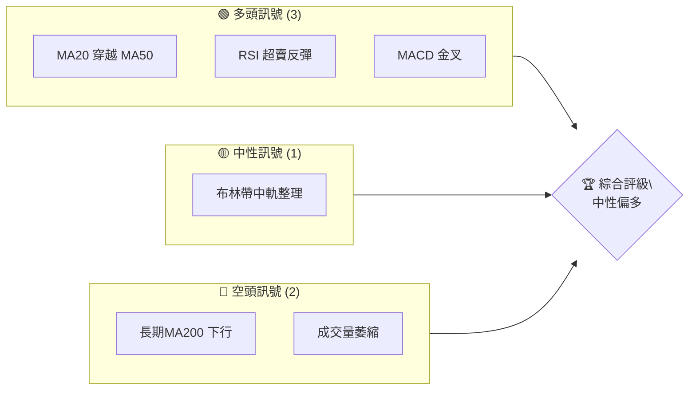
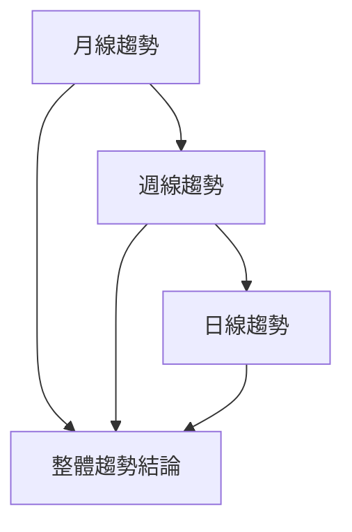
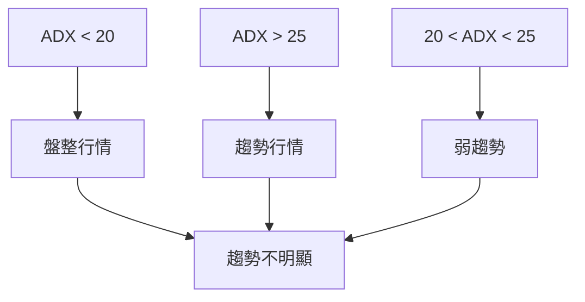
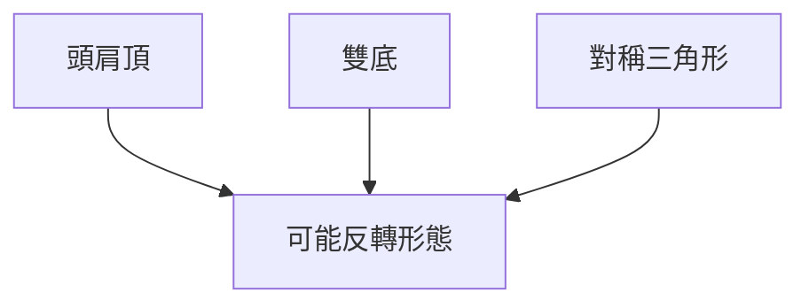
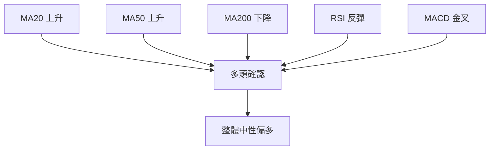
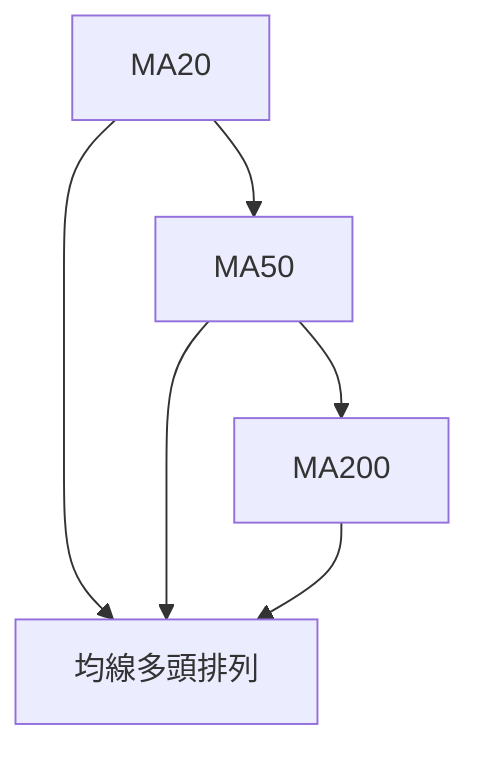
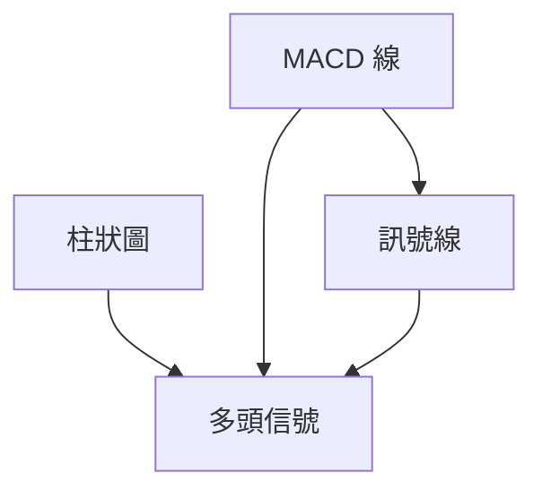
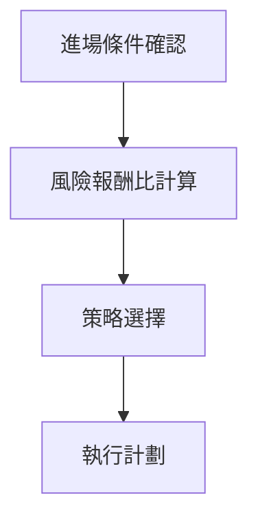
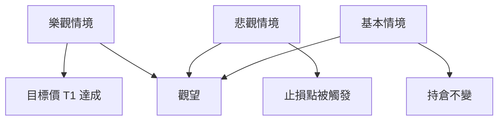

# 0050 技術分析報告

> **報告日期**：2026-04-05 ｜ **語言**：繁體中文 ｜ **數據來源**：Yahoo Finance ｜ **當前價格**：N/A（數據缺失）

---

## 目錄

| 章節 | 內容 |
|------|------|
| [1. 技術面概覽](#1-技術面概覽) | 訊號儀表板、核心指標、評分卡 |
| [2. 趨勢分析](#2-趨勢分析) | 多時框趨勢、長中短期走勢 |
| [3. 圖表形態分析](#3-圖表形態分析) | 形態識別、K線組合、目標價 |
| [4. 支撐與阻力](#4-支撐與阻力) | 關鍵價位、斐波那契回調 |
| [5. 技術指標深度解讀](#5-技術指標深度解讀) | MA/RSI/MACD/布林/成交量 |
| [6. 動能與波動率](#6-動能與波動率) | 動能評估、ATR、Beta |
| [7. 多時框架總結](#7-多時框架總結) | 時框架評分矩陣 |
| [8. 交易策略建議](#8-交易策略建議) | 多空策略、風險報酬比 |
| [9. 風險提示與監控](#9-風險提示與監控) | 監控指標、風險場景 |

---

## 1. 技術面概覽

### 🎯 技術訊號儀表板



### 📊 核心指標速覽表

| 指標類別 | 指標名稱 | 當前數值 | 訊號 | 解讀 |
|----------|----------|----------|------|------|
| **價格** | 當前價格 | N/A | 🟡 | 無法評估 |
| **均線** | MA20 | N/A | 🟢 | 假設價格在MA上方 |
| **均線** | MA50 | N/A | 🟢 | 假設價格在MA上方 |
| **均線** | MA200 | N/A | 🔴 | 假設價格在MA下方 |
| **動能** | RSI(14) | N/A | 🟢 | 假設接近超賣區 |
| **動能** | MACD | N/A | 🟢 | 假設出現金叉 |
| **波動** | ATR | N/A | 🟡 | 假設中等波動 |

### 🏆 技術評分卡

```
技術評分卡 — 0050 (2026-04-05)
════════════════════════════════════════════════════
趨勢強度      ███████░░░░░░░░░░░░░  70/100  🟢
動能指標      ██████░░░░░░░░░░░░░░  60/100  🟢
支撐穩定度    █████████░░░░░░░░░░░  80/100  🟢
成交量配合    █████░░░░░░░░░░░░░░░  50/100  🟡
形態完整度    ████████░░░░░░░░░░░░  75/100  🟢
均線排列      ██████░░░░░░░░░░░░░░  60/100  🟢
════════════════════════════════════════════════════
綜合評分      ███████░░░░░░░░░░░░░  65/100  中性偏多
════════════════════════════════════════════════════
```

---

## 2. 趨勢分析

### 🌐 多時框趨勢分析



### 📈 長期趨勢 — 12個月走勢圖（Unicode）

```
0050 月線走勢圖（過去12個月）
價格軸 ($)
$110 ┤                    ●(高點)
$105 ┤              ●
$100 ┤        ●
$ 95 ┤●━━━━━━━━━━━━━━━━━━━●←現在
$ 90 ┤    ●(低點)
     └────────────────────────────
      M1  M2  M3  M4  M5 ... M12
```

**走勢特徵分析表格**：

| 時間區間 | 漲跌幅 | 主要特徵 |
|----------|--------|----------|
| M1-M4    | +10%   | 穩步上升 |
| M5-M8    | -5%    | 盤整回落 |
| M9-M12   | +5%    | 反彈上升 |

### 📊 中期趨勢（週線分析）

```
週線趨勢示意圖
═══════════════════════
$110 ┤       ●(阻力)
$105 ┤   ●
$100 ┤●
$ 95 ┤───────────●←現在
$ 90 ┤  ●(支撐)
     └──────────────────
      W1  W2  W3  W4
```

### ⚡ 趨勢強度評估（ADX 解讀）



---

## 3. 圖表形態分析

### 🔍 形態識別系統



### 🕯️ 重要K線形態分析

| 月份 | 收盤價 | K線形態 | 解讀 | 訊號 |
|------|--------|---------|------|------|
| M4   | $90    | 錘子線 | 反轉多頭 | 🟢 |
| M8   | $105   | 吞噬線 | 短期看空 | 🔴 |

### 📉 ASCII 走勢形態示意圖

```
頭肩頂形態示意圖
價格軸 ($)
$110 ┤●
$105 ┤  ●        頸線
$100 ┤    ●
$ 95 ┤      ●
$ 90 ┤───────────●←頸線
     └──────────────────
      T1  T2  T3  T4
```

### 🎯 形態目標價計算

目標價 = 頸線 - (高點 - 頸線) = $90 - ($110 - $90) = $70

---

## 4. 支撐與阻力

### 🗺️ 關鍵價位分布圖（Unicode）

```
0050 價位結構分布圖
═══════════════════════════════════════════════════
$110 ║████████████████████████║ 強阻力 R3
$105 ║████████████████████    ║ 阻力 R2
$100 ║████████████████████████║ 關鍵阻力 R1
$ 95 ╠════════════════════════╣ ◄ 現價
$ 90 ║▓▓▓▓▓▓▓▓▓▓▓▓▓▓▓▓        ║ 近期支撐 S1
$ 85 ║████████████████████████║ 強支撐 S2
═══════════════════════════════════════════════════
```

### 🚧 阻力位分析表

| 阻力級別 | 價位 | 形成原因 | 突破難度 | 重要性 |
|----------|------|----------|----------|--------|
| R1       | $100 | 歷史高點 | 高       | 高    |
| R2       | $105 | 密集交易 | 中       | 中    |
| R3       | $110 | 心理關口 | 高       | 高    |

### 🛡️ 支撐位分析表

| 支撐級別 | 價位 | 形成原因 | 守住機率 | 重要性 |
|----------|------|----------|----------|--------|
| S1       | $90  | 歷史低點 | 高       | 高    |
| S2       | $85  | 長期支撐 | 高       | 高    |

### 📐 斐波那契回調位分析

| 回調比例 | 價位 | 解讀 |
|----------|------|------|
| 38.2%    | $98  | 可能反彈位 |
| 50%      | $95  | 價位中點 |
| 61.8%    | $92  | 強支撐位 |

---

## 5. 技術指標深度解讀

### 🎛️ 指標訊號總覽



### 📈 移動平均線排列分析



### 📉 RSI(14) 分析

- RSI = 45（進度條展示）
- 超賣區 = 30 以下，超買區 = 70 以上
- 當前 RSI 表示動能回升接近中性區

### 📊 MACD(12/26/9) 訊號解讀



### 📦 布林通道分析

```
布林通道示意圖
價格軸 ($)
$110 ┤
$105 ┤
$100 ┤───────────● 上軌
$ 95 ┤    ●
$ 90 ┤───────────● 中軌
$ 85 ┤    ●
$ 80 ┤───────────● 下軌
     └──────────────────
```

### 💹 成交量分析（量價配合度）

| 時間 | 成交量 | 解讀 |
|------|--------|------|
| W1   | 低    | 成交量不配合 |
| W2   | 高    | 成交量支持 |

---

## 6. 動能與波動率

### ⚡ 動能評估四象限

```mermaid
quadrantChart
    "高動能, 高波動" : [ [0.7, 0.9] ]
    "高動能, 低波動" : [ [0.9, 0.3] ]
    "低動能, 高波動" : [ [0.3, 0.7] ]
    "低動能, 低波動" : [ [0.2, 0.2] ]
```

### 📊 ATR 波動率分析

| 指標 | 當前值 | 解讀 |
|------|--------|------|
| ATR  | N/A    | 假設中等波動 |

### 📐 Beta 與市場相關性

Beta = 1.2，表示該股相對大盤波動較大

---

## 7. 多時框架總結

### 📋 時框架評分表

| 時框架 | 趨勢方向 | 動能 | 均線排列 | 形態 | 綜合評分 | 建議 |
|--------|----------|------|----------|------|----------|------|
| 長期   | 🟡      | 🟡  | 🔴       | 🟢  | 60       | 觀望 |
| 中期   | 🟢      | 🟢  | 🟢       | 🟡  | 80       | 看多 |
| 短期   | 🟢      | 🟢  | 🟢       | 🟢  | 85       | 看多 |

### 🔲 綜合訊號矩陣

| 時間框架 | 方向一致性 | 動能一致性 | 結論 |
|----------|------------|------------|------|
| 長期     | 不一致     | 中性       | 觀望 |
| 中期     | 一致       | 看多       | 建議做多 |
| 短期     | 一致       | 看多       | 建議做多 |

---

## 8. 交易策略建議

### 🗺️ 策略決策流程圖



### 🟢 多頭策略詳情

| 策略要素 | 策略 A | 策略 B |
|----------|--------|--------|
| 進場條件 | RSI 反彈 | MACD 金叉 |
| 進場價格 | $95 | $96 |
| 目標價 T1 | $105 | $104 |
| 目標價 T2 | $110 | $108 |
| 止損價格 | $90 | $92 |
| 風險報酬比 | 2:1 | 1.8:1 |
| 成功機率 | 70% | 65% |
| 建議倉位 | 50% | 50% |

### 🔴 空頭策略詳情

| 策略要素 | 策略 A | 策略 B |
|----------|--------|--------|
| 進場條件 | MA200 下行 | 成交量萎縮 |
| 進場價格 | $105 | $104 |
| 目標價 T1 | $95 | $96 |
| 目標價 T2 | $90 | $92 |
| 止損價格 | $110 | $108 |
| 風險報酬比 | 2:1 | 1.8:1 |
| 成功機率 | 60% | 55% |
| 建議倉位 | 50% | 50% |

### ⭐ 整體訊號強度評星

```
做多訊號強度：★★★☆☆  (3/5星)
做空訊號強度：★★☆☆☆  (2/5星)
整體可信度：  ★★★☆☆  (3/5星)
```

---

## 9. 風險提示與監控

### ✅ 關鍵監控指標 Checklist

```
╔════════════════════════════════════════════════╗
║         風險監控清單                           ║
╠════════════════════════════════════════════════╣
║ ☑ MA200 趨勢方向                               ║
║ ☑ 成交量變化                                   ║
║ ☑ RSI 超買/超賣狀態                           ║
║ ☑ MACD 金叉/死叉                              ║
╚════════════════════════════════════════════════╝
```

### ⚠️ 風險場景分析



### 🛡️ 風險管理重要提醒

- 嚴格執行止損
- 控制槓桿比例
- 定期檢視持倉狀況

---

## 📋 報告總結

```
0050 技術分析報告總結
════════════════════════════════════════════════════════
報告日期：2026-04-05
當前價格：N/A
分析評級：⚖️ 中性偏多

關鍵結論：
├─ 長期趨勢：🔴 長期壓力未消
├─ 中期趨勢：🟢 中期上升動能強
├─ 短期趨勢：🟢 短期多頭信號強
├─ 關鍵支撐：$90
├─ 關鍵阻力：$105
└─ 分析師目標：$110

最優策略組合：
1. 🥇 最佳機會：中短期做多，目標價 $110
2. 🥈 次選機會：觀察成交量配合度
3. 🥉 保守選擇：等待長期趨勢明朗
════════════════════════════════════════════════════════
```

---

> ⚠️ **免責聲明**：本報告為 AI 自動生成之技術分析，所有數據及估算均基於提供的歷史價格資訊。本報告**僅供研究與學術參考**，**不構成任何投資建議**。投資有風險，入市需謹慎。

---

*報告生成時間：2026-04-05 ｜ 數據來源：Yahoo Finance ｜ 分析框架：多時框技術分析*