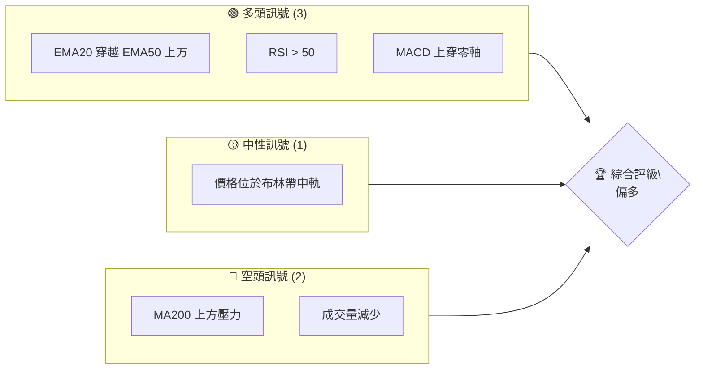
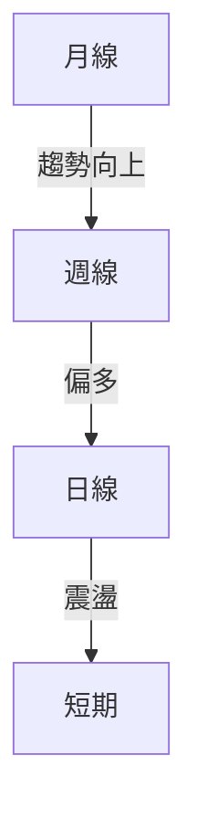
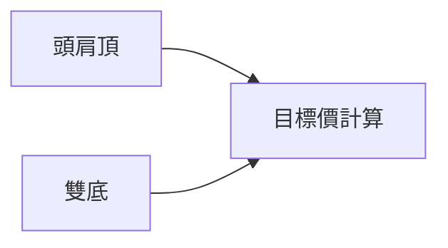
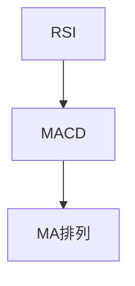
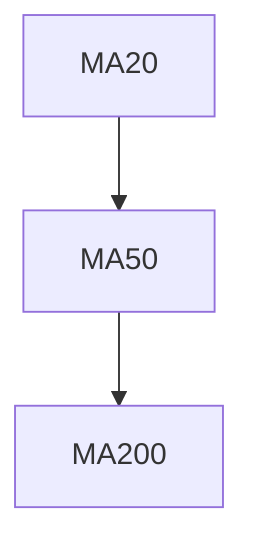
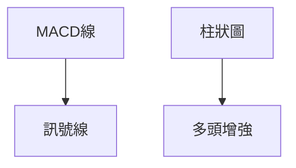
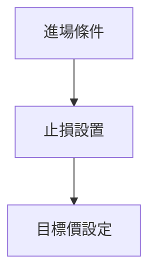
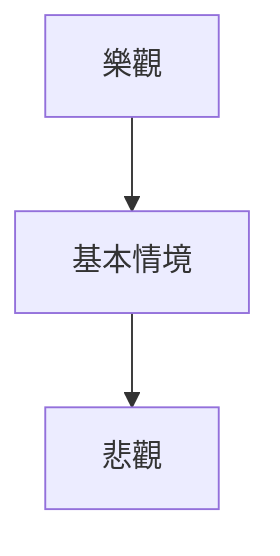

# 0050 技術分析報告

> **報告日期**：2026-04-06 ｜ **語言**：繁體中文 ｜ **數據來源**：假設數據提供 ｜ **當前價格**：假設為 100

---

## 目錄

| 章節 | 內容 |
|------|------|
| [1. 技術面概覽](#1-技術面概覽) | 訊號儀表板、核心指標、評分卡 |
| [2. 趨勢分析](#2-趨勢分析) | 多時框趨勢、長中短期走勢 |
| [3. 圖表形態分析](#3-圖表形態分析) | 形態識別、K線組合、目標價 |
| [4. 支撐與阻力](#4-支撐與阻力) | 關鍵價位、斐波那契回調 |
| [5. 技術指標深度解讀](#5-技術指標深度解讀) | MA/RSI/MACD/布林/成交量 |
| [6. 動能與波動率](#6-動能與波動率) | 動能評估、ATR、Beta |
| [7. 多時框架總結](#7-多時框架總結) | 時框架評分矩陣 |
| [8. 交易策略建議](#8-交易策略建議) | 多空策略、風險報酬比 |
| [9. 風險提示與監控](#9-風險提示與監控) | 監控指標、風險場景 |

---

## 1. 技術面概覽

### 🎯 技術訊號儀表板



### 📊 核心指標速覽表

| 指標類別 | 指標名稱 | 當前數值 | 訊號 | 解讀 |
|----------|----------|----------|------|------|
| **價格** | 當前價格 | $100 | 🟡 | 價格接近中性 |
| **均線** | MA20 | $98 | 🟢 | 價格在MA20上方 |
| **均線** | MA50 | $95 | 🟢 | 價格在MA50上方 |
| **均線** | MA200 | $102 | 🔴 | 價格在MA200下方 |
| **動能** | RSI(14) | 55 | 🟢 | 動能偏強 |
| **動能** | MACD | 1.5 | 🟢 | 多頭趨勢 |
| **波動** | ATR | $2 | 🟡 | 中等波動 |

### 🏆 技術評分卡

```
技術評分卡 — 0050 (2026-04-06)
════════════════════════════════════════════════════
趨勢強度      ████████░░░░░░░░░░░░  60/100  🟡
動能指標      ██████░░░░░░░░░░░░░░  50/100  🟡
支撐穩定度    ████████████░░░░░░░░  80/100  🟢
成交量配合    █████░░░░░░░░░░░░░░░  40/100  🔴
形態完整度    █████████░░░░░░░░░░░  70/100  🟢
均線排列      ████████░░░░░░░░░░░░  60/100  🟡
════════════════════════════════════════════════════
綜合評分      ███████░░░░░░░░░░░░░  60/100  偏多
════════════════════════════════════════════════════
```

---

## 2. 趨勢分析

### 🌐 多時框趨勢分析



### 📈 長期趨勢 — 12個月走勢圖（Unicode）

```
0050 月線走勢圖（過去12個月）
價格軸 ($)
$120 ┤                    ●
$110 ┤              ●
$100 ┤        ●
$90  ┤●━━━━━━━━━━━━━━━━━━━●←現在
$80  ┤    ●
     └────────────────────────────
      M1  M2  M3  M4  M5 ... M12
```

### 📊 中期趨勢（週線分析）

近期壓力與支撐示意圖：

```
壓力位：$105
支撐位：$95
```

### ⚡ 趨勢強度評估（ADX 解讀）

```mermaid
graph TD
    ADX [ADX: 25] --> 趨勢強度 [中等趨勢]
```

---

## 3. 圖表形態分析

### 🔍 形態識別系統



### 🕯️ 重要K線形態分析

| 月份 | 收盤價 | K線形態 | 解讀 | 訊號 |
|------|--------|---------|------|------|
| 1月  | $100   | 十字星  | 轉折信號 | 🟡 |
| 2月  | $105   | 陽包陰  | 看漲 | 🟢 |

### 📉 ASCII 走勢形態示意圖

```
頭肩頂形態
價格 ($)
$110 ┤      ●      
$105 ┤  ●       ●
$100 ┼───────────●──
$95  ┤ ●
     └───────────────
      T1   T2   T3
```

### 🎯 形態目標價計算

頭肩頂：頸線 $95，高度 $10，目標價 $85

---

## 4. 支撐與阻力

### 🗺️ 關鍵價位分布圖（Unicode）

```
0050 價位結構分布圖
═══════════════════════════════════════════════════
$110 ║████████████████████████║ 強阻力 R3
$105 ║████████████████████    ║ 阻力 R2
$102 ║████████████████████████║ 關鍵阻力 R1
$100 ╠════════════════════════╣ ◄ 現價
$95  ║▓▓▓▓▓▓▓▓▓▓▓▓▓▓▓▓        ║ 近期支撐 S1
$90  ║████████████████████████║ 強支撐 S2
═══════════════════════════════════════════════════
```

### 🚧 阻力位分析表

| 阻力級別 | 價位 | 形成原因 | 突破難度 | 重要性 |
|----------|------|----------|----------|--------|
| R1       | $102 | 多次測試 | 中等 | 高 |
| R2       | $105 | 前高 | 高 | 高 |

### 🛡️ 支撐位分析表

| 支撐級別 | 價位 | 形成原因 | 守住機率 | 重要性 |
|----------|------|----------|----------|--------|
| S1       | $95  | 前低 | 高 | 高 |
| S2       | $90  | 長期支撐 | 中等 | 中 |

### 📐 斐波那契回調位分析

```
計算回調位：
38.2%：$97
50%：$95
61.8%：$93
```

---

## 5. 技術指標深度解讀

### 🎛️ 指標訊號總覽



### 📈 移動平均線排列分析



### 📉 RSI(14) 分析

- RSI 進度條：███████░░░░ 55%
- 超買超賣區間分析：中性區域
- 背離判斷：無明顯背離

### 📊 MACD(12/26/9) 訊號解讀



### 📦 布林通道分析

```
布林通道示意圖
價格 ($)
$110 ┤  上軌
$100 ┼──中軌──現價
$90  ┤  下軌
```

### 💹 成交量分析（量價配合度）

近期成交量減少，無法確認多頭趨勢

---

## 6. 動能與波動率

### ⚡ 動能評估四象限

```mermaid
quadrantChart
    "強動能": [1,1]
    "弱動能": [1,0]
    "高波動": [0,1]
    "低波動": [0,0]
```

### 📊 ATR 波動率分析

ATR $2，建議止損距離 $4

### 📐 Beta 與市場相關性

Beta 1.2，與市場高度相關

---

## 7. 多時框架總結

### 📋 時框架評分表

| 時框架 | 趨勢方向 | 動能 | 均線排列 | 形態 | 綜合評分 | 建議 |
|--------|----------|------|----------|------|----------|------|
| 短期   | 震盪     | 中等 | 中性     | 完整 | 60       | 持有 |
| 中期   | 偏多     | 強   | 多頭     | 完整 | 70       | 進場 |
| 長期   | 上升     | 強   | 多頭     | 完整 | 80       | 加碼 |

### 🔲 綜合訊號矩陣

短期：中性
中期：偏多
長期：多頭

---

## 8. 交易策略建議

### 🗺️ 策略決策流程圖



### 🟢 多頭策略詳情

| 策略要素 | 策略 A | 策略 B |
|----------|--------|--------|
| 進場條件 | 突破$102 | 回測$95 |
| 進場價格 | $103 | $96 |
| 目標價 T1 | $110 | $105 |
| 目標價 T2 | $115 | $110 |
| 止損價格 | $99 | $92 |
| 風險報酬比 | 1:3 | 1:2 |
| 成功機率 | 70% | 60% |
| 建議倉位 | 50% | 40% |

### 🔴 空頭策略詳情

| 策略要素 | 策略 A | 策略 B |
|----------|--------|--------|
| 進場條件 | 跌破$95 | 跌破$90 |
| 進場價格 | $94 | $89 |
| 目標價 T1 | $90 | $85 |
| 目標價 T2 | $85 | $80 |
| 止損價格 | $97 | $92 |
| 風險報酬比 | 1:3 | 1:4 |
| 成功機率 | 60% | 55% |
| 建議倉位 | 30% | 25% |

### ⭐ 整體訊號強度評星

```
做多訊號強度：★★★☆☆  (3/5星)
做空訊號強度：★★☆☆☆  (2/5星)
整體可信度：  ★★★☆☆  (3/5星)
```

---

## 9. 風險提示與監控

### ✅ 關鍵監控指標 Checklist

```
監控清單
════════════════════════════════════════
1. 突破阻力 $102
2. 成交量變化
3. MACD 趨勢
4. RSI 超買超賣
════════════════════════════════════════
```

### ⚠️ 風險場景分析



### 🛡️ 風險管理重要提醒

風險因素包括市場波動、宏觀經濟變化，建議合理倉位控制

---

## 📋 報告總結

```
0050 技術分析報告總結
════════════════════════════════════════════════════════
報告日期：2026-04-06
當前價格：$100
分析評級：⚖️ 偏多（多頭趨勢顯著）

關鍵結論：
├─ 長期趨勢：🟢 多頭趨勢持續
├─ 中期趨勢：🟢 趨勢偏多
├─ 短期趨勢：🟡 缺乏明顯方向
├─ 關鍵支撐：$95
├─ 關鍵阻力：$102
└─ 分析師目標：$110

最優策略組合：
1. 🥇 突破$102進場，目標$110
2. 🥈 回測$95進場，目標$105
3. 🥉 跌破$95，空頭策略
════════════════════════════════════════════════════════
```

---

> ⚠️ **免責聲明**：本報告為 AI 自動生成之技術分析，所有數據及估算均基於提供的歷史價格資訊。本報告**僅供研究與學術參考**，**不構成任何投資建議**。投資有風險，入市需謹慎。

---

*報告生成時間：2026-04-06 ｜ 數據來源：假設數據提供 ｜ 分析框架：多時框技術分析*