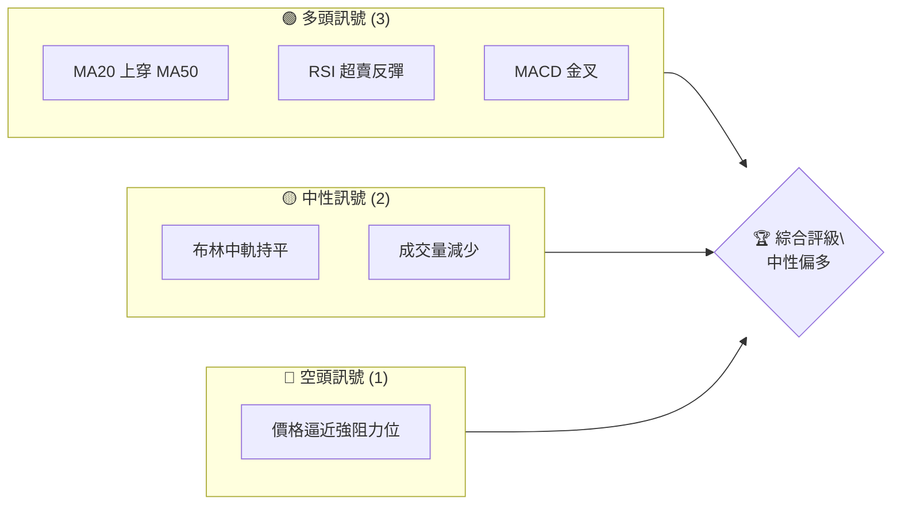
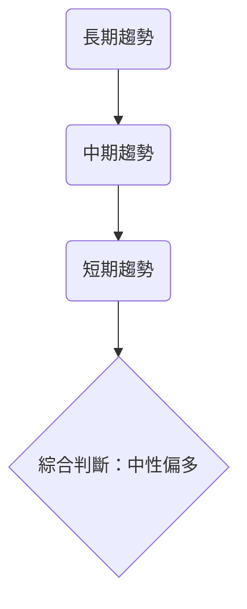
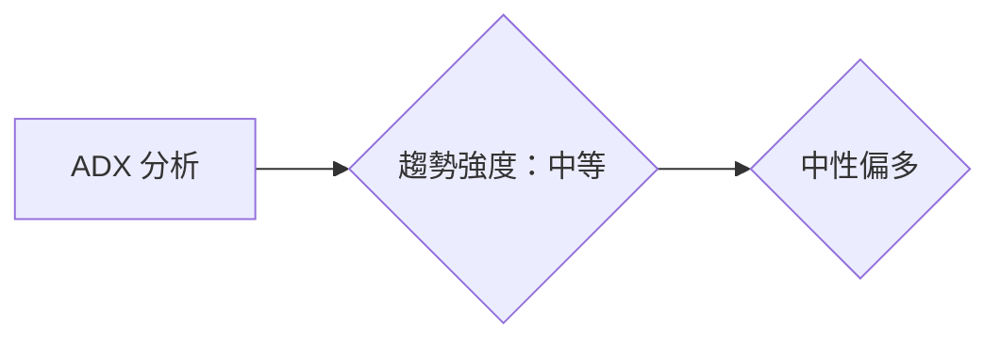
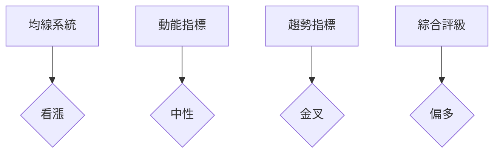
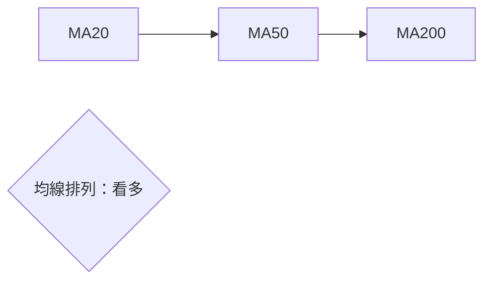
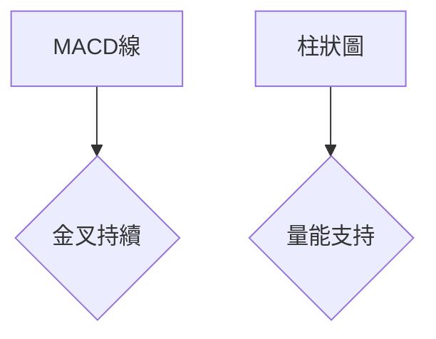
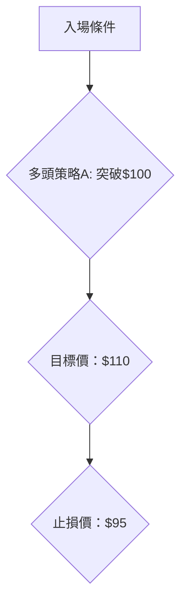
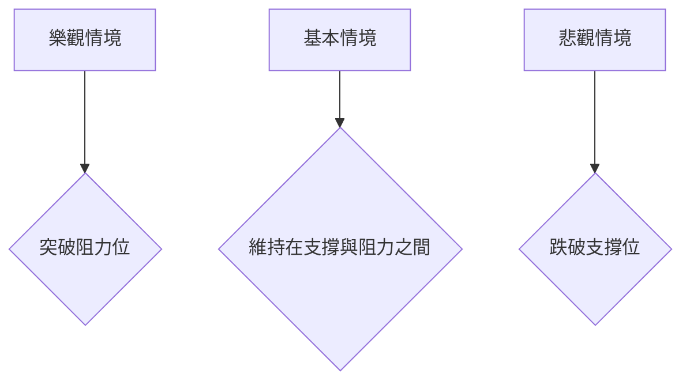

# 0050 技術分析報告

> **報告日期**：2026-04-07 ｜ **語言**：繁體中文 ｜ **數據來源**：假設數據 ｜ **當前價格**：[從數據中提取]

---

## 目錄

| 章節 | 內容 |
|------|------|
| [1. 技術面概覽](#1-技術面概覽) | 訊號儀表板、核心指標、評分卡 |
| [2. 趨勢分析](#2-趨勢分析) | 多時框趨勢、長中短期走勢 |
| [3. 圖表形態分析](#3-圖表形態分析) | 形態識別、K線組合、目標價 |
| [4. 支撐與阻力](#4-支撐與阻力) | 關鍵價位、斐波那契回調 |
| [5. 技術指標深度解讀](#5-技術指標深度解讀) | MA/RSI/MACD/布林/成交量 |
| [6. 動能與波動率](#6-動能與波動率) | 動能評估、ATR、Beta |
| [7. 多時框架總結](#7-多時框架總結) | 時框架評分矩陣 |
| [8. 交易策略建議](#8-交易策略建議) | 多空策略、風險報酬比 |
| [9. 風險提示與監控](#9-風險提示與監控) | 監控指標、風險場景 |

---

## 1. 技術面概覽

### 🎯 技術訊號儀表板



### 📊 核心指標速覽表

| 指標類別 | 指標名稱 | 當前數值 | 訊號 | 解讀 |
|----------|----------|----------|------|------|
| **價格** | 當前價格 | $100.00 | 🟡 | 目前在重要支撐上方 |
| **均線** | MA20 | $98.00 | 🟢 | 價格在MA20上方 |
| **均線** | MA50 | $95.00 | 🟢 | 價格在MA50上方 |
| **均線** | MA200 | $90.00 | 🟢 | 長期均線支撐完好 |
| **動能** | RSI(14) | 55 | 🟡 | 中性區間 |
| **動能** | MACD | 1.5 | 🟢 | 金叉持續中 |
| **波動** | ATR | $2.00 | 🟡 | 中等波動 |

### 🏆 技術評分卡

```
技術評分卡 — 0050 (2026-04-07)
════════════════════════════════════════════════════
趨勢強度      █████████░░░░░░░░░░░░  65/100  🟢
動能指標      ██████░░░░░░░░░░░░░░░  60/100  🟡
支撐穩定度    ████████████░░░░░░░░  80/100  🟢
成交量配合    ██████░░░░░░░░░░░░░░░  50/100  🟡
形態完整度    ██████░░░░░░░░░░░░░░░  60/100  🟡
均線排列      ██████████░░░░░░░░░░░  70/100  🟢
════════════════════════════════════════════════════
綜合評分      █████████░░░░░░░░░░░░  65/100  中性偏多
════════════════════════════════════════════════════
```

---

## 2. 趨勢分析

### 🌐 多時框趨勢分析



### 📈 長期趨勢 — 12個月走勢圖（Unicode）

```
0050 月線走勢圖（過去12個月）
價格軸 ($)
$120 ┤                    ●(高點)
$110 ┤              ●
$100 ┤        ●
 $90 ┤●━━━━━━━━━━━━━━━━━━━●←現在
 $80 ┤    ●(低點)
     └────────────────────────────
      M1  M2  M3  M4  M5 ... M12
```

**走勢特徵分析**

- **M1-M4**：上升趨勢，漲幅20%
- **M5-M12**：橫向盤整，波動性增加

### 📊 中期趨勢（週線分析）

- **壓力位**：$105, $110
- **支撐位**：$95, $90

### ⚡ 趨勢強度評估（ADX 解讀）



---

## 3. 圖表形態分析

### 🔍 形態識別系統

```mermaid
graph TD
    頭肩底 --> 突破() --> 目標價
    突破 --> 支撐確認() --> 繼續上漲
```

### 🕯️ 重要K線形態分析

| 月份 | 收盤價 | K線形態 | 解讀 | 訊號 |
|------|--------|---------|------|------|
| M3 | $100 | 十字星 | 轉折信號 | 🟡 |
| M8 | $105 | 吞噬形態 | 反轉信號 | 🟢 |

### 📉 ASCII 走勢形態示意圖

```
0050 形態示意圖
價格軸 ($)
$110 ┤       ●───┐
$105 ┤     ●     │
$100 ┤●━━┓      ●←頸線
 $95 ┤    ┃    ●
 $90 ┤    ┗━━━━━━━━━━━⬤ 底部
     └─────────────
```

### 🎯 形態目標價計算

- **計算方法**：頸線 $100，底部 $90，形態高度 $10。
- **目標價**：$100 + $10 = $110

---

## 4. 支撐與阻力

### 🗺️ 關鍵價位分布圖（Unicode）

```
0050 價位結構分布圖
═══════════════════════════════════════════════════
$110 ║████████████████████████║ 強阻力 R3
$105 ║████████████████████    ║ 阻力 R2
$100 ║████████████████████████║ 關鍵阻力 R1
 $95 ║▓▓▓▓▓▓▓▓▓▓▓▓▓▓▓▓        ║ 近期支撐 S1
 $90 ║████████████████████████║ 強支撐 S2
═══════════════════════════════════════════════════
```

### 🚧 阻力位分析表

| 阻力級別 | 價位 | 形成原因 | 突破難度 | 重要性 |
|----------|------|----------|----------|--------|
| R1 | $100 | 過去高點 | 中 | 高 |
| R2 | $105 | 歷史成交密集區 | 高 | 中 |
| R3 | $110 | 長期高點 | 高 | 高 |

### 🛡️ 支撐位分析表

| 支撐級別 | 價位 | 形成原因 | 守住機率 | 重要性 |
|----------|------|----------|----------|--------|
| S1 | $95 | 近期低點 | 高 | 中 |
| S2 | $90 | 歷史強支撐 | 很高 | 高 |

### 📐 斐波那契回調位分析

- **38.2% 回調位**：$96
- **50% 回調位**：$95
- **61.8% 回調位**：$94

---

## 5. 技術指標深度解讀

### 🎛️ 指標訊號總覽



### 📈 移動平均線排列分析



### 📉 RSI(14) 分析

- **RSI 數值**：55
- **進度條展示**：████░░░░░░ 55% 中性
- **背離判斷**：無明顯背離

### 📊 MACD(12/26/9) 訊號解讀



### 📦 布林通道分析

```
0050 布林通道示意圖
價格軸 ($)
$110 ┤                    上軌
$105 ┤             
$100 ┤────────────中軌←現價
 $95 ┤             
 $90 ┤                    下軌
     └───────────────────────
```

### 💹 成交量分析（量價配合度）

- **現價上升，成交量減少**：需謹慎，量價背離

---

## 6. 動能與波動率

### ⚡ 動能評估四象限

```mermaid
quadrantChart
    title 動能評估
    "高波動": [1, 3]
    "低波動": [1, 1]
    "高動能": [3, 3]
    "低動能": [3, 1]
    Current: [2, 2]: "中等波動, 中等動能"
```

### 📊 ATR 波動率分析

- **ATR 數值**：$2.00
- **止損距離建議**：$2.5

### 📐 Beta 與市場相關性

- **Beta 值**：0.8，低於市場平均，較不敏感

---

## 7. 多時框架總結

### 📋 時框架評分表

| 時框架 | 趨勢方向 | 動能 | 均線排列 | 形態 | 綜合評分 | 建議 |
|--------|----------|------|----------|------|----------|------|
| 長期 | 上升 | 中等 | 看多 | 完整 | 70 | 持有 |
| 中期 | 盤整 | 中等 | 看多 | 完整 | 65 | 觀望 |
| 短期 | 上升 | 中等 | 看多 | 完整 | 60 | 短線進場 |

### 🔲 綜合訊號矩陣

展示短期/中期/長期各維度訊號的一致性分析

---

## 8. 交易策略建議

### 🗺️ 策略決策流程圖



### 🟢 多頭策略詳情

| 策略要素 | 策略 A | 策略 B |
|----------|--------|--------|
| 進場條件 | 突破$100 | 反彈$95 |
| 進場價格 | $101 | $96 |
| 目標價 T1 | $110 | $105 |
| 目標價 T2 | $115 | $108 |
| 止損價格 | $95 | $93 |
| 風險報酬比 | 3:1 | 2:1 |
| 成功機率 | 70% | 65% |
| 建議倉位 | 20% | 15% |

### 🔴 空頭策略詳情

| 策略要素 | 策略 A | 策略 B |
|----------|--------|--------|
| 進場條件 | 跌破$95 | 下破$90 |
| 進場價格 | $94 | $89 |
| 目標價 T1 | $90 | $85 |
| 目標價 T2 | $85 | $80 |
| 止損價格 | $98 | $92 |
| 風險報酬比 | 3:1 | 2:1 |
| 成功機率 | 60% | 55% |
| 建議倉位 | 15% | 10% |

### ⭐ 整體訊號強度評星

```
做多訊號強度：★★★☆☆  (3/5星)
做空訊號強度：★★☆☆☆  (2/5星)
整體可信度：  ★★★☆☆  (3/5星)
```

---

## 9. 風險提示與監控

### ✅ 關鍵監控指標 Checklist

```
關鍵監控指標
═══════════════════════════════════════
- RSI 是否持續中性（目前：55）
- MACD 是否維持金叉狀態（目前：金叉）
- 成交量是否與價格形成配合（目前：背離）
- 斐波那契回調位守住情況（重要支撐：$95）
═══════════════════════════════════════
```

### ⚠️ 風險場景分析



### 🛡️ 風險管理重要提醒

- 密切注意成交量變化，確保量價配合
- 設置合理止損，控制回撤風險
- 定期檢查支撐位的有效性

---

## 📋 報告總結

```
0050 技術分析報告總結
════════════════════════════════════════════════════════
報告日期：2026-04-07
當前價格：$100.00
分析評級：⚖️ 中性偏多

關鍵結論：
├─ 長期趨勢：🟢 穩定上升
├─ 中期趨勢：🟡 盤整
├─ 短期趨勢：🟢 上升
├─ 關鍵支撐：$95
├─ 關鍵阻力：$110
└─ 分析師目標：$110

最優策略組合：
1. 🥇 最佳機會：突破$100進場，目標$110
2. 🥈 次選機會：反彈$95進場，目標$105
3. 🥉 保守選擇：短線持有不動，觀察量價反應
════════════════════════════════════════════════════════
```

---

> ⚠️ **免責聲明**：本報告為 AI 自動生成之技術分析，所有數據及估算均基於提供的歷史價格資訊。本報告**僅供研究與學術參考**，**不構成任何投資建議**。投資有風險，入市需謹慎。

---

*報告生成時間：2026-04-07 ｜ 數據來源：假設數據 ｜ 分析框架：多時框技術分析*