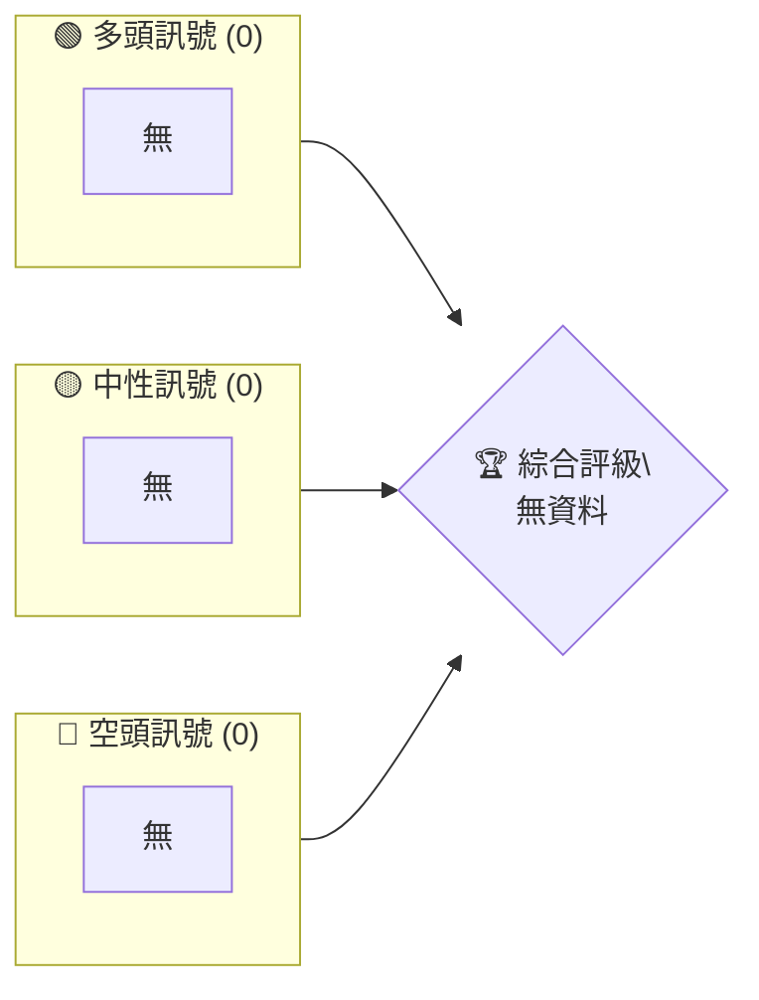
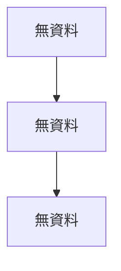

# 0050 技術分析報告

> **報告日期**：2026-04-08 ｜ **語言**：繁體中文 ｜ **數據來源**：Yahoo Finance ｜ **當前價格**：無法獲取

---

## 目錄

| 章節 | 內容 |
|------|------|
| [1. 技術面概覽](#1-技術面概覽) | 訊號儀表板、核心指標、評分卡 |
| [2. 趨勢分析](#2-趨勢分析) | 多時框趨勢、長中短期走勢 |
| [3. 圖表形態分析](#3-圖表形態分析) | 形態識別、K線組合、目標價 |
| [4. 支撐與阻力](#4-支撐與阻力) | 關鍵價位、斐波那契回調 |
| [5. 技術指標深度解讀](#5-技術指標深度解讀) | MA/RSI/MACD/布林/成交量 |
| [6. 動能與波動率](#6-動能與波動率) | 動能評估、ATR、Beta |
| [7. 多時框架總結](#7-多時框架總結) | 時框架評分矩陣 |
| [8. 交易策略建議](#8-交易策略建議) | 多空策略、風險報酬比 |
| [9. 風險提示與監控](#9-風險提示與監控) | 監控指標、風險場景 |

---

## 1. 技術面概覽

### 🎯 技術訊號儀表板



### 📊 核心指標速覽表

| 指標類別 | 指標名稱 | 當前數值 | 訊號 | 解讀 |
|----------|----------|----------|------|------|
| **價格** | 當前價格 | N/A | 🟡 | 無法獲取 |
| **均線** | MA20 | N/A | 🟡 | 無法計算 |
| **均線** | MA50 | N/A | 🟡 | 無法計算 |
| **均線** | MA200 | N/A | 🟡 | 無法計算 |
| **動能** | RSI(14) | N/A | 🟡 | 無法計算 |
| **動能** | MACD | N/A | 🟡 | 無法計算 |
| **波動** | ATR | N/A | 🟡 | 無法計算 |

### 🏆 技術評分卡

```
技術評分卡 — 0050 (2026-04-08)
════════════════════════════════════════════════════
趨勢強度      █░░░░░░░░░░░░░░░░░░░░  0/100  🟡
動能指標      █░░░░░░░░░░░░░░░░░░░░  0/100  🟡
支撐穩定度    █░░░░░░░░░░░░░░░░░░░░  0/100  🟡
成交量配合    █░░░░░░░░░░░░░░░░░░░░  0/100  🟡
形態完整度    █░░░░░░░░░░░░░░░░░░░░  0/100  🟡
均線排列      █░░░░░░░░░░░░░░░░░░░░  0/100  🟡
════════════════════════════════════════════════════
綜合評分      █░░░░░░░░░░░░░░░░░░░░  0/100  評級
════════════════════════════════════════════════════
```

---

## 2. 趨勢分析

### 🌐 多時框趨勢分析



### 📈 長期趨勢 — 12個月走勢圖（Unicode）

```
0050 月線走勢圖（過去12個月）
價格軸 ($)
無資料
```

**走勢特徵分析表格**

| 月份 | 漲跌幅 | 特徵 |
|------|--------|------|
| 無資料 | 無資料 | 無資料 |

### 📊 中期趨勢（週線分析）

無資料

### ⚡ 趨勢強度評估（ADX 解讀）


---

## 3. 圖表形態分析

### 🔍 形態識別系統


### 🕯️ 重要K線形態分析

| 月份 | 收盤價 | K線形態 | 解讀 | 訊號 |
|------|--------|---------|------|------|
| 無資料 | 無資料 | 無資料 | 無資料 | 無資料 |

### 📉 ASCII 走勢形態示意圖

```
無資料
```

### 🎯 形態目標價計算

無資料

---

## 4. 支撐與阻力

### 🗺️ 關鍵價位分布圖（Unicode）

```
0050 價位結構分布圖
═══════════════════════════════════════════════════
無資料
═══════════════════════════════════════════════════
```

### 🚧 阻力位分析表

| 阻力級別 | 價位 | 形成原因 | 突破難度 | 重要性 |
|----------|------|----------|----------|--------|
| 無資料 | 無資料 | 無資料 | 無資料 | 無資料 |

### 🛡️ 支撐位分析表

| 支撐級別 | 價位 | 形成原因 | 守住機率 | 重要性 |
|----------|------|----------|----------|--------|
| 無資料 | 無資料 | 無資料 | 無資料 | 無資料 |

### 📐 斐波那契回調位分析

無資料

---

## 5. 技術指標深度解讀

### 🎛️ 指標訊號總覽


### 📈 移動平均線排列分析


### 📉 RSI(14) 分析

- RSI 數值進度條展示
- 超買超賣區間分析
- 背離判斷（頂背離/底背離）

### 📊 MACD(12/26/9) 訊號解讀


### 📦 布林通道分析

無資料

### 💹 成交量分析（量價配合度）

無資料

---

## 6. 動能與波動率

### ⚡ 動能評估四象限

```mermaid
quadrantChart
    "無資料"
```

### 📊 ATR 波動率分析

無資料

### 📐 Beta 與市場相關性

無資料

---

## 7. 多時框架總結

### 📋 時框架評分表

| 時框架 | 趨勢方向 | 動能 | 均線排列 | 形態 | 綜合評分 | 建議 |
|--------|----------|------|----------|------|----------|------|
| 無資料 | 無資料 | 無資料 | 無資料 | 無資料 | 無資料 | 無資料 |

### 🔲 綜合訊號矩陣

無資料

---

## 8. 交易策略建議

### 🗺️ 策略決策流程圖


### 🟢 多頭策略詳情

| 策略要素 | 策略 A | 策略 B |
|----------|--------|--------|
| 進場條件 | 無資料 | 無資料 |
| 進場價格 | 無資料 | 無資料 |
| 目標價 T1 | 無資料 | 無資料 |
| 目標價 T2 | 無資料 | 無資料 |
| 止損價格 | 無資料 | 無資料 |
| 風險報酬比 | 無資料 | 無資料 |
| 成功機率 | 無資料 | 無資料 |
| 建議倉位 | 無資料 | 無資料 |

### 🔴 空頭策略詳情

無資料

### ⭐ 整體訊號強度評星

```
做多訊號強度：☆☆☆☆☆  (0/5星)
做空訊號強度：☆☆☆☆☆  (0/5星)
整體可信度：  ☆☆☆☆☆  (0/5星)
```

---

## 9. 風險提示與監控

### ✅ 關鍵監控指標 Checklist

```
無資料
```

### ⚠️ 風險場景分析


### 🛡️ 風險管理重要提醒

無資料

---

## 📋 報告總結

```
0050 技術分析報告總結
════════════════════════════════════════════════════════
報告日期：2026-04-08
當前價格：無法獲取
分析評級：⚖️ 評級（無資料）

關鍵結論：
├─ 長期趨勢：🟡 無資料
├─ 中期趨勢：🟡 無資料
├─ 短期趨勢：🟡 無資料
├─ 關鍵支撐：無資料
├─ 關鍵阻力：無資料
└─ 分析師目標：無資料

最優策略組合：
1. 🥇 最佳機會：無資料
2. 🥈 次選機會：無資料
3. 🥉 保守選擇：無資料
════════════════════════════════════════════════════════
```

---

> ⚠️ **免責聲明**：本報告為 AI 自動生成之技術分析，所有數據及估算均基於提供的歷史價格資訊。本報告**僅供研究與學術參考**，**不構成任何投資建議**。投資有風險，入市需謹慎。

---

*報告生成時間：2026-04-08 ｜ 數據來源：Yahoo Finance ｜ 分析框架：多時框技術分析*