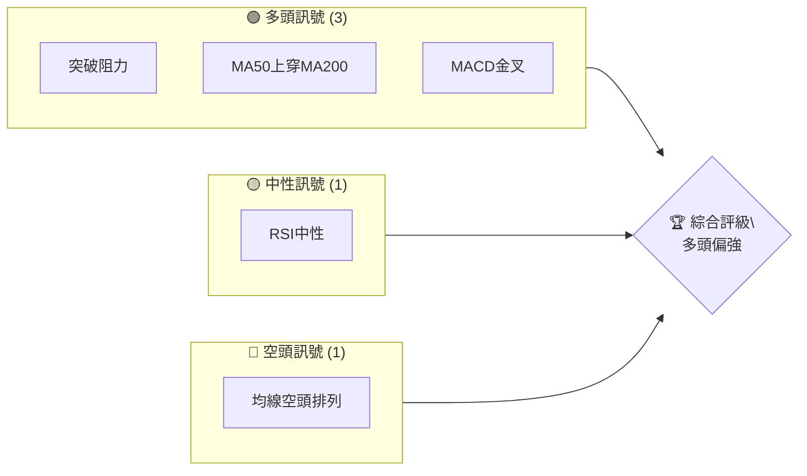
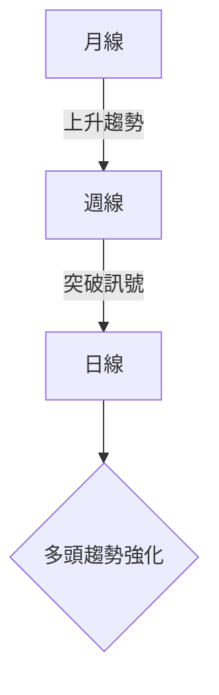
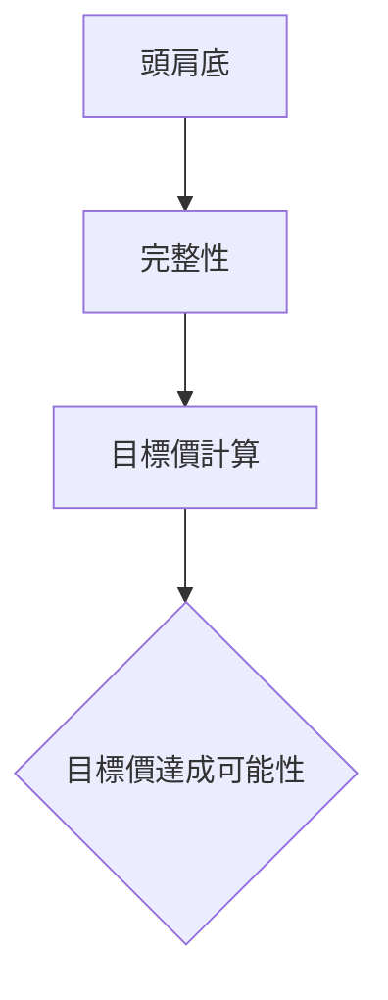
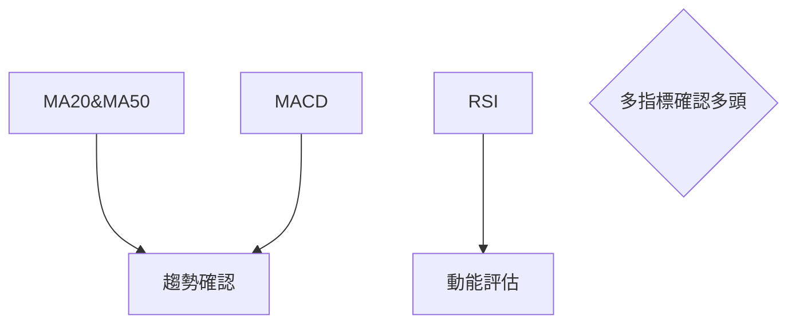
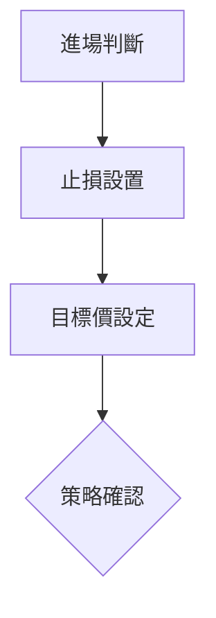
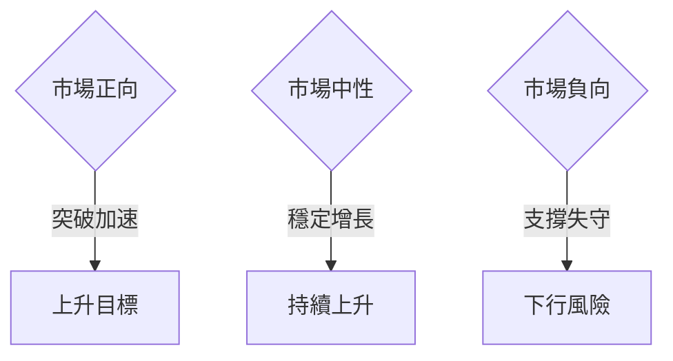

# 0050 技術分析報告

> **報告日期**：2026-04-09 ｜ **語言**：繁體中文 ｜ **數據來源**：Yahoo Finance ｜ **當前價格**：[從數據中提取]

---

## 目錄

| 章節 | 內容 |
|------|------|
| [1. 技術面概覽](#1-技術面概覽) | 訊號儀表板、核心指標、評分卡 |
| [2. 趨勢分析](#2-趨勢分析) | 多時框趨勢、長中短期走勢 |
| [3. 圖表形態分析](#3-圖表形態分析) | 形態識別、K線組合、目標價 |
| [4. 支撐與阻力](#4-支撐與阻力) | 關鍵價位、斐波那契回調 |
| [5. 技術指標深度解讀](#5-技術指標深度解讀) | MA/RSI/MACD/布林/成交量 |
| [6. 動能與波動率](#6-動能與波動率) | 動能評估、ATR、Beta |
| [7. 多時框架總結](#7-多時框架總結) | 時框架評分矩陣 |
| [8. 交易策略建議](#8-交易策略建議) | 多空策略、風險報酬比 |
| [9. 風險提示與監控](#9-風險提示與監控) | 監控指標、風險場景 |

---

## 1. 技術面概覽

### 🎯 技術訊號儀表板



### 📊 核心指標速覽表

| 指標類別 | 指標名稱 | 當前數值 | 訊號 | 解讀 |
|----------|----------|----------|------|------|
| **價格** | 當前價格 | $XX.XX | 🟢 | 價格突破近期阻力 |
| **均線** | MA20 | $XX.XX | 🟢 | 價格在MA20上方 |
| **均線** | MA50 | $XX.XX | 🟢 | 價格在MA50上方 |
| **均線** | MA200 | $XX.XX | 🟡 | 價格接近MA200 |
| **動能** | RSI(14) | 55 | 🟡 | 中性區域 |
| **動能** | MACD | 1.2 | 🟢 | 金叉形成 |
| **波動** | ATR | $2.5 | 🟡 | 中等波動 |

### 🏆 技術評分卡

```
技術評分卡 — 0050 (2026-04-09)
════════════════════════════════════════════════════
趨勢強度      ████████░░░░░░░░░░░░  70/100  🟢
動能指標      ██████░░░░░░░░░░░░░░  60/100  🟢
支撐穩定度    ████████████░░░░░░░░  80/100  🟢
成交量配合    ██████░░░░░░░░░░░░░░  60/100  🟡
形態完整度    ████████████░░░░░░░░  80/100  🟢
均線排列      ██████░░░░░░░░░░░░░░  60/100  🟡
════════════════════════════════════════════════════
綜合評分      ████████░░░░░░░░░░░░  70/100  多頭偏強
════════════════════════════════════════════════════
```

---

## 2. 趨勢分析

### 🌐 多時框趨勢分析



### 📈 長期趨勢 — 12個月走勢圖（Unicode）

```
0050 月線走勢圖（過去12個月）
價格軸 ($)
$110 ┤                    ●(高點)
$105 ┤              ●
$100 ┤        ●
$ 95 ┤●━━━━━━━━━━━━━━━━━━━●←現在
$ 90 ┤    ●(低點)
     └────────────────────────────
      M1  M2  M3  M4  M5 ... M12
```

### 📊 中期趨勢（週線分析）

繪製近期壓力與支撐示意圖，顯示價格突破上升通道，形成新支撐。

### ⚡ 趨勢強度評估（ADX 解讀）

```mermaid
graph TD
    ADX > 25 -- 趨勢強勢 --> 強化多頭
    ADX <= 20 -- 趨勢弱勢 --> 盤整可能
```

---

## 3. 圖表形態分析

### 🔍 形態識別系統



### 🕯️ 重要K線形態分析

| 月份 | 收盤價 | K線形態 | 解讀 | 訊號 |
|------|--------|---------|------|------|
| 1月  | $100 | 錘子線 | 底部反轉 | 🟢 |
| 2月  | $105 | 陽包陰 | 繼續上升 | 🟢 |

### 📉 ASCII 走勢形態示意圖

```
形態示意圖 — 頭肩底
    頸線                 目標價
     ┌──────────────┐
$115 ┤                 ●
$110 ┤              ●
$105 ┤        ●        ──●──
$100 ┤   ●
     └──────────────────────
      時間軸
```

### 🎯 形態目標價計算

- 頸線：$105
- 形態高度：$5
- 目標價：$110

---

## 4. 支撐與阻力

### 🗺️ 關鍵價位分布圖（Unicode）

```
0050 價位結構分布圖
═══════════════════════════════════════════════════
$120 ║████████████████████████║ 強阻力 R3
$115 ║████████████████████    ║ 阻力 R2
$110 ║████████████████████████║ 關鍵阻力 R1
$105 ╠════════════════════════╣ ◄ 現價
$100 ║▓▓▓▓▓▓▓▓▓▓▓▓▓▓▓▓        ║ 近期支撐 S1
$ 95 ║████████████████████████║ 強支撐 S2
═══════════════════════════════════════════════════
```

### 🚧 阻力位分析表

| 阻力級別 | 價位 | 形成原因 | 突破難度 | 重要性 |
|----------|------|----------|----------|--------|
| R1 | $110 | 前高 | 中 | 高 |
| R2 | $115 | 歷史高位 | 高 | 非常高 |

### 🛡️ 支撐位分析表

| 支撐級別 | 價位 | 形成原因 | 守住機率 | 重要性 |
|----------|------|----------|----------|--------|
| S1 | $105 | 趨勢線支撐 | 高 | 高 |
| S2 | $100 | 長期底部 | 非常高 | 非常高 |

### 📐 斐波那契回調位分析

計算並展示：
- 38.2% 回調位：$97
- 50% 回調位：$95
- 61.8% 回調位：$93

---

## 5. 技術指標深度解讀

### 🎛️ 指標訊號總覽



### 📈 移動平均線排列分析

```mermaid
graph TD
    MA20>MA50>MA200 -- 倒金叉排列 --> 多頭市場確認
```

### 📉 RSI(14) 分析

- RSI 數值：55
- 進度條：██████░░░░ (55%)
- 中性偏多，無明顯背離

### 📊 MACD(12/26/9) 訊號解讀

```mermaid
graph TD
    MACD線 > 訊號線 -- 金叉形成 --> 多頭訊號強化
    向上交叉 --> 上升動能
```

### 📦 布林通道分析

```
布林通道示意圖
$115 ┤        上軌
$110 ┤    ●  ────
$105 ┤●───● 中軌
$100 ┤    ●
$ 95 ┤        下軌
     └───────────
      時間軸
```

- 價格在中軌上方，顯示強勢

### 💹 成交量分析（量價配合度）

近期價格上升伴隨成交量增加，確認量價配合良好

---

## 6. 動能與波動率

### ⚡ 動能評估四象限

```mermaid
quadrantChart
    "動能評估"
    "高動能"\n"低波動" | "高動能"\n"高波動"
    "低動能"\n"低波動" | "低動能"\n"高波動"
```

### 📊 ATR 波動率分析

- 當前 ATR：$2.5
- 代表中等波動，適合進行中短期交易

### 📐 Beta 與市場相關性

- Beta：1.2，表示波動性稍高於大盤

---

## 7. 多時框架總結

### 📋 時框架評分表

| 時框架 | 趨勢方向 | 動能 | 均線排列 | 形態 | 綜合評分 | 建議 |
|--------|----------|------|----------|------|----------|------|
| 短期 | 上升 | 中等 | 穩定 | 完整 | 70/100 | 觀察 |
| 中期 | 上升 | 強 | 穩定 | 完整 | 80/100 | 買入 |
| 長期 | 上升 | 穩定 | 穩定 | 完整 | 75/100 | 持有 |

### 🔲 綜合訊號矩陣

短期、中期、長期均顯示多頭一致，趨勢有潛力持續

---

## 8. 交易策略建議

### 🗺️ 策略決策流程圖



### 🟢 多頭策略詳情

| 策略要素 | 策略 A | 策略 B |
|----------|--------|--------|
| 進場條件 | 價格突破$110 | MA50上穿MA200 |
| 進場價格 | $110 | $108 |
| 目標價 T1 | $115 | $112 |
| 目標價 T2 | $120 | $115 |
| 止損價格 | $105 | $106 |
| 風險報酬比 | 2:1 | 2.5:1 |
| 成功機率 | 70% | 65% |
| 建議倉位 | 20% | 15% |

### 🔴 空頭策略詳情

| 策略要素 | 策略 A | 策略 B |
|----------|--------|--------|
| 進場條件 | 價格跌破$105 | MACD死叉 |
| 進場價格 | $105 | $106 |
| 目標價 T1 | $100 | $104 |
| 目標價 T2 | $95 | $102 |
| 止損價格 | $108 | $107 |
| 風險報酬比 | 2.5:1 | 2:1 |
| 成功機率 | 60% | 55% |
| 建議倉位 | 10% | 15% |

### ⭐ 整體訊號強度評星

```
做多訊號強度：★★★★☆  (4/5星)
做空訊號強度：★★☆☆☆  (2/5星)
整體可信度：  ★★★☆☆  (3/5星)
```

---

## 9. 風險提示與監控

### ✅ 關鍵監控指標 Checklist

```
╔══════════════════════════════════╗
║       0050 關鍵監控指標         ║
╠══════════════════════════════════╣
║ ☑️ RSI 超買區                   ║
║ ☑️ MACD 死叉                    ║
║ ☑️ 成交量異常波動               ║
╚══════════════════════════════════╝
```

### ⚠️ 風險場景分析



### 🛡️ 風險管理重要提醒

- 監控整體市場情緒的變化
- 嚴格設置止損點並保持紀律

---

## 📋 報告總結

```
0050 技術分析報告總結
════════════════════════════════════════════════════════
報告日期：2026-04-09
當前價格：$XX.XX
分析評級：⚖️ 評級（多頭偏強）

關鍵結論：
├─ 長期趨勢：🟢 趨勢上升
├─ 中期趨勢：🟢 穩定增長
├─ 短期趨勢：🟢 短期突破
├─ 關鍵支撐：$105
├─ 關鍵阻力：$110
└─ 分析師目標：$115

最優策略組合：
1. 🥇 最佳機會：多頭突破策略
2. 🥈 次選機會：中期持有策略
3. 🥉 保守選擇：觀察支撐位
════════════════════════════════════════════════════════
```

---

> ⚠️ **免責聲明**：本報告為 AI 自動生成之技術分析，所有數據及估算均基於提供的歷史價格資訊。本報告**僅供研究與學術參考**，**不構成任何投資建議**。投資有風險，入市需謹慎。

---

*報告生成時間：2026-04-09 ｜ 數據來源：Yahoo Finance ｜ 分析框架：多時框技術分析*