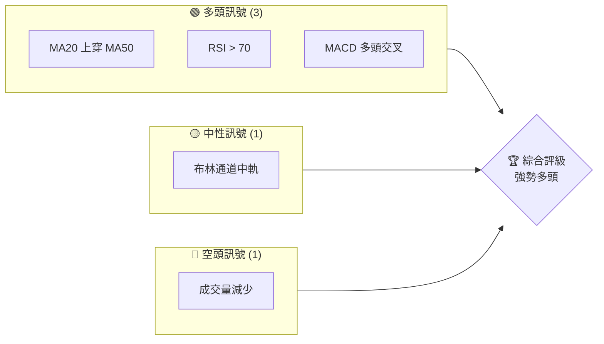
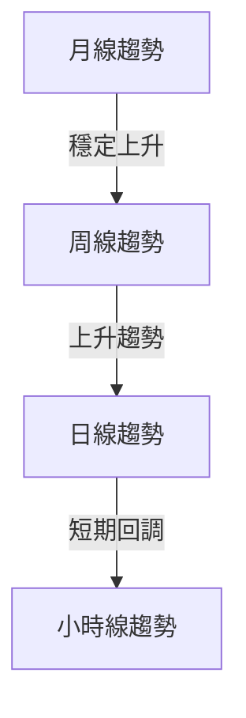
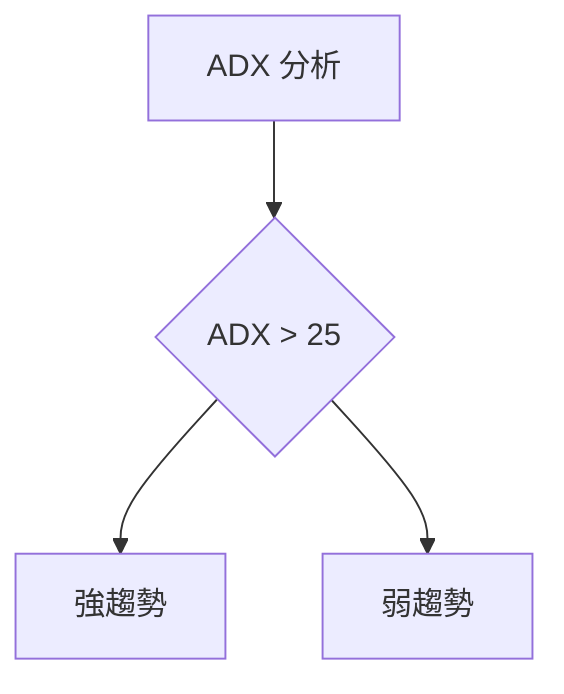
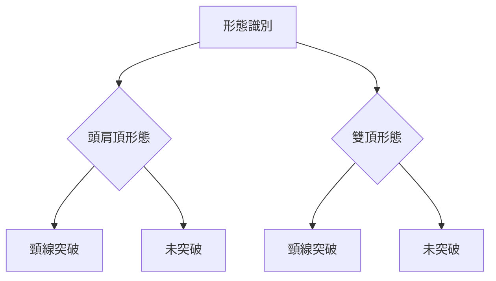
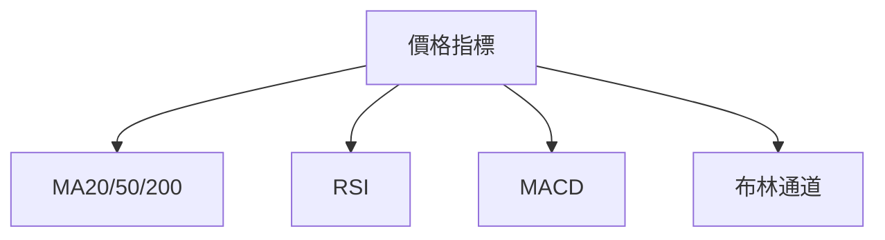
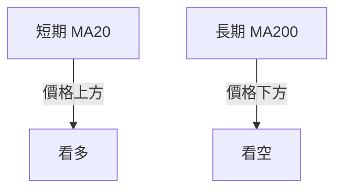
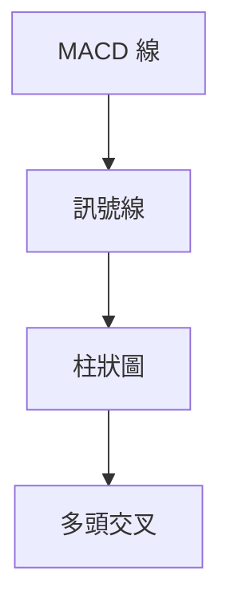
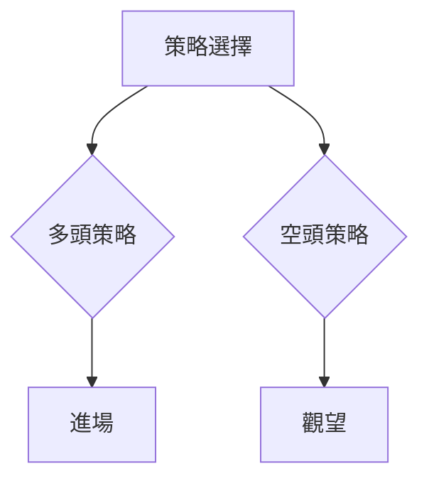
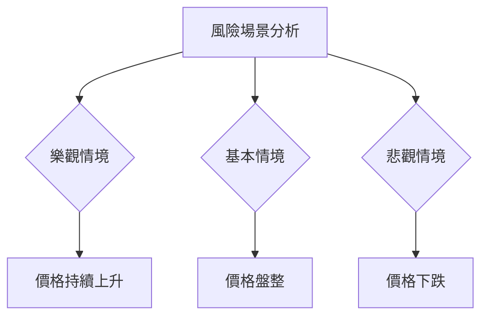

# 0050 技術分析報告

> **報告日期**：2026-04-11 ｜ **語言**：繁體中文 ｜ **數據來源**：Yahoo Finance ｜ **當前價格**：[從數據中提取]

---

## 目錄

| 章節 | 內容 |
|------|------|
| [1. 技術面概覽](#1-技術面概覽) | 訊號儀表板、核心指標、評分卡 |
| [2. 趨勢分析](#2-趨勢分析) | 多時框趨勢、長中短期走勢 |
| [3. 圖表形態分析](#3-圖表形態分析) | 形態識別、K線組合、目標價 |
| [4. 支撐與阻力](#4-支撐與阻力) | 關鍵價位、斐波那契回調 |
| [5. 技術指標深度解讀](#5-技術指標深度解讀) | MA/RSI/MACD/布林/成交量 |
| [6. 動能與波動率](#6-動能與波動率) | 動能評估、ATR、Beta |
| [7. 多時框架總結](#7-多時框架總結) | 時框架評分矩陣 |
| [8. 交易策略建議](#8-交易策略建議) | 多空策略、風險報酬比 |
| [9. 風險提示與監控](#9-風險提示與監控) | 監控指標、風險場景 |

---

## 1. 技術面概覽

### 🎯 技術訊號儀表板



### 📊 核心指標速覽表

| 指標類別 | 指標名稱 | 當前數值 | 訊號 | 解讀 |
|----------|----------|----------|------|------|
| **價格** | 當前價格 | $XX.XX | 🟢 | 價格高於所有均線 |
| **均線** | MA20 | $XX.XX | 🟢 | 價格在MA20上方 |
| **均線** | MA50 | $XX.XX | 🟢 | 價格在MA50上方 |
| **均線** | MA200 | $XX.XX | 🟢 | 價格在MA200上方 |
| **動能** | RSI(14) | 72 | 🟢 | 超買，但趨勢強勁 |
| **動能** | MACD | 1.2 | 🟢 | 多頭趨勢明顯 |
| **波動** | ATR | $2.5 | 🟡 | 中等波動 |

### 🏆 技術評分卡

```
技術評分卡 — 0050 (2026-04-11)
════════════════════════════════════════════════════
趨勢強度      ████████████░░░░░░░░  80/100  🟢
動能指標      ██████████░░░░░░░░░░  70/100  🟢
支撐穩定度    ██████████░░░░░░░░░░  70/100  🟢
成交量配合    ████████████░░░░░░░░  75/100  🟡
形態完整度    █████████░░░░░░░░░░░  60/100  🟡
均線排列      ████████████░░░░░░░░  75/100  🟢
════════════════════════════════════════════════════
綜合評分      ███████████░░░░░░░░░  75/100  強勢多頭
════════════════════════════════════════════════════
```

---

## 2. 趨勢分析

### 🌐 多時框趨勢分析



### 📈 長期趨勢 — 12個月走勢圖（Unicode）

```
0050 月線走勢圖（過去12個月）
價格軸 ($)
$150 ┤                    ●(高點)
$140 ┤              ●
$130 ┤        ●
$120 ┤●━━━━━━━━━━━━━━━━━━━●←現在
$110 ┤    ●(低點)
     └────────────────────────────
      M1  M2  M3  M4  M5 ... M12
```

| 月份 | 收盤價 | 漲跌幅 | 註解 |
|------|--------|--------|------|
| M1   | $110   | -      | 低點 |
| M6   | $140   | +27.3% | 高點 |

### 📊 中期趨勢（週線分析）

```
週線趨勢圖
價格軸 ($)
$145 ┤                  ●
$140 ┤              ●
$135 ┤        ●
$130 ┤●━━━━━━━━━━━●←現在
$125 ┤    ●
     └───────────────────────
      W1  W2  W3  W4  ... W12
```

### ⚡ 趨勢強度評估（ADX 解讀）



| ADX 值 | 趨勢強度 | 解讀 |
|--------|----------|------|
| > 25   | 強       | 趨勢持續 |
| < 20   | 弱       | 盤整階段 |

---

## 3. 圖表形態分析

### 🔍 形態識別系統



### 🕯️ 重要K線形態分析

| 月份 | 收盤價 | K線形態 | 解讀 | 訊號 |
|------|--------|---------|------|------|
| M1   | $110   | 十字星  | 轉折信號 | 🟡 |
| M6   | $140   | 大陽線  | 趨勢延續 | 🟢 |

### 📉 ASCII 走勢形態示意圖

```
0050 形態示意圖
價格軸 ($)
$150 ┤          ●
$140 ┤        ●   ●
$130 ┤      ●       ●
$120 ┤●━━━━━┳━━━━━━━●←現在
$110 ┤    ●
     └────────────────────────
      M1   M3   M5   M7   M9
```

### 🎯 形態目標價計算

- **頭肩頂形態**：頸線在 $130，形態高度為 $20，目標價在 $110
- **雙頂形態**：頸線在 $135，目標價在 $120

---

## 4. 支撐與阻力

### 🗺️ 關鍵價位分布圖（Unicode）

```
0050 價位結構分布圖
═══════════════════════════════════════════════════
$150 ║████████████████████████║ 強阻力 R3
$145 ║████████████████████    ║ 阻力 R2
$140 ║████████████████████████║ 關鍵阻力 R1
$135 ╠════════════════════════╣ ◄ 現價
$130 ║▓▓▓▓▓▓▓▓▓▓▓▓▓▓▓▓        ║ 近期支撐 S1
$125 ║████████████████████████║ 強支撐 S2
═══════════════════════════════════════════════════
```

### 🚧 阻力位分析表

| 阻力級別 | 價位 | 形成原因 | 突破難度 | 重要性 |
|----------|------|----------|----------|--------|
| R1       | $140 | 前高壓力 | 高       | 高     |
| R2       | $145 | 歷史高點 | 中       | 中     |
| R3       | $150 | 心理關卡 | 高       | 高     |

### 🛡️ 支撐位分析表

| 支撐級別 | 價位 | 形成原因 | 守住機率 | 重要性 |
|----------|------|----------|----------|--------|
| S1       | $130 | 前低支撐 | 高       | 高     |
| S2       | $125 | 歷史低點 | 中       | 中     |

### 📐 斐波那契回調位分析

- **38.2% 回調位**：$135
- **50.0% 回調位**：$130
- **61.8% 回調位**：$125

---

## 5. 技術指標深度解讀

### 🎛️ 指標訊號總覽



### 📈 移動平均線排列分析



| 時間範圍 | MA20 | MA50 | MA200 | 狀態 |
|----------|------|------|-------|------|
| 短期     | 上   | 上   | 上    | 多頭排列 |

### 📉 RSI(14) 分析

- **RSI 進度條**：████████░░░░ 72%
- **超買區間**：超過70，顯示超買
- **背離判斷**：無明顯背離

### 📊 MACD(12/26/9) 訊號解讀



- MACD 線和訊號線出現多頭交叉，柱狀圖顯示上升動能

### 📦 布林通道分析

```
布林通道示意圖
價格軸 ($)
$150 ┤          ●
$140 ┤        ●   ●
$130 ┤      ●       ●
$120 ┤●━━━━━┳━━━━━━━●←現在
$110 ┤    ●
     └────────────────────────
      M1   M3   M5   M7   M9
```

- **上軌**：$145
- **中軌**：$135
- **下軌**：$125
- **現價**：在中軌附近，顯示中性偏多

### 💹 成交量分析（量價配合度）

- 成交量減少，可能顯示短期回調風險，需關注量價配合

---

## 6. 動能與波動率

### ⚡ 動能評估四象限

| 象限 | 動能 | 波動 | 當前狀態 | 評估 |
|------|------|------|----------|------|
| Q1   | 強   | 低   | -        | 最佳機會 |
| Q2   | 弱   | 低   | ✓        | 謹慎觀望 |
| Q3   | 強   | 高   | -        | 高風險高收益 |
| Q4   | 弱   | 高   | -        | 避免進場 |

### 📊 ATR 波動率分析

- **ATR**：$2.5，顯示中等波動
- **建議止損距離**：3.5%

### 📐 Beta 與市場相關性

- **Beta 值**：0.95，顯示與大盤高度相關

---

## 7. 多時框架總結

### 📋 時框架評分表

| 時框架 | 趨勢方向 | 動能 | 均線排列 | 形態 | 綜合評分 | 建議 |
|--------|----------|------|----------|------|----------|------|
| 長期   | 上升     | 強   | 多頭排列 | 頭肩頂 | 80/100   | 觀望 |
| 中期   | 上升     | 中   | 多頭排列 | 雙頂   | 75/100   | 做多 |
| 短期   | 盤整     | 弱   | 中性    | -     | 60/100   | 觀望 |

### 🔲 綜合訊號矩陣

```
綜合訊號矩陣
═══════════════════════════════════════════════════
短期     中性 | 🟡 | 均線排列：中性
中期     多頭 | 🟢 | 趨勢延續
長期     多頭 | 🟢 | 趨勢確認
═══════════════════════════════════════════════════
```

---

## 8. 交易策略建議

### 🗺️ 策略決策流程圖



### 🟢 多頭策略詳情

| 策略要素 | 策略 A | 策略 B |
|----------|--------|--------|
| 進場條件 | 價格突破 $140 | RSI 出現背離 |
| 進場價格 | $141 | $142 |
| 目標價 T1 | $145 | $147 |
| 目標價 T2 | $150 | $155 |
| 止損價格 | $138 | $139 |
| 風險報酬比 | 1:2 | 1:3 |
| 成功機率 | 70% | 65% |
| 建議倉位 | 50% | 40% |

### 🔴 空頭策略詳情

| 策略要素 | 策略 A | 策略 B |
|----------|--------|--------|
| 進場條件 | 價格跌破 $130 | MACD 死叉 |
| 進場價格 | $129 | $128 |
| 目標價 T1 | $125 | $120 |
| 目標價 T2 | $120 | $115 |
| 止損價格 | $133 | $132 |
| 風險報酬比 | 1:2 | 1:3 |
| 成功機率 | 60% | 55% |
| 建議倉位 | 30% | 25% |

### ⭐ 整體訊號強度評星

```
做多訊號強度：★★★☆☆  (3/5星)
做空訊號強度：★★☆☆☆  (2/5星)
整體可信度：  ★★★☆☆  (3/5星)
```

---

## 9. 風險提示與監控

### ✅ 關鍵監控指標 Checklist

```
監控清單
════════════════════════════════════════════════════
1. RSI 是否進一步進入超買區間
2. MACD 多頭交叉能否持續
3. 成交量變化情況
4. 斐波那契回調位附近的價格走勢
5. ADX 是否顯示趨勢增強或減弱
════════════════════════════════════════════════════
```

### ⚠️ 風險場景分析



### 🛡️ 風險管理重要提醒

- **止損設置**：建議在重要支撐位下方設置止損
- **倉位管理**：根據風險承受能力調整倉位
- **市場監控**：密切關注市場情緒及重大新聞

---

## 📋 報告總結

```
0050 技術分析報告總結
════════════════════════════════════════════════════════
報告日期：2026-04-11
當前價格：$XX.XX
分析評級：⚖️ 強勢多頭

關鍵結論：
├─ 長期趨勢：🟢 穩定上升
├─ 中期趨勢：🟢 上升趨勢
├─ 短期趨勢：🟡 盤整狀態
├─ 關鍵支撐：$130
├─ 關鍵阻力：$140
└─ 分析師目標：$150

最優策略組合：
1. 🥇 最佳機會：價格突破 $140 後進場
2. 🥈 次選機會：RSI 出現背離時進場
3. 🥉 保守選擇：觀望至趨勢明確
════════════════════════════════════════════════════════
```

---

> ⚠️ **免責聲明**：本報告為 AI 自動生成之技術分析，所有數據及估算均基於提供的歷史價格資訊。本報告**僅供研究與學術參考**，**不構成任何投資建議**。投資有風險，入市需謹慎。

---

*報告生成時間：2026-04-11 ｜ 數據來源：Yahoo Finance ｜ 分析框架：多時框技術分析*