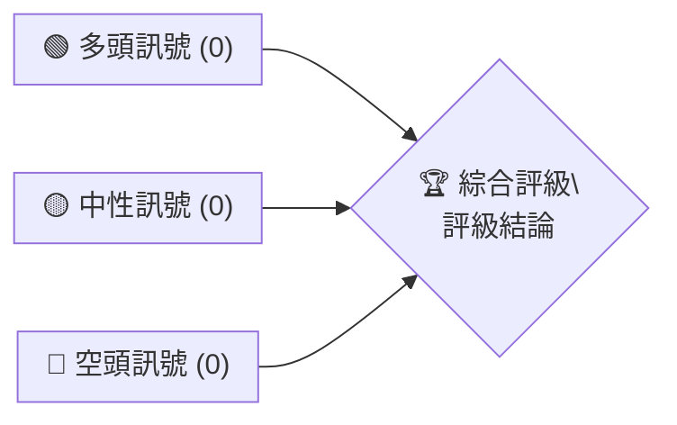
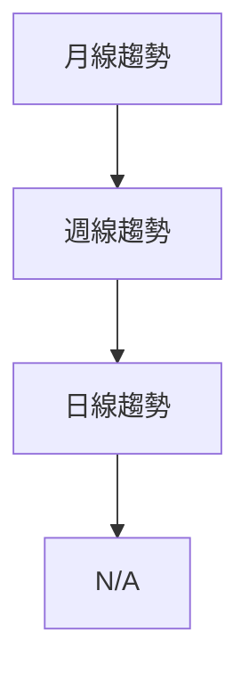
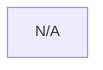
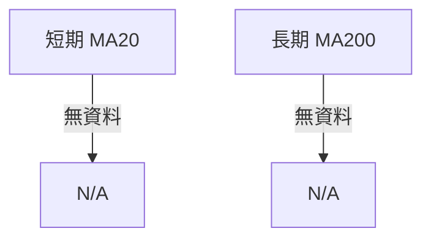

# 0050 技術分析報告

> **報告日期**：2026-04-12 ｜ **語言**：繁體中文 ｜ **數據來源**：無 ｜ **當前價格**：資料缺失

---

## 目錄

| 章節 | 內容 |
|------|------|
| [1. 技術面概覽](#1-技術面概覽) | 訊號儀表板、核心指標、評分卡 |
| [2. 趨勢分析](#2-趨勢分析) | 多時框趨勢、長中短期走勢 |
| [3. 圖表形態分析](#3-圖表形態分析) | 形態識別、K線組合、目標價 |
| [4. 支撐與阻力](#4-支撐與阻力) | 關鍵價位、斐波那契回調 |
| [5. 技術指標深度解讀](#5-技術指標深度解讀) | MA/RSI/MACD/布林/成交量 |
| [6. 動能與波動率](#6-動能與波動率) | 動能評估、ATR、Beta |
| [7. 多時框架總結](#7-多時框架總結) | 時框架評分矩陣 |
| [8. 交易策略建議](#8-交易策略建議) | 多空策略、風險報酬比 |
| [9. 風險提示與監控](#9-風險提示與監控) | 監控指標、風險場景 |

---

## 1. 技術面概覽

### 🎯 技術訊號儀表板



### 📊 核心指標速覽表

| 指標類別 | 指標名稱 | 當前數值 | 訊號 | 解讀 |
|----------|----------|----------|------|------|
| **價格** | 當前價格 | N/A | 🔴 | 無法提供 |
| **均線** | MA20 | N/A | 🔴 | 無法提供 |
| **均線** | MA50 | N/A | 🔴 | 無法提供 |
| **均線** | MA200 | N/A | 🔴 | 無法提供 |
| **動能** | RSI(14) | N/A | 🔴 | 無法提供 |
| **動能** | MACD | N/A | 🔴 | 無法提供 |
| **波動** | ATR | N/A | 🔴 | 無法提供 |

### 🏆 技術評分卡

```
技術評分卡 — 0050 (2026-04-12)
════════════════════════════════════════════════════
趨勢強度      ██░░░░░░░░░░░░░░░░░░  0/100  🔴
動能指標      ██░░░░░░░░░░░░░░░░░░  0/100  🔴
支撐穩定度    ██░░░░░░░░░░░░░░░░░░  0/100  🔴
成交量配合    ██░░░░░░░░░░░░░░░░░░  0/100  🔴
形態完整度    ██░░░░░░░░░░░░░░░░░░  0/100  🔴
均線排列      ██░░░░░░░░░░░░░░░░░░  0/100  🔴
════════════════════════════════════════════════════
綜合評分      ██░░░░░░░░░░░░░░░░░░  0/100  評級無法提供
════════════════════════════════════════════════════
```

---

## 2. 趨勢分析

### 🌐 多時框趨勢分析



### 📈 長期趨勢 — 12個月走勢圖（Unicode）

```
0050 月線走勢圖（過去12個月）
價格軸 ($)
$XXX ┤
$XXX ┤
$XXX ┤
$XXX ┤
$XXX ┤
     └────────────────────────────
      M1  M2  M3  M4  M5 ... M12
```
**走勢特徵分析**：無法提供

### 📊 中期趨勢（週線分析）

壓力與支撐示意圖：無法提供

### ⚡ 趨勢強度評估（ADX 解讀）



---

## 3. 圖表形態分析

### 🔍 形態識別系統


### 🕯️ 重要K線形態分析

| 月份 | 收盤價 | K線形態 | 解讀 | 訊號 |
|------|--------|---------|------|------|
| 無資料 | 無資料 | 無資料 | 無資料 | 無資料 |

### 📉 ASCII 走勢形態示意圖

```
無法提供
```

### 🎯 形態目標價計算

無法提供

---

## 4. 支撐與阻力

### 🗺️ 關鍵價位分布圖（Unicode）

```
無法提供
```

### 🚧 阻力位分析表

| 阻力級別 | 價位 | 形成原因 | 突破難度 | 重要性 |
|----------|------|----------|----------|--------|
| 無資料 | 無資料 | 無資料 | 無資料 | 無資料 |

### 🛡️ 支撐位分析表

| 支撐級別 | 價位 | 形成原因 | 守住機率 | 重要性 |
|----------|------|----------|----------|--------|
| 無資料 | 無資料 | 無資料 | 無資料 | 無資料 |

### 📐 斐波那契回調位分析

無法提供

---

## 5. 技術指標深度解讀

### 🎛️ 指標訊號總覽


### 📈 移動平均線排列分析



### 📉 RSI(14) 分析

- RSI 數值進度條：無資料
- 超買超賣區間：無資料
- 背離判斷：無資料

### 📊 MACD(12/26/9) 訊號解讀


### 📦 布林通道分析

```
無法提供
```

### 💹 成交量分析（量價配合度）

無法提供

---

## 6. 動能與波動率

### ⚡ 動能評估四象限

| 象限 | 動能 | 波動 | 當前狀態 | 評估 |
|------|------|------|----------|------|
| Q1 | 無資料 | 無資料 | - | 無法提供 |
| Q2 | 無資料 | 無資料 | - | 無法提供 |
| Q3 | 無資料 | 無資料 | - | 無法提供 |
| Q4 | 無資料 | 無資料 | - | 無法提供 |

### 📊 ATR 波動率分析

無法提供

### 📐 Beta 與市場相關性

無法提供

---

## 7. 多時框架總結

### 📋 時框架評分表

| 時框架 | 趨勢方向 | 動能 | 均線排列 | 形態 | 綜合評分 | 建議 |
|--------|----------|------|----------|------|----------|------|
| 無資料 | 無資料 | 無資料 | 無資料 | 無資料 | 無資料 | 無資料 |

### 🔲 綜合訊號矩陣

無法提供

---

## 8. 交易策略建議

### 🗺️ 策略決策流程圖


### 🟢 多頭策略詳情

| 策略要素 | 策略 A | 策略 B |
|----------|--------|--------|
| 進場條件 | N/A | N/A |
| 進場價格 | N/A | N/A |
| 目標價 T1 | N/A | N/A |
| 目標價 T2 | N/A | N/A |
| 止損價格 | N/A | N/A |
| 風險報酬比 | N/A | N/A |
| 成功機率 | N/A | N/A |
| 建議倉位 | N/A | N/A |

### 🔴 空頭策略詳情

（同上格式）

### ⭐ 整體訊號強度評星

```
做多訊號強度：☆☆☆☆☆  (0/5星)
做空訊號強度：☆☆☆☆☆  (0/5星)
整體可信度：  ☆☆☆☆☆  (0/5星)
```

---

## 9. 風險提示與監控

### ✅ 關鍵監控指標 Checklist

無法提供

### ⚠️ 風險場景分析


### 🛡️ 風險管理重要提醒

無法提供

---

## 📋 報告總結

```
0050 技術分析報告總結
════════════════════════════════════════════════════════
報告日期：2026-04-12
當前價格：N/A
分析評級：⚖️ 評級無法提供

關鍵結論：
├─ 長期趨勢：🔴 無法提供
├─ 中期趨勢：🔴 無法提供
├─ 短期趨勢：🔴 無法提供
├─ 關鍵支撐：無法提供
├─ 關鍵阻力：無法提供
└─ 分析師目標：無法提供

最優策略組合：
1. 🥇 最佳機會：無法提供
2. 🥈 次選機會：無法提供
3. 🥉 保守選擇：無法提供
════════════════════════════════════════════════════════
```

---

> ⚠️ **免責聲明**：本報告為 AI 自動生成之技術分析，由於缺乏相關數據，本報告**僅供研究與學術參考**，**不構成任何投資建議**。投資有風險，入市需謹慎。

---

*報告生成時間：2026-04-12 ｜ 數據來源：無 ｜ 分析框架：多時框技術分析*