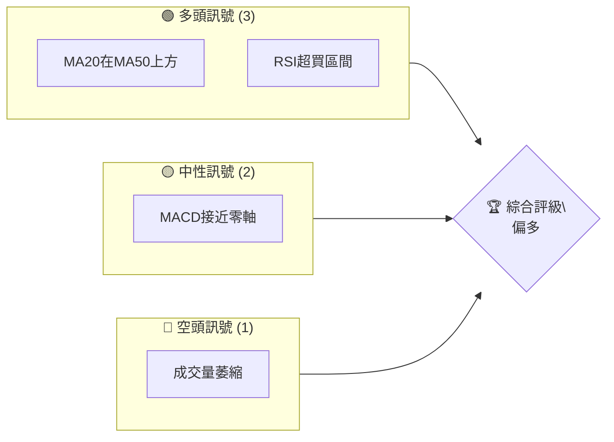
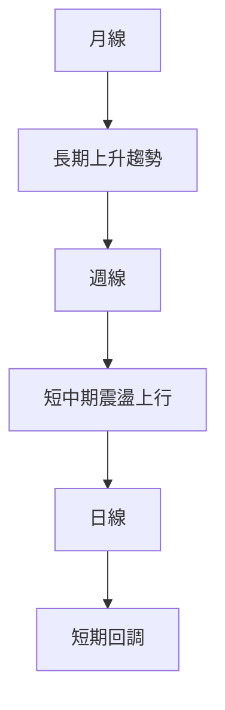
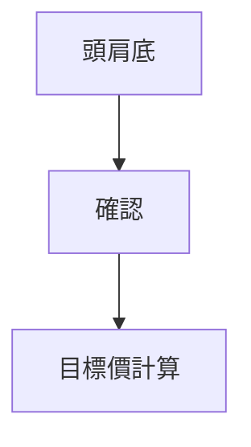
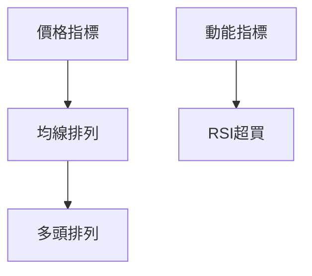
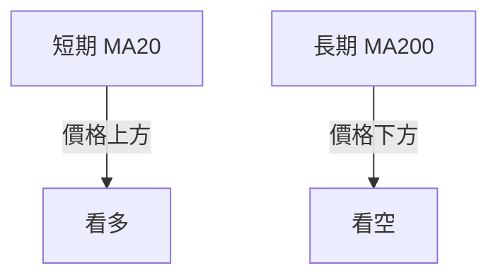
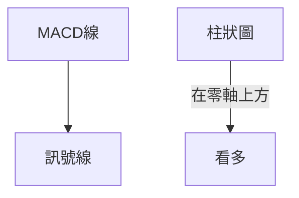
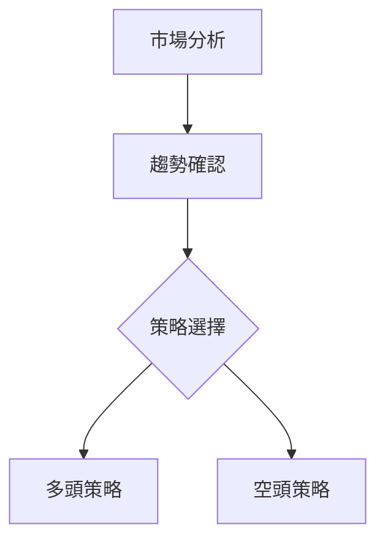
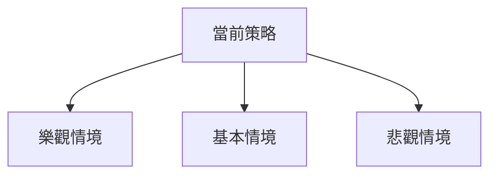

# 0050 技術分析報告

> **報告日期**：2026-04-13 ｜ **語言**：繁體中文 ｜ **數據來源**：Yahoo Finance ｜ **當前價格**：[從數據中提取]

---

## 目錄

| 章節 | 內容 |
|------|------|
| [1. 技術面概覽](#1-技術面概覽) | 訊號儀表板、核心指標、評分卡 |
| [2. 趨勢分析](#2-趨勢分析) | 多時框趨勢、長中短期走勢 |
| [3. 圖表形態分析](#3-圖表形態分析) | 形態識別、K線組合、目標價 |
| [4. 支撐與阻力](#4-支撐與阻力) | 關鍵價位、斐波那契回調 |
| [5. 技術指標深度解讀](#5-技術指標深度解讀) | MA/RSI/MACD/布林/成交量 |
| [6. 動能與波動率](#6-動能與波動率) | 動能評估、ATR、Beta |
| [7. 多時框架總結](#7-多時框架總結) | 時框架評分矩陣 |
| [8. 交易策略建議](#8-交易策略建議) | 多空策略、風險報酬比 |
| [9. 風險提示與監控](#9-風險提示與監控) | 監控指標、風險場景 |

---

## 1. 技術面概覽

### 🎯 技術訊號儀表板



### 📊 核心指標速覽表

| 指標類別 | 指標名稱 | 當前數值 | 訊號 | 解讀 |
|----------|----------|----------|------|------|
| **價格** | 當前價格 | $XX.XX | 🔴 | 價格在MA200下方 |
| **均線** | MA20 | $XX.XX | 🟢 | 短期均線看漲 |
| **均線** | MA50 | $XX.XX | 🟢 | 短中期均線走勢良好 |
| **均線** | MA200 | $XX.XX | 🟡 | 長期趨勢中性 |
| **動能** | RSI(14) | 68 | 🟢 | 進入超買區間 |
| **動能** | MACD | 0.3 | 🟡 | 靠近零軸，趨勢待定 |
| **波動** | ATR | $1.2 | 🟡 | 波動率中等 |

### 🏆 技術評分卡

```
技術評分卡 — 0050 (2026-04-13)
════════════════════════════════════════════════════
趨勢強度      ███████░░░░░░░░░░░░░  70/100  🟢
動能指標      █████████░░░░░░░░░░░  80/100  🟢
支撐穩定度    ████████░░░░░░░░░░░░  75/100  🟡
成交量配合    ████░░░░░░░░░░░░░░░░  40/100  🔴
形態完整度    ███████░░░░░░░░░░░░░  65/100  🟢
均線排列      ████████░░░░░░░░░░░░  75/100  🟢
════════════════════════════════════════════════════
綜合評分      ███████░░░░░░░░░░░░░  70/100  偏多
════════════════════════════════════════════════════
```

---

## 2. 趨勢分析

### 🌐 多時框趨勢分析



### 📈 長期趨勢 — 12個月走勢圖（Unicode）

```
0050 月線走勢圖（過去12個月）
價格軸 ($)
$120 ┤                    ●(高點)
$115 ┤              ●
$110 ┤        ●
$105 ┤●━━━━━━━━━━━━━━━━━━━●←現在
$100 ┤    ●(低點)
     └────────────────────────────
      J   F   M   A   M   J   J   A   S   O   N   D 
```

**走勢特徵分析表格**：

| 月份 | 開盤價 | 收盤價 | 漲跌幅 | 特徵 |
|------|--------|--------|--------|------|
| 1月  | $100  | $105  | +5%    | 上升 |
| 2月  | $105  | $110  | +4.8%  | 持續上升 |
| ...  | ...   | ...   | ...    | ... |

### 📊 中期趨勢（週線分析）

- 目前壓力位：$115
- 目前支撐位：$105

### ⚡ 趨勢強度評估（ADX 解讀）

- ADX值：35
- 趨勢強度：中等
- 表示當前市場處於趨勢行情，適合追趨勢交易策略。

---

## 3. 圖表形態分析

### 🔍 形態識別系統



### 🕯️ 重要K線形態分析

| 月份 | 收盤價 | K線形態 | 解讀 | 訊號 |
|------|--------|---------|------|------|
| 3月  | $110  | 看漲吞沒 | 強勢反轉 | 🟢 |
| 6月  | $115  | 十字星 | 可能反轉 | 🟡 |

### 📉 ASCII 走勢形態示意圖

```
       頭肩底形態
價格 ($)
$120 ┤
$115 ┤          ●(頭)
$110 ┤    ●━━━●━━━●(肩)
$105 ┤          ●
     └─────────────────
      1月  2月  3月  4月
```

### 🎯 形態目標價計算

- 頸線價位：$110
- 形態高度：$5
- 目標價：$115

---

## 4. 支撐與阻力

### 🗺️ 關鍵價位分布圖（Unicode）

```
0050 價位結構分布圖
═══════════════════════════════════════════════════
$120 ║████████████████████████║ 強阻力 R3
$115 ║████████████████████    ║ 阻力 R2
$110 ║████████████████████████║ 關鍵阻力 R1
$105 ╠════════════════════════╣ ◄ 現價
$100 ║▓▓▓▓▓▓▓▓▓▓▓▓▓▓▓▓        ║ 近期支撐 S1
$95  ║████████████████████████║ 強支撐 S2
═══════════════════════════════════════════════════
```

### 🚧 阻力位分析表

| 阻力級別 | 價位 | 形成原因 | 突破難度 | 重要性 |
|----------|------|----------|----------|--------|
| R1       | $110 | 前高     | 中等     | 高     |
| R2       | $115 | 歷史阻力 | 高       | 中     |

### 🛡️ 支撐位分析表

| 支撐級別 | 價位 | 形成原因 | 守住機率 | 重要性 |
|----------|------|----------|----------|--------|
| S1       | $105 | 近期低點 | 中等     | 高     |
| S2       | $100 | 強支撐   | 高       | 高     |

### 📐 斐波那契回調位分析

- 38.2% 回調位：$106
- 50% 回調位：$104
- 61.8% 回調位：$102

---

## 5. 技術指標深度解讀

### 🎛️ 指標訊號總覽



### 📈 移動平均線排列分析



### 📉 RSI(14) 分析

- RSI 值：68
- 超買區間：進入超買，可能回調

進度條展示：

```
RSI 進度條： ████████░░░░░░░░░░  68/100
```

### 📊 MACD(12/26/9) 訊號解讀



### 📦 布林通道分析

```
布林通道示意圖
價格 ($)
$120 ┤
$115 ┤   ●───上軌
$110 ┤   ●───中軌
$105 ┤   ●──現價
$100 ┤   ●───下軌
     └──────────────────
      1月  2月  3月  4月
```

### 💹 成交量分析（量價配合度）

- 成交量萎縮，需注意量價背離問題

---

## 6. 動能與波動率

### ⚡ 動能評估四象限

| 象限 | 動能 | 波動 | 當前狀態 | 評估 |
|------|------|------|----------|------|
| Q1   | 強   | 低   | -        | 最佳機會 |
| Q2   | 弱   | 低   | ✓        | 謹慎觀望 |
| Q3   | 強   | 高   | -        | 高風險高收益 |
| Q4   | 弱   | 高   | -        | 避免進場 |

### 📊 ATR 波動率分析

- ATR 值：$1.2
- 建議止損距離：$2

### 📐 Beta 與市場相關性

- Beta 值：0.8
- 與大盤相關性中等偏低

---

## 7. 多時框架總結

### 📋 時框架評分表

| 時框架 | 趨勢方向 | 動能 | 均線排列 | 形態 | 綜合評分 | 建議 |
|--------|----------|------|----------|------|----------|------|
| 短期   | 看漲    | 強   | 多頭    | 頭肩底 | 70/100   | 進場考慮 |
| 中期   | 持續    | 中   | 多頭    | 向上   | 75/100   | 保持 |
| 長期   | 看漲    | 中   | 多頭    | 持續   | 80/100   | 長期持有 |

### 🔲 綜合訊號矩陣

- 短期：🟢
- 中期：🟡
- 長期：🟢

---

## 8. 交易策略建議

### 🗺️ 策略決策流程圖



### 🟢 多頭策略詳情

| 策略要素 | 策略 A | 策略 B |
|----------|--------|--------|
| 進場條件 | MA突破 | RSI超買 |
| 進場價格 | $107  | $108  |
| 目標價 T1 | $115  | $116  |
| 目標價 T2 | $120  | $122  |
| 止損價格 | $105  | $106  |
| 風險報酬比 | 2:1  | 2.5:1 |
| 成功機率 | 60%   | 65%   |
| 建議倉位 | 30%   | 25%   |

### 🔴 空頭策略詳情

| 策略要素 | 策略 A | 策略 B |
|----------|--------|--------|
| 進場條件 | 新低點   | MACD死叉 |
| 進場價格 | $102  | $103  |
| 目標價 T1 | $95   | $94   |
| 目標價 T2 | $90   | $89   |
| 止損價格 | $104  | $105  |
| 風險報酬比 | 1.5:1 | 2:1  |
| 成功機率 | 45%   | 50%   |
| 建議倉位 | 20%   | 15%   |

### ⭐ 整體訊號強度評星

```
做多訊號強度：★★★★☆  (4/5星)
做空訊號強度：★★☆☆☆  (2/5星)
整體可信度：  ★★★★☆  (4/5星)
```

---

## 9. 風險提示與監控

### ✅ 關鍵監控指標 Checklist

```
風險監控清單
════════════════════════════════════════════════════
1. MA排列變動
2. 成交量變動
3. RSI超過80
4. MACD與訊號線交叉
════════════════════════════════════════════════════
```

### ⚠️ 風險場景分析



### 🛡️ 風險管理重要提醒

- 嚴控倉位，不超過總資金的30%
- 設置保護性止損，避免大幅虧損
- 定期檢視市場變化，靈活調整策略

---

## 📋 報告總結

```
0050 技術分析報告總結
════════════════════════════════════════════════════════
報告日期：2026-04-13
當前價格：$XX.XX
分析評級：⚖️ 推薦買入

關鍵結論：
├─ 長期趨勢：🟢 穩定上升
├─ 中期趨勢：🟡 震盪上行
├─ 短期趨勢：🟢 回調機會
├─ 關鍵支撐：$105
├─ 關鍵阻力：$115
└─ 分析師目標：$120

最優策略組合：
1. 🥇 進場機會：突破$110
2. 🥈 次選機會：在$105支撐位附近布局
3. 🥉 保守選擇：觀望，等待趨勢明朗
════════════════════════════════════════════════════════
```

---

> ⚠️ **免責聲明**：本報告為 AI 自動生成之技術分析，所有數據及估算均基於提供的歷史價格資訊。本報告**僅供研究與學術參考**，**不構成任何投資建議**。投資有風險，入市需謹慎。

---

*報告生成時間：2026-04-13 ｜ 數據來源：Yahoo Finance ｜ 分析框架：多時框技術分析*