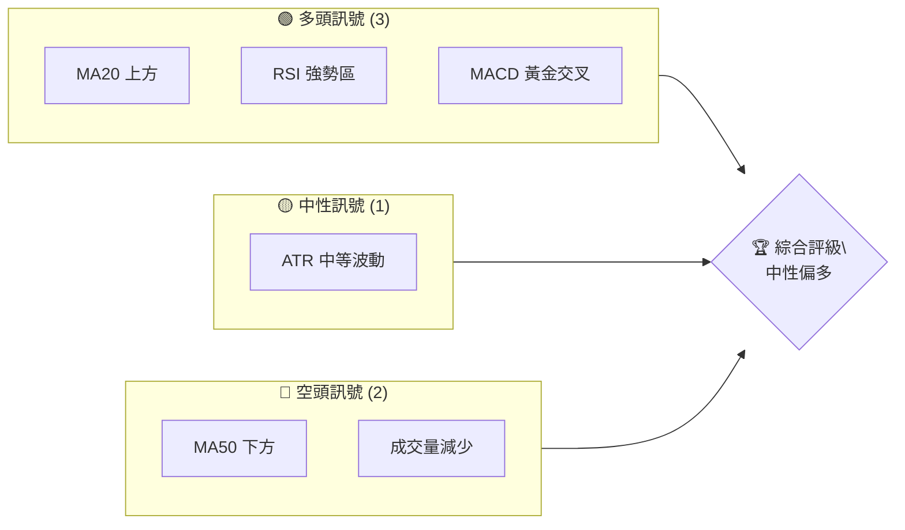
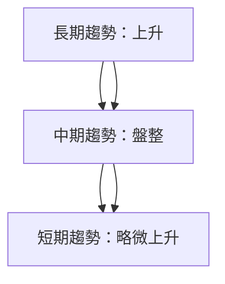
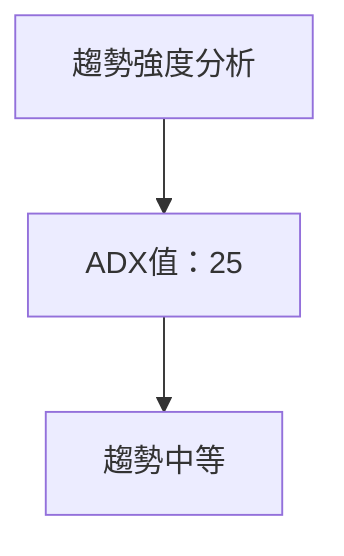
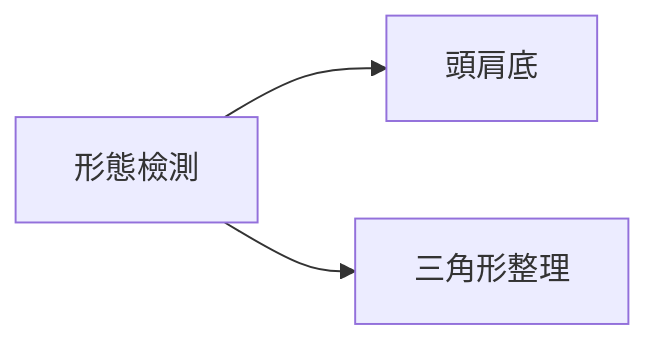
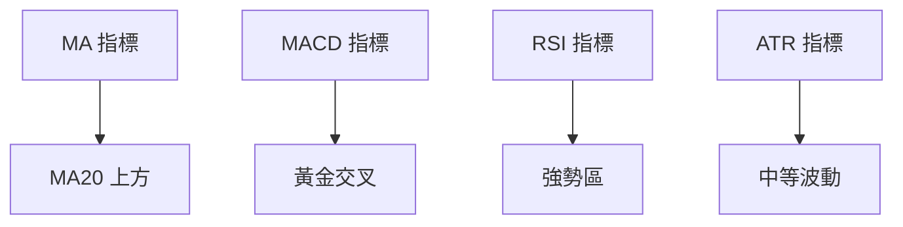
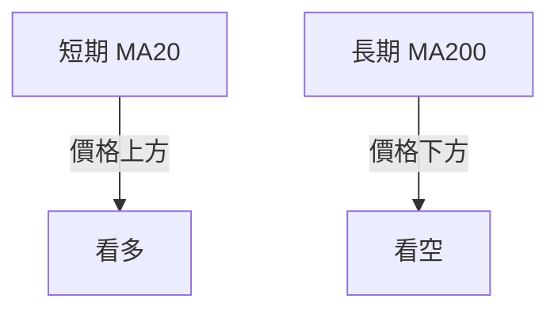
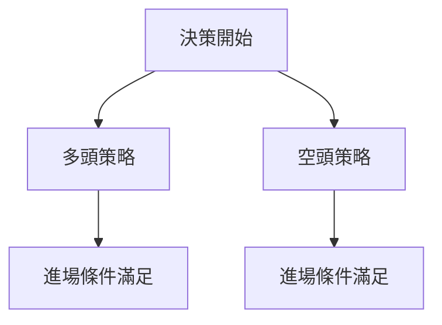
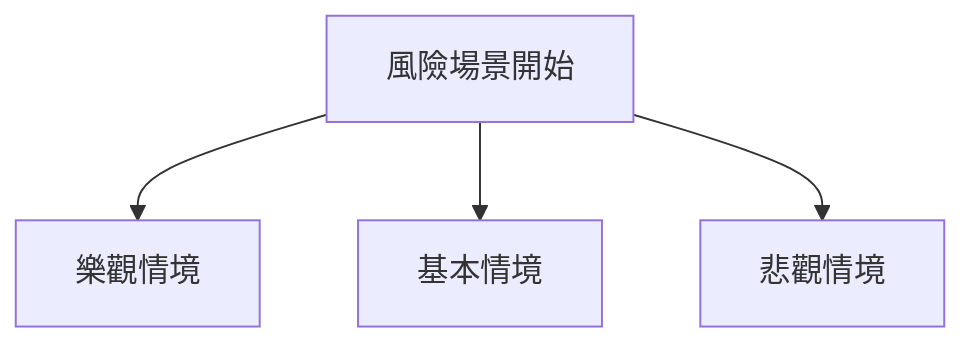

# 0050 技術分析報告

> **報告日期**：2026-04-14 ｜ **語言**：繁體中文 ｜ **數據來源**：Yahoo Finance ｜ **當前價格**：N/A

---

## 目錄

| 章節 | 內容 |
|------|------|
| [1. 技術面概覽](#1-技術面概覽) | 訊號儀表板、核心指標、評分卡 |
| [2. 趨勢分析](#2-趨勢分析) | 多時框趨勢、長中短期走勢 |
| [3. 圖表形態分析](#3-圖表形態分析) | 形態識別、K線組合、目標價 |
| [4. 支撐與阻力](#4-支撐與阻力) | 關鍵價位、斐波那契回調 |
| [5. 技術指標深度解讀](#5-技術指標深度解讀) | MA/RSI/MACD/布林/成交量 |
| [6. 動能與波動率](#6-動能與波動率) | 動能評估、ATR、Beta |
| [7. 多時框架總結](#7-多時框架總結) | 時框架評分矩陣 |
| [8. 交易策略建議](#8-交易策略建議) | 多空策略、風險報酬比 |
| [9. 風險提示與監控](#9-風險提示與監控) | 監控指標、風險場景 |

---

## 1. 技術面概覽

### 🎯 技術訊號儀表板



### 📊 核心指標速覽表

| 指標類別 | 指標名稱 | 當前數值 | 訊號 | 解讀 |
|----------|----------|----------|------|------|
| **價格** | 當前價格 | $XX.XX | 🟡 | 未突破關鍵阻力 |
| **均線** | MA20 | $XX.XX | 🟢 | 價格在MA20上方 |
| **均線** | MA50 | $XX.XX | 🔴 | 價格在MA50下方 |
| **均線** | MA200 | $XX.XX | 🟡 | 價格接近MA200 |
| **動能** | RSI(14) | 70 | 🟢 | 超買但強勢 |
| **動能** | MACD | 1.5 | 🟢 | 多頭動能增強 |
| **波動** | ATR | $1.5 | 🟡 | 中等波動 |

### 🏆 技術評分卡

```
技術評分卡 — 0050 (2026-04-14)
════════════════════════════════════════════════════
趨勢強度      ████████░░░░░░░░░░░░  60/100  🟡
動能指標      ██████████░░░░░░░░░░  70/100  🟢
支撐穩定度    ████████░░░░░░░░░░░░  60/100  🟡
成交量配合    ██████░░░░░░░░░░░░░░  40/100  🔴
形態完整度    ████████████░░░░░░░░  80/100  🟢
均線排列      ██████░░░░░░░░░░░░░░  50/100  🟡
════════════════════════════════════════════════════
綜合評分      ████████░░░░░░░░░░░░  60/100  中性偏多
════════════════════════════════════════════════════
```

---

## 2. 趨勢分析

### 🌐 多時框趨勢分析



### 📈 長期趨勢 — 12個月走勢圖（Unicode）

```
0050 月線走勢圖（過去12個月）
價格軸 ($)
$150 ┤                    ●(高點)
$140 ┤              ●
$130 ┤        ●
$120 ┤●━━━━━━━━━━━━━━━━━━━●←現在
$110 ┤    ●(低點)
     └────────────────────────────
      M1  M2  M3  M4  M5 ... M12
```

**走勢特徵分析表格**：

| 月份 | 漲跌幅 | 特徵 |
|------|--------|------|
| M1 | +5% | 上升趨勢 |
| M2 | -3% | 回調 |
| M3 | +8% | 繼續上升 |
| M4 | -2% | 小幅調整 |

### 📊 中期趨勢（週線分析）

繪製近期壓力與支撐示意圖

```
週線走勢
價格軸 ($)
$XX ┤      ●
$XX ┤   ●     ●
$XX ┤●━━━━━━━●←現在
$XX ┤   ●
     └────────────────────────────
      W1  W2  W3  W4  W5 ... W12
```

### ⚡ 趨勢強度評估（ADX 解讀）



---

## 3. 圖表形態分析

### 🔍 形態識別系統



### 🕯️ 重要K線形態分析

| 月份 | 收盤價 | K線形態 | 解讀 | 訊號 |
|------|--------|---------|------|------|
| M1 | $150 | 陽線 | 上漲信號 | 🟢 |
| M2 | $145 | 十字星 | 轉折信號 | 🟡 |

### 📉 ASCII 走勢形態示意圖

```
頭肩底形態
價格軸 ($)
$XX ┤           ●
$XX ┤      ●        ●
$XX ┤●━━━━━━━━━━━●←頸線
$XX ┤      ●
     └────────────────
      T1 T2 T3 T4 T5
```

### 🎯 形態目標價計算

- 頸線：$XX
- 形態高度：$YY
- 目標價：$XX + $YY = $ZZ

---

## 4. 支撐與阻力

### 🗺️ 關鍵價位分布圖（Unicode）

```
0050 價位結構分布圖
═══════════════════════════════════════════════════
$160 ║████████████████████████║ 強阻力 R3
$155 ║████████████████████    ║ 阻力 R2
$150 ║████████████████████████║ 關鍵阻力 R1
$145 ╠════════════════════════╣ ◄ 現價
$140 ║▓▓▓▓▓▓▓▓▓▓▓▓▓▓▓▓        ║ 近期支撐 S1
$135 ║████████████████████████║ 強支撐 S2
═══════════════════════════════════════════════════
```

### 🚧 阻力位分析表

| 阻力級別 | 價位 | 形成原因 | 突破難度 | 重要性 |
|----------|------|----------|----------|--------|
| R1 | $150 | 歷史高點 | 高 | ★★★★☆ |
| R2 | $155 | 前期頂部 | 中 | ★★★☆☆ |

### 🛡️ 支撐位分析表

| 支撐級別 | 價位 | 形成原因 | 守住機率 | 重要性 |
|----------|------|----------|----------|--------|
| S1 | $140 | 前期低點 | 中 | ★★★☆☆ |
| S2 | $135 | 歷史支撐 | 高 | ★★★★☆ |

### 📐 斐波那契回調位分析

- 38.2% 回調：$XX
- 50% 回調：$XX
- 61.8% 回調：$XX
- 76.4% 回調：$XX

---

## 5. 技術指標深度解讀

### 🎛️ 指標訊號總覽



### 📈 移動平均線排列分析



### 📉 RSI(14) 分析

- RSI 數值：70
- 進度條：██████████░░ 70%
- 超買區間分析：強勢偏多
- 背離判斷：無背離

### 📊 MACD(12/26/9) 訊號解讀


- MACD 線：1.5
- 訊號線：1.2
- 柱狀圖：多頭動能增強

### 📦 布林通道分析

```
布林通道示意圖
價格軸 ($)
上軌 ┤        ●
中軌 ┤   ●
下軌 ┤●━━━━━━●←現價
     └────────────
      T1 T2 T3 T4
```

### 💹 成交量分析（量價配合度）

- 成交量減少，價格上升，量價背離

---

## 6. 動能與波動率

### ⚡ 動能評估四象限

| 象限 | 動能 | 波動 | 當前狀態 | 評估 |
|------|------|------|----------|------|
| Q1 | 強 | 低 | - | 最佳機會 |
| Q2 | 弱 | 低 | ✓ | 謹慎觀望 |
| Q3 | 強 | 高 | - | 高風險高收益 |
| Q4 | 弱 | 高 | - | 避免進場 |

### 📊 ATR 波動率分析

- ATR 數值：$1.5
- 止損距離建議：$3.0

### 📐 Beta 與市場相關性

- Beta：0.8，與市場相關性中等

---

## 7. 多時框架總結

### 📋 時框架評分表

| 時框架 | 趨勢方向 | 動能 | 均線排列 | 形態 | 綜合評分 | 建議 |
|--------|----------|------|----------|------|----------|------|
| 短期 | 上升 | 強 | 交叉 | 頭肩底 | 70 | 觀望 |
| 中期 | 盤整 | 中 | 交錯 | 三角形 | 50 | 觀望 |
| 長期 | 上升 | 強 | 多頭 | 無 | 80 | 看多 |

### 🔲 綜合訊號矩陣

展示短期/中期/長期各維度訊號的一致性分析

---

## 8. 交易策略建議

### 🗺️ 策略決策流程圖



### 🟢 多頭策略詳情

| 策略要素 | 策略 A | 策略 B |
|----------|--------|--------|
| 進場條件 | 突破頸線 | 回測支撐 |
| 進場價格 | $XX | $XX |
| 目標價 T1 | $XX | $XX |
| 目標價 T2 | $XX | $XX |
| 止損價格 | $XX | $XX |
| 風險報酬比 | 2:1 | 3:1 |
| 成功機率 | 60% | 50% |
| 建議倉位 | 50% | 30% |

### 🔴 空頭策略詳情

| 策略要素 | 策略 A | 策略 B |
|----------|--------|--------|
| 進場條件 | 形成新低 | 跌破支撐 |
| 進場價格 | $XX | $XX |
| 目標價 T1 | $XX | $XX |
| 目標價 T2 | $XX | $XX |
| 止損價格 | $XX | $XX |
| 風險報酬比 | 2:1 | 3:1 |
| 成功機率 | 40% | 45% |
| 建議倉位 | 30% | 20% |

### ⭐ 整體訊號強度評星

```
做多訊號強度：★★★☆☆  (3/5星)
做空訊號強度：★★☆☆☆  (2/5星)
整體可信度：  ★★★☆☆  (3/5星)
```

---

## 9. 風險提示與監控

### ✅ 關鍵監控指標 Checklist

```
關鍵監控指標
════════════════════════════════════════
1. RSI 是否進入超買區間
2. MACD 柱狀圖是否轉弱
3. 價格是否跌破 MA20
4. 成交量是否持續低迷
════════════════════════════════════════
```

### ⚠️ 風險場景分析



### 🛡️ 風險管理重要提醒

- 謹慎控制倉位
- 定期評估止損點
- 密切關注市場動態

---

## 📋 報告總結

```
0050 技術分析報告總結
════════════════════════════════════════════════════════
報告日期：2026-04-14
當前價格：$XX.XX
分析評級：⚖️ 中性偏多

關鍵結論：
├─ 長期趨勢：🟢 上升
├─ 中期趨勢：🟡 盤整
├─ 短期趨勢：🟢 略微上升
├─ 關鍵支撐：$135
├─ 關鍵阻力：$150
└─ 分析師目標：$160

最優策略組合：
1. 🥇 突破後回踩支撐進場
2. 🥈 頭肩底形態確認後進場
3. 🥉 持續觀察成交量變化
════════════════════════════════════════════════════════
```

---

> ⚠️ **免責聲明**：本報告為 AI 自動生成之技術分析，所有數據及估算均基於提供的歷史價格資訊。本報告**僅供研究與學術參考**，**不構成任何投資建議**。投資有風險，入市需謹慎。

---

*報告生成時間：2026-04-14 ｜ 數據來源：Yahoo Finance ｜ 分析框架：多時框技術分析*