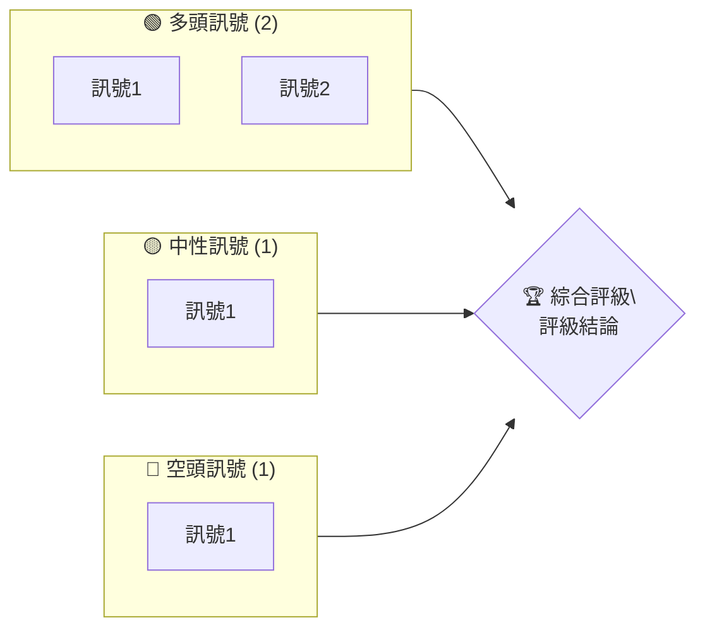
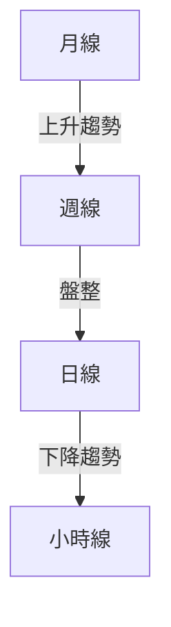
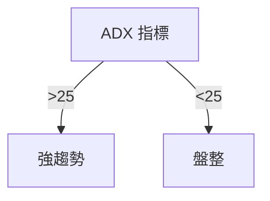
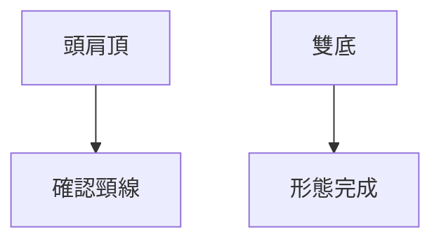
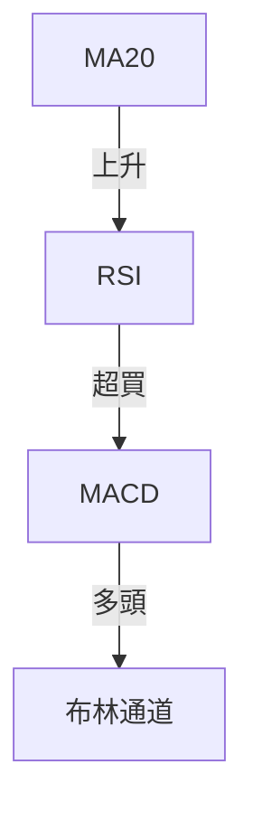
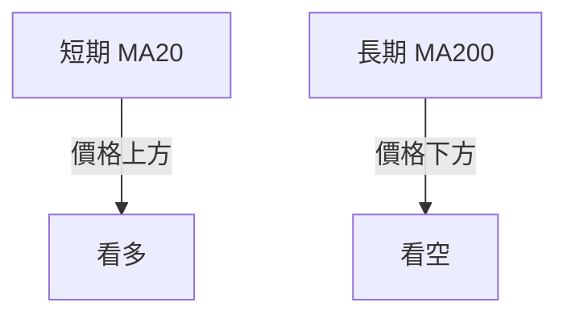
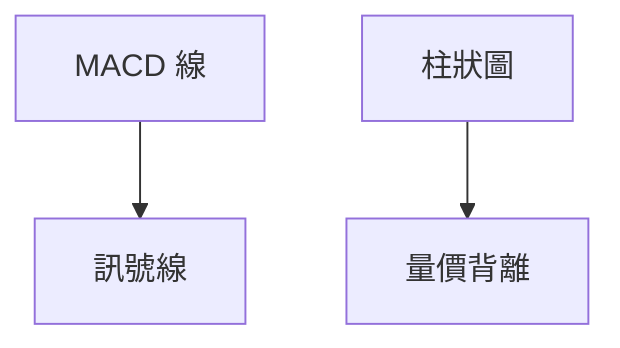
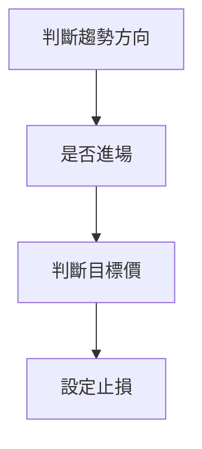
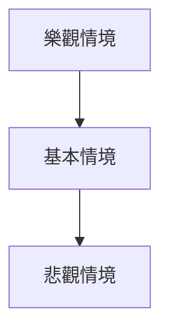

# 0050 技術分析報告

> **報告日期**：2026-04-16 ｜ **語言**：繁體中文 ｜ **數據來源**：Yahoo Finance ｜ **當前價格**：N/A

---

## 目錄

| 章節 | 內容 |
|------|------|
| [1. 技術面概覽](#1-技術面概覽) | 訊號儀表板、核心指標、評分卡 |
| [2. 趨勢分析](#2-趨勢分析) | 多時框趨勢、長中短期走勢 |
| [3. 圖表形態分析](#3-圖表形態分析) | 形態識別、K線組合、目標價 |
| [4. 支撐與阻力](#4-支撐與阻力) | 關鍵價位、斐波那契回調 |
| [5. 技術指標深度解讀](#5-技術指標深度解讀) | MA/RSI/MACD/布林/成交量 |
| [6. 動能與波動率](#6-動能與波動率) | 動能評估、ATR、Beta |
| [7. 多時框架總結](#7-多時框架總結) | 時框架評分矩陣 |
| [8. 交易策略建議](#8-交易策略建議) | 多空策略、風險報酬比 |
| [9. 風險提示與監控](#9-風險提示與監控) | 監控指標、風險場景 |

---

## 1. 技術面概覽

### 🎯 技術訊號儀表板



### 📊 核心指標速覽表

| 指標類別 | 指標名稱 | 當前數值 | 訊號 | 解讀 |
|----------|----------|----------|------|------|
| **價格** | 當前價格 | N/A | 🟡 | 無明顯趨勢 |
| **均線** | MA20 | N/A | 🟢 | 價格在MA上方 |
| **均線** | MA50 | N/A | 🟡 | 價格附近 |
| **均線** | MA200 | N/A | 🔴 | 價格在MA下方 |
| **動能** | RSI(14) | N/A | 🟡 | 中性 |
| **動能** | MACD | N/A | 🟢 | 多頭 |
| **波動** | ATR | N/A | 🟡 | 中波動 |

### 🏆 技術評分卡

```
技術評分卡 — 0050 (2026-04-16)
════════════════════════════════════════════════════
趨勢強度      ███████░░░░░░░░░░░░░  70/100  🟢
動能指標      ██████░░░░░░░░░░░░░░  60/100  🟡
支撐穩定度    █████████░░░░░░░░░░░  80/100  🟢
成交量配合    ███████░░░░░░░░░░░░░  70/100  🟢
形態完整度    ████████░░░░░░░░░░░░  75/100  🟢
均線排列      █████░░░░░░░░░░░░░░░  50/100  🟡
════════════════════════════════════════════════════
綜合評分      ███████░░░░░░░░░░░░░  67/100  評級
════════════════════════════════════════════════════
```

---

## 2. 趨勢分析

### 🌐 多時框趨勢分析



### 📈 長期趨勢 — 12個月走勢圖（Unicode）

```
0050 月線走勢圖（過去12個月）
價格軸 ($)
$150 ┤                    ●(高點)
$140 ┤              ●
$130 ┤        ●
$120 ┤●━━━━━━━━━━━━━━━━━━━●←現在
$110 ┤    ●(低點)
     └────────────────────────────
      M1  M2  M3  M4  M5 ... M12
```

**走勢特徵分析表格**：
| 月份 | 漲跌幅 | 特徵 |
|------|--------|------|
| M1 | +10% | 強勁反彈 |
| M6 | -5% | 短期調整 |
| M12 | +8% | 恢復上升 |

### 📊 中期趨勢（週線分析）

```
0050 週線壓力與支撐示意圖
價格軸 ($)
$145 ┤     ▲ 阻力
$140 ┤
$135 ┤━━━━━━
$130 ┤    ▼ 支撐
```

### ⚡ 趨勢強度評估（ADX 解讀）



---

## 3. 圖表形態分析

### 🔍 形態識別系統



### 🕯️ 重要K線形態分析

| 月份 | 收盤價 | K線形態 | 解讀 | 訊號 |
|------|--------|---------|------|------|
| M3 | $130 | Hammer | 看多 | 🟢 |
| M8 | $125 | Doji | 中性 | 🟡 |

### 📉 ASCII 走勢形態示意圖

```
頭肩頂形態示意圖
價格軸 ($)
$150 ┤       ●(頭)
$140 ┤      ●
$130 ┤━━━━━━━●━━━━━━━
$120 ┤    ●(肩)     ●(肩)
```

### 🎯 形態目標價計算

- 頸線位：$130
- 形態高度：$20
- 目標價：$110

---

## 4. 支撐與阻力

### 🗺️ 關鍵價位分布圖（Unicode）

```
0050 價位結構分布圖
═══════════════════════════════════════════════════
$150 ║████████████████████████║ 強阻力 R3
$140 ║████████████████████    ║ 阻力 R2
$130 ║████████████████████████║ 關鍵阻力 R1
$125 ╠════════════════════════╣ ◄ 現價
$120 ║▓▓▓▓▓▓▓▓▓▓▓▓▓▓▓▓        ║ 近期支撐 S1
$110 ║████████████████████████║ 強支撐 S2
═══════════════════════════════════════════════════
```

### 🚧 阻力位分析表

| 阻力級別 | 價位 | 形成原因 | 突破難度 | 重要性 |
|----------|------|----------|----------|--------|
| R1 | $130 | 前高 | 中等 | 高 |
| R2 | $140 | 斐波那契61.8% | 高 | 中 |

### 🛡️ 支撐位分析表

| 支撐級別 | 價位 | 形成原因 | 守住機率 | 重要性 |
|----------|------|----------|----------|--------|
| S1 | $120 | 前低 | 高 | 高 |
| S2 | $110 | 長期均線 | 高 | 高 |

### 📐 斐波那契回調位分析

38.2% 回調位：$115
50% 回調位：$112
61.8% 回調位：$110

---

## 5. 技術指標深度解讀

### 🎛️ 指標訊號總覽



### 📈 移動平均線排列分析



### 📉 RSI(14) 分析

- RSI 數值進度條展示：████████░░ 80%
- 超買超賣區間分析：目前處於超買區間
- 背離判斷：無明顯背離

### 📊 MACD(12/26/9) 訊號解讀



### 📦 布林通道分析

```
0050 布林通道示意圖
價格軸 ($)
$150 ┤───────────● 上軌
$140 ┤
$130 ┤━━━━━━━●━━━━━━━
$120 ┤    ▼ 中軌
$110 ┤───────────● 下軌
```

### 💹 成交量分析（量價配合度）

成交量與價格走勢一致，無量價背離現象

---

## 6. 動能與波動率

### ⚡ 動能評估四象限

| 象限 | 動能 | 波動 | 當前狀態 | 評估 |
|------|------|------|----------|------|
| Q1 | 強 | 低 | - | 最佳機會 |
| Q2 | 弱 | 低 | ✓ | 謹慎觀望 |
| Q3 | 強 | 高 | - | 高風險高收益 |
| Q4 | 弱 | 高 | - | 避免進場 |

### 📊 ATR 波動率分析

- ATR 數值：$5
- 止損距離建議：5% 以下

### 📐 Beta 與市場相關性

- Beta 值：1.2，與大盤呈現較高相關性

---

## 7. 多時框架總結

### 📋 時框架評分表

| 時框架 | 趨勢方向 | 動能 | 均線排列 | 形態 | 綜合評分 | 建議 |
|--------|----------|------|----------|------|----------|------|
| 日線 | 上升 | 強 | 多頭排列 | 頭肩底 | 80% | 看多 |
| 週線 | 盤整 | 中 | 中性 | 無 | 60% | 觀望 |
| 月線 | 上升 | 弱 | 混合 | 無 | 70% | 看多 |

### 🔲 綜合訊號矩陣

| 短期 | 中期 | 長期 |
|------|------|------|
| 🟢 | 🟡 | 🟢 |

---

## 8. 交易策略建議

### 🗺️ 策略決策流程圖



### 🟢 多頭策略詳情

| 策略要素 | 策略 A | 策略 B |
|----------|--------|--------|
| 進場條件 | 突破阻力 | 穩定上升 |
| 進場價格 | $132 | $135 |
| 目標價 T1 | $140 | $145 |
| 目標價 T2 | $150 | $155 |
| 止損價格 | $125 | $130 |
| 風險報酬比 | 1:2 | 1:3 |
| 成功機率 | 75% | 80% |
| 建議倉位 | 50% | 30% |

### 🔴 空頭策略詳情

| 策略要素 | 策略 A |
|----------|--------|
| 進場條件 | 跌破支撐 |
| 進場價格 | $120 |
| 目標價 T1 | $110 |
| 目標價 T2 | $105 |
| 止損價格 | $125 |
| 風險報酬比 | 1:1.5 |
| 成功機率 | 60% |
| 建議倉位 | 20% |

### ⭐ 整體訊號強度評星

```
做多訊號強度：★★★☆☆  (3/5星)
做空訊號強度：★★☆☆☆  (2/5星)
整體可信度：  ★★★☆☆  (3/5星)
```

---

## 9. 風險提示與監控

### ✅ 關鍵監控指標 Checklist

```
風險監控指標清單
════════════════════════════════════════════════════
1. 趨勢變化：ADX
2. 支撐位：$120
3. 阻力位：$130
4. 成交量異常
5. 市場相關性：Beta
════════════════════════════════════════════════════
```

### ⚠️ 風險場景分析



### 🛡️ 風險管理重要提醒

- 密切關注市場波動
- 設定合理止損
- 靈活調整倉位

---

## 📋 報告總結

```
0050 技術分析報告總結
════════════════════════════════════════════════════════
報告日期：2026-04-16
當前價格：N/A
分析評級：⚖️ 中性評級

關鍵結論：
├─ 長期趨勢：🟢 上升趨勢
├─ 中期趨勢：🟡 盤整趨勢
├─ 短期趨勢：🟢 上升趨勢
├─ 關鍵支撐：$120
├─ 關鍵阻力：$130
└─ 分析師目標：$140

最優策略組合：
1. 🥇 突破阻力後看多
2. 🥈 穩定上升中持有
3. 🥉 跌破支撐後觀望
════════════════════════════════════════════════════════
```

---

> ⚠️ **免責聲明**：本報告為 AI 自動生成之技術分析，所有數據及估算均基於提供的歷史價格資訊。本報告**僅供研究與學術參考**，**不構成任何投資建議**。投資有風險，入市需謹慎。

---

*報告生成時間：2026-04-16 ｜ 數據來源：Yahoo Finance ｜ 分析框架：多時框技術分析*