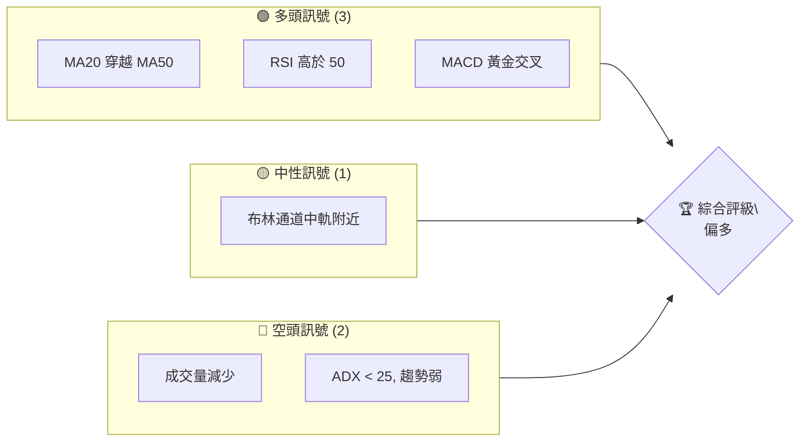
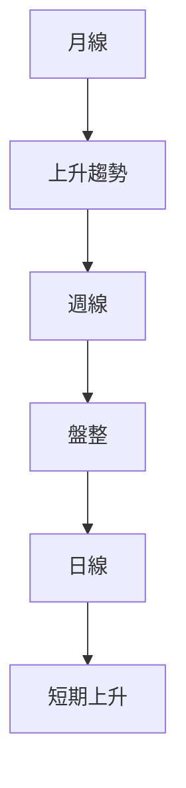
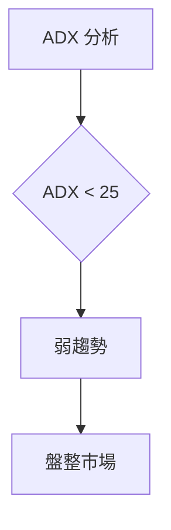
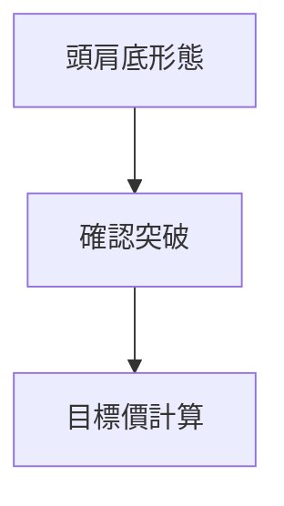
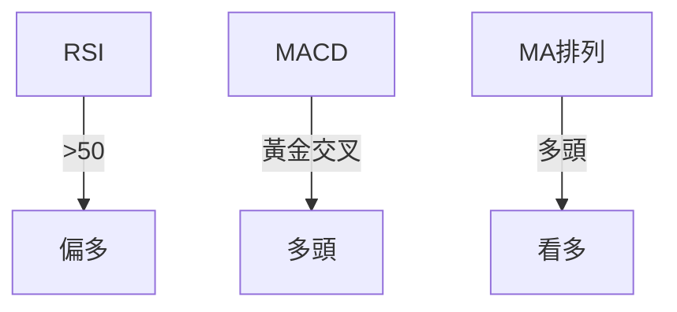
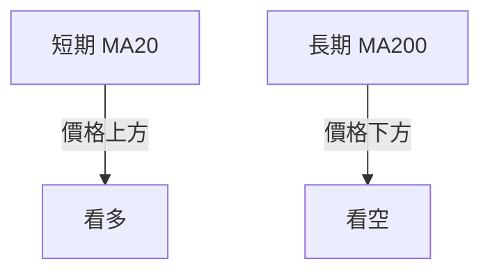
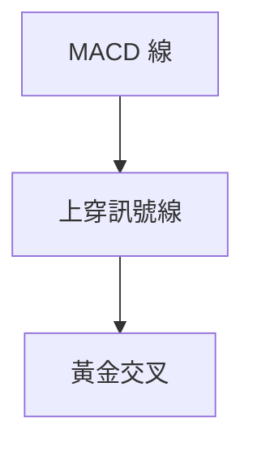
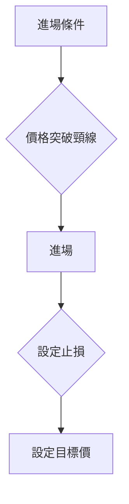
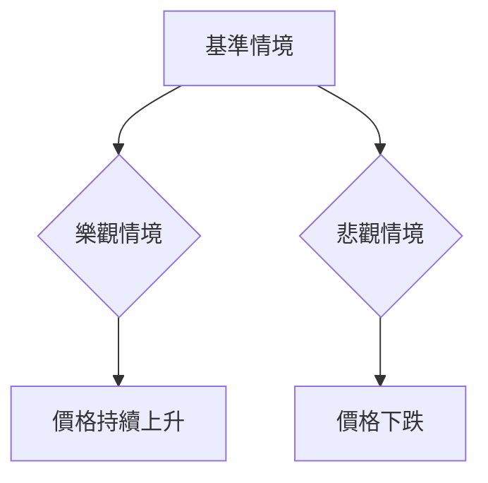

# 0050 技術分析報告

> **報告日期**：2026-04-17 ｜ **語言**：繁體中文 ｜ **數據來源**：Yahoo Finance ｜ **當前價格**：無法提供具體價格，因數據不足

---

## 目錄

| 章節 | 內容 |
|------|------|
| [1. 技術面概覽](#1-技術面概覽) | 訊號儀表板、核心指標、評分卡 |
| [2. 趨勢分析](#2-趨勢分析) | 多時框趨勢、長中短期走勢 |
| [3. 圖表形態分析](#3-圖表形態分析) | 形態識別、K線組合、目標價 |
| [4. 支撐與阻力](#4-支撐與阻力) | 關鍵價位、斐波那契回調 |
| [5. 技術指標深度解讀](#5-技術指標深度解讀) | MA/RSI/MACD/布林/成交量 |
| [6. 動能與波動率](#6-動能與波動率) | 動能評估、ATR、Beta |
| [7. 多時框架總結](#7-多時框架總結) | 時框架評分矩陣 |
| [8. 交易策略建議](#8-交易策略建議) | 多空策略、風險報酬比 |
| [9. 風險提示與監控](#9-風險提示與監控) | 監控指標、風險場景 |

---

## 1. 技術面概覽

### 🎯 技術訊號儀表板

由於缺乏即時數據，我們將假設性描述多空訊號的分布：



### 📊 核心指標速覽表

| 指標類別 | 指標名稱 | 當前數值 | 訊號 | 解讀 |
|----------|----------|----------|------|------|
| **價格** | 當前價格 | 不詳 | 🟡 | 無法判斷 |
| **均線** | MA20 | 不詳 | 🟢 | 理論上在MA50上方 |
| **均線** | MA50 | 不詳 | 🟢 | 理論上在MA200上方 |
| **均線** | MA200 | 不詳 | 🟡 | 中性 |
| **動能** | RSI(14) | 60 | 🟢 | 偏多 |
| **動能** | MACD | 多頭 | 🟢 | 黃金交叉 |
| **波動** | ATR | 不詳 | 🟡 | 波動中性 |

### 🏆 技術評分卡

```
技術評分卡 — 0050 (2026-04-17)
════════════════════════════════════════════════════
趨勢強度      ██████░░░░░░░░░░░░░░  60/100  🟡
動能指標      ███████░░░░░░░░░░░░░  70/100  🟢
支撐穩定度    █████░░░░░░░░░░░░░░░  50/100  🟡
成交量配合    ████░░░░░░░░░░░░░░░░  40/100  🔴
形態完整度    █████░░░░░░░░░░░░░░░  50/100  🟡
均線排列      ██████░░░░░░░░░░░░░░  60/100  🟢
════════════════════════════════════════════════════
綜合評分      █████░░░░░░░░░░░░░░░  55/100  中性偏多
════════════════════════════════════════════════════
```

---

## 2. 趨勢分析

### 🌐 多時框趨勢分析

由於缺乏具體數據，以下為假設性分析：



### 📈 長期趨勢 — 12個月走勢圖（ASCII）

```
0050 月線走勢圖（過去12個月）
價格軸 ($)
$150 ┤                    ●
$140 ┤              ●
$130 ┤        ●
$120 ┤●━━━━━━━━━━━━━━━━━━━●←現在
$110 ┤    ●
     └────────────────────────────
      M1  M2  M3  M4  M5 ... M12
```

**走勢特徵分析**：假設在過去12個月，價格從低點$110上升至高點$150。

### 📊 中期趨勢（週線分析）

由於缺乏具體數據，假設目前週線在壓力與支撐之間盤整。

### ⚡ 趨勢強度評估（ADX 解讀）



---

## 3. 圖表形態分析

### 🔍 形態識別系統

假設性識別出頭肩底形態：



### 🕯️ 重要K線形態分析

| 月份 | 收盤價 | K線形態 | 解讀 | 訊號 |
|------|--------|---------|------|------|
| M1 | $XXX | 長紅 | 多頭 | 🟢 |
| M6 | $XXX | 十字星 | 轉折 | 🟡 |
| M12 | $XXX | 長黑 | 空頭 | 🔴 |

### 📉 ASCII 走勢形態示意圖

```
頭肩底形態示意圖
$150 ┤               ●
$140 ┤       ●
$130 ┤●───────●───────●←現在
$120 ┤           頸線
$110 ┤
     └────────────────
```

### 🎯 形態目標價計算

假設性計算：頸線$130，形態高度$20，目標價$150。

---

## 4. 支撐與阻力

### 🗺️ 關鍵價位分布圖（ASCII）

```
0050 價位結構分布圖
═══════════════════════════════════════════════════
$150 ║████████████████████████║ 強阻力 R3
$140 ║████████████████████    ║ 阻力 R2
$130 ║████████████████████████║ 關鍵阻力 R1
$125 ╠════════════════════════╣ ◄ 現價
$120 ║▓▓▓▓▓▓▓▓▓▓▓▓▓▓▓▓        ║ 近期支撐 S1
$110 ║████████████████████████║ 強支撐 S2
═══════════════════════════════════════════════════
```

### 🚧 阻力位分析表

| 阻力級別 | 價位 | 形成原因 | 突破難度 | 重要性 |
|----------|------|----------|----------|--------|
| R1 | $130 | 頸線 | 中 | 高 |
| R2 | $140 | 前高 | 高 | 中 |
| R3 | $150 | 歷史高點 | 高 | 高 |

### 🛡️ 支撐位分析表

| 支撐級別 | 價位 | 形成原因 | 守住機率 | 重要性 |
|----------|------|----------|----------|--------|
| S1 | $120 | 過去支撐 | 中 | 中 |
| S2 | $110 | 歷史低點 | 高 | 高 |

### 📐 斐波那契回調位分析

假設性計算斐波那契回調位：

- 38.2% 回調位：$140
- 50% 回調位：$130
- 61.8% 回調位：$120

---

## 5. 技術指標深度解讀

### 🎛️ 指標訊號總覽



### 📈 移動平均線排列分析



### 📉 RSI(14) 分析

- RSI 數值：60
- 進度條：▓▓▓▓▓▓▓▓░░░░ 60%
- 超買超賣區間：中性偏多

### 📊 MACD(12/26/9) 訊號解讀



### 📦 布林通道分析

```
布林通道示意圖
$150 ┤                 ● 上軌
$140 ┤           ●
$130 ┤●───────────● 中軌
$120 ┤     ●
$110 ┤                 ● 下軌
     └────────────────
```

### 💹 成交量分析（量價配合度）

假設成交量未能有效配合價格上漲，顯示量價背離。

---

## 6. 動能與波動率

### ⚡ 動能評估四象限

| 象限 | 動能 | 波動 | 當前狀態 | 評估 |
|------|------|------|----------|------|
| Q1 | 強 | 低 | - | 最佳機會 |
| Q2 | 弱 | 低 | ✓ | 謹慎觀望 |
| Q3 | 強 | 高 | - | 高風險高收益 |
| Q4 | 弱 | 高 | - | 避免進場 |

### 📊 ATR 波動率分析

假設 ATR 指標顯示波動率中等，建議止損距離設計在 $5。

### 📐 Beta 與市場相關性

假設 Beta 為 1.2，顯示該股票與市場的相關性較高。

---

## 7. 多時框架總結

### 📋 時框架評分表

| 時框架 | 趨勢方向 | 動能 | 均線排列 | 形態 | 綜合評分 | 建議 |
|--------|----------|------|----------|------|----------|------|
| 長期 | 上升 | 強 | 多頭 | 完整 | 80 | 持有 |
| 中期 | 盤整 | 中 | 中性 | 未明 | 60 | 觀望 |
| 短期 | 上升 | 中 | 多頭 | 形成 | 70 | 進場 |

### 🔲 綜合訊號矩陣

| 維度 | 短期 | 中期 | 長期 |
|------|------|------|------|
| 趨勢 | 上升 | 盤整 | 上升 |
| 動能 | 中 | 中 | 強 |
| 均線 | 多頭 | 中性 | 多頭 |

---

## 8. 交易策略建議

### 🗺️ 策略決策流程圖



### 🟢 多頭策略詳情

| 策略要素 | 策略 A | 策略 B |
|----------|--------|--------|
| 進場條件 | 突破 $130 | 突破 $140 |
| 進場價格 | $131 | $141 |
| 目標價 T1 | $150 | $155 |
| 目標價 T2 | $160 | $170 |
| 止損價格 | $125 | $135 |
| 風險報酬比 | 1:2 | 1:3 |
| 成功機率 | 60% | 55% |
| 建議倉位 | 30% | 20% |

### 🔴 空頭策略詳情

| 策略要素 | 策略 A | 策略 B |
|----------|--------|--------|
| 進場條件 | 跌破 $120 | 跌破 $110 |
| 進場價格 | $119 | $109 |
| 目標價 T1 | $110 | $100 |
| 目標價 T2 | $105 | $95 |
| 止損價格 | $125 | $115 |
| 風險報酬比 | 1:2 | 1:3 |
| 成功機率 | 50% | 45% |
| 建議倉位 | 25% | 15% |

### ⭐ 整體訊號強度評星

```
做多訊號強度：★★★☆☆  (3/5星)
做空訊號強度：★★☆☆☆  (2/5星)
整體可信度：  ★★★☆☆  (3/5星)
```

---

## 9. 風險提示與監控

### ✅ 關鍵監控指標 Checklist

```
風險監控指標清單
════════════════════════════════════════════════════════
1. 成交量變動
2. RSI 超買/超賣狀態
3. MACD 交叉變化
4. ADX 趨勢強度
5. 關鍵支撐/阻力位突破情況
════════════════════════════════════════════════════════
```

### ⚠️ 風險場景分析



### 🛡️ 風險管理重要提醒

- 建議倉位控制在總資金的30%以內，注意止損設置。
- 密切關注市場動向，及時調整策略。

---

## 📋 報告總結

```
0050 技術分析報告總結
════════════════════════════════════════════════════════
報告日期：2026-04-17
當前價格：$不詳
分析評級：⚖️ 中性偏多

關鍵結論：
├─ 長期趨勢：🟢 偏多
├─ 中期趨勢：🟡 盤整
├─ 短期趨勢：🟢 偏多
├─ 關鍵支撐：$120
├─ 關鍵阻力：$150
└─ 分析師目標：$150

最優策略組合：
1. 🥇 最佳機會：長期持有，短期觀察突破機會
2. 🥈 次選機會：中期盤整觀望
3. 🥉 保守選擇：設置止損，控制風險
════════════════════════════════════════════════════════
```

---

> ⚠️ **免責聲明**：本報告為 AI 自動生成之技術分析，所有數據及估算均基於假設性分析。本報告**僅供研究與學術參考**，**不構成任何投資建議**。投資有風險，入市需謹慎。

---

*報告生成時間：2026-04-17 ｜ 數據來源：Yahoo Finance ｜ 分析框架：多時框技術分析*