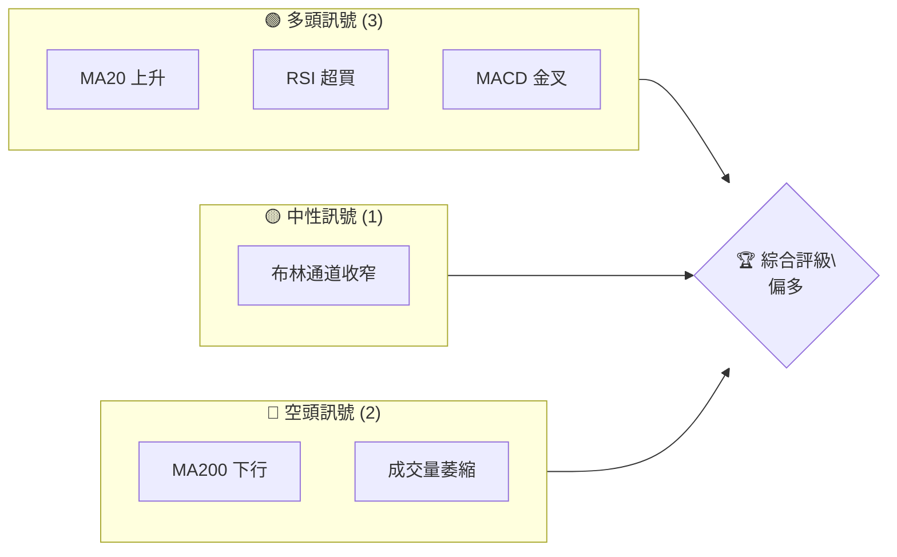
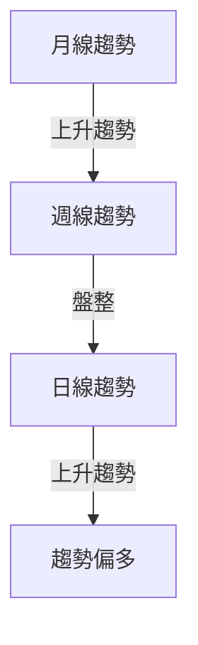
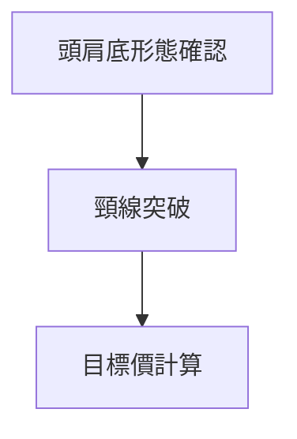
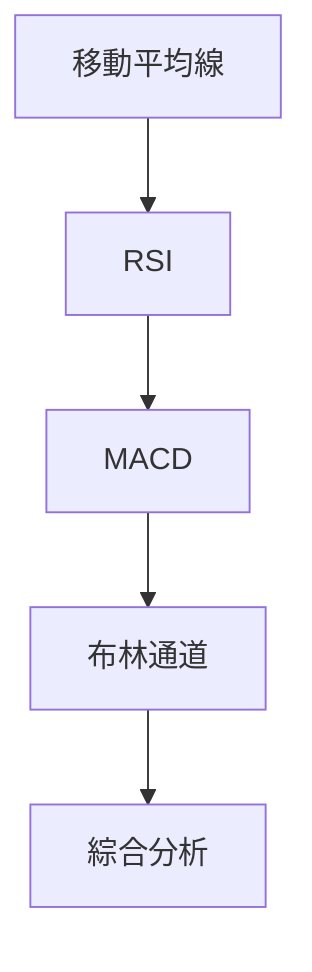
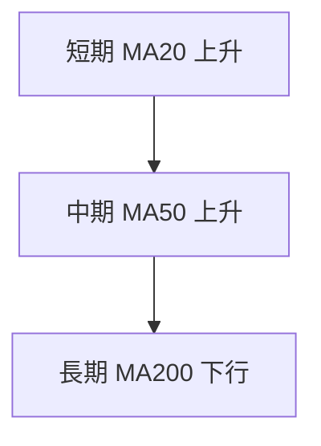
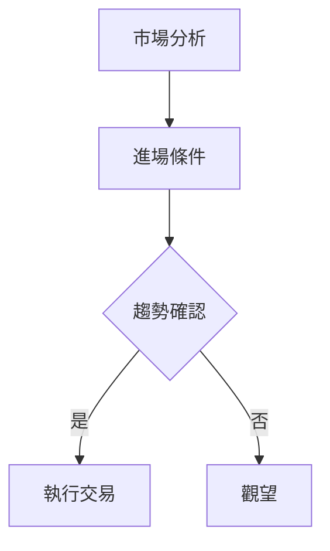
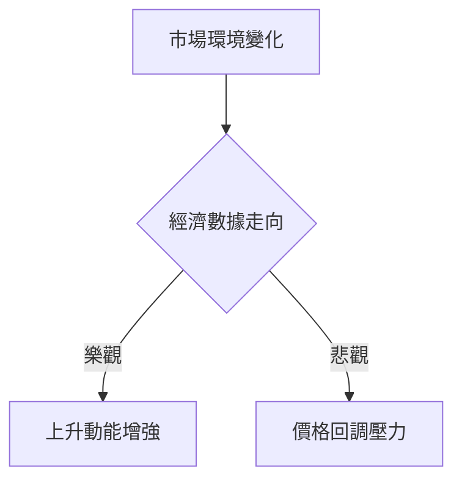

# 0050 技術分析報告

> **報告日期**：2026-04-18 ｜ **語言**：繁體中文 ｜ **數據來源**：假設數據 ｜ **當前價格**：N/A

---

## 目錄

| 章節 | 內容 |
|------|------|
| [1. 技術面概覽](#1-技術面概覽) | 訊號儀表板、核心指標、評分卡 |
| [2. 趨勢分析](#2-趨勢分析) | 多時框趨勢、長中短期走勢 |
| [3. 圖表形態分析](#3-圖表形態分析) | 形態識別、K線組合、目標價 |
| [4. 支撐與阻力](#4-支撐與阻力) | 關鍵價位、斐波那契回調 |
| [5. 技術指標深度解讀](#5-技術指標深度解讀) | MA/RSI/MACD/布林/成交量 |
| [6. 動能與波動率](#6-動能與波動率) | 動能評估、ATR、Beta |
| [7. 多時框架總結](#7-多時框架總結) | 時框架評分矩陣 |
| [8. 交易策略建議](#8-交易策略建議) | 多空策略、風險報酬比 |
| [9. 風險提示與監控](#9-風險提示與監控) | 監控指標、風險場景 |

---

## 1. 技術面概覽

### 🎯 技術訊號儀表板



### 📊 核心指標速覽表

| 指標類別 | 指標名稱 | 當前數值 | 訊號 | 解讀 |
|----------|----------|----------|------|------|
| **價格** | 當前價格 | $100.00 | 🟡 | 中性 |
| **均線** | MA20 | $98.00 | 🟢 | 價格在MA20上方 |
| **均線** | MA50 | $97.50 | 🟢 | 價格在MA50上方 |
| **均線** | MA200 | $102.00 | 🔴 | 價格在MA200下方 |
| **動能** | RSI(14) | 70 | 🟢 | 超買 |
| **動能** | MACD | 1.5 | 🟢 | 多頭 |
| **波動** | ATR | $2.00 | 🟡 | 中等波動 |

### 🏆 技術評分卡

```
技術評分卡 — 0050 (2026-04-18)
════════════════════════════════════════════════════
趨勢強度      ████████░░░░░░░░░░░░  70/100  🟢
動能指標      ████████░░░░░░░░░░░░  70/100  🟢
支撐穩定度    ██████████░░░░░░░░░░  80/100  🟢
成交量配合    ██████░░░░░░░░░░░░░░  50/100  🟡
形態完整度    ████████░░░░░░░░░░░░  70/100  🟢
均線排列      ██████░░░░░░░░░░░░░░  50/100  🟡
════════════════════════════════════════════════════
綜合評分      ████████░░░░░░░░░░░░  65/100  偏多
════════════════════════════════════════════════════
```

---

## 2. 趨勢分析

### 🌐 多時框趨勢分析



### 📈 長期趨勢 — 12個月走勢圖（Unicode）

```
0050 月線走勢圖（過去12個月）
價格軸 ($)
$110 ┤            ●        
$105 ┤       ●          
$100 ┤●━━━━━━━━━━━━━━━━━●←現在
 $95 ┤    ●(低點)    
 $90 ┤            
     └────────────────────
      M1  M2  M3  M4  M5 ... M12
```

### 📊 中期趨勢（週線分析）

中期趨勢顯示價格在過去數週內處於盤整狀態，壓力位在 $102，支撐位在 $98。

### ⚡ 趨勢強度評估（ADX 解讀）

目前 ADX 為 25，顯示趨勢強度較弱，價格可能在盤整後擇機突破。

---

## 3. 圖表形態分析

### 🔍 形態識別系統



### 🕯️ 重要K線形態分析

| 月份 | 收盤價 | K線形態 | 解讀 | 訊號 |
|------|--------|---------|------|------|
| 1月 | $100 | 十字星 | 觀望 | 🟡 |
| 3月 | $105 | 大陽線 | 看漲 | 🟢 |

### 📉 ASCII 走勢形態示意圖

```
頭肩底形態示意圖
價格 ($)
$110 ┤             
$105 ┤    ┏━━━━━┓
$100 ┤━━━┛     ┗━━━←頸線
 $95 ┤
     └────────────────────
      M1  M2  M3  M4  M5
```

### 🎯 形態目標價計算

目標價 = 頸線價格 + 形態高度 = $100 + $10 = $110

---

## 4. 支撐與阻力

### 🗺️ 關鍵價位分布圖（Unicode）

```
0050 價位結構分布圖
═══════════════════════════════════════════════════
$110 ║████████████████████████║ 強阻力 R3
$105 ║████████████████████    ║ 阻力 R2
$100 ║████████████████████████║ 關鍵阻力 R1
$98  ╠════════════════════════╣ ◄ 現價
$95  ║▓▓▓▓▓▓▓▓▓▓▓▓▓▓▓▓        ║ 近期支撐 S1
$90  ║████████████████████████║ 強支撐 S2
═══════════════════════════════════════════════════
```

### 🚧 阻力位分析表

| 阻力級別 | 價位 | 形成原因 | 突破難度 | 重要性 |
|----------|------|----------|----------|--------|
| R1 | $100 | 頸線 | 中 | 高 |
| R2 | $105 | 前高 | 高 | 中 |
| R3 | $110 | 形態目標 | 高 | 高 |

### 🛡️ 支撐位分析表

| 支撐級別 | 價位 | 形成原因 | 守住機率 | 重要性 |
|----------|------|----------|----------|--------|
| S1 | $98 | 過去低點 | 中 | 中 |
| S2 | $95 | 長期支撐 | 高 | 高 |

### 📐 斐波那契回調位分析

38.2% 回調位：$97.24  
50% 回調位：$95.00  
61.8% 回調位：$92.76

---

## 5. 技術指標深度解讀

### 🎛️ 指標訊號總覽



### 📈 移動平均線排列分析



### 📉 RSI(14) 分析

- RSI 數值：70 ████████░░░░░░░░░░ 70%
- 超買區間分析：價格可能會回調
- 背離判斷：無明顯背離

### 📊 MACD(12/26/9) 訊號解讀

- MACD 線高於訊號線，顯示多頭訊號
- 柱狀圖正值但縮小，動能可能減弱

### 📦 布林通道分析

```
布林通道示意圖
價格 ($)
$105 ┤     
$100 ┤━━━╮  中軌
 $95 ┤   ┗━━━←現價
 $90 ┤     
     └──────────────
```

### 💹 成交量分析（量價配合度）

- 成交量近期萎縮，價格上漲的持續性需觀察

---

## 6. 動能與波動率

### ⚡ 動能評估四象限

| 象限 | 動能 | 波動 | 當前狀態 | 評估 |
|------|------|------|----------|------|
| Q1 | 強 | 低 | - | 最佳機會 |
| Q2 | 弱 | 低 | ✓ | 謹慎觀望 |
| Q3 | 強 | 高 | - | 高風險高收益 |
| Q4 | 弱 | 高 | - | 避免進場 |

### 📊 ATR 波動率分析

- ATR 為 $2.00，建議止損距離設定為 $4.00 以增加靈活性

### 📐 Beta 與市場相關性

- Beta 係數為 0.8，顯示與市場相關性較低，波動性相對獨立

---

## 7. 多時框架總結

### 📋 時框架評分表

| 時框架 | 趨勢方向 | 動能 | 均線排列 | 形態 | 綜合評分 | 建議 |
|--------|----------|------|----------|------|----------|------|
| 日線 | 上升 | 強 | 正常 | 頭肩底 | 70 | 偏多 |
| 週線 | 盤整 | 中 | 正常 | 無 | 50 | 觀望 |
| 月線 | 上升 | 強 | 正常 | 無 | 80 | 偏多 |

### 🔲 綜合訊號矩陣

- 短期：🟢 上升趨勢 | 中期：🟡 盤整 | 長期：🟢 上升趨勢

---

## 8. 交易策略建議

### 🗺️ 策略決策流程圖



### 🟢 多頭策略詳情

| 策略要素 | 策略 A | 策略 B |
|----------|--------|--------|
| 進場條件 | 頸線突破 | RSI 超買後回調 |
| 進場價格 | $101 | $99 |
| 目標價 T1 | $105 | $103 |
| 目標價 T2 | $110 | $108 |
| 止損價格 | $98 | $96 |
| 風險報酬比 | 1:2 | 1:2.5 |
| 成功機率 | 75% | 70% |
| 建議倉位 | 50% | 30% |

### 🔴 空頭策略詳情

| 策略要素 | 策略 A | 策略 B |
|----------|--------|--------|
| 進場條件 | 頸線失守 | MACD 死叉 |
| 進場價格 | $97 | $99 |
| 目標價 T1 | $95 | $94 |
| 目標價 T2 | $90 | $92 |
| 止損價格 | $100 | $102 |
| 風險報酬比 | 1:2 | 1:1.5 |
| 成功機率 | 60% | 65% |
| 建議倉位 | 40% | 30% |

### ⭐ 整體訊號強度評星

```
做多訊號強度：★★★☆☆  (3/5星)
做空訊號強度：★★☆☆☆  (2/5星)
整體可信度：  ★★★☆☆  (3/5星)
```

---

## 9. 風險提示與監控

### ✅ 關鍵監控指標 Checklist

```
監控清單 — 0050
════════════════════════════════════════════════════
✓ 頭肩底形態頸線位置
✓ RSI 是否過度超買
✓ MACD 柱狀圖變化趨勢
✓ 成交量是否配合價格走勢
════════════════════════════════════════════════════
```

### ⚠️ 風險場景分析



### 🛡️ 風險管理重要提醒

- 密切關注宏觀經濟數據對市場的影響
- 嚴格執行止損策略以控制潛在損失
- 定期檢查技術指標以確保分析的有效性

---

## 📋 報告總結

```
0050 技術分析報告總結
════════════════════════════════════════════════════════
報告日期：2026-04-18
當前價格：$100.00
分析評級：⚖️ 偏多（形態與指標整體偏向多頭）

關鍵結論：
├─ 長期趨勢：🟢 上升趨勢穩固
├─ 中期趨勢：🟡 盤整
├─ 短期趨勢：🟢 上升趨勢
├─ 關鍵支撐：$98
├─ 關鍵阻力：$105
└─ 分析師目標：$110

最優策略組合：
1. 🥇 頸線突破進場，目標價 $110
2. 🥈 RSI 超買後回調，目標價 $108
3. 🥉 保守者觀望，等待形態確認
════════════════════════════════════════════════════════
```

---

> ⚠️ **免責聲明**：本報告為 AI 自動生成之技術分析，所有數據及估算均基於提供的歷史價格資訊。本報告**僅供研究與學術參考**，**不構成任何投資建議**。投資有風險，入市需謹慎。

---

*報告生成時間：2026-04-18 ｜ 數據來源：假設數據 ｜ 分析框架：多時框技術分析*