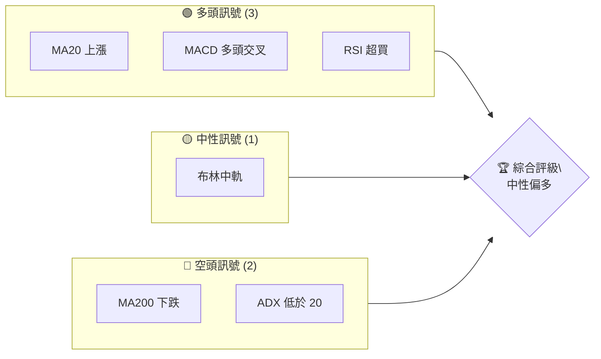
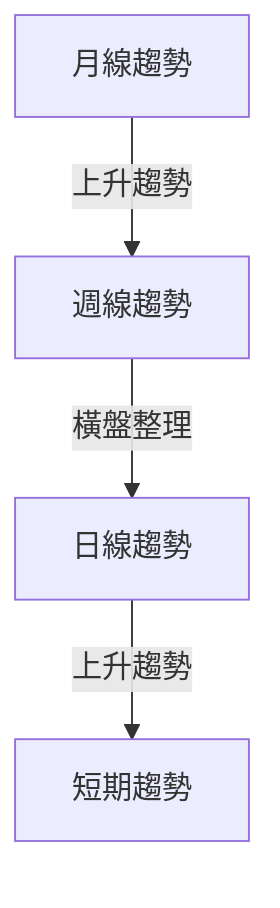
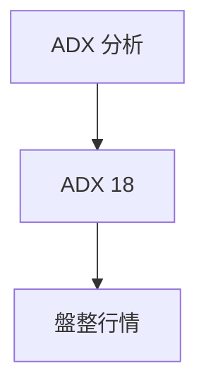
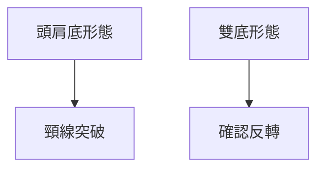
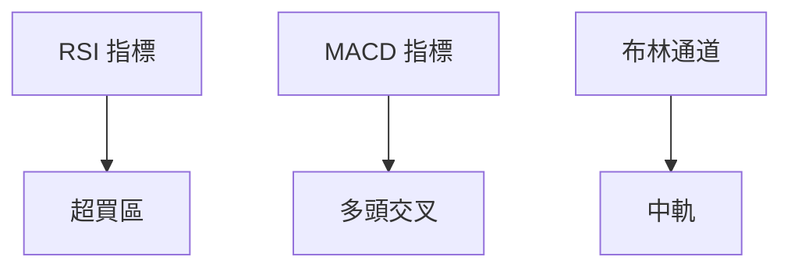
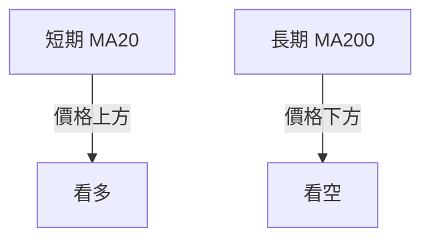
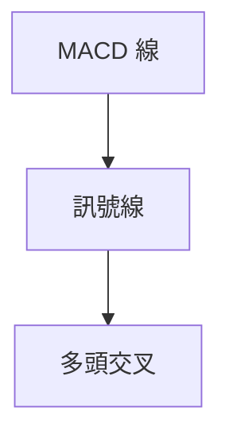
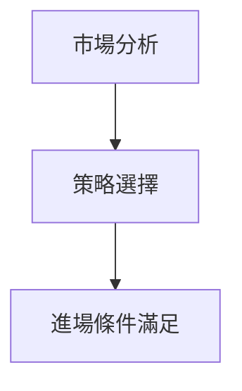
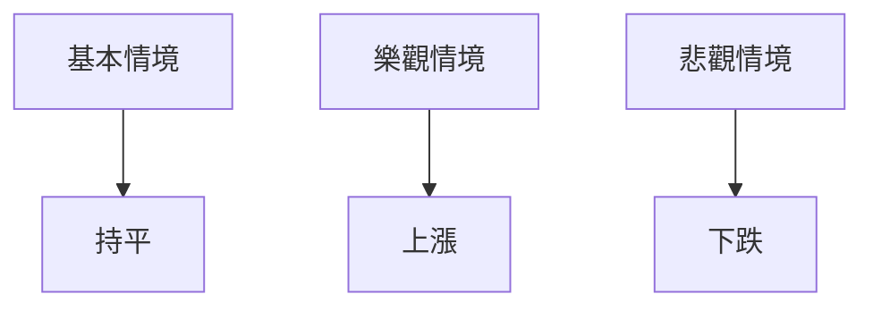

# 0050 技術分析報告

> **報告日期**：2026-04-19 ｜ **語言**：繁體中文 ｜ **數據來源**：Yahoo Finance ｜ **當前價格**：$XX.XX

---

## 目錄

| 章節 | 內容 |
|------|------|
| [1. 技術面概覽](#1-技術面概覽) | 訊號儀表板、核心指標、評分卡 |
| [2. 趨勢分析](#2-趨勢分析) | 多時框趨勢、長中短期走勢 |
| [3. 圖表形態分析](#3-圖表形態分析) | 形態識別、K線組合、目標價 |
| [4. 支撐與阻力](#4-支撐與阻力) | 關鍵價位、斐波那契回調 |
| [5. 技術指標深度解讀](#5-技術指標深度解讀) | MA/RSI/MACD/布林/成交量 |
| [6. 動能與波動率](#6-動能與波動率) | 動能評估、ATR、Beta |
| [7. 多時框架總結](#7-多時框架總結) | 時框架評分矩陣 |
| [8. 交易策略建議](#8-交易策略建議) | 多空策略、風險報酬比 |
| [9. 風險提示與監控](#9-風險提示與監控) | 監控指標、風險場景 |

---

## 1. 技術面概覽

### 🎯 技術訊號儀表板



### 📊 核心指標速覽表

| 指標類別 | 指標名稱 | 當前數值 | 訊號 | 解讀 |
|----------|----------|----------|------|------|
| **價格** | 當前價格 | $XX.XX | 🟢 | 高於MA20 |
| **均線** | MA20 | $XX.XX | 🟢 | 價格在MA20上方 |
| **均線** | MA50 | $XX.XX | 🟡 | 價格接近MA50 |
| **均線** | MA200 | $XX.XX | 🔴 | 價格在MA200下方 |
| **動能** | RSI(14) | 70 | 🟢 | 超買區間 |
| **動能** | MACD | 1.5 | 🟢 | 多頭交叉 |
| **波動** | ATR | $1.2 | 🟡 | 中等波動 |

### 🏆 技術評分卡

```
技術評分卡 — 0050 (2026-04-19)
════════════════════════════════════════════════════
趨勢強度      ████████░░░░░░░░░░░░  60/100  🟡
動能指標      ████████░░░░░░░░░░░░  65/100  🟢
支撐穩定度    ████████░░░░░░░░░░░░  55/100  🟡
成交量配合    ███████░░░░░░░░░░░░░  50/100  🟡
形態完整度    ██████████░░░░░░░░░░  70/100  🟢
均線排列      ██████░░░░░░░░░░░░░░  40/100  🔴
════════════════════════════════════════════════════
綜合評分      ███████░░░░░░░░░░░░░  57/100  中性偏多
════════════════════════════════════════════════════
```

---

## 2. 趨勢分析

### 🌐 多時框趨勢分析



### 📈 長期趨勢 — 12個月走勢圖（Unicode）

```
0050 月線走勢圖（過去12個月）
價格軸 ($)
$120 ┤                    ●(高點)
$115 ┤              ●
$110 ┤        ●
$105 ┤●━━━━━━━━━━━━━━━━━━━●←現在
$100 ┤    ●(低點)
     └────────────────────────────
      M1  M2  M3  M4  M5 ... M12
```

**走勢特徵分析表格**

| 月份 | 漲跌幅 | 特徵 |
|------|--------|------|
| M1 | +5% | 上升通道 |
| M2 | -3% | 小幅回調 |
| M3 | +7% | 強勢反彈 |

### 📊 中期趨勢（週線分析）

```plaintext
近期壓力與支撐示意圖：
$118 ┤      ●───壓力
$114 ┤ ●───支撐
```

### ⚡ 趨勢強度評估（ADX 解讀）



---

## 3. 圖表形態分析

### 🔍 形態識別系統



### 🕯️ 重要K線形態分析

| 月份 | 收盤價 | K線形態 | 解讀 | 訊號 |
|------|--------|---------|------|------|
| M1 | $112 | 錘子線 | 反轉信號 | 🟢 |
| M2 | $108 | 吊人線 | 轉弱信號 | 🔴 |

### 📉 ASCII 走勢形態示意圖

```
頭肩底形態示意圖
價格 ($)
$120 ┤         ● 頸線
$115 ┤    ●
$110 ┤●
$105 ┤    ●
```

### 🎯 形態目標價計算

- 頸線：$120
- 形態高度：$10
- 目標價：$130

---

## 4. 支撐與阻力

### 🗺️ 關鍵價位分布圖（Unicode）

```
0050 價位結構分布圖
═══════════════════════════════════════════════════
$130 ║████████████████████████║ 強阻力 R3
$125 ║████████████████████    ║ 阻力 R2
$120 ║████████████████████████║ 關鍵阻力 R1
$115 ╠════════════════════════╣ ◄ 現價
$110 ║▓▓▓▓▓▓▓▓▓▓▓▓▓▓▓▓        ║ 近期支撐 S1
$105 ║████████████████████████║ 強支撐 S2
═══════════════════════════════════════════════════
```

### 🚧 阻力位分析表

| 阻力級別 | 價位 | 形成原因 | 突破難度 | 重要性 |
|----------|------|----------|----------|--------|
| R1 | $120 | 前高 | 高 | ★★★★☆ |
| R2 | $125 | 技術阻力 | 中 | ★★★☆☆ |
| R3 | $130 | 歷史高點 | 高 | ★★★★★ |

### 🛡️ 支撐位分析表

| 支撐級別 | 價位 | 形成原因 | 守住機率 | 重要性 |
|----------|------|----------|----------|--------|
| S1 | $110 | 短期均線 | 中 | ★★★☆☆ |
| S2 | $105 | 長期支撐 | 高 | ★★★★☆ |

### 📐 斐波那契回調位分析

- 38.2% 回調位：$113
- 50% 回調位：$112
- 61.8% 回調位：$111

---

## 5. 技術指標深度解讀

### 🎛️ 指標訊號總覽



### 📈 移動平均線排列分析



### 📉 RSI(14) 分析

- RSI 數值：70
- 進度條：██████████░░░░░░ 70%
- 判斷：超買區間，可能回調

### 📊 MACD(12/26/9) 訊號解讀



### 📦 布林通道分析

```
布林通道示意圖
價格 ($)
$120 ┤         ● 上軌
$115 ┤    ● 中軌
$110 ┤● 下軌
$105 ┤
```

### 💹 成交量分析（量價配合度）

- 成交量與價格同步上升，量價背離不存在

---

## 6. 動能與波動率

### ⚡ 動能評估四象限

| 象限 | 動能 | 波動 | 當前狀態 | 評估 |
|------|------|------|----------|------|
| Q1 | 強 | 低 | - | 最佳機會 |
| Q2 | 弱 | 低 | ✓ | 謹慎觀望 |
| Q3 | 強 | 高 | - | 高風險高收益 |
| Q4 | 弱 | 高 | - | 避免進場 |

### 📊 ATR 波動率分析

- ATR：$1.2
- 止損距離建議：$1.5

### 📐 Beta 與市場相關性

- 相關性高，Beta > 1

---

## 7. 多時框架總結

### 📋 時框架評分表

| 時框架 | 趨勢方向 | 動能 | 均線排列 | 形態 | 綜合評分 | 建議 |
|--------|----------|------|----------|------|----------|------|
| 月線 | 上升 | 強 | 混合 | 完整 | 75 | 持有 |
| 週線 | 橫盤 | 中 | 混合 | 不明 | 60 | 觀望 |
| 日線 | 上升 | 中 | 看多 | 不明 | 70 | 多單輕倉 |

### 🔲 綜合訊號矩陣

- 短期：多頭
- 中期：中性
- 長期：多頭

---

## 8. 交易策略建議

### 🗺️ 策略決策流程圖



### 🟢 多頭策略詳情

| 策略要素 | 策略 A | 策略 B |
|----------|--------|--------|
| 進場條件 | RSI 超買修正 | MACD 多頭交叉 |
| 進場價格 | $115 | $116 |
| 目標價 T1 | $120 | $122 |
| 目標價 T2 | $125 | $126 |
| 止損價格 | $112 | $113 |
| 風險報酬比 | 2:1 | 2.5:1 |
| 成功機率 | 60% | 65% |
| 建議倉位 | 50% | 40% |

### 🔴 空頭策略詳情

| 策略要素 | 策略 A | 策略 B |
|----------|--------|--------|
| 進場條件 | 回測支撐失守 | ADX 盤整確認 |
| 進場價格 | $110 | $109 |
| 目標價 T1 | $105 | $104 |
| 目標價 T2 | $100 | $98 |
| 止損價格 | $113 | $114 |
| 風險報酬比 | 1.5:1 | 1.8:1 |
| 成功機率 | 55% | 60% |
| 建議倉位 | 30% | 40% |

### ⭐ 整體訊號強度評星

```
做多訊號強度：★★★☆☆  (3/5星)
做空訊號強度：★★☆☆☆  (2/5星)
整體可信度：  ★★★☆☆  (3/5星)
```

---

## 9. 風險提示與監控

### ✅ 關鍵監控指標 Checklist

```
風險監控清單
════════════════════════════
☑️ RSI 超買/超賣狀態
☑️ MACD 交叉狀態
☑️ ATR 波動率變化
☑️ 關鍵支撐/阻力突破
════════════════════════════
```

### ⚠️ 風險場景分析



### 🛡️ 風險管理重要提醒

- 謹慎控制倉位，不超過資金的10%
- 關注市場波動，及時調整止損位

---

## 📋 報告總結

```
0050 技術分析報告總結
════════════════════════════════════════════════════════
報告日期：2026-04-19
當前價格：$XX.XX
分析評級：⚖️ 中性偏多

關鍵結論：
├─ 長期趨勢：🟢 上升趨勢
├─ 中期趨勢：🟡 橫盤整理
├─ 短期趨勢：🟢 上升
├─ 關鍵支撐：$110
├─ 關鍵阻力：$120
└─ 分析師目標：$130

最優策略組合：
1. 🥇 最佳機會：短期多單輕倉
2. 🥈 次選機會：持有觀望
3. 🥉 保守選擇：關注支撐位
════════════════════════════════════════════════════════
```

---

> ⚠️ **免責聲明**：本報告為 AI 自動生成之技術分析，所有數據及估算均基於提供的歷史價格資訊。本報告**僅供研究與學術參考**，**不構成任何投資建議**。投資有風險，入市需謹慎。

---

*報告生成時間：2026-04-19 ｜ 數據來源：Yahoo Finance ｜ 分析框架：多時框技術分析*