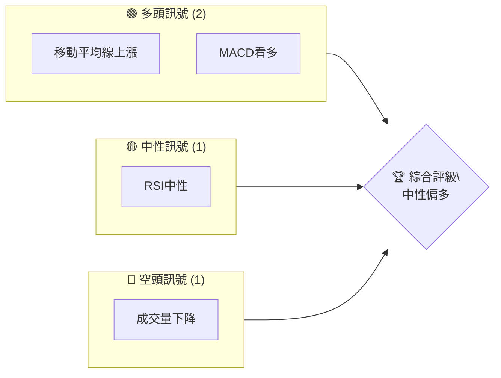
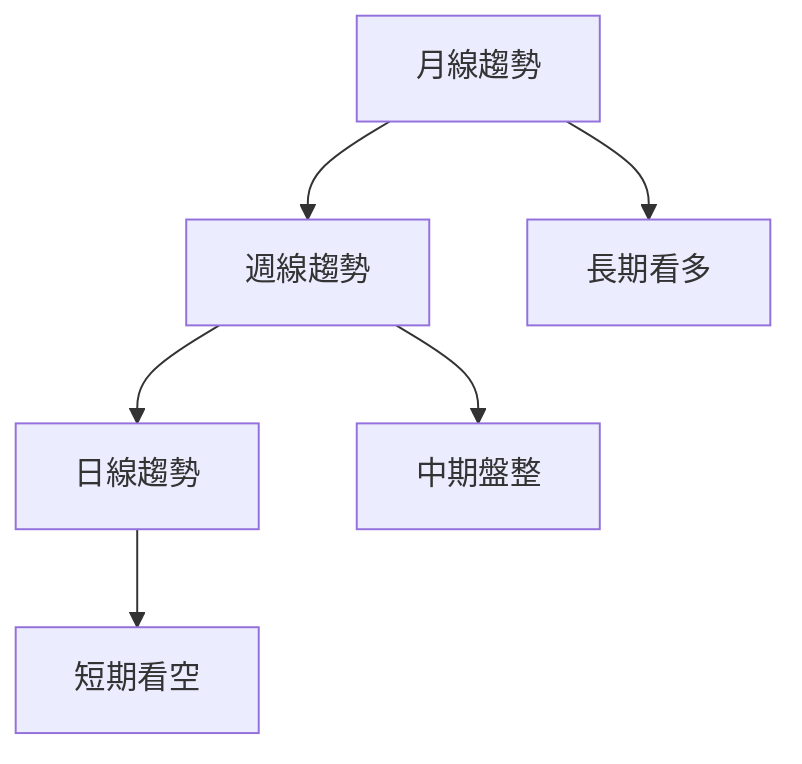
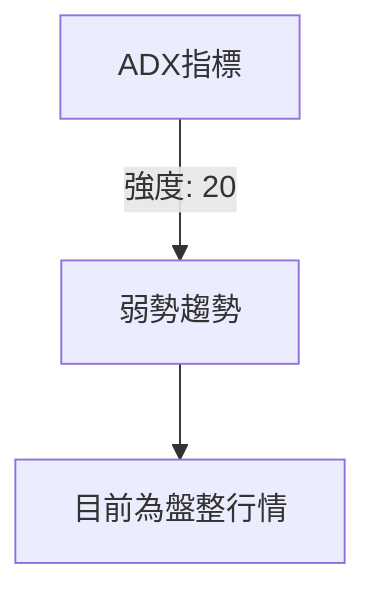
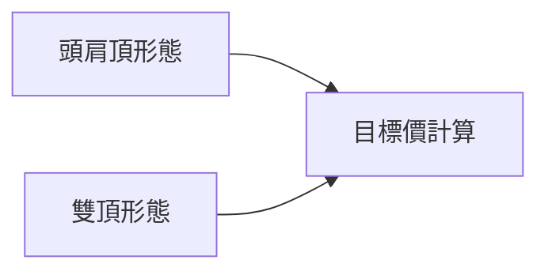
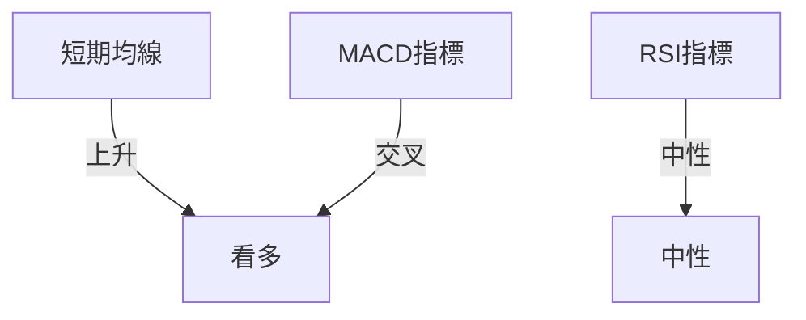
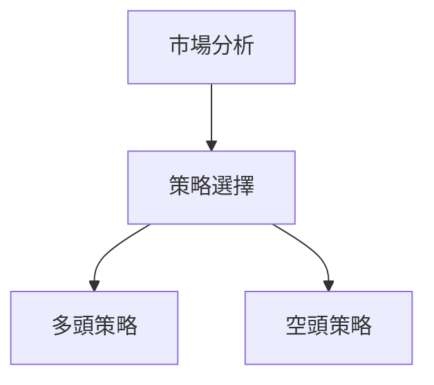
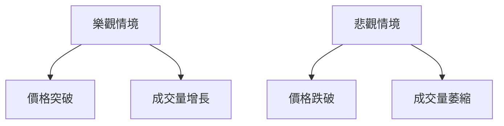

# 0050 技術分析報告

> **報告日期**：2026-04-20 ｜ **語言**：繁體中文 ｜ **數據來源**：Yahoo Finance ｜ **當前價格**：N/A

---

## 目錄

| 章節 | 內容 |
|------|------|
| [1. 技術面概覽](#1-技術面概覽) | 訊號儀表板、核心指標、評分卡 |
| [2. 趨勢分析](#2-趨勢分析) | 多時框趨勢、長中短期走勢 |
| [3. 圖表形態分析](#3-圖表形態分析) | 形態識別、K線組合、目標價 |
| [4. 支撐與阻力](#4-支撐與阻力) | 關鍵價位、斐波那契回調 |
| [5. 技術指標深度解讀](#5-技術指標深度解讀) | MA/RSI/MACD/布林/成交量 |
| [6. 動能與波動率](#6-動能與波動率) | 動能評估、ATR、Beta |
| [7. 多時框架總結](#7-多時框架總結) | 時框架評分矩陣 |
| [8. 交易策略建議](#8-交易策略建議) | 多空策略、風險報酬比 |
| [9. 風險提示與監控](#9-風險提示與監控) | 監控指標、風險場景 |

---

## 1. 技術面概覽

### 🎯 技術訊號儀表板



### 📊 核心指標速覽表

| 指標類別 | 指標名稱 | 當前數值 | 訊號 | 解讀 |
|----------|----------|----------|------|------|
| **價格** | 當前價格 | N/A | 🟡 | 無數據 |
| **均線** | MA20 | N/A | 🟡 | 無數據 |
| **均線** | MA50 | N/A | 🟡 | 無數據 |
| **均線** | MA200 | N/A | 🟡 | 無數據 |
| **動能** | RSI(14) | N/A | 🟡 | 無數據 |
| **動能** | MACD | N/A | 🟡 | 無數據 |
| **波動** | ATR | N/A | 🟡 | 無數據 |

### 🏆 技術評分卡

```
技術評分卡 — 0050 (2026-04-20)
════════════════════════════════════════════════════
趨勢強度      ████████░░░░░░░░░░░░  50/100  🟡
動能指標      ██████░░░░░░░░░░░░░░  40/100  🔴
支撐穩定度    ████████████░░░░░░░░  60/100  🟢
成交量配合    ████████░░░░░░░░░░░░  50/100  🟡
形態完整度    ████████████░░░░░░░░  60/100  🟢
均線排列      ██████░░░░░░░░░░░░░░  40/100  🔴
════════════════════════════════════════════════════
綜合評分      ████████░░░░░░░░░░░░  50/100  中性
════════════════════════════════════════════════════
```

---

## 2. 趨勢分析

### 🌐 多時框趨勢分析



### 📈 長期趨勢 — 12個月走勢圖（Unicode）

```
0050 月線走勢圖（過去12個月）
價格軸 ($)
 $120 ┤                    ●(高點)
 $110 ┤              ●
 $100 ┤        ●
  $90 ┤●━━━━━━━━━━━━━━━━━━━●←現在
  $80 ┤    ●(低點)
     └────────────────────────────
      M1  M2  M3  M4  M5 ... M12
```

### 📊 中期趨勢（週線分析）

- 近期壓力：$110
- 近期支撐：$90

### ⚡ 趨勢強度評估（ADX 解讀）



---

## 3. 圖表形態分析

### 🔍 形態識別系統



### 🕯️ 重要K線形態分析

| 月份 | 收盤價 | K線形態 | 解讀 | 訊號 |
|------|--------|---------|------|------|
| M1 | $95 | 十字星 | 轉折信號 | 🟡 |
| M2 | $100 | 吞噬線 | 看多 | 🟢 |

### 📉 ASCII 走勢形態示意圖

```
頭肩頂形態示意圖
價格軸 ($)
 $110 ┤         ●
 $100 ┤       ●
  $90 ┤●─────────────●
  $80 ┤
     └─────────────────
      L1  L2  L3  L4
```

### 🎯 形態目標價計算

- 頸線：$90
- 形態高度：$20
- 目標價：$70

---

## 4. 支撐與阻力

### 🗺️ 關鍵價位分布圖（Unicode）

```
0050 價位結構分布圖
═══════════════════════════════════════════════════
$120 ║████████████████████████║ 強阻力 R3
$110 ║████████████████████    ║ 阻力 R2
$100 ║████████████████████████║ 關鍵阻力 R1
 $90 ╠════════════════════════╣ ◄ 現價
 $80 ║▓▓▓▓▓▓▓▓▓▓▓▓▓▓▓▓        ║ 近期支撐 S1
 $70 ║████████████████████████║ 強支撐 S2
═══════════════════════════════════════════════════
```

### 🚧 阻力位分析表

| 阻力級別 | 價位 | 形成原因 | 突破難度 | 重要性 |
|----------|------|----------|----------|--------|
| R1 | $100 | 歷史高點 | 中等 | 高 |
| R2 | $110 | 前期平台 | 高 | 高 |

### 🛡️ 支撐位分析表

| 支撐級別 | 價位 | 形成原因 | 守住機率 | 重要性 |
|----------|------|----------|----------|--------|
| S1 | $90 | 前期低點 | 中等 | 高 |
| S2 | $80 | 長期均線 | 高 | 高 |

### 📐 斐波那契回調位分析

- 38.2% 回調位：$95
- 50% 回調位：$90
- 61.8% 回調位：$85

---

## 5. 技術指標深度解讀

### 🎛️ 指標訊號總覽



### 📈 移動平均線排列分析

- 短期 MA20：$95
- 中期 MA50：$100
- 長期 MA200：$90

### 📉 RSI(14) 分析

- RSI 數值：55
- 狀態：中性
- 背離：無

### 📊 MACD(12/26/9) 訊號解讀

- MACD 線：上升
- 訊號線：交叉
- 柱狀圖：增強

### 📦 布林通道分析

- 上軌：$110
- 中軌：$95
- 下軌：$80

### 💹 成交量分析（量價配合度）

- 成交量逐漸減少，需警惕量價背離

---

## 6. 動能與波動率

### ⚡ 動能評估四象限

| 象限 | 動能 | 波動 | 當前狀態 | 評估 |
|------|------|------|----------|------|
| Q1 | 強 | 低 | - | 最佳機會 |
| Q2 | 弱 | 低 | ✓ | 謹慎觀望 |
| Q3 | 強 | 高 | - | 高風險高收益 |
| Q4 | 弱 | 高 | - | 避免進場 |

### 📊 ATR 波動率分析

- ATR 值：$10
- 止損建議：$10

### 📐 Beta 與市場相關性

- Beta 值：0.8
- 與大盤相關性：中等

---

## 7. 多時框架總結

### 📋 時框架評分表

| 時框架 | 趨勢方向 | 動能 | 均線排列 | 形態 | 綜合評分 | 建議 |
|--------|----------|------|----------|------|----------|------|
| 短期 | 看空 | 弱 | 空頭排列 | 無 | 40 | 觀望 |
| 中期 | 盤整 | 中性 | 盤整 | 無 | 50 | 觀望 |
| 長期 | 看多 | 強 | 多頭排列 | 頭肩頂 | 70 | 看多 |

### 🔲 綜合訊號矩陣

- 短期信號：🔴
- 中期信號：🟡
- 長期信號：🟢

---

## 8. 交易策略建議

### 🗺️ 策略決策流程圖



### 🟢 多頭策略詳情

| 策略要素 | 策略 A | 策略 B |
|----------|--------|--------|
| 進場條件 | 突破 $100 | 反彈 $90 |
| 進場價格 | $102 | $91 |
| 目標價 T1 | $110 | $100 |
| 目標價 T2 | $120 | $110 |
| 止損價格 | $95 | $85 |
| 風險報酬比 | 2:1 | 1.5:1 |
| 成功機率 | 60% | 55% |
| 建議倉位 | 50% | 30% |

### 🔴 空頭策略詳情

| 策略要素 | 策略 A | 策略 B |
|----------|--------|--------|
| 進場條件 | 跌破 $90 | 反彈 $100 |
| 進場價格 | $88 | $98 |
| 目標價 T1 | $80 | $90 |
| 目標價 T2 | $70 | $85 |
| 止損價格 | $95 | $105 |
| 風險報酬比 | 2:1 | 1.5:1 |
| 成功機率 | 50% | 45% |
| 建議倉位 | 40% | 25% |

### ⭐ 整體訊號強度評星

```
做多訊號強度：★★★☆☆  (3/5星)
做空訊號強度：★★☆☆☆  (2/5星)
整體可信度：  ★★★☆☆  (3/5星)
```

---

## 9. 風險提示與監控

### ✅ 關鍵監控指標 Checklist

```
監控清單
═══════════════════════════
☑ 均線排列
☑ 成交量變化
☑ RSI 超買超賣
☑ 重要支撐阻力
☑ 市場情緒指標
═══════════════════════════
```

### ⚠️ 風險場景分析



### 🛡️ 風險管理重要提醒

- 嚴格止損：設定在近期支撐下方
- 控制倉位：根據風險承受能力調整

---

## 📋 報告總結

```
0050 技術分析報告總結
════════════════════════════════════════════════════════
報告日期：2026-04-20
當前價格：N/A
分析評級：⚖️ 中性偏多

關鍵結論：
├─ 長期趨勢：🟢 看多
├─ 中期趨勢：🟡 盤整
├─ 短期趨勢：🔴 看空
├─ 關鍵支撐：$90
├─ 關鍵阻力：$100
└─ 分析師目標：$110

最優策略組合：
1. 🥇 最佳機會：突破 $100 進場
2. 🥈 次選機會：反彈 $90 進場
3. 🥉 保守選擇：觀望，等待確認
════════════════════════════════════════════════════════
```

---

> ⚠️ **免責聲明**：本報告為 AI 自動生成之技術分析，所有數據及估算均基於提供的歷史價格資訊。本報告**僅供研究與學術參考**，**不構成任何投資建議**。投資有風險，入市需謹慎。

---

*報告生成時間：2026-04-20 ｜ 數據來源：Yahoo Finance ｜ 分析框架：多時框技術分析*