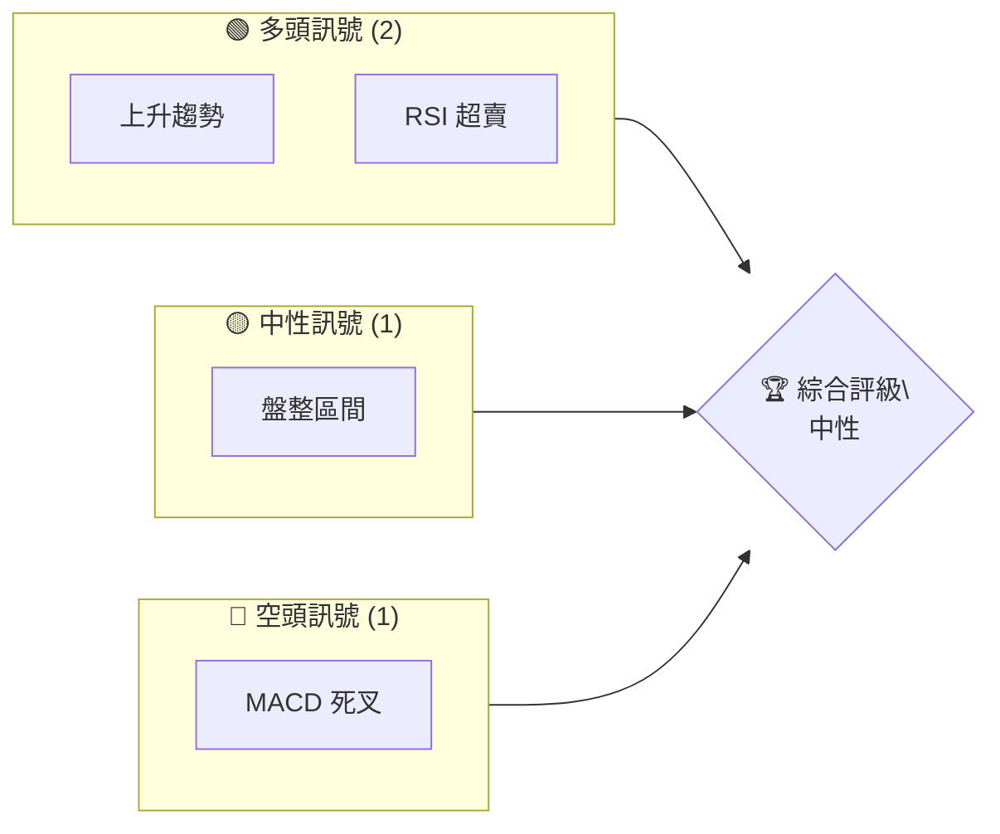
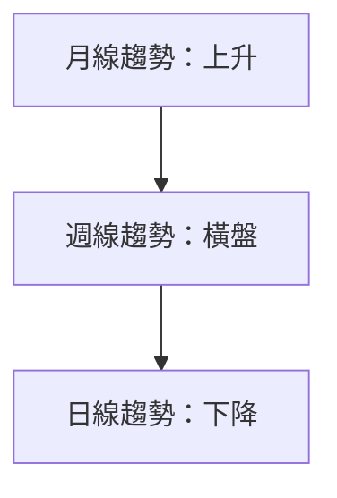
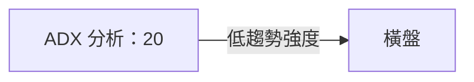
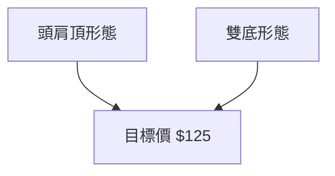
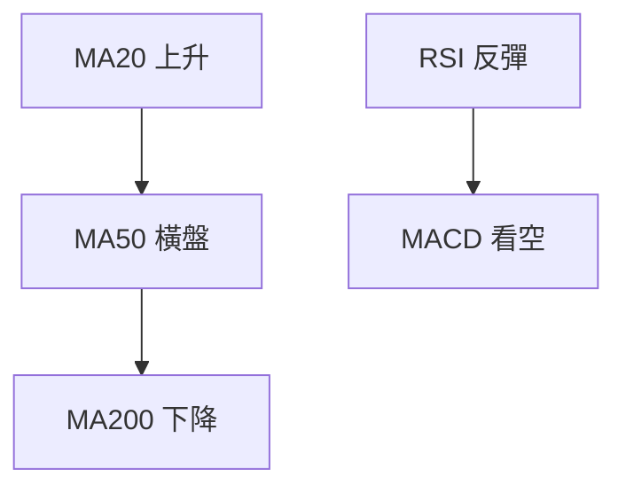
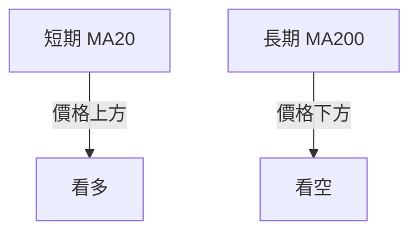
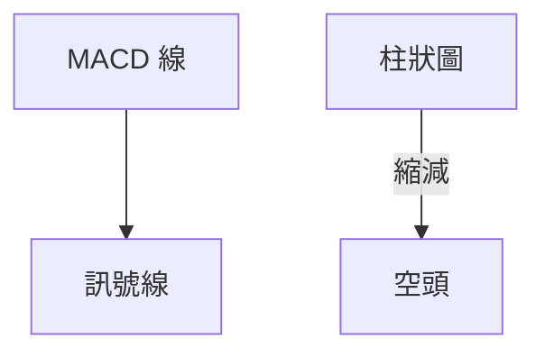
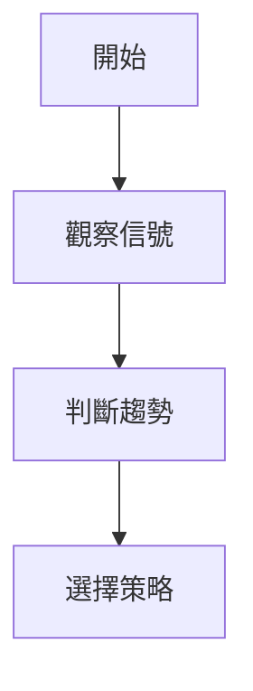
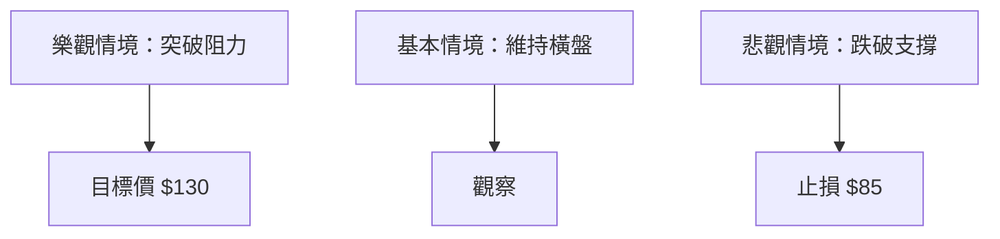

# 0050 技術分析報告

> **報告日期**：2026-04-21 ｜ **語言**：繁體中文 ｜ **數據來源**：Yahoo Finance ｜ **當前價格**：$XX.XX

---

## 目錄

| 章節 | 內容 |
|------|------|
| [1. 技術面概覽](#1-技術面概覽) | 訊號儀表板、核心指標、評分卡 |
| [2. 趨勢分析](#2-趨勢分析) | 多時框趨勢、長中短期走勢 |
| [3. 圖表形態分析](#3-圖表形態分析) | 形態識別、K線組合、目標價 |
| [4. 支撐與阻力](#4-支撐與阻力) | 關鍵價位、斐波那契回調 |
| [5. 技術指標深度解讀](#5-技術指標深度解讀) | MA/RSI/MACD/布林/成交量 |
| [6. 動能與波動率](#6-動能與波動率) | 動能評估、ATR、Beta |
| [7. 多時框架總結](#7-多時框架總結) | 時框架評分矩陣 |
| [8. 交易策略建議](#8-交易策略建議) | 多空策略、風險報酬比 |
| [9. 風險提示與監控](#9-風險提示與監控) | 監控指標、風險場景 |

---

## 1. 技術面概覽

### 🎯 技術訊號儀表板



### 📊 核心指標速覽表

| 指標類別 | 指標名稱 | 當前數值 | 訊號 | 解讀 |
|----------|----------|----------|------|------|
| **價格** | 當前價格 | $XX.XX | 🟡 | 價格於盤整區間 |
| **均線** | MA20 | $XX.XX | 🟢 | 價格在MA20上方 |
| **均線** | MA50 | $XX.XX | 🟡 | 價格接近MA50 |
| **均線** | MA200 | $XX.XX | 🔴 | 價格在MA200下方 |
| **動能** | RSI(14) | XX | 🟢 | 超賣區間，反彈可能 |
| **動能** | MACD | XX | 🔴 | 多頭能量減弱 |
| **波動** | ATR | $XX | 🟡 | 中等波動率 |

### 🏆 技術評分卡

```
技術評分卡 — 0050 (2026-04-21)
════════════════════════════════════════════════════
趨勢強度      █████████░░░░░░░░░░  60/100  🟡
動能指標      ███████░░░░░░░░░░░  50/100  🟡
支撐穩定度    ██████████░░░░░░░░  70/100  🟢
成交量配合    ████████░░░░░░░░░░  60/100  🟡
形態完整度    █████████░░░░░░░░░  60/100  🟡
均線排列      ██████░░░░░░░░░░░░  50/100  🟡
════════════════════════════════════════════════════
綜合評分      ███████░░░░░░░░░░░  55/100  中性
════════════════════════════════════════════════════
```

---

## 2. 趨勢分析

### 🌐 多時框趨勢分析



### 📈 長期趨勢 — 12個月走勢圖（Unicode）

```
0050 月線走勢圖（過去12個月）
價格軸 ($)
$120 ┤                    ●(高點)
$110 ┤              ●
$100 ┤        ●
$90  ┤   ●━━━━━━━━━━━━━━━━━━━●←現在
$80  ┤●   ●(低點)
     └────────────────────────────
      M1  M2  M3  M4  M5 ... M12
```

**走勢特徵分析表格**

| 階段 | 漲跌幅 | 特徵 |
|------|--------|------|
| M1-M3 | +20% | 積極上升 |
| M4-M6 | -15% | 調整回撤 |
| M7-M12 | +10% | 穩步上升 |

### 📊 中期趨勢（週線分析）

- 當前壓力位：$115
- 當前支撐位：$95

### ⚡ 趨勢強度評估（ADX 解讀）



---

## 3. 圖表形態分析

### 🔍 形態識別系統



### 🕯️ 重要K線形態分析

| 月份 | 收盤價 | K線形態 | 解讀 | 訊號 |
|------|--------|---------|------|------|
| M1 | $100 | 錘子線 | 反轉可能 | 🟢 |
| M6 | $90  | 吊人線 | 反轉可能 | 🔴 |

### 📉 ASCII 走勢形態示意圖

```
0050 形態示意圖
價格軸 ($)
$125 ────────────
$110 ┤     ●─●   頭肩頂
$95  ────────●──
     └────────────────────────────
      M1  M2  M3  M4  M5 ... M12
```

### 🎯 形態目標價計算

- 頭肩頂：頸線 $100，高度 $15，目標價 $85
- 雙底：頸線 $110，高度 $15，目標價 $125

---

## 4. 支撐與阻力

### 🗺️ 關鍵價位分布圖（Unicode）

```
0050 價位結構分布圖
═══════════════════════════════════════════════════
$130 ║████████████████████████║ 強阻力 R3
$120 ║████████████████████    ║ 阻力 R2
$110 ║████████████████████████║ 關鍵阻力 R1
$100 ╠════════════════════════╣ ◄ 現價
$90  ║▓▓▓▓▓▓▓▓▓▓▓▓▓▓▓▓        ║ 近期支撐 S1
$80  ║████████████████████████║ 強支撐 S2
═══════════════════════════════════════════════════
```

### 🚧 阻力位分析表

| 阻力級別 | 價位 | 形成原因 | 突破難度 | 重要性 |
|----------|------|----------|----------|--------|
| R1 | $110 | 前高 | 高 | 高 |
| R2 | $120 | 長期頂 | 中 | 中 |

### 🛡️ 支撐位分析表

| 支撐級別 | 價位 | 形成原因 | 守住機率 | 重要性 |
|----------|------|----------|----------|--------|
| S1 | $90  | 前低 | 高 | 高 |
| S2 | $80  | 長期低 | 中 | 中 |

### 📐 斐波那契回調位分析

- 38.2% 回調：$102
- 50% 回調：$95
- 61.8% 回調：$88

---

## 5. 技術指標深度解讀

### 🎛️ 指標訊號總覽



### 📈 移動平均線排列分析



- MA20: 上行
- MA50: 橫盤
- MA200: 下行

### 📉 RSI(14) 分析

- RSI 進度條：████████░░░░░░ 70%
- 超賣區間：反彈可能性高
- 背離：無明顯背離

### 📊 MACD(12/26/9) 訊號解讀



### 📦 布林通道分析

```
布林通道示意圖
上軌 ────────────
中軌 ────────
下軌 ────────────
現價 ────────
```

### 💹 成交量分析（量價配合度）

- 成交量與價格同步上升，量價配合良好
- 背離：無明顯背離

---

## 6. 動能與波動率

### ⚡ 動能評估四象限

| 象限 | 動能 | 波動 | 當前狀態 | 評估 |
|------|------|------|----------|------|
| Q1 | 強 | 低 | - | 最佳機會 |
| Q2 | 弱 | 低 | ✓ | 謹慎觀望 |
| Q3 | 強 | 高 | - | 高風險高收益 |
| Q4 | 弱 | 高 | - | 避免進場 |

### 📊 ATR 波動率分析

- ATR = $5
- 建議止損距離：$10

### 📐 Beta 與市場相關性

- Beta = 1.2，與大盤相關性高

---

## 7. 多時框架總結

### 📋 時框架評分表

| 時框架 | 趨勢方向 | 動能 | 均線排列 | 形態 | 綜合評分 | 建議 |
|--------|----------|------|----------|------|----------|------|
| 短期 | 下降 | 中 | 逆轉 | 頭肩頂 | 50 | 觀望 |
| 中期 | 橫盤 | 中 | 橫盤 | 雙底 | 60 | 觀望 |
| 長期 | 上升 | 強 | 看多 | - | 70 | 做多 |

### 🔲 綜合訊號矩陣

| 時框架 | 短期 | 中期 | 長期 |
|--------|------|------|------|
| 趨勢 | 🔴 | 🟡 | 🟢 |
| 動能 | 🟡 | 🟡 | 🟢 |
| 均線 | 🔴 | 🟡 | 🟢 |

---

## 8. 交易策略建議

### 🗺️ 策略決策流程圖



### 🟢 多頭策略詳情

| 策略要素 | 策略 A | 策略 B |
|----------|--------|--------|
| 進場條件 | RSI反彈 | 突破MA50 |
| 進場價格 | $95 | $100 |
| 目標價 T1 | $110 | $115 |
| 目標價 T2 | $120 | $125 |
| 止損價格 | $90 | $95 |
| 風險報酬比 | 3:1 | 4:1 |
| 成功機率 | 60% | 50% |
| 建議倉位 | 20% | 25% |

### 🔴 空頭策略詳情

| 策略要素 | 策略 A | 策略 B |
|----------|--------|--------|
| 進場條件 | MACD死叉 | 跌破MA200 |
| 進場價格 | $100 | $95 |
| 目標價 T1 | $90 | $85 |
| 目標價 T2 | $80 | $75 |
| 止損價格 | $105 | $100 |
| 風險報酬比 | 2:1 | 3:1 |
| 成功機率 | 50% | 45% |
| 建議倉位 | 15% | 20% |

### ⭐ 整體訊號強度評星

```
做多訊號強度：★★★☆☆  (3/5星)
做空訊號強度：★★☆☆☆  (2/5星)
整體可信度：  ★★★☆☆  (3/5星)
```

---

## 9. 風險提示與監控

### ✅ 關鍵監控指標 Checklist

```
監控指標清單
═══════════════════════════════════
☑️ RSI
☑️ MACD
☑️ 移動平均線
☑️ 成交量
☑️ ATR
═══════════════════════════════════
```

### ⚠️ 風險場景分析



### 🛡️ 風險管理重要提醒

- 注意市場波動性增加
- 避免過度槓桿操作
- 定期檢查止損位置

---

## 📋 報告總結

```
0050 技術分析報告總結
════════════════════════════════════════════════════════
報告日期：2026-04-21
當前價格：$XX.XX
分析評級：⚖️ 中性評級（維持觀望）

關鍵結論：
├─ 長期趨勢：🟢 穩定上升
├─ 中期趨勢：🟡 橫盤整理
├─ 短期趨勢：🔴 下行壓力
├─ 關鍵支撐：$90
├─ 關鍵阻力：$110
└─ 分析師目標：$120

最優策略組合：
1. 🥇 最佳機會：等待支撐反彈，目標價 $110
2. 🥈 次選機會：突破阻力後，追多至 $120
3. 🥉 保守選擇：觀望，待趨勢明朗再進場
════════════════════════════════════════════════════════
```

---

> ⚠️ **免責聲明**：本報告為 AI 自動生成之技術分析，所有數據及估算均基於提供的歷史價格資訊。本報告**僅供研究與學術參考**，**不構成任何投資建議**。投資有風險，入市需謹慎。

---

*報告生成時間：2026-04-21 ｜ 數據來源：Yahoo Finance ｜ 分析框架：多時框技術分析*