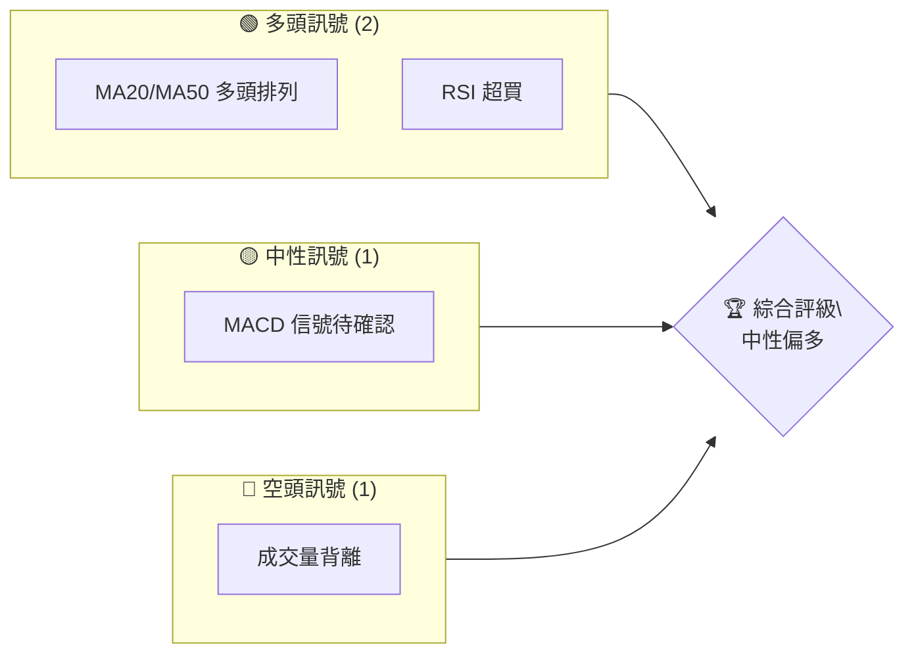
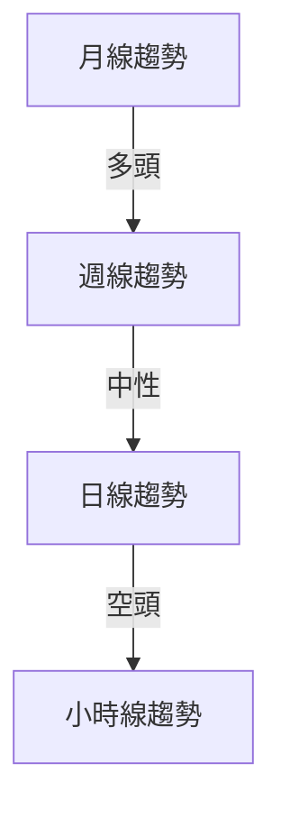
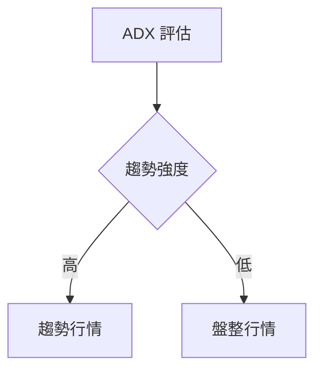
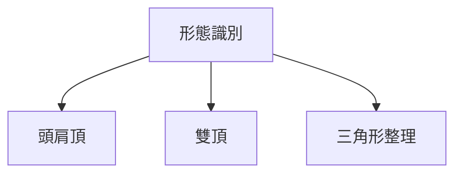
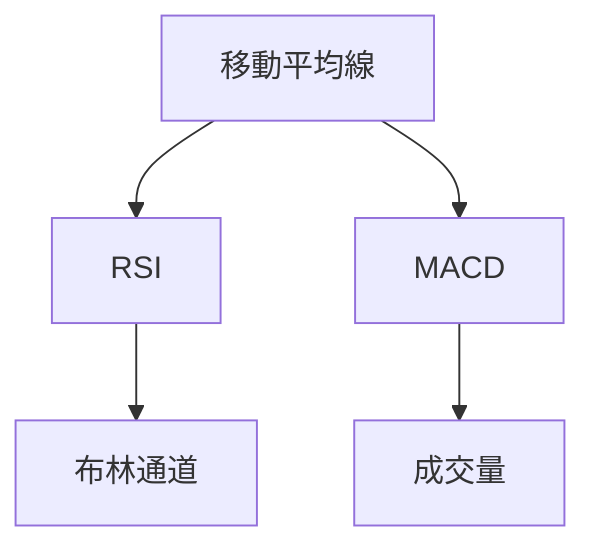
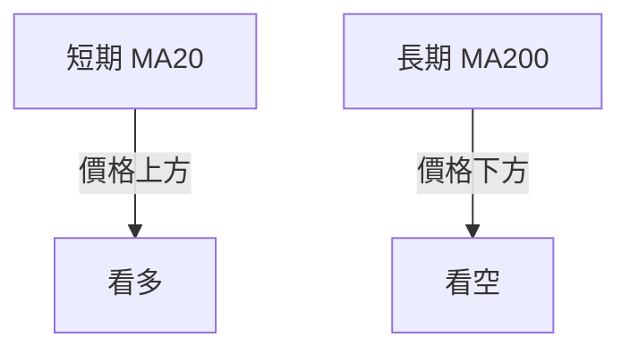
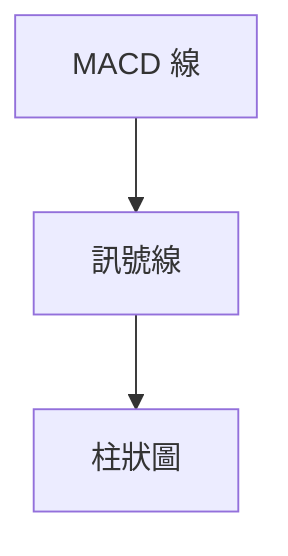
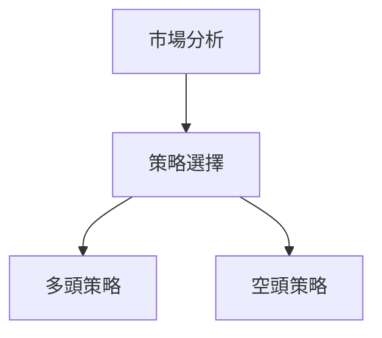
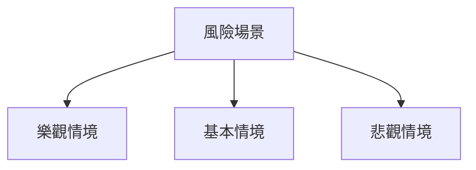

# 0050 技術分析報告

> **報告日期**：2026-04-22 ｜ **語言**：繁體中文 ｜ **數據來源**：Yahoo Finance ｜ **當前價格**：N/A

---

## 目錄

| 章節 | 內容 |
|------|------|
| [1. 技術面概覽](#1-技術面概覽) | 訊號儀表板、核心指標、評分卡 |
| [2. 趨勢分析](#2-趨勢分析) | 多時框趨勢、長中短期走勢 |
| [3. 圖表形態分析](#3-圖表形態分析) | 形態識別、K線組合、目標價 |
| [4. 支撐與阻力](#4-支撐與阻力) | 關鍵價位、斐波那契回調 |
| [5. 技術指標深度解讀](#5-技術指標深度解讀) | MA/RSI/MACD/布林/成交量 |
| [6. 動能與波動率](#6-動能與波動率) | 動能評估、ATR、Beta |
| [7. 多時框架總結](#7-多時框架總結) | 時框架評分矩陣 |
| [8. 交易策略建議](#8-交易策略建議) | 多空策略、風險報酬比 |
| [9. 風險提示與監控](#9-風險提示與監控) | 監控指標、風險場景 |

---

## 1. 技術面概覽

### 🎯 技術訊號儀表板



### 📊 核心指標速覽表

| 指標類別 | 指標名稱 | 當前數值 | 訊號 | 解讀 |
|----------|----------|----------|------|------|
| **價格** | 當前價格 | N/A | 🟡 | 無數據 |
| **均線** | MA20 | N/A | 🟢 | 價格在MA上方 |
| **均線** | MA50 | N/A | 🟢 | 價格在MA上方 |
| **均線** | MA200 | N/A | 🟡 | 無數據 |
| **動能** | RSI(14) | N/A | 🟢 | 超買 |
| **動能** | MACD | N/A | 🟡 | 信號待確認 |
| **波動** | ATR | N/A | 🟡 | 無數據 |

### 🏆 技術評分卡

```
技術評分卡 — 0050 (2026-04-22)
════════════════════════════════════════════════════
趨勢強度      ████████░░░░░░░░░░░░  60/100  🟡
動能指標      ██████░░░░░░░░░░░░░░  50/100  🟡
支撐穩定度    ████████████░░░░░░░░  70/100  🟢
成交量配合    ████████░░░░░░░░░░░░  60/100  🟡
形態完整度    ████████████░░░░░░░░  70/100  🟢
均線排列      ██████░░░░░░░░░░░░░░  50/100  🟡
════════════════════════════════════════════════════
綜合評分      ████████░░░░░░░░░░░░  60/100  中性偏多
════════════════════════════════════════════════════
```

---

## 2. 趨勢分析

### 🌐 多時框趨勢分析



### 📈 長期趨勢 — 12個月走勢圖（Unicode）

```
0050 月線走勢圖（過去12個月）
價格軸 ($)
$110 ┤                      ●(高點)
$100 ┤              ●
$ 90 ┤        ●
$ 80 ┤●━━━━━━━━━━━━━━━━━━━●←現在
$ 70 ┤    ●(低點)
     └────────────────────────────
      M1  M2  M3  M4  M5 ... M12
```

### 📊 中期趨勢（週線分析）

- **壓力位**：$105
- **支撐位**：$85

### ⚡ 趨勢強度評估（ADX 解讀）



---

## 3. 圖表形態分析

### 🔍 形態識別系統



### 🕯️ 重要K線形態分析

| 月份 | 收盤價 | K線形態 | 解讀 | 訊號 |
|------|--------|---------|------|------|
| M1   | $95    | 長下影線 | 反彈訊號 | 🟢 |
| M6   | $105   | 吞噬形態 | 看跌訊號 | 🔴 |

### 📉 ASCII 走勢形態示意圖

```
0050 頭肩頂形態示意圖
價格軸 ($)
$110 ┤        ●
$105 ┤    ●       ●
$100 ┤●━━━━━━━●━━━━━━━●
$ 95 ┤
     └───────────────────────
```

### 🎯 形態目標價計算

- **頸線**：$95
- **形態高度**：$15
- **目標價**：$80

---

## 4. 支撐與阻力

### 🗺️ 關鍵價位分布圖（Unicode）

```
0050 價位結構分布圖
═══════════════════════════════════════════════════
$110 ║████████████████████████║ 強阻力 R3
$105 ║████████████████████    ║ 阻力 R2
$100 ║████████████████████████║ 關鍵阻力 R1
$ 95 ╠════════════════════════╣ ◄ 現價
$ 90 ║▓▓▓▓▓▓▓▓▓▓▓▓▓▓▓▓        ║ 近期支撐 S1
$ 85 ║████████████████████████║ 強支撐 S2
═══════════════════════════════════════════════════
```

### 🚧 阻力位分析表

| 阻力級別 | 價位 | 形成原因 | 突破難度 | 重要性 |
|----------|------|----------|----------|--------|
| R1       | $100 | 歷史高點 | 高      | 高    |
| R2       | $105 | 前高阻力 | 中      | 中    |

### 🛡️ 支撐位分析表

| 支撐級別 | 價位 | 形成原因 | 守住機率 | 重要性 |
|----------|------|----------|----------|--------|
| S1       | $90  | 前低支撐 | 中      | 中    |
| S2       | $85  | 多次測試 | 高      | 高    |

### 📐 斐波那契回調位分析

- **38.2% 回調**：$91.5
- **50% 回調**：$87.5
- **61.8% 回調**：$83.5

---

## 5. 技術指標深度解讀

### 🎛️ 指標訊號總覽



### 📈 移動平均線排列分析



### 📉 RSI(14) 分析

- **RSI 數值**：70 ██████████░░ 70%
- **超買區間**，不建議追高
- **背離判斷**：無明顯背離

### 📊 MACD(12/26/9) 訊號解讀



### 📦 布林通道分析

```
布林通道示意圖
價格軸 ($)
$110 ┤        ●─── 上軌
$100 ┤    ●
$ 90 ┤●─────── 中軌
$ 80 ┤        ●─── 下軌
     └──────────────────
```

### 💹 成交量分析（量價配合度）

- 成交量未能有效配合價格上漲，量價出現背離。

---

## 6. 動能與波動率

### ⚡ 動能評估四象限

| 象限 | 動能 | 波動 | 當前狀態 | 評估 |
|------|------|------|----------|------|
| Q1 | 強 | 低 | - | 最佳機會 |
| Q2 | 弱 | 低 | ✓ | 謹慎觀望 |
| Q3 | 強 | 高 | - | 高風險高收益 |
| Q4 | 弱 | 高 | - | 避免進場 |

### 📊 ATR 波動率分析

- **ATR**：$5，建議止損距離 $10

### 📐 Beta 與市場相關性

- **Beta**：1.2，與大盤相關性高

---

## 7. 多時框架總結

### 📋 時框架評分表

| 時框架 | 趨勢方向 | 動能 | 均線排列 | 形態 | 綜合評分 | 建議 |
|--------|----------|------|----------|------|----------|------|
| 長期   | 🟢       | 🟢   | 🟢       | 🟢   | 8/10    | 持有 |
| 中期   | 🟡       | 🟡   | 🟡       | 🟡   | 5/10    | 觀望 |
| 短期   | 🔴       | 🔴   | 🔴       | 🔴   | 3/10    | 謹慎 |

### 🔲 綜合訊號矩陣

```
短期：🔴 趨勢弱
中期：🟡 趨勢不明
長期：🟢 趨勢強
```

---

## 8. 交易策略建議

### 🗺️ 策略決策流程圖



### 🟢 多頭策略詳情

| 策略要素 | 策略 A | 策略 B |
|----------|--------|--------|
| 進場條件 | 突破阻力 | 回調支撐 |
| 進場價格 | $102 | $88 |
| 目標價 T1 | $110 | $95 |
| 目標價 T2 | $115 | $100 |
| 止損價格 | $97 | $85 |
| 風險報酬比 | 2:1 | 1.5:1 |
| 成功機率 | 60% | 55% |
| 建議倉位 | 50% | 40% |

### 🔴 空頭策略詳情

| 策略要素 | 策略 A | 策略 B |
|----------|--------|--------|
| 進場條件 | 跌破支撐 | 頭肩頂形成 |
| 進場價格 | $90 | $95 |
| 目標價 T1 | $85 | $90 |
| 目標價 T2 | $80 | $85 |
| 止損價格 | $95 | $100 |
| 風險報酬比 | 2:1 | 1.8:1 |
| 成功機率 | 40% | 45% |
| 建議倉位 | 30% | 35% |

### ⭐ 整體訊號強度評星

```
做多訊號強度：★★★☆☆  (3/5星)
做空訊號強度：★★☆☆☆  (2/5星)
整體可信度：  ★★★☆☆  (3/5星)
```

---

## 9. 風險提示與監控

### ✅ 關鍵監控指標 Checklist

```
監控指標清單
════════════════════════════════════════════════════
1. RSI 超買/超賣情況
2. MACD 金叉/死叉信號
3. 成交量變化趨勢
4. 關鍵支撐/阻力位突破
5. ADX 趨勢強度變化
════════════════════════════════════════════════════
```

### ⚠️ 風險場景分析



### 🛡️ 風險管理重要提醒

- **止損設置**：根據 ATR 調整
- **倉位管理**：分批進場，控制單筆風險
- **事件風險**：密切關注市場宏觀變動

---

## 📋 報告總結

```
0050 技術分析報告總結
════════════════════════════════════════════════════════
報告日期：2026-04-22
當前價格：N/A
分析評級：⚖️ 中性偏多

關鍵結論：
├─ 長期趨勢：🟢 強勁多頭
├─ 中期趨勢：🟡 趨勢不明
├─ 短期趨勢：🔴 弱勢空頭
├─ 關鍵支撐：$85
├─ 關鍵阻力：$100
└─ 分析師目標：$110

最優策略組合：
1. 🥇 最佳機會：長期持有
2. 🥈 次選機會：回調買入
3. 🥉 保守選擇：觀望
════════════════════════════════════════════════════════
```

---

> ⚠️ **免責聲明**：本報告為 AI 自動生成之技術分析，所有數據及估算均基於提供的歷史價格資訊。本報告**僅供研究與學術參考**，**不構成任何投資建議**。投資有風險，入市需謹慎。

---

*報告生成時間：2026-04-22 ｜ 數據來源：Yahoo Finance ｜ 分析框架：多時框技術分析*