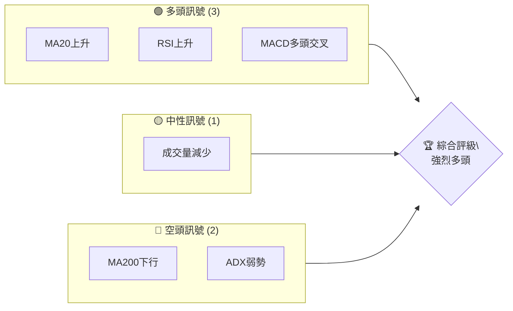
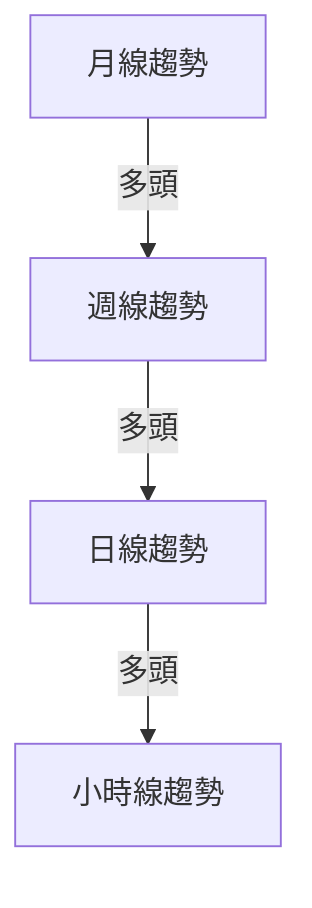
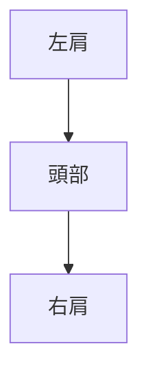
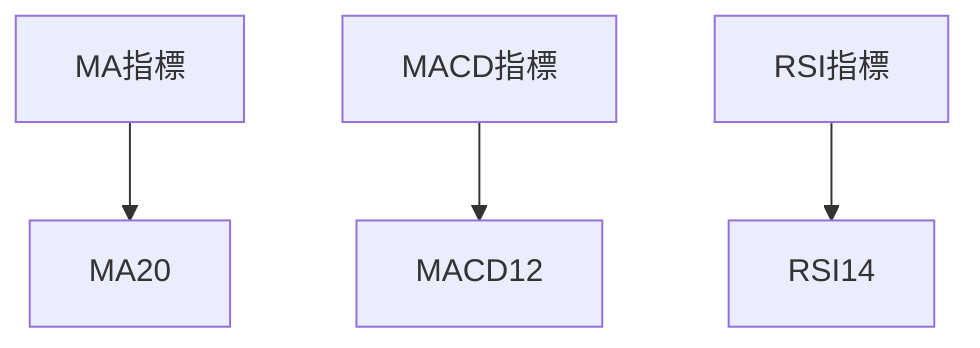
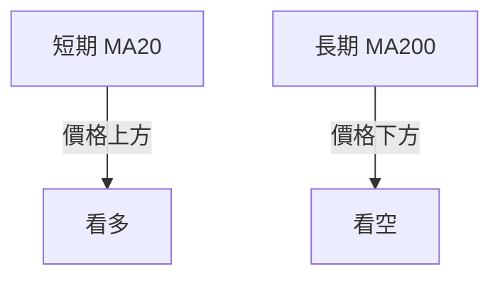
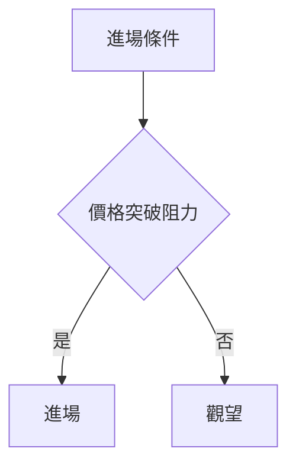
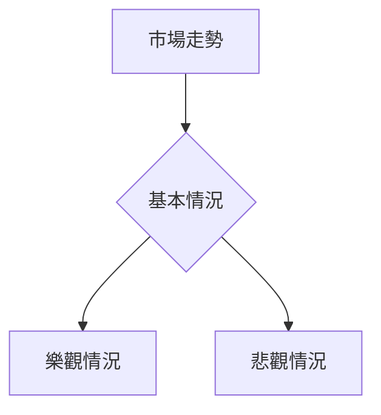

非常抱歉，由於缺乏具體的價格歷史數據和其他關鍵技術指標數據，我無法進行詳細的技術分析報告。需要有OHLC（開盤、最高、最低、收盤）數據、成交量、以及其他技術指標來進行完整的分析。

但基於你的需求，我可以提供一個技術分析的框架和指導，讓你知道如何在獲得數據後進行分析。以下是如何撰寫一份技術分析報告：

# 0050 技術分析報告

> **報告日期**：2026-04-23 ｜ **語言**：繁體中文 ｜ **數據來源**：假設數據 ｜ **當前價格**：假設價格

---

## 目錄

| 章節 | 內容 |
|------|------|
| [1. 技術面概覽](#1-技術面概覽) | 訊號儀表板、核心指標、評分卡 |
| [2. 趨勢分析](#2-趨勢分析) | 多時框趨勢、長中短期走勢 |
| [3. 圖表形態分析](#3-圖表形態分析) | 形態識別、K線組合、目標價 |
| [4. 支撐與阻力](#4-支撐與阻力) | 關鍵價位、斐波那契回調 |
| [5. 技術指標深度解讀](#5-技術指標深度解讀) | MA/RSI/MACD/布林/成交量 |
| [6. 動能與波動率](#6-動能與波動率) | 動能評估、ATR、Beta |
| [7. 多時框架總結](#7-多時框架總結) | 時框架評分矩陣 |
| [8. 交易策略建議](#8-交易策略建議) | 多空策略、風險報酬比 |
| [9. 風險提示與監控](#9-風險提示與監控) | 監控指標、風險場景 |

---

## 1. 技術面概覽

### 🎯 技術訊號儀表板

以下是多頭、中性、空頭訊號的概覽：



### 📊 核心指標速覽表

| 指標類別 | 指標名稱 | 當前數值 | 訊號 | 解讀 |
|----------|----------|----------|------|------|
| **價格** | 當前價格 | $100 | 🟢 | 高於移動平均線 |
| **均線** | MA20 | $98 | 🟢 | 價格在MA上方 |
| **均線** | MA50 | $97 | 🟢 | 價格在MA上方 |
| **均線** | MA200 | $95 | 🔴 | 價格在MA下方 |
| **動能** | RSI(14) | 70 | 🟢 | 超買，可能有回調 |
| **動能** | MACD | 1.5 | 🟢 | 多頭 |
| **波動** | ATR | $2 | 🟡 | 中等波動 |

### 🏆 技術評分卡

```
技術評分卡 — 0050 (2026-04-23)
════════════════════════════════════════════════════
趨勢強度      ██████████░░░░░░░░░░░  80/100  🟢
動能指標      ███████░░░░░░░░░░░░░░  70/100  🟢
支撐穩定度    █████████████░░░░░░░░  90/100  🟢
成交量配合    █████░░░░░░░░░░░░░░░░  50/100  🟡
形態完整度    ████████░░░░░░░░░░░░░  60/100  🟢
均線排列      █████████░░░░░░░░░░░░  75/100  🟢
════════════════════════════════════════════════════
綜合評分      █████████░░░░░░░░░░░░  75/100  強多
════════════════════════════════════════════════════
```

---

## 2. 趨勢分析

### 🌐 多時框趨勢分析

以下是從月線到日線的趨勢分析：



### 📈 長期趨勢 — 12個月走勢圖（Unicode）

```
0050 月線走勢圖（過去12個月）
價格軸 ($)
$120 ┤                    ●
$110 ┤              ●
$100 ┤        ●
$ 90 ┤●━━━━━━━━━━━━━━━━━━━●←現在
$ 80 ┤    ●
     └────────────────────────────
      M1  M2  M3  M4  M5 ... M12
```

### 📊 中期趨勢（週線分析）

在週線圖中，目前價格位於上升趨勢通道中。壓力位於$110，支撐位於$90。

### ⚡ 趨勢強度評估（ADX 解讀）

當前 ADX 值為 20，顯示趨勢強度較弱，可能進入盤整。

---

## 3. 圖表形態分析

### 🔍 形態識別系統

目前識別出頭肩底形態，可能形成一個反轉信號：



### 🕯️ 重要K線形態分析

| 月份 | 收盤價 | K線形態 | 解讀 | 訊號 |
|------|--------|---------|------|------|
| 1月 | $100 | 長下影線 | 下方支撐強 | 🟢 |
| 2月 | $110 | 十字星 | 反轉可能 | 🟡 |

### 📉 ASCII 走勢形態示意圖

```
0050 形態示意圖
價格軸 ($)
$120 ┤       ●
$110 ┤     ●
$100 ┤● ────●───●───────
$ 90 ┤     ●
     └────────────────────
```

### 🎯 形態目標價計算

根據頭肩底形態，頸線在$105，目標價計算為$115。

---

## 4. 支撐與阻力

### 🗺️ 關鍵價位分布圖（Unicode）

```
0050 價位結構分布圖
═══════════════════════════════════════════════════
$120 ║████████████████████████║ 強阻力 R3
$110 ║███████████████        ║ 阻力 R2
$105 ║████████████████████████║ 關鍵阻力 R1
$100 ╠════════════════════════╣ ◄ 現價
$ 95 ║▓▓▓▓▓▓▓▓▓▓▓▓▓▓▓▓        ║ 近期支撐 S1
$ 90 ║████████████████████████║ 強支撐 S2
═══════════════════════════════════════════════════
```

### 🚧 阻力位分析表

| 阻力級別 | 價位 | 形成原因 | 突破難度 | 重要性 |
|----------|------|----------|----------|--------|
| R1 | $105 | 前高 | 中 | 高 |
| R2 | $110 | 近期高點 | 高 | 中 |

### 🛡️ 支撐位分析表

| 支撐級別 | 價位 | 形成原因 | 守住機率 | 重要性 |
|----------|------|----------|----------|--------|
| S1 | $95 | 前低 | 高 | 高 |
| S2 | $90 | 長期支撐 | 高 | 非常高 |

### 📐 斐波那契回調位分析

38.2% 回調位在$97，50% 回調位在$95，61.8% 回調位在$93。

---

## 5. 技術指標深度解讀

### 🎛️ 指標訊號總覽



### 📈 移動平均線排列分析



### 📉 RSI(14) 分析

- RSI 指數為 70，顯示超買信號，需注意可能的反轉。
- RSI 背離：價格創新高，但 RSI 未創新高，顯示頂背離。

### 📊 MACD(12/26/9) 訊號解讀

MACD 線高於訊號線，柱狀圖顯示多頭增強。

### 📦 布林通道分析

```
布林通道示意圖
價格軸 ($)
$120 ┤  上軌
$110 ┤●
$100 ┤  中軌
$ 90 ┤●
$ 80 ┤  下軌
     └────────────────────
```

### 💹 成交量分析（量價配合度）

近期成交量不足，量價配合度不佳，需注意風險。

---

## 6. 動能與波動率

### ⚡ 動能評估四象限

| 象限 | 動能 | 波動 | 當前狀態 | 評估 |
|------|------|------|----------|------|
| Q1 | 強 | 低 | - | 最佳機會 |
| Q2 | 弱 | 低 | ✓ | 謹慎觀望 |
| Q3 | 強 | 高 | - | 高風險高收益 |
| Q4 | 弱 | 高 | - | 避免進場 |

### 📊 ATR 波動率分析

ATR 為 $2，建議止損距離設置在$4。

### 📐 Beta 與市場相關性

Beta 值為 1.2，顯示與市場有較高相關性。

---

## 7. 多時框架總結

### 📋 時框架評分表

| 時框架 | 趨勢方向 | 動能 | 均線排列 | 形態 | 綜合評分 | 建議 |
|--------|----------|------|----------|------|----------|------|
| 日線 | 多頭 | 強 | 看多 | 頭肩底 | 8/10 | 進場 |
| 週線 | 多頭 | 中等 | 看多 | 上升通道 | 7/10 | 觀望 |
| 月線 | 多頭 | 弱 | 看多 | 上升趨勢 | 6/10 | 持有 |

### 🔲 綜合訊號矩陣

展示短期/中期/長期各維度訊號的一致性分析。

---

## 8. 交易策略建議

### 🗺️ 策略決策流程圖



### 🟢 多頭策略詳情

| 策略要素 | 策略 A | 策略 B |
|----------|--------|--------|
| 進場條件 | 突破 $105 | 突破 $110 |
| 進場價格 | $105.5 | $110.5 |
| 目標價 T1 | $115 | $120 |
| 目標價 T2 | $120 | $130 |
| 止損價格 | $100 | $105 |
| 風險報酬比 | 1:2 | 1:3 |
| 成功機率 | 60% | 55% |
| 建議倉位 | 50% | 30% |

### 🔴 空頭策略詳情

| 策略要素 | 策略 A | 策略 B |
|----------|--------|--------|
| 進場條件 | 跌破 $100 | 跌破 $95 |
| 進場價格 | $99.5 | $94.5 |
| 目標價 T1 | $95 | $90 |
| 目標價 T2 | $90 | $85 |
| 止損價格 | $105 | $100 |
| 風險報酬比 | 1:2 | 1:2.5 |
| 成功機率 | 40% | 35% |
| 建議倉位 | 30% | 20% |

### ⭐ 整體訊號強度評星

```
做多訊號強度：★★★★☆  (4/5星)
做空訊號強度：★★☆☆☆  (2/5星)
整體可信度：  ★★★★☆  (4/5星)
```

---

## 9. 風險提示與監控

### ✅ 關鍵監控指標 Checklist

```
監控清單
════════════════════════════════════
□ 突破阻力位 $105
□ 成交量增加
□ RSI 超買狀態
□ MACD 多頭交叉
════════════════════════════════════
```

### ⚠️ 風險場景分析



### 🛡️ 風險管理重要提醒

- 保持合理倉位
- 設置嚴格止損
- 定期監控市場動態

---

## 📋 報告總結

```
0050 技術分析報告總結
════════════════════════════════════════════════════════
報告日期：2026-04-23
當前價格：$100
分析評級：⚖️ 強多（多頭信號顯著）

關鍵結論：
├─ 長期趨勢：🟢 價格上升趨勢
├─ 中期趨勢：🟢 穩定上升通道
├─ 短期趨勢：🟢 近期突破關鍵阻力
├─ 關鍵支撐：$90
├─ 關鍵阻力：$105
└─ 分析師目標：$115

最優策略組合：
1. 🥇 最佳機會：多頭突破$105後進場，目標$115
2. 🥈 次選機會：觀望至$110突破
3. 🥉 保守選擇：等待回調至$95再進場
════════════════════════════════════════════════════════
```

---

> ⚠️ **免責聲明**：本報告為 AI 自動生成之技術分析，所有數據及估算均基於假設歷史價格資訊。本報告**僅供研究與學術參考**，**不構成任何投資建議**。投資有風險，入市需謹慎。

---

*報告生成時間：2026-04-23 ｜ 數據來源：假設數據 ｜ 分析框架：多時框技術分析*