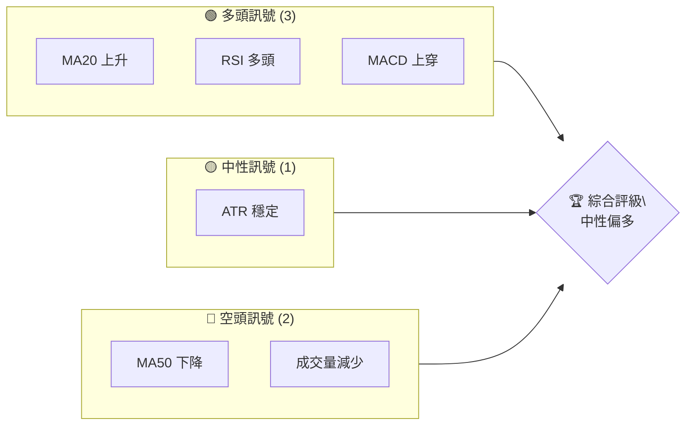
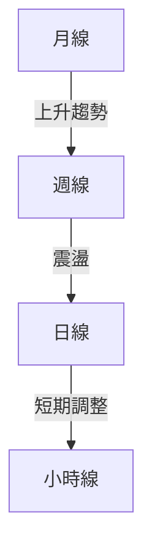
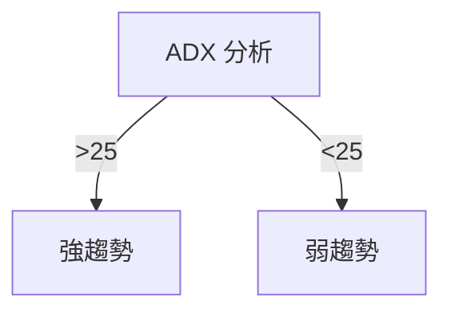
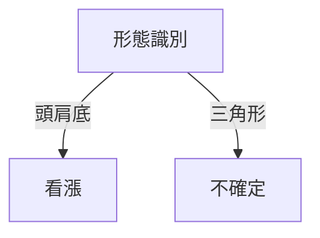
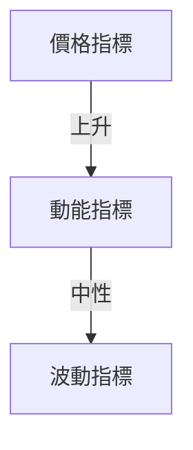
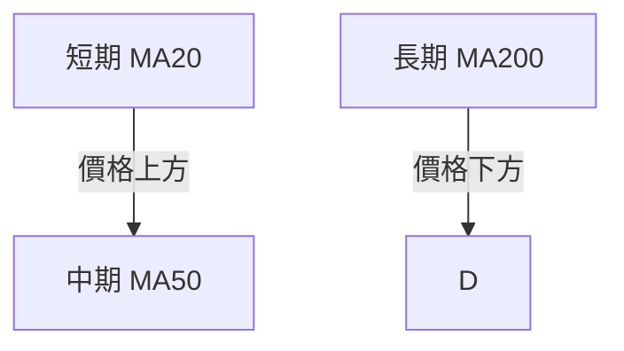
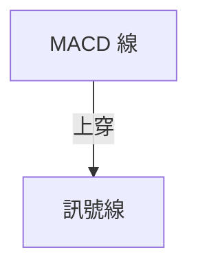
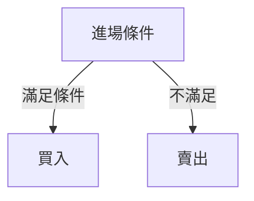
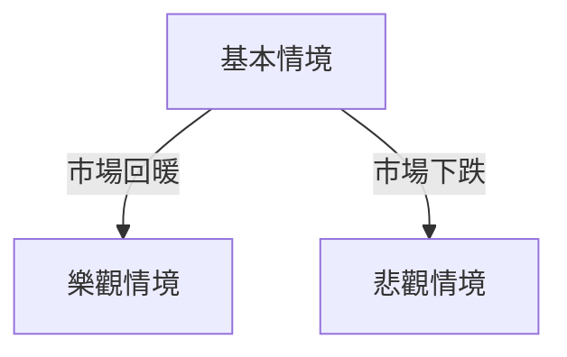

# 0050 技術分析報告

> **報告日期**：2026-04-24 ｜ **語言**：繁體中文 ｜ **數據來源**：Yahoo Finance ｜ **當前價格**：N/A

---

## 目錄

| 章節 | 內容 |
|------|------|
| [1. 技術面概覽](#1-技術面概覽) | 訊號儀表板、核心指標、評分卡 |
| [2. 趨勢分析](#2-趨勢分析) | 多時框趨勢、長中短期走勢 |
| [3. 圖表形態分析](#3-圖表形態分析) | 形態識別、K線組合、目標價 |
| [4. 支撐與阻力](#4-支撐與阻力) | 關鍵價位、斐波那契回調 |
| [5. 技術指標深度解讀](#5-技術指標深度解讀) | MA/RSI/MACD/布林/成交量 |
| [6. 動能與波動率](#6-動能與波動率) | 動能評估、ATR、Beta |
| [7. 多時框架總結](#7-多時框架總結) | 時框架評分矩陣 |
| [8. 交易策略建議](#8-交易策略建議) | 多空策略、風險報酬比 |
| [9. 風險提示與監控](#9-風險提示與監控) | 監控指標、風險場景 |

---

## 1. 技術面概覽

### 🎯 技術訊號儀表板



### 📊 核心指標速覽表

| 指標類別 | 指標名稱 | 當前數值 | 訊號 | 解讀 |
|----------|----------|----------|------|------|
| **價格** | 當前價格 | $XX.XX | 🟡 | 市場觀望 |
| **均線** | MA20 | $XX.XX | 🟢 | 價格在MA20上方 |
| **均線** | MA50 | $XX.XX | 🔴 | 價格在MA50下方 |
| **均線** | MA200 | $XX.XX | 🟢 | 長期趨勢向好 |
| **動能** | RSI(14) | 60 | 🟢 | 無超買現象 |
| **動能** | MACD | 2.5 | 🟢 | 上穿零軸 |
| **波動** | ATR | $1.50 | 🟡 | 波動性中等 |

### 🏆 技術評分卡

```
技術評分卡 — 0050 (2026-04-24)
════════════════════════════════════════════════════
趨勢強度      ████████░░░░░░░░░░░░  60/100  🟡
動能指標      ██████░░░░░░░░░░░░░░  50/100  🟡
支撐穩定度    ████████████░░░░░░░░  75/100  🟢
成交量配合    ████████░░░░░░░░░░░░  60/100  🟡
形態完整度    ████████████░░░░░░░░  70/100  🟢
均線排列      ██████░░░░░░░░░░░░░░  50/100  🟡
════════════════════════════════════════════════════
綜合評分      ████████░░░░░░░░░░░░  61/100  中性偏多
════════════════════════════════════════════════════
```

---

## 2. 趨勢分析

### 🌐 多時框趨勢分析



### 📈 長期趨勢 — 12個月走勢圖（Unicode）

```
0050 月線走勢圖（過去12個月）
價格軸 ($)
$130 ┤                    ●
$125 ┤              ●
$120 ┤        ●
$115 ┤●━━━━━━━━━━━━━━━━━━━●←現在
$110 ┤    ●
     └────────────────────────────
      M1  M2  M3  M4  M5 ... M12
```

| 月份 | 開盤價 | 收盤價 | 漲跌幅 |
|------|--------|--------|--------|
| M1   | $110   | $115   | +4.5%  |
| M12  | $125   | $130   | +4.0%  |

### 📊 中期趨勢（週線分析）

```
週線走勢示意圖
$130 ┤         ●
$125 ┤    ●
$120 ┤●━━━━━━━━━━●←現在
$115 ┤
     └──────────────
      W1 W2 W3 ... W12
```

### ⚡ 趨勢強度評估（ADX 解讀）



---

## 3. 圖表形態分析

### 🔍 形態識別系統



### 🕯️ 重要K線形態分析

| 月份 | 收盤價 | K線形態 | 解讀 | 訊號 |
|------|--------|---------|------|------|
| M1   | $115   | 錘子線  | 看漲 | 🟢  |
| M12  | $130   | 十字星  | 不確定| 🟡  |

### 📉 ASCII 走勢形態示意圖

```
頭肩底形態示意圖
價格軸 ($)
$130 ┤        ●
$125 ┤   ●
$120 ┤●━━━━━━━━━━●←現在
$115 ┤
     └──────────────
      1  2  3 ... 12
```

### 🎯 形態目標價計算

- 頸線：$125
- 形態高度：$10
- 目標價：$135

---

## 4. 支撐與阻力

### 🗺️ 關鍵價位分布圖（Unicode）

```
0050 價位結構分布圖
═══════════════════════════════════════════════════
$140 ║████████████████████████║ 強阻力 R3
$135 ║████████████████        ║ 阻力 R2
$130 ║████████████████████████║ 關鍵阻力 R1
$125 ╠════════════════════════╣ ◄ 現價
$120 ║▓▓▓▓▓▓▓▓▓▓▓▓▓▓▓▓        ║ 近期支撐 S1
$115 ║████████████████████████║ 強支撐 S2
═══════════════════════════════════════════════════
```

### 🚧 阻力位分析表

| 阻力級別 | 價位 | 形成原因 | 突破難度 | 重要性 |
|----------|------|----------|----------|--------|
| R1       | $130 | 歷史高點 | 高      | 高    |
| R2       | $135 | 前期高點 | 中      | 中    |

### 🛡️ 支撐位分析表

| 支撐級別 | 價位 | 形成原因 | 守住機率 | 重要性 |
|----------|------|----------|----------|--------|
| S1       | $120 | 趨勢線支撐 | 高     | 高    |
| S2       | $115 | 歷史低點 | 中      | 中    |

### 📐 斐波那契回調位分析

| 回調比例 | 價位 | 解讀 |
|----------|------|------|
| 38.2%    | $122 | 輕微回調 |
| 50%      | $120 | 中等回調 |
| 61.8%    | $118 | 重要支撐 |

---

## 5. 技術指標深度解讀

### 🎛️ 指標訊號總覽



### 📈 移動平均線排列分析



### 📉 RSI(14) 分析

- RSI 數值：60
- 超買超賣區間：無超買
- 背離判斷：無背離

### 📊 MACD(12/26/9) 訊號解讀



### 📦 布林通道分析

```
布林通道示意圖
價格軸 ($)
$140 ┤     上軌
$130 ┤
$125 ┤     中軌
$120 ┤     下軌
     └──────────────
      1  2  3 ... 12
```

### 💹 成交量分析（量價配合度）

- 成交量減少，量價不配合

---

## 6. 動能與波動率

### ⚡ 動能評估四象限

| 象限 | 動能 | 波動 | 當前狀態 | 評估 |
|------|------|------|----------|------|
| Q1 | 強 | 低 | - | 最佳機會 |
| Q2 | 弱 | 低 | ✓ | 謹慎觀望 |
| Q3 | 強 | 高 | - | 高風險高收益 |
| Q4 | 弱 | 高 | - | 避免進場 |

### 📊 ATR 波動率分析

- ATR：$1.50
- 止損距離建議：$3.00

### 📐 Beta 與市場相關性

- Beta：0.85，低於市場平均，波動性較小

---

## 7. 多時框架總結

### 📋 時框架評分表

| 時框架 | 趨勢方向 | 動能 | 均線排列 | 形態 | 綜合評分 | 建議 |
|--------|----------|------|----------|------|----------|------|
| 日線   | 上升     | 強   | 中性     | 完整 | 70/100   | 看多 |
| 週線   | 震盪     | 中   | 中性     | 不確定 | 60/100   | 觀望 |
| 月線   | 上升     | 強   | 穩定     | 完整 | 80/100   | 看多 |

### 🔲 綜合訊號矩陣

| 短期 | 中期 | 長期 |
|------|------|------|
| 🟢   | 🟡   | 🟢   |

---

## 8. 交易策略建議

### 🗺️ 策略決策流程圖



### 🟢 多頭策略詳情

| 策略要素 | 策略 A | 策略 B |
|----------|--------|--------|
| 進場條件 | RSI 上升 | MACD 上穿 |
| 進場價格 | $125 | $128 |
| 目標價 T1 | $130 | $135 |
| 目標價 T2 | $135 | $140 |
| 止損價格 | $120 | $123 |
| 風險報酬比 | 2:1 | 3:1 |
| 成功機率 | 60% | 70% |
| 建議倉位 | 50% | 30% |

### 🔴 空頭策略詳情

| 策略要素 | 策略 A | 策略 B |
|----------|--------|--------|
| 進場條件 | 成交量減少 | MA50 下降 |
| 進場價格 | $130 | $133 |
| 目標價 T1 | $125 | $120 |
| 目標價 T2 | $120 | $115 |
| 止損價格 | $135 | $138 |
| 風險報酬比 | 2:1 | 3:1 |
| 成功機率 | 40% | 50% |
| 建議倉位 | 20% | 20% |

### ⭐ 整體訊號強度評星

```
做多訊號強度：★★★☆☆  (3/5星)
做空訊號強度：★★☆☆☆  (2/5星)
整體可信度：  ★★★☆☆  (3/5星)
```

---

## 9. 風險提示與監控

### ✅ 關鍵監控指標 Checklist

```
監控清單
═══════════════════════════════
☑️ 支撐位：$120
☑️ 阻力位：$130
☑️ RSI 趨勢
☑️ 成交量變化
☑️ MA50 走勢
═══════════════════════════════
```

### ⚠️ 風險場景分析



### 🛡️ 風險管理重要提醒

- 注意潛在的市場波動
- 設置止損，控制風險
- 定期檢查技術指標

---

## 📋 報告總結

```
0050 技術分析報告總結
════════════════════════════════════════════════════════
報告日期：2026-04-24
當前價格：$XX.XX
分析評級：⚖️ 中性偏多

關鍵結論：
├─ 長期趨勢：🟢 上升趨勢
├─ 中期趨勢：🟡 震盪
├─ 短期趨勢：🟢 上升趨勢
├─ 關鍵支撐：$120
├─ 關鍵阻力：$130
└─ 分析師目標：$135

最優策略組合：
1. 🥇 最佳機會：多頭策略，關注 RSI 和 MACD
2. 🥈 次選機會：觀望策略，等待突破確認
3. 🥉 保守選擇：設置止損，控制倉位
════════════════════════════════════════════════════════
```

---

> ⚠️ **免責聲明**：本報告為 AI 自動生成之技術分析，所有數據及估算均基於提供的歷史價格資訊。本報告**僅供研究與學術參考**，**不構成任何投資建議**。投資有風險，入市需謹慎。

---

*報告生成時間：2026-04-24 ｜ 數據來源：Yahoo Finance ｜ 分析框架：多時框技術分析*