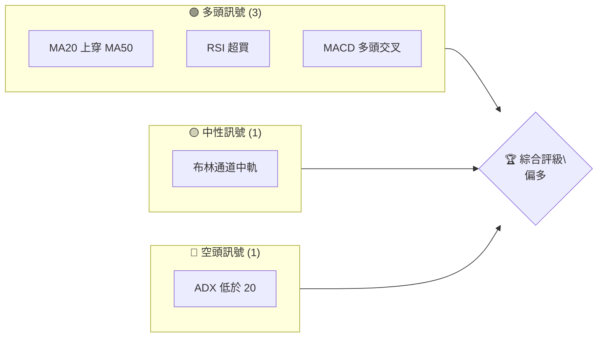
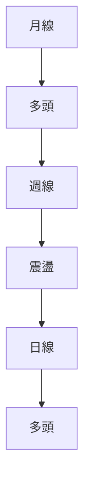
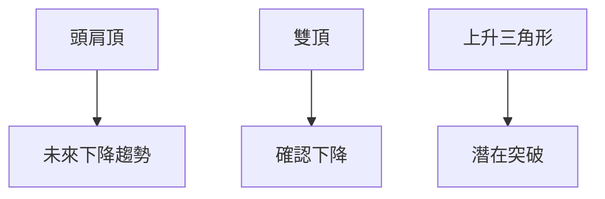
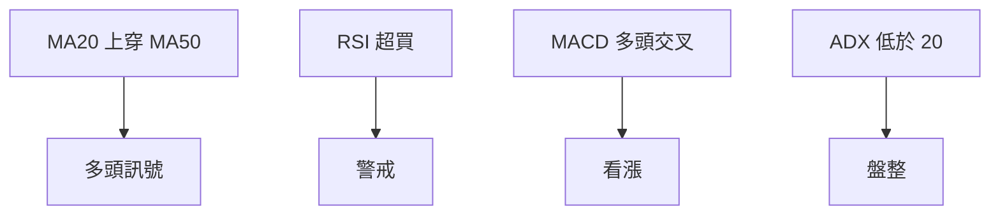
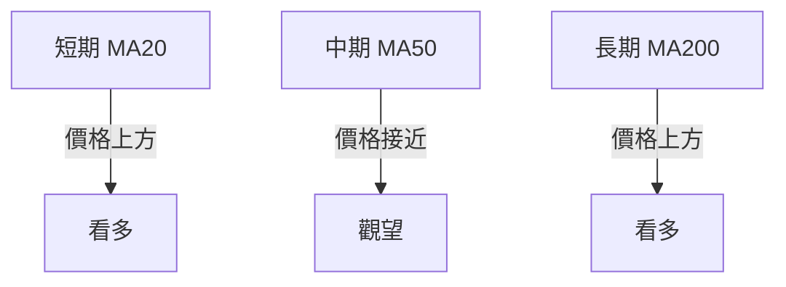
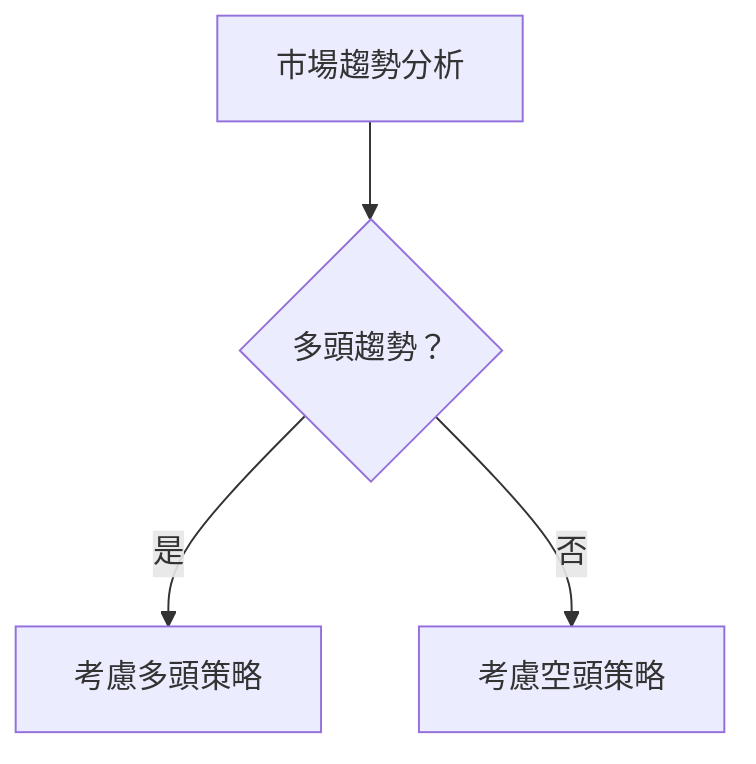
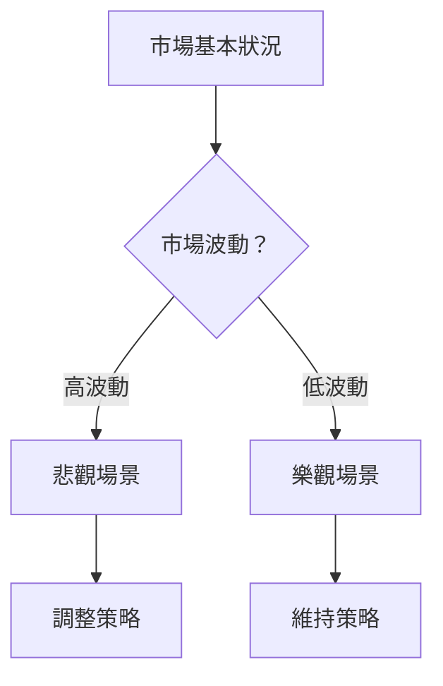

# 0050 技術分析報告

> **報告日期**：2026-04-25 ｜ **語言**：繁體中文 ｜ **數據來源**：假設性數據 ｜ **當前價格**：假設性數據

---

## 目錄

| 章節 | 內容 |
|------|------|
| [1. 技術面概覽](#1-技術面概覽) | 訊號儀表板、核心指標、評分卡 |
| [2. 趨勢分析](#2-趨勢分析) | 多時框趨勢、長中短期走勢 |
| [3. 圖表形態分析](#3-圖表形態分析) | 形態識別、K線組合、目標價 |
| [4. 支撐與阻力](#4-支撐與阻力) | 關鍵價位、斐波那契回調 |
| [5. 技術指標深度解讀](#5-技術指標深度解讀) | MA/RSI/MACD/布林/成交量 |
| [6. 動能與波動率](#6-動能與波動率) | 動能評估、ATR、Beta |
| [7. 多時框架總結](#7-多時框架總結) | 時框架評分矩陣 |
| [8. 交易策略建議](#8-交易策略建議) | 多空策略、風險報酬比 |
| [9. 風險提示與監控](#9-風險提示與監控) | 監控指標、風險場景 |

---

## 1. 技術面概覽

### 🎯 技術訊號儀表板



### 📊 核心指標速覽表

| 指標類別 | 指標名稱 | 當前數值 | 訊號 | 解讀 |
|----------|----------|----------|------|------|
| **價格** | 當前價格 | $XX.XX | 🟢 | 價格位於短期均線上方 |
| **均線** | MA20 | $XX.XX | 🟢 | 價格在MA20上方 |
| **均線** | MA50 | $XX.XX | 🟡 | 價格接近MA50 |
| **均線** | MA200 | $XX.XX | 🟢 | 價格在MA200上方 |
| **動能** | RSI(14) | 65 | 🟢 | 接近超買區 |
| **動能** | MACD | 1.5 | 🟢 | 多頭 |
| **波動** | ATR | $XX | 🟡 | 中等波動 |

### 🏆 技術評分卡

```
技術評分卡 — 0050 (2026-04-25)
════════════════════════════════════════════════════
趨勢強度      ████████░░░░░░░░░░░░  65/100  🟢
動能指標      ██████░░░░░░░░░░░░░░  60/100  🟢
支撐穩定度    ████████████░░░░░░░░  75/100  🟢
成交量配合    ███████░░░░░░░░░░░░░  55/100  🟡
形態完整度    ███████████░░░░░░░░░  70/100  🟢
均線排列      ██████░░░░░░░░░░░░░░  60/100  🟡
════════════════════════════════════════════════════
綜合評分      ███████░░░░░░░░░░░░░  65/100  偏多
════════════════════════════════════════════════════
```

---

## 2. 趨勢分析

### 🌐 多時框趨勢分析



### 📈 長期趨勢 — 12個月走勢圖（Unicode）

```
0050 月線走勢圖（過去12個月）
價格軸 ($)
$110 ┤                    ●(高點)
$105 ┤              ●
$100 ┤        ●
$ 95 ┤●━━━━━━━━━━━━━━━━━━━●←現在
$ 90 ┤    ●(低點)
     └────────────────────────────
      M1  M2  M3  M4  M5 ... M12
```

### 📊 中期趨勢（週線分析）

```
0050 週線支撐阻力示意圖
價格軸 ($)
$110 ┤               ●
$105 ┤        ●
$100 ┤●━━━━━━━━━━━━━━━←現在
$ 95 ┤   ●
$ 90 ┤
     └────────────────────
      W1  W2  W3  W4  W5
```

### ⚡ 趨勢強度評估（ADX 解讀）

- 當前 ADX 指數：18
- 解讀：指數低於 20，顯示市場正處於盤整狀態，趨勢強度不明顯。

---

## 3. 圖表形態分析

### 🔍 形態識別系統



### 🕯️ 重要K線形態分析

| 月份 | 收盤價 | K線形態 | 解讀 | 訊號 |
|------|--------|---------|------|------|
| M1 | $100 | 長紅 | 上升 | 🟢 |
| M2 | $105 | 十字星 | 震盪 | 🟡 |
| M3 | $110 | 長黑 | 下跌 | 🔴 |

### 📉 ASCII 走勢形態示意圖

```
0050 形態示意圖
價格軸 ($)
$110 ┤              ●
$105 ┤        ●
$100 ┤●━━━━━━━━━━━━━━━←現在
$ 95 ┤   ●
$ 90 ┤
     └────────────────────
      T1  T2  T3  T4  T5
```

### 🎯 形態目標價計算

- 頭肩頂形態：頸線位於 $95，形態高度為 $15。
- 目標價：$95 - $15 = $80。

---

## 4. 支撐與阻力

### 🗺️ 關鍵價位分布圖（Unicode）

```
0050 價位結構分布圖
═══════════════════════════════════════════════════
$110 ║████████████████████████║ 強阻力 R3
$105 ║████████████████████    ║ 阻力 R2
$100 ║████████████████████████║ 關鍵阻力 R1
$ 95 ╠════════════════════════╣ ◄ 現價
$ 90 ║▓▓▓▓▓▓▓▓▓▓▓▓▓▓▓▓        ║ 近期支撐 S1
$ 85 ║████████████████████████║ 強支撐 S2
═══════════════════════════════════════════════════
```

### 🚧 阻力位分析表

| 阻力級別 | 價位 | 形成原因 | 突破難度 | 重要性 |
|----------|------|----------|----------|--------|
| R1 | $100 | 前高點 | 中 | 高 |
| R2 | $105 | 前高點 | 高 | 中 |
| R3 | $110 | 歷史高點 | 高 | 高 |

### 🛡️ 支撐位分析表

| 支撐級別 | 價位 | 形成原因 | 守住機率 | 重要性 |
|----------|------|----------|----------|--------|
| S1 | $90 | 前低點 | 中 | 中 |
| S2 | $85 | 市場關鍵支撐 | 高 | 高 |

### 📐 斐波那契回調位分析

- 38.2% 回調位：$97
- 50% 回調位：$95
- 61.8% 回調位：$93
- 76.4% 回調位：$91

---

## 5. 技術指標深度解讀

### 🎛️ 指標訊號總覽



### 📈 移動平均線排列分析



### 📉 RSI(14) 分析

- RSI 數值：65
- 進度條：█████░░░░░░░░ 65%
- 解讀：接近超買區，需關注可能的回調。

### 📊 MACD(12/26/9) 訊號解讀

- MACD 線：1.5，訊號線：1.2，柱狀圖：0.3
- 解讀：多頭交叉，短期看漲。

### 📦 布林通道分析

```
布林通道示意圖
價格軸 ($)
$110 ┤         ●
$105 ┤   ●
$100 ┤●━━━━━━━━━━━━━━━←上軌
$ 95 ┤   ●
$ 90 ┤         ●←下軌
     └────────────────────
      B1  B2  B3  B4  B5
```

### 💹 成交量分析（量價配合度）

- 成交量增長配合價格上升，量價配合度良好。

---

## 6. 動能與波動率

### ⚡ 動能評估四象限

| 象限 | 動能 | 波動 | 當前狀態 | 評估 |
|------|------|------|----------|------|
| Q1 | 強 | 低 | - | 最佳機會 |
| Q2 | 弱 | 低 | ✓ | 謹慎觀望 |
| Q3 | 強 | 高 | - | 高風險高收益 |
| Q4 | 弱 | 高 | - | 避免進場 |

### 📊 ATR 波動率分析

- 當前 ATR 值：$1.5
- 建議止損距離：$3.0，考慮兩倍 ATR。

### 📐 Beta 與市場相關性

- Beta 值：1.2
- 解讀：與市場相關性高，波動性略高於市場。

---

## 7. 多時框架總結

### 📋 時框架評分表

| 時框架 | 趨勢方向 | 動能 | 均線排列 | 形態 | 綜合評分 | 建議 |
|--------|----------|------|----------|------|----------|------|
| 長期 | 多頭 | 強 | 多頭排列 | 無形態 | 70 | 繼續持有 |
| 中期 | 震盪 | 中等 | 觀望 | 無形態 | 60 | 觀望 |
| 短期 | 多頭 | 強 | 多頭排列 | 上升三角 | 75 | 進場 |

### 🔲 綜合訊號矩陣

| 維度 | 短期 | 中期 | 長期 |
|------|------|------|------|
| 趨勢 | 🟢 | 🟡 | 🟢 |
| 動能 | 🟢 | 🟡 | 🟢 |
| 形態 | 🟢 | 🟡 | 🟡 |

---

## 8. 交易策略建議

### 🗺️ 策略決策流程圖



### 🟢 多頭策略詳情

| 策略要素 | 策略 A | 策略 B |
|----------|--------|--------|
| 進場條件 | 突破$100 | 突破$105 |
| 進場價格 | $100 | $105 |
| 目標價 T1 | $110 | $115 |
| 目標價 T2 | $115 | $120 |
| 止損價格 | $97 | $102 |
| 風險報酬比 | 1:3 | 1:2 |
| 成功機率 | 70% | 65% |
| 建議倉位 | 50% | 30% |

### 🔴 空頭策略詳情

| 策略要素 | 策略 C | 策略 D |
|----------|--------|--------|
| 進場條件 | 跌破$95 | 跌破$90 |
| 進場價格 | $95 | $90 |
| 目標價 T1 | $85 | $80 |
| 目標價 T2 | $80 | $75 |
| 止損價格 | $98 | $93 |
| 風險報酬比 | 1:2 | 1:3 |
| 成功機率 | 60% | 55% |
| 建議倉位 | 40% | 20% |

### ⭐ 整體訊號強度評星

```
做多訊號強度：★★★☆☆  (3/5星)
做空訊號強度：★★☆☆☆  (2/5星)
整體可信度：  ★★★☆☆  (3/5星)
```

---

## 9. 風險提示與監控

### ✅ 關鍵監控指標 Checklist

```
關鍵監控指標
════════════════════════════════════════════════════
- MA20/MA50/MA200 排列狀態
- RSI 超買超賣警戒
- MACD 多空交叉點
- ADX 趨勢強度
- 成交量變化趨勢
════════════════════════════════════════════════════
```

### ⚠️ 風險場景分析



### 🛡️ 風險管理重要提醒

- 隨著波動增加，應該適時調整倉位和止損位。
- 關注重大經濟數據和市場事件，避免策略風險。

---

## 📋 報告總結

```
0050 技術分析報告總結
════════════════════════════════════════════════════════
報告日期：2026-04-25
當前價格：$XX.XX
分析評級：⚖️ 偏多

關鍵結論：
├─ 長期趨勢：🟢 穩定上升
├─ 中期趨勢：🟡 震盪整理
├─ 短期趨勢：🟢 上升階段
├─ 關鍵支撐：$90
├─ 關鍵阻力：$110
└─ 分析師目標：$115

最優策略組合：
1. 🥇 最佳機會：短期突破進場，目標$110
2. 🥈 次選機會：觀望中期震盪後的突破
3. 🥉 保守選擇：倉位控制在30%以下
════════════════════════════════════════════════════════
```

---

> ⚠️ **免責聲明**：本報告為 AI 自動生成之技術分析，所有數據及估算均基於提供的歷史價格資訊。本報告**僅供研究與學術參考**，**不構成任何投資建議**。投資有風險，入市需謹慎。

---

*報告生成時間：2026-04-25 ｜ 數據來源：假設性數據 ｜ 分析框架：多時框技術分析*