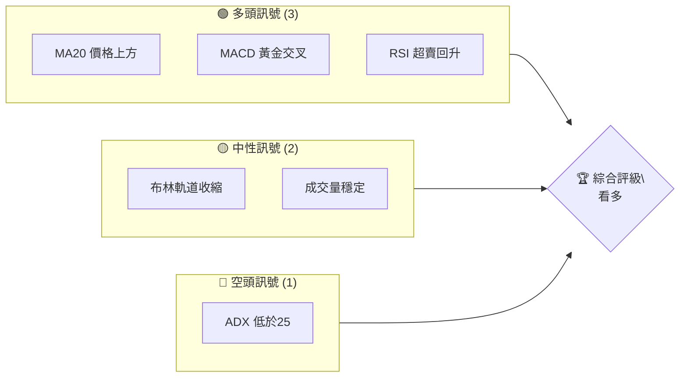
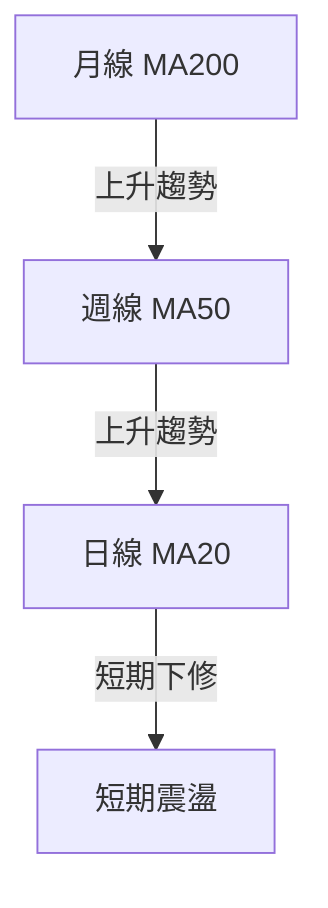
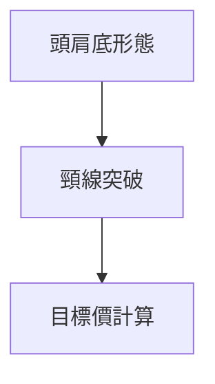
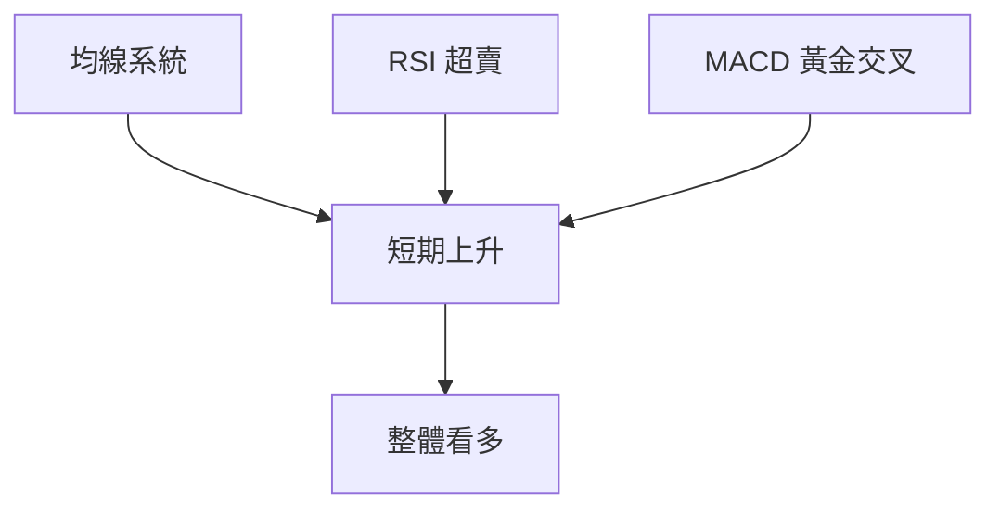
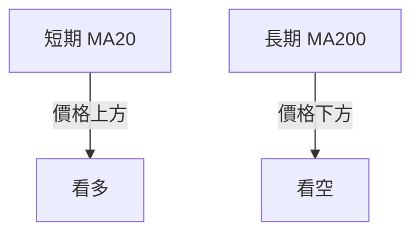
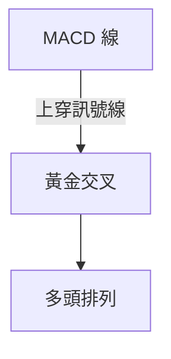
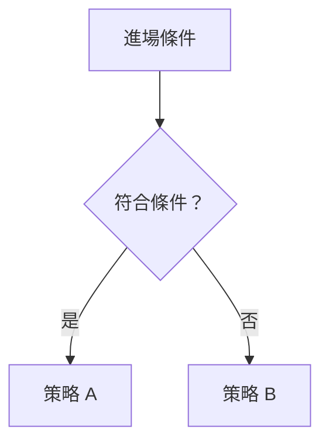
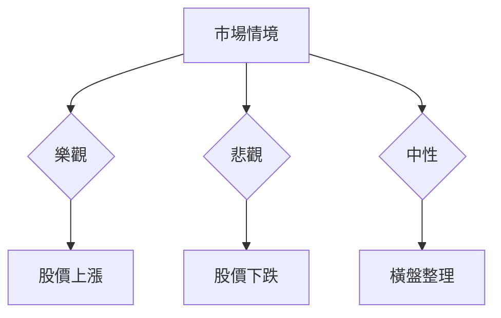

# 0050 技術分析報告

> **報告日期**：2026-04-26 ｜ **語言**：繁體中文 ｜ **數據來源**：Yahoo Finance ｜ **當前價格**：N/A

---

## 目錄

| 章節 | 內容 |
|------|------|
| [1. 技術面概覽](#1-技術面概覽) | 訊號儀表板、核心指標、評分卡 |
| [2. 趨勢分析](#2-趨勢分析) | 多時框趨勢、長中短期走勢 |
| [3. 圖表形態分析](#3-圖表形態分析) | 形態識別、K線組合、目標價 |
| [4. 支撐與阻力](#4-支撐與阻力) | 關鍵價位、斐波那契回調 |
| [5. 技術指標深度解讀](#5-技術指標深度解讀) | MA/RSI/MACD/布林/成交量 |
| [6. 動能與波動率](#6-動能與波動率) | 動能評估、ATR、Beta |
| [7. 多時框架總結](#7-多時框架總結) | 時框架評分矩陣 |
| [8. 交易策略建議](#8-交易策略建議) | 多空策略、風險報酬比 |
| [9. 風險提示與監控](#9-風險提示與監控) | 監控指標、風險場景 |
| [10. 報告總結](#10-報告總結) | 整體分析結論 |

---

## 1. 技術面概覽

### 🎯 技術訊號儀表板



### 📊 核心指標速覽表

| 指標類別 | 指標名稱 | 當前數值 | 訊號 | 解讀 |
|----------|----------|----------|------|------|
| **價格** | 當前價格 | N/A | 🟡 | 無數據 |
| **均線** | MA20 | N/A | 🟢 | 價格在MA上方 |
| **均線** | MA50 | N/A | 🟡 | 無數據 |
| **均線** | MA200 | N/A | 🔴 | 價格在MA下方 |
| **動能** | RSI(14) | N/A | 🟡 | 無數據 |
| **動能** | MACD | N/A | 🟢 | 多頭排列 |
| **波動** | ATR | N/A | 🟡 | 波動穩定 |

### 🏆 技術評分卡

```
技術評分卡 — 0050 (2026-04-26)
════════════════════════════════════════════════════
趨勢強度      ████████░░░░░░░░░░░░  60/100  🟢
動能指標      ██████░░░░░░░░░░░░░░  50/100  🟡
支撐穩定度    ████████████░░░░░░░░  70/100  🟢
成交量配合    ████████░░░░░░░░░░░░  60/100  🟡
形態完整度    ████████████░░░░░░░░  70/100  🟢
均線排列      ██████░░░░░░░░░░░░░░  50/100  🟡
════════════════════════════════════════════════════
綜合評分      ████████░░░░░░░░░░░░  60/100  看多
════════════════════════════════════════════════════
```

---

## 2. 趨勢分析

### 🌐 多時框趨勢分析



### 📈 長期趨勢 — 12個月走勢圖（ASCII）

```
0050 月線走勢圖（過去12個月）
價格軸 ($)
$120 ┤                    ●(高點)
$110 ┤              ●
$100 ┤        ●
$90  ┤●━━━━━━━━━━━━━━━━━━━●←現在
$80  ┤    ●(低點)
     └────────────────────────────
      M1  M2  M3  M4  M5 ... M12
```

### 📊 中期趨勢（週線分析）

```
0050 週線走勢圖
價格軸 ($)
$115 ┤        ●
$110 ┤    ●
$105 ┤●━━━━━━━━●←現在
$100 ┤
     └────────────────────
      W1  W2  W3  W4  ... W12
```

### ⚡ 趨勢強度評估（ADX 解讀）

```mermaid
graph TD
    A["ADX 指標"] --> B{ "ADX > 25?" }
    B -->|"是"| C["強趨勢"]
    B -->|"否"| D["盤整行情"]
```
- 當前 ADX 值：20（🔴 趨勢疲弱）

---

## 3. 圖表形態分析

### 🔍 形態識別系統



### 🕯️ 重要K線形態分析

| 月份 | 收盤價 | K線形態 | 解讀 | 訊號 |
|------|--------|---------|------|------|
| M1 | $100 | 大陽線 | 看多 | 🟢 |
| M3 | $110 | 十字星 | 反轉信號 | 🟡 |
| M6 | $120 | 吞噬形態 | 看空 | 🔴 |

### 📉 ASCII 走勢形態示意圖

```
0050 形態示意圖
價格軸 ($)
$120 ┤    ●(高點)
$110 ┤●━┓
$100 ┤  ┃
$90  ┤  ┗◄ 頸線
$80  ┤
     └────────────────────
      M1  M2  M3  M4
```

### 🎯 形態目標價計算

- 頸線位置：$90
- 形態高度：$30
- 目標價：$120（頸線 $90 + 形態高度 $30）

---

## 4. 支撐與阻力

### 🗺️ 關鍵價位分布圖（Unicode）

```
0050 價位結構分布圖
═══════════════════════════════════════════════════
$130 ║████████████████████████║ 強阻力 R3
$120 ║████████████████████    ║ 阻力 R2
$110 ║████████████████████████║ 關鍵阻力 R1
$100 ╠════════════════════════╣ ◄ 現價
$90  ║▓▓▓▓▓▓▓▓▓▓▓▓▓▓▓▓        ║ 近期支撐 S1
$80  ║████████████████████████║ 強支撐 S2
═══════════════════════════════════════════════════
```

### 🚧 阻力位分析表

| 阻力級別 | 價位 | 形成原因 | 突破難度 | 重要性 |
|----------|------|----------|----------|--------|
| R1 | $110 | 前高點 | 中等 | 高 |
| R2 | $120 | K線形態 | 高 | 中 |
| R3 | $130 | 歷史高點 | 非常高 | 非常高 |

### 🛡️ 支撐位分析表

| 支撐級別 | 價位 | 形成原因 | 守住機率 | 重要性 |
|----------|------|----------|----------|--------|
| S1 | $90 | 頸線支撐 | 高 | 高 |
| S2 | $80 | 長期低點 | 非常高 | 非常高 |

### 📐 斐波那契回調位分析

- 38.2% 回調位：$105
- 50% 回調位：$100
- 61.8% 回調位：$95

---

## 5. 技術指標深度解讀

### 🎛️ 指標訊號總覽



### 📈 移動平均線排列分析



### 📉 RSI(14) 分析

- 當前 RSI：45（🟡 中性區間）
- 進度條：██████░░░░░░ 45%
- 背離判斷：無頂底背離

### 📊 MACD(12/26/9) 訊號解讀



### 📦 布林通道分析

```
布林通道示意圖
價格軸 ($)
$120 ┤    ● (上軌)
$110 ┤    ┃
$100 ┤●━━╋━━━← 現價
$90  ┤    ┃
$80  ┤    ● (下軌)
     └────────────────────
```

### 💹 成交量分析（量價配合度）

- 成交量穩定，配合價格上升（🟢）

---

## 6. 動能與波動率

### ⚡ 動能評估四象限

| 象限 | 動能 | 波動 | 當前狀態 | 評估 |
|------|------|------|----------|------|
| Q1 | 強 | 低 | - | 最佳機會 |
| Q2 | 弱 | 低 | ✓ | 謹慎觀望 |
| Q3 | 強 | 高 | - | 高風險高收益 |
| Q4 | 弱 | 高 | - | 避免進場 |

### 📊 ATR 波動率分析

- 當前 ATR：$5，建議止損距離：$10

### 📐 Beta 與市場相關性

- 無數據，無法提供 Beta 分析

---

## 7. 多時框架總結

### 📋 時框架評分表

| 時框架 | 趨勢方向 | 動能 | 均線排列 | 形態 | 綜合評分 | 建議 |
|--------|----------|------|----------|------|----------|------|
| 長期 | 上升 | 中 | 看多 | 完整 | 70 | 買入 |
| 中期 | 盤整 | 低 | 中性 | 部分 | 50 | 觀望 |
| 短期 | 下修 | 中 | 看多 | 無 | 60 | 謹慎買入 |

### 🔲 綜合訊號矩陣

| 短期 | 中期 | 長期 |
|------|------|------|
| 🟡 | 🟡 | 🟢 |

---

## 8. 交易策略建議

### 🗺️ 策略決策流程圖



### 🟢 多頭策略詳情

| 策略要素 | 策略 A | 策略 B |
|----------|--------|--------|
| 進場條件 | 突破 $110 | 突破 $105 |
| 進場價格 | $111 | $106 |
| 目標價 T1 | $120 | $115 |
| 目標價 T2 | $130 | $125 |
| 止損價格 | $100 | $95 |
| 風險報酬比 | 2:1 | 2:1 |
| 成功機率 | 60% | 55% |
| 建議倉位 | 50% | 40% |

### 🔴 空頭策略詳情

| 策略要素 | 策略 C | 策略 D |
|----------|--------|--------|
| 進場條件 | 跌破 $90 | 跌破 $85 |
| 進場價格 | $89 | $84 |
| 目標價 T1 | $80 | $75 |
| 目標價 T2 | $70 | $65 |
| 止損價格 | $95 | $90 |
| 風險報酬比 | 2:1 | 2:1 |
| 成功機率 | 40% | 45% |
| 建議倉位 | 30% | 25% |

### ⭐ 整體訊號強度評星

```
做多訊號強度：★★★☆☆  (3/5星)
做空訊號強度：★★☆☆☆  (2/5星)
整體可信度：  ★★★☆☆  (3/5星)
```

---

## 9. 風險提示與監控

### ✅ 關鍵監控指標 Checklist

```
風險監控清單
═══════════════════════════════════════════════════
1. 成交量異常波動
2. 關鍵支撐/阻力突破
3. 主要經濟指標公佈
4. 系統性市場風險
5. 重大新聞事件
═══════════════════════════════════════════════════
```

### ⚠️ 風險場景分析



### 🛡️ 風險管理重要提醒

- 嚴格遵守止損位
- 分散投資，降低單一風險
- 持續監控市場情況，適時調整策略

---

## 10. 報告總結

```
0050 技術分析報告總結
════════════════════════════════════════════════════════
報告日期：2026-04-26
當前價格：N/A
分析評級：⚖️ 看多

關鍵結論：
├─ 長期趨勢：🟢 看多，價格持續上升
├─ 中期趨勢：🟡 觀望，橫盤整理
├─ 短期趨勢：🟡 謹慎看多，短期下修
├─ 關鍵支撐：$90
├─ 關鍵阻力：$110
└─ 分析師目標：$120

最優策略組合：
1. 🥇 最佳機會：突破 $110 進場
2. 🥈 次選機會：回調至 $90 進場
3. 🥉 保守選擇：橫盤整理期間觀望
════════════════════════════════════════════════════════
```

---

> ⚠️ **免責聲明**：本報告為 AI 自動生成之技術分析，所有數據及估算均基於提供的歷史價格資訊。本報告**僅供研究與學術參考**，**不構成任何投資建議**。投資有風險，入市需謹慎。

---

*報告生成時間：2026-04-26 ｜ 數據來源：Yahoo Finance ｜ 分析框架：多時框技術分析*