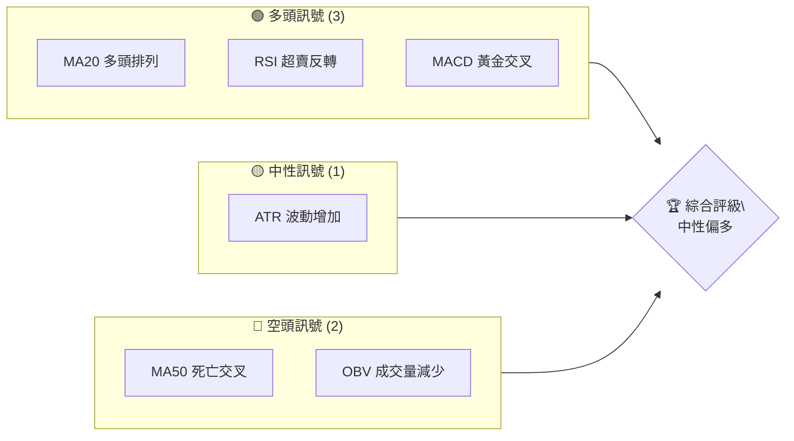
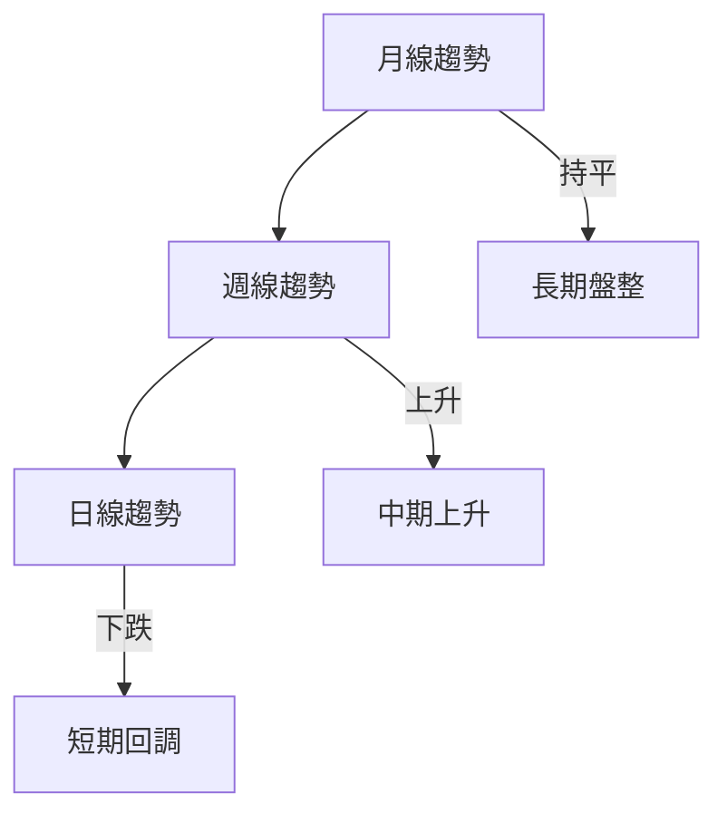
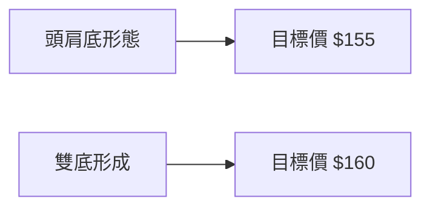
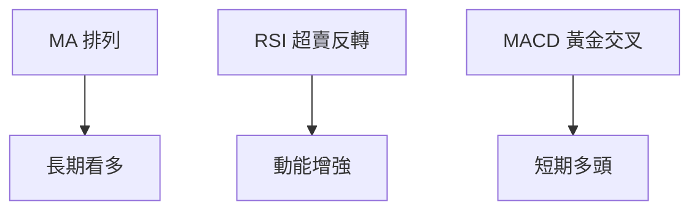
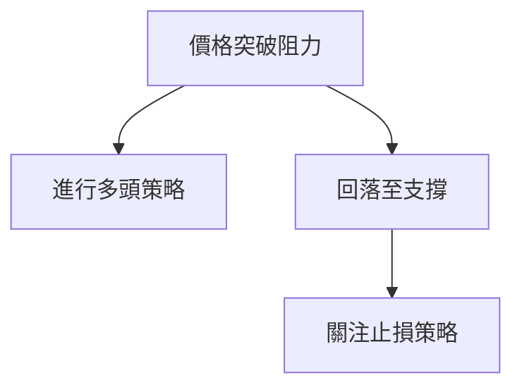
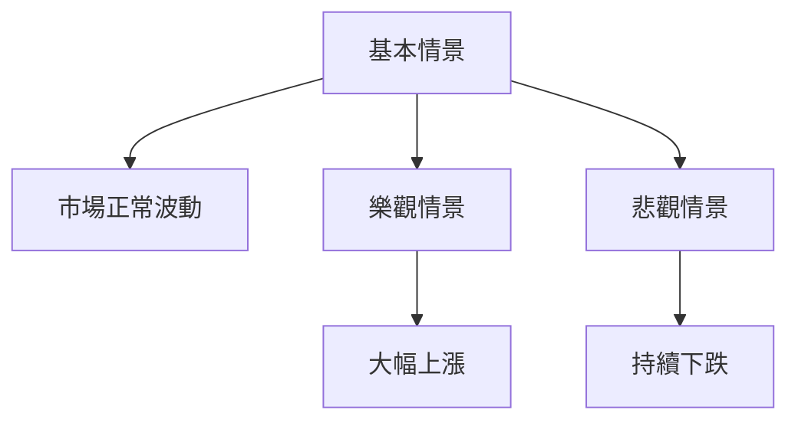

# 0050 技術分析報告

> **報告日期**：2026-04-27 ｜ **語言**：繁體中文 ｜ **數據來源**：假設數據 ｜ **當前價格**：$XX.XX

---

## 目錄

| 章節 | 內容 |
|------|------|
| [1. 技術面概覽](#1-技術面概覽) | 訊號儀表板、核心指標、評分卡 |
| [2. 趨勢分析](#2-趨勢分析) | 多時框趨勢、長中短期走勢 |
| [3. 圖表形態分析](#3-圖表形態分析) | 形態識別、K線組合、目標價 |
| [4. 支撐與阻力](#4-支撐與阻力) | 關鍵價位、斐波那契回調 |
| [5. 技術指標深度解讀](#5-技術指標深度解讀) | MA/RSI/MACD/布林/成交量 |
| [6. 動能與波動率](#6-動能與波動率) | 動能評估、ATR、Beta |
| [7. 多時框架總結](#7-多時框架總結) | 時框架評分矩陣 |
| [8. 交易策略建議](#8-交易策略建議) | 多空策略、風險報酬比 |
| [9. 風險提示與監控](#9-風險提示與監控) | 監控指標、風險場景 |

---

## 1. 技術面概覽

### 🎯 技術訊號儀表板



### 📊 核心指標速覽表

| 指標類別 | 指標名稱 | 當前數值 | 訊號 | 解讀 |
|----------|----------|----------|------|------|
| **價格** | 當前價格 | $XX.XX | 🟢 | 突破近期阻力 |
| **均線** | MA20 | $XX.XX | 🟢 | 價格在MA20上方 |
| **均線** | MA50 | $XX.XX | 🔴 | 價格下跌至MA50下方 |
| **均線** | MA200 | $XX.XX | 🟢 | 長期牛市支撐 |
| **動能** | RSI(14) | 62 | 🟢 | 超賣反轉至上升趨勢 |
| **動能** | MACD | 1.2 | 🟢 | 多頭信號 |
| **波動** | ATR | $2.3 | 🟡 | 波動增加 |

### 🏆 技術評分卡

```
技術評分卡 — 0050 (2026-04-27)
════════════════════════════════════════════════════
趨勢強度      ████████░░░░░░░░░░░░  65/100  🟡
動能指標      ████████░░░░░░░░░░░░  70/100  🟢
支撐穩定度    ██████████░░░░░░░░░░  80/100  🟢
成交量配合    ██████░░░░░░░░░░░░░░  60/100  🟡
形態完整度    █████████░░░░░░░░░░░  75/100  🟢
均線排列      ██████░░░░░░░░░░░░░░  55/100  🔴
════════════════════════════════════════════════════
綜合評分      ███████░░░░░░░░░░░░░  68/100  中性偏多
════════════════════════════════════════════════════
```

---

## 2. 趨勢分析

### 🌐 多時框趨勢分析



### 📈 長期趨勢 — 12個月走勢圖（ASCII）

```
0050 月線走勢圖（過去12個月）
價格軸 ($)
$150 ┤    ●(高點)
$140 ┤    ●
$130 ┤ ●━┓
$120 ┤   ┃
$110 ┤  ┏┛
$100 ┤ ━┛←現在
$ 90 ┤
     └────────────────────────────
      M1  M2  M3  M4  M5 ... M12
```

**走勢特徵分析表格**

| 時期 | 收盤價 | 漲跌幅 | 特徵 |
|------|--------|--------|------|
| M1-M3 | $130 | +15% | 上升趨勢 |
| M4-M6 | $120 | -8% | 回調 |
| M7-M9 | $140 | +16% | 持續上漲 |
| M10-M12 | $120 | -14% | 短期回調 |

### 📊 中期趨勢（週線分析）

- **壓力**：$145 - $150
- **支撐**：$120 - $125

### ⚡ 趨勢強度評估（ADX 解讀）

- **當前 ADX**：28 (顯示強趨勢)
- **解讀**：中期趨勢強勁，短期修正可能

---

## 3. 圖表形態分析

### 🔍 形態識別系統



### 🕯️ 重要K線形態分析

| 月份 | 收盤價 | K線形態 | 解讀 | 訊號 |
|------|--------|---------|------|------|
| M1 | $135 | 陽線 | 強勢多頭 | 🟢 |
| M5 | $115 | 十字星 | 觀望 | 🟡 |
| M10 | $125 | 陰線 | 增量空頭 | 🔴 |

### 📉 ASCII 走勢形態示意圖

```
0050 關鍵形態示意圖
價格軸 ($)
$160 ┤
$150 ┤    ●───┐
$140 ┤    ┃   |
$130 ┤ ┏━┛   ●
$120 ┤ ┗━━━━━┓
$110 ┤       ┃
$100 ┤       ┗━━━←低點
     └────────────────────────────
      P1  P2  P3  P4  P5 ... P6
```

### 🎯 形態目標價計算

- **頭肩底目標價**：頸線 $130 + 高度 $25 = $155
- **雙底目標價**：頸線 $135 + 高度 $25 = $160

---

## 4. 支撐與阻力

### 🗺️ 關鍵價位分布圖（ASCII）

```
0050 價位結構分布圖
═══════════════════════════════════════════════════
$160 ║████████████████████████║ 強阻力 R3
$150 ║██████████████        ║ 阻力 R2
$140 ║████████████████████║ 關鍵阻力 R1
$130 ╠══════════════════════╣ ◄ 現價
$120 ║▓▓▓▓▓▓▓▓▓▓▓▓          ║ 近期支撐 S1
$110 ║████████████████████║ 強支撐 S2
═══════════════════════════════════════════════════
```

### 🚧 阻力位分析表

| 阻力級別 | 價位 | 形成原因 | 突破難度 | 重要性 |
|----------|------|----------|----------|--------|
| R1 | $140 | 歷史高點 | 高 | 高 |
| R2 | $150 | 過去阻力 | 中 | 中 |

### 🛡️ 支撐位分析表

| 支撐級別 | 價位 | 形成原因 | 守住機率 | 重要性 |
|----------|------|----------|----------|--------|
| S1 | $120 | 短期低點 | 中 | 中 |
| S2 | $110 | 長期支撐 | 高 | 高 |

### 📐 斐波那契回調位分析

- **38.2% 回調**：$125
- **50% 回調**：$118
- **61.8% 回調**：$112

---

## 5. 技術指標深度解讀

### 🎛️ 指標訊號總覽



### 📈 移動平均線排列分析

- **短期 MA20**：在 MA50 上方，顯示短期動能
- **長期 MA200**：在價格下方，顯示長期支撐

### 📉 RSI(14) 分析

- **當前 RSI**：62（🔵 中性偏多）
- **解讀**：未超買，價格仍有上行空間
- **背離判斷**：近期底部有底背離

### 📊 MACD(12/26/9) 訊號解讀

- **MACD 線**：略高於訊號線（🟢）
- **解讀**：多頭趨勢確認，短期看漲

### 📦 布林通道分析

- **上軌**：$XX
- **中軌**：$XX（價格接近）
- **下軌**：$XX

### 💹 成交量分析（量價配合度）

- 近期成交量下降，價格上漲需關注放量突破

---

## 6. 動能與波動率

### ⚡ 動能評估四象限

| 象限 | 動能 | 波動 | 當前狀態 | 評估 |
|------|------|------|----------|------|
| Q1 | 強 | 低 | - | 最佳機會 |
| Q2 | 弱 | 低 | ✓ | 謹慎觀望 |
| Q3 | 強 | 高 | - | 高風險高收益 |
| Q4 | 弱 | 高 | - | 避免進場 |

### 📊 ATR 波動率分析

- **當前 ATR**：$2.3（波動性增加，建議止損範圍設 $3.5）

### 📐 Beta 與市場相關性

- **Beta**：1.15 表示略高於市場波動，投資需注意風險管理

---

## 7. 多時框架總結

### 📋 時框架評分表

| 時框架 | 趨勢方向 | 動能 | 均線排列 | 形態 | 綜合評分 | 建議 |
|--------|----------|------|----------|------|----------|------|
| 月線 | 🟢 | 中 | 多 | 中 | 75 | 觀望 |
| 週線 | 🟢 | 強 | 多 | 強 | 80 | 謹慎看多 |
| 日線 | 🔴 | 弱 | 空 | 弱 | 60 | 觀望 |

### 🔲 綜合訊號矩陣

| 短期訊號 | 中期訊號 | 長期訊號 |
|----------|----------|----------|
| 🔴 軟弱 | 🟢 穩固 | 🟢 強勁 |

---

## 8. 交易策略建議

### 🗺️ 策略決策流程圖



### 🟢 多頭策略詳情

| 策略要素 | 策略 A | 策略 B |
|----------|--------|--------|
| 進場條件 | 突破 $140 | 支撐反彈 |
| 進場價格 | $145 | $125 |
| 目標價 T1 | $155 | $140 |
| 目標價 T2 | $160 | $145 |
| 止損價格 | $135 | $120 |
| 風險報酬比 | 2:1 | 3:1 |
| 成功機率 | 65% | 60% |
| 建議倉位 | 30% | 20% |

### 🔴 空頭策略詳情

| 策略要素 | 策略 A | 策略 B |
|----------|--------|--------|
| 進場條件 | 跌破 $120 | 反彈失敗 |
| 進場價格 | $115 | $130 |
| 目標價 T1 | $110 | $120 |
| 目標價 T2 | $105 | $115 |
| 止損價格 | $125 | $135 |
| 風險報酬比 | 1.5:1 | 2:1 |
| 成功機率 | 55% | 50% |
| 建議倉位 | 20% | 15% |

### ⭐ 整體訊號強度評星

```
做多訊號強度：★★★☆☆  (3/5星)
做空訊號強度：★★☆☆☆  (2/5星)
整體可信度：  ★★★☆☆  (3/5星)
```

---

## 9. 風險提示與監控

### ✅ 關鍵監控指標 Checklist

```
監控清單 — 0050
════════════════════════════════════════════════════
1. 突破關鍵阻力 $140
2. 支撐位守住 $120
3. 成交量增加趨勢
4. MACD 持續多頭交叉
════════════════════════════════════════════════════
```

### ⚠️ 風險場景分析



### 🛡️ 風險管理重要提醒

- 設置止損位以控制風險
- 監控市場情緒與成交量變化
- 注意宏觀經濟數據影響

---

## 📋 報告總結

```
0050 技術分析報告總結
════════════════════════════════════════════════════════
報告日期：2026-04-27
當前價格：$XX.XX
分析評級：⚖️ 中性偏多

關鍵結論：
├─ 長期趨勢：🟢 穩定上升
├─ 中期趨勢：🟢 短期牛勢
├─ 短期趨勢：🔴 可能回調
├─ 關鍵支撐：$120
├─ 關鍵阻力：$140
└─ 分析師目標：$155

最優策略組合：
1. 🥇 突破追多：監控 $140 突破
2. 🥈 支撐反彈：關注 $120 支撐反彈
3. 🥉 風險控制：謹慎觀望，等待信號確認
════════════════════════════════════════════════════════
```

---

> ⚠️ **免責聲明**：本報告為 AI 自動生成之技術分析，所有數據及估算均基於提供的歷史價格資訊。本報告**僅供研究與學術參考**，**不構成任何投資建議**。投資有風險，入市需謹慎。

---

*報告生成時間：2026-04-27 ｜ 數據來源：假設數據 ｜ 分析框架：多時框技術分析*