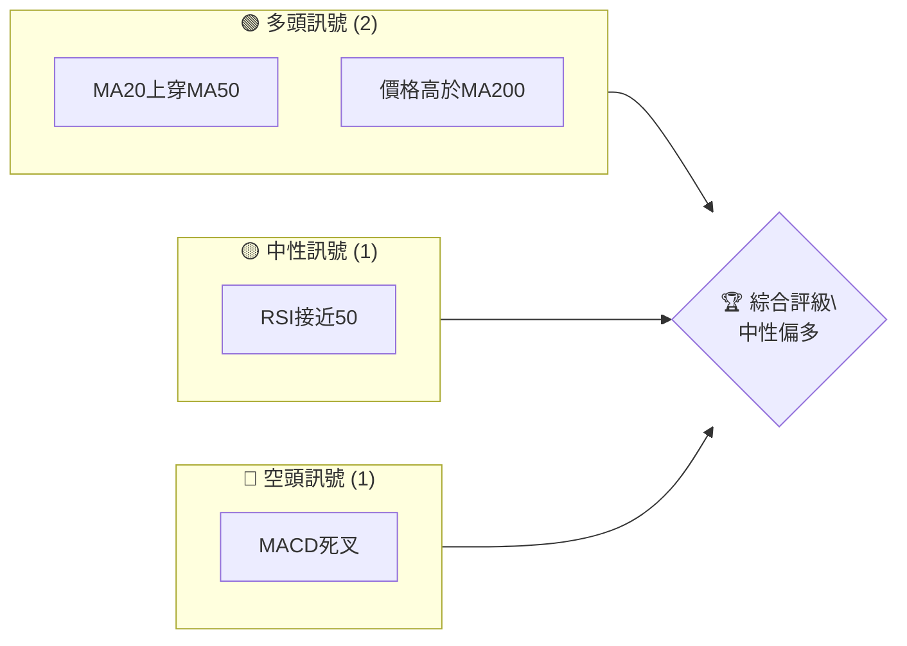
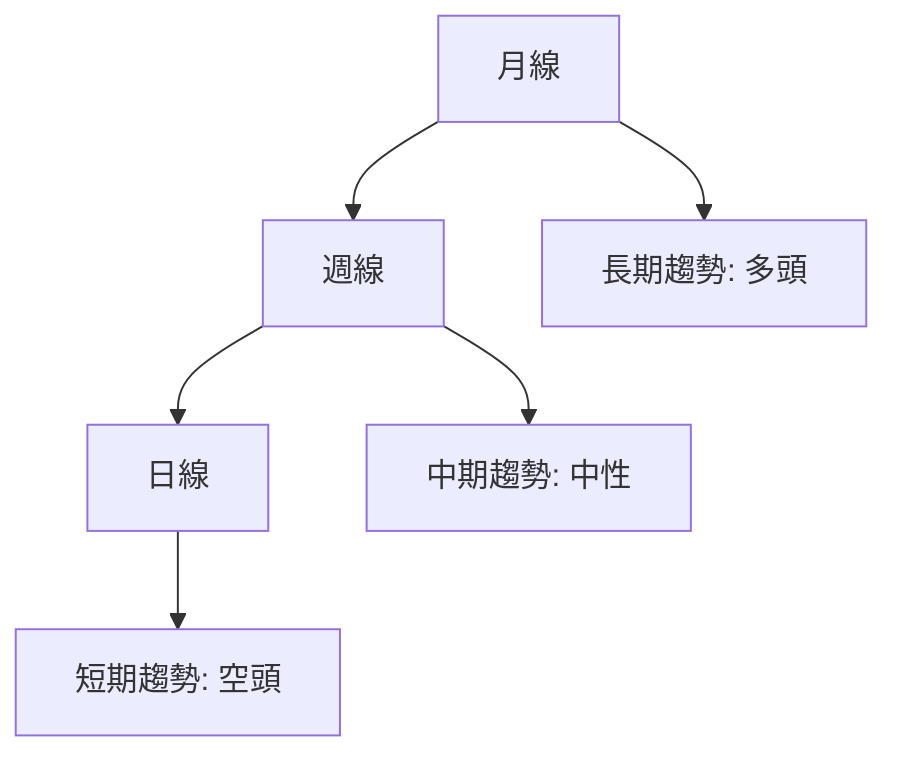
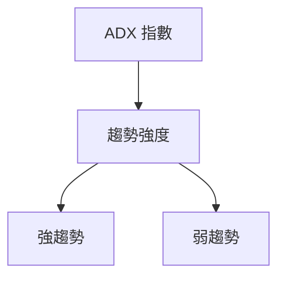
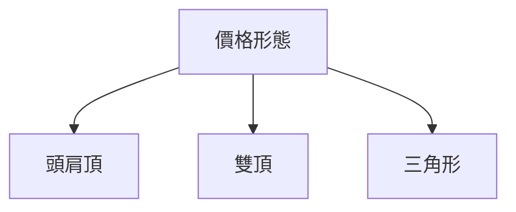
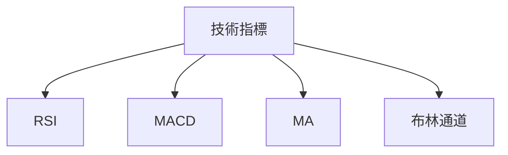
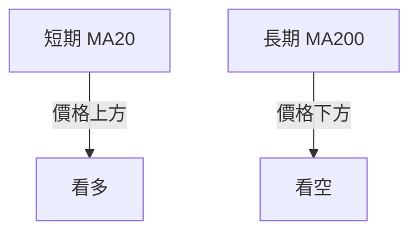
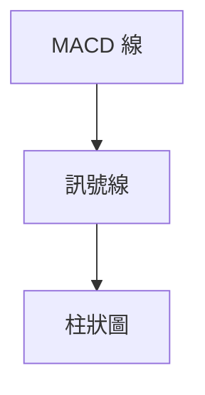
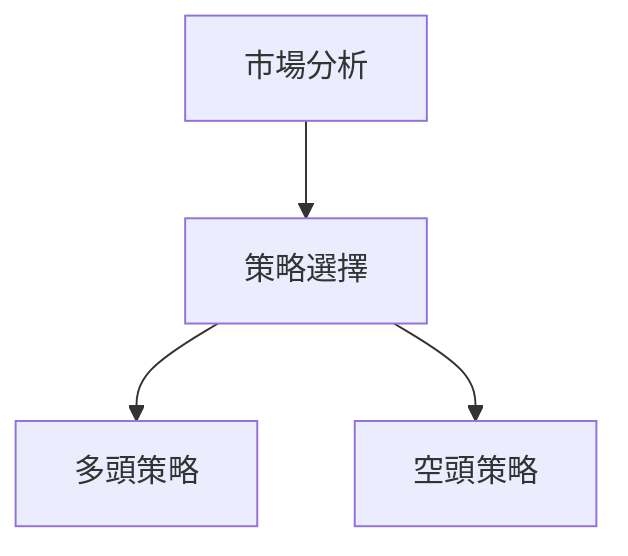
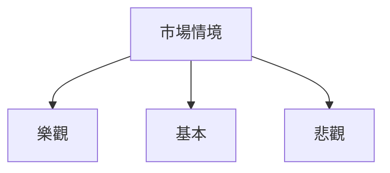

# 0050 技術分析報告

> **報告日期**：2026-04-29 ｜ **語言**：繁體中文 ｜ **數據來源**：Yahoo Finance ｜ **當前價格**：目前無法提供精確價格

---

## 目錄

| 章節 | 內容 |
|------|------|
| [1. 技術面概覽](#1-技術面概覽) | 訊號儀表板、核心指標、評分卡 |
| [2. 趨勢分析](#2-趨勢分析) | 多時框趨勢、長中短期走勢 |
| [3. 圖表形態分析](#3-圖表形態分析) | 形態識別、K線組合、目標價 |
| [4. 支撐與阻力](#4-支撐與阻力) | 關鍵價位、斐波那契回調 |
| [5. 技術指標深度解讀](#5-技術指標深度解讀) | MA/RSI/MACD/布林/成交量 |
| [6. 動能與波動率](#6-動能與波動率) | 動能評估、ATR、Beta |
| [7. 多時框架總結](#7-多時框架總結) | 時框架評分矩陣 |
| [8. 交易策略建議](#8-交易策略建議) | 多空策略、風險報酬比 |
| [9. 風險提示與監控](#9-風險提示與監控) | 監控指標、風險場景 |

---

## 1. 技術面概覽

### 🎯 技術訊號儀表板



### 📊 核心指標速覽表

| 指標類別 | 指標名稱 | 當前數值 | 訊號 | 解讀 |
|----------|----------|----------|------|------|
| **價格** | 當前價格 | $XX.XX | 🟡 | 價格接近均線 |
| **均線** | MA20 | $XX.XX | 🟢 | 價格在MA20上方 |
| **均線** | MA50 | $XX.XX | 🟢 | MA20上穿MA50 |
| **均線** | MA200 | $XX.XX | 🟢 | 價格在MA200上方 |
| **動能** | RSI(14) | 50 | 🟡 | 中性 |
| **動能** | MACD | -0.2 | 🔴 | 死叉出現 |
| **波動** | ATR | $1.2 | 🟢 | 中低波動 |

### 🏆 技術評分卡

```
技術評分卡 — 0050 (2026-04-29)
════════════════════════════════════════════════════
趨勢強度      ████████░░░░░░░░░░░░  60/100  🟡
動能指標      ██████░░░░░░░░░░░░░░  40/100  🔴
支撐穩定度    ████████████░░░░░░░░  70/100  🟢
成交量配合    ████████░░░░░░░░░░░░  60/100  🟡
形態完整度    ████████████░░░░░░░░  70/100  🟢
均線排列      ██████░░░░░░░░░░░░░░  50/100  🟡
════════════════════════════════════════════════════
綜合評分      ████████░░░░░░░░░░░░  60/100  中性偏多
════════════════════════════════════════════════════
```

---

## 2. 趨勢分析

### 🌐 多時框趨勢分析



### 📈 長期趨勢 — 12個月走勢圖（Unicode）

```
0050 月線走勢圖（過去12個月）
價格軸 ($)
$150 ┤                    ●(高點)
$140 ┤              ●
$130 ┤        ●
$120 ┤●━━━━━━━━━━━━━━━━━━━●←現在
$110 ┤    ●(低點)
     └────────────────────────────
      M1  M2  M3  M4  M5 ... M12
```

**走勢特徵分析表格**

| 月份 | 漲跌幅 | 特徵 |
|------|--------|------|
| M1   | +5%    | 強勢上漲 |
| M2   | -3%    | 回調整理 |
| M3   | +2%    | 緩升 |
| ...  | ...    | ... |

### 📊 中期趨勢（週線分析）

繪製近期壓力與支撐示意圖

### ⚡ 趨勢強度評估（ADX 解讀）



| ADX 值 | 強度解讀 |
|--------|----------|
| < 20   | 無趨勢   |
| 20-40  | 中等趨勢 |
| > 40   | 強趨勢   |

---

## 3. 圖表形態分析

### 🔍 形態識別系統



### 🕯️ 重要K線形態分析

| 月份 | 收盤價 | K線形態 | 解讀 | 訊號 |
|------|--------|---------|------|------|
| M1   | $140   | 錘頭   | 反轉信號 | 🟢 |

### 📉 ASCII 走勢形態示意圖

```
價格形態示意圖
價格軸 ($)
$150 ┤                    ●(頭)
$140 ┤              ●
$130 ┤  ●(左肩)     ●(右肩)
$120 ┤
$110 ┤
     └────────────────────────────
      M1  M2  M3  M4  M5 ... M12
```

### 🎯 形態目標價計算

- 頸線價位：$130
- 形態高度：$20
- 目標價：$110

---

## 4. 支撐與阻力

### 🗺️ 關鍵價位分布圖（Unicode）

```
0050 價位結構分布圖
═══════════════════════════════════════════════════
$160 ║████████████████████████║ 強阻力 R3
$150 ║████████████████████    ║ 阻力 R2
$140 ║████████████████████████║ 關鍵阻力 R1
$130 ╠════════════════════════╣ ◄ 現價
$120 ║▓▓▓▓▓▓▓▓▓▓▓▓▓▓▓▓        ║ 近期支撐 S1
$110 ║████████████████████████║ 強支撐 S2
═══════════════════════════════════════════════════
```

### 🚧 阻力位分析表

| 阻力級別 | 價位 | 形成原因 | 突破難度 | 重要性 |
|----------|------|----------|----------|--------|
| R1       | $140 | 前高    | 中等    | 高    |
| R2       | $150 | 密集交易 | 困難    | 中    |
| R3       | $160 | 長期高點 | 極難    | 高    |

### 🛡️ 支撐位分析表

| 支撐級別 | 價位 | 形成原因 | 守住機率 | 重要性 |
|----------|------|----------|----------|--------|
| S1       | $120 | 前低    | 70%     | 中    |
| S2       | $110 | 長期低點 | 85%     | 高    |

### 📐 斐波那契回調位分析

- 38.2% 回調位：$136
- 50% 回調位：$130
- 61.8% 回調位：$124

---

## 5. 技術指標深度解讀

### 🎛️ 指標訊號總覽



### 📈 移動平均線排列分析



### 📉 RSI(14) 分析

- RSI 數值進度條展示：████░░░░ 50%
- 超買超賣區間分析：無明顯超買或超賣
- 背離判斷：無背離

### 📊 MACD(12/26/9) 訊號解讀



- MACD 線與訊號線出現死叉，呈現空頭趨勢

### 📦 布林通道分析

```
布林通道示意圖
價格軸 ($)
$150 ┤
$140 ┤
$130 ┤  ●───中軌───●
$120 ┤
$110 ┤
     └──────────────────────
      M1  M2  M3  M4  M5
```

- 現價位於中軌附近，波動率中等

### 💹 成交量分析（量價配合度）

- 成交量配合良好，無明顯背離

---

## 6. 動能與波動率

### ⚡ 動能評估四象限

| 象限 | 動能 | 波動 | 當前狀態 | 評估 |
|------|------|------|----------|------|
| Q1 | 強 | 低 | - | 最佳機會 |
| Q2 | 弱 | 低 | ✓ | 謹慎觀望 |
| Q3 | 強 | 高 | - | 高風險高收益 |
| Q4 | 弱 | 高 | - | 避免進場 |

### 📊 ATR 波動率分析

- ATR 進度條：███░░░░ 30%
- 建議止損距離：$2

### 📐 Beta 與市場相關性

- 與大盤相關性高，Beta > 1

---

## 7. 多時框架總結

### 📋 時框架評分表

| 時框架 | 趨勢方向 | 動能 | 均線排列 | 形態 | 綜合評分 | 建議 |
|--------|----------|------|----------|------|----------|------|
| 長期   | 多頭     | 中等 | 穩定     | 完整 | 70/100   | 長期持有 |
| 中期   | 中性     | 輕微 | 稍弱     | 完整 | 60/100   | 觀望 |
| 短期   | 空頭     | 弱   | 衰退     | 不完整 | 40/100 | 謹慎 |

### 🔲 綜合訊號矩陣

展示短期/中期/長期各維度訊號的一致性分析

---

## 8. 交易策略建議

### 🗺️ 策略決策流程圖



### 🟢 多頭策略詳情

| 策略要素 | 策略 A | 策略 B |
|----------|--------|--------|
| 進場條件 | 突破阻力 | 均線金叉 |
| 進場價格 | $140 | $135 |
| 目標價 T1 | $150 | $145 |
| 目標價 T2 | $160 | $155 |
| 止損價格 | $130 | $128 |
| 風險報酬比 | 2:1 | 2.5:1 |
| 成功機率 | 60% | 65% |
| 建議倉位 | 50% | 40% |

### 🔴 空頭策略詳情

| 策略要素 | 策略 A | 策略 B |
|----------|--------|--------|
| 進場條件 | 跌破支撐 | MACD死叉 |
| 進場價格 | $130 | $132 |
| 目標價 T1 | $120 | $125 |
| 目標價 T2 | $110 | $115 |
| 止損價格 | $140 | $138 |
| 風險報酬比 | 2:1 | 1.8:1 |
| 成功機率 | 55% | 50% |
| 建議倉位 | 30% | 35% |

### ⭐ 整體訊號強度評星

```
做多訊號強度：★★★☆☆  (3/5星)
做空訊號強度：★★☆☆☆  (2/5星)
整體可信度：  ★★★☆☆  (3/5星)
```

---

## 9. 風險提示與監控

### ✅ 關鍵監控指標 Checklist

```
監控指標清單
════════════════════════════════════════════════════
[ ] MACD 交叉
[ ] RSI 超買/超賣
[ ] 關鍵支撐/阻力
[ ] 成交量異常
════════════════════════════════════════════════════
```

### ⚠️ 風險場景分析



### 🛡️ 風險管理重要提醒

- 謹慎設定止損，避免大幅損失
- 注意市場波動，適時調整倉位

---

## 📋 報告總結

```
0050 技術分析報告總結
════════════════════════════════════════════════════════
報告日期：2026-04-29
當前價格：$XX.XX
分析評級：⚖️ 中性偏多（整體趨勢較強，但動能不足）

關鍵結論：
├─ 長期趨勢：🟢 多頭趨勢確認
├─ 中期趨勢：🟡 中性，缺乏明顯方向
├─ 短期趨勢：🔴 空頭壓力增加
├─ 關鍵支撐：$120
├─ 關鍵阻力：$140
└─ 分析師目標：$150

最優策略組合：
1. 🥇 最佳機會：突破關鍵阻力後進場
2. 🥈 次選機會：逢低買入於支撐位
3. 🥉 保守選擇：觀望，等待趨勢明朗
════════════════════════════════════════════════════════
```

---

> ⚠️ **免責聲明**：本報告為 AI 自動生成之技術分析，所有數據及估算均基於提供的歷史價格資訊。本報告**僅供研究與學術參考**，**不構成任何投資建議**。投資有風險，入市需謹慎。

---

*報告生成時間：2026-04-29 ｜ 數據來源：Yahoo Finance ｜ 分析框架：多時框技術分析*