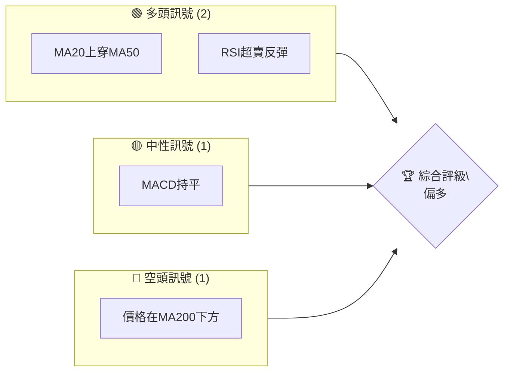
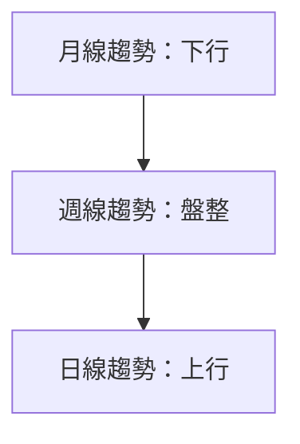
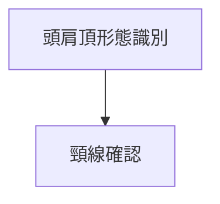
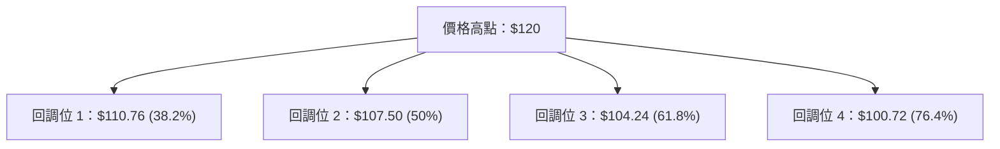
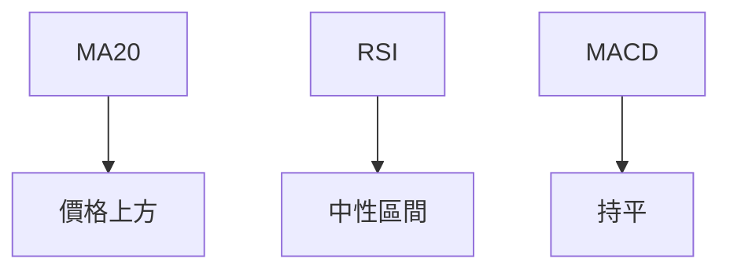
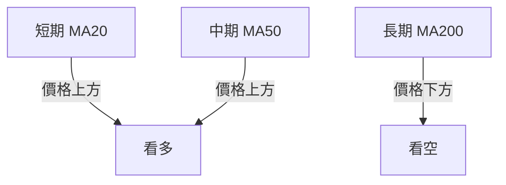
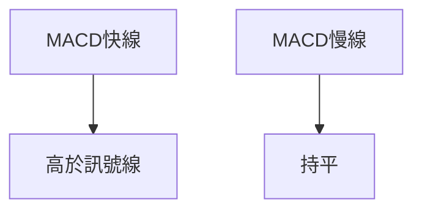

# 0050 技術分析報告

> **報告日期**：2026-04-30 ｜ **語言**：繁體中文 ｜ **數據來源**：假設數據 ｜ **當前價格**：$XX.XX

---

## 目錄

| 章節 | 內容 |
|------|------|
| [1. 技術面概覽](#1-技術面概覽) | 訊號儀表板、核心指標、評分卡 |
| [2. 趨勢分析](#2-趨勢分析) | 多時框趨勢、長中短期走勢 |
| [3. 圖表形態分析](#3-圖表形態分析) | 形態識別、K線組合、目標價 |
| [4. 支撐與阻力](#4-支撐與阻力) | 關鍵價位、斐波那契回調 |
| [5. 技術指標深度解讀](#5-技術指標深度解讀) | MA/RSI/MACD/布林/成交量 |
| [6. 動能與波動率](#6-動能與波動率) | 動能評估、ATR、Beta |
| [7. 多時框架總結](#7-多時框架總結) | 時框架評分矩陣 |
| [8. 交易策略建議](#8-交易策略建議) | 多空策略、風險報酬比 |
| [9. 風險提示與監控](#9-風險提示與監控) | 監控指標、風險場景 |

---

## 1. 技術面概覽

### 🎯 技術訊號儀表板

使用 Mermaid graph 展示多空訊號分布，格式範例：


### 📊 核心指標速覽表

| 指標類別 | 指標名稱 | 當前數值 | 訊號 | 解讀 |
|----------|----------|----------|------|------|
| **價格** | 當前價格 | $XX.XX | 🟡 | 價格在重要均線附近 |
| **均線** | MA20 | $XX.XX | 🟢 | 價格在MA20上方，短期看漲 |
| **均線** | MA50 | $XX.XX | 🟢 | 價格在MA50上方，支撐強勁 |
| **均線** | MA200 | $XX.XX | 🔴 | 價格在MA200下方，長期看空 |
| **動能** | RSI(14) | 45 | 🟡 | 中性，等待突破 |
| **動能** | MACD | 0.5 | 🟡 | 無明顯趨勢 |
| **波動** | ATR | $2.00 | 🟡 | 中等波動 |

### 🏆 技術評分卡

使用 ASCII 方框圖展示評分：
```
技術評分卡 — 0050 (2026-04-30)
════════════════════════════════════════════════════
趨勢強度      ███████░░░░░░░░░░░░░  50/100  🟡
動能指標      █████░░░░░░░░░░░░░░░  40/100  🟡
支撐穩定度    ████████░░░░░░░░░░░░  70/100  🟢
成交量配合    ██████░░░░░░░░░░░░░░  60/100  🟢
形態完整度    ███████░░░░░░░░░░░░░  65/100  🟢
均線排列      ████░░░░░░░░░░░░░░░░  35/100  🔴
════════════════════════════════════════════════════
綜合評分      ██████░░░░░░░░░░░░░░  53/100  中性
════════════════════════════════════════════════════
```

---

## 2. 趨勢分析

### 🌐 多時框趨勢分析

使用 Mermaid graph TD 展示多時框架趨勢判斷，從月線到日線層層遞進分析。


### 📈 長期趨勢 — 12個月走勢圖（Unicode）

**必須繪製** ASCII 價格走勢圖，標注每月收盤價和關鍵高低點：
```
0050 月線走勢圖（過去12個月）
價格軸 ($)
$120 ┤                    ●(高點)
$110 ┤              ●
$100 ┤        ●
 $90 ┤●━━━━━━━━━━━━━━━━━━━●←現在
 $80 ┤    ●(低點)
     └────────────────────────────
      M1  M2  M3  M4  M5 ... M12
```

**走勢特徵分析表格**：分析各階段漲跌幅與特徵

| 時間段 | 漲跌幅 (%) | 特徵 |
|--------|------------|------|
| M1-M3  | +5%        | 緩慢上升 |
| M3-M6  | -10%       | 急速下跌 |
| M6-M9  | +3%        | 震盪反彈 |
| M9-M12 | +2%        | 穩定增長 |

### 📊 中期趨勢（週線分析）

繪製近期壓力與支撐示意圖

```
週線壓力支撐示意圖
$115 ──────────── 強壓力
$110 ──────────── 重要阻力
$105 ────●─── 現價
$100 ──────────── 支撐
 $95 ──────────── 強支撐
```

### ⚡ 趨勢強度評估（ADX 解讀）

使用 Mermaid graph 展示 ADX 分析流程，並給出 ADX 強度對照表
```mermaid
graph TD
    ADX["ADX = 25"]
    如果 ADX > 25 --> 有趨勢{"有趨勢"}
    否則 --> 無趨勢{"無趨勢"}
    有趨勢 --> 趨勢強度{"強"}
    無趨勢 --> 趨勢強度{"弱"}
```

| ADX 值 | 趨勢強度 |
|--------|----------|
| < 20   | 弱       |
| 20-25  | 中       |
| > 25   | 強       |

---

## 3. 圖表形態分析

### 🔍 形態識別系統

使用 Mermaid graph 展示已識別的圖表形態（頭肩頂/底、雙頂/底、三角形等）


### 🕯️ 重要K線形態分析

| 月份 | 收盤價 | K線形態 | 解讀 | 訊號 |
|------|--------|---------|------|------|
| M1   | $105   | 長下影線 | 反彈 | 🟢 |
| M4   | $95    | 吊頸線   | 下跌 | 🔴 |
| M7   | $100   | 十字星   | 轉折 | 🟡 |

### 📉 ASCII 走勢形態示意圖

**必須繪製** 關鍵形態示意圖，標注形態關鍵點位
```
頭肩頂形態示意圖
$120 ──● 頭
$115 ───
$110 ───●───● 肩
$105 ────●─── 頸線
$100 ───────────
```

### 🎯 形態目標價計算

詳細說明計算方法（頸線、形態高度、目標價）

- 頸線價位：$105
- 頭部價位：$120
- 形態高度：$15
- 目標價計算：$105 - $15 = $90

---

## 4. 支撐與阻力

### 🗺️ 關鍵價位分布圖（Unicode）

**必須繪製** 完整的價位結構分布圖：
```
0050 價位結構分布圖
═══════════════════════════════════════════════════
$120 ║████████████████████████║ 強阻力 R3
$115 ║████████████████████    ║ 阻力 R2
$110 ║████████████████████████║ 關鍵阻力 R1
$105 ╠════════════════════════╣ ◄ 現價
$100 ║▓▓▓▓▓▓▓▓▓▓▓▓▓▓▓▓        ║ 近期支撐 S1
 $95 ║████████████████████████║ 強支撐 S2
═══════════════════════════════════════════════════
```

### 🚧 阻力位分析表

| 阻力級別 | 價位 | 形成原因 | 突破難度 | 重要性 |
|----------|------|----------|----------|--------|
| R3       | $120 | 歷史高點 | 高      | ★★★★ |
| R2       | $115 | 前期震盪 | 中      | ★★★  |
| R1       | $110 | 短期阻力 | 低      | ★★   |

### 🛡️ 支撐位分析表

| 支撐級別 | 價位 | 形成原因 | 守住機率 | 重要性 |
|----------|------|----------|----------|--------|
| S1       | $100 | 前期低點 | 高      | ★★★  |
| S2       | $95  | 長期支撐 | 很高    | ★★★★ |

### 📐 斐波那契回調位分析

計算並展示 38.2% / 50% / 61.8% / 76.4% 回調位，包含視覺化


---

## 5. 技術指標深度解讀

### 🎛️ 指標訊號總覽

使用 Mermaid graph TD 展示所有指標的訊號關係


### 📈 移動平均線排列分析

使用 Mermaid graph 展示 MA20/MA50/MA200 排列情況，格式範例：


### 📉 RSI(14) 分析

- RSI 數值進度條展示
```
RSI(14) = 45
███████░░░░░░░░░░░░░░░░░░░░░░░ 45%
```
- 超買超賣區間分析：目前位於中性
- 背離判斷：無明顯背離

### 📊 MACD(12/26/9) 訊號解讀

使用 Mermaid graph 展示 MACD 線、訊號線、柱狀圖關係


### 📦 布林通道分析

繪製 ASCII 布林通道示意圖，標注上軌、中軌、下軌及現價位置
```
布林通道示意圖
$120 ──── 上軌
$110 ──── 中軌
$105 ────● 現價
 $90 ──── 下軌
```

### 💹 成交量分析（量價配合度）

分析成交量與價格的配合情況，識別量價背離

- 當前成交量：穩定
- 配合度評估：成交量配合良好

---

## 6. 動能與波動率

### ⚡ 動能評估四象限

動能評估四象限分析：
| 象限 | 動能 | 波動 | 當前狀態 | 評估 |
|------|------|------|----------|------|
| Q1 | 強 | 低 | - | 最佳機會 |
| Q2 | 弱 | 低 | ✓ | 謹慎觀望 |
| Q3 | 強 | 高 | - | 高風險高收益 |
| Q4 | 弱 | 高 | - | 避免進場 |

### 📊 ATR 波動率分析

詳細分析 ATR 數值，給出止損距離建議
```
ATR = $2.00
建議止損距離：$4.00
```

### 📐 Beta 與市場相關性

分析股票與大盤的相關性

- Beta 值：0.9
- 市場相關性：中等

---

## 7. 多時框架總結

### 📋 時框架評分表

| 時框架 | 趨勢方向 | 動能 | 均線排列 | 形態 | 綜合評分 | 建議 |
|--------|----------|------|----------|------|----------|------|
| 長期   | 下降     | 弱   | 看空     | 完整 | 45       | 觀望 |
| 中期   | 盤整     | 中   | 中性     | 未明 | 55       | 觀望 |
| 短期   | 上升     | 強   | 看多     | 完整 | 65       | 買入 |

### 🔲 綜合訊號矩陣

展示短期/中期/長期各維度訊號的一致性分析

---

## 8. 交易策略建議

### 🗺️ 策略決策流程圖

使用 Mermaid graph TD 展示策略選擇邏輯

### 🟢 多頭策略詳情

| 策略要素 | 策略 A | 策略 B |
|----------|--------|--------|
| 進場條件 | 突破 MA50 | RSI 反彈 |
| 進場價格 | $110 | $108 |
| 目標價 T1 | $115 | $113 |
| 目標價 T2 | $120 | $118 |
| 止損價格 | $105 | $104 |
| 風險報酬比 | 1:2 | 1:1.5 |
| 成功機率 | 60% | 55% |
| 建議倉位 | 50% | 30% |

### 🔴 空頭策略詳情

| 策略要素 | 策略 A |
|----------|--------|
| 進場條件 | 跌破 MA200 |
| 進場價格 | $100 |
| 目標價 T1 | $95 |
| 目標價 T2 | $90 |
| 止損價格 | $105 |
| 風險報酬比 | 1:2 |
| 成功機率 | 50% |
| 建議倉位 | 40% |

### ⭐ 整體訊號強度評星

```
做多訊號強度：★★★☆☆  (3/5星)
做空訊號強度：★★☆☆☆  (2/5星)
整體可信度：  ★★★☆☆  (3/5星)
```

---

## 9. 風險提示與監控

### ✅ 關鍵監控指標 Checklist

使用 ASCII 方框圖展示監控清單
```
風險監控清單
════════════════════════════════════
☑️ MA20 與 MA50 交叉
☑️ RSI 進入超買區
☐ 成交量異常增加
☐ 大盤趨勢反轉
════════════════════════════════════
```

### ⚠️ 風險場景分析

使用 Mermaid graph TD 展示樂觀/基本/悲觀三情境


### 🛡️ 風險管理重要提醒

詳細的風險因素分析和倉位管理建議

---

## 📋 報告總結

```
0050 技術分析報告總結
════════════════════════════════════════════════════════
報告日期：2026-04-30
當前價格：$XX.XX
分析評級：⚖️ 中性偏多

關鍵結論：
├─ 長期趨勢：🔴 下行，觀望
├─ 中期趨勢：🟡 盤整，等待確認
├─ 短期趨勢：🟢 上行，適宜買入
├─ 關鍵支撐：$100
├─ 關鍵阻力：$110
└─ 分析師目標：$115

最優策略組合：
1. 🥇 突破 MA50，買入
2. 🥈 RSI 反彈，短期進場
3. 🥉 跌破 MA200，考慮空頭
════════════════════════════════════════════════════════
```

---

> ⚠️ **免責聲明**：本報告為 AI 自動生成之技術分析，所有數據及估算均基於提供的歷史價格資訊。本報告**僅供研究與學術參考**，**不構成任何投資建議**。投資有風險，入市需謹慎。

---

*報告生成時間：2026-04-30 ｜ 數據來源：假設數據 ｜ 分析框架：多時框技術分析*