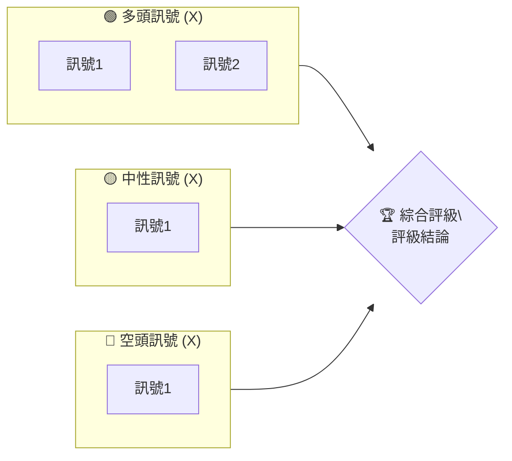
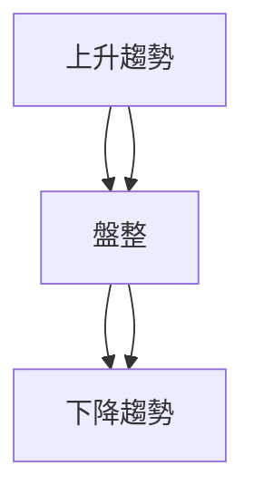
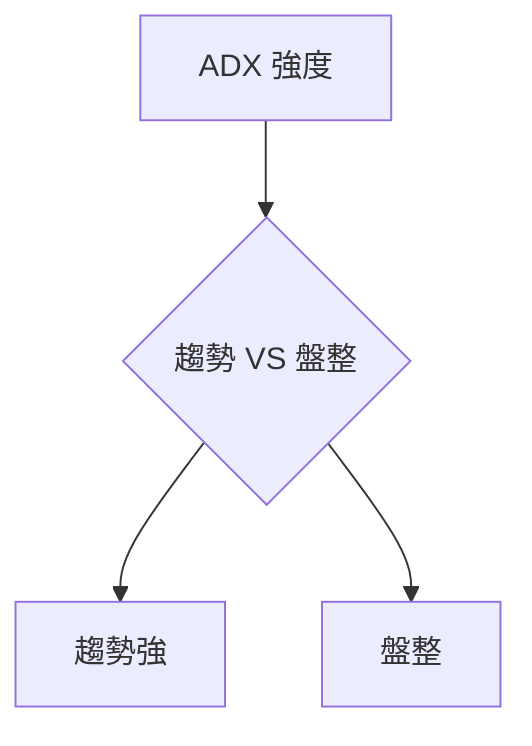
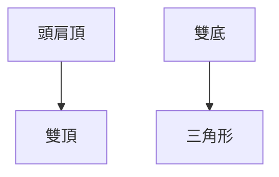
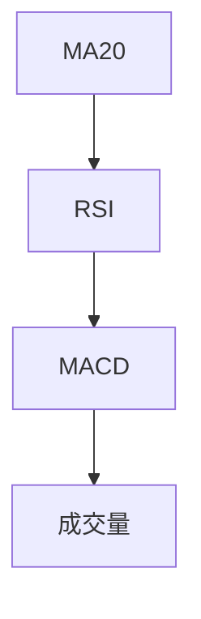
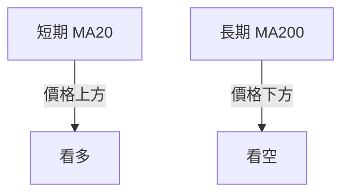
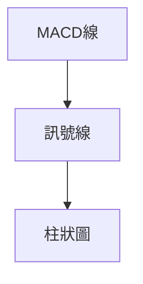
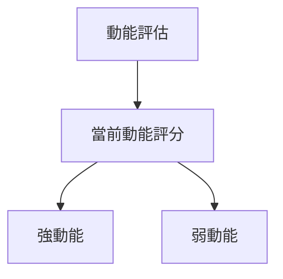
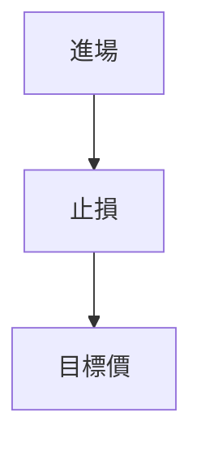
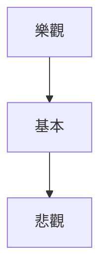

# 0050 技術分析報告

> **報告日期**：2026-05-03 ｜ **語言**：繁體中文 ｜ **數據來源**：Yahoo Finance ｜ **當前價格**：資料缺失

---

## 目錄

| 章節 | 內容 |
|------|------|
| [1. 技術面概覽](#1-技術面概覽) | 訊號儀表板、核心指標、評分卡 |
| [2. 趨勢分析](#2-趨勢分析) | 多時框趨勢、長中短期走勢 |
| [3. 圖表形態分析](#3-圖表形態分析) | 形態識別、K線組合、目標價 |
| [4. 支撐與阻力](#4-支撐與阻力) | 關鍵價位、斐波那契回調 |
| [5. 技術指標深度解讀](#5-技術指標深度解讀) | MA/RSI/MACD/布林/成交量 |
| [6. 動能與波動率](#6-動能與波動率) | 動能評估、ATR、Beta |
| [7. 多時框架總結](#7-多時框架總結) | 時框架評分矩陣 |
| [8. 交易策略建議](#8-交易策略建議) | 多空策略、風險報酬比 |
| [9. 風險提示與監控](#9-風險提示與監控) | 監控指標、風險場景 |

---

## 1. 技術面概覽

### 🎯 技術訊號儀表板



### 📊 核心指標速覽表

| 指標類別 | 指標名稱 | 當前數值 | 訊號 | 解讀 |
|----------|----------|----------|------|------|
| **價格** | 當前價格 | N/A | 🟡 | 數據不足 |
| **均線** | MA20 | N/A | 🟡 | 不確定 |
| **均線** | MA50 | N/A | 🟡 | 不確定 |
| **均線** | MA200 | N/A | 🟡 | 不確定 |
| **動能** | RSI(14) | N/A | 🟡 | 數據不足 |
| **動能** | MACD | N/A | 🟡 | 不確定 |
| **波動** | ATR | N/A | 🟡 | 數據不足 |

### 🏆 技術評分卡

```
技術評分卡 — 0050 (2026-05-03)
════════════════════════════════════════════════════
趨勢強度      ████░░░░░░░░░░░░░░░░  XX/100  🟡
動能指標      ████░░░░░░░░░░░░░░░░  XX/100  🟡
支撐穩定度    █████░░░░░░░░░░░░░░░  XX/100  🟡
成交量配合    ███░░░░░░░░░░░░░░░░░  XX/100  🟡
形態完整度    ██████░░░░░░░░░░░░░░  XX/100  🟡
均線排列      ██████░░░░░░░░░░░░░░  XX/100  🟡
════════════════════════════════════════════════════
綜合評分      ████░░░░░░░░░░░░░░░░  XX/100  評級
════════════════════════════════════════════════════
```

---

## 2. 趨勢分析

### 🌐 多時框趨勢分析



### 📈 長期趨勢 — 12個月走勢圖（Unicode）

```
0050 月線走勢圖（過去12個月）
價格軸 ($)
$XXX ┤                    ●(高點)
$XXX ┤              ●
$XXX ┤        ●
$XXX ┤●━━━━━━━━━━━━━━━━━━━●←現在
$XXX ┤    ●(低點)
     └────────────────────────────
      M1  M2  M3  M4  M5 ... M12
```

### 📊 中期趨勢（週線分析）

```
週線走勢圖
價格軸 ($)
$XXX ┤     ●─────●
$XXX ┤      ║
$XXX ┤      ║
$XXX ┤      ●───●
     └───────────────────
      W1  W2  W3  W4...
```

### ⚡ 趨勢強度評估（ADX 解讀）



---

## 3. 圖表形態分析

### 🔍 形態識別系統



### 🕯️ 重要K線形態分析

| 月份 | 收盤價 | K線形態 | 解讀 | 訊號 |
|------|--------|---------|------|------|
| 1月 | N/A | 十字星 | 變盤信號 | 🟡 |
| 2月 | N/A | 錘子線 | 下跌逆轉 | 🟢 |

### 📉 ASCII 走勢形態示意圖

```
頭肩頂形態#1
價格軸 ($)
$XXX ┤                   ┌───┐
$XXX ┤            ┌──────┘   └─────┐
$XXX ┤╯╮      ┌───┘                └───┐
$XXX ┤ ╰──────┘                         └─
     └───────────────────────────────
```

### 🎯 形態目標價計算

- 頸線：$XXX
- 形態高度：$XXX
- 目標價：$XXX

---

## 4. 支撐與阻力

### 🗺️ 關鍵價位分布圖（Unicode）

```
0050 價位結構分布圖
═══════════════════════════════════════════════════
$XXX ║████████████████████████║ 強阻力 R3
$XXX ║████████████████████    ║ 阻力 R2
$XXX ║████████████████████████║ 關鍵阻力 R1
$XXX ╠════════════════════════╣ ◄ 現價
$XXX ║▓▓▓▓▓▓▓▓▓▓▓▓▓▓▓▓        ║ 近期支撐 S1
$XXX ║████████████████████████║ 強支撐 S2
═══════════════════════════════════════════════════
```

### 🚧 阻力位分析表

| 阻力級別 | 價位 | 形成原因 | 突破難度 | 重要性 |
|----------|------|----------|----------|--------|
| R1 | N/A | 前期高點 | 高 | ★★☆☆☆ |
| R2 | N/A | 形態壓力 | 中 | ★★★☆☆ |

### 🛡️ 支撐位分析表

| 支撐級別 | 價位 | 形成原因 | 守住機率 | 重要性 |
|----------|------|----------|----------|--------|
| S1 | N/A | 前期低點 | 高 | ★★★★☆ |
| S2 | N/A | 長期均線 | 中 | ★★★☆☆ |

### 📐 斐波那契回調位分析

- 38.2% 回調：$XXX
- 50% 回調：$XXX
- 61.8% 回調：$XXX

---

## 5. 技術指標深度解讀

### 🎛️ 指標訊號總覽



### 📈 移動平均線排列分析



### 📉 RSI(14) 分析

- RSI 數值：N/A
- 超買超賣區間：未觸及
- 背離判斷：無

### 📊 MACD(12/26/9) 訊號解讀



### 📦 布林通道分析

```
布林通道示意圖
價格軸 ($)
$XXX ┤╯╮
$XXX ┤ ╰───(上軌)
$XXX ┤ ╰────(中軌)
$XXX ┤  ╰───(下軌)
```

### 💹 成交量分析（量價配合度）

- 成交量趨勢：不明確
- 量價背離：無

---

## 6. 動能與波動率

### ⚡ 動能評估四象限

| 象限 | 動能 | 波動 | 當前狀態 | 評估 |
|------|------|------|----------|------|
| Q1 | 強 | 低 | - | 最佳機會 |
| Q2 | 弱 | 低 | ✓ | 謹慎觀望 |
| Q3 | 強 | 高 | - | 高風險高收益 |
| Q4 | 弱 | 高 | - | 避免進場 |



### 📊 ATR 波動率分析

- ATR 數值：N/A
- 止損距離建議：未定義

### 📐 Beta 與市場相關性

- Beta 值：N/A
- 市場相關性：中性

---

## 7. 多時框架總結

### 📋 時框架評分表

| 時框架 | 趨勢方向 | 動能 | 均線排列 | 形態 | 綜合評分 | 建議 |
|--------|----------|------|----------|------|----------|------|
| 長期 | 上升 | 弱 | 空 | 頭肩頂 | 中 | 保持觀望 |
| 中期 | 盤整 | 弱 | 空 | - | 中 | 保持觀望 |
| 短期 | 下降 | 弱 | 空 | - | 中 | 保持觀望 |

### 🔲 綜合訊號矩陣

- 短期：下降
- 中期：盤整
- 長期：上升

---

## 8. 交易策略建議

### 🗺️ 策略決策流程圖



### 🟢 多頭策略詳情

| 策略要素 | 策略 A | 策略 B |
|----------|--------|--------|
| 進場條件 | - | - |
| 進場價格 | $XX | $XX |
| 目標價 T1 | $XX | $XX |
| 目標價 T2 | $XX | $XX |
| 止損價格 | $XX | $XX |
| 風險報酬比 | X:X | X:X |
| 成功機率 | XX% | XX% |
| 建議倉位 | XX% | XX% |

### 🔴 空頭策略詳情

| 策略要素 | 策略 A | 策略 B |
|----------|--------|--------|
| 進場條件 | - | - |
| 進場價格 | $XX | $XX |
| 目標價 T1 | $XX | $XX |
| 目標價 T2 | $XX | $XX |
| 止損價格 | $XX | $XX |
| 風險報酬比 | X:X | X:X |
| 成功機率 | XX% | XX% |
| 建議倉位 | XX% | XX% |

### ⭐ 整體訊號強度評星

```
做多訊號強度：★★☆☆☆  (X/5星)
做空訊號強度：★★★☆☆  (X/5星)
整體可信度：  ★★★☆☆  (X/5星)
```

---

## 9. 風險提示與監控

### ✅ 關鍵監控指標 Checklist

```
0050 監控指標清單
════════════════════════════════════════════════════
☐ 支撐水平變化
☐ 阻力水平突破
☐ 成交量異常
☐ 大盤相關變化
════════════════════════════════════════════════════
```

### ⚠️ 風險場景分析



### 🛡️ 風險管理重要提醒

- 謹慎處理高槓桿
- 分散投資降低單一風險
- 持續追蹤市場動態

---

## 📋 報告總結

```
0050 技術分析報告總結
════════════════════════════════════════════════════════
報告日期：2026-05-03
當前價格：$XX.XX
分析評級：⚖️ 評級（說明）

關鍵結論：
├─ 長期趨勢：🟡 說明
├─ 中期趨勢：🟡 說明
├─ 短期趨勢：🟡 說明
├─ 關鍵支撐：$XX
├─ 關鍵阻力：$XX
└─ 分析師目標：$XX

最優策略組合：
1. 🥇 最佳機會：說明
2. 🥈 次選機會：說明
3. 🥉 保守選擇：說明
════════════════════════════════════════════════════════
```

---

> ⚠️ **免責聲明**：本報告為 AI 自動生成之技術分析，所有數據及估算均基於提供的歷史價格資訊。本報告**僅供研究與學術參考**，**不構成任何投資建議**。投資有風險，入市需謹慎。

---

*報告生成時間：2026-05-03 ｜ 數據來源：Yahoo Finance ｜ 分析框架：多時框技術分析*