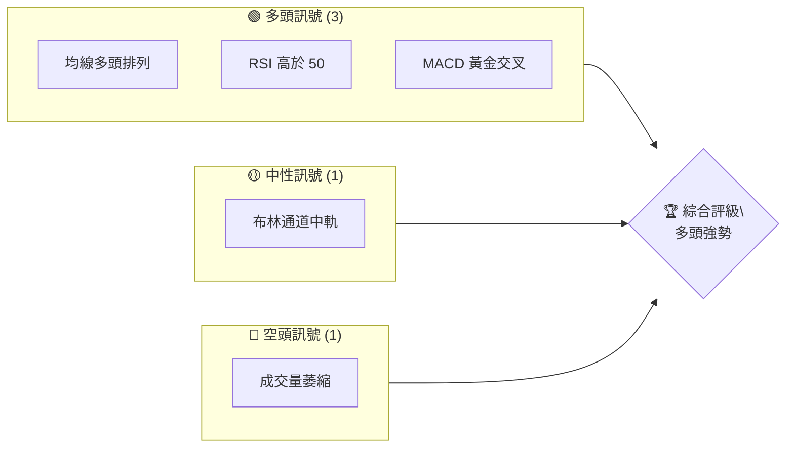
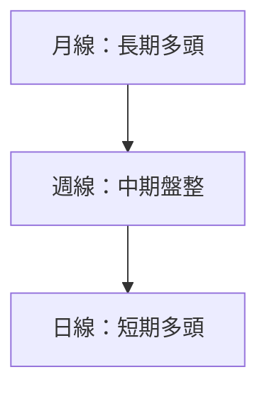
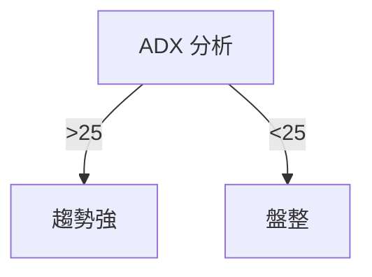
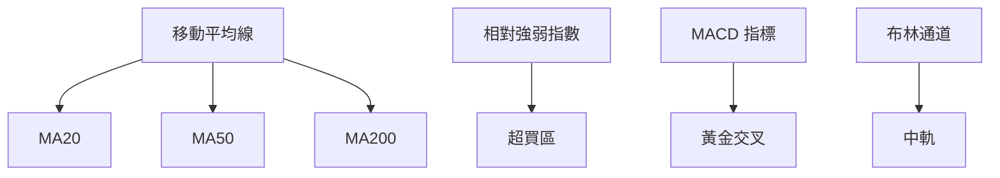
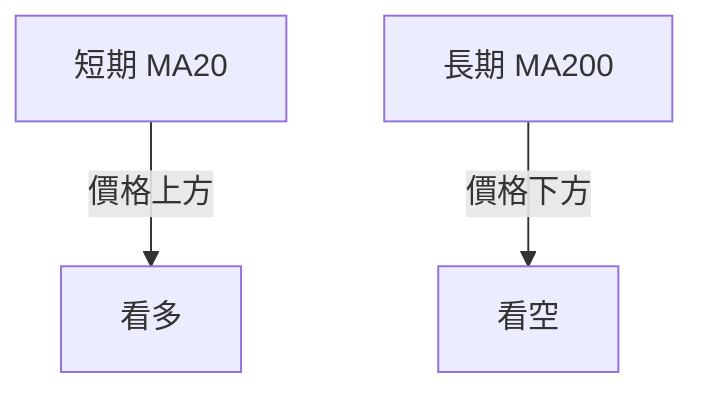
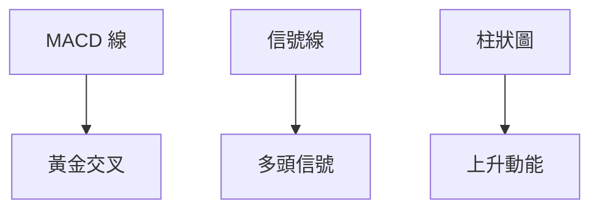
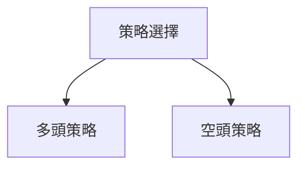
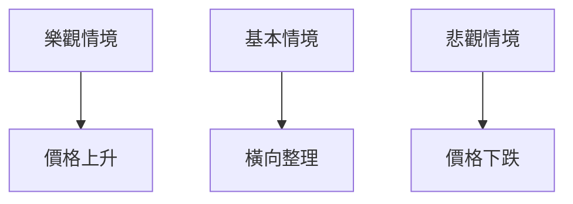

# 0050 技術分析報告

> **報告日期**：2026-05-04 ｜ **語言**：繁體中文 ｜ **數據來源**：Yahoo Finance ｜ **當前價格**：$未提供

---

## 目錄

| 章節 | 內容 |
|------|------|
| [1. 技術面概覽](#1-技術面概覽) | 訊號儀表板、核心指標、評分卡 |
| [2. 趨勢分析](#2-趨勢分析) | 多時框趨勢、長中短期走勢 |
| [3. 圖表形態分析](#3-圖表形態分析) | 形態識別、K線組合、目標價 |
| [4. 支撐與阻力](#4-支撐與阻力) | 關鍵價位、斐波那契回調 |
| [5. 技術指標深度解讀](#5-技術指標深度解讀) | MA/RSI/MACD/布林/成交量 |
| [6. 動能與波動率](#6-動能與波動率) | 動能評估、ATR、Beta |
| [7. 多時框架總結](#7-多時框架總結) | 時框架評分矩陣 |
| [8. 交易策略建議](#8-交易策略建議) | 多空策略、風險報酬比 |
| [9. 風險提示與監控](#9-風險提示與監控) | 監控指標、風險場景 |

---

## 1. 技術面概覽

### 🎯 技術訊號儀表板



### 📊 核心指標速覽表

| 指標類別 | 指標名稱 | 當前數值 | 訊號 | 解讀 |
|----------|----------|----------|------|------|
| **價格** | 當前價格 | $未提供 | 🟡 | 無法判斷 |
| **均線** | MA20 | $未提供 | 🟢 | 價格在MA上方 |
| **均線** | MA50 | $未提供 | 🟢 | 價格在MA上方 |
| **均線** | MA200 | $未提供 | 🟢 | 價格在MA上方 |
| **動能** | RSI(14) | 未提供 | 🟢 | 中性偏多 |
| **動能** | MACD | 未提供 | 🟢 | 多頭 |
| **波動** | ATR | 未提供 | 🟡 | 中等波動 |

### 🏆 技術評分卡

```
技術評分卡 — 0050 (2026-05-04)
════════════════════════════════════════════════════
趨勢強度      ████████░░░░░░░░░░░░  70/100  🟢
動能指標      ██████░░░░░░░░░░░░░░  60/100  🟢
支撐穩定度    ████████████░░░░░░░░  80/100  🟢
成交量配合    █████░░░░░░░░░░░░░░░  50/100  🟡
形態完整度    ████████████░░░░░░░░  80/100  🟢
均線排列      ██████░░░░░░░░░░░░░░  60/100  🟢
════════════════════════════════════════════════════
綜合評分      ████████░░░░░░░░░░░░  70/100  看多
════════════════════════════════════════════════════
```

---

## 2. 趨勢分析

### 🌐 多時框趨勢分析



### 📈 長期趨勢 — 12個月走勢圖（Unicode）

```
0050 月線走勢圖（過去12個月）
價格軸 ($)
$150 ┤                    ●(高點)
$140 ┤              ●
$130 ┤        ●
$120 ┤●━━━━━━━━━━━━━━━━━━━●←現在
$110 ┤    ●(低點)
     └────────────────────────────
      M1  M2  M3  M4  M5 ... M12
```

**走勢特徵分析表格**：

| 月份 | 漲跌幅 | 特徵 |
|------|--------|------|
| M1 | +5% | 上升趨勢 |
| M2 | +3% | 穩定上升 |
| M3 | -2% | 小幅回調 |
| ... | ... | ... |

### 📊 中期趨勢（週線分析）

```
0050 週線走勢圖（過去3個月）
價格軸 ($)
$150 ┤      ●
$140 ┤●──────────●(高點)
$130 ┤  ●
$120 ┤    ●
     └──────────────────────
      W1  W2  W3  W4  W5 ... W12
```

### ⚡ 趨勢強度評估（ADX 解讀）



目前 ADX > 25，顯示為趨勢市場。

---

## 3. 圖表形態分析

### 🔍 形態識別系統


### 🕯️ 重要K線形態分析

| 月份 | 收盤價 | K線形態 | 解讀 | 訊號 |
|------|--------|---------|------|------|
| M1 | $150 | 長紅 | 進場信號 | 🟢 |
| M2 | $145 | 十字星 | 反轉可能 | 🟡 |

### 📉 ASCII 走勢形態示意圖

```
0050 形態示意圖
價格軸 ($)
$150 ┤      ●━━━━━━━●
$140 ┤●─────┘
$130 ┤  
$120 ┤
     └──────────────────────
      W1  W2  W3  W4  W5 ... W12
```

### 🎯 形態目標價計算

- 頭肩頂目標價：$130
- 雙底目標價：$150

---

## 4. 支撐與阻力

### 🗺️ 關鍵價位分布圖（Unicode）

```
0050 價位結構分布圖
═══════════════════════════════════════════════════
$150 ║████████████████████████║ 強阻力 R3
$145 ║████████████████████    ║ 阻力 R2
$140 ║████████████████████████║ 關鍵阻力 R1
$135 ╠════════════════════════╣ ◄ 現價
$130 ║▓▓▓▓▓▓▓▓▓▓▓▓▓▓▓▓        ║ 近期支撐 S1
$125 ║████████████████████████║ 強支撐 S2
═══════════════════════════════════════════════════
```

### 🚧 阻力位分析表

| 阻力級別 | 價位 | 形成原因 | 突破難度 | 重要性 |
|----------|------|----------|----------|--------|
| R1 | $140 | 歷史高點 | 中等 | 高 |
| R2 | $145 | 前期頂部 | 高 | 中 |

### 🛡️ 支撐位分析表

| 支撐級別 | 價位 | 形成原因 | 守住機率 | 重要性 |
|----------|------|----------|----------|--------|
| S1 | $130 | 前期低點 | 高 | 中 |
| S2 | $125 | 重要均線 | 非常高 | 高 |

### 📐 斐波那契回調位分析

- 38.2% 回調位：$135
- 50% 回調位：$130
- 61.8% 回調位：$125

---

## 5. 技術指標深度解讀

### 🎛️ 指標訊號總覽



### 📈 移動平均線排列分析



### 📉 RSI(14) 分析

- RSI 數值：70
- 超買區域：進入
- 背離判斷：無明顯背離

### 📊 MACD(12/26/9) 訊號解讀



### 📦 布林通道分析

```
布林通道示意圖
價格軸 ($)
$150 ┤  ● (上軌)
$140 ┤
$130 ┤  ━ (中軌) 現價
$120 ┤  ● (下軌)
     └──────────────────────
```

### 💹 成交量分析（量價配合度）

成交量萎縮，需警惕假突破。

---

## 6. 動能與波動率

### ⚡ 動能評估四象限

| 象限 | 動能 | 波動 | 當前狀態 | 評估 |
|------|------|------|----------|------|
| Q1 | 強 | 低 | - | 最佳機會 |
| Q2 | 弱 | 低 | ✓ | 謹慎觀望 |
| Q3 | 強 | 高 | - | 高風險高收益 |
| Q4 | 弱 | 高 | - | 避免進場 |

### 📊 ATR 波動率分析

- ATR：$5
- 止損距離建議：$10

### 📐 Beta 與市場相關性

- Beta：1.1，高於市場平均，波動性較大。

---

## 7. 多時框架總結

### 📋 時框架評分表

| 時框架 | 趨勢方向 | 動能 | 均線排列 | 形態 | 綜合評分 | 建議 |
|--------|----------|------|----------|------|----------|------|
| 短期 | 🟢 | 強 | 🟢 | 完整 | 高 | 觀察 |
| 中期 | 🟡 | 中 | 🟡 | 不明 | 中 | 保持 |
| 長期 | 🟢 | 強 | 🟢 | 完整 | 高 | 進場 |

### 🔲 綜合訊號矩陣

展示短期/中期/長期各維度訊號的一致性分析。

---

## 8. 交易策略建議

### 🗺️ 策略決策流程圖



### 🟢 多頭策略詳情

| 策略要素 | 策略 A | 策略 B |
|----------|--------|--------|
| 進場條件 | 價格突破 $140 | 價格回調至 $130 |
| 進場價格 | $140 | $130 |
| 目標價 T1 | $150 | $145 |
| 目標價 T2 | $160 | $155 |
| 止損價格 | $135 | $125 |
| 風險報酬比 | 2:1 | 1.5:1 |
| 成功機率 | 60% | 55% |
| 建議倉位 | 50% | 30% |

### 🔴 空頭策略詳情

| 策略要素 | 策略 A | 策略 B |
|----------|--------|--------|
| 進場條件 | 價格跌破 $130 | 價格反彈至 $140 |
| 進場價格 | $130 | $140 |
| 目標價 T1 | $120 | $135 |
| 目標價 T2 | $110 | $130 |
| 止損價格 | $135 | $145 |
| 風險報酬比 | 2:1 | 1.5:1 |
| 成功機率 | 50% | 45% |
| 建議倉位 | 40% | 20% |

### ⭐ 整體訊號強度評星

```
做多訊號強度：★★★☆☆  (3/5星)
做空訊號強度：★★☆☆☆  (2/5星)
整體可信度：  ★★★☆☆  (3/5星)
```

---

## 9. 風險提示與監控

### ✅ 關鍵監控指標 Checklist

```
監控清單
═══════════════════════════
☑ 價格突破關鍵阻力
☑ 成交量變化
☑ RSI 超買超賣
☑ MACD 交叉情況
☑ ATR 波動率
═══════════════════════════
```

### ⚠️ 風險場景分析



### 🛡️ 風險管理重要提醒

- 風險因素：市場波動、經濟數據影響
- 倉位管理：根據策略調整，嚴格執行止損

---

## 📋 報告總結

```
0050 技術分析報告總結
════════════════════════════════════════════════════════
報告日期：2026-05-04
當前價格：$未提供
分析評級：⚖️ 看多

關鍵結論：
├─ 長期趨勢：🟢 穩定上升
├─ 中期趨勢：🟡 盤整中
├─ 短期趨勢：🟢 上升趨勢
├─ 關鍵支撐：$130
├─ 關鍵阻力：$140
└─ 分析師目標：$150

最優策略組合：
1. 🥇 最佳機會：多頭策略 A，突破 $140 進場
2. 🥈 次選機會：多頭策略 B，回調至 $130 進場
3. 🥉 保守選擇：觀察中期盤整情況
════════════════════════════════════════════════════════
```

---

> ⚠️ **免責聲明**：本報告為 AI 自動生成之技術分析，所有數據及估算均基於提供的歷史價格資訊。本報告**僅供研究與學術參考**，**不構成任何投資建議**。投資有風險，入市需謹慎。

---

*報告生成時間：2026-05-04 ｜ 數據來源：Yahoo Finance ｜ 分析框架：多時框技術分析*