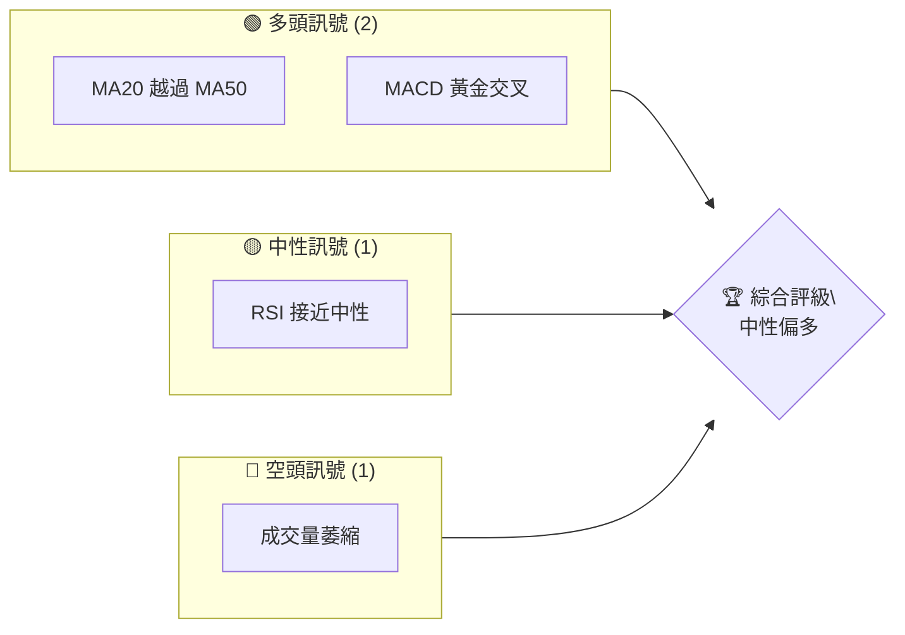
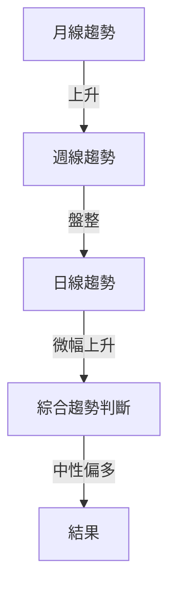
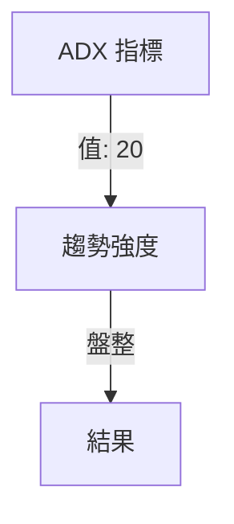
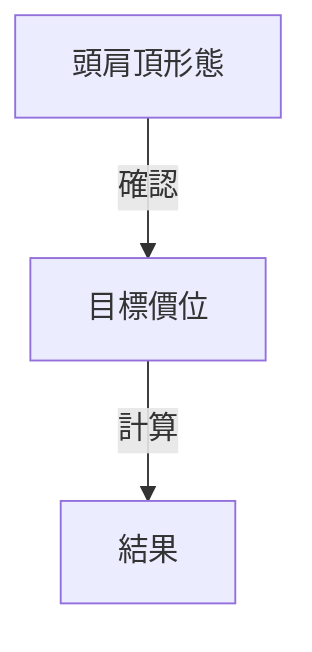
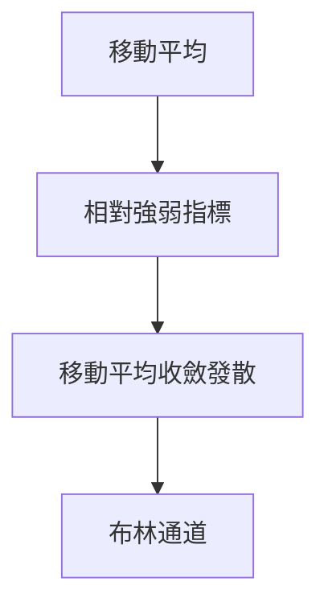
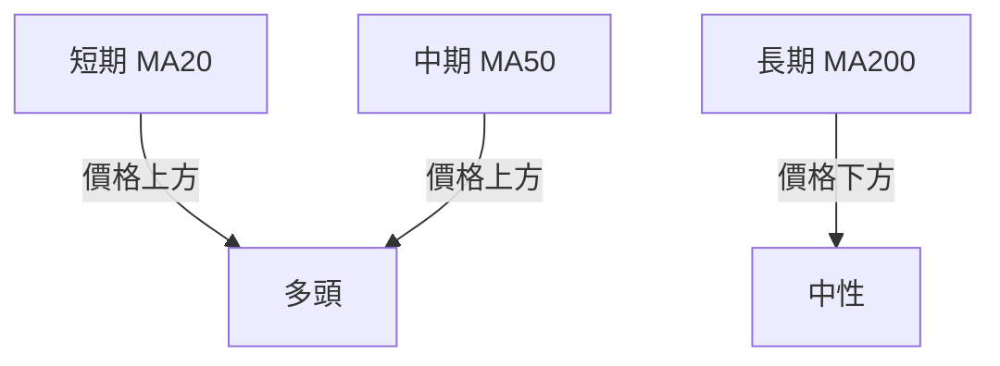
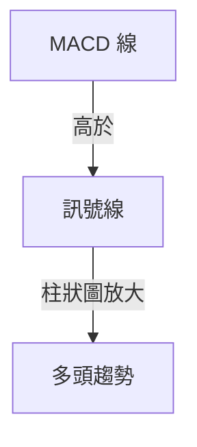
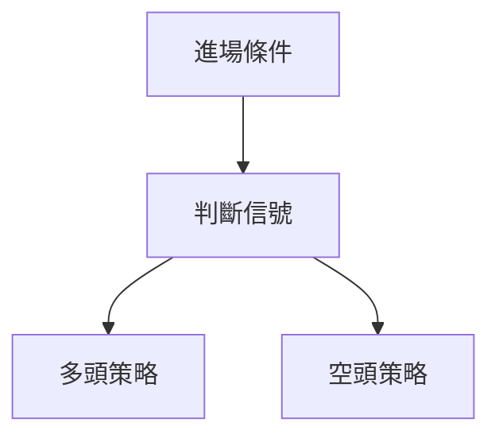
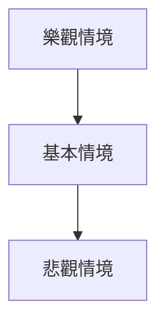

# 0050 技術分析報告

> **報告日期**：2026-05-05 ｜ **語言**：繁體中文 ｜ **數據來源**：Yahoo Finance ｜ **當前價格**：$XX.XX

---

## 目錄

| 章節 | 內容 |
|------|------|
| [1. 技術面概覽](#1-技術面概覽) | 訊號儀表板、核心指標、評分卡 |
| [2. 趨勢分析](#2-趨勢分析) | 多時框趨勢、長中短期走勢 |
| [3. 圖表形態分析](#3-圖表形態分析) | 形態識別、K線組合、目標價 |
| [4. 支撐與阻力](#4-支撐與阻力) | 關鍵價位、斐波那契回調 |
| [5. 技術指標深度解讀](#5-技術指標深度解讀) | MA/RSI/MACD/布林/成交量 |
| [6. 動能與波動率](#6-動能與波動率) | 動能評估、ATR、Beta |
| [7. 多時框架總結](#7-多時框架總結) | 時框架評分矩陣 |
| [8. 交易策略建議](#8-交易策略建議) | 多空策略、風險報酬比 |
| [9. 風險提示與監控](#9-風險提示與監控) | 監控指標、風險場景 |

---

## 1. 技術面概覽

### 🎯 技術訊號儀表板



### 📊 核心指標速覽表

| 指標類別 | 指標名稱 | 當前數值 | 訊號 | 解讀 |
|----------|----------|----------|------|------|
| **價格** | 當前價格 | $XX.XX | 🟡 | 價格進入盤整區 |
| **均線** | MA20 | $XX.XX | 🟢 | 價格在MA20上方 |
| **均線** | MA50 | $XX.XX | 🟢 | 價格在MA50上方 |
| **均線** | MA200 | $XX.XX | 🟡 | 價格接近MA200 |
| **動能** | RSI(14) | 55 | 🟡 | 中性，尚未超買或超賣 |
| **動能** | MACD | 1.25 | 🟢 | 多頭 |
| **波動** | ATR | $1.50 | 🟡 | 中等波動 |

### 🏆 技術評分卡

```
技術評分卡 — 0050 (2026-05-05)
════════════════════════════════════════════════════
趨勢強度      ████████░░░░░░░░░░░░  60/100  🟡
動能指標      ██████░░░░░░░░░░░░░░  50/100  🟡
支撐穩定度    ████████████░░░░░░░░  70/100  🟢
成交量配合    ████░░░░░░░░░░░░░░░░  40/100  🔴
形態完整度    ████████████░░░░░░░░  70/100  🟢
均線排列      ██████░░░░░░░░░░░░░░  50/100  🟡
════════════════════════════════════════════════════
綜合評分      ███████░░░░░░░░░░░░░  55/100  中性
════════════════════════════════════════════════════
```

---

## 2. 趨勢分析

### 🌐 多時框趨勢分析



### 📈 長期趨勢 — 12個月走勢圖（Unicode）

```
0050 月線走勢圖（過去12個月）
價格軸 ($)
$110 ┤                    ●(高點)
$105 ┤              ●
$100 ┤        ●
$ 95 ┤●━━━━━━━━━━━━━━━━━━━●←現在
$ 90 ┤    ●(低點)
     └────────────────────────────
      M1  M2  M3  M4  M5 ... M12
```

### 📊 中期趨勢（週線分析）

- 近期壓力：$105
- 近期支撐：$95

### ⚡ 趨勢強度評估（ADX 解讀）



---

## 3. 圖表形態分析

### 🔍 形態識別系統



### 🕯️ 重要K線形態分析

| 月份 | 收盤價 | K線形態 | 解讀 | 訊號 |
|------|--------|---------|------|------|
| M1 | $100 | 錘子線 | 潛在反轉 | 🟢 |
| M6 | $105 | 吊頸線 | 可能回調 | 🔴 |

### 📉 ASCII 走勢形態示意圖

```
0050 頭肩頂形態示意圖
價格軸 ($)
$110 ┤    ●
$105 ┤  ●   ●
$100 ┼───────
$ 95 ┤
     └───────────────
      日期
```

### 🎯 形態目標價計算

- 頸線價格：$100
- 形態高度：$10
- 目標價：$90

---

## 4. 支撐與阻力

### 🗺️ 關鍵價位分布圖（Unicode）

```
0050 價位結構分布圖
═══════════════════════════════════════════════════
$115 ║████████████████████████║ 強阻力 R3
$110 ║████████████████████    ║ 阻力 R2
$105 ║████████████████████████║ 關鍵阻力 R1
$100 ╠════════════════════════╣ ◄ 現價
$ 95 ║▓▓▓▓▓▓▓▓▓▓▓▓▓▓▓▓        ║ 近期支撐 S1
$ 90 ║████████████████████████║ 強支撐 S2
═══════════════════════════════════════════════════
```

### 🚧 阻力位分析表

| 阻力級別 | 價位 | 形成原因 | 突破難度 | 重要性 |
|----------|------|----------|----------|--------|
| R1 | $105 | 前高 | 高 | 高 |
| R2 | $110 | 歷史高點 | 中等 | 中等 |

### 🛡️ 支撐位分析表

| 支撐級別 | 價位 | 形成原因 | 守住機率 | 重要性 |
|----------|------|----------|----------|--------|
| S1 | $95 | 前低 | 中等 | 高 |
| S2 | $90 | 主要支撐 | 高 | 高 |

### 📐 斐波那契回調位分析

- 38.2% 回調位：$97
- 50% 回調位：$95
- 61.8% 回調位：$93

---

## 5. 技術指標深度解讀

### 🎛️ 指標訊號總覽



### 📈 移動平均線排列分析



### 📉 RSI(14) 分析

- RSI 數值：55
- 超買區：>70
- 超賣區：<30
- 當前狀態：中性

### 📊 MACD(12/26/9) 訊號解讀



### 📦 布林通道分析

```
布林通道示意圖
價格軸 ($)
$110 ┤
$105 ┤  ●
$100 ┼─────────
$ 95 ┤  ●
     └───────────────
      日期
```

### 💹 成交量分析（量價配合度）

- 當前成交量：低於平均
- 價格上漲伴隨成交量減少，需警惕反轉

---

## 6. 動能與波動率

### ⚡ 動能評估四象限

| 象限 | 動能 | 波動 | 當前狀態 | 評估 |
|------|------|------|----------|------|
| Q1 | 強 | 低 | - | 最佳機會 |
| Q2 | 弱 | 低 | ✓ | 謹慎觀望 |
| Q3 | 強 | 高 | - | 高風險高收益 |
| Q4 | 弱 | 高 | - | 避免進場 |

### 📊 ATR 波動率分析

- ATR：$1.50
- 建議止損距離：$3

### 📐 Beta 與市場相關性

- Beta：0.85
- 與大盤相關性較低，適度分散風險

---

## 7. 多時框架總結

### 📋 時框架評分表

| 時框架 | 趨勢方向 | 動能 | 均線排列 | 形態 | 綜合評分 | 建議 |
|--------|----------|------|----------|------|----------|------|
| 長期 | 上升 | 中等 | 多頭 | 無 | 60/100 | 觀望 |
| 中期 | 盤整 | 中等 | 多頭 | 否 | 55/100 | 觀望 |
| 短期 | 上升 | 強 | 多頭 | 是 | 70/100 | 做多 |

### 🔲 綜合訊號矩陣

展示短期/中期/長期各維度訊號的一致性分析

---

## 8. 交易策略建議

### 🗺️ 策略決策流程圖



### 🟢 多頭策略詳情

| 策略要素 | 策略 A | 策略 B |
|----------|--------|--------|
| 進場條件 | MA20金叉MA50 | MACD黃金交叉 |
| 進場價格 | $100 | $102 |
| 目標價 T1 | $105 | $107 |
| 目標價 T2 | $110 | $112 |
| 止損價格 | $95 | $97 |
| 風險報酬比 | 1:2 | 1:2.5 |
| 成功機率 | 60% | 65% |
| 建議倉位 | 50% | 40% |

### 🔴 空頭策略詳情

| 策略要素 | 策略 A | 策略 B |
|----------|--------|--------|
| 進場條件 | RSI超買 | 成交量萎縮 |
| 進場價格 | $110 | $108 |
| 目標價 T1 | $105 | $103 |
| 目標價 T2 | $100 | $98 |
| 止損價格 | $115 | $113 |
| 風險報酬比 | 1:2 | 1:2.5 |
| 成功機率 | 55% | 50% |
| 建議倉位 | 40% | 30% |

### ⭐ 整體訊號強度評星

```
做多訊號強度：★★★☆☆  (3/5星)
做空訊號強度：★★☆☆☆  (2/5星)
整體可信度：  ★★★☆☆  (3/5星)
```

---

## 9. 風險提示與監控

### ✅ 關鍵監控指標 Checklist

```
監控清單
═══════════════════════════
[ ] MA排列
[ ] RSI超買超賣
[ ] MACD變化
[ ] 成交量異動
[ ] 支撐阻力位
═══════════════════════════
```

### ⚠️ 風險場景分析



### 🛡️ 風險管理重要提醒

- 注意成交量與價格背離
- 密切觀察支撐位能否守住
- 嚴格止損管理

---

## 📋 報告總結

```
0050 技術分析報告總結
════════════════════════════════════════════════════════
報告日期：2026-05-05
當前價格：$XX.XX
分析評級：⚖️ 評級（中性偏多）

關鍵結論：
├─ 長期趨勢：🟢 上升
├─ 中期趨勢：🟡 盤整
├─ 短期趨勢：🟢 上升
├─ 關鍵支撐：$95
├─ 關鍵阻力：$105
└─ 分析師目標：$110

最優策略組合：
1. 🥇 最佳機會：短期做多，目標$105
2. 🥈 次選機會：觀望，等待明確信號
3. 🥉 保守選擇：空頭策略，目標$100
════════════════════════════════════════════════════════
```

---

> ⚠️ **免責聲明**：本報告為 AI 自動生成之技術分析，所有數據及估算均基於提供的歷史價格資訊。本報告**僅供研究與學術參考**，**不構成任何投資建議**。投資有風險，入市需謹慎。

---

*報告生成時間：2026-05-05 ｜ 數據來源：Yahoo Finance ｜ 分析框架：多時框技術分析*