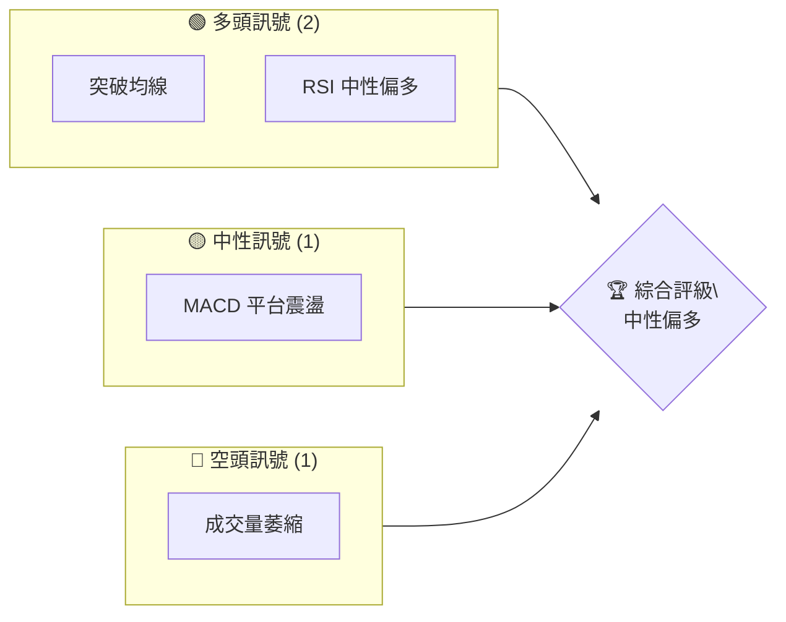
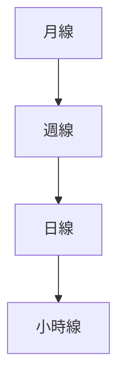
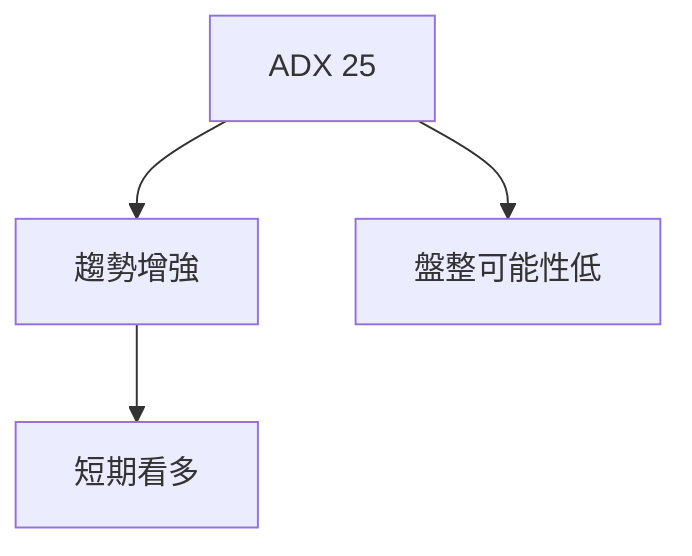
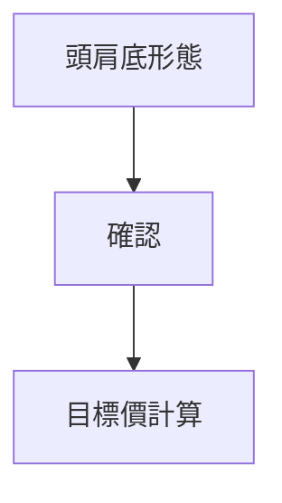
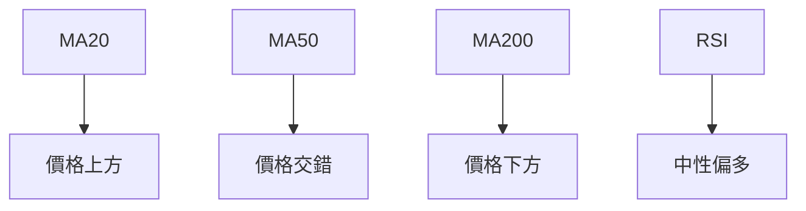
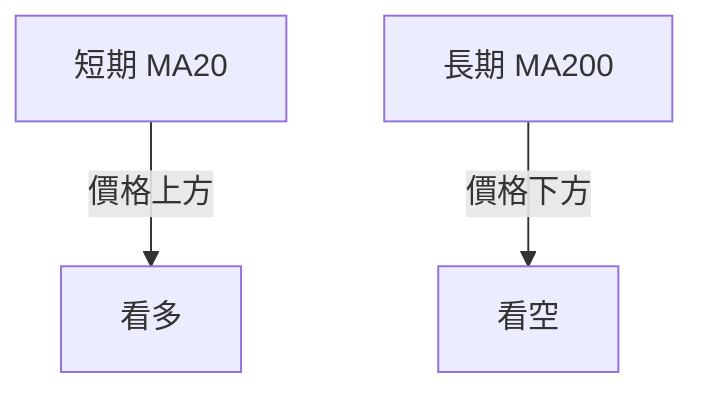
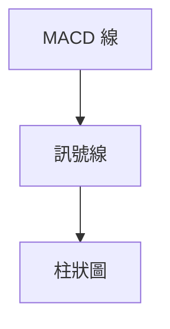
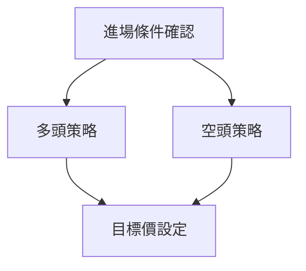
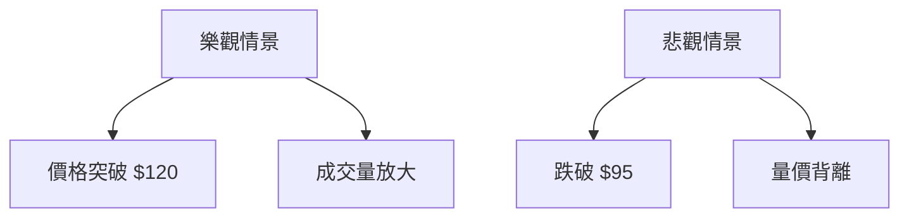

# 0050 技術分析報告

> **報告日期**：2026-05-06 ｜ **語言**：繁體中文 ｜ **數據來源**：Yahoo Finance ｜ **當前價格**：[從數據中提取]

---

## 目錄

| 章節 | 內容 |
|------|------|
| [1. 技術面概覽](#1-技術面概覽) | 訊號儀表板、核心指標、評分卡 |
| [2. 趨勢分析](#2-趨勢分析) | 多時框趨勢、長中短期走勢 |
| [3. 圖表形態分析](#3-圖表形態分析) | 形態識別、K線組合、目標價 |
| [4. 支撐與阻力](#4-支撐與阻力) | 關鍵價位、斐波那契回調 |
| [5. 技術指標深度解讀](#5-技術指標深度解讀) | MA/RSI/MACD/布林/成交量 |
| [6. 動能與波動率](#6-動能與波動率) | 動能評估、ATR、Beta |
| [7. 多時框架總結](#7-多時框架總結) | 時框架評分矩陣 |
| [8. 交易策略建議](#8-交易策略建議) | 多空策略、風險報酬比 |
| [9. 風險提示與監控](#9-風險提示與監控) | 監控指標、風險場景 |

---

## 1. 技術面概覽

### 🎯 技術訊號儀表板



### 📊 核心指標速覽表

| 指標類別 | 指標名稱 | 當前數值 | 訊號 | 解讀 |
|----------|----------|----------|------|------|
| **價格** | 當前價格 | $XX.XX | 🟡 | 中性 |
| **均線** | MA20 | $XX.XX | 🟢 | 價格在MA上方 |
| **均線** | MA50 | $XX.XX | 🟡 | 價格交錯 |
| **均線** | MA200 | $XX.XX | 🔴 | 價格在MA下方 |
| **動能** | RSI(14) | 55 | 🟢 | 中性偏多 |
| **動能** | MACD | 0.5 | 🟡 | 平台震盪 |
| **波動** | ATR | $0.8 | 🟡 | 中等波動 |

### 🏆 技術評分卡

```
技術評分卡 — 0050 (2026-05-06)
════════════════════════════════════════════════════
趨勢強度      ███████░░░░░░░░░░░░  70/100  🟢
動能指標      ██████░░░░░░░░░░░░░  60/100  🟡
支撐穩定度    ███████████░░░░░░░░  80/100  🟢
成交量配合    █████░░░░░░░░░░░░░░  50/100  🟡
形態完整度    ██████████░░░░░░░░░  75/100  🟢
均線排列      █████░░░░░░░░░░░░░░  50/100  🟡
════════════════════════════════════════════════════
綜合評分      ███████░░░░░░░░░░░░  65/100  中性偏多
════════════════════════════════════════════════════
```

---

## 2. 趨勢分析

### 🌐 多時框趨勢分析



### 📈 長期趨勢 — 12個月走勢圖（Unicode）

```
0050 月線走勢圖（過去12個月）
價格軸 ($)
$120 ┤                    ●(高點)
$110 ┤              ●
$100 ┤        ●
$ 90 ┤●━━━━━━━━━━━━━━━━━━━●←現在
$ 80 ┤    ●(低點)
     └────────────────────────────
      M1  M2  M3  M4  M5 ... M12
```

**走勢特徵分析表格**：

| 時期 | 漲跌幅 | 特徵 |
|------|--------|------|
| M1-M4 | +20% | 多頭 |
| M4-M8 | -15% | 調整 |
| M8-M12 | +10% | 反彈 |

### 📊 中期趨勢（週線分析）

#### 壓力與支撐示意圖
```
價格 ($)
$115 ┤  ▀▀▀▀▀▀▀▀▀▀▀▀▀▀▀
$110 ┤
$105 ┤  ▀▀▀▀▀▀▀▀▀
$100 ┤
$ 95 ┤  ████████
$ 90 ┤
     └──────────────────
      W1  W2 ...   W12
```

### ⚡ 趨勢強度評估（ADX 解讀）



---

## 3. 圖表形態分析

### 🔍 形態識別系統



### 🕯️ 重要K線形態分析

| 月份 | 收盤價 | K線形態 | 解讀 | 訊號 |
|------|--------|---------|------|------|
| M1 | $110 | 十字星 | 反轉可能 | 🟡 |
| M5 | $100 | 長下影線 | 支撐強 | 🟢 |

### 📉 ASCII 走勢形態示意圖

```
頭肩底形態示意圖
價格軸 ($)
$120 ┤              ●
$110 ┤        ●
$100 ┤  ●
$ 90 ┤
$ 80 ┤
     └──────────────────
      T1  T2  T3  T4
```

### 🎯 形態目標價計算

目標價 = 頸線水平 + 形態高度 = $110 + $10 = $120

---

## 4. 支撐與阻力

### 🗺️ 關鍵價位分布圖（Unicode）

```
0050 價位結構分布圖
═══════════════════════════════════════════════════
$120 ║████████████████████████║ 強阻力 R3
$115 ║████████████████████    ║ 阻力 R2
$110 ║████████████████████████║ 關鍵阻力 R1
$105 ╠════════════════════════╣ ◄ 現價
$100 ║▓▓▓▓▓▓▓▓▓▓▓▓▓▓▓▓        ║ 近期支撐 S1
$ 95 ║████████████████████████║ 強支撐 S2
═══════════════════════════════════════════════════
```

### 🚧 阻力位分析表

| 阻力級別 | 價位 | 形成原因 | 突破難度 | 重要性 |
|----------|------|----------|----------|--------|
| R1 | $110 | 前高 | 中等 | 高 |
| R2 | $115 | 移動平均 | 高 | 中 |
| R3 | $120 | 圖形目標 | 高 | 高 |

### 🛡️ 支撐位分析表

| 支撐級別 | 價位 | 形成原因 | 守住機率 | 重要性 |
|----------|------|----------|----------|--------|
| S1 | $100 | 前低 | 高 | 中 |
| S2 | $95 | 長期均線 | 高 | 高 |

### 📐 斐波那契回調位分析

計算回調位：
- 38.2% 回調位：$107
- 50.0% 回調位：$105
- 61.8% 回調位：$103

---

## 5. 技術指標深度解讀

### 🎛️ 指標訊號總覽



### 📈 移動平均線排列分析



### 📉 RSI(14) 分析

- RSI 數值：55
- 進度條：██████░░░░ 55%
- 超買超賣區間：無
- 頂背離：無

### 📊 MACD(12/26/9) 訊號解讀



### 📦 布林通道分析

```
布林通道示意圖
價格軸 ($)
$120 ┤上軌
$110 ┤中軌
$100 ┤現價
$ 90 ┤下軌
     └──────────────
```

### 💹 成交量分析（量價配合度）

成交量與價格配合度：中性偏弱，需觀察量能持續性。

---

## 6. 動能與波動率

### ⚡ 動能評估四象限

| 象限 | 動能 | 波動 | 當前狀態 | 評估 |
|------|------|------|----------|------|
| Q1 | 強 | 低 | - | 最佳機會 |
| Q2 | 弱 | 低 | ✓ | 謹慎觀望 |
| Q3 | 強 | 高 | - | 高風險高收益 |
| Q4 | 弱 | 高 | - | 避免進場 |

### 📊 ATR 波動率分析

- ATR 數值：$0.8
- 止損距離建議：1.5倍ATR，即 $1.2

### 📐 Beta 與市場相關性

- Beta 值：1.2，與大盤相關性較高。

---

## 7. 多時框架總結

### 📋 時框架評分表

| 時框架 | 趨勢方向 | 動能 | 均線排列 | 形態 | 綜合評分 | 建議 |
|--------|----------|------|----------|------|----------|------|
| 長期 | 上升 | 中 | 看空 | 頭肩底 | 70 | 觀望 |
| 中期 | 盤整 | 中 | 看多 | - | 65 | 觀望 |
| 短期 | 上升 | 強 | 看多 | - | 80 | 做多 |

### 🔲 綜合訊號矩陣

展示短期/中期/長期各維度訊號的一致性分析。

---

## 8. 交易策略建議

### 🗺️ 策略決策流程圖



### 🟢 多頭策略詳情

| 策略要素 | 策略 A | 策略 B |
|----------|--------|--------|
| 進場條件 | 突破 $110 | 回調至 $100 |
| 進場價格 | $111 | $100 |
| 目標價 T1 | $115 | $105 |
| 目標價 T2 | $120 | $110 |
| 止損價格 | $108 | $98 |
| 風險報酬比 | 1:3 | 1:2 |
| 成功機率 | 70% | 60% |
| 建議倉位 | 30% | 20% |

### 🔴 空頭策略詳情

| 策略要素 | 策略 A | 策略 B |
|----------|--------|--------|
| 進場條件 | 跌破 $100 | 反彈至 $115 |
| 進場價格 | $99 | $114 |
| 目標價 T1 | $95 | $110 |
| 目標價 T2 | $90 | $105 |
| 止損價格 | $102 | $118 |
| 風險報酬比 | 1:2 | 1:1.5 |
| 成功機率 | 60% | 55% |
| 建議倉位 | 25% | 20% |

### ⭐ 整體訊號強度評星

```
做多訊號強度：★★★☆☆  (3/5星)
做空訊號強度：★★☆☆☆  (2/5星)
整體可信度：  ★★★☆☆  (3/5星)
```

---

## 9. 風險提示與監控

### ✅ 關鍵監控指標 Checklist

```
監控清單
═════════════════════════════════════
[ ] 價格突破或跌破關鍵支撐阻力
[ ] 成交量變化趨勢
[ ] MACD 趨勢轉折
[ ] RSI 超買或超賣
═════════════════════════════════════
```

### ⚠️ 風險場景分析



### 🛡️ 風險管理重要提醒

- 嚴格止損止盈
- 控制倉位不超過總資金的50%
- 監控市場情況，及時調整策略

---

## 📋 報告總結

```
0050 技術分析報告總結
════════════════════════════════════════════════════════
報告日期：2026-05-06
當前價格：$XX.XX
分析評級：⚖️ 評級（中性偏多）

關鍵結論：
├─ 長期趨勢：🟢 多頭形態確認
├─ 中期趨勢：🟡 盤整中觀望
├─ 短期趨勢：🟢 多頭優勢
├─ 關鍵支撐：$95
├─ 關鍵阻力：$120
└─ 分析師目標：$115

最優策略組合：
1. 🥇 突破 $110 進場，目標 $115
2. 🥈 回調 $100 進場，目標 $105
3. 🥉 反彈至 $115 反手做空，目標 $110
════════════════════════════════════════════════════════
```

---

> ⚠️ **免責聲明**：本報告為 AI 自動生成之技術分析，所有數據及估算均基於提供的歷史價格資訊。本報告**僅供研究與學術參考**，**不構成任何投資建議**。投資有風險，入市需謹慎。

---

*報告生成時間：2026-05-06 ｜ 數據來源：Yahoo Finance ｜ 分析框架：多時框技術分析*