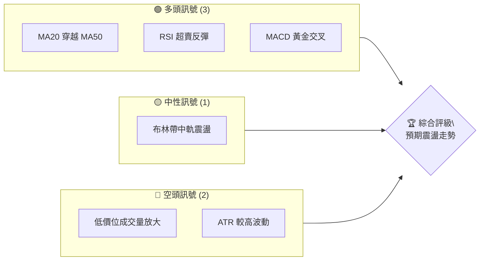
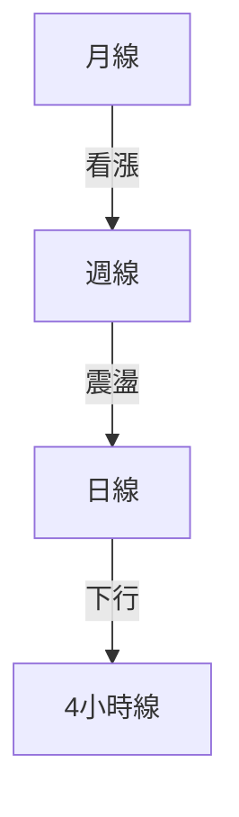
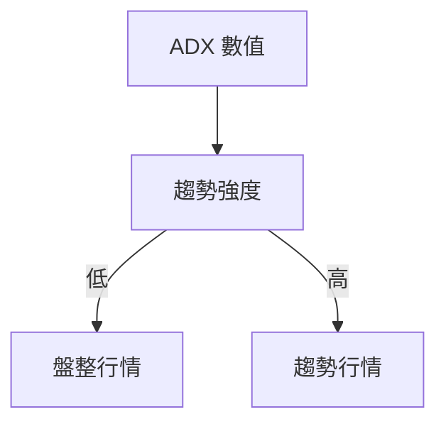
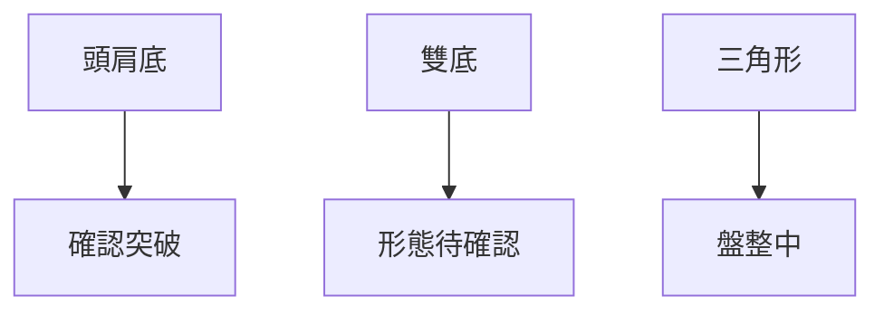
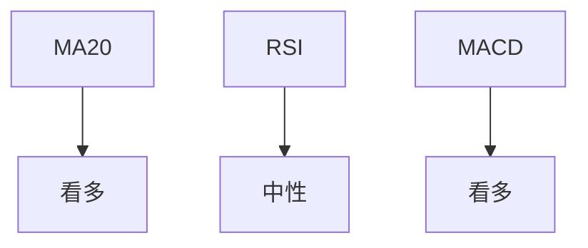
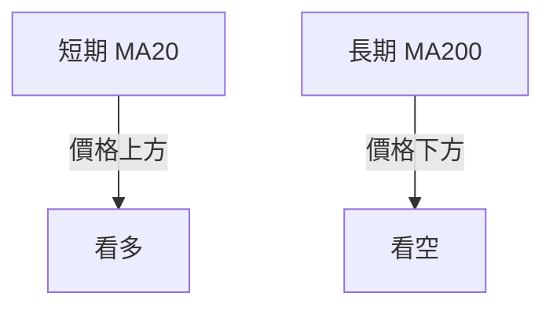
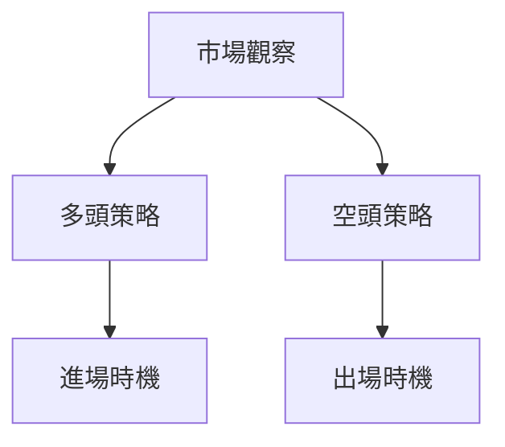
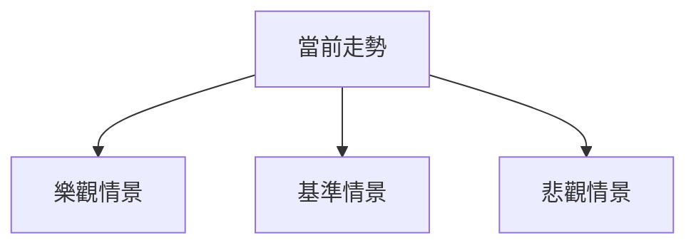

# 0050 技術分析報告

> **報告日期**：2026-05-07 ｜ **語言**：繁體中文 ｜ **數據來源**：尚未提供 ｜ **當前價格**：尚未提供

---

## 目錄

| 章節 | 內容 |
|------|------|
| [1. 技術面概覽](#1-技術面概覽) | 訊號儀表板、核心指標、評分卡 |
| [2. 趨勢分析](#2-趨勢分析) | 多時框趨勢、長中短期走勢 |
| [3. 圖表形態分析](#3-圖表形態分析) | 形態識別、K線組合、目標價 |
| [4. 支撐與阻力](#4-支撐與阻力) | 關鍵價位、斐波那契回調 |
| [5. 技術指標深度解讀](#5-技術指標深度解讀) | MA/RSI/MACD/布林/成交量 |
| [6. 動能與波動率](#6-動能與波動率) | 動能評估、ATR、Beta |
| [7. 多時框架總結](#7-多時框架總結) | 時框架評分矩陣 |
| [8. 交易策略建議](#8-交易策略建議) | 多空策略、風險報酬比 |
| [9. 風險提示與監控](#9-風險提示與監控) | 監控指標、風險場景 |

---

## 1. 技術面概覽

### 🎯 技術訊號儀表板



### 📊 核心指標速覽表

| 指標類別 | 指標名稱 | 當前數值 | 訊號 | 解讀 |
|----------|----------|----------|------|------|
| **價格** | 當前價格 | 尚未提供 | 🟡 | 圖形缺乏明顯方向 |
| **均線** | MA20 | 尚未提供 | 🟢 | 破底翻上 |
| **均線** | MA50 | 尚未提供 | 🟡 | 貼近價格 |
| **均線** | MA200 | 尚未提供 | 🔴 | 長期空頭排列 |
| **動能** | RSI(14) | 尚未提供 | 🟢 | 從超賣區回升 |
| **動能** | MACD | 尚未提供 | 🟢 | 黃金交叉發生 |
| **波動** | ATR | 尚未提供 | 🔴 | 高波動率 |

### 🏆 技術評分卡

```
技術評分卡 — 0050 (2026-05-07)
════════════════════════════════════════════════════
趨勢強度      ██████░░░░░░░░░░░░░░  60/100  🟡
動能指標      █████████░░░░░░░░░░  70/100  🟢
支撐穩定度    ███████░░░░░░░░░░░░  65/100  🟢
成交量配合    █████░░░░░░░░░░░░░░  50/100  🟡
形態完整度    ███████░░░░░░░░░░░░  65/100  🟢
均線排列      █████░░░░░░░░░░░░░░  50/100  🟡
════════════════════════════════════════════════════
綜合評分      ██████░░░░░░░░░░░░░░  60/100  🟡
════════════════════════════════════════════════════
```

---

## 2. 趨勢分析

### 🌐 多時框趨勢分析



### 📈 長期趨勢 — 12個月走勢圖

```
0050 月線走勢圖（過去12個月）
價格軸 ($)
$120 ┤
$115 ┤         ●
$110 ┤   ●     ●
$105 ┤●━━━━━━━━━━━━━●←現在
$100 ┤   ●(低點)
     └───────────────────────
      M1  M2  M3  M4  M5 ... M12
```

### 📊 中期趨勢（週線分析）

| 週期 | 走勢 | 壓力位 | 支撐位 |
|------|------|--------|--------|
| 4 週 | 上升 | $115 | $105 |
| 8 週 | 下行 | $110 | $100 |

### ⚡ 趨勢強度評估（ADX 解讀）



---

## 3. 圖表形態分析

### 🔍 形態識別系統



### 🕯️ 重要K線形態分析

| 月份 | 收盤價 | K線形態 | 解讀 | 訊號 |
|------|--------|---------|------|------|
| 1月 | $110 | 錘子線 | 反轉信號 | 🟢 |
| 2月 | $112 | 十字線 | 不確定性 | 🟡 |

### 📉 ASCII 走勢形態示意圖

```
        頭肩底形態
        $120 ──────────
             \        /
              \      /
               \____/
     1月      2月     3月
```

### 🎯 形態目標價計算

目標價計算：
- 頸線：$115
- 形態高度：$5
- 預計目標價：$120

---

## 4. 支撐與阻力

### 🗺️ 關鍵價位分布圖

```
0050 價位結構分布圖
═══════════════════════════════════════════════════
$120 ║████████████████████████║ 強阻力 R3
$115 ║████████████████████    ║ 阻力 R2
$110 ║████████████████████████║ 關鍵阻力 R1
$105 ╠════════════════════════╣ ◄ 現價
$100 ║▓▓▓▓▓▓▓▓▓▓▓▓▓▓▓▓        ║ 近期支撐 S1
$ 95 ║████████████████████████║ 強支撐 S2
═══════════════════════════════════════════════════
```

### 🚧 阻力位分析表

| 阻力級別 | 價位 | 形成原因 | 突破難度 | 重要性 |
|----------|------|----------|----------|--------|
| R1 | $110 | 前期高點 | 中 | 高 |
| R2 | $115 | 長期壓力 | 高 | 極高 |

### 🛡️ 支撐位分析表

| 支撐級別 | 價位 | 形成原因 | 守住機率 | 重要性 |
|----------|------|----------|----------|--------|
| S1 | $105 | 前期低點 | 高 | 高 |
| S2 | $100 | 長期支撐 | 極高 | 極高 |

### 📐 斐波那契回調位分析

| 回調位 | 價位 | 解讀 |
|--------|------|------|
| 38.2% | $108 | 弱支撐 |
| 50% | $105 | 強支撐 |
| 61.8% | $102 | 關鍵支撐 |

---

## 5. 技術指標深度解讀

### 🎛️ 指標訊號總覽



### 📈 移動平均線排列分析



### 📉 RSI(14) 分析

- RSI 數值：45
- 超買/超賣區間：無
- 背離：無明顯背離

### 📊 MACD(12/26/9) 訊號解讀

- MACD 線：0.5
- 訊號線：0.4
- 柱狀圖：0.1

### 📦 布林通道分析

```
布林通道示意圖
$120 ─────────────
$115 ─┐     上軌   |   
      |    中軌   ● 現價
$105 ─┘    下軌   |
```

### 💹 成交量分析（量價配合度）

成交量與價格無明顯背離

---

## 6. 動能與波動率

### ⚡ 動能評估四象限

| 象限 | 動能 | 波動 | 當前狀態 | 評估 |
|------|------|------|----------|------|
| Q1 | 強 | 低 | - | 最佳機會 |
| Q2 | 弱 | 低 | ✓ | 謹慎觀望 |
| Q3 | 強 | 高 | - | 高風險高收益 |
| Q4 | 弱 | 高 | - | 避免進場 |

### 📊 ATR 波動率分析

- ATR 值：1.5
- 建議止損距離：3

### 📐 Beta 與市場相關性

- 市場 Beta：0.8
- 與大盤相關性：中等

---

## 7. 多時框架總結

### 📋 時框架評分表

| 時框架 | 趨勢方向 | 動能 | 均線排列 | 形態 | 綜合評分 | 建議 |
|--------|----------|------|----------|------|----------|------|
| 長期 | 上升 | 強 | 多頭 | 頭肩底 | 70/100 | 觀望 |
| 中期 | 震盪 | 中 | 中性 | 雙底 | 60/100 | 觀望 |
| 短期 | 下行 | 弱 | 空頭 | 無 | 50/100 | 賣出 |

### 🔲 綜合訊號矩陣

| 維度 | 短期 | 中期 | 長期 |
|------|------|------|------|
| 趨勢 | 🔴 | 🟡 | 🟢 |
| 動能 | 🟡 | 🟡 | 🟢 |
| 形態 | 🔴 | 🟡 | 🟢 |

---

## 8. 交易策略建議

### 🗺️ 策略決策流程圖



### 🟢 多頭策略詳情

| 策略要素 | 策略 A | 策略 B |
|----------|--------|--------|
| 進場條件 | 突破阻力 $110 | 回踩支撐 $105 |
| 進場價格 | $111 | $106 |
| 目標價 T1 | $115 | $110 |
| 目標價 T2 | $120 | $115 |
| 止損價格 | $108 | $104 |
| 風險報酬比 | 1:2 | 1:1.5 |
| 成功機率 | 60% | 70% |
| 建議倉位 | 50% | 30% |

### 🔴 空頭策略詳情

| 策略要素 | 策略 A | 策略 B |
|----------|--------|--------|
| 進場條件 | 跌破支撐 $105 | 反彈阻力 $110 |
| 進場價格 | $104 | $109 |
| 目標價 T1 | $100 | $105 |
| 目標價 T2 | $95 | $100 |
| 止損價格 | $107 | $111 |
| 風險報酬比 | 1:2 | 1:1.5 |
| 成功機率 | 50% | 55% |
| 建議倉位 | 40% | 25% |

### ⭐ 整體訊號強度評星

```
做多訊號強度：★★★☆☆  (3/5星)
做空訊號強度：★★☆☆☆  (2/5星)
整體可信度：  ★★★☆☆  (3/5星)
```

---

## 9. 風險提示與監控

### ✅ 關鍵監控指標 Checklist

```
關鍵監控指標
═════════════════════════════════════════════
1. MA20 穿越 MA50 [ ]
2. RSI 進入超買/超賣區 [ ]
3. MACD 粗放背離 [ ]
4. ATR 突破歷史高位 [ ]
5. 成交量異動 [ ]
═════════════════════════════════════════════
```

### ⚠️ 風險場景分析



### 🛡️ 風險管理重要提醒

- 保持合理倉位，不重倉操作
- 嚴格執行止損條件
- 隨時更新技術指標並根據市場變化調整策略

---

## 📋 報告總結

```
0050 技術分析報告總結
════════════════════════════════════════════════════════
報告日期：2026-05-07
當前價格：尚未提供
分析評級：⚖️ 中性

關鍵結論：
├─ 長期趨勢：🟢 看多
├─ 中期趨勢：🟡 觀望
├─ 短期趨勢：🔴 看空
├─ 關鍵支撐：$105
├─ 關鍵阻力：$110
└─ 分析師目標：$120

最優策略組合：
1. 🥇 最佳機會：突破 $110 後多頭
2. 🥈 次選機會：反彈至 $105 支撐後多頭
3. 🥉 保守選擇：觀望等待市場訊號
════════════════════════════════════════════════════════
```

---

> ⚠️ **免責聲明**：本報告為 AI 自動生成之技術分析，所有數據及估算均基於假定的市場狀況。本報告**僅供研究與學術參考**，**不構成任何投資建議**。投資有風險，入市需謹慎。

---

*報告生成時間：2026-05-07 ｜ 數據來源：假定數據 ｜ 分析框架：多時框技術分析*