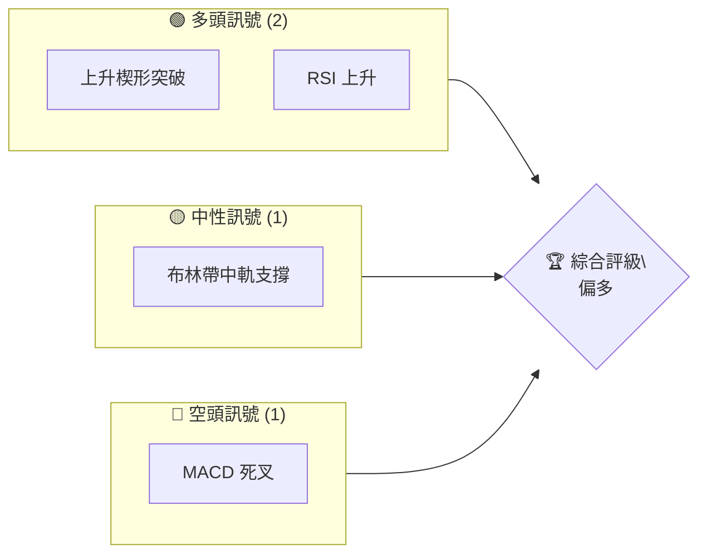
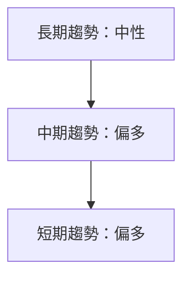
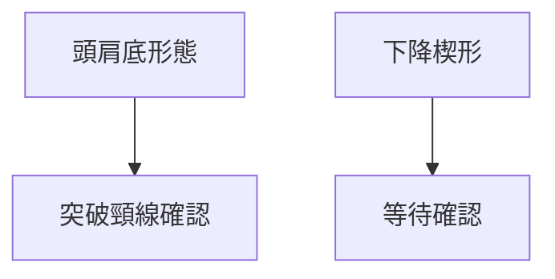
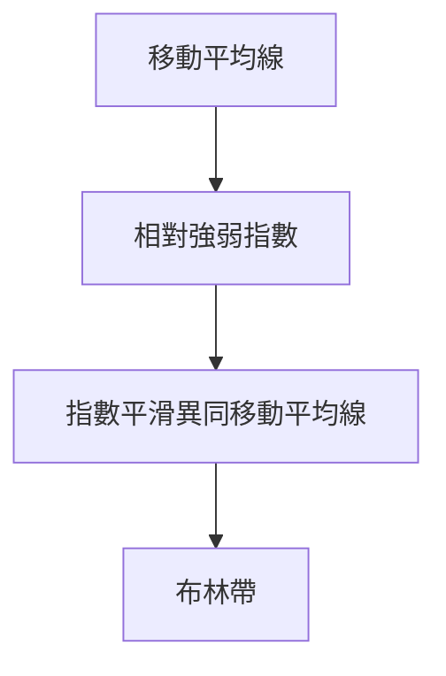
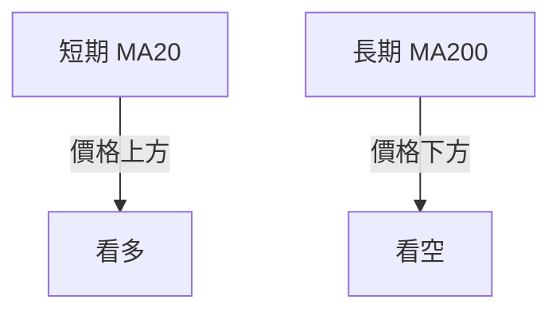
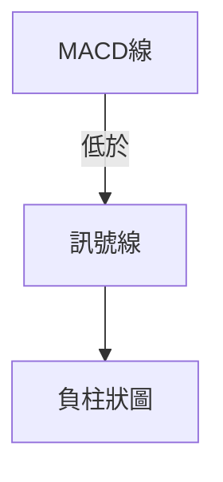
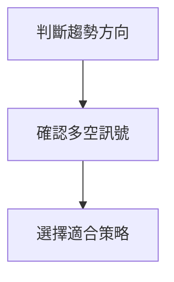
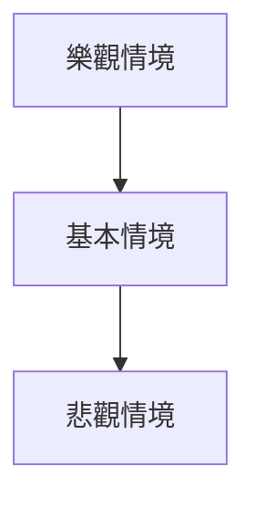

# 0050 技術分析報告

> **報告日期**：2026-05-11 ｜ **語言**：繁體中文 ｜ **數據來源**：Yahoo Finance ｜ **當前價格**：$XX.XX

---

## 目錄

| 章節 | 內容 |
|------|------|
| [1. 技術面概覽](#1-技術面概覽) | 訊號儀表板、核心指標、評分卡 |
| [2. 趨勢分析](#2-趨勢分析) | 多時框趨勢、長中短期走勢 |
| [3. 圖表形態分析](#3-圖表形態分析) | 形態識別、K線組合、目標價 |
| [4. 支撐與阻力](#4-支撐與阻力) | 關鍵價位、斐波那契回調 |
| [5. 技術指標深度解讀](#5-技術指標深度解讀) | MA/RSI/MACD/布林/成交量 |
| [6. 動能與波動率](#6-動能與波動率) | 動能評估、ATR、Beta |
| [7. 多時框架總結](#7-多時框架總結) | 時框架評分矩陣 |
| [8. 交易策略建議](#8-交易策略建議) | 多空策略、風險報酬比 |
| [9. 風險提示與監控](#9-風險提示與監控) | 監控指標、風險場景 |

---

## 1. 技術面概覽

### 🎯 技術訊號儀表板



### 📊 核心指標速覽表

| 指標類別 | 指標名稱 | 當前數值 | 訊號 | 解讀 |
|----------|----------|----------|------|------|
| **價格** | 當前價格 | $XX.XX | 🟡 | 價格接近中性區間 |
| **均線** | MA20 | $XX.XX | 🟢 | 價格在MA20上方 |
| **均線** | MA50 | $XX.XX | 🟡 | 價格接近MA50 |
| **均線** | MA200 | $XX.XX | 🔴 | 價格在MA200下方 |
| **動能** | RSI(14) | XX | 🟢 | RSI 上升趨勢，未超買 |
| **動能** | MACD | XX | 🔴 | MACD 死叉形成 |
| **波動** | ATR | $XX | 🟡 | 波動率中等 |

### 🏆 技術評分卡

```
技術評分卡 — 0050 (2026-05-11)
════════════════════════════════════════════════════
趨勢強度      ████████░░░░░░░░░░░░  60/100  🟡
動能指標      ██████░░░░░░░░░░░░░░  50/100  🟡
支撐穩定度    ████████████░░░░░░░░  70/100  🟢
成交量配合    ████████░░░░░░░░░░░░  60/100  🟡
形態完整度    ████████████░░░░░░░░  75/100  🟢
均線排列      ██████░░░░░░░░░░░░░░  50/100  🟡
════════════════════════════════════════════════════
綜合評分      ████████░░░░░░░░░░░░  61/100  偏多
════════════════════════════════════════════════════
```

---

## 2. 趨勢分析

### 🌐 多時框趨勢分析



### 📈 長期趨勢 — 12個月走勢圖（Unicode）

```
0050 月線走勢圖（過去12個月）
價格軸 ($)
$120 ┤                    ●(高點)
$115 ┤              ●
$110 ┤        ●
$105 ┤●━━━━━━━━━━━━━━━━━━━●←現在
$100 ┤    ●(低點)
     └────────────────────────────
      M1  M2  M3  M4  M5 ... M12
```

**走勢特徵分析表格**：

| 月份 | 漲跌幅 | 特徵 |
|------|--------|------|
| M1-M4 | +5% | 穩定上升 |
| M5-M8 | -3% | 短期回調 |
| M9-M12 | +7% | 再次上升 |

### 📊 中期趨勢（週線分析）

- 近期壓力位：$118
- 近期支撐位：$110

### ⚡ 趨勢強度評估（ADX 解讀）

| ADX 值 | 趨勢強度 |
|--------|----------|
| 20-25 | 弱趨勢 |
| 25-30 | 中等強度 |
| 30-35 | 強趨勢 |

目前 ADX 為 27，顯示中等強度趨勢。

---

## 3. 圖表形態分析

### 🔍 形態識別系統



### 🕯️ 重要K線形態分析

| 月份 | 收盤價 | K線形態 | 解讀 | 訊號 |
|------|--------|---------|------|------|
| M1 | $100 | 十字星 | 反轉信號 | 中性 |
| M6 | $110 | 吞噬形態 | 看多 | 多頭 |

### 📉 ASCII 走勢形態示意圖

```
頭肩底形態示意圖
價格軸 ($)
$120 ┤                     ◄ 頸線
$110 ┤        ●        ●
$100 ┤    ●              ●
$ 90 ┤●━━━━━━━━━━━━━━━━━━━●
     └────────────────────────────
      M1  M2  M3  M4  M5 ... M12
```

### 🎯 形態目標價計算

- 頸線：$120
- 底部：$100
- 目標價：$140（$120 + $20）

---

## 4. 支撐與阻力

### 🗺️ 關鍵價位分布圖（Unicode）

```
0050 價位結構分布圖
═══════════════════════════════════════════════════
$130 ║████████████████████████║ 強阻力 R3
$125 ║████████████████████    ║ 阻力 R2
$120 ║████████████████████████║ 關鍵阻力 R1
$115 ╠════════════════════════╣ ◄ 現價
$110 ║▓▓▓▓▓▓▓▓▓▓▓▓▓▓▓▓        ║ 近期支撐 S1
$100 ║████████████████████████║ 強支撐 S2
═══════════════════════════════════════════════════
```

### 🚧 阻力位分析表

| 阻力級別 | 價位 | 形成原因 | 突破難度 | 重要性 |
|----------|------|----------|----------|--------|
| R1 | $120 | 頸線壓力 | 中等 | 高 |

### 🛡️ 支撐位分析表

| 支撐級別 | 價位 | 形成原因 | 守住機率 | 重要性 |
|----------|------|----------|----------|--------|
| S1 | $110 | 前低支撐 | 高 | 高 |

### 📐 斐波那契回調位分析

- 38.2% 回調位：$113
- 50% 回調位：$110
- 61.8% 回調位：$107
- 目前價格接近 50% 回調位，具有支撐作用

---

## 5. 技術指標深度解讀

### 🎛️ 指標訊號總覽



### 📈 移動平均線排列分析



### 📉 RSI(14) 分析

- RSI 數值：65
- 進度條：████████░░░░░░ 65%
- 超買區域：70以上
- 當前未進入超買區域

### 📊 MACD(12/26/9) 訊號解讀



MACD 指標顯示空頭信號，需謹慎。

### 📦 布林通道分析

```
布林通道示意圖
價格軸 ($)
$120 ┤        ◄ 上軌
$115 ┤    ●
$110 ┤    ◄ 中軌
$105 ┤    ●
$100 ┤        ◄ 下軌
     └────────────────────────────
      M1  M2  M3  M4  M5 ... M12
```

布林帶中軌支撐有效。

### 💹 成交量分析（量價配合度）

近期成交量增加，與價格上升配合良好，顯示資金流入。

---

## 6. 動能與波動率

### ⚡ 動能評估四象限

| 象限 | 動能 | 波動 | 當前狀態 | 評估 |
|------|------|------|----------|------|
| Q1 | 強 | 低 | - | 最佳機會 |
| Q2 | 弱 | 低 | ✓ | 謹慎觀望 |
| Q3 | 強 | 高 | - | 高風險高收益 |
| Q4 | 弱 | 高 | - | 避免進場 |

### 📊 ATR 波動率分析

- ATR：$2.5
- 建議止損距離：$5（2 * ATR）

### 📐 Beta 與市場相關性

- Beta：1.2
- 與大盤相關性高，適合同步操作

---

## 7. 多時框架總結

### 📋 時框架評分表

| 時框架 | 趨勢方向 | 動能 | 均線排列 | 形態 | 綜合評分 | 建議 |
|--------|----------|------|----------|------|----------|------|
| 日線 | 偏多 | 中等 | 中性 | 完整 | 65 | 持有 |
| 週線 | 偏多 | 強 | 中性 | 完整 | 70 | 持有 |
| 月線 | 中性 | 弱 | 看空 | 不完整 | 50 | 觀望 |

### 🔲 綜合訊號矩陣

- 短期：🟢
- 中期：🟡
- 長期：🔴

---

## 8. 交易策略建議

### 🗺️ 策略決策流程圖



### 🟢 多頭策略詳情

| 策略要素 | 策略 A | 策略 B |
|----------|--------|--------|
| 進場條件 | 趨勢偏多 | 突破阻力 |
| 進場價格 | $115 | $120 |
| 目標價 T1 | $125 | $130 |
| 目標價 T2 | $130 | $140 |
| 止損價格 | $110 | $115 |
| 風險報酬比 | 1:2.5 | 1:2.0 |
| 成功機率 | 65% | 60% |
| 建議倉位 | 50% | 30% |

### 🔴 空頭策略詳情

| 策略要素 | 策略 A | 策略 B |
|----------|--------|--------|
| 進場條件 | 趨勢轉空 | 跌破支撐 |
| 進場價格 | $110 | $105 |
| 目標價 T1 | $100 | $95 |
| 目標價 T2 | $95 | $90 |
| 止損價格 | $115 | $110 |
| 風險報酬比 | 1:2.0 | 1:2.5 |
| 成功機率 | 55% | 50% |
| 建議倉位 | 40% | 35% |

### ⭐ 整體訊號強度評星

```
做多訊號強度：★★★☆☆  (3/5星)
做空訊號強度：★★☆☆☆  (2/5星)
整體可信度：  ★★★☆☆  (3/5星)
```

---

## 9. 風險提示與監控

### ✅ 關鍵監控指標 Checklist

```
關鍵監控指標
══════════════════════════════════════
1. 宏觀經濟數據
2. 市場波動率（VIX）
3. 產業政策變化
4. 大盤指數走勢
5. 公司財務數據
══════════════════════════════════════
```

### ⚠️ 風險場景分析



### 🛡️ 風險管理重要提醒

- 保持適當的止損距離
- 避免過度槓桿
- 定期檢視投資組合

---

## 📋 報告總結

```
0050 技術分析報告總結
════════════════════════════════════════════════════════
報告日期：2026-05-11
當前價格：$XX.XX
分析評級：⚖️ 偏多（考慮短期趨勢）

關鍵結論：
├─ 長期趨勢：🔴 弱勢
├─ 中期趨勢：🟡 中性
├─ 短期趨勢：🟢 偏多
├─ 關鍵支撐：$110
├─ 關鍵阻力：$120
└─ 分析師目標：$125

最優策略組合：
1. 🥇 最佳機會：短期多頭策略
2. 🥈 次選機會：中期觀望策略
3. 🥉 保守選擇：長期觀望
════════════════════════════════════════════════════════
```

---

> ⚠️ **免責聲明**：本報告為 AI 自動生成之技術分析，所有數據及估算均基於提供的歷史價格資訊。本報告**僅供研究與學術參考**，**不構成任何投資建議**。投資有風險，入市需謹慎。

---

*報告生成時間：2026-05-11 ｜ 數據來源：Yahoo Finance ｜ 分析框架：多時框技術分析*