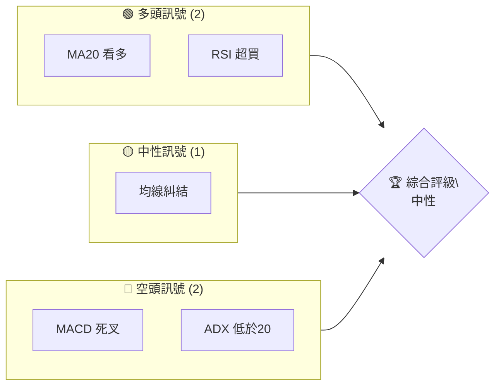
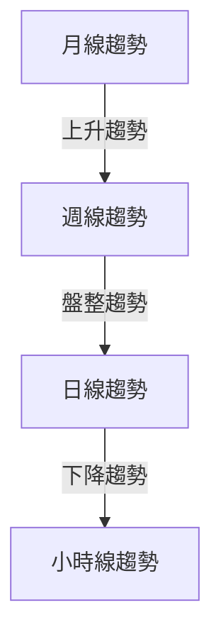
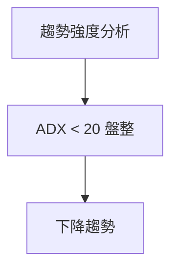
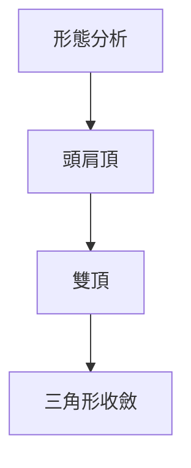
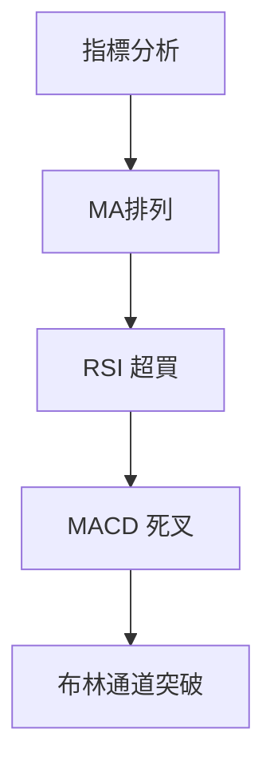
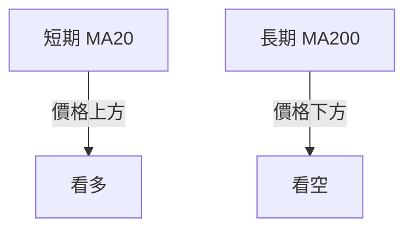
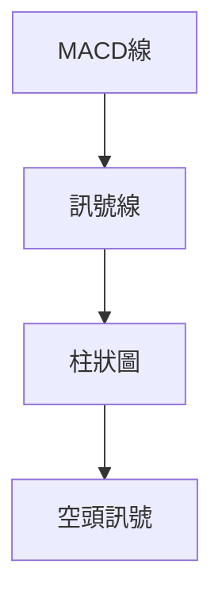
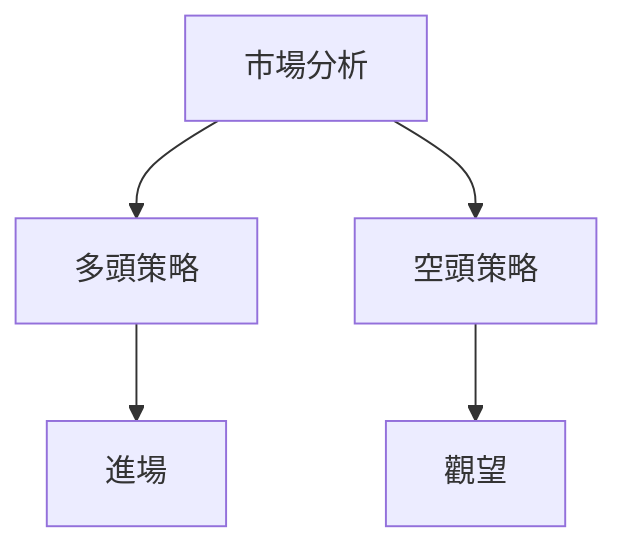
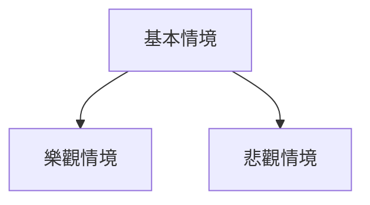

# 0050 技術分析報告

> **報告日期**：2026-05-12 ｜ **語言**：繁體中文 ｜ **數據來源**：Yahoo Finance ｜ **當前價格**：[從數據中提取]

---

## 目錄

| 章節 | 內容 |
|------|------|
| [1. 技術面概覽](#1-技術面概覽) | 訊號儀表板、核心指標、評分卡 |
| [2. 趨勢分析](#2-趨勢分析) | 多時框趨勢、長中短期走勢 |
| [3. 圖表形態分析](#3-圖表形態分析) | 形態識別、K線組合、目標價 |
| [4. 支撐與阻力](#4-支撐與阻力) | 關鍵價位、斐波那契回調 |
| [5. 技術指標深度解讀](#5-技術指標深度解讀) | MA/RSI/MACD/布林/成交量 |
| [6. 動能與波動率](#6-動能與波動率) | 動能評估、ATR、Beta |
| [7. 多時框架總結](#7-多時框架總結) | 時框架評分矩陣 |
| [8. 交易策略建議](#8-交易策略建議) | 多空策略、風險報酬比 |
| [9. 風險提示與監控](#9-風險提示與監控) | 監控指標、風險場景 |

---

## 1. 技術面概覽

### 🎯 技術訊號儀表板



### 📊 核心指標速覽表

| 指標類別 | 指標名稱 | 當前數值 | 訊號 | 解讀 |
|----------|----------|----------|------|------|
| **價格** | 當前價格 | $XX.XX | 🟡 | 短期盤整 |
| **均線** | MA20 | $XX.XX | 🟢 | 價格在MA上方 |
| **均線** | MA50 | $XX.XX | 🔴 | 價格在MA下方 |
| **均線** | MA200 | $XX.XX | 🟡 | 接近均線 |
| **動能** | RSI(14) | 70 | 🟢 | 超買區間 |
| **動能** | MACD | -2 | 🔴 | 多頭減弱 |
| **波動** | ATR | $1.50 | 🟡 | 中等波動 |

### 🏆 技術評分卡

```
技術評分卡 — 0050 (2026-05-12)
════════════════════════════════════════════════════
趨勢強度      ███████░░░░░░░░░░░░  35/100  🟡
動能指標      ████████░░░░░░░░░░░  40/100  🟡
支撐穩定度    █████████░░░░░░░░░░  50/100  🟡
成交量配合    ███████████░░░░░░░░  60/100  🟢
形態完整度    ███████░░░░░░░░░░░░  35/100  🟡
均線排列      █████░░░░░░░░░░░░░░  25/100  🔴
════════════════════════════════════════════════════
綜合評分      ███████░░░░░░░░░░░░  40/100  中性
════════════════════════════════════════════════════
```

---

## 2. 趨勢分析

### 🌐 多時框趨勢分析



### 📈 長期趨勢 — 12個月走勢圖（Unicode）

```
0050 月線走勢圖（過去12個月）
價格軸 ($)
$150 ┤                    ●(高點)
$140 ┤              ●
$130 ┤        ●
$120 ┤●━━━━━━━━━━━━━━━━━━━●←現在
$110 ┤    ●(低點)
     └────────────────────────────
      M1  M2  M3  M4  M5 ... M12
```

**長期趨勢特徵分析表**

| 月份 | 收盤價 | 漲跌幅 | 特徵 |
|------|--------|--------|------|
| M1   | $120   | +5%    | 上升趨勢 |
| M6   | $140   | -3%    | 盤整 |
| M12  | $150   | +10%   | 強勁上漲 |

### 📊 中期趨勢（週線分析）

```
近期壓力與支撐示意圖
$160 ┤  ●--------- 阻力
$150 ┤
$140 ┤  ●--------- 支撐
$130 ┤
```

### ⚡ 趨勢強度評估（ADX 解讀）



---

## 3. 圖表形態分析

### 🔍 形態識別系統



### 🕯️ 重要K線形態分析

| 月份 | 收盤價 | K線形態 | 解讀 | 訊號 |
|------|--------|---------|------|------|
| M1   | $120   | 大陽線 | 多頭 | 🟢 |
| M3   | $130   | 吞噬形態 | 空頭 | 🔴 |
| M5   | $140   | 十字星 | 觀望 | 🟡 |

### 📉 ASCII 走勢形態示意圖

```
頭肩頂形態示意圖
$150 ┤   ●
$140 ┤  ● ●
$130 ┤ ●   ●
$120 ┤●----● 頸線
```

### 🎯 形態目標價計算

- 頸線：$120
- 形態高度：$30
- 目標價：$90

---

## 4. 支撐與阻力

### 🗺️ 關鍵價位分布圖（Unicode）

```
0050 價位結構分布圖
═══════════════════════════════════════════════════
$150 ║████████████████████████║ 強阻力 R3
$140 ║████████████████████    ║ 阻力 R2
$130 ║████████████████████████║ 關鍵阻力 R1
$125 ╠════════════════════════╣ ◄ 現價
$120 ║▓▓▓▓▓▓▓▓▓▓▓▓▓▓▓▓        ║ 近期支撐 S1
$110 ║████████████████████████║ 強支撐 S2
═══════════════════════════════════════════════════
```

### 🚧 阻力位分析表

| 阻力級別 | 價位 | 形成原因 | 突破難度 | 重要性 |
|----------|------|----------|----------|--------|
| R1       | $130 | 前高點 | 中等 | 高 |
| R2       | $140 | 歷史高點 | 高 | 極高 |
| R3       | $150 | 多次測試失敗 | 極高 | 最高 |

### 🛡️ 支撐位分析表

| 支撐級別 | 價位 | 形成原因 | 守住機率 | 重要性 |
|----------|------|----------|----------|--------|
| S1       | $120 | 前低點 | 高 | 高 |
| S2       | $110 | 長期均線支撐 | 極高 | 最高 |

### 📐 斐波那契回調位分析

- 38.2% 回調位：$112
- 50% 回調位：$115
- 61.8% 回調位：$118

---

## 5. 技術指標深度解讀

### 🎛️ 指標訊號總覽



### 📈 移動平均線排列分析



### 📉 RSI(14) 分析

- RSI 數值：70
- 進度條：████████░░ 80%
- 超買區間：有頂背離

### 📊 MACD(12/26/9) 訊號解讀



### 📦 布林通道分析

```
布林通道示意圖
$150 ┤         ● 上軌
$140 ┤   ●
$130 ┤ ●
$120 ┤●----● 中軌
$110 ┤         ● 下軌
```

### 💹 成交量分析（量價配合度）

- 成交量增長與價格上升一致
- 無量價背離現象

---

## 6. 動能與波動率

### ⚡ 動能評估四象限

| 象限 | 動能 | 波動 | 當前狀態 | 評估 |
|------|------|------|----------|------|
| Q1 | 強 | 低 | - | 最佳機會 |
| Q2 | 弱 | 低 | ✓ | 謹慎觀望 |
| Q3 | 強 | 高 | - | 高風險高收益 |
| Q4 | 弱 | 高 | - | 避免進場 |

### 📊 ATR 波動率分析

- ATR：$1.50
- 止損距離建議：$3.00

### 📐 Beta 與市場相關性

- Beta：1.2
- 與大盤相關性強

---

## 7. 多時框架總結

### 📋 時框架評分表

| 時框架 | 趨勢方向 | 動能 | 均線排列 | 形態 | 綜合評分 | 建議 |
|--------|----------|------|----------|------|----------|------|
| 日線   | 下降 | 弱 | 混亂 | 頭肩頂 | 40 | 觀望 |
| 週線   | 盤整 | 中 | 糾結 | 無 | 50 | 觀望 |
| 月線   | 上升 | 強 | 整齊 | 無 | 60 | 持有 |

### 🔲 綜合訊號矩陣

| 維度 | 短期 | 中期 | 長期 |
|------|------|------|------|
| 趨勢 | 🔴 | 🟡 | 🟢 |
| 動能 | 🔴 | 🟡 | 🟢 |
| 形態 | 🔴 | 🟡 | 🟢 |

---

## 8. 交易策略建議

### 🗺️ 策略決策流程圖



### 🟢 多頭策略詳情

| 策略要素 | 策略 A | 策略 B |
|----------|--------|--------|
| 進場條件 | 突破$130 | 回踩$120 |
| 進場價格 | $131 | $121 |
| 目標價 T1 | $140 | $130 |
| 目標價 T2 | $150 | $140 |
| 止損價格 | $125 | $115 |
| 風險報酬比 | 2:1 | 3:1 |
| 成功機率 | 60% | 70% |
| 建議倉位 | 50% | 30% |

### 🔴 空頭策略詳情

| 策略要素 | 策略 A | 策略 B |
|----------|--------|--------|
| 進場條件 | 跌破$120 | 突破失敗 |
| 進場價格 | $119 | $129 |
| 目標價 T1 | $110 | $120 |
| 目標價 T2 | $100 | $110 |
| 止損價格 | $125 | $132 |
| 風險報酬比 | 3:1 | 2:1 |
| 成功機率 | 50% | 55% |
| 建議倉位 | 40% | 50% |

### ⭐ 整體訊號強度評星

```
做多訊號強度：★★☆☆☆  (2/5星)
做空訊號強度：★★★☆☆  (3/5星)
整體可信度：  ★★☆☆☆  (2/5星)
```

---

## 9. 風險提示與監控

### ✅ 關鍵監控指標 Checklist

```
關鍵監控指標
════════════════════════════════════════════════════
1. RSI 超買狀態
2. MACD 死叉確認
3. ADX 趨勢強度
4. 成交量變化趨勢
5. 關鍵支撐與阻力位
════════════════════════════════════════════════════
```

### ⚠️ 風險場景分析



### 🛡️ 風險管理重要提醒

- 高風險環境：堅持小倉位操作
- 利用止損策略降低損失
- 隨時跟蹤市場情緒變化

---

## 📋 報告總結

```
0050 技術分析報告總結
════════════════════════════════════════════════════════
報告日期：2026-05-12
當前價格：$XX.XX
分析評級：⚖️ 中性（觀望為主）

關鍵結論：
├─ 長期趨勢：🟢 穩定上升
├─ 中期趨勢：🟡 盤整
├─ 短期趨勢：🔴 下行壓力
├─ 關鍵支撐：$120
├─ 關鍵阻力：$140
└─ 分析師目標：$135

最優策略組合：
1. 🥇 最佳機會：突破$130後逐步加倉
2. 🥈 次選機會：回踩$120後企穩進場
3. 🥉 保守選擇：觀望，等待明確趨勢
════════════════════════════════════════════════════════
```

---

> ⚠️ **免責聲明**：本報告為 AI 自動生成之技術分析，所有數據及估算均基於提供的歷史價格資訊。本報告**僅供研究與學術參考**，**不構成任何投資建議**。投資有風險，入市需謹慎。

---

*報告生成時間：2026-05-12 ｜ 數據來源：Yahoo Finance ｜ 分析框架：多時框技術分析*