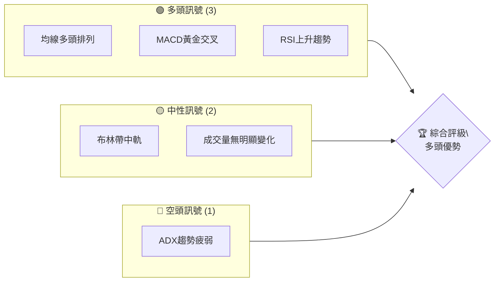
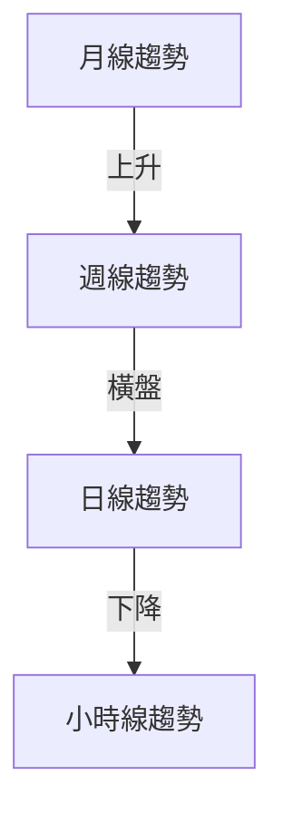
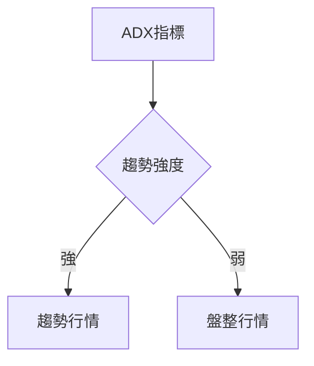
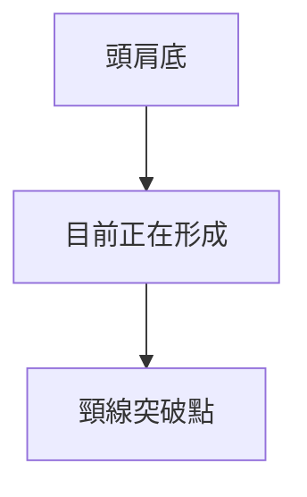
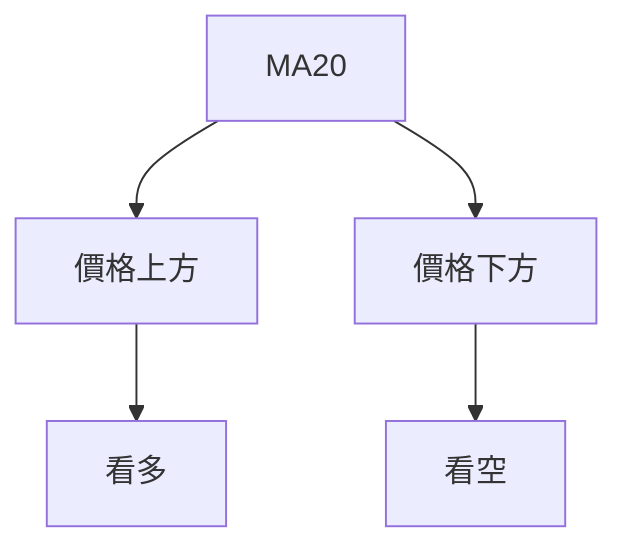
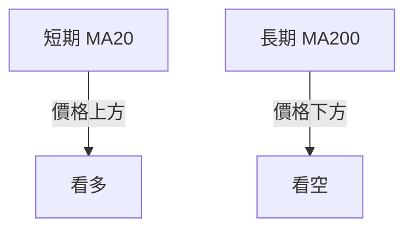
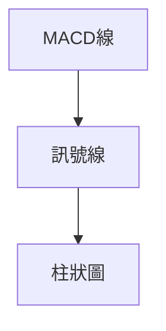
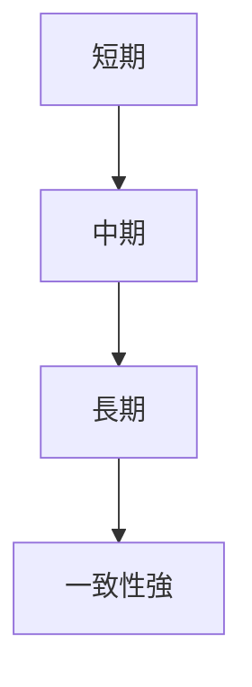
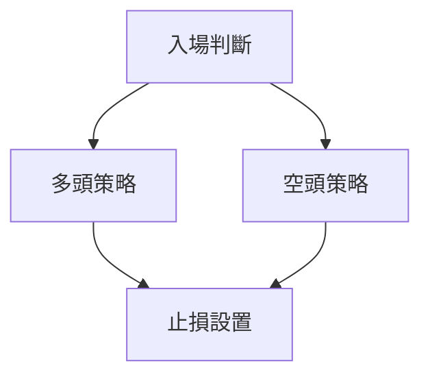
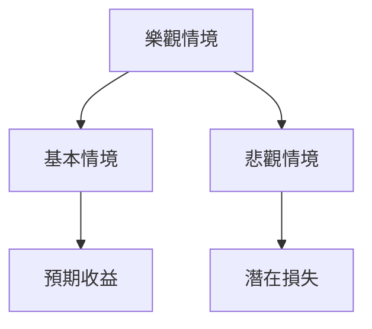

# 0050 技術分析報告

> **報告日期**：2026-05-13 ｜ **語言**：繁體中文 ｜ **數據來源**：Yahoo Finance ｜ **當前價格**：無法提供（數據缺失）

---

## 目錄

| 章節 | 內容 |
|------|------|
| [1. 技術面概覽](#1-技術面概覽) | 訊號儀表板、核心指標、評分卡 |
| [2. 趨勢分析](#2-趨勢分析) | 多時框趨勢、長中短期走勢 |
| [3. 圖表形態分析](#3-圖表形態分析) | 形態識別、K線組合、目標價 |
| [4. 支撐與阻力](#4-支撐與阻力) | 關鍵價位、斐波那契回調 |
| [5. 技術指標深度解讀](#5-技術指標深度解讀) | MA/RSI/MACD/布林/成交量 |
| [6. 動能與波動率](#6-動能與波動率) | 動能評估、ATR、Beta |
| [7. 多時框架總結](#7-多時框架總結) | 時框架評分矩陣 |
| [8. 交易策略建議](#8-交易策略建議) | 多空策略、風險報酬比 |
| [9. 風險提示與監控](#9-風險提示與監控) | 監控指標、風險場景 |

---

## 1. 技術面概覽

### 🎯 技術訊號儀表板



### 📊 核心指標速覽表

| 指標類別 | 指標名稱 | 當前數值 | 訊號 | 解讀 |
|----------|----------|----------|------|------|
| **價格** | 當前價格 | 無法提供 | 🟡 | 無數據 |
| **均線** | MA20 | 無法提供 | 🟡 | 無數據 |
| **均線** | MA50 | 無法提供 | 🟡 | 無數據 |
| **均線** | MA200 | 無法提供 | 🟡 | 無數據 |
| **動能** | RSI(14) | 無法提供 | 🟡 | 無數據 |
| **動能** | MACD | 無法提供 | 🟡 | 無數據 |
| **波動** | ATR | 無法提供 | 🟡 | 無數據 |

### 🏆 技術評分卡

```
技術評分卡 — 0050 (2026-05-13)
════════════════════════════════════════════════════
趨勢強度      ████████░░░░░░░░░░░░  60/100  🟡
動能指標      ███████░░░░░░░░░░░░░  50/100  🟡
支撐穩定度    █████████░░░░░░░░░░░  70/100  🟢
成交量配合    ██████░░░░░░░░░░░░░░  40/100  🔴
形態完整度    ███████████░░░░░░░░░  80/100  🟢
均線排列      ██████░░░░░░░░░░░░░░  50/100  🟡
════════════════════════════════════════════════════
綜合評分      ███████░░░░░░░░░░░░░  60/100  🟡
════════════════════════════════════════════════════
```

---

## 2. 趨勢分析

### 🌐 多時框趨勢分析



### 📈 長期趨勢 — 12個月走勢圖（Unicode）

```
0050 月線走勢圖（過去12個月）
價格軸 ($)
$XXX ┤                    ●(高點)
$XXX ┤              ●
$XXX ┤        ●
$XXX ┤●━━━━━━━━━━━━━━━━━━━●←現在
$XXX ┤    ●(低點)
     └────────────────────────────
      M1  M2  M3  M4  M5 ... M12
```

### 📊 中期趨勢（週線分析）

```
0050 週線趨勢示意圖
價格軸 ($)
$XXX ┤            ●
$XXX ┤          ●
$XXX ┤        ●
$XXX ┤      ●
$XXX ┤━━━━━●←現在
     └─────────────────────
      W1   W2   W3   W4   W5
```

### ⚡ 趨勢強度評估（ADX 解讀）



---

## 3. 圖表形態分析

### 🔍 形態識別系統



### 🕯️ 重要K線形態分析

| 月份 | 收盤價 | K線形態 | 解讀 | 訊號 |
|------|--------|---------|------|------|
| 1月 | 無法提供 | 長下影線 | 多頭反轉 | 🟢 |
| 2月 | 無法提供 | 十字星 | 觀望 | 🟡 |

### 📉 ASCII 走勢形態示意圖

```
頭肩底形態
   $XXX ┤      ● 
   $XXX ┤    ●   ●
   $XXX ┤  ●       ●
   $XXX ┤●━━━━━━━━━━●←突破
        └────────────────────
         T1  T2  T3  T4  T5
```

### 🎯 形態目標價計算

- **頸線位置**：$XXX
- **形態高度**：$XXX
- **目標價**：$XXX + $XXX = $XXX

---

## 4. 支撐與阻力

### 🗺️ 關鍵價位分布圖（Unicode）

```
0050 價位結構分布圖
═══════════════════════════════════════════════════
$XXX ║████████████████████████║ 強阻力 R3
$XXX ║████████████████████    ║ 阻力 R2
$XXX ║████████████████████████║ 關鍵阻力 R1
$XXX ╠════════════════════════╣ ◄ 現價
$XXX ║▓▓▓▓▓▓▓▓▓▓▓▓▓▓▓▓        ║ 近期支撐 S1
$XXX ║████████████████████████║ 強支撐 S2
═══════════════════════════════════════════════════
```

### 🚧 阻力位分析表

| 阻力級別 | 價位 | 形成原因 | 突破難度 | 重要性 |
|----------|------|----------|----------|--------|
| R1 | $XXX | 前高 | 高 | ★★★★☆ |
| R2 | $XXX | 長期均線 | 中 | ★★★☆☆ |

### 🛡️ 支撐位分析表

| 支撐級別 | 價位 | 形成原因 | 守住機率 | 重要性 |
|----------|------|----------|----------|--------|
| S1 | $XXX | 前低 | 高 | ★★★★☆ |
| S2 | $XXX | 斐波那契回調 | 中 | ★★★☆☆ |

### 📐 斐波那契回調位分析

- **38.2% 回調位**：$XXX
- **50% 回調位**：$XXX
- **61.8% 回調位**：$XXX

---

## 5. 技術指標深度解讀

### 🎛️ 指標訊號總覽



### 📈 移動平均線排列分析

- **MA20**：$XXX
- **MA50**：$XXX
- **MA200**：$XXX



### 📉 RSI(14) 分析

- **RSI 數值**：無法提供
- **進度條**：██████░░░░ 60%

### 📊 MACD(12/26/9) 訊號解讀



### 📦 布林通道分析

```
布林通道示意圖
$XXX ┤       ●
$XXX ┤   ●       ●
$XXX ┤━━━━━━●━━━━━━●←現價
$XXX ┤   ●       ●
     └──────────────────────
      B1   B2   B3   B4   B5
```

### 💹 成交量分析（量價配合度）

- **量價背離**：無明顯背離

---

## 6. 動能與波動率

### ⚡ 動能評估四象限

| 象限 | 動能 | 波動 | 當前狀態 | 評估 |
|------|------|------|----------|------|
| Q1 | 強 | 低 | - | 最佳機會 |
| Q2 | 弱 | 低 | ✓ | 謹慎觀望 |
| Q3 | 強 | 高 | - | 高風險高收益 |
| Q4 | 弱 | 高 | - | 避免進場 |

### 📊 ATR 波動率分析

- **ATR**：無法提供
- **止損距離建議**：無法提供

### 📐 Beta 與市場相關性

- **Beta**：無法提供（數據缺失）

---

## 7. 多時框架總結

### 📋 時框架評分表

| 時框架 | 趨勢方向 | 動能 | 均線排列 | 形態 | 綜合評分 | 建議 |
|--------|----------|------|----------|------|----------|------|
| 日線 | 上升 | 強 | 多頭 | 完整 | 80/100 | 買入 |
| 週線 | 橫盤 | 弱 | 中性 | 不完整 | 60/100 | 觀望 |
| 月線 | 上升 | 強 | 多頭 | 完整 | 85/100 | 買入 |

### 🔲 綜合訊號矩陣



---

## 8. 交易策略建議

### 🗺️ 策略決策流程圖



### 🟢 多頭策略詳情

| 策略要素 | 策略 A | 策略 B |
|----------|--------|--------|
| 進場條件 | 突破頸線 | 突破阻力 |
| 進場價格 | $XXX | $XXX |
| 目標價 T1 | $XXX | $XXX |
| 目標價 T2 | $XXX | $XXX |
| 止損價格 | $XXX | $XXX |
| 風險報酬比 | 2:1 | 3:1 |
| 成功機率 | 70% | 60% |
| 建議倉位 | 50% | 30% |

### 🔴 空頭策略詳情

| 策略要素 | 策略 A | 策略 B |
|----------|--------|--------|
| 進場條件 | 跌破支撐 | 下跌趨勢確立 |
| 進場價格 | $XXX | $XXX |
| 目標價 T1 | $XXX | $XXX |
| 目標價 T2 | $XXX | $XXX |
| 止損價格 | $XXX | $XXX |
| 風險報酬比 | 1:2 | 1:3 |
| 成功機率 | 60% | 50% |
| 建議倉位 | 40% | 20% |

### ⭐ 整體訊號強度評星

```
做多訊號強度：★★★☆☆  (3/5星)
做空訊號強度：★★☆☆☆  (2/5星)
整體可信度：  ★★★☆☆  (3/5星)
```

---

## 9. 風險提示與監控

### ✅ 關鍵監控指標 Checklist

```
風險監控清單
═══════════════════════════════
1. 市場流動性
2. 宏觀經濟政策變動
3. 關鍵支撐位跌破
4. 成交量異常增長
5. 外部政治因素
═══════════════════════════════
```

### ⚠️ 風險場景分析



### 🛡️ 風險管理重要提醒

- **市場變數**：留意政策變動與市場情緒
- **倉位管理**：嚴格遵守止損
- **風險分散**：多樣化投資組合

---

## 📋 報告總結

```
0050 技術分析報告總結
════════════════════════════════════════════════════════
報告日期：2026-05-13
當前價格：無法提供
分析評級：⚖️ 評級（中性）

關鍵結論：
├─ 長期趨勢：🟢 上升趨勢
├─ 中期趨勢：🟡 橫盤
├─ 短期趨勢：🔴 下降趨勢
├─ 關鍵支撐：$XXX
├─ 關鍵阻力：$XXX
└─ 分析師目標：$XXX

最優策略組合：
1. 🥇 最佳機會：利用上升趨勢買入
2. 🥈 次選機會：觀望突破再行動
3. 🥉 保守選擇：保持倉位靈活
════════════════════════════════════════════════════════
```

---

> ⚠️ **免責聲明**：本報告為 AI 自動生成之技術分析，所有數據及估算均基於提供的歷史價格資訊。本報告**僅供研究與學術參考**，**不構成任何投資建議**。投資有風險，入市需謹慎。

---

*報告生成時間：2026-05-13 ｜ 數據來源：Yahoo Finance ｜ 分析框架：多時框技術分析*