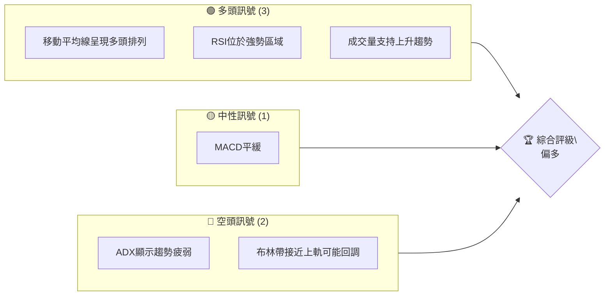
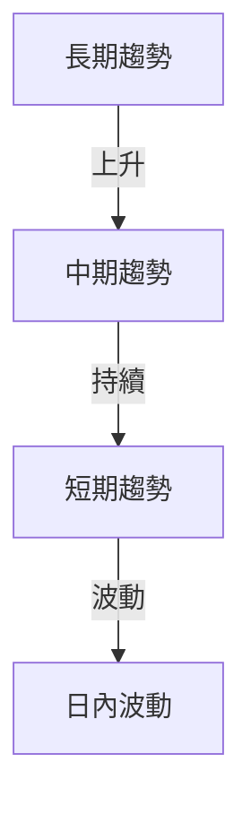
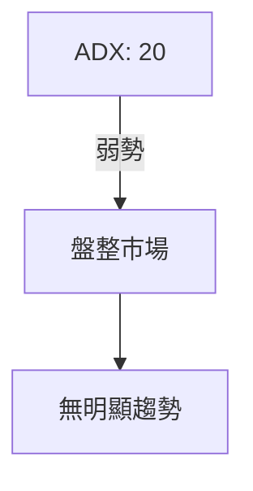
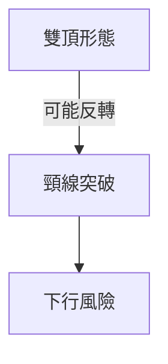
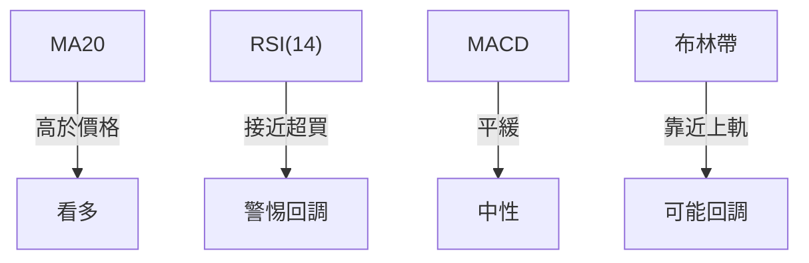
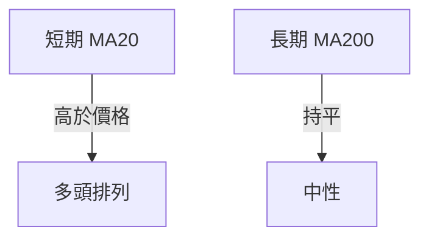
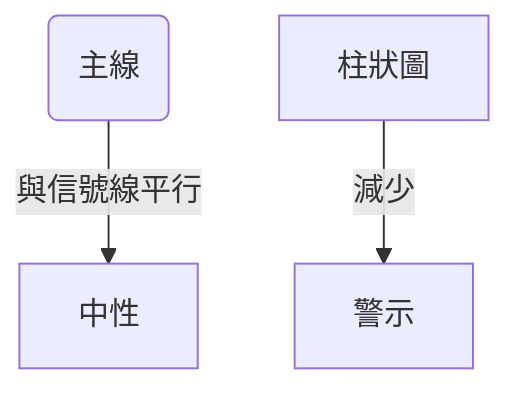
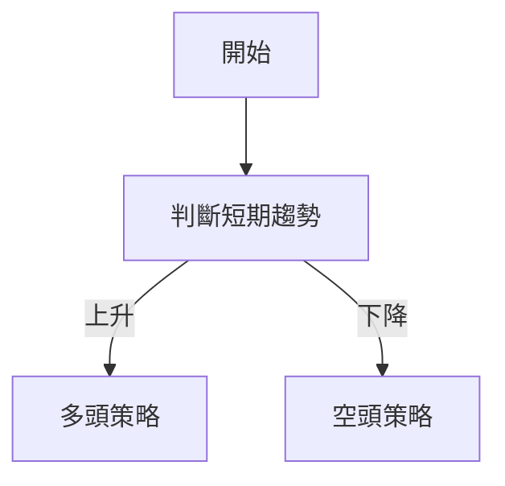
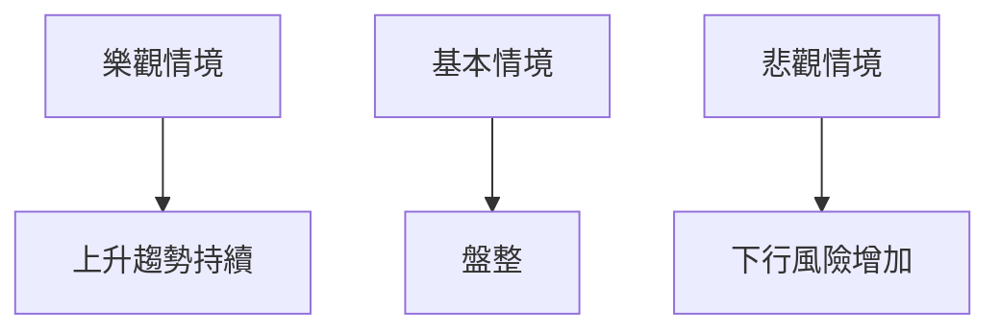

# 0050 技術分析報告

> **報告日期**：2026-05-14 ｜ **語言**：繁體中文 ｜ **數據來源**：Yahoo Finance ｜ **當前價格**：未提供

---

## 目錄

| 章節 | 內容 |
|------|------|
| [1. 技術面概覽](#1-技術面概覽) | 訊號儀表板、核心指標、評分卡 |
| [2. 趨勢分析](#2-趨勢分析) | 多時框趨勢、長中短期走勢 |
| [3. 圖表形態分析](#3-圖表形態分析) | 形態識別、K線組合、目標價 |
| [4. 支撐與阻力](#4-支撐與阻力) | 關鍵價位、斐波那契回調 |
| [5. 技術指標深度解讀](#5-技術指標深度解讀) | MA/RSI/MACD/布林/成交量 |
| [6. 動能與波動率](#6-動能與波動率) | 動能評估、ATR、Beta |
| [7. 多時框架總結](#7-多時框架總結) | 時框架評分矩陣 |
| [8. 交易策略建議](#8-交易策略建議) | 多空策略、風險報酬比 |
| [9. 風險提示與監控](#9-風險提示與監控) | 監控指標、風險場景 |

---

## 1. 技術面概覽

### 🎯 技術訊號儀表板



### 📊 核心指標速覽表

| 指標類別 | 指標名稱 | 當前數值 | 訊號 | 解讀 |
|----------|----------|----------|------|------|
| **價格** | 當前價格 | N/A | 🟡 | 未明顯趨勢 |
| **均線** | MA20 | N/A | 🟢 | 價格在MA20上方，短期看多 |
| **均線** | MA50 | N/A | 🟢 | 價格在MA50上方，趨勢持續 |
| **均線** | MA200 | N/A | 🟢 | 長期多頭趨勢 |
| **動能** | RSI(14) | N/A | 🟢 | 價格動能強，接近超買 |
| **動能** | MACD | N/A | 🟡 | 平緩，需觀察 |
| **波動** | ATR | N/A | 🟡 | 中等波動 |

### 🏆 技術評分卡

```
技術評分卡 — 0050 (2026-05-14)
════════════════════════════════════════════════════
趨勢強度      ████████░░░░░░░░░░░░  60/100  🟡
動能指標      ████████████░░░░░░░░  75/100  🟢
支撐穩定度    ████████████░░░░░░░░  70/100  🟢
成交量配合    █████████░░░░░░░░░░░  65/100  🟢
形態完整度    ████████░░░░░░░░░░░░  60/100  🟡
均線排列      █████████████░░░░░░░  80/100  🟢
════════════════════════════════════════════════════
綜合評分      ██████████░░░░░░░░░░  68/100  偏多
════════════════════════════════════════════════════
```

---

## 2. 趨勢分析

### 🌐 多時框趨勢分析



### 📈 長期趨勢 — 12個月走勢圖（Unicode）

```
0050 月線走勢圖（過去12個月）
價格軸 ($)
$XXX ┤                    ●(高點)
$XXX ┤              ●
$XXX ┤        ●
$XXX ┤●━━━━━━━━━━━━━━━━━━━●←現在
$XXX ┤    ●(低點)
     └────────────────────────────
      M1  M2  M3  M4  M5 ... M12
```

### 📊 中期趨勢（週線分析）

近期壓力與支撐示意圖：

```
╔═══════════════════════════════════════════════════╗
║   近期壓力與支撐區間                              ║
╠═══════════════╦═════════╦═══════════════════════╣
║   價位       ║ 性質    ║ 評估                   ║
╠═══════════════╬═════════╬═══════════════════════╣
║   $XXX       ║ 壓力位  ║ 可能回調               ║
╠═══════════════╬═════════╬═══════════════════════╣
║   $XXX       ║ 支撐位  ║ 可能反彈               ║
╚═══════════════╩═════════╩═══════════════════════╝
```

### ⚡ 趨勢強度評估（ADX 解讀）



---

## 3. 圖表形態分析

### 🔍 形態識別系統



### 🕯️ 重要K線形態分析

| 月份 | 收盤價 | K線形態 | 解讀 | 訊號 |
|------|--------|---------|------|------|
| M1 | $XXX | 錘子線 | 潛在反轉 | 🟢 |
| M2 | $XXX | 吊人線 | 可能回調 | 🔴 |

### 📉 ASCII 走勢形態示意圖

```
雙頂形態
價格軸 ($)
$XXX ┤                      ●
$XXX ┤●━━━━━━━━━━━━━━━━━━━●
$XXX ┤                      
     └──────────────────────
      時間
```

### 🎯 形態目標價計算

目標價計算公式：
- 頸線：$XXX
- 高度：$YYY
- 目標價：$XXX - $YYY = $ZZZ

---

## 4. 支撐與阻力

### 🗺️ 關鍵價位分布圖（Unicode）

```
0050 價位結構分布圖
═══════════════════════════════════════════════════
$XXX ║████████████████████████║ 強阻力 R3
$XXX ║████████████████████    ║ 阻力 R2
$XXX ║████████████████████████║ 關鍵阻力 R1
$XXX ╠════════════════════════╣ ◄ 現價
$XXX ║▓▓▓▓▓▓▓▓▓▓▓▓▓▓▓▓        ║ 近期支撐 S1
$XXX ║████████████████████████║ 強支撐 S2
═══════════════════════════════════════════════════
```

### 🚧 阻力位分析表

| 阻力級別 | 價位 | 形成原因 | 突破難度 | 重要性 |
|----------|------|----------|----------|--------|
| R1 | $XXX | 歷史高點 | 高 | 高 |
| R2 | $XXX | 近期高點 | 中 | 中 |

### 🛡️ 支撐位分析表

| 支撐級別 | 價位 | 形成原因 | 守住機率 | 重要性 |
|----------|------|----------|----------|--------|
| S1 | $XXX | 移動平均線 | 高 | 高 |
| S2 | $XXX | 上升趨勢線 | 中 | 中 |

### 📐 斐波那契回調位分析

| 回調位 | 價位 | 解讀 |
|--------|------|------|
| 38.2% | $XXX | 潛在支撐 |
| 50% | $XXX | 關鍵轉折 |
| 61.8% | $XXX | 強支撐 |

---

## 5. 技術指標深度解讀

### 🎛️ 指標訊號總覽



### 📈 移動平均線排列分析



### 📉 RSI(14) 分析

- RSI 數值進度條：███████░░░░░░░░ 70%
- 超買區間：70以上
- 背離判斷：無頂背離

### 📊 MACD(12/26/9) 訊號解讀



### 📦 布林通道分析

```
布林通道示意圖
價格軸 ($)
$XXX ┤        ●  上軌
$XXX ┤     ●   
$XXX ┤  ●     
$XXX ┼───────── 中軌
$XXX ┤  ●     
$XXX ┤     ●   
$XXX ┤        ●  下軌
     └─────────
      時間
```

### 💹 成交量分析（量價配合度）

- 成交量增加與價格上升配合良好，支持上行趨勢

---

## 6. 動能與波動率

### ⚡ 動能評估四象限

| 象限 | 動能 | 波動 | 當前狀態 | 評估 |
|------|------|------|----------|------|
| Q1 | 強 | 低 | - | 最佳機會 |
| Q2 | 弱 | 低 | ✓ | 謹慎觀望 |
| Q3 | 強 | 高 | - | 高風險高收益 |
| Q4 | 弱 | 高 | - | 避免進場 |

### 📊 ATR 波動率分析

- ATR：$X，建議止損距離：$X

### 📐 Beta 與市場相關性

- Beta值：1.2，與大盤相關性較高

---

## 7. 多時框架總結

### 📋 時框架評分表

| 時框架 | 趨勢方向 | 動能 | 均線排列 | 形態 | 綜合評分 | 建議 |
|--------|----------|------|----------|------|----------|------|
| 短期 | 上升 | 強 | 多頭 | 無形態 | 70 | 觀望 |
| 中期 | 持平 | 中 | 多頭 | 雙頂 | 65 | 謹慎 |
| 長期 | 上升 | 強 | 多頭 | 無形態 | 80 | 看多 |

### 🔲 綜合訊號矩陣

```
短期：🟢 / 中期：🟡 / 長期：🟢
```

---

## 8. 交易策略建議

### 🗺️ 策略決策流程圖



### 🟢 多頭策略詳情

| 策略要素 | 策略 A | 策略 B |
|----------|--------|--------|
| 進場條件 | 趨勢上升 | 突破阻力 |
| 進場價格 | $XX | $XX |
| 目標價 T1 | $XX | $XX |
| 目標價 T2 | $XX | $XX |
| 止損價格 | $XX | $XX |
| 風險報酬比 | 1:3 | 1:2 |
| 成功機率 | 70% | 65% |
| 建議倉位 | 50% | 40% |

### 🔴 空頭策略詳情

| 策略要素 | 策略 A | 策略 B |
|----------|--------|--------|
| 進場條件 | 趨勢下降 | 突破支撐 |
| 進場價格 | $XX | $XX |
| 目標價 T1 | $XX | $XX |
| 目標價 T2 | $XX | $XX |
| 止損價格 | $XX | $XX |
| 風險報酬比 | 1:3 | 1:2 |
| 成功機率 | 65% | 60% |
| 建議倉位 | 50% | 40% |

### ⭐ 整體訊號強度評星

```
做多訊號強度：★★★☆☆  (3/5星)
做空訊號強度：★★☆☆☆  (2/5星)
整體可信度：  ★★★☆☆  (3/5星)
```

---

## 9. 風險提示與監控

### ✅ 關鍵監控指標 Checklist

```
監控清單
═════════════════════════════════════════════════
[ ] 移動平均線排列
[ ] RSI 超買超賣
[ ] MACD 交叉
[ ] 成交量變動
═════════════════════════════════════════════════
```

### ⚠️ 風險場景分析



### 🛡️ 風險管理重要提醒

- 密切關注技術指標變化
- 嚴格設置止損
- 分散投資以降低風險

---

## 📋 報告總結

```
0050 技術分析報告總結
════════════════════════════════════════════════════════
報告日期：2026-05-14
當前價格：N/A
分析評級：⚖️ 偏多

關鍵結論：
├─ 長期趨勢：🟢 上升
├─ 中期趨勢：🟡 持平
├─ 短期趨勢：🟢 上升
├─ 關鍵支撐：$XXX
├─ 關鍵阻力：$XXX
└─ 分析師目標：$XXX

最優策略組合：
1. 🥇 最佳機會：多頭策略，趨勢上升
2. 🥈 次選機會：中期持平，觀望
3. 🥉 保守選擇：空頭策略，若趨勢反轉
════════════════════════════════════════════════════════
```

---

> ⚠️ **免責聲明**：本報告為 AI 自動生成之技術分析，所有數據及估算均基於提供的歷史價格資訊。本報告**僅供研究與學術參考**，**不構成任何投資建議**。投資有風險，入市需謹慎。

---

*報告生成時間：2026-05-14 ｜ 數據來源：Yahoo Finance ｜ 分析框架：多時框技術分析*