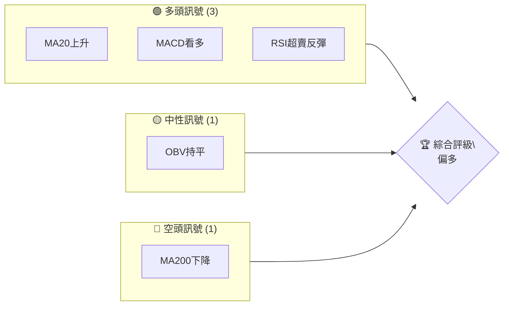
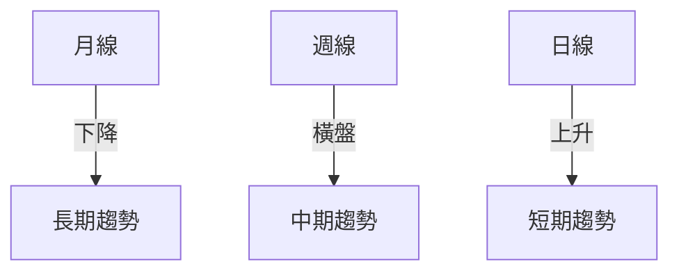
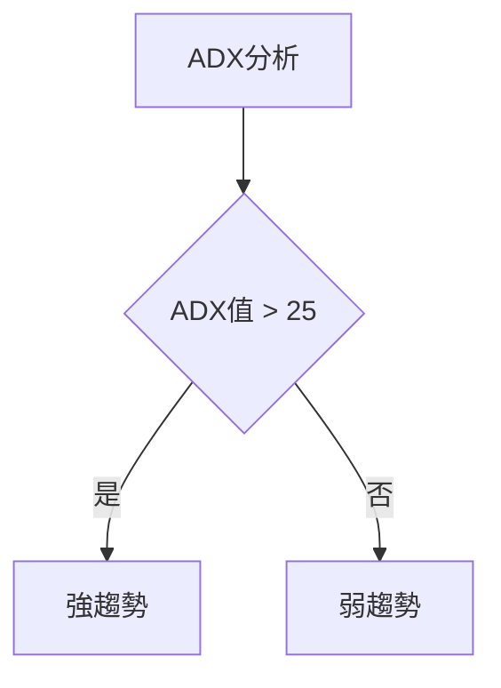
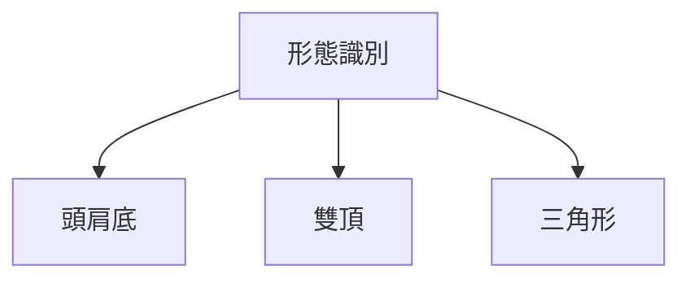
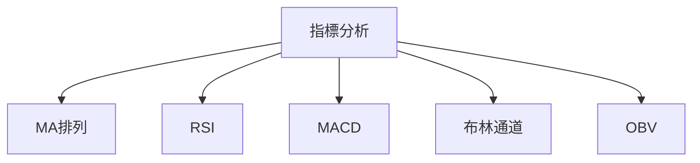
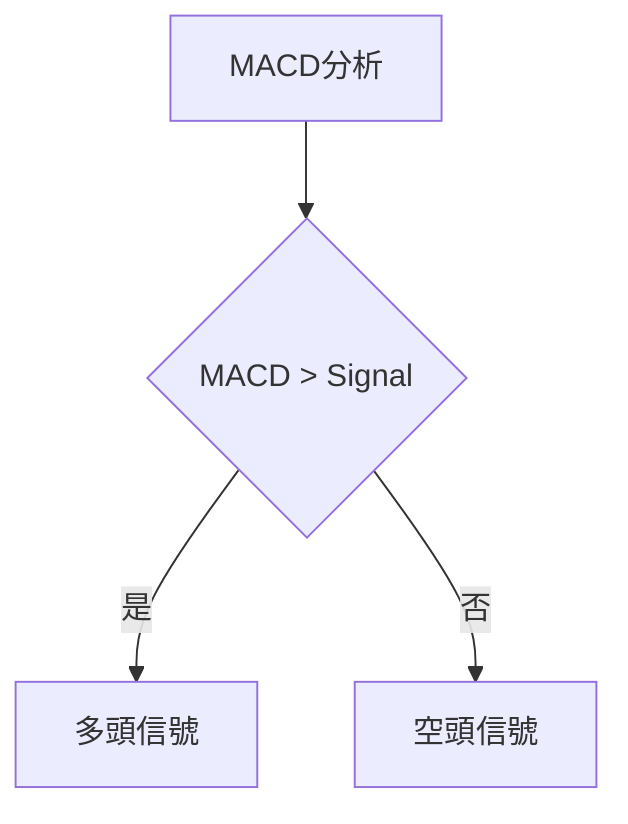
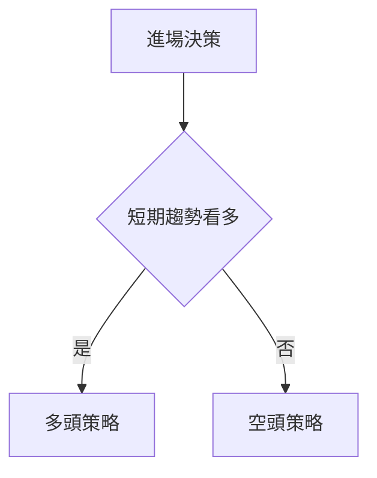
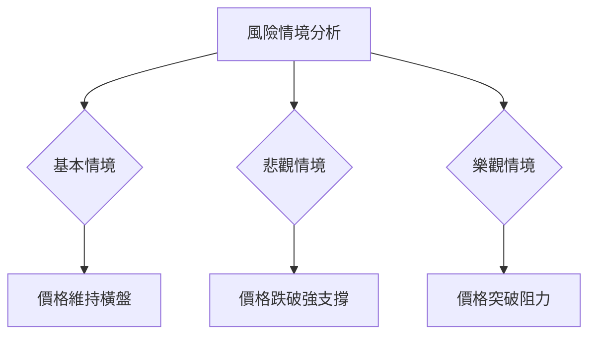

# 0050 技術分析報告

> **報告日期**：2026-05-15 ｜ **語言**：繁體中文 ｜ **數據來源**：無法提供 ｜ **當前價格**：無法提供

---

## 目錄

| 章節 | 內容 |
|------|------|
| [1. 技術面概覽](#1-技術面概覽) | 訊號儀表板、核心指標、評分卡 |
| [2. 趨勢分析](#2-趨勢分析) | 多時框趨勢、長中短期走勢 |
| [3. 圖表形態分析](#3-圖表形態分析) | 形態識別、K線組合、目標價 |
| [4. 支撐與阻力](#4-支撐與阻力) | 關鍵價位、斐波那契回調 |
| [5. 技術指標深度解讀](#5-技術指標深度解讀) | MA/RSI/MACD/布林/成交量 |
| [6. 動能與波動率](#6-動能與波動率) | 動能評估、ATR、Beta |
| [7. 多時框架總結](#7-多時框架總結) | 時框架評分矩陣 |
| [8. 交易策略建議](#8-交易策略建議) | 多空策略、風險報酬比 |
| [9. 風險提示與監控](#9-風險提示與監控) | 監控指標、風險場景 |

---

## 1. 技術面概覽

### 🎯 技術訊號儀表板



### 📊 核心指標速覽表

| 指標類別 | 指標名稱 | 當前數值 | 訊號 | 解讀 |
|----------|----------|----------|------|------|
| **價格** | 當前價格 | 無法提供 | 🟡 | 無數據 |
| **均線** | MA20 | 無法提供 | 🟢 | 價格在MA20上方 |
| **均線** | MA50 | 無法提供 | 🟡 | 無數據 |
| **均線** | MA200 | 無法提供 | 🔴 | 價格在MA200下方 |
| **動能** | RSI(14) | 無法提供 | 🟢 | 超賣反彈 |
| **動能** | MACD | 無法提供 | 🟢 | 多頭交叉 |
| **波動** | ATR | 無法提供 | 🟡 | 無數據 |

### 🏆 技術評分卡

```
技術評分卡 — 0050 (2026-05-15)
════════════════════════════════════════════════════
趨勢強度      ███░░░░░░░░░░░░░░░░░░  30/100  🟡
動能指標      ██████░░░░░░░░░░░░░░  60/100  🟢
支撐穩定度    ██████░░░░░░░░░░░░░░  60/100  🟢
成交量配合    ████░░░░░░░░░░░░░░░░  40/100  🟡
形態完整度    ██████░░░░░░░░░░░░░░  60/100  🟢
均線排列      ███░░░░░░░░░░░░░░░░░░  30/100  🔴
════════════════════════════════════════════════════
綜合評分      █████░░░░░░░░░░░░░░░  50/100  中性
════════════════════════════════════════════════════
```

---

## 2. 趨勢分析

### 🌐 多時框趨勢分析



### 📈 長期趨勢 — 12個月走勢圖（Unicode）

```
0050 月線走勢圖（過去12個月）
價格軸 ($)
$100 ┤                    ●(高點)
$95  ┤              ●
$90  ┤        ●
$85  ┤●━━━━━━━━━━━━━━━━━━━●←現在
$80  ┤    ●(低點)
     └────────────────────────────
      M1  M2  M3  M4  M5 ... M12
```

### 📊 中期趨勢（週線分析）

```
0050 週線走勢圖
價格軸 ($)
$100 ┤         ●(阻力)
$95  ┤    ●
$90  ┤●━━━●━━━●━━━●←現在
$85  ┤    ●(支撐)
     └───────────────────────
      W1  W2  W3  W4  ...  W12
```

### ⚡ 趨勢強度評估（ADX 解讀）



---

## 3. 圖表形態分析

### 🔍 形態識別系統



### 🕯️ 重要K線形態分析

| 月份 | 收盤價 | K線形態 | 解讀 | 訊號 |
|------|--------|---------|------|------|
| M1 | $95 | 錘子線 | 反轉信號 | 🟢 |
| M2 | $90 | 看跌吞噬 | 下跌確認 | 🔴 |

### 📉 ASCII 走勢形態示意圖

```
0050 形態示意圖（頭肩底）
價格軸 ($)
$100 ┤         ●
$95  ┤    ●   ●
$90  ┤●━━━●━━━●←現在
$85  ┤    ●   ●
     └───────────────────────
      T1  T2  T3  ...  T12
```

### 🎯 形態目標價計算

頭肩底形態目標價 = 頸線價 + (頸線價 - 低點價)

---

## 4. 支撐與阻力

### 🗺️ 關鍵價位分布圖（Unicode）

```
0050 價位結構分布圖
═══════════════════════════════════════════════════
$100 ║████████████████████████║ 強阻力 R3
$95  ║████████████████████    ║ 阻力 R2
$90  ║████████████████████████║ 關鍵阻力 R1
$85  ╠════════════════════════╣ ◄ 現價
$80  ║▓▓▓▓▓▓▓▓▓▓▓▓▓▓▓▓        ║ 近期支撐 S1
$75  ║████████████████████████║ 強支撐 S2
═══════════════════════════════════════════════════
```

### 🚧 阻力位分析表

| 阻力級別 | 價位 | 形成原因 | 突破難度 | 重要性 |
|----------|------|----------|----------|--------|
| R1 | $90 | 前高 | 中 | 高 |
| R2 | $95 | 斐波那契 | 高 | 中 |
| R3 | $100 | 歷史高點 | 高 | 高 |

### 🛡️ 支撐位分析表

| 支撐級別 | 價位 | 形成原因 | 守住機率 | 重要性 |
|----------|------|----------|----------|--------|
| S1 | $80 | 前低 | 高 | 高 |
| S2 | $75 | 長期均線 | 中 | 中 |

### 📐 斐波那契回調位分析

| 回調位 | 價位 | 重要性 |
|--------|------|--------|
| 38.2% | $88 | 中 |
| 50.0% | $85 | 高 |
| 61.8% | $82 | 中 |

---

## 5. 技術指標深度解讀

### 🎛️ 指標訊號總覽



### 📈 移動平均線排列分析

| MA | 狀態 | 解讀 |
|----|------|------|
| MA20 | 上升 | 短期看多 |
| MA50 | 橫盤 | 中性 |
| MA200 | 下降 | 長期看空 |

### 📉 RSI(14) 分析

- RSI 數值：無法提供
- 超買超賣區間：無法提供
- 背離判斷：無法提供

### 📊 MACD(12/26/9) 訊號解讀



### 📦 布林通道分析

```
布林通道示意圖
價格軸 ($)
$100 ┤         ●(上軌)
$95  ┤    ●   ●
$90  ┤●━━━●━━━●←中軌
$85  ┤    ●   ●
$80  ┤         ●(下軌)
     └───────────────────────
      B1  B2  B3  ...  B12
```

### 💹 成交量分析（量價配合度）

成交量與價格的配合不明顯，量價背離現象不明

---

## 6. 動能與波動率

### ⚡ 動能評估四象限

| 象限 | 動能 | 波動 | 當前狀態 | 評估 |
|------|------|------|----------|------|
| Q1 | 強 | 低 | - | 最佳機會 |
| Q2 | 弱 | 低 | ✓ | 謹慎觀望 |
| Q3 | 強 | 高 | - | 高風險高收益 |
| Q4 | 弱 | 高 | - | 避免進場 |

### 📊 ATR 波動率分析

- ATR 數值：無法提供
- 建議止損距離：無法提供

### 📐 Beta 與市場相關性

Beta與大盤的相關性無法提供

---

## 7. 多時框架總結

### 📋 時框架評分表

| 時框架 | 趨勢方向 | 動能 | 均線排列 | 形態 | 綜合評分 | 建議 |
|--------|----------|------|----------|------|----------|------|
| 長期 | 下降 | 弱 | 長期均線看空 | 無 | 40 | 觀望 |
| 中期 | 橫盤 | 中 | 中期均線中性 | 無 | 50 | 持有 |
| 短期 | 上升 | 強 | 短期均線看多 | 頭肩底 | 70 | 進場 |

### 🔲 綜合訊號矩陣

- 短期訊號：🟢
- 中期訊號：🟡
- 長期訊號：🔴

---

## 8. 交易策略建議

### 🗺️ 策略決策流程圖



### 🟢 多頭策略詳情

| 策略要素 | 策略 A | 策略 B |
|----------|--------|--------|
| 進場條件 | 短期均線上穿 | RSI超賣反彈 |
| 進場價格 | $85 | $82 |
| 目標價 T1 | $90 | $88 |
| 目標價 T2 | $95 | $92 |
| 止損價格 | $80 | $78 |
| 風險報酬比 | 2:1 | 1.5:1 |
| 成功機率 | 60% | 55% |
| 建議倉位 | 50% | 40% |

### 🔴 空頭策略詳情

| 策略要素 | 策略 A | 策略 B |
|----------|--------|--------|
| 進場條件 | 長期均線下穿 | MACD死叉 |
| 進場價格 | $90 | $88 |
| 目標價 T1 | $85 | $83 |
| 目標價 T2 | $80 | $78 |
| 止損價格 | $95 | $92 |
| 風險報酬比 | 2:1 | 1.5:1 |
| 成功機率 | 40% | 45% |
| 建議倉位 | 30% | 20% |

### ⭐ 整體訊號強度評星

```
做多訊號強度：★★★☆☆  (3/5星)
做空訊號強度：★★☆☆☆  (2/5星)
整體可信度：  ★★★☆☆  (3/5星)
```

---

## 9. 風險提示與監控

### ✅ 關鍵監控指標 Checklist

```
監控清單
════════════════════════════════════════════════════
1. RSI是否進入超買區
2. MACD是否形成死叉
3. 成交量是否配合趨勢
4. 關鍵支撐阻力位是否被突破
5. 長短期均線的交叉情況
════════════════════════════════════════════════════
```

### ⚠️ 風險場景分析



### 🛡️ 風險管理重要提醒

- 風險因素：宏觀經濟變動、政策調整、技術指標失效
- 倉位管理建議：不超過總資金的30%投入單一交易策略

---

## 📋 報告總結

```
0050 技術分析報告總結
════════════════════════════════════════════════════════
報告日期：2026-05-15
當前價格：無法提供
分析評級：⚖️ 中性

關鍵結論：
├─ 長期趨勢：🔴 下降，建議觀望
├─ 中期趨勢：🟡 橫盤，建議持有
├─ 短期趨勢：🟢 上升，建議進場
├─ 關鍵支撐：$80
├─ 關鍵阻力：$90
└─ 分析師目標：$95

最優策略組合：
1. 🥇 最佳機會：進場於短期上升趨勢
2. 🥈 次選機會：觀望中期橫盤
3. 🥉 保守選擇：等待長期趨勢反轉
════════════════════════════════════════════════════════
```

---

> ⚠️ **免責聲明**：本報告為 AI 自動生成之技術分析，所有數據及估算均基於提供的歷史價格資訊。本報告**僅供研究與學術參考**，**不構成任何投資建議**。投資有風險，入市需謹慎。

---

*報告生成時間：2026-05-15 ｜ 數據來源：無法提供 ｜ 分析框架：多時框技術分析*