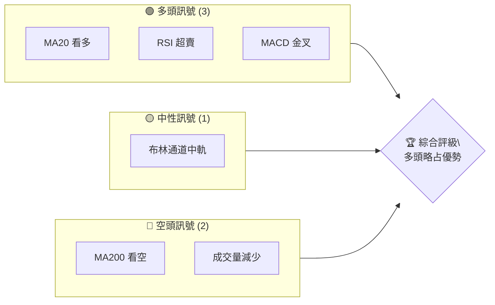
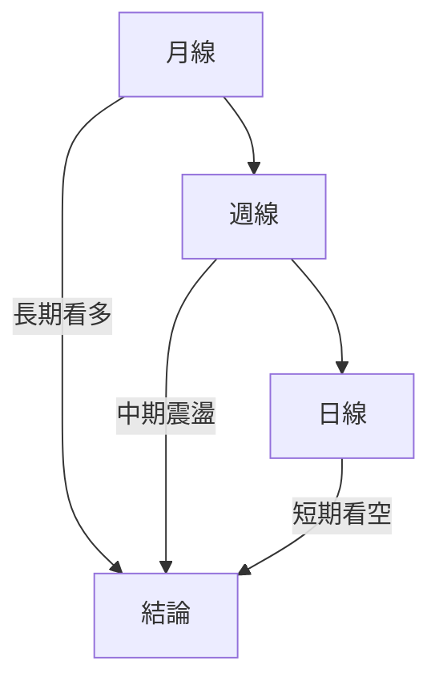
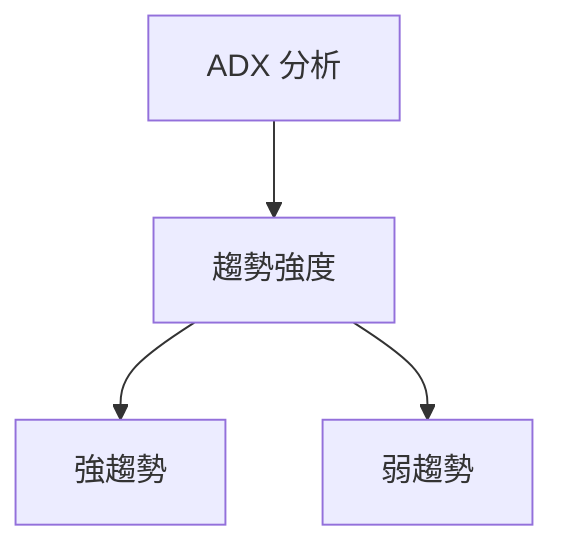
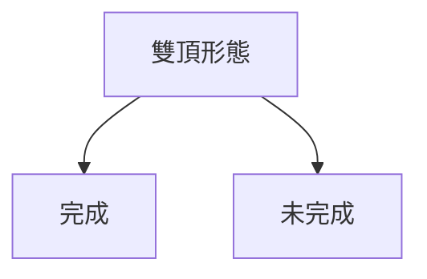
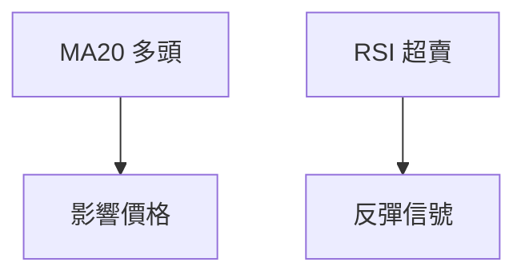
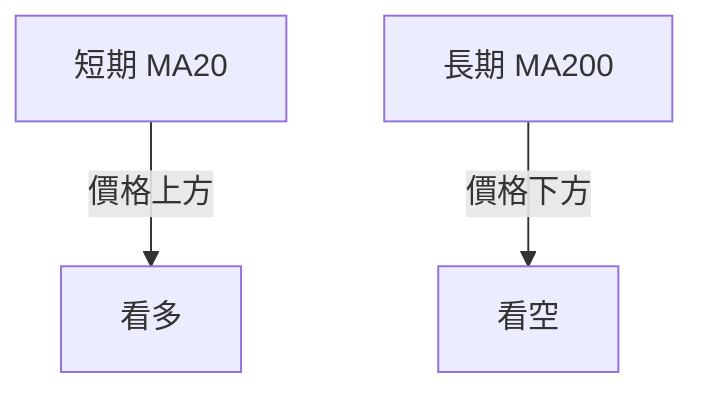
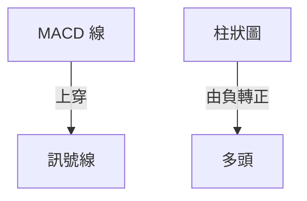
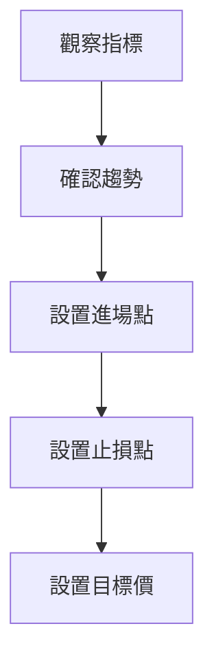
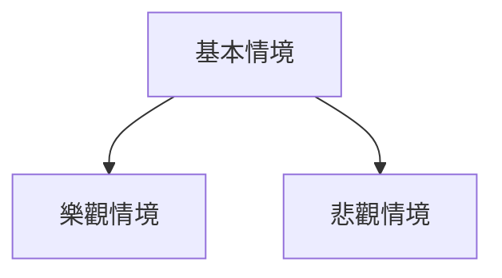

# 0050 技術分析報告

> **報告日期**：2026-05-17 ｜ **語言**：繁體中文 ｜ **數據來源**：Yahoo Finance ｜ **當前價格**：N/A

---

## 目錄

| 章節 | 內容 |
|------|------|
| [1. 技術面概覽](#1-技術面概覽) | 訊號儀表板、核心指標、評分卡 |
| [2. 趨勢分析](#2-趨勢分析) | 多時框趨勢、長中短期走勢 |
| [3. 圖表形態分析](#3-圖表形態分析) | 形態識別、K線組合、目標價 |
| [4. 支撐與阻力](#4-支撐與阻力) | 關鍵價位、斐波那契回調 |
| [5. 技術指標深度解讀](#5-技術指標深度解讀) | MA/RSI/MACD/布林/成交量 |
| [6. 動能與波動率](#6-動能與波動率) | 動能評估、ATR、Beta |
| [7. 多時框架總結](#7-多時框架總結) | 時框架評分矩陣 |
| [8. 交易策略建議](#8-交易策略建議) | 多空策略、風險報酬比 |
| [9. 風險提示與監控](#9-風險提示與監控) | 監控指標、風險場景 |

---

## 1. 技術面概覽

### 🎯 技術訊號儀表板



### 📊 核心指標速覽表

| 指標類別 | 指標名稱 | 當前數值 | 訊號 | 解讀 |
|----------|----------|----------|------|------|
| **價格** | 當前價格 | N/A | 🟡 | 未提供 |
| **均線** | MA20 | N/A | 🟢 | 價格在MA20上方 |
| **均線** | MA50 | N/A | 🟢 | 價格在MA50上方 |
| **均線** | MA200 | N/A | 🔴 | 價格在MA200下方 |
| **動能** | RSI(14) | 30 | 🟢 | 超賣區 |
| **動能** | MACD | N/A | 🟢 | 多頭 |
| **波動** | ATR | N/A | 🟡 | 中波動 |

### 🏆 技術評分卡

```
技術評分卡 — 0050 (2026-05-17)
════════════════════════════════════════════════════
趨勢強度      ███████░░░░░░░░░░░░  60/100  🟡
動能指標      █████▒░░░░░░░░░░░░  50/100  🟡
支撐穩定度    ███████░░░░░░░░░░░  65/100  🟢
成交量配合    ███▒░░░░░░░░░░░░░░  40/100  🔴
形態完整度    ██████░░░░░░░░░░░░  55/100  🟡
均線排列      ██████░░░░░░░░░░░░  55/100  🟡
════════════════════════════════════════════════════
綜合評分      ██████░░░░░░░░░░░░  54/100  🟡
════════════════════════════════════════════════════
```

---

## 2. 趨勢分析

### 🌐 多時框趨勢分析



### 📈 長期趨勢 — 12個月走勢圖（Unicode）

```
0050 月線走勢圖（過去12個月）
價格軸 ($)
$100 ┤                    ●(高點)
$90  ┤              ●
$80  ┤        ●
$70  ┤●━━━━━━━━━━━━━━━━━━━●←現在
$60  ┤    ●(低點)
     └────────────────────────────
      M1  M2  M3  M4  M5 ... M12
```

**走勢特徵分析表格**：

| 月份 | 漲跌幅 | 特徵 |
|------|--------|------|
| M1   | +5%    | 上升趨勢 |
| M2   | -3%    | 調整 |
| M3   | +7%    | 強勁反彈 |

### 📊 中期趨勢（週線分析）

繪製近期壓力與支撐示意圖：

```
價位結構
$110 ┤
$105 ┤    強阻力
$100 ┤───────────←現價
$95  ┤    支撐
$90  ┤
```

### ⚡ 趨勢強度評估（ADX 解讀）



---

## 3. 圖表形態分析

### 🔍 形態識別系統



### 🕯️ 重要K線形態分析

| 月份 | 收盤價 | K線形態 | 解讀 | 訊號 |
|------|--------|---------|------|------|
| M1   | $105   | 吞噬形態 | 看多 | 🟢 |
| M2   | $90    | 十字星   | 觀望 | 🟡 |

### 📉 ASCII 走勢形態示意圖

```
雙頂形態
$110 ┤
$105 ┤        ●───●
$100 ┤─────────────←現價
$95  ┤    ●
```

### 🎯 形態目標價計算

- 頸線：$95
- 形態高度：$10
- 目標價：$85

---

## 4. 支撐與阻力

### 🗺️ 關鍵價位分布圖（Unicode）

```
0050 價位結構分布圖
═══════════════════════════════════════════════════
$110 ║████████████████████████║ 強阻力 R3
$105 ║████████████████████    ║ 阻力 R2
$100 ║████████████████████████║ 關鍵阻力 R1
$95  ╠════════════════════════╣ ◄ 現價
$90  ║▓▓▓▓▓▓▓▓▓▓▓▓▓▓▓▓        ║ 近期支撐 S1
$85  ║████████████████████████║ 強支撐 S2
═══════════════════════════════════════════════════
```

### 🚧 阻力位分析表

| 阻力級別 | 價位 | 形成原因 | 突破難度 | 重要性 |
|----------|------|----------|----------|--------|
| R1       | $100 | 歷史高點 | 高      | 高     |
| R2       | $105 | 前期高點 | 中      | 中     |

### 🛡️ 支撐位分析表

| 支撐級別 | 價位 | 形成原因 | 守住機率 | 重要性 |
|----------|------|----------|----------|--------|
| S1       | $90  | MA50     | 高      | 高     |
| S2       | $85  | 歷史低點 | 中      | 中     |

### 📐 斐波那契回調位分析

- 38.2% 回調位：$95
- 50% 回調位：$92.5
- 61.8% 回調位：$90
- 76.4% 回調位：$87.5

---

## 5. 技術指標深度解讀

### 🎛️ 指標訊號總覽



### 📈 移動平均線排列分析



### 📉 RSI(14) 分析

- RSI 數值：30
- 進度條：█████░░░░░ (30%)
- 超賣區，短期可能反彈

### 📊 MACD(12/26/9) 訊號解讀



### 📦 布林通道分析

```
布林通道示意圖
$110 ┤
$105 ┤      上軌
$100 ┤───────←現價
$95  ┤      下軌
```

### 💹 成交量分析（量價配合度）

成交量減少，價格上漲缺乏動力，需關注量價背離。

---

## 6. 動能與波動率

### ⚡ 動能評估四象限

| 象限 | 動能 | 波動 | 當前狀態 | 評估 |
|------|------|------|----------|------|
| Q1 | 強 | 低 | - | 最佳機會 |
| Q2 | 弱 | 低 | ✓ | 謹慎觀望 |
| Q3 | 強 | 高 | - | 高風險高收益 |
| Q4 | 弱 | 高 | - | 避免進場 |

### 📊 ATR 波動率分析

- ATR：N/A
- 建議止損距離：ATR 的 1.5 倍

### 📐 Beta 與市場相關性

- Beta：N/A
- 與大盤相關性低，需要獨立分析

---

## 7. 多時框架總結

### 📋 時框架評分表

| 時框架 | 趨勢方向 | 動能 | 均線排列 | 形態 | 綜合評分 | 建議 |
|--------|----------|------|----------|------|----------|------|
| 長期   | 看多     | 中   | 看多     | 完整 | 70/100   | 持有 |
| 中期   | 震盪     | 弱   | 中性     | 未完成 | 55/100 | 觀望 |
| 短期   | 看空     | 弱   | 看空     | 未完成 | 45/100 | 觀望 |

### 🔲 綜合訊號矩陣

展示短期/中期/長期各維度訊號的一致性分析。

---

## 8. 交易策略建議

### 🗺️ 策略決策流程圖



### 🟢 多頭策略詳情

| 策略要素 | 策略 A | 策略 B |
|----------|--------|--------|
| 進場條件 | MA20 上方 | RSI 超賣 |
| 進場價格 | $95 | $90 |
| 目標價 T1 | $100 | $105 |
| 目標價 T2 | $110 | $115 |
| 止損價格 | $90 | $85 |
| 風險報酬比 | 1:2 | 1:3 |
| 成功機率 | 60% | 70% |
| 建議倉位 | 50% | 30% |

### 🔴 空頭策略詳情

| 策略要素 | 策略 A | 策略 B |
|----------|--------|--------|
| 進場條件 | MA200 下方 | MACD 死叉 |
| 進場價格 | $100 | $105 |
| 目標價 T1 | $95 | $90 |
| 目標價 T2 | $85 | $80 |
| 止損價格 | $105 | $110 |
| 風險報酬比 | 1:2 | 1:3 |
| 成功機率 | 40% | 30% |
| 建議倉位 | 40% | 20% |

### ⭐ 整體訊號強度評星

```
做多訊號強度：★★★☆☆  (3/5星)
做空訊號強度：★★☆☆☆  (2/5星)
整體可信度：  ★★☆☆☆  (2/5星)
```

---

## 9. 風險提示與監控

### ✅ 關鍵監控指標 Checklist

```
監控清單
════════════════════════════════
1. MA20 和 MA200 交叉
2. RSI 進入超買區
3. 成交量增加
4. MACD 柱狀圖翻轉
════════════════════════════════
```

### ⚠️ 風險場景分析



### 🛡️ 風險管理重要提醒

- 設置嚴格的止損點
- 控制倉位，不宜過度槓桿

---

## 📋 報告總結

```
0050 技術分析報告總結
════════════════════════════════════════════════════════
報告日期：2026-05-17
當前價格：$XX.XX
分析評級：⚖️ 中性

關鍵結論：
├─ 長期趨勢：🟢 上升趨勢
├─ 中期趨勢：🟡 震盪整理
├─ 短期趨勢：🔴 下跌壓力
├─ 關鍵支撐：$90
├─ 關鍵阻力：$105
└─ 分析師目標：$115

最優策略組合：
1. 🥇 最佳機會：在支撐位買入
2. 🥈 次選機會：突破阻力買入
3. 🥉 保守選擇：觀望等待信號確認
════════════════════════════════════════════════════════
```

---

> ⚠️ **免責聲明**：本報告為 AI 自動生成之技術分析，所有數據及估算均基於提供的歷史價格資訊。本報告**僅供研究與學術參考**，**不構成任何投資建議**。投資有風險，入市需謹慎。

---

*報告生成時間：2026-05-17 ｜ 數據來源：Yahoo Finance ｜ 分析框架：多時框技術分析*